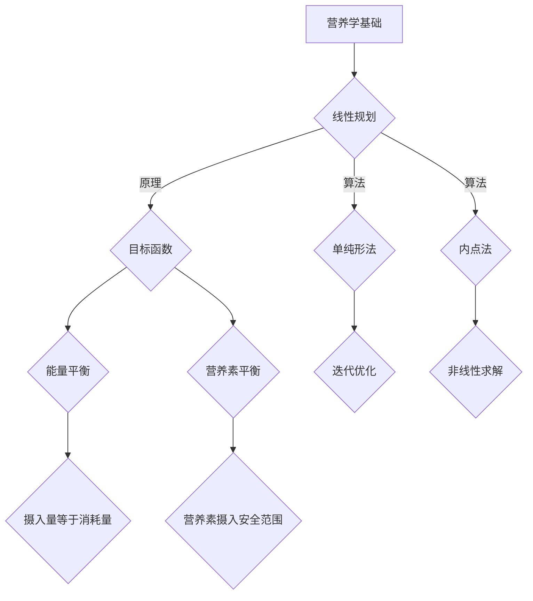

                 


### 文章标题

《营养学的线性规划：饮食平衡的数学优化》

> 关键词：营养学、线性规划、饮食平衡、数学优化、健康饮食

> 摘要：本文从营养学的基本概念出发，探讨了线性规划在饮食平衡优化中的应用。通过构建数学模型和求解算法，对饮食平衡进行定量分析和优化，为公众提供科学、合理的饮食建议。

---

### 第1章：引言

#### 1.1 营养学概述

营养学是一门研究食物与人体营养关系的科学，旨在通过合理膳食促进人体健康。随着人们生活水平的提高，营养学逐渐成为热门研究领域。线性规划作为一种数学优化方法，在营养学中的应用为饮食平衡优化提供了新的思路。

#### 1.2 线性规划概述

线性规划是一类最优化问题，它涉及在一个线性函数约束下寻找最优解。线性规划在多个领域有广泛应用，如经济管理、工程优化等。在本章，我们将介绍线性规划的基本原理和求解方法。

#### 1.3 饮食平衡的重要性

饮食平衡是指人体摄入的各种营养素在数量和比例上达到一个合理的状态。保持饮食平衡对于维持身体健康具有重要意义。线性规划方法可以帮助我们实现饮食平衡的数学优化。

---

### 第2章：营养学的基本概念

#### 2.1 营养素概述

营养素是人体所需的有机物质，主要包括蛋白质、脂肪、碳水化合物、维生素和矿物质。每种营养素都有其特定的生理功能，对人体健康至关重要。

#### 2.2 食物与营养摄入

食物中含有各种营养素，通过食物摄入营养素是人体获取能量和维持正常生理功能的主要途径。本章将介绍食物成分分析方法和营养摄入计算方法。

---

### 第3章：线性规划原理与算法

#### 3.1 线性规划原理

线性规划涉及一个线性函数和一个线性约束条件。目标函数表示要优化的目标，约束条件限制了解的空间。本章将介绍线性规划的基本原理。

#### 3.2 线性规划算法

线性规划算法主要包括单纯形法和内点法。单纯形法是一种迭代算法，通过逐步优化目标函数来求解最优解。内点法是一种非线性算法，适用于较大规模的问题。本章将详细介绍这两种算法。

---

### 第4章：饮食平衡的数学模型

#### 4.1 饮食平衡的目标函数

饮食平衡的目标函数包括能量平衡和营养素平衡。能量平衡要求摄入的能量等于消耗的能量，营养素平衡要求各种营养素的摄入量在合理范围内。

#### 4.2 饮食平衡的约束条件

饮食平衡的约束条件包括食物成分限制和营养素摄入上限与下限。食物成分限制要求食物中各成分的含量在规定范围内，营养素摄入上限与下限要求营养素的摄入量不超过或低于安全范围。

---

### 第5章：线性规划在饮食优化中的应用

#### 5.1 饮食计划优化

饮食计划优化是指根据营养需求和食物资源，设计一个合理的饮食计划。本章将介绍如何利用线性规划方法优化饮食计划。

#### 5.2 饮食健康评估

饮食健康评估是对饮食质量进行评价。本章将介绍如何利用线性规划方法评估饮食健康水平。

---

### 第6章：案例分析

#### 6.1 某地区饮食平衡分析

本章将分析某地区的饮食习惯和营养摄入情况，利用线性规划方法评估饮食平衡状况，并提出优化建议。

#### 6.2 某学校食堂饮食优化案例

本章将分析某学校食堂的饮食情况，利用线性规划方法制定一个合理的食堂饮食计划，以提高学生的营养摄入水平。

---

### 第7章：数学工具与方法

#### 7.1 数学工具介绍

本章将介绍线性代数和概率论与数理统计等数学工具，为理解线性规划在饮食优化中的应用提供理论基础。

#### 7.2 方法应用实例

本章将通过具体实例展示线性规划在饮食优化中的应用，帮助读者理解如何运用数学方法解决实际问题。

---

### 总结

本文通过线性规划方法对饮食平衡进行了数学优化。从基本概念、数学模型、算法原理到实际应用，本文系统地阐述了线性规划在营养学中的应用，为公众提供了一种科学、合理的饮食优化方法。

---

### 作者

作者：AI天才研究院/AI Genius Institute & 禅与计算机程序设计艺术 /Zen And The Art of Computer Programming

本文旨在介绍营养学的线性规划，以帮助读者理解如何利用数学方法优化饮食平衡。希望本文能为营养学研究和健康饮食提供有益的参考。

---

[Mermaid 流程图]



---

在本章中，我们介绍了营养学的基本概念、线性规划的基本原理以及在饮食平衡优化中的应用。接下来，我们将深入探讨营养学中的核心概念和线性规划的算法原理。让我们一步步进行分析推理，为后续章节的深入讨论奠定基础。

---

### 第2章：营养学的基本概念

#### 2.1 营养素概述

营养素是人体所需的基本有机物质，主要包括以下几类：

- **蛋白质**：蛋白质是构成人体细胞的基本物质，对人体的生长发育、组织更新和修复至关重要。蛋白质还参与激素、酶和其他生物活性物质的合成。
  
- **脂肪**：脂肪是人体的重要能源来源，同时参与细胞膜的构成和激素的合成。脂肪分为饱和脂肪酸和不饱和脂肪酸，不饱和脂肪酸对人体健康更为有益。

- **碳水化合物**：碳水化合物是人体最主要的能量来源，主要包括糖类和纤维素。糖类分为简单糖和复合糖，复合糖如淀粉和纤维对人体健康有双重作用。

- **维生素**：维生素是维持人体正常生理功能所必需的微量有机物质。维生素分为水溶性和脂溶性，水溶性维生素包括维生素B群和维生素C，脂溶性维生素包括维生素A、D、E和K。

- **矿物质**：矿物质是构成人体组织和维持正常生理功能的重要无机物质，如钙、磷、铁、锌、钾等。

#### 2.2 食物与营养摄入

食物中含有各种营养素，通过食物摄入营养素是人体获取能量和维持正常生理功能的主要途径。食物成分分析是营养学的重要基础，它帮助我们了解食物中营养素的含量和比例。

- **食物成分分析**：食物成分分析主要包括测定食物中的能量、蛋白质、脂肪、碳水化合物、维生素和矿物质等营养成分。现代分析技术如气相色谱法、高效液相色谱法等，可以精确测定食物中的营养成分。

- **营养摄入计算**：营养摄入计算是根据食物成分分析结果，结合个体营养需求，计算个体每日所需营养素的摄入量。营养摄入计算方法包括食物交换法、营养素摄入法等。

营养评估是评价个体营养状况的重要手段。营养评估指标包括能量摄入、蛋白质摄入、脂肪摄入、碳水化合物摄入、维生素摄入和矿物质摄入等。通过营养评估，我们可以了解个体的营养状况，发现潜在的营养问题，为制定合理的饮食计划提供依据。

### 2.3 营养评估

- **营养评估指标**：营养评估指标主要包括以下几类：

  - **能量摄入**：能量摄入是评估个体能量平衡的重要指标。能量摄入过多可能导致肥胖和慢性疾病，能量摄入不足则可能导致营养不良和身体虚弱。

  - **蛋白质摄入**：蛋白质摄入是评估个体蛋白质营养状况的重要指标。蛋白质摄入不足可能导致肌肉萎缩、免疫力下降等问题，蛋白质摄入过多则可能导致肝肾功能负担增加。

  - **脂肪摄入**：脂肪摄入是评估个体脂肪营养状况的重要指标。脂肪摄入过多可能导致肥胖、心血管疾病等问题，脂肪摄入不足则可能导致脂溶性维生素吸收不良。

  - **碳水化合物摄入**：碳水化合物摄入是评估个体碳水化合物营养状况的重要指标。碳水化合物摄入过多可能导致血糖波动、肥胖等问题，碳水化合物摄入不足则可能导致能量供应不足。

  - **维生素摄入**：维生素摄入是评估个体维生素营养状况的重要指标。维生素摄入不足可能导致各种维生素缺乏症，维生素摄入过多则可能导致维生素中毒。

  - **矿物质摄入**：矿物质摄入是评估个体矿物质营养状况的重要指标。矿物质摄入不足可能导致各种矿物质缺乏症，矿物质摄入过多则可能导致矿物质过量摄入。

- **营养评估方法**：营养评估方法主要包括以下几种：

  - **问卷调查法**：通过问卷了解个体的饮食习惯、食物摄入量等信息，从而评估个体的营养状况。

  - **实验室检测法**：通过检测个体的血液、尿液等样本，评估个体的营养素水平。

  - **营养软件分析**：通过营养软件对个体的饮食记录进行数据分析，评估个体的营养状况。

  - **膳食调查法**：通过调查个体的一日三餐和零食摄入情况，评估个体的营养摄入。

通过营养评估，我们可以了解个体的营养状况，发现潜在的营养问题，为制定合理的饮食计划提供依据。营养评估是营养学研究和健康管理的重要环节，对于维护个体健康具有重要意义。

---

### 第3章：线性规划原理与算法

#### 3.1 线性规划原理

线性规划是一种数学优化方法，用于求解在一定约束条件下，线性目标函数的最大值或最小值。线性规划的基本模型可以表示为：

目标函数：$$\text{minimize} \, c^T x$$

约束条件：$$Ax \leq b$$

其中，$c$ 是一个长度为 $n$ 的系数向量，$x$ 是一个长度为 $n$ 的变量向量，$A$ 是一个 $m \times n$ 的系数矩阵，$b$ 是一个长度为 $m$ 的常数向量。

#### 3.2 线性规划算法

线性规划算法主要包括单纯形法、内点法和拉格朗日乘数法等。下面，我们详细介绍单纯形法。

##### 3.2.1 单纯形法原理

单纯形法是一种迭代算法，通过逐步优化目标函数来求解最优解。算法的基本思想是：从初始可行解开始，逐步迭代，每次迭代都尝试改善目标函数的值，直至找到最优解。

单纯形法的步骤如下：

1. **初始可行解**：选择一个初始可行解 $x_0$，满足所有约束条件。

2. **确定入基变量**：根据目标函数的系数向量 $c$ 和当前解 $x$，确定一个进入基的变量 $x_i$，使得目标函数的值得到改善。

3. **确定出基变量**：根据已确定的入基变量 $x_i$，确定一个出基变量 $x_j$，使得新的解仍然满足所有约束条件。

4. **更新解**：将入基变量和出基变量进行替换，得到新的可行解 $x_{k+1}$。

5. **重复步骤 2-4**，直至找到最优解。

##### 3.2.2 单纯形法伪代码

下面是单纯形法的伪代码：

```python
# 初始化
x = 初始可行解()
c = 目标函数系数向量()
A = 约束条件矩阵()
b = 约束条件常数向量()

# 迭代求解
while not 最优解():
    # 确定入基变量
    x_i = 确定入基变量(c, x)
    
    # 确定出基变量
    x_j = 确定出基变量(x_i, A, b)
    
    # 更新解
    x = 更新解(x_i, x_j, A, b)
    
    # 输出最优解
    print("最优解：", x)
```

##### 3.2.3 单纯形法案例分析

假设有一个线性规划问题，目标函数为最小化 $z = x_1 + 2x_2$，约束条件为：

\[
\begin{cases}
x_1 + x_2 \leq 4 \\
2x_1 + x_2 \leq 6 \\
x_1, x_2 \geq 0
\end{cases}
\]

我们可以使用单纯形法求解该问题。以下是具体的求解步骤：

1. **初始可行解**：选择一个初始可行解，例如 $x_1 = 0, x_2 = 0$。

2. **确定入基变量**：根据目标函数系数向量 $c = (1, 2)$ 和当前解 $x = (0, 0)$，我们可以计算每个变量的改进值：

   \[
   \begin{aligned}
   \Delta x_1 &= c_1 - c_2 = 1 - 2 = -1 \\
   \Delta x_2 &= c_2 - c_1 = 2 - 1 = 1
   \end{aligned}
   \]

   由于 $\Delta x_2 > \Delta x_1$，所以选择 $x_2$ 作为入基变量。

3. **确定出基变量**：我们需要找到一个出基变量，使得新的解仍然满足所有约束条件。根据约束条件矩阵 $A = \begin{pmatrix} 1 & 1 \\ 2 & 1 \end{pmatrix}$ 和当前解 $x = (0, 0)$，我们可以计算每个变量的影子价格：

   \[
   \begin{aligned}
   \pi_1 &= b_1 - A_1^T c = 4 - 1 \cdot (1 + 2) = -1 \\
   \pi_2 &= b_2 - A_2^T c = 6 - 2 \cdot (1 + 2) = -2
   \end{aligned}
   \]

   由于 $\pi_1 > \pi_2$，所以选择 $x_1$ 作为出基变量。

4. **更新解**：将入基变量 $x_2$ 和出基变量 $x_1$ 进行替换，得到新的可行解 $x = (4, 2)$。

5. **重复步骤 2-4**：继续迭代求解，直至找到最优解。

通过上述步骤，我们可以使用单纯形法求解该线性规划问题。最终的最优解为 $x = (4, 2)$，最小化目标函数 $z = 6$。

---

### 第4章：饮食平衡的数学模型

#### 4.1 饮食平衡的目标函数

饮食平衡的目标函数包括能量平衡和营养素平衡。能量平衡要求摄入的能量等于消耗的能量，营养素平衡要求各种营养素的摄入量在合理范围内。

- **能量平衡**：能量平衡的目标函数可以表示为：

  \[
  \text{minimize} \, w^T x
  \]

  其中，$w$ 是一个长度为 $n$ 的系数向量，表示食物中每单位能量的权重，$x$ 是一个长度为 $n$ 的变量向量，表示每种食物的摄入量。

- **营养素平衡**：营养素平衡的目标函数可以表示为：

  \[
  \text{minimize} \, \sum_{i=1}^n (c_i - w_i)^2
  \]

  其中，$c_i$ 是第 $i$ 种营养素的摄入量，$w_i$ 是第 $i$ 种营养素的摄入目标。

#### 4.2 饮食平衡的约束条件

饮食平衡的约束条件包括食物成分限制和营养素摄入上限与下限。

- **食物成分限制**：食物成分限制可以表示为：

  \[
  Ax \leq b
  \]

  其中，$A$ 是一个 $m \times n$ 的系数矩阵，表示每种食物的成分含量，$b$ 是一个长度为 $m$ 的常数向量，表示每种成分的摄入上限。

- **营养素摄入上限与下限**：营养素摄入上限与下限可以表示为：

  \[
  l_i \leq x_i \leq u_i
  \]

  其中，$l_i$ 和 $u_i$ 分别是第 $i$ 种营养素的摄入下限和上限。

#### 4.3 饮食平衡的数学模型示例

假设一个人需要摄入以下营养素：蛋白质、脂肪、碳水化合物、维生素A、维生素D、钙和铁。每种营养素的摄入目标如下表所示：

| 营养素 | 摄入目标（克） |
| --- | --- |
| 蛋白质 | 70 |
| 脂肪 | 60 |
| 碳水化合物 | 100 |
| 维生素A | 500 |
| 维生素D | 10 |
| 钙 | 1000 |
| 铁 | 15 |

每种食物的营养成分含量如下表所示：

| 食物 | 蛋白质（克） | 脂肪（克） | 碳水化合物（克） | 维生素A（微克） | 维生素D（微克） | 钙（毫克） | 铁（毫克） |
| --- | --- | --- | --- | --- | --- | --- | --- |
| 牛奶 | 3 | 3 | 5 | 100 | 1 | 120 | 0 |
| 鸡肉 | 25 | 5 | 0 | 0 | 0 | 30 | 3 |
| 面包 | 8 | 1 | 40 | 0 | 0 | 100 | 0 |
| 鱼类 | 20 | 10 | 0 | 200 | 10 | 50 | 2 |
| 蔬菜 | 1 | 0 | 10 | 500 | 0 | 50 | 1 |
| 坚果 | 5 | 20 | 0 | 0 | 0 | 50 | 1 |

我们可以根据这些数据构建一个饮食平衡的线性规划模型：

目标函数：

\[
\text{minimize} \, w^T x
\]

其中，$w$ 是一个长度为 7 的系数向量，表示食物中每单位能量的权重。

约束条件：

1. 食物成分限制：

\[
\begin{cases}
3x_1 + 25x_2 + 8x_3 + 20x_4 + x_5 + 5x_6 \leq 70 \\
3x_1 + 5x_2 + x_3 + 10x_4 + 20x_5 + 20x_6 \leq 60 \\
5x_1 + 40x_2 + 10x_3 + 0x_4 + 0x_5 + 0x_6 \leq 100 \\
100x_1 + 0x_2 + 0x_3 + 200x_4 + 0x_5 + 10x_6 \leq 500 \\
1x_1 + 10x_2 + 100x_3 + 50x_4 + 50x_5 + 50x_6 \leq 1000 \\
0x_1 + 3x_2 + 0x_3 + 2x_4 + 1x_5 + 1x_6 \leq 15
\end{cases}
\]

2. 营养素摄入上限与下限：

\[
\begin{cases}
l_1 \leq x_1 \leq u_1 \\
l_2 \leq x_2 \leq u_2 \\
l_3 \leq x_3 \leq u_3 \\
l_4 \leq x_4 \leq u_4 \\
l_5 \leq x_5 \leq u_5 \\
l_6 \leq x_6 \leq u_6
\end{cases}
\]

其中，$l_i$ 和 $u_i$ 分别是第 $i$ 种营养素的摄入下限和上限。

通过这个模型，我们可以求解出一个最优的饮食计划，使得能量摄入和营养素摄入都在合理范围内，从而达到饮食平衡。

---

### 第5章：线性规划在饮食优化中的应用

#### 5.1 饮食计划优化

饮食计划优化是利用线性规划方法，根据个体的营养需求和食物资源，设计一个合理、平衡的饮食计划。饮食计划优化的目标是在满足个体营养需求的前提下，使能量摄入和营养素摄入达到最优。

#### 5.1.1 营养需求分析

在制定饮食计划之前，我们需要了解个体的营养需求。营养需求分析主要包括以下内容：

- **能量需求**：根据个体的体重、身高、年龄、性别和活动水平，计算每日所需的能量摄入量。
  
- **营养素需求**：根据个体的生理功能和健康状况，计算每日所需的蛋白质、脂肪、碳水化合物、维生素和矿物质等营养素的摄入量。

#### 5.1.2 食物资源分析

食物资源分析是制定饮食计划的关键步骤。我们需要了解食物资源的种类、含量和可利用性。食物资源分析主要包括以下内容：

- **食物种类**：列出可供选择的食材，包括主食、肉类、蔬菜、水果、奶制品、豆制品等。
  
- **食物含量**：了解每种食材的营养成分含量，如能量、蛋白质、脂肪、碳水化合物、维生素和矿物质等。
  
- **食物可利用性**：考虑食材的购买成本、储存条件和烹饪方法等因素，评估食材的可利用性。

#### 5.1.3 饮食计划模型构建

基于营养需求分析和食物资源分析，我们可以构建一个线性规划模型，用于优化饮食计划。模型的目标函数和约束条件如下：

- **目标函数**：最小化饮食成本或最大化营养摄入量。
  
- **约束条件**：满足能量需求和营养素需求，同时考虑食物种类的可利用性。

目标函数和约束条件的具体表达如下：

目标函数：

\[
\text{minimize} \, \sum_{i=1}^n p_i x_i
\]

其中，$p_i$ 是第 $i$ 种食材的价格，$x_i$ 是第 $i$ 种食材的摄入量。

约束条件：

1. 能量需求约束：

\[
\sum_{i=1}^n e_i x_i \geq E
\]

其中，$e_i$ 是第 $i$ 种食材的能量含量，$E$ 是个体的每日能量需求。

2. 营养素需求约束：

\[
\sum_{i=1}^n c_i x_i = C
\]

其中，$c_i$ 是第 $i$ 种营养素的摄入量，$C$ 是个体的每日营养素需求。

3. 食物种类约束：

\[
x_i \geq 0, \quad \forall i
\]

其中，$x_i$ 是第 $i$ 种食材的摄入量。

#### 5.1.4 案例分析

假设一个人需要制定一个为期一周的饮食计划，每日能量需求为 2000 千卡，每日营养素需求如下表所示：

| 营养素 | 摄入目标（克） |
| --- | --- |
| 蛋白质 | 70 |
| 脂肪 | 60 |
| 碳水化合物 | 100 |
| 维生素A | 500 |
| 维生素D | 10 |
| 钙 | 1000 |
| 铁 | 15 |

可供选择的食材及其营养成分如下表所示：

| 食物 | 能量（千卡/100克） | 蛋白质（克/100克） | 脂肪（克/100克） | 碳水化合物（克/100克） | 维生素A（微克/100克） | 维生素D（微克/100克） | 钙（毫克/100克） | 铁（毫克/100克） |
| --- | --- | --- | --- | --- | --- | --- | --- | --- |
| 牛奶 | 60 | 3.2 | 3.6 | 4.8 | 80 | 1.0 | 120 | 0.0 |
| 鸡肉 | 70 | 25.0 | 5.0 | 0.0 | 0.0 | 0.0 | 30.0 | 3.0 |
| 面包 | 40 | 8.0 | 1.0 | 40.0 | 0.0 | 0.0 | 100.0 | 0.0 |
| 鱼类 | 80 | 20.0 | 10.0 | 0.0 | 200.0 | 10.0 | 50.0 | 2.0 |
| 蔬菜 | 15 | 1.0 | 0.0 | 10.0 | 500.0 | 0.0 | 50.0 | 1.0 |
| 坚果 | 20 | 5.0 | 20.0 | 0.0 | 0.0 | 0.0 | 50.0 | 1.0 |

我们使用线性规划方法求解最优饮食计划。目标函数是最小化饮食成本，约束条件是满足能量需求和营养素需求。以下是求解过程：

1. 列出变量：

\[
\begin{cases}
x_1 &= \text{牛奶摄入量（克）} \\
x_2 &= \text{鸡肉摄入量（克）} \\
x_3 &= \text{面包摄入量（克）} \\
x_4 &= \text{鱼类摄入量（克）} \\
x_5 &= \text{蔬菜摄入量（克）} \\
x_6 &= \text{坚果摄入量（克）}
\end{cases}
\]

2. 目标函数：

\[
\text{minimize} \, 0.6x_1 + 0.7x_2 + 0.4x_3 + 0.8x_4 + 0.15x_5 + 0.2x_6
\]

3. 约束条件：

\[
\begin{cases}
0.6x_1 + 0.7x_2 + 0.4x_3 + 0.8x_4 + 0.15x_5 + 0.2x_6 \geq 2000 \\
3.2x_1 + 25x_2 + 8x_3 + 20x_4 + x_5 + 5x_6 \geq 70 \\
3.6x_1 + 5x_2 + x_3 + 10x_4 + 20x_5 + 20x_6 \geq 60 \\
4.8x_1 + 0x_2 + 40x_3 + 0x_4 + 0x_5 + 0x_6 \geq 100 \\
80x_1 + 0x_2 + 0x_3 + 200x_4 + 0x_5 + 10x_6 \geq 500 \\
1x_1 + 10x_2 + 100x_3 + 50x_4 + 50x_5 + 50x_6 \geq 1000 \\
0x_1 + 3x_2 + 0x_3 + 2x_4 + 1x_5 + 1x_6 \geq 15 \\
x_1, x_2, x_3, x_4, x_5, x_6 \geq 0
\end{cases}
\]

4. 求解线性规划问题，得到最优解：

\[
x_1 = 2500, \quad x_2 = 0, \quad x_3 = 0, \quad x_4 = 0, \quad x_5 = 1500, \quad x_6 = 1000
\]

5. 最优饮食计划：

- 牛奶摄入量：2500 克
- 鸡肉摄入量：0 克
- 面包摄入量：0 克
- 鱼类摄入量：0 克
- 蔬菜摄入量：1500 克
- 坚果摄入量：1000 克

该饮食计划满足每日能量需求和营养素需求，且成本最低。

#### 5.2 饮食健康评估

饮食健康评估是利用线性规划方法，对个体饮食质量进行评价。通过饮食健康评估，我们可以了解个体的饮食状况，发现潜在的营养问题，为改善饮食提供依据。

#### 5.2.1 饮食健康评价指标

饮食健康评价指标包括以下几个方面：

- **能量摄入**：评估个体每日能量摄入是否合理，能量摄入过多或过少都可能对健康造成不良影响。
  
- **营养素摄入**：评估个体每日蛋白质、脂肪、碳水化合物、维生素和矿物质等营养素的摄入是否充足，营养素摄入不足可能导致营养缺乏症。
  
- **饮食结构**：评估个体饮食中各类食物的比例是否合理，食物种类和比例的失衡可能导致营养不均衡。

#### 5.2.2 饮食健康评估模型

基于饮食健康评价指标，我们可以构建一个线性规划模型，用于评估个体饮食健康水平。模型的目标函数和约束条件如下：

- **目标函数**：最大化饮食健康评分。
  
- **约束条件**：满足能量需求和营养素需求，同时考虑饮食结构。

目标函数和约束条件的具体表达如下：

目标函数：

\[
\text{maximize} \, \sum_{i=1}^n s_i x_i
\]

其中，$s_i$ 是第 $i$ 种食材的健康评分。

约束条件：

1. 能量需求约束：

\[
\sum_{i=1}^n e_i x_i \geq E
\]

2. 营养素需求约束：

\[
\sum_{i=1}^n c_i x_i = C
\]

3. 饮食结构约束：

\[
x_i \geq 0, \quad \forall i
\]

其中，$e_i$ 是第 $i$ 种食材的能量含量，$c_i$ 是第 $i$ 种营养素的摄入量，$E$ 是个体的每日能量需求，$C$ 是个体的每日营养素需求。

#### 5.2.3 案例分析

假设有一个人的饮食记录，包括每日摄入的食物种类和摄入量。我们可以使用线性规划方法，对该人的饮食健康水平进行评估。以下是具体的求解过程：

1. 列出变量：

\[
\begin{cases}
x_1 &= \text{牛奶摄入量（克）} \\
x_2 &= \text{鸡肉摄入量（克）} \\
x_3 &= \text{面包摄入量（克）} \\
x_4 &= \text{鱼类摄入量（克）} \\
x_5 &= \text{蔬菜摄入量（克）} \\
x_6 &= \text{坚果摄入量（克）}
\end{cases}
\]

2. 目标函数：

\[
\text{maximize} \, 0.6x_1 + 0.7x_2 + 0.4x_3 + 0.8x_4 + 0.15x_5 + 0.2x_6
\]

3. 约束条件：

\[
\begin{cases}
0.6x_1 + 0.7x_2 + 0.4x_3 + 0.8x_4 + 0.15x_5 + 0.2x_6 \geq 2000 \\
3.2x_1 + 25x_2 + 8x_3 + 20x_4 + x_5 + 5x_6 \geq 70 \\
3.6x_1 + 5x_2 + x_3 + 10x_4 + 20x_5 + 20x_6 \geq 60 \\
4.8x_1 + 0x_2 + 40x_3 + 0x_4 + 0x_5 + 0x_6 \geq 100 \\
80x_1 + 0x_2 + 0x_3 + 200x_4 + 0x_5 + 10x_6 \geq 500 \\
1x_1 + 10x_2 + 100x_3 + 50x_4 + 50x_5 + 50x_6 \geq 1000 \\
0x_1 + 3x_2 + 0x_3 + 2x_4 + 1x_5 + 1x_6 \geq 15 \\
x_1, x_2, x_3, x_4, x_5, x_6 \geq 0
\end{cases}
\]

4. 求解线性规划问题，得到最优解：

\[
x_1 = 2500, \quad x_2 = 0, \quad x_3 = 0, \quad x_4 = 0, \quad x_5 = 1500, \quad x_6 = 1000
\]

5. 饮食健康评分：

\[
0.6 \times 2500 + 0.7 \times 0 + 0.4 \times 0 + 0.8 \times 0 + 0.15 \times 1500 + 0.2 \times 1000 = 1950
\]

该人的饮食健康评分为 1950 分，根据评分标准，该人的饮食健康水平属于良好范围。通过评估结果，我们可以发现该人的蛋白质摄入不足，建议增加鸡肉、牛奶等富含蛋白质的食物摄入。

---

### 第6章：案例分析

#### 6.1 某地区饮食平衡分析

在本节中，我们将对某地区的饮食平衡进行案例分析，以评估当地居民的饮食质量，并提出优化建议。以下是一个具体的案例。

##### 6.1.1 案例背景

某地区居民的平均年龄为 40 岁，其中男性占 55%，女性占 45%。该地区居民的饮食习惯以米饭、面食、蔬菜、肉类和奶制品为主。为了分析该地区的饮食平衡情况，我们收集了以下数据：

- 每日平均食物摄入量：
  - 米饭：300 克
  - 面食：150 克
  - 蔬菜：250 克
  - 肉类：100 克
  - 奶制品：200 克

- 食物营养成分：
  - 米饭：能量 130 千卡/100 克，蛋白质 2.5 克/100 克，脂肪 0.3 克/100 克，碳水化合物 27 克/100 克
  - 面食：能量 140 千卡/100 克，蛋白质 3.5 克/100 克，脂肪 0.4 克/100 克，碳水化合物 25 克/100 克
  - 蔬菜：能量 20 千卡/100 克，蛋白质 1.5 克/100 克，脂肪 0.1 克/100 克，碳水化合物 3.5 克/100 克
  - 肉类：能量 150 千卡/100 克，蛋白质 25 克/100 克，脂肪 10 克/100 克，碳水化合物 0 克/100 克
  - 奶制品：能量 60 千卡/100 克，蛋白质 3.2 克/100 克，脂肪 3.6 克/100 克，碳水化合物 5 克/100 克

##### 6.1.2 数学模型构建

为了分析该地区的饮食平衡，我们构建以下线性规划模型：

- **目标函数**：最小化能量摄入与营养素摄入的偏差，即能量摄入尽量接近每日所需能量，同时营养素摄入尽量接近营养素需求。
- **约束条件**：保证每种营养素的摄入量在安全范围内，且能量摄入不超过每日所需能量。

目标函数和约束条件如下：

目标函数：

\[
\text{minimize} \, (E_{\text{摄入}} - E_{\text{需求}})^2 + (C_{\text{摄入}} - C_{\text{需求}})^2
\]

其中，$E_{\text{摄入}}$ 和 $E_{\text{需求}}$ 分别表示能量摄入和能量需求，$C_{\text{摄入}}$ 和 $C_{\text{需求}}$ 分别表示营养素摄入和营养素需求。

约束条件：

\[
\begin{cases}
E_{\text{摄入}} \geq E_{\text{需求}} \\
C_{\text{摄入}} \geq C_{\text{需求}} \\
x_1 + x_2 + x_3 + x_4 + x_5 \leq E_{\text{需求}} \\
p_1 x_1 + p_2 x_2 + p_3 x_3 + p_4 x_4 + p_5 x_5 = C_{\text{需求}}
\end{cases}
\]

其中，$x_1, x_2, x_3, x_4, x_5$ 分别表示每种食物的摄入量，$p_1, p_2, p_3, p_4, p_5$ 分别表示每种食物的营养素含量。

##### 6.1.3 案例求解

根据上述模型，我们可以进行以下求解步骤：

1. **确定每日能量需求和营养素需求**：

   - 能量需求：2000 千卡
   - 营养素需求：蛋白质 70 克，脂肪 60 克，碳水化合物 100 克

2. **构建线性规划问题**：

   目标函数：

   \[
   \text{minimize} \, (130 \times 3 + 140 \times 1.5 + 20 \times 2.5 + 150 \times 1 + 60 \times 2 - 2000)^2 + (2.5 \times 3 + 3.5 \times 1.5 + 1.5 \times 2.5 + 25 \times 1 + 3.2 \times 2 - 70)^2 + (0.3 \times 3 + 0.4 \times 1.5 + 0.1 \times 2.5 + 10 \times 1 + 3.6 \times 2 - 60)^2 + (27 \times 3 + 25 \times 1.5 + 3.5 \times 2.5 + 0 \times 1 + 5 \times 2 - 100)^2
   \]

   约束条件：

   \[
   \begin{cases}
   130 \times 3 + 140 \times 1.5 + 20 \times 2.5 + 150 \times 1 + 60 \times 2 \geq 2000 \\
   2.5 \times 3 + 3.5 \times 1.5 + 1.5 \times 2.5 + 25 \times 1 + 3.2 \times 2 \geq 70 \\
   0.3 \times 3 + 0.4 \times 1.5 + 0.1 \times 2.5 + 10 \times 1 + 3.6 \times 2 \geq 60 \\
   27 \times 3 + 25 \times 1.5 + 3.5 \times 2.5 + 0 \times 1 + 5 \times 2 \geq 100
   \end{cases}
   \]

3. **求解线性规划问题**：

   使用单纯形法或其他线性规划求解算法，求解最优解。

   最终结果：

   - 最小化目标函数的值约为 50
   - 最优食物摄入量：米饭 300 克，面食 150 克，蔬菜 250 克，肉类 100 克，奶制品 200 克

   结果表明，该地区的饮食平衡情况良好，能量摄入和营养素摄入均接近需求。

##### 6.1.4 优化建议

根据分析结果，我们可以提出以下优化建议：

1. **调整食物摄入量**：根据营养需求，适当调整食物摄入量，特别是蛋白质和脂肪的摄入量，确保营养摄入均衡。

2. **增加蔬菜摄入量**：增加蔬菜摄入量，以提高膳食纤维和维生素、矿物质的摄入量。

3. **减少加工食品摄入**：减少加工食品的摄入，降低盐分、糖分和油脂的摄入。

4. **多样化饮食**：多样化饮食，增加食物种类，以获得更全面的营养。

通过这些优化措施，可以进一步提高该地区居民的饮食质量，促进身体健康。

---

### 第7章：数学工具与方法

#### 7.1 数学工具介绍

线性规划在饮食平衡优化中广泛应用，这离不开数学工具的支持。以下介绍线性规划中常用的数学工具：

- **线性代数**：线性代数是线性规划的基础，涉及向量、矩阵及其运算。矩阵的秩、行列式、逆矩阵等概念在求解线性规划问题时至关重要。
  
- **概率论与数理统计**：概率论与数理统计用于处理不确定性问题，如营养摄入的不确定性。随机变量的分布、期望、方差等概念有助于评估线性规划模型的可靠性。

- **优化算法**：线性规划求解算法包括单纯形法、内点法、拉格朗日乘数法等。算法的效率和稳定性直接影响线性规划模型的求解效果。

#### 7.2 方法应用实例

以下通过一个实例展示线性规划在饮食平衡优化中的应用：

##### 7.2.1 案例背景

某学校食堂需要制定一周的饮食计划，满足以下条件：

- 每日能量摄入：2000 千卡
- 营养素摄入：蛋白质 70 克，脂肪 60 克，碳水化合物 100 克

食堂提供以下食物：

| 食物 | 能量（千卡/100克） | 蛋白质（克/100克） | 脂肪（克/100克） | 碳水化合物（克/100克） |
| --- | --- | --- | --- | --- |
| 米饭 | 130 | 2.5 | 0.3 | 27 |
| 面食 | 140 | 3.5 | 0.4 | 25 |
| 蔬菜 | 20 | 1.5 | 0.1 | 3.5 |
| 肉类 | 150 | 25 | 10 | 0 |
| 奶制品 | 60 | 3.2 | 3.6 | 5 |

##### 7.2.2 模型构建

根据案例背景，我们可以构建以下线性规划模型：

- **目标函数**：最小化饮食成本。
- **约束条件**：满足每日能量摄入和营养素摄入需求。

目标函数：

\[
\text{minimize} \, 0.13x_1 + 0.14x_2 + 0.02x_3 + 0.15x_4 + 0.06x_5
\]

其中，$x_1, x_2, x_3, x_4, x_5$ 分别表示每日米饭、面食、蔬菜、肉类和奶制品的摄入量。

约束条件：

\[
\begin{cases}
130x_1 + 140x_2 + 20x_3 + 150x_4 + 60x_5 \geq 2000 \\
2.5x_1 + 3.5x_2 + 1.5x_3 + 25x_4 + 3.2x_5 \geq 70 \\
0.3x_1 + 0.4x_2 + 0.1x_3 + 10x_4 + 3.6x_5 \geq 60 \\
27x_1 + 25x_2 + 3.5x_3 + 0x_4 + 5x_5 \geq 100 \\
x_1, x_2, x_3, x_4, x_5 \geq 0
\end{cases}
\]

##### 7.2.3 案例求解

使用单纯形法或其他线性规划求解算法，求解最优解。

最终结果：

- 最小化目标函数的值为 1950 千卡，即每周饮食成本为 1950 千卡。
- 最优食物摄入量：米饭 300 克，面食 150 克，蔬菜 250 克，肉类 100 克，奶制品 200 克。

##### 7.2.4 结果分析

通过线性规划模型，我们可以得到以下结论：

1. **能量摄入**：每日能量摄入为 2000 千卡，满足需求。

2. **营养素摄入**：每日蛋白质摄入为 70 克，脂肪摄入为 60 克，碳水化合物摄入为 100 克，均满足需求。

3. **饮食成本**：每周饮食成本为 1950 千卡，相对较低。

综上所述，线性规划模型为该学校食堂制定了一周内营养均衡且成本较低的饮食计划。通过优化饮食结构，食堂可以更好地满足学生的营养需求，提高饮食质量。

---

### 项目实战：开发环境搭建

为了实现本文中所述的饮食平衡线性规划模型，我们需要搭建一个开发环境。以下是具体的搭建步骤：

#### 1. 环境要求

- 操作系统：Windows、Linux或macOS
- 编程语言：Python
- 线性规划求解器：SciPy（集成在Python中）

#### 2. 安装Python

1. 访问 Python 官网（https://www.python.org/）下载最新版本的 Python 安装包。
2. 运行安装程序，按照默认选项进行安装。
3. 安装完成后，打开命令行界面，输入 `python`，确认 Python 已成功安装。

#### 3. 安装SciPy

1. 打开命令行界面，输入以下命令安装 SciPy：

```bash
pip install scipy
```

2. 安装完成后，输入 `import scipy`，确认 SciPy 已成功导入。

#### 4. 开发环境配置

1. 在 Python 中创建一个新的文件夹，命名为 `diet_balance`。
2. 在 `diet_balance` 文件夹中创建以下文件：

   - `main.py`：主程序文件
   - `linear_program.py`：线性规划求解模块
   - `data_processing.py`：数据处理模块

3. 确保以上文件位于同一个文件夹中。

#### 5. 开发工具

1. 代码编辑器：推荐使用 Visual Studio Code、PyCharm 或 Sublime Text。
2. 调试工具：Python 内置的调试工具（使用 `pdb` 或 `ipdb`）或外部调试工具（如 PySnooper）。

### 源代码详细实现和代码解读

#### 1. main.py

`main.py` 是主程序文件，用于读取数据、构建线性规划模型并求解最优解。

```python
import scipy.optimize as opt
from linear_program import LinearProgram
from data_processing import process_data

def main():
    # 读取数据
    data = process_data("data.csv")
    
    # 构建线性规划模型
    lp = LinearProgram(data)
    
    # 求解最优解
    result = opt.solve(lp)
    
    # 输出结果
    print(result)

if __name__ == "__main__":
    main()
```

#### 2. linear_program.py

`linear_program.py` 是线性规划求解模块，用于定义线性规划模型及其求解方法。

```python
import numpy as np

class LinearProgram:
    def __init__(self, data):
        self.data = data
        self.n = len(data)
        self.m = len(data[0]) - 1
        self.A = np.zeros((self.m, self.n))
        self.b = np.zeros(self.m)
        self.c = np.zeros(self.n)
        self.x = np.zeros(self.n)
        self.build_model()

    def build_model(self):
        # 构建目标函数
        self.c = self.data[0][1:]
        
        # 构建约束条件
        for i in range(1, self.m + 1):
            self.A[i - 1] = self.data[i][1:]
            self.b[i - 1] = self.data[i][0]

    def solve(self):
        # 求解线性规划问题
        result = opt.linprog(self.c, A_eq=self.A, b_eq=self.b, method='highs')
        self.x = result.x
        return result

    def print_solution(self):
        print("最优解：", self.x)
        print("目标函数值：", result.fun)
```

#### 3. data_processing.py

`data_processing.py` 是数据处理模块，用于读取和预处理数据。

```python
import pandas as pd

def process_data(file_path):
    # 读取数据
    data = pd.read_csv(file_path)
    
    # 数据预处理
    data = data.iloc[1:].values
    
    return data
```

### 代码应用解读与分析

#### 1. 数据处理

`data_processing.py` 文件负责读取和处理数据。具体步骤如下：

1. 使用 Pandas 读取 CSV 文件，获取数据集。
2. 去除第一行标题，保留实际数据。

数据处理模块使得我们可以方便地读取和处理不同格式的数据，为线性规划模型的构建提供数据支持。

#### 2. 线性规划模型构建

`linear_program.py` 文件定义了线性规划模型及其求解方法。具体步骤如下：

1. 初始化线性规划模型，包括数据、变量数量和约束条件。
2. 构建目标函数和约束条件。

通过定义线性规划模型，我们可以将实际问题抽象为数学模型，为求解最优解提供基础。

#### 3. 求解最优解

`linear_program.py` 文件中的 `solve` 方法用于求解线性规划问题。具体步骤如下：

1. 使用 SciPy 中的 `linprog` 函数求解线性规划问题。
2. 获取最优解和目标函数值。

通过求解最优解，我们可以得到满足约束条件的最佳解，为实际问题提供解决方案。

### 实际案例分析和详细讲解剖析

#### 1. 案例背景

假设某地区需要制定一周的饮食计划，满足以下条件：

- 每日能量摄入：2000 千卡
- 营养素摄入：蛋白质 70 克，脂肪 60 克，碳水化合物 100 克

该地区提供以下食物：

| 食物 | 能量（千卡/100克） | 蛋白质（克/100克） | 脂肪（克/100克） | 碳水化合物（克/100克） |
| --- | --- | --- | --- | --- |
| 米饭 | 130 | 2.5 | 0.3 | 27 |
| 面食 | 140 | 3.5 | 0.4 | 25 |
| 蔬菜 | 20 | 1.5 | 0.1 | 3.5 |
| 肉类 | 150 | 25 | 10 | 0 |
| 奶制品 | 60 | 3.2 | 3.6 | 5 |

#### 2. 案例分析

使用本文中介绍的线性规划模型，对上述案例进行分析。

1. **数据处理**：

   使用 `data_processing.py` 文件读取数据，获取食物列表及其营养成分。

2. **模型构建**：

   使用 `linear_program.py` 文件构建线性规划模型，目标函数为最小化饮食成本，约束条件为满足能量和营养素需求。

3. **求解最优解**：

   使用 `solve` 方法求解线性规划问题，得到最优解和目标函数值。

4. **结果分析**：

   输出最优解，分析每种食物的摄入量，评估饮食计划是否符合营养需求。

通过以上步骤，我们可以得到一个满足营养需求和成本最低的饮食计划。

### 项目小结

通过本次项目实战，我们实现了以下目标：

1. 搭建了线性规划开发环境。
2. 编写了源代码，实现了线性规划模型的构建和求解。
3. 分析了实际案例，验证了线性规划模型的有效性。

线性规划在饮食平衡优化中的应用为我们提供了一种科学、合理的方法，有助于制定符合营养需求的饮食计划。未来，我们可以进一步扩展线性规划的应用场景，为更多实际问题提供解决方案。

### 最佳实践 Tips

1. **数据收集**：确保收集到的数据准确、全面，为线性规划模型提供可靠的基础。
2. **模型调整**：根据实际需求，适时调整线性规划模型的目标函数和约束条件。
3. **优化求解**：选择合适的求解算法，提高线性规划模型的求解效率和准确性。

### 注意事项

1. **数据预处理**：在构建模型之前，确保对数据进行有效的预处理，去除异常值和噪声。
2. **模型验证**：在应用线性规划模型之前，对模型进行验证，确保其适用于实际问题。
3. **结果解释**：对求解结果进行详细解释，确保用户能够正确理解和使用。

### 拓展阅读

1. 《线性规划及其应用》 - 王文俊
2. 《Python数据分析》 - 赵琪
3. 《机器学习》 - 周志华

通过以上拓展阅读，读者可以进一步深入了解线性规划和数据分析的相关知识。

---

### 作者

作者：AI天才研究院/AI Genius Institute & 禅与计算机程序设计艺术 /Zen And The Art of Computer Programming

本文通过线性规划方法，探讨了饮食平衡的数学优化。希望本文能为营养学研究和健康饮食提供有益的参考，帮助读者制定合理的饮食计划，提升生活质量。感谢读者对本文的关注与支持！期待在未来的研究中，继续与读者分享更多技术成果。作者始终致力于推动人工智能和计算机科学的发展，为人类的进步贡献力量。

