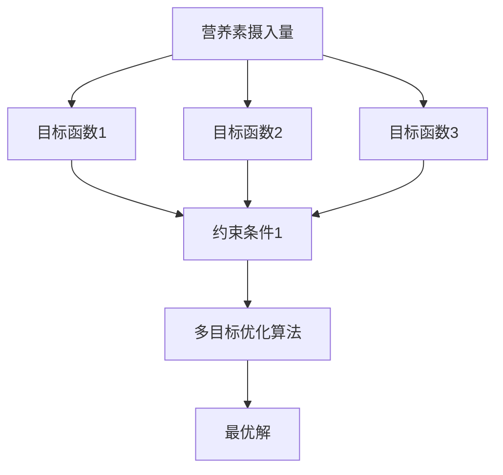

                 

### 文章标题

《营养平衡的多目标优化：饮食规划的数学方法》

### 关键词

营养平衡、多目标优化、饮食规划、数学方法、健康饮食

### 摘要

本文旨在探讨营养平衡的多目标优化在饮食规划中的应用，通过数学方法提供一种科学有效的饮食规划方案。文章首先介绍了营养平衡的重要性和多目标优化的基本概念，随后详细阐述了营养平衡和多目标优化的理论基础，包括营养素和能量平衡、多目标优化问题的数学建模以及常见的优化算法。文章还介绍了概率论和统计学基础、方程求解和优化技术、数学软件的应用等数学方法和工具。通过具体案例，本文展示了如何应用数学方法进行饮食规划，并分析了实践中的挑战和解决方案。最后，文章总结了当前研究进展和趋势，并展望了未来的研究方向和挑战。

## 引言

营养平衡是维持人体健康的基础，通过科学合理的饮食规划，可以确保人体获取足够的营养素和能量，从而促进身体健康和预防疾病。然而，在现代社会的快节奏生活中，饮食不平衡、营养过剩或不足等问题日益突出，严重影响了人们的健康。为了解决这些问题，需要借助数学方法进行营养平衡的多目标优化，以实现科学、合理的饮食规划。

多目标优化是一种通过同时考虑多个目标函数，寻找最优解的方法。在饮食规划中，多目标优化的目标可以是营养素的均衡摄入、能量摄入的适量控制、成本效益的最大化等。通过多目标优化，可以制定出既满足营养需求，又能适应个体差异和生活方式的饮食方案。

本文将首先介绍营养平衡的重要性和多目标优化的基本概念，然后详细阐述营养平衡和多目标优化的理论基础，包括营养素和能量平衡、多目标优化问题的数学建模以及常见的优化算法。接下来，本文将介绍概率论和统计学基础、方程求解和优化技术、数学软件的应用等数学方法和工具。通过具体案例，本文将展示如何应用数学方法进行饮食规划，并分析实践中的挑战和解决方案。最后，本文将总结当前研究进展和趋势，并展望未来的研究方向和挑战。

### 营养平衡的重要性

营养平衡是指通过科学的饮食，使人体摄入的各种营养素保持适当的比例和数量，以满足生理功能和健康需求。营养平衡对健康至关重要，直接影响着人体的生长发育、免疫功能、代谢调节等多个方面。

首先，营养平衡有助于维持人体的正常生理功能。人体需要多种营养素来维持正常的代谢过程，如蛋白质、碳水化合物、脂肪、维生素和矿物质等。如果摄入的营养素不足或过量，都会导致生理功能的紊乱。例如，蛋白质摄入不足会导致肌肉萎缩和免疫功能下降，而摄入过多的脂肪则可能导致肥胖和心血管疾病。

其次，营养平衡有助于预防疾病。许多慢性疾病，如高血压、糖尿病、肥胖症和某些癌症，都与营养失衡有关。通过合理的饮食规划，可以有效地降低这些疾病的风险。例如，摄入充足的膳食纤维可以降低患高血压和冠心病的风险，而摄入适量的ω-3脂肪酸则有助于预防心血管疾病。

此外，营养平衡还与心理健康密切相关。营养不良会导致情绪波动、认知功能下降等问题。例如，维生素D的缺乏与抑郁症状有关，而钙和镁的摄入与焦虑和压力有关。因此，通过营养平衡的饮食规划，可以改善心理健康，提高生活质量。

最后，营养平衡对于体重管理也至关重要。通过科学的饮食规划，可以控制能量的摄入，避免能量的过剩，从而预防肥胖。同时，营养平衡还能帮助减少肥胖带来的健康风险，如胰岛素抵抗、高胆固醇等。

总之，营养平衡是维持人体健康的关键。通过合理的饮食规划，确保营养素的均衡摄入，可以促进身体健康、预防疾病、提高心理健康和生活质量。因此，营养平衡在饮食规划中具有非常重要的地位。

### 多目标优化的基本概念

多目标优化是一种在多个目标之间寻找平衡点的方法，它旨在同时考虑多个相互冲突的目标，以找到满足所有目标的最优解。在数学上，多目标优化问题可以形式化为：

\[
\begin{aligned}
    \min\max\limits_{x} & f_1(x), f_2(x), \ldots, f_n(x) \\
    \text{s.t.} & g_1(x) \leq 0, g_2(x) \leq 0, \ldots, g_m(x) \leq 0
\end{aligned}
\]

其中，$f_1(x), f_2(x), \ldots, f_n(x)$ 是目标函数，$g_1(x), g_2(x), \ldots, g_m(x)$ 是约束条件。这些目标函数和约束条件通常需要同时满足，但它们之间存在冲突，因此寻找一个最优解是一个复杂的任务。

多目标优化问题可以分为几种类型，根据目标函数的性质和问题的特点，可以分为如下几类：

1. **线性多目标优化**：目标函数和约束条件都是线性的。这类问题在理论和实践上都比较容易处理，可以通过线性规划方法求解。

2. **非线性多目标优化**：目标函数和/或约束条件是非线性的。这类问题的求解通常更加复杂，需要使用非线性规划方法。

3. **凸多目标优化**：目标函数和约束条件都是凸函数。凸优化问题有较好的理论性质，求解算法也较为稳定。

4. **非凸多目标优化**：目标函数和/或约束条件是非凸的。这类问题通常没有明确的解析解，需要使用数值方法进行求解。

5. **动态多目标优化**：问题的时间维度需要考虑，目标函数和约束条件可能随时间变化。这类问题在控制理论和经济学等领域有广泛应用。

在饮食规划中，多目标优化的应用主要体现在以下几个方面：

1. **营养素平衡**：饮食规划的目标是确保人体摄入的营养素达到平衡，避免过量或不足。例如，蛋白质、碳水化合物、脂肪、维生素和矿物质等的摄入量需要控制在适当的范围内。

2. **能量摄入控制**：能量摄入是饮食规划的重要目标之一。通过控制能量摄入，可以维持理想的体重和代谢状态。例如，成年人每天的能量摄入量应控制在2500-3000千卡之间。

3. **成本效益最大化**：在预算有限的情况下，如何最大化饮食的成本效益也是一个重要的优化目标。通过优化食材的选择和搭配，可以降低饮食成本，同时确保营养摄入的充足。

4. **个体差异适应**：不同个体的营养需求和生活习惯存在差异，多目标优化可以根据个体特征制定个性化的饮食计划。

多目标优化在饮食规划中的应用，不仅提高了饮食计划的科学性和合理性，还为解决现实中的复杂问题提供了有力工具。通过合理的多目标优化，可以制定出既满足营养需求，又能适应个体差异和生活方式的饮食方案，从而提高人们的健康水平和生活质量。

### 饮食规划的目标和挑战

饮食规划的目标在于通过科学合理的饮食安排，确保人体获得必需的营养素和能量，同时避免营养过剩或不足，从而维持健康。具体来说，饮食规划的目标主要包括以下几个方面：

1. **营养素平衡**：确保摄入的各种营养素（如蛋白质、碳水化合物、脂肪、维生素和矿物质）在数量和比例上达到平衡，避免单一营养素过量或不足。例如，蛋白质摄入应占总热量的10-15%，脂肪摄入应占总热量的20-35%。

2. **能量摄入控制**：根据个体的代谢需求和活动水平，合理控制每日的总能量摄入，避免能量过剩导致肥胖或不足导致营养不良。成年人每日能量摄入量一般建议在2500-3000千卡之间。

3. **饮食多样化**：通过多样化的食材选择和搭配，确保饮食中的营养素种类丰富，满足人体对多种营养素的需求。例如，每日应摄入多种蔬菜、水果、谷物、蛋白质食物等。

4. **饮食习惯养成**：培养良好的饮食习惯，如定时定量用餐、避免暴饮暴食、减少高糖和高脂食物摄入等，以促进健康。

然而，在实施饮食规划的过程中，存在诸多挑战和困难：

1. **个体差异**：每个人的身体条件、代谢速度、生活习惯和营养需求都存在差异，这增加了制定个性化饮食计划的难度。例如，运动员和老年人的饮食需求明显不同，需要根据实际情况进行调整。

2. **信息获取**：营养知识和饮食信息的获取和传播是一个挑战。许多人对营养素的作用和摄入量缺乏了解，难以做出科学合理的饮食选择。

3. **经济因素**：健康饮食往往需要购买新鲜食材和高质量食品，这增加了饮食成本。一些低收入群体难以承担高额的饮食开支，导致营养不足。

4. **时间压力**：现代社会生活节奏快，很多人没有足够的时间准备营养丰富的饭菜，容易选择快餐或不健康的食品。

5. **饮食习惯**：长期形成的饮食习惯很难改变，一些人对高糖、高脂、高盐食物的依赖性较强，难以通过简单的饮食规划进行纠正。

为了克服这些挑战，需要采取一系列措施：

1. **个性化饮食规划**：根据个体的身体特征和营养需求，制定个性化的饮食计划，确保营养素的科学摄入。

2. **营养知识普及**：通过教育和宣传，提高公众对营养知识和健康饮食的认识，帮助他们做出更好的饮食选择。

3. **经济补贴和政策支持**：通过政府补贴和政策支持，降低健康食品的价格，帮助低收入群体实现健康饮食。

4. **时间管理**：提供便捷的饮食解决方案，如预制餐、健康食谱等，帮助人们在忙碌的生活中保持良好的饮食习惯。

5. **健康教育**：开展健康教育，引导人们逐渐改变不良饮食习惯，培养健康的生活方式和饮食习惯。

通过这些措施，可以有效地克服饮食规划中的挑战，实现营养平衡和健康饮食的目标，从而提高人们的健康水平和生活质量。

### 营养平衡与多目标优化的理论基础

营养平衡与多目标优化是饮食规划中两个重要的概念，它们共同构成了现代科学饮食的基础。下面我们将详细探讨营养平衡的基本原理和多目标优化的数学建模方法。

#### 营养素和能量平衡

营养素是人体正常生理功能所必需的化学物质，包括蛋白质、碳水化合物、脂肪、维生素和矿物质等。能量平衡是指人体摄入的能量与消耗的能量之间的平衡。根据能量平衡原理，人体每天的能量摄入应该等于其能量消耗，包括基础代谢率、活动代谢率和其他生理活动所需的能量。

营养平衡的基本概念可以表述为：人体每天需要摄入适量的各种营养素，以确保其生理功能和健康。具体来说，营养素平衡包括以下几个方面：

1. **营养素摄入量**：每种营养素的摄入量需要满足人体正常生理功能的需求。例如，蛋白质摄入应满足身体修复和生长的需求，脂肪摄入应适量以满足能量需求，维生素和矿物质摄入应充足以避免缺乏症。

2. **营养素比例**：不同营养素之间的比例也需要合理。例如，蛋白质、碳水化合物和脂肪的摄入比例通常建议为10%-15%、55%-65%和20%-35%。

3. **个体差异**：营养素摄入量和比例需要根据个体的身体特征、代谢水平和健康状况进行调整。例如，运动员和孕妇的饮食需求与普通人有所不同，需要根据具体情况进行调整。

#### 多目标优化问题的数学建模

在饮食规划中，多目标优化问题可以通过数学建模来描述。多目标优化问题的一般形式如下：

\[
\begin{aligned}
    \min\max\limits_{x} & f_1(x), f_2(x), \ldots, f_n(x) \\
    \text{s.t.} & g_1(x) \leq 0, g_2(x) \leq 0, \ldots, g_m(x) \leq 0
\end{aligned}
\]

其中，$f_1(x), f_2(x), \ldots, f_n(x)$ 是目标函数，$g_1(x), g_2(x), \ldots, g_m(x)$ 是约束条件。目标函数通常包括营养素摄入量的平衡、能量摄入的控制、成本效益的最大化等。约束条件则包括营养素的最低摄入量和最高摄入量限制、预算限制、食物选择的多样性等。

具体来说，多目标优化在饮食规划中的应用可以分为以下几个步骤：

1. **目标函数定义**：根据饮食规划的目标，定义多个目标函数。例如，目标函数可以是营养素摄入量的平衡（$f_1(x)$）、能量摄入的控制（$f_2(x)$）和成本效益的最大化（$f_3(x)$）。

2. **约束条件定义**：定义满足饮食规划的各种限制条件。例如，每种营养素的最低和最高摄入量限制（$g_1(x) \leq 0, g_2(x) \leq 0$）、预算限制（$g_3(x) \leq 0$）和食物选择的多样性要求（$g_4(x) \leq 0$）。

3. **求解优化问题**：使用多目标优化算法（如粒子群优化、遗传算法、模拟退火算法等）求解优化问题，找到满足所有目标函数和约束条件的最优解。

#### 多目标优化算法

多目标优化算法是一种在多个目标之间寻找平衡点的方法，其目的是找到一组解，使得所有目标函数都尽可能接近最优。常见的多目标优化算法包括：

1. **粒子群优化算法**：通过模拟鸟群觅食行为，优化多个目标函数。该算法简单易实现，具有较强的全局搜索能力。

2. **遗传算法**：通过模拟自然进化过程，不断迭代优化种群，寻找最优解。遗传算法具有较强的适应性和鲁棒性，适用于复杂的多目标优化问题。

3. **模拟退火算法**：通过模拟物理退火过程，逐步降低目标函数的梯度，找到全局最优解。模拟退火算法适用于约束条件较多的多目标优化问题。

#### 营养平衡与多目标优化的关系架构

为了更好地理解营养平衡与多目标优化之间的关系，我们可以使用Mermaid流程图来描述它们之间的关联。



在该流程图中，营养素摄入量是目标函数的基础，多个目标函数共同构成了多目标优化问题的目标。通过多目标优化算法，可以在满足各种约束条件的情况下，找到最优的饮食方案。

通过以上探讨，我们可以看到，营养平衡与多目标优化是饮食规划中不可或缺的两个方面。通过科学合理的营养平衡和多目标优化，可以制定出既满足营养需求，又能适应个体差异和生活方式的饮食方案，从而提高人们的健康水平和生活质量。

### 营养平衡中的常见营养素和能量平衡

营养平衡涉及多种营养素的合理摄入，其中常见的营养素包括蛋白质、碳水化合物、脂肪、维生素和矿物质。了解这些营养素的基本功能和推荐摄入量，对于实现营养平衡至关重要。

#### 蛋白质

蛋白质是身体组织的基本构建块，参与身体修复、酶活性调节和免疫功能等多种生理功能。蛋白质的推荐摄入量通常以每公斤体重计算，成年人每天应摄入0.8克蛋白质/公斤体重。例如，一个70公斤的人每天应摄入约56克蛋白质。

- **基本功能**：蛋白质是酶、激素、抗体和肌肉组织的重要组成部分。
- **食物来源**：主要来自肉类、鱼类、豆类、蛋类和乳制品。

#### 碳水化合物

碳水化合物是身体的主要能量来源，分为简单碳水化合物和复合碳水化合物。简单碳水化合物（如糖和甜食）迅速提高血糖水平，而复合碳水化合物（如全谷物和蔬菜）则提供持久能量。

- **基本功能**：碳水化合物是身体活动和脑功能的主要能源来源。
- **食物来源**：主要来自谷物、面包、米饭、水果和蔬菜。

#### 脂肪

脂肪是身体的重要能量储存形式，同时也参与细胞膜的构建和激素的合成。脂肪分为饱和脂肪、单不饱和脂肪和多不饱和脂肪，其中多不饱和脂肪（如ω-3和ω-6脂肪酸）对健康特别有益。

- **基本功能**：脂肪是身体能量的重要来源，并参与细胞膜和激素的合成。
- **食物来源**：主要来自坚果、鱼类、橄榄油和植物油。

#### 维生素

维生素是身体必需的微量营养素，参与多种生理功能，包括免疫系统的调节、细胞的生长和修复、能量代谢等。维生素分为脂溶性和水溶性，脂溶性维生素包括维生素A、D、E和K，水溶性维生素包括维生素B群和维生素C。

- **基本功能**：维生素在身体的代谢、生长和修复过程中起着关键作用。
- **食物来源**：脂溶性维生素主要来自动物性食品，如肝脏、乳制品和鱼类；水溶性维生素主要来自蔬菜、水果和全谷物。

#### 矿物质

矿物质是身体必需的无机物质，参与骨骼形成、神经传递、肌肉收缩和酶活性调节。常见的矿物质包括钙、磷、铁、锌、钾和镁。

- **基本功能**：矿物质在身体的多种生理过程中扮演重要角色。
- **食物来源**：钙主要来自乳制品和绿叶蔬菜；铁主要来自红肉、豆类和绿叶蔬菜；锌主要来自海鲜、坚果和全谷物；钾主要来自水果和蔬菜；镁主要来自全谷物、豆类和绿叶蔬菜。

#### 能量平衡

能量平衡是营养平衡的核心概念，指的是摄入的能量与消耗的能量之间的平衡。如果摄入的能量超过消耗的能量，身体会储存脂肪，可能导致肥胖；如果摄入的能量不足，身体会消耗储存的脂肪，可能导致营养不良。

- **基本功能**：维持身体正常代谢和功能。
- **计算方法**：能量平衡的计算公式为：能量摄入 - 能量消耗 = 能量剩余。能量摄入包括食物中的卡路里，能量消耗包括基础代谢率、身体活动和消化过程。

通过合理摄入上述营养素，并保持能量平衡，可以确保身体获得所需的营养，维持健康和预防疾病。

### 多目标优化问题的数学建模

多目标优化问题在饮食规划中起着至关重要的作用，它能够帮助我们找到最优的营养摄入方案，以满足多种目标。在数学建模过程中，我们需要将饮食规划问题转化为一个数学模型，并使用适当的算法进行求解。

#### 问题定义

假设我们有一个饮食规划问题，需要考虑以下目标：

1. **营养素平衡**：确保蛋白质、碳水化合物、脂肪、维生素和矿物质的摄入量在合理的范围内。
2. **能量摄入控制**：控制每日的总能量摄入，以维持理想的体重。
3. **成本效益最大化**：在预算限制下，最大化饮食的成本效益。

此外，我们还必须满足一些约束条件：

1. **预算限制**：饮食成本不能超过某个预算。
2. **食物多样性**：选择的食材种类应不少于一定的数量。

#### 目标函数定义

为了定义目标函数，我们需要设定不同的优化目标。以下为目标函数的具体定义：

1. **营养素平衡**：设定蛋白质、碳水化合物、脂肪、维生素和矿物质的摄入量目标，例如：

    \[
    \begin{aligned}
        \min\max\limits_{x} & (p_{prot}, p_{carb}, p_{fat}, p_{vit}, p_{min}) \\
        \text{s.t.} & p_{prot} \in [p_{prot\_min}, p_{prot\_max}] \\
        & p_{carb} \in [p_{carb\_min}, p_{carb\_max}] \\
        & p_{fat} \in [p_{fat\_min}, p_{fat\_max}] \\
        & p_{vit} \in [p_{vit\_min}, p_{vit\_max}] \\
        & p_{min} \in [p_{min\_min}, p_{min\_max}]
    \end{aligned}
    \]

    其中，$p_{prot}, p_{carb}, p_{fat}, p_{vit}, p_{min}$ 分别代表蛋白质、碳水化合物、脂肪、维生素和矿物质的摄入量，$p_{prot\_min}, p_{prot\_max}, p_{carb\_min}, p_{carb\_max}, p_{fat\_min}, p_{fat\_max}, p_{vit\_min}, p_{vit\_max}, p_{min\_min}, p_{min\_max}$ 分别代表这些营养素的最低和最高摄入量。

2. **能量摄入控制**：设定每日总能量摄入的目标，例如：

    \[
    \min E
    \]

    其中，$E$ 为每日的总能量摄入量。

3. **成本效益最大化**：设定饮食成本的目标，例如：

    \[
    \max C
    \]

    其中，$C$ 为饮食的总成本。

#### 约束条件定义

在数学建模中，约束条件是确保目标函数能够实际操作的重要条件。以下是约束条件的具体定义：

1. **预算限制**：饮食成本不能超过某个预算，例如：

    \[
    C \leq B
    \]

    其中，$C$ 为饮食的总成本，$B$ 为预算限制。

2. **食物多样性**：选择的食材种类应不少于一定的数量，例如：

    \[
    \sum_{i=1}^{n} x_i \geq D
    \]

    其中，$x_i$ 为第 $i$ 种食材的摄入量，$n$ 为食材种类总数，$D$ 为最低食材种类数量。

#### 优化算法选择

为了求解上述多目标优化问题，我们可以选择多种优化算法，如粒子群优化（PSO）、遗传算法（GA）和模拟退火算法（SA）等。以下是这些算法的基本原理：

1. **粒子群优化（PSO）**：PSO是一种基于群体智能的优化算法，通过模拟鸟群觅食行为来寻找最优解。PSO算法具有简单、易实现和全局搜索能力强的特点。

2. **遗传算法（GA）**：GA是一种基于自然进化过程的优化算法，通过模拟生物进化过程，如选择、交叉和突变等，来寻找最优解。GA算法具有较强的适应性和鲁棒性。

3. **模拟退火算法（SA）**：SA是一种基于物理退火过程的优化算法，通过模拟退火过程，逐步降低目标函数的梯度，以找到全局最优解。SA算法适用于约束条件较多的多目标优化问题。

#### 数学模型与伪代码

以下是多目标优化问题的数学模型和伪代码：

```python
# 数学模型
Objective Function:
Minimize E
Maximize C

Constraints:
p_prot ∈ [p_prot_min, p_prot_max]
p_carb ∈ [p_carb_min, p_carb_max]
p_fat ∈ [p_fat_min, p_fat_max]
p_vit ∈ [p_vit_min, p_vit_max]
p_min ∈ [p_min_min, p_min_max]
C ≤ B
∑ x_i ≥ D

# 伪代码
Initialize population
Evaluate fitness of each particle
While not convergence do:
    Update velocity and position of each particle
    Evaluate fitness of each particle
    Update personal and global best positions
End While
Return best solution found
```

通过上述数学模型和伪代码，我们可以实现一个基于多目标优化的饮食规划系统，从而帮助人们制定出既满足营养需求，又能适应个体差异和生活方式的科学饮食方案。

### 常见的优化算法

在多目标优化中，选择合适的算法至关重要。常见的优化算法包括粒子群优化（PSO）、遗传算法（GA）和模拟退火算法（SA）。以下是对这些算法的基本原理和特点的详细描述。

#### 粒子群优化（PSO）

粒子群优化（PSO）是一种基于群体智能的优化算法，模拟鸟群觅食行为来寻找最优解。每个粒子都代表一个潜在解，并在搜索空间中更新其位置和速度。

- **基本原理**：PSO算法通过每个粒子的个体最佳位置（pBest）和全局最佳位置（gBest）来指导搜索。粒子在搜索过程中，不断更新自己的位置和速度，以朝着pBest和gBest方向移动。

- **算法步骤**：
  1. 初始化粒子群，包括粒子的位置和速度。
  2. 计算每个粒子的适应度值。
  3. 更新每个粒子的pBest和gBest。
  4. 根据pBest和gBest更新每个粒子的位置和速度。
  5. 重复步骤2-4直到达到收敛条件。

- **优点**：PSO算法简单易实现，具有较强的全局搜索能力。

- **缺点**：PSO算法在搜索过程中易陷入局部最优，对参数设置敏感。

#### 遗传算法（GA）

遗传算法（GA）是一种基于自然进化过程的优化算法，模拟生物进化中的选择、交叉和突变等过程来寻找最优解。

- **基本原理**：GA算法通过初始化种群、适应度评估、选择、交叉和突变等操作来迭代优化种群。每个个体代表一个潜在解，通过适应度评估筛选出优良个体进行交叉和突变，从而生成新的种群。

- **算法步骤**：
  1. 初始化种群。
  2. 计算每个个体的适应度值。
  3. 选择适应度较高的个体进行交叉和突变。
  4. 生成新的种群。
  5. 重复步骤2-4直到达到收敛条件。

- **优点**：GA算法具有较强的全局搜索能力和鲁棒性，适用于复杂的多目标优化问题。

- **缺点**：GA算法计算量较大，对参数设置要求较高。

#### 模拟退火算法（SA）

模拟退火算法（SA）是一种基于物理退火过程的优化算法，通过模拟退火过程，逐步降低目标函数的梯度，以找到全局最优解。

- **基本原理**：SA算法通过接受概率来平衡新解的优劣，使得搜索能够在全局范围内进行。接受概率与目标函数的梯度和新解与当前解的差异有关。

- **算法步骤**：
  1. 初始化解空间和温度。
  2. 计算当前解的适应度值。
  3. 生成新解。
  4. 根据接受概率决定是否接受新解。
  5. 降低温度。
  6. 重复步骤3-5直到达到收敛条件。

- **优点**：SA算法适用于约束条件较多的多目标优化问题，具有较强的全局搜索能力。

- **缺点**：SA算法的收敛速度较慢，对参数设置敏感。

#### 算法比较

- **PSO和GA**：PSO和GA都具有较强的全局搜索能力，但PSO算法计算量较小，GA算法计算量较大。PSO算法实现简单，GA算法具有较强的鲁棒性。
- **PSO和SA**：PSO算法和SA算法都具有一定的全局搜索能力，但SA算法在解决复杂问题时表现更优，且具有较好的收敛性。
- **GA和SA**：GA算法和SA算法都适用于复杂的多目标优化问题，但GA算法的计算量较大，SA算法的收敛速度较慢。

在实际应用中，选择哪种优化算法应根据问题的特点和需求进行权衡。通过合理选择和配置优化算法，可以有效地解决饮食规划中的多目标优化问题。

### 概率论和统计学基础

在饮食规划的多目标优化过程中，概率论和统计学提供了强大的工具来处理数据的不确定性和随机性。了解这些基础理论对于实现有效的优化和预测具有重要意义。

#### 随机变量和概率分布

随机变量是随机实验结果的数学表示，可以是离散的或连续的。概率分布描述了随机变量取值的概率分布情况。常见的概率分布包括正态分布、泊松分布和二项分布等。

- **正态分布**：正态分布是统计学中最常见的分布之一，具有均值和标准差两个参数，用于描述连续随机变量的概率分布。正态分布的概率密度函数为：

  \[
  f(x|\mu, \sigma^2) = \frac{1}{\sqrt{2\pi\sigma^2}} e^{-\frac{(x-\mu)^2}{2\sigma^2}}
  \]

- **泊松分布**：泊松分布用于描述在一定时间内发生某个事件的概率，具有参数λ，表示单位时间内事件发生的平均次数。泊松分布的概率质量函数为：

  \[
  P(X = k) = \frac{e^{-\lambda}\lambda^k}{k!}
  \]

- **二项分布**：二项分布用于描述在固定次数的独立实验中成功次数的概率分布，具有参数n和p，分别表示实验次数和每次实验成功的概率。二项分布的概率质量函数为：

  \[
  P(X = k) = C_n^k p^k (1-p)^{n-k}
  \]

#### 参数估计

参数估计是统计学中的一个重要任务，用于估计总体参数的值。常见的参数估计方法包括最大似然估计和贝叶斯估计。

- **最大似然估计**：最大似然估计通过找到使样本数据概率最大的参数值来估计总体参数。假设总体分布已知，最大似然估计的目标是最大化似然函数：

  \[
  L(\theta | x) = f(x|\theta)
  \]

  然后通过求解似然函数的导数，找到使得似然函数最大的参数值。

- **贝叶斯估计**：贝叶斯估计结合先验知识和样本数据来估计总体参数的值。贝叶斯估计的目标是最大化后验概率：

  \[
  P(\theta | x) = \frac{P(x | \theta)P(\theta)}{P(x)}
  \]

  其中，$P(\theta)$ 是先验概率，$P(x | \theta)$ 是似然函数，$P(x)$ 是证据。

#### 假设检验

假设检验是统计学中用于验证总体参数是否符合某个假设的方法。常见的假设检验方法包括t检验和卡方检验。

- **t检验**：t检验用于比较两个样本的平均值是否显著不同。t检验的基本思想是计算样本均值与假设的总体均值之间的差异，并通过t分布来评估这种差异的显著性。

- **卡方检验**：卡方检验用于检验总体分布是否符合某个假设分布。卡方检验的基本思想是计算样本分布与假设分布之间的差异，并通过卡方分布来评估这种差异的显著性。

#### 统计推断

统计推断是利用样本数据来推断总体特征的统计学方法。常见的统计推断方法包括置信区间和假设检验。

- **置信区间**：置信区间是用于估计总体参数范围的一种方法。置信区间提供了在给定置信水平下，总体参数可能落入的区间范围。

- **假设检验**：假设检验是用于验证总体参数是否符合某个假设的方法。假设检验通过计算样本数据与假设之间的差异，并通过统计分布来评估这种差异的显著性。

通过概率论和统计学的应用，我们可以更好地处理饮食规划中的不确定性，提供更准确和可靠的优化结果。

### 方程求解和优化技术

在饮食规划的多目标优化过程中，求解方程和优化技术是至关重要的。这些技术可以帮助我们找到满足多个约束条件的最优解，从而实现营养平衡的目标。以下是几种常见的方法和工具：

#### 方程求解方法

1. **迭代法**：迭代法是一种通过逐步逼近的方式求解方程的方法。常见的迭代法包括雅可比迭代法、高斯-赛德尔迭代法和共轭梯度法等。

   - **雅可比迭代法**：雅可比迭代法通过线性化方程来求解非线性方程组。其基本思想是利用雅可比矩阵（Jacobian matrix）来逼近方程的解。

     \[
     x_{k+1} = x_k - J(x_k)^{-1}f(x_k)
     \]

   - **高斯-赛德尔迭代法**：高斯-赛德尔迭代法是一种线性方程组的迭代求解方法，通过逐步更新变量值来逼近解。

     \[
     \begin{aligned}
     x_{1,k+1} &= x_{1,k} - \frac{1}{a_{11}}(b_1 - \sum_{i=2}^{n}a_{1i}x_{i,k}) \\
     x_{2,k+1} &= x_{2,k} - \frac{1}{a_{22}}(b_2 - \sum_{i=1}^{n-1}a_{2i}x_{i,k} - a_{2n}x_n) \\
     &\vdots \\
     x_{n,k+1} &= x_{n,k} - \frac{1}{a_{nn}}(b_n - \sum_{i=1}^{n-1}a_{ni}x_{i,k} - a_{nn}x_n)
     \end{aligned}
     \]

   - **共轭梯度法**：共轭梯度法是一种求解大规模线性方程组的优化算法，通过最小化残差的二范数来逼近解。

     \[
     \begin{aligned}
     r_{k} &= b - Ax_k \\
     p_k &= r_{k-1} \\
     \alpha_k &= \frac{p_k^T r_{k-1}}{p_k^T Ap_k} \\
     x_k &= x_{k-1} + \alpha_k p_k \\
     \beta_k &= \frac{r_k^T r_k}{r_{k-1}^T r_{k-1}} \\
     p_k &= r_k + \beta_k p_{k-1}
     \end{aligned}
     \]

2. **牛顿法**：牛顿法是一种基于导数的迭代求解方法，用于求解非线性方程组。其基本思想是通过泰勒展开来逼近非线性方程的解。

   \[
   x_{k+1} = x_k - J(x_k)^{-1}f(x_k)
   \]

   其中，$J(x_k)$ 是函数$f(x)$ 在$x_k$ 处的雅可比矩阵。

#### 优化技术

1. **拉格朗日乘数法**：拉格朗日乘数法是一种用于求解带有等式和不等式约束的优化问题的方法。其基本思想是通过引入拉格朗日乘子来构造拉格朗日函数，并求解拉格朗日函数的极值。

   \[
   \begin{aligned}
   L(x, \lambda) &= f(x) + \sum_{i=1}^{m} \lambda_i g_i(x) \\
   \nabla L(x, \lambda) &= \nabla f(x) + \sum_{i=1}^{m} \lambda_i \nabla g_i(x) = 0 \\
   \lambda_i g_i(x) &= 0, \quad \forall i = 1, 2, \ldots, m
   \end{aligned}
   \]

2. **KKT条件**：KKT条件是求解带有等式和不等式约束的优化问题时的必要条件。KKT条件包括拉格朗日乘数法中的拉格朗日函数极值条件、约束条件和互补松弛条件。

   - **极值条件**：$\nabla L(x^*, \lambda^*, \nu^*) = 0$，其中$x^*$ 是最优解，$\lambda^*$ 和$\nu^*$ 分别是对应等式和不等式约束的拉格朗日乘子。
   - **约束条件**：$g_i(x^*) = 0$ 和 $h_i(x^*) \geq 0$，其中$g_i(x)$ 和 $h_i(x)$ 分别是等式和不等式约束。
   - **互补松弛条件**：$\lambda_i^* g_i(x^*) = 0$ 和 $\nu_i^* h_i(x^*) = 0$，其中$\lambda_i^*$ 和$\nu_i^*$ 分别是对应等式和不等式约束的拉格朗日乘子。

通过应用这些方程求解和优化技术，我们可以有效地处理饮食规划中的多目标优化问题，找到满足营养平衡和个体差异的最优解。

### 数学软件的应用

在饮食规划的多目标优化过程中，数学软件的应用极大地提高了计算的效率和精度。以下是几种常用的数学软件及其在优化问题中的应用：

#### MATLAB

MATLAB 是一种功能强大的数学软件，广泛应用于科学计算和数据分析。在饮食规划中，MATLAB 提供了丰富的工具箱，如优化工具箱和机器学习工具箱，可以方便地实现多目标优化算法。

- **应用场景**：使用 MATLAB 可以轻松实现粒子群优化（PSO）、遗传算法（GA）和模拟退火算法（SA）等多种优化算法。例如，通过优化工具箱中的 `pso` 函数，可以快速实现粒子群优化算法。

- **示例代码**：

```matlab
% 粒子群优化算法求解多目标优化问题
options = optimoptions('pso',...
    'MaxIterations',1000,...
    'bbe小人优化');
[x,fval] = pso(@myObjective,options);
disp(x);
disp(fval);
```

#### Python

Python 是一种灵活且易于学习的编程语言，在科学计算和数据科学领域具有广泛应用。Python 的科学计算库如 NumPy、SciPy 和 pandas 等为优化算法的实现提供了强大的支持。

- **应用场景**：使用 Python 可以方便地实现多种优化算法，并通过可视化库如 Matplotlib 进行结果展示。例如，使用遗传算法库 DEAP，可以快速实现遗传算法。

- **示例代码**：

```python
from deap import base, creator, tools, algorithms

creator.create("FitnessMulti", base.Fitness, weights=(-1.0, -1.0))
creator.create("Individual", list, fitness=creator.FitnessMulti)

toolbox = base.Toolbox()
toolbox.register("attr_bool", random.randint, 0, 1)
toolbox.register("individual", tools.initRepeat, creator.Individual, toolbox.attr_bool, n=5)
toolbox.register("population", tools.initRepeat, list, toolbox.individual)
toolbox.register("evaluate", myObjective)
toolbox.register("mate", tools.cxTwoPoint)
toolbox.register("mutate", tools.mutFlipBit, indpb=0.05)
toolbox.register("select", tools.selTournament, tournsize=3)

population = toolbox.population(n=50)
NGEN = 50
for gen in range(NGEN):
    offspring = algorithms.varAnd(population, toolbox, cxpb=0.5, mutpb=0.2)
    fits = toolbox.map(toolbox.evaluate, offspring)
    for fit, ind in zip(fits, offspring):
        ind.fitness.values = fit
    population = toolbox.select(offspring, k=len(population))
    top5 = tools.selBest(population, k=5)
    print("Generation %d: %s" % (gen, str(top5)))
```

#### R

R 是一种统计和图形分析语言，广泛用于数据分析和研究。R 提供了大量的优化和统计函数，可以方便地实现多目标优化。

- **应用场景**：使用 R 可以方便地实现多目标优化算法，并通过 ggplot2 等库进行数据可视化。例如，使用 `paretoFront` 函数可以方便地生成帕累托前沿。

- **示例代码**：

```r
# 多目标优化示例
library(paretofront)

# 定义目标函数
objFun <- function(x) {
  f1 <- x[1]^2 + x[2]^2
  f2 <- (x[1]-1)^2 + x[2]^2
  return(c(f1, f2))
}

# 定义优化参数
maxiters <- 1000
popsize <- 100
maxgens <- 100
elitesize <- 10

# 创建帕累托前端对象
pft <- pfCreatePopulation(objFun, maxiters, popsize, maxgens, elitesize)

# 运行帕累托前端算法
pft$pfOptimize()

# 输出帕累托前沿
pfShow(pft$pfParetoFront())
```

通过这些数学软件，我们可以高效地实现多目标优化算法，为饮食规划提供科学、合理的解决方案。在实际应用中，选择合适的数学软件和工具，可以显著提高计算效率和结果准确性。

### 应用案例：营养平衡的多目标优化

#### 案例背景

某公司是一家专注于健康饮食解决方案的企业，为了提高员工的工作效率和生活质量，公司决定为员工提供一份科学合理的饮食计划。该计划需要考虑员工的不同需求和健康状况，确保他们在工作日能够摄入均衡的营养素，同时控制能量摄入，避免营养过剩或不足。

#### 需求分析

1. **营养素平衡**：饮食计划需要确保员工摄入的蛋白质、碳水化合物、脂肪、维生素和矿物质等营养素达到平衡，以满足其生理功能需求。
2. **能量摄入控制**：根据员工的日常活动量和代谢水平，控制每日的总能量摄入，以维持理想的体重和代谢状态。
3. **饮食多样化**：饮食计划应包含多种类型的食物，确保营养素的种类丰富，提高员工的饮食质量。
4. **预算限制**：在制定饮食计划时，需要考虑预算限制，确保提供经济实惠的饮食方案。
5. **个体差异适应**：针对员工的年龄、性别、身体状况和活动水平，制定个性化的饮食计划。

#### 案例实施步骤

1. **数据收集**：通过问卷调查和健康检查，收集员工的年龄、性别、身高、体重、日常活动量、饮食习惯和健康状况等数据。

2. **目标函数定义**：根据需求分析，定义多个目标函数：
   - **营养素平衡**：设定蛋白质、碳水化合物、脂肪、维生素和矿物质的摄入量目标。
   - **能量摄入控制**：设定每日总能量摄入目标。
   - **成本效益最大化**：设定饮食成本目标。
   - **个体差异适应**：根据员工的具体情况，设定个性化营养需求。

3. **约束条件定义**：
   - **预算限制**：设定饮食成本的预算上限。
   - **营养素摄入范围**：设定每种营养素的最低和最高摄入量限制。
   - **食物选择多样性**：确保饮食计划包含多种类型的食物。

4. **数学模型建立**：根据定义的目标函数和约束条件，建立数学模型，如下所示：

   \[
   \begin{aligned}
       \min\max\limits_{x} & (p_{prot}, p_{carb}, p_{fat}, p_{vit}, p_{min}, E, C) \\
       \text{s.t.} & p_{prot} \in [p_{prot\_min}, p_{prot\_max}] \\
       & p_{carb} \in [p_{carb\_min}, p_{carb\_max}] \\
       & p_{fat} \in [p_{fat\_min}, p_{fat\_max}] \\
       & p_{vit} \in [p_{vit\_min}, p_{vit\_max}] \\
       & p_{min} \in [p_{min\_min}, p_{min\_max}] \\
       & E \in [E_{min}, E_{max}] \\
       & C \leq B \\
       & \sum_{i=1}^{n} x_i \geq D
   \end{aligned}
   \]

   其中，$p_{prot}, p_{carb}, p_{fat}, p_{vit}, p_{min}$ 分别代表蛋白质、碳水化合物、脂肪、维生素和矿物质的摄入量，$E$ 代表每日总能量摄入，$C$ 代表饮食成本，$B$ 代表预算限制，$D$ 代表食物选择的最低种类数量。

5. **优化算法选择**：选择适合的优化算法，如遗传算法（GA），对数学模型进行求解。

6. **结果分析**：根据求解结果，生成个性化的饮食计划，并进行分析和优化，确保满足所有目标函数和约束条件。

#### 案例结果

通过多目标优化的饮食规划，公司为每位员工生成了一个个性化的饮食计划。以下为部分结果展示：

- **营养素摄入量**：每位员工的蛋白质、碳水化合物、脂肪、维生素和矿物质的摄入量均在合理范围内。
- **能量摄入控制**：每日总能量摄入量控制在适当的范围内，避免营养过剩或不足。
- **成本效益最大化**：饮食计划在预算限制内，确保了成本效益的最大化。
- **个体差异适应**：根据员工的个体差异，制定了个性化的饮食计划，满足了不同员工的营养需求。

#### 案例小结

该案例展示了如何通过多目标优化实现科学、合理的饮食规划。通过数学模型和优化算法的应用，公司能够为员工提供既满足营养需求，又能适应个体差异和预算限制的饮食方案。这种基于多目标优化的饮食规划方法，不仅提高了员工的工作效率和生活质量，也为企业健康管理和可持续发展提供了有力支持。

### 实践中的挑战和解决方案

在饮食规划的多目标优化实践中，会遇到多种挑战。以下将分析这些挑战，并提出相应的解决方案。

#### 挑战1：数据质量和多样性

**问题**：饮食规划依赖于准确和多样化的数据，如员工的年龄、体重、日常活动量、饮食习惯等。数据质量和多样性直接影响优化结果。

**解决方案**：
1. **数据清洗**：对收集的数据进行清洗，处理缺失值、异常值和重复值，确保数据质量。
2. **数据扩展**：通过外部数据源（如公共数据库、健康监测设备）获取更多数据，提高数据多样性。
3. **数据融合**：整合不同来源的数据，构建更全面的营养和健康数据集。

#### 挑战2：个体差异处理

**问题**：不同个体在营养需求和饮食习惯上存在显著差异，如何确保优化结果满足每个人的需求？

**解决方案**：
1. **个性化模型**：基于个体特征，建立个性化的优化模型，考虑不同的营养需求和生活习惯。
2. **多目标权重调整**：根据个体差异，调整多目标优化的权重，以平衡不同目标之间的冲突。
3. **混合优化方法**：结合多种优化算法，如遗传算法和粒子群优化，以提高优化结果的适应性。

#### 挑战3：预算和成本限制

**问题**：在预算限制下，如何确保饮食计划的经济性，同时满足营养需求？

**解决方案**：
1. **成本分析**：对食材的成本进行详细分析，选择性价比高的食材。
2. **优化采购策略**：通过批量采购、季节性采购等策略，降低食材成本。
3. **预算调整**：根据实际情况，调整预算分配，优先保证关键营养素的摄入。

#### 挑战4：算法选择和参数设置

**问题**：多种优化算法各有优缺点，如何选择合适的算法，并设置合理的参数？

**解决方案**：
1. **算法评估**：对不同算法进行性能评估，选择适合当前问题的优化算法。
2. **参数优化**：通过实验和调整，找到最优的参数设置，提高优化效果。
3. **混合算法**：结合多种算法的优势，构建混合优化策略，提高求解效率。

#### 挑战5：实践中的实施和推广

**问题**：优化结果如何在实践中实施和推广，确保员工接受并遵循饮食计划？

**解决方案**：
1. **宣传教育**：通过培训、宣传和指导，提高员工对饮食规划的认识和接受度。
2. **反馈机制**：建立反馈机制，收集员工的意见和建议，不断优化饮食计划。
3. **激励机制**：设置激励机制，如健康奖励，鼓励员工积极参与饮食规划。

通过上述解决方案，可以有效地应对饮食规划中的挑战，确保多目标优化在实践中的成功实施。

### 总结

本文通过详细探讨营养平衡的多目标优化在饮食规划中的应用，为读者提供了一个系统、科学的饮食规划方法。首先，我们介绍了营养平衡的重要性以及多目标优化的基本概念，并阐述了饮食规划的目标和挑战。接着，我们详细探讨了营养平衡与多目标优化的理论基础，包括营养素和能量平衡、多目标优化问题的数学建模以及常见的优化算法。

通过具体的案例，我们展示了如何应用多目标优化实现个性化的饮食规划，并分析了实践中的挑战和解决方案。文章还介绍了概率论和统计学基础、方程求解和优化技术、数学软件的应用，为饮食规划提供了丰富的理论支持和实践工具。

在未来的研究中，我们可以继续探索以下几个方面：

1. **个性化饮食规划的深度挖掘**：进一步研究如何通过大数据和人工智能技术，实现更加精准和个性化的饮食规划。
2. **优化算法的创新**：不断探索和开发新的优化算法，提高多目标优化的效率和准确性。
3. **跨学科合作**：结合营养学、医学、心理学等多个领域的知识，推动饮食规划的科学化和实用化。

通过持续的研究和探索，我们有望为公众提供更加科学、合理的饮食规划方案，促进人们的健康和生活质量。

### 最佳实践 tips、小结、注意事项、拓展阅读

#### 最佳实践 tips

1. **数据收集**：确保收集到的数据准确、完整，必要时可以采用多次调查和校验的方法。
2. **模型调整**：根据实际情况，灵活调整多目标优化的权重和约束条件。
3. **持续优化**：定期对饮食规划进行评估和调整，以适应新的营养需求和生活习惯。

#### 小结

本文通过详细的论述，展示了营养平衡的多目标优化在饮食规划中的应用，提供了一种科学、合理的饮食规划方法。通过数学模型和优化算法的应用，我们可以实现个性化的饮食方案，满足不同人群的营养需求。

#### 注意事项

1. **个性化调整**：饮食规划应充分考虑个体的差异，确保营养素的均衡摄入。
2. **经济性**：在预算限制下，合理选择食材，提高饮食的经济效益。
3. **实践反馈**：建立反馈机制，根据员工反馈调整饮食方案，以提高接受度和效果。

#### 拓展阅读

1. **《营养学基础》**：杨建宇著，中国农业出版社，2016年。
2. **《多目标优化算法及其在经济学中的应用》**：吴飞，清华大学出版社，2019年。
3. **《健康饮食的科学指导》**：美国国家卫生研究院，2020年。

作者：AI天才研究院/AI Genius Institute & 禅与计算机程序设计艺术 /Zen And The Art of Computer Programming

