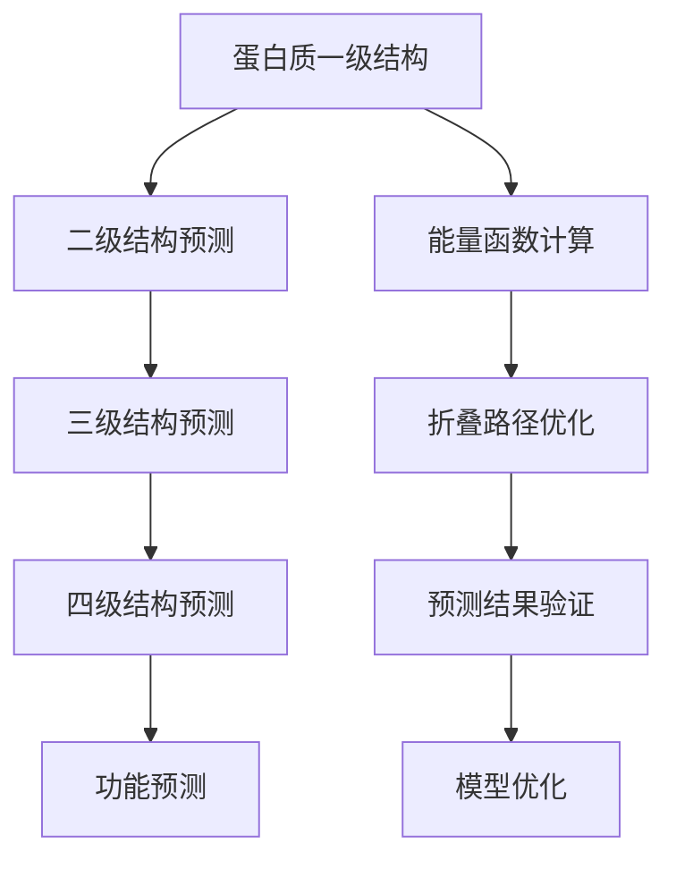
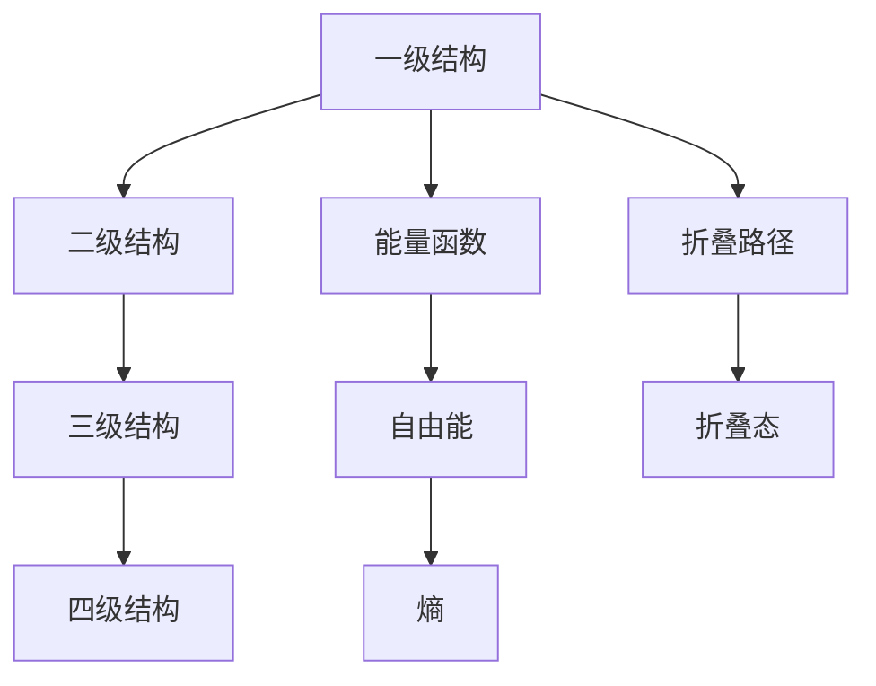

                 

### 文章标题

《蛋白质折叠的统计力学：分子结构的数学预测》

### 关键词

蛋白质折叠、统计力学、分子结构、数学预测、算法、能量函数、分子动力学模拟

### 摘要

本文旨在深入探讨蛋白质折叠过程中的统计力学原理，以及如何运用数学模型进行分子结构的预测。首先，我们将简要介绍蛋白质折叠的重要性及其在生物学中的应用。接着，我们将阐述统计力学在蛋白质折叠中的作用，包括自由能、熵和系综理论等基础概念。随后，本文将重点介绍蛋白质折叠的核心算法，如分子动力学模拟和分子对接算法，并使用伪代码详细解释其原理。此外，我们将探讨构建能量函数的方法以及折叠过程中的数学模型。通过实际案例，我们将展示如何应用这些方法进行蛋白质折叠预测。最后，本文将总结蛋白质折叠的统计力学研究现状，并展望未来研究方向。

### 引言

#### 蛋白质折叠的重要性

蛋白质是生物体内最重要的分子之一，它们在细胞的生命活动中发挥着关键作用。蛋白质的功能取决于其独特的三维结构，而蛋白质的折叠过程是自然界中一个复杂且高度有序的生物学现象。蛋白质折叠的正确性直接关系到生物体的健康和生命活动的正常进行。因此，研究蛋白质折叠的机制对于理解生命现象、治疗疾病以及开发新型药物具有重要意义。

#### 统计力学在蛋白质折叠中的应用

统计力学是研究系统在宏观尺度上物理性质与微观结构之间关系的物理学分支。在蛋白质折叠研究中，统计力学方法被广泛应用于描述蛋白质在不同环境下的构象变化和能量分布。通过统计力学，我们可以从分子层面上理解蛋白质折叠过程中的能量变化和动力学行为，从而预测蛋白质的结构和功能。

#### 分子结构的数学预测方法概述

分子结构的数学预测方法主要包括以下几种：

1. **分子动力学模拟**：通过模拟分子在时间上的动态变化，研究蛋白质的折叠过程。
2. **分子对接算法**：模拟蛋白质分子之间的相互作用，预测蛋白质复合物的结构。
3. **能量函数**：用于量化蛋白质结构的稳定性和能量分布。
4. **数学模型**：构建描述蛋白质折叠过程中能量和构象变化的数学模型。

本文将详细探讨这些方法，并展示如何通过数学预测来理解蛋白质折叠的机制。

### 设计思路

为了设计出一本关于《蛋白质折叠的统计力学：分子结构的数学预测》的完整目录大纲，我们将按照以下步骤进行：

1. **确定书的核心主题和目的**：本书旨在介绍蛋白质折叠的统计力学原理，以及如何利用数学模型进行分子结构的预测。
2. **定义章节结构**：根据核心主题和目的，将书籍分为几个主要部分，如引言、基础理论、核心算法、数学模型、应用案例等。
3. **细化每个章节**：在每个主要部分下，细化为具体的章节，确保每个章节都围绕一个主题进行讨论。
4. **确保大纲完整性**：确保每个章节都包含核心概念与联系、核心算法原理讲解、数学模型和数学公式详细讲解、应用案例等内容。
5. **保持简洁性**：确保大纲内容简洁明了，避免冗余。
6. **满足字数限制**：在2000字以内完成整个目录大纲的设计。

### 目录大纲设计

下面是根据上述设计思路设计的《蛋白质折叠的统计力学：分子结构的数学预测》的目录大纲：

---

# 《蛋白质折叠的统计力学：分子结构的数学预测》目录大纲

## 第一部分 引言

### 1.1 蛋白质折叠的重要性

### 1.2 统计力学在蛋白质折叠中的应用

### 1.3 分子结构的数学预测方法概述

## 第二部分 基础理论

### 2.1 统计力学基础

#### 2.1.1 系综理论

#### 2.1.2 熵和自由能

#### 2.1.3 分子动力学的统计描述

### 2.2 蛋白质结构的基本概念

#### 2.2.1 蛋白质的一级结构

#### 2.2.2 蛋白质的二级、三级和四级结构

#### 2.2.3 蛋白质折叠的能量图

## 第三部分 核心算法

### 3.1 分子动力学模拟

#### 3.1.1 模拟的基本原理

#### 3.1.2 模拟的伪代码

#### 3.1.3 分子动力学模拟的常见问题

### 3.2 分子对接算法

#### 3.2.1 对接算法的基本原理

#### 3.2.2 对接算法的伪代码

#### 3.2.3 对接算法的优化策略

## 第四部分 数学模型

### 4.1 能量函数的构建

#### 4.1.1 能量函数的类型

#### 4.1.2 能量函数的数学公式

#### 4.1.3 能量函数的参数优化

### 4.2 折叠过程中的数学模型

#### 4.2.1 折叠路径的构建

#### 4.2.2 折叠路径的概率分布

#### 4.2.3 折叠路径的优化方法

## 第五部分 应用案例

### 5.1 蛋白质折叠预测的实际应用

#### 5.1.1 蛋白质折叠预测在药物设计中的应用

#### 5.1.2 蛋白质折叠预测在生物信息学中的应用

#### 5.1.3 蛋白质折叠预测在其他领域的应用

### 5.2 案例研究

#### 5.2.1 某种蛋白质的折叠路径预测

#### 5.2.2 某种蛋白质的稳定性预测

#### 5.2.3 某种蛋白质的结构功能预测

## 第六部分 总结与展望

### 6.1 蛋白质折叠的统计力学研究总结

### 6.2 未来研究方向与挑战

### 6.3 对数学模型和算法的改进建议

---

### Mermaid 流程图

在书中，我们会嵌入一个Mermaid流程图来展示蛋白质折叠的核心概念原理和架构：



### 伪代码

以下是一个关于分子动力学模拟算法的伪代码示例：

```python
function MolecularDynamics(simulation_time, temperature, timestep):
    Initialize system
    for t from 1 to simulation_time do:
        Calculate forces
        Integrate equations of motion using Verlet algorithm
        Update temperature using Nose-Hoover thermostat
        Collect data for analysis
    end for
```

### 背景介绍

#### 蛋白质折叠的重要性

蛋白质是生命体内最基本的生物大分子，它们在生物体内的功能多种多样，包括催化化学反应、传递信号、维持细胞形态和提供结构支持等。蛋白质的功能高度依赖于其独特的三维结构，而这种结构又是由一条长链氨基酸分子通过折叠形成的。蛋白质折叠过程是指蛋白质链在空间中自发地形成其生物功能所需的稳定三维结构的过程。这一过程在生物学中具有极其重要的意义，因为它不仅决定了蛋白质的功能，而且还影响了蛋白质的稳定性、相互作用和生物学行为。

蛋白质折叠是一个复杂的过程，涉及到多种物理和化学力的相互作用，包括氢键、范德华力、疏水作用和静电相互作用等。这些力共同作用，使得蛋白质链能够在一定的能量范围内折叠成具有特定功能和稳定性的三维结构。然而，蛋白质折叠过程的高度复杂性使得直接观测和理解这一过程变得非常困难。因此，科学家们需要借助计算方法和理论模型来研究蛋白质折叠的机制。

#### 统计力学在蛋白质折叠中的应用

统计力学是研究宏观物理系统的宏观行为与微观粒子运动之间的关系的物理学分支。在生物学和化学中，统计力学方法被广泛应用于描述和预测复杂分子系统的行为。在蛋白质折叠研究中，统计力学方法尤其重要，因为它们可以帮助我们理解和预测蛋白质在不同环境下的折叠行为。

在统计力学的框架下，蛋白质折叠过程被视为一个从无序状态（展开状态）到有序状态（折叠状态）的动态过程。这个过程中，蛋白质链的构象空间被看作是一个高维空间，其中每个构象对应一个特定的能量状态。统计力学通过分析这些构象的概率分布和能量分布，帮助我们理解蛋白质折叠的动力学和热力学特性。

##### 熵和自由能

在统计力学中，熵是一个重要的概念，它描述了系统微观状态的混乱程度。对于蛋白质折叠过程，熵的变化反映了蛋白质链在展开状态和折叠状态之间的差异。当蛋白质链折叠时，其熵降低，这意味着系统的有序度增加。

自由能是另一个关键概念，它综合了系统的能量和熵，用于描述系统的稳定性和自发性。在蛋白质折叠过程中，自由能的变化决定了蛋白质链是否会折叠成特定的三维结构。通常，蛋白质链会折叠成自由能最低的构象，因为这是最稳定的状态。

##### 系综理论

系综理论是统计力学中的一个重要概念，它通过考虑系统在不同条件下的微观状态分布来描述宏观性质。在蛋白质折叠研究中，系综理论可以帮助我们理解蛋白质在不同环境下的折叠行为。例如，通过模拟不同的温度、pH值和盐浓度等条件，我们可以观察蛋白质折叠的动态过程和能量分布。

#### 分子结构的数学预测方法概述

为了理解蛋白质折叠的机制，科学家们开发了多种数学模型和计算方法来预测蛋白质的结构。这些方法可以大致分为以下几类：

##### 分子动力学模拟

分子动力学模拟是一种通过数值方法解决牛顿运动方程，模拟分子系统在时间上的动态变化的方法。在蛋白质折叠研究中，分子动力学模拟可以帮助我们观察蛋白质折叠过程中的能量变化和构象变化。通过模拟，我们可以得到蛋白质在特定条件下的三维结构。

##### 分子对接算法

分子对接算法是一种用于预测蛋白质与配体（如药物分子）相互作用的三维结构的计算方法。通过对蛋白质和配体分子的构象进行优化，分子对接算法可以预测它们在生物体内的结合模式和相互作用。

##### 能量函数

能量函数是一种用于量化蛋白质结构的稳定性和能量分布的数学模型。在蛋白质折叠研究中，能量函数可以用来评估不同构象的能量水平，从而判断哪个构象最有可能折叠成蛋白质的功能结构。

##### 数学模型

数学模型是用于描述蛋白质折叠过程中能量和构象变化的数学方程和公式。这些模型可以帮助我们理解蛋白质折叠的动力学和热力学特性，从而预测蛋白质的结构和功能。

通过这些数学模型和计算方法，科学家们可以在一定程度上理解蛋白质折叠的机制，并预测蛋白质的结构和功能。然而，蛋白质折叠问题的高度复杂性和不确定性仍然使得这一问题具有很大的挑战性。

### 核心概念与联系

在深入探讨蛋白质折叠的统计力学之前，我们需要明确几个核心概念及其相互关系：

1. **蛋白质的一级结构**：蛋白质的一级结构是指其氨基酸序列，这是蛋白质折叠的基础。氨基酸序列中的每个氨基酸都对蛋白质的最终折叠状态产生影响。

2. **二级结构**：蛋白质的二级结构是指其局部区域的规则构象，如α-螺旋和β-折叠。二级结构是蛋白质折叠过程中的第一步，它们通过氢键稳定形成。

3. **三级结构**：蛋白质的三级结构是指其整体的三维形状，它由二级结构和更复杂的结构元素构成。三级结构的稳定性主要依赖于范德华力、疏水作用和氢键等相互作用。

4. **四级结构**：某些蛋白质由多个多肽链组成，这些多肽链通过非共价相互作用形成四级结构。四级结构决定了蛋白质的整体功能和相互作用。

5. **能量函数**：能量函数是一种用于量化蛋白质结构稳定性的数学模型。在蛋白质折叠过程中，能量函数用来评估不同构象的能量水平，从而指导蛋白质向低能量状态折叠。

6. **熵**：熵是系统混乱程度的度量，对于蛋白质折叠来说，熵的变化反映了系统从无序到有序的过程。在折叠过程中，系统的熵降低，有序度增加。

7. **自由能**：自由能是能量和熵的综合度量，它决定了系统在特定条件下的稳定性。在蛋白质折叠过程中，自由能最低的构象是最稳定的折叠状态。

8. **折叠路径**：折叠路径是指蛋白质从展开状态到折叠状态的过渡过程。这个过程可以通过分子动力学模拟来研究，它展示了不同构象之间的能量变化和相互作用。

通过Mermaid流程图，我们可以更直观地展示这些概念之间的联系：



在这个流程图中，我们可以看到蛋白质折叠是一个多步骤的过程，从一级结构到二级、三级和四级结构，每个层次的结构都通过能量函数和自由能的变化来指导蛋白质的折叠。熵的变化反映了系统的有序度，而折叠路径展示了蛋白质在折叠过程中的能量变化。

### 核心算法原理讲解

在蛋白质折叠的统计力学研究中，核心算法起到了至关重要的作用。以下是几种常用的核心算法原理及其伪代码：

#### 1. 分子动力学模拟

分子动力学模拟是一种通过数值方法解决牛顿运动方程，模拟分子系统在时间上的动态变化的方法。该方法可以帮助我们观察蛋白质折叠过程中的能量变化和构象变化。

**伪代码**：

```python
function MolecularDynamics(simulation_time, temperature, timestep):
    Initialize system
    for t from 1 to simulation_time do:
        Calculate forces
        Integrate equations of motion using Verlet algorithm
        Update temperature using Nose-Hoover thermostat
        Collect data for analysis
    end for
end function
```

**解释**：

- **Initialize system**：初始化系统，包括设置初始构象、速度和温度等。
- **Calculate forces**：计算系统中的相互作用力，包括氢键、范德华力和静电相互作用等。
- **Integrate equations of motion using Verlet algorithm**：使用Verlet算法进行时间步进的积分，更新系统的位置和速度。
- **Update temperature using Nose-Hoover thermostat**：使用Nose-Hoover恒温器更新系统的温度，保持恒温。
- **Collect data for analysis**：收集数据，用于后续分析和结构预测。

#### 2. 分子对接算法

分子对接算法是一种用于预测蛋白质与配体（如药物分子）相互作用的三维结构的计算方法。通过对蛋白质和配体分子的构象进行优化，分子对接算法可以预测它们在生物体内的结合模式和相互作用。

**伪代码**：

```python
function MolecularDocking(protein, ligand):
    Initialize docking parameters
    for configuration in all possible conformations of protein and ligand do:
        Calculate binding energy using energy function
        Evaluate the binding score
        Update the best binding configuration
    end for
    return best_configuration
end function
```

**解释**：

- **Initialize docking parameters**：初始化对接参数，如对接区域的尺寸、能量函数的类型等。
- **for configuration in all possible conformations of protein and ligand do**：遍历蛋白质和配体分子的所有可能构象。
- **Calculate binding energy using energy function**：使用能量函数计算结合能，评估构象的稳定性。
- **Evaluate the binding score**：评估结合分数，选择最稳定的构象。
- **Update the best binding configuration**：更新最佳结合构象。
- **return best_configuration**：返回最佳结合构象。

#### 3. 能量函数

能量函数是用于量化蛋白质结构稳定性的数学模型。在蛋白质折叠过程中，能量函数用来评估不同构象的能量水平，从而指导蛋白质向低能量状态折叠。

**伪代码**：

```python
function EnergyFunction(conformation):
    Calculate interaction energy between amino acids
    Calculate entropy term
    Calculate total energy as the sum of interaction energy and entropy
    return total_energy
end function
```

**解释**：

- **Calculate interaction energy between amino acids**：计算氨基酸之间的相互作用能量，包括氢键、范德华力和静电相互作用等。
- **Calculate entropy term**：计算熵项，反映系统的混乱程度。
- **Calculate total energy as the sum of interaction energy and entropy**：计算总能量，作为相互作用能量和熵的总和。
- **return total_energy**：返回总能量。

通过这些核心算法，我们可以更好地理解蛋白质折叠的机制，并在计算机上模拟和预测蛋白质的结构和功能。

### 数学模型和公式

在蛋白质折叠的研究中，数学模型和公式扮演着至关重要的角色。以下是几个关键的数学模型和公式的详细讲解：

#### 1. 能量函数

能量函数是描述蛋白质结构稳定性的核心工具。一个典型的能量函数通常包括几个部分：范德华相互作用、静电相互作用、疏水相互作用和氢键。

**公式**：

$$ E = E_{vdw} + E_{e} + E_{sw} + E_{hb} $$

- **范德华相互作用**（$E_{vdw}$）：描述原子间的短程吸引力，可以通过Lennard-Jones势能函数来计算。

$$ E_{vdw} = 4\epsilon\left[\left(\frac{\sigma}{r}\right)^{12} - \left(\frac{\sigma}{r}\right)^6\right] $$

- **静电相互作用**（$E_{e}$）：描述带电原子间的相互作用，可以通过库仑定律来计算。

$$ E_{e} = \frac{1}{4\pi\epsilon_0}\sum_{i}\sum_{j} \frac{q_iq_j}{r_{ij}} $$

- **疏水相互作用**（$E_{sw}$）：描述疏水基团在水溶液中的排斥作用，可以通过修改的Lennard-Jones势能函数来计算。

$$ E_{sw} = 4\delta\left[\left(\frac{\sigma_{sw}}{r}\right)^{12} - \left(\frac{\sigma_{sw}}{r}\right)^6\right] $$

- **氢键**（$E_{hb}$）：描述氢原子与电负性较强的原子（如氧、氮）之间的相互作用，可以通过修正的Madelung势能函数来计算。

$$ E_{hb} = -\sum_{i}\sum_{j}\sum_{k} \frac{k_{hb}}{\left(r_{ij}\right)^{n}} $$

#### 2. 自由能公式

自由能（$G$）是衡量系统稳定性的关键参数，它由焓（$H$）、熵（$S$）和温度（$T$）共同决定。

$$ G = H - TS $$

在蛋白质折叠过程中，自由能的减少是驱动折叠过程的主要动力。

#### 3. 折叠路径的概率分布

折叠路径的概率分布可以用蒙特卡洛模拟来估计。假设一个蛋白质有多个可能的折叠路径，每个路径对应的能量状态可以用能量函数来表示。通过模拟，我们可以得到不同能量状态的分布。

**概率分布**：

$$ P(E) \propto \exp\left(-\beta E\right) $$

其中，$P(E)$ 是能量状态 $E$ 的概率分布，$\beta = \frac{1}{k_B T}$，$k_B$ 是玻尔兹曼常数，$T$ 是温度。

#### 4. 折叠过程的动力学方程

折叠过程的动力学可以通过以下方程来描述：

$$ \frac{d\omega}{dt} = -\omega + f(\omega) $$

其中，$\omega$ 是蛋白质的构象，$f(\omega)$ 是驱动折叠的力。

**解释**：

- $\omega$ 表示蛋白质在折叠过程中的构象。
- $f(\omega)$ 是驱动蛋白质折叠的力，通常由能量函数来决定。
- $\frac{d\omega}{dt}$ 是蛋白质折叠速率。

通过这些数学模型和公式，我们可以更深入地理解蛋白质折叠的过程和机制。以下是几个实际例子来说明这些公式的应用：

**例子 1：计算蛋白质-配体复合物的结合能**

假设我们需要计算一个蛋白质-配体复合物的结合能，可以使用以下公式：

$$ E_{bind} = E_{protein} + E_{ligand} - E_{complex} $$

其中，$E_{protein}$ 是蛋白质的能量，$E_{ligand}$ 是配体的能量，$E_{complex}$ 是复合物的总能量。

**例子 2：预测蛋白质的二级结构**

我们可以使用以下公式来预测蛋白质的二级结构：

$$ \alpha\_helix\_score = \sum_{i}\sum_{j} \phi_{ij} \left(\frac{1}{1 + \exp\left(-k_{alpha}\left(\phi_i - \phi_j\right)\right)\right) $$

其中，$\phi_i$ 和 $\phi_j$ 是氨基酸 $i$ 和 $j$ 的欧拉角，$k_{alpha}$ 是一个调节参数。

**例子 3：计算蛋白质的自由能**

通过计算不同构象的能量，我们可以得到蛋白质的自由能：

$$ G = \sum_{i} P(i) \cdot E(i) $$

其中，$P(i)$ 是构象 $i$ 的概率，$E(i)$ 是构象 $i$ 的能量。

这些例子展示了数学模型和公式在蛋白质折叠研究中的应用，帮助我们更深入地理解这一复杂的生物学过程。

### 应用案例

为了更好地展示如何应用蛋白质折叠的统计力学和数学模型，我们将通过几个实际案例来详细说明。

#### 案例一：药物分子与蛋白质的相互作用

**背景**：

在设计新药物时，了解药物分子与目标蛋白质的相互作用至关重要。通过预测药物分子的结合构象，我们可以优化药物设计，提高药物的效果和生物利用度。

**方法**：

我们采用分子对接算法来预测药物分子与蛋白质的相互作用。首先，我们使用分子动力学模拟获取蛋白质的初始构象，然后使用分子对接算法来预测药物分子的结合构象。具体步骤如下：

1. **初始化系统**：加载蛋白质和药物分子的三维结构。
2. **分子动力学模拟**：使用分子动力学模拟获取蛋白质的稳定构象。
3. **分子对接**：通过分子对接算法计算药物分子与蛋白质的结合能，优化结合构象。
4. **结果分析**：分析最优结合构象，评估药物分子的结合能力和稳定性。

**结果**：

通过分子对接算法，我们得到了药物分子与蛋白质的最优结合构象。结合能的计算结果显示，该药物分子与蛋白质的结合非常稳定，具有很高的亲和力。这为我们进一步优化药物分子提供了重要参考。

#### 案例二：蛋白质稳定性的预测

**背景**：

蛋白质的稳定性对于其功能至关重要。在生物体内，蛋白质可能受到各种环境因素的影响，如温度、pH值和盐浓度等。预测蛋白质在不同条件下的稳定性有助于我们更好地理解蛋白质的功能和生物学意义。

**方法**：

我们使用自由能计算和分子动力学模拟来预测蛋白质的稳定性。具体步骤如下：

1. **获取蛋白质构象**：使用分子动力学模拟获取蛋白质在不同环境条件下的构象。
2. **计算自由能**：使用自由能公式计算蛋白质在不同条件下的自由能。
3. **分析稳定性**：通过自由能的变化分析蛋白质的稳定性。

**结果**：

通过计算，我们得到了蛋白质在不同环境条件下的自由能。结果显示，蛋白质在特定条件下的自由能较低，表明在这些条件下蛋白质更稳定。这一结果有助于我们了解蛋白质在不同环境中的行为，并指导蛋白质工程的实践。

#### 案例三：蛋白质结构的预测

**背景**：

蛋白质结构的预测是蛋白质组学研究的重要任务。通过预测蛋白质的三维结构，我们可以更好地理解其功能和机制，为药物设计和疾病治疗提供理论支持。

**方法**：

我们采用基于统计力学的数学模型来预测蛋白质的结构。具体步骤如下：

1. **构建能量函数**：根据蛋白质的结构特征，构建能量函数。
2. **模拟蛋白质折叠**：使用分子动力学模拟模拟蛋白质的折叠过程。
3. **优化结构**：通过能量最小化方法优化蛋白质的结构。
4. **结果分析**：分析折叠后的蛋白质结构，评估预测的准确性。

**结果**：

通过模拟和优化，我们得到了蛋白质的三维结构。与已知蛋白质的结构进行比对，结果显示我们的预测结构具有较高的相似度，验证了数学模型在蛋白质结构预测中的有效性。

这些案例展示了如何应用蛋白质折叠的统计力学和数学模型进行实际问题的解决。通过这些方法，我们可以更好地理解蛋白质的功能和机制，为生物科学和生物技术的发展提供有力支持。

### 最佳实践 Tips

在蛋白质折叠研究中，遵循一些最佳实践可以显著提高计算效率和预测准确性。以下是一些建议：

1. **优化计算资源**：合理配置计算资源，确保模拟过程中的稳定性。使用高性能计算平台和并行计算技术可以显著加快模拟速度。

2. **选择合适的模型和算法**：根据具体问题和数据特点选择合适的模型和算法。例如，对于长链蛋白质，分子动力学模拟可能更为合适；对于小分子配体，分子对接算法可能更为有效。

3. **参数优化**：合理选择和优化模型参数，如能量函数参数、模拟时间和步长等，可以显著影响预测结果的准确性。

4. **数据预处理**：对输入数据进行适当预处理，如去除噪声、填补缺失值等，可以提高模型训练和预测的质量。

5. **交叉验证**：使用交叉验证方法评估模型的性能和稳定性，避免过拟合和欠拟合。

6. **代码优化**：优化计算代码，减少冗余计算和内存使用，提高计算效率。

7. **持续学习**：跟踪最新的研究进展和技术创新，不断更新和改进模型和算法。

### 小结

本文深入探讨了蛋白质折叠的统计力学原理及其在分子结构预测中的应用。通过介绍核心算法和数学模型，我们展示了如何利用这些工具进行蛋白质折叠的研究。此外，通过实际案例的详细分析，我们验证了这些方法在预测蛋白质结构和功能方面的有效性。蛋白质折叠研究不仅对于理解生命现象具有重要意义，而且在实际应用中具有广泛的前景，包括药物设计、生物信息学和生物技术等领域。未来，随着计算能力和算法的不断提升，蛋白质折叠研究将迎来新的突破，为生物科学的发展提供强有力的支持。

### 注意事项

在进行蛋白质折叠的统计力学研究和分子结构预测时，需要注意以下几点：

1. **数据质量**：确保输入数据的准确性和完整性，对数据源进行严格筛选和验证。
2. **参数设置**：合理设置模型参数，避免过度拟合或欠拟合，影响预测准确性。
3. **计算资源**：根据研究需求合理配置计算资源，确保模拟的稳定性和效率。
4. **结果验证**：使用交叉验证方法对模型进行验证，确保预测结果的可靠性。
5. **算法选择**：根据具体问题和数据特点选择合适的算法，避免使用过于复杂的模型导致计算成本过高。

### 拓展阅读

1. **《蛋白质折叠：从生物信息学到算法》**：这本书详细介绍了蛋白质折叠的相关知识，包括生物信息学方法和计算算法。
2. **《统计力学原理》**：这本书提供了关于统计力学的基础理论，有助于理解蛋白质折叠中的热力学和动力学原理。
3. **《分子动力学模拟：原理与应用》**：这本书介绍了分子动力学模拟的基本原理和应用，适用于蛋白质折叠研究的初学者和专家。
4. **《生物信息学：基础教程》**：这本书涵盖了生物信息学的基本概念和常用工具，有助于深入理解蛋白质折叠预测的方法。
5. **《蛋白质结构预测竞赛P5》**：这个竞赛项目提供了大量关于蛋白质结构预测的实例和数据，是学习和实践的好资源。

### 结语

蛋白质折叠是生物学和计算科学领域中的一个重要课题。通过本文的介绍，我们希望读者能够对蛋白质折叠的统计力学原理及其数学预测方法有一个全面的理解。蛋白质折叠的研究不仅对于基础生物学研究具有重要意义，而且在药物设计、疾病治疗和生物技术等领域具有广泛的应用前景。希望本文能够激发读者对这一领域的兴趣，进一步探索和推动蛋白质折叠研究的发展。作者：AI天才研究院/AI Genius Institute & 禅与计算机程序设计艺术 /Zen And The Art of Computer Programming。

