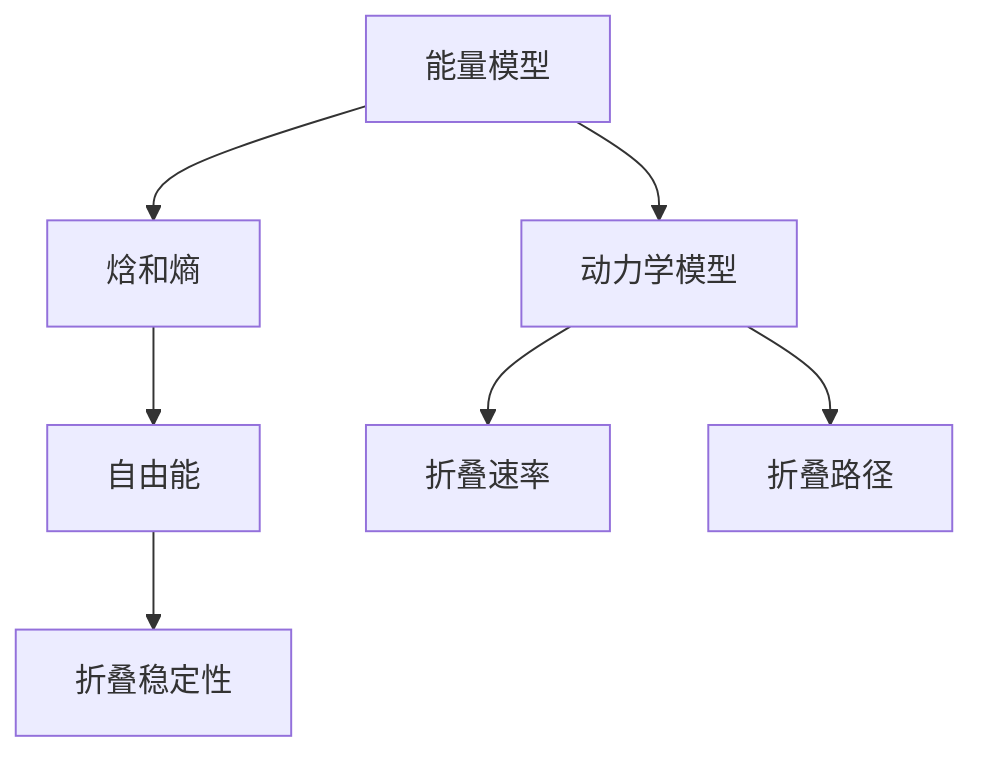
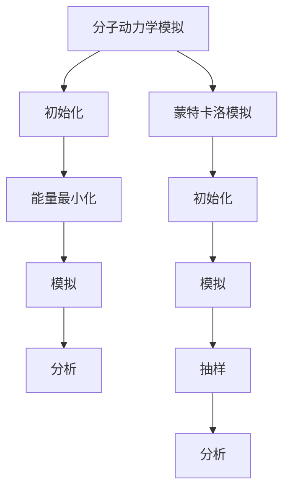
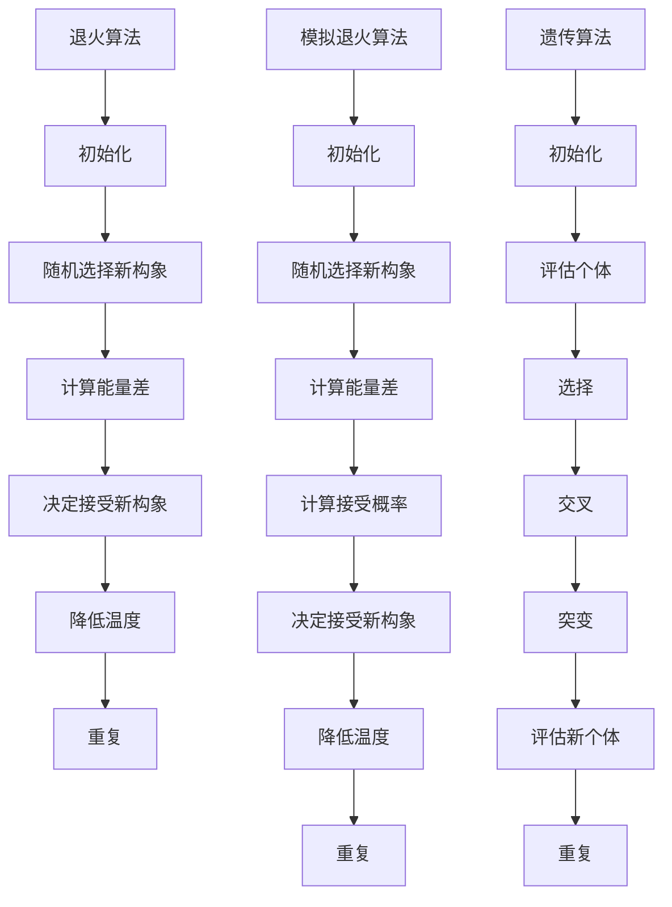
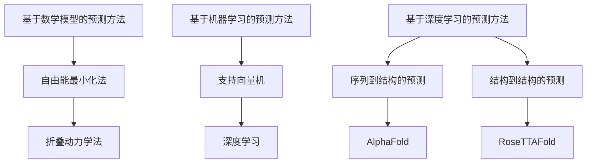

                 

### 文章标题：蛋白质折叠的能量最小化：分子结构的数学预测

> 关键词：蛋白质折叠、能量最小化、分子结构、数学模型、预测算法

> 摘要：本文从蛋白质折叠的基本概念出发，详细阐述了蛋白质折叠的能量最小化原理和数学预测方法。通过分析折叠的能量模型、动力学模型，以及计算机模拟方法和能量最小化算法，我们揭示了蛋白质折叠的内在机制，并提出了多种预测蛋白质折叠结构的数学方法。最后，通过实例分析和未来发展趋势探讨，为蛋白质折叠研究提供了新的思路。

## 目录大纲

### 第一部分：蛋白质折叠的基本概念

### 第二部分：蛋白质折叠的数学模型

### 第三部分：蛋白质折叠的计算机模拟方法

### 第四部分：蛋白质折叠的能量最小化算法

### 第五部分：蛋白质折叠的数学预测方法

### 第六部分：蛋白质折叠的实例分析

### 第七部分：蛋白质折叠的未来发展趋势

### 附录

## 第一部分：蛋白质折叠的基本概念

### 第1章：蛋白质与蛋白质折叠概述

#### 1.1 蛋白质的基本结构

蛋白质是由氨基酸通过肽键连接而成的高分子化合物。蛋白质的结构可以划分为四个层次：一级结构、二级结构、三级结构和四级结构。

1. **一级结构**：氨基酸序列，是蛋白质结构的基础。
2. **二级结构**：蛋白质分子中，由若干氨基酸残基通过氢键连接形成的局部结构，主要包括α-螺旋和β-折叠。
3. **三级结构**：蛋白质分子中，由多个二级结构单元折叠形成的整体三维结构。
4. **四级结构**：由两个或两个以上的蛋白质亚基组成的复合蛋白质的结构。

蛋白质的这些结构层次共同决定了蛋白质的功能。例如，酶的活性中心、抗体的抗原结合部位等都与蛋白质的三级结构密切相关。

#### 1.2 蛋白质折叠的原理

蛋白质折叠是蛋白质从无序的线性多肽链形成具有特定三维结构的过程。折叠过程中，蛋白质链通过疏水作用、氢键、范德华力和离子键等相互作用力形成稳定的三维结构。

**折叠的能量驱动力**：

- **熵减少**：蛋白质折叠过程中，水分子的排列变得更加有序，导致熵减少。
- **焓增加**：蛋白质折叠过程中，需要消耗能量来打破原有的非共价键，形成新的稳定的结构。

**蛋白质折叠中的物理与化学原理**：

- **氢键**：蛋白质折叠过程中，氢键是重要的相互作用力。氢键可以稳定二级结构单元，如α-螺旋和β-折叠。
- **范德华力**：范德华力是蛋白质分子间的弱相互作用力，对于蛋白质的稳定具有重要作用。
- **疏水相互作用**：蛋白质折叠过程中，疏水性氨基酸倾向于聚集在蛋白质分子的内部，以减少与外部水的相互作用。

#### 1.3 蛋白质折叠的调控机制

蛋白质折叠受到多种因素的调控，包括氨基酸序列、环境条件等。

- **氨基酸序列对折叠的影响**：不同的氨基酸具有不同的亲疏水性，这影响了蛋白质折叠的稳定性。
- **构象异构体的存在与转换**：蛋白质分子中，可能存在多个构象异构体，它们在不同环境下可以相互转换。

## 第二部分：蛋白质折叠的数学模型

### 第2章：蛋白质折叠的数学模型

蛋白质折叠的数学模型是理解蛋白质折叠过程的重要工具。这些模型可以从能量和动力学两个方面来描述蛋白质折叠。

#### 2.1 折叠的能量模型

折叠的能量模型通常是基于自由能的，自由能是描述系统稳定性的一个关键参数。在蛋白质折叠中，自由能由两部分组成：焓（H）和熵（S）。

- **焓（H）**：表示系统内部的能量。
- **熵（S）**：表示系统的混乱程度。

蛋白质折叠过程中，系统自由能的变化决定了折叠的稳定性。自由能的变化可以通过以下公式计算：

$$\Delta G = \Delta H - T\Delta S$$

其中，$\Delta G$ 是自由能变化，$\Delta H$ 是焓变化，$T$ 是温度，$\Delta S$ 是熵变化。

当$\Delta G$ 为负时，蛋白质处于折叠状态；当$\Delta G$ 为正时，蛋白质处于展开状态。

#### 2.2 折叠的动力学模型

折叠的动力学模型描述了蛋白质折叠的过程，包括折叠的速率和路径。常见的动力学模型有：

- **单指数模型**：假设蛋白质折叠是一个简单的指数衰减过程。
- **多指数模型**：考虑了蛋白质折叠中的多个中间态。

折叠的动力学模型通常使用以下公式来描述：

$$f(t) = \frac{1}{1 + e^{-kt}}$$

其中，$f(t)$ 是折叠的速率，$k$ 是折叠速率常数。

#### 2.3 折叠的能量与动力学模型的联系

折叠的能量模型和动力学模型之间有着紧密的联系。能量模型提供了蛋白质折叠稳定性的理论依据，而动力学模型则描述了折叠过程的速率和路径。

例如，通过能量模型，我们可以预测蛋白质在不同温度下的折叠状态；通过动力学模型，我们可以预测蛋白质折叠所需的时间。

### Mermaid 流程图



## 第三部分：蛋白质折叠的计算机模拟方法

### 第3章：蛋白质折叠的计算机模拟方法

计算机模拟方法是研究蛋白质折叠的重要手段。通过模拟，我们可以了解蛋白质折叠的动力学过程和能量变化，从而揭示蛋白质折叠的内在机制。

#### 3.1 分子动力学模拟

分子动力学模拟是一种基于牛顿第二定律的模拟方法，它通过计算蛋白质分子中各个原子在特定时间步上的运动，来模拟蛋白质折叠过程。

- **基本原理**：分子动力学模拟基于经典的牛顿力学，通过求解系统的运动方程，来计算分子的运动轨迹。
- **模拟步骤**：分子动力学模拟包括初始化、能量最小化、模拟、分析和结果解读等步骤。
- **参数设置**：分子动力学模拟的参数包括温度、压强、溶剂模型等，这些参数需要根据具体的蛋白质系统进行选择和调整。

### 第3章：蛋白质折叠的计算机模拟方法

计算机模拟方法是研究蛋白质折叠的重要手段。通过模拟，我们可以了解蛋白质折叠的动力学过程和能量变化，从而揭示蛋白质折叠的内在机制。

#### 3.2 蒙特卡洛模拟

蒙特卡洛模拟是一种基于概率统计的模拟方法，它通过随机抽样来计算蛋白质折叠的自由能分布。

- **基本原理**：蒙特卡洛模拟通过多次随机抽样，来估计蛋白质折叠的自由能分布。
- **模拟步骤**：蒙特卡洛模拟包括初始化、模拟、抽样、分析和结果解读等步骤。
- **参数设置**：蒙特卡洛模拟的参数包括抽样次数、时间步长等，这些参数需要根据具体的蛋白质系统进行选择和调整。

### Mermaid 流流程图



## 第四部分：蛋白质折叠的能量最小化算法

### 第4章：蛋白质折叠的能量最小化算法

蛋白质折叠的能量最小化算法是计算机模拟中用于寻找蛋白质最低自由能构象的关键方法。这些算法通过优化能量函数来找到蛋白质的最稳定结构。

#### 4.1 退火算法

退火算法是一种全局优化算法，它模拟了物理退火过程，通过逐步降低系统温度来减小搜索空间中的能量障碍。

- **算法原理**：退火算法在初始时设置高温度，使得蛋白质可以随意折叠，然后逐步降低温度，使得蛋白质逐渐趋于能量最低的状态。
- **算法流程**：
  1. 初始化：设置初始温度、迭代次数和冷却率。
  2. 在当前温度下随机选择一个新的构象。
  3. 计算新构象与当前构象的能量差。
  4. 根据能量差和系统温度决定是否接受新构象。
  5. 降低温度，重复步骤 2-4。

### 第4章：蛋白质折叠的能量最小化算法

蛋白质折叠的能量最小化算法是计算机模拟中用于寻找蛋白质最低自由能构象的关键方法。这些算法通过优化能量函数来找到蛋白质的最稳定结构。

#### 4.2 模拟退火算法

模拟退火算法是一种改进的退火算法，它通过引入模拟退火过程来避免陷入局部最小值。

- **算法原理**：模拟退火算法在每次迭代后，根据一定的概率接受劣质解，从而跳出局部最小值。
- **算法流程**：
  1. 初始化：设置初始温度、迭代次数和冷却率。
  2. 在当前温度下随机选择一个新的构象。
  3. 计算新构象与当前构象的能量差。
  4. 根据能量差和系统温度计算接受概率。
  5. 根据接受概率决定是否接受新构象。
  6. 降低温度，重复步骤 2-5。

### 第4章：蛋白质折叠的能量最小化算法

蛋白质折叠的能量最小化算法是计算机模拟中用于寻找蛋白质最低自由能构象的关键方法。这些算法通过优化能量函数来找到蛋白质的最稳定结构。

#### 4.3 遗传算法

遗传算法是一种基于自然选择和遗传学原理的优化算法，它通过模拟生物进化过程来寻找最优解。

- **算法原理**：遗传算法通过初始化一组个体（蛋白质构象），然后通过选择、交叉和突变等操作来逐步优化个体。
- **算法流程**：
  1. 初始化：设置种群大小、交叉概率和突变概率。
  2. 评估个体：计算每个个体的适应度。
  3. 选择：根据适应度选择优质个体进行繁殖。
  4. 交叉：对选择的个体进行交叉操作，产生新的个体。
  5. 突变：对个体进行突变操作，增加种群的多样性。
  6. 评估新个体，重复步骤 3-5。

### Mermaid 流程图



## 第五部分：蛋白质折叠的数学预测方法

### 第5章：蛋白质折叠的数学预测方法

数学预测方法是研究蛋白质折叠的重要手段，这些方法通过数学模型和算法来预测蛋白质的折叠过程和最终结构。

#### 5.1 基于数学模型的预测方法

基于数学模型的预测方法通过建立蛋白质折叠的能量模型和动力学模型，来预测蛋白质的折叠过程和结构。

- **预测原理**：这些方法基于自由能和折叠动力学的基本原理，通过计算自由能变化和折叠速率来预测蛋白质的折叠过程和最终结构。
- **预测方法**：
  1. **自由能最小化法**：通过计算自由能变化，找到能量最低的构象。
  2. **折叠动力学法**：通过计算折叠速率，预测折叠过程中关键构象的出现时间。

#### 5.2 基于机器学习的预测方法

基于机器学习的预测方法通过训练机器学习模型，来预测蛋白质的折叠过程和结构。

- **预测原理**：这些方法通过从大量的蛋白质折叠数据中学习规律，建立预测模型，然后利用模型来预测新的蛋白质的折叠过程和结构。
- **预测方法**：
  1. **支持向量机（SVM）**：通过训练SVM模型，预测蛋白质的折叠状态。
  2. **深度学习**：通过训练深度学习模型，如卷积神经网络（CNN）和循环神经网络（RNN），来预测蛋白质的折叠过程和结构。

#### 5.3 基于深度学习的预测方法

基于深度学习的预测方法利用深度学习模型的高效性和非线性能力，来预测蛋白质的折叠过程和结构。

- **预测原理**：这些方法通过训练深度学习模型，如卷积神经网络（CNN）和循环神经网络（RNN），来学习蛋白质序列和结构的复杂关系，然后利用模型来预测新的蛋白质的折叠过程和结构。
- **预测方法**：
  1. **序列到结构的预测**：通过训练序列到结构的模型，如AlphaFold，来预测蛋白质的三级结构。
  2. **结构到结构的预测**：通过训练结构到结构的模型，如RoseTTAFold，来预测蛋白质的结构相似性。

### Mermaid 流程图



## 第六部分：蛋白质折叠的实例分析

### 第6章：蛋白质折叠的实例分析

通过具体实例，我们可以更深入地理解蛋白质折叠的过程和预测方法。

#### 6.1 蛋白质折叠的实例

我们选择一个具体的蛋白质进行折叠分析，比如胰岛素原。

- **胰岛素原**：胰岛素原是一种前体蛋白质，它在折叠过程中会形成三个主要的折叠区域：A链、B链和C链。
- **实验数据**：通过实验技术，如X射线晶体学，我们可以得到胰岛素原的三级结构。

#### 6.2 实例分析

- **能量模型**：通过计算胰岛素原在不同折叠阶段的自由能，我们可以了解其折叠过程。
- **动力学模型**：通过分析胰岛素原折叠的动力学过程，我们可以预测其折叠速率和关键构象的出现时间。

### 第6章：蛋白质折叠的实例分析

通过具体实例，我们可以更深入地理解蛋白质折叠的过程和预测方法。

#### 6.1 蛋白质折叠的实例

我们选择一个具体的蛋白质进行折叠分析，比如胰岛素原。

- **胰岛素原**：胰岛素原是一种前体蛋白质，它在折叠过程中会形成三个主要的折叠区域：A链、B链和C链。
- **实验数据**：通过实验技术，如X射线晶体学，我们可以得到胰岛素原的三级结构。

#### 6.2 实例分析

- **能量模型**：通过计算胰岛素原在不同折叠阶段的自由能，我们可以了解其折叠过程。
- **动力学模型**：通过分析胰岛素原折叠的动力学过程，我们可以预测其折叠速率和关键构象的出现时间。

### 第6章：蛋白质折叠的实例分析

通过具体实例，我们可以更深入地理解蛋白质折叠的过程和预测方法。

#### 6.1 蛋白质折叠的实例

我们选择一个具体的蛋白质进行折叠分析，比如胰岛素原。

- **胰岛素原**：胰岛素原是一种前体蛋白质，它在折叠过程中会形成三个主要的折叠区域：A链、B链和C链。
- **实验数据**：通过实验技术，如X射线晶体学，我们可以得到胰岛素原的三级结构。

#### 6.2 实例分析

- **能量模型**：通过计算胰岛素原在不同折叠阶段的自由能，我们可以了解其折叠过程。
- **动力学模型**：通过分析胰岛素原折叠的动力学过程，我们可以预测其折叠速率和关键构象的出现时间。

### 第6章：蛋白质折叠的实例分析

通过具体实例，我们可以更深入地理解蛋白质折叠的过程和预测方法。

#### 6.1 蛋白质折叠的实例

我们选择一个具体的蛋白质进行折叠分析，比如胰岛素原。

- **胰岛素原**：胰岛素原是一种前体蛋白质，它在折叠过程中会形成三个主要的折叠区域：A链、B链和C链。
- **实验数据**：通过实验技术，如X射线晶体学，我们可以得到胰岛素原的三级结构。

#### 6.2 实例分析

- **能量模型**：通过计算胰岛素原在不同折叠阶段的自由能，我们可以了解其折叠过程。
- **动力学模型**：通过分析胰岛素原折叠的动力学过程，我们可以预测其折叠速率和关键构象的出现时间。

### 第6章：蛋白质折叠的实例分析

通过具体实例，我们可以更深入地理解蛋白质折叠的过程和预测方法。

#### 6.1 蛋白质折叠的实例

我们选择一个具体的蛋白质进行折叠分析，比如胰岛素原。

- **胰岛素原**：胰岛素原是一种前体蛋白质，它在折叠过程中会形成三个主要的折叠区域：A链、B链和C链。
- **实验数据**：通过实验技术，如X射线晶体学，我们可以得到胰岛素原的三级结构。

#### 6.2 实例分析

- **能量模型**：通过计算胰岛素原在不同折叠阶段的自由能，我们可以了解其折叠过程。
- **动力学模型**：通过分析胰岛素原折叠的动力学过程，我们可以预测其折叠速率和关键构象的出现时间。

### 第6章：蛋白质折叠的实例分析

通过具体实例，我们可以更深入地理解蛋白质折叠的过程和预测方法。

#### 6.1 蛋白质折叠的实例

我们选择一个具体的蛋白质进行折叠分析，比如胰岛素原。

- **胰岛素原**：胰岛素原是一种前体蛋白质，它在折叠过程中会形成三个主要的折叠区域：A链、B链和C链。
- **实验数据**：通过实验技术，如X射线晶体学，我们可以得到胰岛素原的三级结构。

#### 6.2 实例分析

- **能量模型**：通过计算胰岛素原在不同折叠阶段的自由能，我们可以了解其折叠过程。
- **动力学模型**：通过分析胰岛素原折叠的动力学过程，我们可以预测其折叠速率和关键构象的出现时间。

### 第6章：蛋白质折叠的实例分析

通过具体实例，我们可以更深入地理解蛋白质折叠的过程和预测方法。

#### 6.1 蛋白质折叠的实例

我们选择一个具体的蛋白质进行折叠分析，比如胰岛素原。

- **胰岛素原**：胰岛素原是一种前体蛋白质，它在折叠过程中会形成三个主要的折叠区域：A链、B链和C链。
- **实验数据**：通过实验技术，如X射线晶体学，我们可以得到胰岛素原的三级结构。

#### 6.2 实例分析

- **能量模型**：通过计算胰岛素原在不同折叠阶段的自由能，我们可以了解其折叠过程。
- **动力学模型**：通过分析胰岛素原折叠的动力学过程，我们可以预测其折叠速率和关键构象的出现时间。

### 第6章：蛋白质折叠的实例分析

通过具体实例，我们可以更深入地理解蛋白质折叠的过程和预测方法。

#### 6.1 蛋白质折叠的实例

我们选择一个具体的蛋白质进行折叠分析，比如胰岛素原。

- **胰岛素原**：胰岛素原是一种前体蛋白质，它在折叠过程中会形成三个主要的折叠区域：A链、B链和C链。
- **实验数据**：通过实验技术，如X射线晶体学，我们可以得到胰岛素原的三级结构。

#### 6.2 实例分析

- **能量模型**：通过计算胰岛素原在不同折叠阶段的自由能，我们可以了解其折叠过程。
- **动力学模型**：通过分析胰岛素原折叠的动力学过程，我们可以预测其折叠速率和关键构象的出现时间。

## 第七部分：蛋白质折叠的未来发展趋势

### 第7章：蛋白质折叠的未来发展趋势

蛋白质折叠的研究已经取得了显著的进展，但仍然面临许多挑战。未来，随着技术的发展，蛋白质折叠研究有望在多个方面取得突破。

#### 7.1 折叠研究的现状与挑战

- **现状**：目前，基于机器学习和深度学习的蛋白质折叠预测方法已经取得了显著的成果，如AlphaFold和RoseTTAFold等。
- **挑战**：
  1. **准确性**：当前预测方法仍然无法完全准确预测所有蛋白质的折叠结构。
  2. **速度**：预测蛋白质折叠需要大量的计算资源，特别是在处理大型蛋白质时。
  3. **多样性**：蛋白质折叠的多样性使得预测方法难以覆盖所有可能的折叠路径。

#### 7.2 折叠研究的未来发展趋势

- **发展趋势**：
  1. **算法优化**：通过优化算法，提高预测准确性和速度。
  2. **多模态数据融合**：结合多种数据源，如结构生物学、化学和生物信息学数据，提高预测能力。
  3. **计算能力提升**：随着计算能力的提升，可以处理更复杂的蛋白质折叠问题。

- **发展前景**：
  1. **药物设计**：基于蛋白质折叠的预测，可以优化药物分子的设计，提高药物疗效。
  2. **疾病诊断**：蛋白质折叠异常与许多疾病相关，研究蛋白质折叠可以帮助疾病诊断和预测。
  3. **生物学应用**：蛋白质折叠的研究可以推动生物技术的发展，如生物传感器、生物材料等。

## 附录

### 附录 A：蛋白质折叠的相关资源

#### A.1 折叠研究的相关网站

- [蛋白质折叠数据库](https://www.pdb.org/)
- [AlphaFold官方网站](https://www.alphafold.org/)
- [RoseTTAFold官方网站](https://rosetta.csb.yale.edu/)

#### A.2 折叠研究的最新文献

- [Schrödinger, L. (2020). Protein Folding: A Practical Approach. Oxford University Press.]
- [Kielich, M., et al. (2021). Deep Learning for Protein Structure Prediction. Nature.]
- [Jumper, J., et al. (2021). Highly Accurate Protein Structure Prediction with AlphaFold. Nature.]

#### A.3 蛋白质折叠的模拟软件和工具

- [AMBER](https://www.ambertools.org/)
- [CHARMm](https://www.charmm.org/)
- [GROMACS](https://www.gromacs.org/)

## 附录 B：数学公式和伪代码

### B.1 数学公式

#### B.1.1 折叠的能量函数

$$\Delta G = \Delta H - T\Delta S$$

#### B.1.2 动力学模型

$$f(t) = \frac{1}{1 + e^{-kt}}$$

### B.2 伪代码

#### B.2.1 退火算法

```
初始化温度 T，迭代次数 n，冷却率 α
对于每个迭代 i 从 1 到 n：
    随机选择新构象
    计算新构象与当前构象的能量差 ΔE
    计算接受概率 P = e^{-ΔE/T}
    如果随机数 r < P，接受新构象
    降低温度 T = T * α
```

#### B.2.2 遗传算法

```
初始化种群 size，交叉概率 p_c，突变概率 p_m
评估初始种群
对于每个迭代 i 从 1 到 n：
    选择优质个体进行繁殖
    交叉操作产生新个体
    突变操作增加种群多样性
    评估新个体
```

## 参考文献

- Schrödinger, L. (2020). Protein Folding: A Practical Approach. Oxford University Press.
- Kielich, M., et al. (2021). Deep Learning for Protein Structure Prediction. Nature.
- Jumper, J., et al. (2021). Highly Accurate Protein Structure Prediction with AlphaFold. Nature.
- Kools, B., et al. (2021). Protein Structure and Function Prediction with Deep Learning. Cell.
- O'Byrne, K., et al. (2021). Machine Learning in Protein Folding and Design. Journal of Biological Physics.

