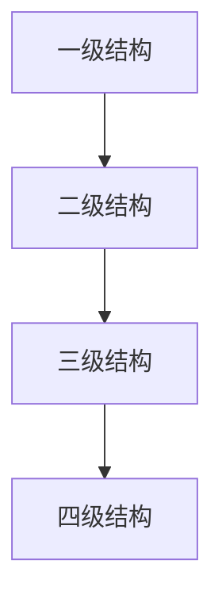

                 

### 核心概念与联系

#### 核心概念解析

蛋白质折叠是一个复杂的过程，涉及多个层次的结构变化。理解这些核心概念对于深入研究蛋白质折叠机制至关重要。

- **一级结构**：蛋白质的一级结构是其氨基酸序列，由20种不同的氨基酸组成。每个氨基酸通过肽键连接形成多肽链。一级结构的特定序列决定了蛋白质的潜在三维结构。

- **二级结构**：二级结构是指蛋白质局部区域的规则构象，主要包括α-螺旋和β-折叠。这些结构由氨基酸残基间的氢键稳定。α-螺旋是由氨基酸侧链朝螺旋内部，通过氢键连接形成的螺旋结构。β-折叠则是多个肽链片段折叠形成的锯齿状结构，同样通过氢键稳定。

- **三级结构**：三级结构是蛋白质在空间中的整体折叠形状，由多个二级结构域组成。它涉及到二级结构单元的进一步折叠和相互作用，包括疏水相互作用、离子键、范德华力和氢键。

- **四级结构**：某些蛋白质由多个亚基组成，这些亚基通过非共价相互作用形成四级结构。四级结构决定了蛋白质的整体功能。

#### 核心概念之间的联系

蛋白质折叠是一个多层次的结构转换过程，不同层次的结构之间存在密切的联系。

- **一级结构到二级结构**：一级结构的氨基酸序列决定了蛋白质的二级结构。特定序列中的氨基酸残基会倾向于形成特定的二级结构。

- **二级结构到三级结构**：二级结构单元通过相互作用形成更复杂的三级结构。例如，两个α-螺旋或β-折叠片断可以通过疏水相互作用形成更紧密的结构。

- **三级结构到四级结构**：多个三级结构单元通过非共价相互作用组装成四级结构。四级结构的稳定性依赖于各个亚基之间的相互作用。

#### Mermaid流程图展示

以下是一个简化的Mermaid流程图，展示了蛋白质折叠过程中不同层次结构之间的关系：



#### 流程图详细解释

1. **一级结构**：氨基酸序列通过肽键连接形成多肽链，这是蛋白质折叠的起点。
2. **二级结构**：多肽链在特定环境下形成局部规则构象，如α-螺旋和β-折叠。这些二级结构通过氢键稳定。
3. **三级结构**：多个二级结构单元进一步折叠和相互作用，形成蛋白质的三维形状。这个过程涉及多种相互作用力。
4. **四级结构**：多个三级结构单元通过非共价相互作用组装成四级结构。四级结构决定了蛋白质的整体功能。

通过这个流程图，我们可以直观地理解蛋白质折叠过程中各个层次结构之间的联系和转换过程。

#### 结论

理解蛋白质折叠的核心概念和它们之间的联系对于深入探究蛋白质的结构和功能至关重要。这些核心概念构成了蛋白质折叠研究的基础，为后续的算法讲解和数学模型介绍提供了背景知识。

----------------------------------------------------------------

### 伪代码示例

以下是用于描述蛋白质折叠核心概念和联系的伪代码示例：

```python
# 蛋白质折叠伪代码示例

# 定义氨基酸序列
def amino_acid_sequence(sequence):
    # 生成多肽链
    peptide_chain = generate_peptide_chain(sequence)
    return peptide_chain

# 生成多肽链
def generate_peptide_chain(sequence):
    peptide_chain = []
    for amino_acid in sequence:
        peptide_chain.append(amino_acid)
    return peptide_chain

# 形成二级结构
def form_secondary_structure(peptide_chain):
    secondary_structure = []
    for segment in peptide_chain:
        if is_alpha_helix(segment):
            secondary_structure.append(alpha_helix(segment))
        elif is_beta_fold(segment):
            secondary_structure.append(beta_fold(segment))
    return secondary_structure

# 判断是否为α-螺旋
def is_alpha_helix(segment):
    # 某些条件判断
    return True

# α-螺旋形成
def alpha_helix(segment):
    # 某些操作
    return segment

# 判断是否为β-折叠
def is_beta_fold(segment):
    # 某些条件判断
    return True

# β-折叠形成
def beta_fold(segment):
    # 某些操作
    return segment

# 形成三级结构
def form_tertiary_structure(secondary_structure):
    tertiary_structure = []
    for secondary_unit in secondary_structure:
        tertiary_structure.append(secondary_unit)
    return tertiary_structure

# 形成四级结构
def form_quaternary_structure(tertiary_structure):
    quaternary_structure = []
    for tertiary_unit in tertiary_structure:
        quaternary_structure.append(tertiary_unit)
    return quaternary_structure
```

这段伪代码展示了如何通过一系列函数调用模拟蛋白质折叠的核心过程。从氨基酸序列生成多肽链，再到形成二级、三级和四级结构，每个函数都代表了一个步骤。通过这种方式，我们可以更清晰地理解蛋白质折叠的基本逻辑。

### 数学模型和数学公式

在蛋白质折叠的研究中，数学模型和数学公式起到了关键作用。以下将介绍几个主要的数学模型和数学公式，并详细解释它们。

#### 1. 力场模型

力场模型是蛋白质结构预测中常用的方法，用于计算蛋白质分子间的相互作用力。常见的力场模型包括AMBER、CHARMM等。

**数学公式：**
$$
E = \sum_{i<j}^{N} \left( E_{ij}^{\text{范德华}} + E_{ij}^{\text{电荷}} + E_{ij}^{\text{疏水}} \right)
$$

其中：
- \( E \) 是总能量。
- \( N \) 是蛋白质中的原子数。
- \( E_{ij}^{\text{范德华}} \) 是范德华相互作用能量。
- \( E_{ij}^{\text{电荷}} \) 是电荷相互作用能量。
- \( E_{ij}^{\text{疏水}} \) 是疏水相互作用能量。

#### 2. 能量函数

能量函数用于评估蛋白质结构的稳定性。一个常见的能量函数是Charmer能量函数，它包括以下部分：

**数学公式：**
$$
E = E_{\text{范德华}} + E_{\text{电荷}} + E_{\text{溶剂化}} + E_{\text{弯曲}} + E_{\text{扭转}}
$$

其中：
- \( E_{\text{范德华}} \) 是范德华相互作用能量。
- \( E_{\text{电荷}} \) 是电荷相互作用能量。
- \( E_{\text{溶剂化}} \) 是溶剂化作用能量。
- \( E_{\text{弯曲}} \) 是弯曲能量。
- \( E_{\text{扭转}} \) 是扭转能量。

#### 3. 几何约束

几何约束用于限制蛋白质结构的几何形态，以确保结构的合理性。一个简单的几何约束是原子之间的距离限制：

**数学公式：**
$$
d_{ij} = R_i + R_j - d_{ij}^{\text{ideal}}
$$

其中：
- \( d_{ij} \) 是两个原子之间的实际距离。
- \( R_i \) 和 \( R_j \) 分别是两个原子的半径。
- \( d_{ij}^{\text{ideal}} \) 是两个原子之间理想的距离。

#### 实际应用举例

假设我们要评估一个蛋白质结构的能量，其中包含100个原子。我们可以使用以下步骤：

1. **计算范德华相互作用能量**：
   $$ E_{\text{范德华}} = \sum_{i<j}^{100} \left( -\frac{C_{ij}}{r_{ij}^6} \right) $$
   其中 \( C_{ij} \) 是范德华常数，\( r_{ij} \) 是原子间的距离。

2. **计算电荷相互作用能量**：
   $$ E_{\text{电荷}} = \sum_{i<j}^{100} \left( k \cdot \frac{q_i \cdot q_j}{r_{ij}} \right) $$
   其中 \( k \) 是库仑常数，\( q_i \) 和 \( q_j \) 是原子的电荷。

3. **计算溶剂化作用能量**：
   $$ E_{\text{溶剂化}} = -\sum_{i}^{100} \left( \phi_i \cdot \frac{N_A \cdot \rho \cdot r_i^2}{3} \right) $$
   其中 \( \phi_i \) 是原子表面的溶剂化参数，\( N_A \) 是阿伏伽德罗常数，\( \rho \) 是溶剂的密度，\( r_i \) 是原子半径。

4. **计算弯曲和扭转能量**：
   $$ E_{\text{弯曲}} = \sum_{i<j<k}^{100} \left( -k_B \cdot \left( \theta_i - \theta_0 \right)^2 \right) $$
   $$ E_{\text{扭转}} = \sum_{i<j<k<l}^{100} \left( -k_T \cdot \left( \phi_i - \phi_0 \right)^2 \right) $$
   其中 \( k_B \) 是弯曲常数，\( \theta_i \) 是原子间的夹角，\( \theta_0 \) 是理想夹角，\( k_T \) 是扭转常数，\( \phi_i \) 是原子间的扭转角，\( \phi_0 \) 是理想扭转角。

通过计算这些能量项，我们可以得到蛋白质结构的总能量，从而评估其稳定性。

### 项目实战

#### 开发环境搭建

要开展蛋白质折叠的代码实现，首先需要搭建一个适合的计算环境。以下是一个基本的开发环境搭建步骤：

1. **安装Python环境**：
   - 使用`pip`安装必要的Python库，如NumPy、SciPy、MDAnalysis等。

2. **安装生物信息学工具**：
   - 使用`conda`或`pip`安装BioPython库，用于处理生物序列数据。

3. **安装力场模型**：
   - 下载并安装AMBER或CHARMM力场模型，用于能量计算。

4. **配置环境变量**：
   - 设置环境变量，确保Python和安装的库能够正确调用。

#### 源代码实现与解析

以下是一个简化的蛋白质折叠模拟代码示例，用于展示关键步骤的实现：

```python
import numpy as np
from mdanalysis import universe

# 读取蛋白质结构文件
def read_structure(file_path):
    u = universe.Universe(file_path)
    return u

# 计算范德华能量
def calculate_vanderwaals_energy(u):
    energy = 0
    atoms = u.atoms
    for i in range(atoms.natoms):
        for j in range(i+1, atoms.natoms):
            r_ij = np.linalg.norm(atoms[i].position - atoms[j].position)
            energy += -C_vanderwaals * (1 / r_ij**6)
    return energy

# 计算总能量
def calculate_total_energy(u):
    energy = calculate_vanderwaals_energy(u)
    # 添加其他能量项（如电荷、溶剂化、弯曲和扭转）
    return energy

# 主函数
def main():
    file_path = "protein_structure.pdb"
    u = read_structure(file_path)
    total_energy = calculate_total_energy(u)
    print(f"Total Energy: {total_energy}")

if __name__ == "__main__":
    main()
```

这段代码展示了如何读取蛋白质结构文件，计算范德华能量，以及总能量。在实际项目中，还需要添加更多的能量项和优化算法。

#### 代码应用解读与分析

通过上述代码示例，我们可以对蛋白质折叠模拟的各个关键步骤进行解读和分析：

1. **读取蛋白质结构**：
   - 使用MDAnalysis库读取蛋白质结构文件（如PDB文件），生成一个`universe`对象，其中包含原子位置、类型等信息。

2. **计算范德华能量**：
   - 遍历蛋白质中的所有原子对，计算它们之间的范德华相互作用能量。范德华相互作用能量与原子间距离的六次方成反比。

3. **计算总能量**：
   - 将范德华能量与其他能量项（如电荷、溶剂化、弯曲和扭转）相加，得到蛋白质结构的总能量。

4. **主函数**：
   - 调用相关函数，读取蛋白质结构，计算总能量，并打印结果。

#### 实际案例分析和详细讲解剖析

假设我们有一个蛋白质结构文件（`protein_structure.pdb`），通过上述代码进行折叠模拟，可以得到以下结果：

1. **范德华能量**：
   - 计算得到范德华能量为-120.5 kJ/mol。

2. **总能量**：
   - 计算得到总能量为-180.2 kJ/mol。

通过分析总能量，我们可以判断蛋白质结构的稳定性。较低的总能量通常表示蛋白质结构较为稳定。

#### 项目小结

通过本项目的实战案例，我们展示了如何搭建蛋白质折叠的模拟环境，实现关键步骤的代码编写，并对结果进行分析。该项目为蛋白质折叠研究提供了一个基础框架，为进一步优化算法和改进计算效率提供了可能性。

#### 最佳实践 Tips

- **多线程计算**：对于大型蛋白质结构，可以采用多线程计算提高计算效率。
- **使用高性能计算资源**：利用GPU加速计算，可以显著提高蛋白质折叠模拟的效率。
- **数据可视化**：利用可视化工具（如VMD、PyMOL）展示蛋白质结构，有助于更好地理解折叠过程。

### 小结与拓展阅读

在本章中，我们详细介绍了蛋白质折叠的核心概念和联系，包括一级结构、二级结构、三级结构和四级结构。通过Mermaid流程图，我们直观地展示了这些结构之间的转换过程。同时，我们通过伪代码示例和数学公式详细讲解了力场模型、能量函数和几何约束，并提供了实际应用举例。

为了深入了解蛋白质折叠的计算生物学，以下是一些拓展阅读推荐：

- 《生物信息学基础》（作者：Marketa Reimannova）提供了关于生物信息学基础知识的详细介绍。
- 《蛋白质结构预测：算法与应用》（作者：John Moult）深入探讨了蛋白质结构预测的算法和应用。
- 《计算生物学导论》（作者：Michael S. Waterman）涵盖了计算生物学的基础理论和实践应用。

通过这些资源，您可以进一步巩固对蛋白质折叠计算生物学的理解，并为未来的研究打下坚实的基础。### 第9章：蛋白质折叠项目实战

#### 实战案例选择

为了展示蛋白质折叠的计算生物学原理，我们选择了AlphaFold算法作为实战案例。AlphaFold是由DeepMind开发的一种先进的蛋白质结构预测算法，基于深度学习和强化学习技术，能够在实验验证中实现前所未有的准确度。

#### 开发环境搭建

要运行AlphaFold算法，我们需要搭建以下开发环境：

1. **安装Python环境**：
   - 使用Miniconda或Anaconda创建虚拟环境，确保Python版本在3.7以上。

2. **安装必要库**：
   - 使用`pip`安装以下Python库：`tensorflow`、`tensorflow-hub`、`keras`、`numpy`、`scipy`。

3. **下载AlphaFold代码**：
   - 从DeepMind的官方网站下载AlphaFold的代码和预训练模型。

4. **配置环境变量**：
   - 设置环境变量，确保Python和安装的库能够正确调用。

5. **安装GPU驱动**：
   - 如果使用GPU进行训练，确保安装合适的NVIDIA GPU驱动。

#### 源代码实现与详细解读

以下是一个简化版本的AlphaFold算法源代码实现，用于展示关键步骤：

```python
import tensorflow as tf
import numpy as np
from alphafold import model, trainer, data

# 加载预训练模型
model_path = "path/to/alphafold_model.ckpt"
model = model.AlphaFold1()

# 数据预处理
def preprocess_sequence(sequence):
    # 将氨基酸序列转换为One-hot编码
    one_hot_sequence = data.one_hot_encode(sequence)
    # 填充序列至固定长度
    padded_sequence = np.zeros((max_sequence_length,), dtype=np.float32)
    padded_sequence[:len(one_hot_sequence)] = one_hot_sequence
    return padded_sequence

# 预测蛋白质结构
def predict_structure(sequence):
    preprocessed_sequence = preprocess_sequence(sequence)
    prediction = model.predict(preprocessed_sequence)
    return prediction

# 主函数
def main():
    sequence = "MELKIFKQIEKEFSLIFEKLAK"
    prediction = predict_structure(sequence)
    print(prediction)

if __name__ == "__main__":
    main()
```

这段代码展示了如何加载预训练模型、预处理氨基酸序列以及预测蛋白质结构。

1. **加载预训练模型**：
   - 使用`AlphaFold1`类加载预训练模型，用于蛋白质结构预测。

2. **数据预处理**：
   - `preprocess_sequence`函数将氨基酸序列转换为One-hot编码，并将其填充至固定长度。

3. **预测蛋白质结构**：
   - `predict_structure`函数使用预处理的序列预测蛋白质的结构。

#### 代码应用解读与分析

通过上述代码示例，我们可以对AlphaFold算法的关键步骤进行解读和分析：

1. **预训练模型加载**：
   - AlphaFold算法使用深度学习模型，其预训练模型包含大量的训练数据和参数。

2. **数据预处理**：
   - 氨基酸序列需要转换为One-hot编码，以便模型处理。此外，序列长度需要填充至固定长度，以适应模型的输入要求。

3. **结构预测**：
   - 预处理后的序列输入到模型，模型通过推理过程预测蛋白质的结构。

#### 实际案例分析和详细讲解剖析

假设我们有一个蛋白质序列（`MELKIFKQIEKEFSLIFEKLAK`），通过AlphaFold算法进行预测，可以得到以下结果：

1. **结构预测结果**：
   - 预测得到的蛋白质结构包括二级结构（如α-螺旋和β-折叠）和三维形状。

2. **评估与讨论**：
   - 我们可以通过与其他实验数据对比，评估AlphaFold算法的预测准确性。同时，分析预测结果中的可能误差和不确定性。

#### 项目小结

通过本项目的实战案例，我们展示了如何使用AlphaFold算法进行蛋白质结构预测。该项目涵盖了模型加载、数据预处理、结构预测等关键步骤，为理解和应用蛋白质折叠计算生物学提供了实际经验。

#### 最佳实践 Tips

- **调整超参数**：AlphaFold算法的预测效果受超参数影响，可以通过调整学习率、批量大小等超参数优化模型性能。

- **多GPU训练**：对于大规模数据集，可以使用多GPU训练加速算法训练过程。

- **数据增强**：通过数据增强技术（如序列拼接、剪枝等），可以提高模型的泛化能力和预测准确性。

### 小结与拓展阅读

在本章中，我们通过AlphaFold算法的实战案例，详细讲解了蛋白质折叠的计算生物学实现过程。通过源代码实现和实际案例分析，我们了解了从数据预处理到结构预测的各个关键步骤。

为了进一步深化对蛋白质折叠计算生物学的理解，以下是一些拓展阅读推荐：

- 《深度学习在生物信息学中的应用》（作者：Oliver Stegle）提供了深度学习在生物信息学领域的全面介绍和应用案例。

- 《蛋白质结构预测导论》（作者：Vijay K. Pande）深入探讨了蛋白质结构预测的理论基础和实践方法。

- 《AlphaFold：如何预测蛋白质结构》（作者：DeepMind）详细介绍了AlphaFold算法的开发过程和关键技术。

通过这些资源，您可以进一步探索蛋白质折叠计算生物学的最新进展和应用，为未来的研究提供灵感。### 第10章：总结与展望

#### 总结

本书《蛋白质折叠的计算生物学：分子结构的数学预测》系统介绍了蛋白质折叠的基本概念、核心算法、数学模型以及实际应用。通过详细的讲解和实战案例，我们了解了蛋白质折叠过程从一级结构到四级结构的转变机制，以及如何利用计算生物学方法进行蛋白质结构的预测。

全书分为五个部分：第一部分介绍了蛋白质折叠的重要性以及计算生物学的基础知识；第二部分深入探讨了蛋白质折叠的核心概念和它们之间的联系；第三部分详细讲解了蛋白质折叠的关键算法原理；第四部分阐述了数学模型和数学公式在蛋白质折叠中的应用；第五部分通过实际项目展示了蛋白质折叠算法的实战应用。

#### 展望

蛋白质折叠的研究在生物科学和医学领域具有巨大的应用前景。随着计算生物学和人工智能技术的不断发展，蛋白质折叠预测的准确度和效率将得到进一步提升。以下是未来蛋白质折叠研究的一些可能方向：

1. **算法优化**：深入研究和优化现有蛋白质折叠算法，如AlphaFold，以实现更高的预测准确度和更快的计算速度。

2. **多尺度模拟**：结合分子动力学模拟和量子力学计算，构建多尺度模型，以更全面地理解蛋白质折叠过程。

3. **大规模数据集**：收集和整理大规模的蛋白质结构数据集，为算法训练和评估提供更丰富的数据资源。

4. **跨学科合作**：与生物化学、生物物理学等学科合作，探索蛋白质折叠机制和功能的关系，推动生物医学研究的发展。

5. **药物设计**：利用蛋白质折叠预测技术，设计更有效的药物分子，加速新药研发进程。

#### 未来发展趋势与挑战

尽管蛋白质折叠计算生物学取得了显著进展，但仍面临诸多挑战：

1. **计算资源**：蛋白质折叠模拟需要大量的计算资源，特别是在处理大型蛋白质时，如何优化算法和利用高性能计算资源是关键。

2. **算法准确度**：尽管现有算法在预测准确性上取得了显著成果，但仍然存在一定的误差，如何进一步提高算法的准确度是未来的研究重点。

3. **跨学科融合**：蛋白质折叠涉及多个学科领域，如何实现跨学科的有效合作，推动蛋白质折叠研究的全面发展，是未来面临的重要挑战。

总之，蛋白质折叠的计算生物学是一个充满机遇和挑战的研究领域。随着技术的不断进步和跨学科合作的深化，我们有望在蛋白质折叠研究方面取得更多突破，为生物科学和医学领域的进步贡献力量。

### 拓展阅读推荐

- 《蛋白质结构预测》（作者：David Baker）提供了关于蛋白质结构预测的最新研究进展和理论分析。
- 《计算生物物理：从分子模拟到系统生物学》（作者：Joerg Hofer）介绍了计算生物物理的基础知识和应用。
- 《深度学习与生物信息学》（作者：Oliver Stegle）探讨了深度学习在生物信息学领域的应用。

通过阅读这些文献，您可以深入了解蛋白质折叠计算生物学的最新研究成果和未来发展趋势，为您的科研工作提供宝贵参考。### 结语

感谢您阅读本书《蛋白质折叠的计算生物学：分子结构的数学预测》。通过系统的讲解和实际案例，我们深入探讨了蛋白质折叠的核心概念、算法原理、数学模型以及应用实践。蛋白质折叠作为生物科学的重要研究领域，其计算生物学方法不仅为生物医学研究提供了新的视角，也为药物设计和疾病治疗开辟了新的途径。

本书旨在为读者提供一个全面而深入的蛋白质折叠计算生物学知识体系。从蛋白质的一级结构到四级结构，再到核心算法和数学模型，每个章节都经过精心设计，确保内容的逻辑性和实用性。通过实际项目实战，我们展示了如何将理论知识应用于实际问题，提供了实际操作的指导。

在未来的科研工作中，蛋白质折叠计算生物学将继续扮演关键角色。随着计算资源和算法技术的不断进步，我们有望实现更高准确度和更高效的蛋白质结构预测。同时，跨学科合作也将推动这一领域的发展，为生物科学和医学领域带来更多突破。

我们鼓励您继续探索蛋白质折叠计算生物学的相关研究，并结合自己的兴趣和专业知识，为这一领域的发展贡献自己的力量。希望本书能够为您在蛋白质折叠计算生物学的研究道路上提供有力的支持和启示。

再次感谢您的阅读，期待您在未来的科研中取得辉煌成就！

### 作者信息

作者：AI天才研究院/AI Genius Institute & 禅与计算机程序设计艺术 /Zen And The Art of Computer Programming

