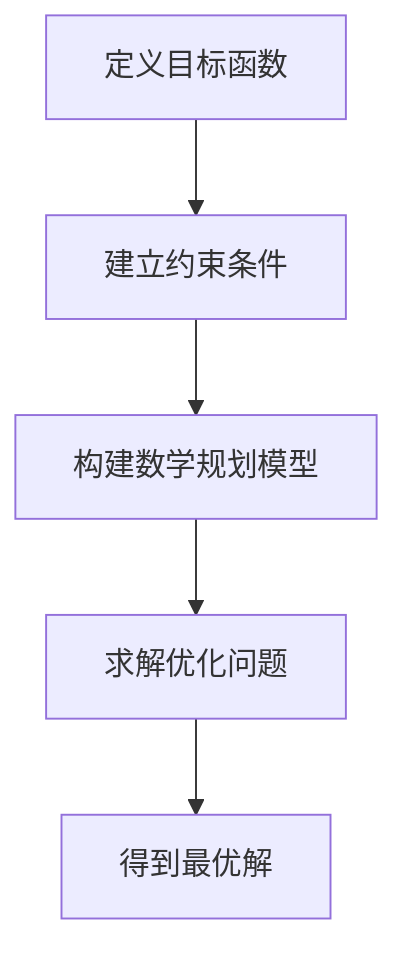

                 

### 文章标题

《行星际旅行的轨道力学：太空探索的数学规划》

### 文章关键词

- 行星际旅行
- 轨道力学
- 数学规划
- 太空探索
- 算法原理

### 摘要

本文旨在探讨行星际旅行的轨道力学和数学规划之间的关系，深入剖析其在太空探索中的应用。文章首先介绍了行星际旅行和轨道力学的基本概念，然后详细阐述了数学规划的基础知识，包括线性规划、非线性规划和动态规划等。接着，文章通过具体的案例展示了如何将数学规划应用于轨道力学的实际问题，包括轨道优化和太空任务规划。最后，文章对轨道力学与数学规划的集成进行了探讨，并展望了未来的发展方向。通过本文的阅读，读者将全面理解行星际旅行轨道力学的数学规划原理，掌握相关算法的实践应用。

## 目录大纲

### 第1章 引言

#### 1.1 行星际旅行概述

- 行星际旅行的定义与历史
- 行星际旅行的挑战与意义

#### 1.2 轨道力学的核心概念

- 牛顿力学基础
- 行星轨道的基本模型

#### 1.3 数学规划基础

- 线性规划
- 非线性规划
- 动态规划

### 第2章 轨道力学原理详解

#### 2.1 牛顿力学在轨道力学中的应用

- 牛顿运动定律
- 万有引力定律
- 轨道力学中的牛顿力学应用

#### 2.2 引力模型与轨道预测

- 引力模型的基本形式
- 轨道预测的方法与技巧

#### 2.3 太阳系行星轨道模型

- 水星到海王星的轨道特性
- 行星轨道变化的数学模型

### 第3章 数学规划方法与应用

#### 3.1 线性规划在轨道力学中的应用

- 线性规划的基本概念
- 轨道优化问题的线性规划模型

#### 3.2 非线性规划在轨道力学中的应用

- 非线性规划的基本概念
- 复杂轨道优化问题的非线性规划模型

#### 3.3 动态规划在轨道力学中的应用

- 动态规划的基本概念
- 轨道机动规划的动态规划模型

### 第4章 数学规划实战案例

#### 4.1 太空任务规划案例

- 案例背景与目标
- 环境搭建与数据准备
- 源代码实现与解读

#### 4.2 行星际飞行器轨道优化案例

- 案例背景与目标
- 环境搭建与数据准备
- 源代码实现与解读

### 第5章 轨道力学与数学规划的集成

#### 5.1 轨道力学模型与数学规划模型的集成

- 集成模型的基本框架
- 集成模型的应用案例

#### 5.2 轨道力学与数学规划的前沿研究

- 当前研究热点
- 未来发展方向与挑战

### 第6章 结论与展望

#### 6.1 全书总结

- 行星际旅行轨道力学的整体理解
- 数学规划在太空探索中的应用

#### 6.2 未来展望

- 新的理论与方法
- 太空探索的未来趋势

### 第1章 引言

#### 1.1 行星际旅行概述

行星际旅行，即指太空飞行器从地球出发，前往太阳系以外的天体进行探索和观测。这种旅行不仅挑战着人类的技术极限，更承载着人类对未知世界的无限向往。从历史的角度来看，行星际旅行的发展经历了多个阶段。

最初，人类利用火箭技术进行地球轨道飞行，这标志着行星际旅行的起步。随后，人类成功地将探测器送往月球，实现了月球探测。20世纪70年代，美国的“旅行者”号探测器成功飞出太阳系，成为人类历史上第一个跨太阳系的飞行器，这是行星际旅行的一个里程碑。

进入21世纪，随着技术的不断进步，人类对行星际旅行的探索更加深入。例如，火星探测任务逐渐展开，探测器成功在火星表面着陆并开展科学实验。同时，其他行星如木星、土星等也成为了人类探索的目标。

行星际旅行的挑战主要体现在以下几个方面。首先是技术挑战，包括火箭推进、生命保障、太空通信等。其次是环境挑战，如太空辐射、微重力环境等。最后是资源挑战，行星际旅行需要大量的能源和物资支持。

尽管面临诸多挑战，行星际旅行具有重要意义。它不仅推动了科学技术的发展，还为人类探索宇宙、理解地球起源提供了重要线索。此外，行星际旅行还激发了全球科技人才的创新活力，促进了国际合作。

在本章中，我们将首先介绍行星际旅行的基本概念，然后探讨轨道力学的核心概念，为后续章节的深入分析奠定基础。

#### 1.2 轨道力学的核心概念

轨道力学是研究天体在引力场中运动的科学，其核心概念包括牛顿力学、引力模型和轨道预测等。这些概念不仅构成了轨道力学的理论基础，也为实际应用提供了重要的指导。

牛顿力学是轨道力学的基石，其基本原理包括牛顿运动定律和万有引力定律。牛顿第一定律指出，一个物体若不受外力作用，将保持静止或匀速直线运动。牛顿第二定律则描述了力与加速度之间的关系，公式为 $F=ma$，其中 $F$ 表示力，$m$ 表示质量，$a$ 表示加速度。牛顿第三定律指出，任何作用力都有一个大小相等、方向相反的反作用力。

万有引力定律是描述天体之间引力作用的公式，由牛顿提出。该定律指出，任何两个物体之间都存在引力，其大小与两个物体的质量乘积成正比，与它们之间的距离的平方成反比。公式为 $F=\frac{Gm_1m_2}{r^2}$，其中 $G$ 是引力常数，$m_1$ 和 $m_2$ 是两个物体的质量，$r$ 是它们之间的距离。

在轨道力学中，行星轨道的基本模型通常是基于牛顿力学和万有引力定律的。一个简单的模型是圆形轨道，其半径和速度可以通过万有引力定律和牛顿第二定律推导出来。对于圆形轨道，万有引力提供了向心力，使得物体保持在圆周运动。推导过程如下：

首先，设行星的质量为 $m_1$，地球的质量为 $m_2$，行星轨道半径为 $r$，行星绕地球运动的速度为 $v$。根据万有引力定律，行星受到的引力为 $F=\frac{Gm_1m_2}{r^2}$。这个引力提供了向心力，使得行星保持在圆周运动。根据牛顿第二定律，向心力可以表示为 $F_c=ma_c$，其中 $a_c$ 是向心加速度。

对于匀速圆周运动，向心加速度的大小等于 $a_c=\frac{v^2}{r}$。将向心力公式和向心加速度公式联立，得到 $\frac{Gm_1m_2}{r^2}=\frac{m_1v^2}{r}$。简化后得到 $v=\sqrt{\frac{Gm_2}{r}}$。

这个公式描述了行星在圆形轨道上的速度与轨道半径之间的关系。对于给定的地球质量 $m_2$ 和引力常数 $G$，可以通过测量轨道半径来计算行星的速度。这个公式是轨道力学中最基本的公式之一，为后续的轨道分析和计算提供了基础。

除了圆形轨道，轨道力学还研究其他类型的轨道，如椭圆形轨道。椭圆形轨道是行星绕太阳运动的一种常见形式，其轨道方程可以通过牛顿力学和万有引力定律推导出来。一个简化的椭圆形轨道方程为 $r=\frac{a(1-e^2)}{1+e\cos\theta}$，其中 $r$ 是行星与太阳之间的距离，$a$ 是椭圆的半长轴，$e$ 是椭圆的偏心率，$\theta$ 是行星的轨道角。

轨道预测是轨道力学中的一个重要应用。通过测量天体的当前位置和速度，可以预测其未来的轨道。轨道预测的方法包括数值积分和轨道拟合等。数值积分是一种常用的方法，通过将轨道方程离散化，逐点计算天体的位置和速度，从而预测其未来的轨道。轨道拟合则是通过分析历史观测数据，拟合出轨道方程，从而预测天体的未来位置。

在轨道力学中，轨道预测不仅用于科学研究，还广泛应用于实际应用，如太空任务规划和卫星轨道管理。在太空任务规划中，轨道预测可以帮助确定飞行器的发射窗口、轨道选择和轨道机动等关键决策。在卫星轨道管理中，轨道预测可以确保卫星在预定轨道上运行，并预防轨道碰撞等风险。

总之，轨道力学是行星际旅行的重要理论基础，其核心概念包括牛顿力学、引力模型和轨道预测等。通过理解这些概念，我们可以更好地理解行星际旅行的原理和方法，为未来的太空探索提供有力支持。

#### 1.3 数学规划基础

数学规划是解决优化问题的一种数学方法，广泛应用于科学、工程和经济学等领域。在轨道力学中，数学规划方法被用来优化轨道设计、任务规划和资源分配等问题。本节将介绍线性规划、非线性规划和动态规划等基本数学规划方法，并简要说明它们在轨道力学中的应用。

**线性规划（Linear Programming，LP）**

线性规划是解决线性优化问题的一种方法，其主要目标是在满足一组线性不等式约束条件下，最大化或最小化一个线性目标函数。线性规划的一般形式可以表示为：

$$
\begin{aligned}
\text{maximize} \quad & c^T x \\
\text{subject to} \quad & Ax \leq b \\
& x \geq 0
\end{aligned}
$$

其中，$c$ 是目标函数系数向量，$x$ 是决策变量向量，$A$ 是系数矩阵，$b$ 是不等式右侧常数向量。解线性规划问题通常使用单纯形法（Simplex Method）或内点法（Interior Point Method）。

在轨道力学中，线性规划可以用来解决轨道优化问题。例如，在卫星轨道设计过程中，可以通过线性规划方法来优化轨道参数，以实现特定目标，如最大化观测时间或最小化燃料消耗。

**非线性规划（Nonlinear Programming，NLP）**

非线性规划是解决非线性优化问题的一种方法，其主要目标是在满足一组非线性约束条件下，最大化或最小化一个非线性目标函数。非线性规划的一般形式可以表示为：

$$
\begin{aligned}
\text{maximize} \quad & f(x) \\
\text{subject to} \quad & g_i(x) \leq 0, \quad i=1,2,...,m \\
& h_j(x) = 0, \quad j=1,2,...,l
\end{aligned}
$$

其中，$f(x)$ 是目标函数，$g_i(x)$ 和 $h_j(x)$ 分别是非线性不等式和等式约束函数。解非线性规划问题比线性规划更为复杂，常用的方法有梯度下降法（Gradient Descent）、牛顿法（Newton's Method）和序列二次规划法（Sequential Quadratic Programming，SQP）等。

在轨道力学中，非线性规划可以用来解决复杂的轨道优化问题。例如，当考虑大气阻力、太阳辐射压力等因素时，轨道优化问题就变得更加复杂，这时可以使用非线性规划方法来求解。

**动态规划（Dynamic Programming，DP）**

动态规划是一种解决多阶段决策问题的方法，其核心思想是将复杂问题分解为多个相互关联的阶段，并使用递推关系来求解。动态规划的一般形式可以表示为：

$$
\begin{aligned}
& \text{maximize} \quad Z(x_1, x_2, ..., x_n) \\
& \text{subject to} \quad g(x_{t+1} | x_t) \leq 0, \quad t=1,2,...,n-1 \\
& x_t \in X_t, \quad t=1,2,...,n
\end{aligned}
$$

其中，$Z(x_1, x_2, ..., x_n)$ 是目标函数，$g(x_{t+1} | x_t)$ 是阶段约束函数，$X_t$ 是第 $t$ 阶段的决策空间。

在轨道力学中，动态规划可以用来解决多阶段轨道优化问题，如卫星轨道机动规划、太空任务规划等。通过动态规划方法，可以综合考虑各个阶段之间的依赖关系，优化整个任务的生命周期。

综上所述，线性规划、非线性规划和动态规划是数学规划中的三种基本方法，它们在轨道力学中的应用非常广泛。通过使用这些数学规划方法，可以有效地解决轨道优化和任务规划问题，为太空探索提供强有力的理论支持。

#### 第2章 轨道力学原理详解

#### 2.1 牛顿力学在轨道力学中的应用

牛顿力学是轨道力学的基石，其基本原理包括牛顿运动定律和万有引力定律。这些定律为理解和预测天体运动提供了数学工具，是行星际旅行和太空探索中不可或缺的理论基础。

牛顿第一定律，又称惯性定律，指出如果没有外力作用，一个物体将保持静止或匀速直线运动。这一原理揭示了物体运动状态保持不变的条件，为后续的轨道分析奠定了基础。

牛顿第二定律描述了力与加速度之间的关系，其公式为 $F=ma$。其中，$F$ 表示作用在物体上的合力，$m$ 表示物体的质量，$a$ 表示物体的加速度。这个定律说明了力是改变物体运动状态的原因，对于轨道力学中的运动分析至关重要。

牛顿第三定律，即作用与反作用定律，表明对于任何作用力，都有一个大小相等、方向相反的反作用力。这一原理在轨道力学中同样适用，例如，当一颗行星绕另一个行星运动时，两者之间的引力作用就是作用力与反作用力的典型例子。

万有引力定律是牛顿力学的重要组成部分，描述了两个物体之间的引力作用。其公式为 $F=\frac{Gm_1m_2}{r^2}$，其中 $G$ 是引力常数，$m_1$ 和 $m_2$ 分别是两个物体的质量，$r$ 是它们之间的距离。这个定律说明了引力与物体质量和距离之间的关系，是推导轨道方程的重要工具。

在轨道力学中，牛顿力学的基本原理被广泛应用于天体运动的分析。一个典型的例子是开普勒定律，这些定律描述了行星围绕太阳运动的规律，是行星轨道分析的基础。

开普勒第一定律指出，行星围绕太阳的轨道是椭圆形的，太阳位于椭圆的一个焦点上。这一原理可以通过牛顿万有引力定律和牛顿第二定律推导出来。

开普勒第二定律，又称面积定律，指出行星与太阳的连线在相等的时间内扫过相等的面积。这个定律说明了行星在轨道上的运动速度是变化的，当行星接近太阳时速度较快，远离太阳时速度较慢。

开普勒第三定律，又称调和定律，描述了行星轨道周期与轨道半长轴之间的关系。其公式为 $T^2 \propto a^3$，其中 $T$ 是行星绕太阳的轨道周期，$a$ 是轨道半长轴。这个定律可以通过牛顿力学和万有引力定律推导得出，是轨道力学中的一个重要结论。

牛顿力学和开普勒定律的结合，为轨道力学提供了完整的理论基础。通过这些基本原理，我们可以推导出行星轨道的数学模型，预测天体的运动轨迹。在实际应用中，这些原理被广泛应用于太空任务规划、轨道修正和天体探测等领域。

例如，在发射一颗卫星时，工程师需要根据卫星的质量、速度和轨道要求，利用牛顿力学计算出所需的发射速度和方向。通过轨道力学模型，他们可以预测卫星在未来一段时间内的位置和速度，确保其按照预定的轨道运行。

此外，牛顿力学在轨道修正中也发挥着重要作用。当卫星或探测器偏离预定轨道时，工程师需要通过计算引力作用和加速度，设计出修正策略，使其回到正确的轨道。这一过程涉及复杂的数学计算和实时监测，但都是基于牛顿力学和轨道力学原理进行的。

总之，牛顿力学是轨道力学的核心组成部分，其基本原理包括牛顿运动定律和万有引力定律。通过这些原理，我们可以推导出行星轨道的数学模型，预测天体的运动轨迹，为行星际旅行和太空探索提供坚实的理论基础。

#### 2.2 引力模型与轨道预测

引力模型是轨道力学中用于描述天体之间引力作用的基本工具。万有引力定律是引力模型的理论基础，它指出任何两个物体之间都存在引力，其大小与两个物体的质量乘积成正比，与它们之间的距离的平方成反比。在轨道力学中，引力模型被广泛应用于计算天体之间的相互作用，预测它们的轨道运动。

引力模型的基本形式可以表示为：

$$
F = \frac{Gm_1m_2}{r^2}
$$

其中，$F$ 是引力，$G$ 是引力常数，$m_1$ 和 $m_2$ 是两个物体的质量，$r$ 是它们之间的距离。这个公式说明了引力的大小取决于物体的质量和它们之间的距离。

在轨道预测中，引力模型是一个关键步骤。通过测量天体的当前位置和速度，可以使用引力模型计算其未来的轨道。这个过程通常涉及数值积分，即将轨道方程离散化，逐点计算天体的位置和速度，从而预测其未来的轨道。

轨道预测的方法可以分为两种：解析方法和数值方法。

**解析方法**

解析方法是基于理论模型进行轨道预测的方法。通过求解引力模型和牛顿运动定律，可以得到天体轨道的解析解。这种方法在理论研究和初步分析中非常有用，但它通常只能处理简单的轨道问题，如圆形轨道或椭圆形轨道。

一个典型的解析预测例子是开普勒定律的应用。开普勒定律描述了行星绕太阳运动的规律，其核心思想是通过解析方法预测行星的轨道。开普勒第一定律指出行星轨道是椭圆形的，太阳位于椭圆的一个焦点上。开普勒第二定律描述了行星在轨道上的运动速度是变化的，当行星接近太阳时速度较快，远离太阳时速度较慢。开普勒第三定律则描述了行星轨道周期与轨道半长轴之间的关系。

通过这些定律，可以解析地预测行星的轨道。然而，这种方法在处理复杂轨道问题时，如考虑大气阻力、太阳辐射压力等因素时，变得非常困难。

**数值方法**

数值方法是通过数值计算来预测轨道的方法。这种方法可以处理复杂的轨道问题，通过数值积分计算天体的位置和速度，从而预测其未来的轨道。常见的数值方法包括欧拉方法、龙格-库塔方法等。

欧拉方法是一种简单的数值积分方法，其基本思想是将轨道方程离散化，然后逐点计算天体的位置和速度。具体步骤如下：

1. 将时间区间分成多个小的时间步长 $\Delta t$。
2. 在每个时间步长上，使用牛顿运动定律计算天体的加速度和速度。
3. 根据加速度和速度的变化，更新天体的位置。

这种方法计算简单，但精度较低，通常用于初步分析和粗略预测。

龙格-库塔方法是一种更精确的数值积分方法，其基本思想是在每个时间步长上使用多个点来近似导数，从而提高精度。具体步骤如下：

1. 选择一个时间步长 $\Delta t$。
2. 在每个时间步长上，使用多个点（如两个或四个）计算加速度和速度。
3. 根据这些点计算天体的位置和速度。

龙格-库塔方法在轨道预测中非常常见，因为它具有较高的精度和稳定性。

在实际应用中，轨道预测通常涉及多种方法的结合。例如，在初步分析阶段，可以使用解析方法进行粗略预测，然后在详细分析阶段使用数值方法进行精确预测。这种方法可以结合解析方法的简明性和数值方法的精确性，提高预测的准确性和可靠性。

轨道预测在太空任务规划和卫星轨道管理中具有重要意义。通过预测轨道，可以确定飞行器的发射窗口、轨道选择和轨道机动等关键决策。例如，在卫星发射前，工程师需要预测卫星的轨道，以确保其在预定轨道上运行，并避免与其他卫星或碎片发生碰撞。

此外，轨道预测还可以用于太空任务规划。例如，在探测火星的任务中，工程师需要预测探测器的轨道，以确保其能够到达火星，并在火星表面进行科学实验。通过精确的轨道预测，可以优化探测器的能源消耗、观测时间和任务效率。

总之，引力模型和轨道预测是轨道力学中的重要组成部分。通过解析方法和数值方法，我们可以预测天体的轨道运动，为行星际旅行和太空探索提供科学依据。这些方法在太空任务规划和卫星轨道管理中发挥着重要作用，为人类探索宇宙提供了强有力的支持。

#### 2.3 太阳系行星轨道模型

太阳系行星轨道模型是轨道力学中的一个重要研究课题，它描述了行星绕太阳运动的基本规律。了解这些模型有助于我们预测行星的运动轨迹，进行太空任务规划和科学研究。本节将详细介绍水星到海王星的轨道特性以及行星轨道变化的数学模型。

**水星到海王星的轨道特性**

在太阳系中，从水星到海王星共有八个行星，它们的轨道具有一些共同特性，同时也存在差异。以下是这些行星轨道的一些基本特性：

1. **椭圆轨道**：根据开普勒第一定律，所有行星绕太阳的轨道都是椭圆形的，太阳位于椭圆的一个焦点上。这意味着行星在轨道上的运动速度是变化的，当行星接近太阳时速度较快，远离太阳时速度较慢。

2. **轨道周期**：行星的轨道周期与其轨道半径有关。根据开普勒第三定律，轨道周期的平方与轨道半长轴的立方成正比。具体来说，行星的轨道周期 $T$ 与轨道半长轴 $a$ 之间的关系可以表示为：

   $$
   T^2 \propto a^3
   $$

   这个关系说明了轨道半径较大的行星具有较长的轨道周期，而轨道半径较小的行星则具有较短的轨道周期。

3. **轨道偏心率**：轨道偏心率 $e$ 描述了椭圆轨道的形状。对于圆形轨道，偏心率为零；对于椭圆形轨道，偏心率大于零。行星的轨道偏心率通常较小，这意味着行星轨道的形状较为接近圆形。例如，水星的轨道偏心率约为0.206，而木星的轨道偏心率约为0.048。

4. **轨道倾角**：行星轨道的倾角是指轨道平面与地球轨道平面的夹角。太阳系行星的轨道倾角各不相同，从水星的7.01度到海王星的16.19度。这个倾角反映了行星轨道在三维空间中的方向。

**行星轨道变化的数学模型**

行星轨道变化的原因主要包括外部干扰（如其他行星的引力作用）和内部扰动（如行星内部结构变化）。为了描述这些变化，科学家们建立了一系列数学模型，其中包括：

1. **牛顿力学模型**：牛顿力学模型基于牛顿运动定律和万有引力定律，描述了行星在引力场中的运动。通过这个模型，我们可以计算行星的轨道参数，如轨道半径、速度和倾角。牛顿力学模型的公式如下：

   $$
   \begin{aligned}
   F &= \frac{Gm_1m_2}{r^2} \\
   F &= ma \\
   a &= \frac{v^2}{r}
   \end{aligned}
   $$

   其中，$F$ 是引力，$m_1$ 和 $m_2$ 是行星的质量，$r$ 是行星与太阳之间的距离，$v$ 是行星的速度。

2. **开普勒定律**：开普勒定律描述了行星轨道的基本特性，包括轨道形状、轨道周期和轨道倾角。开普勒第一定律和第三定律已经在前面进行了解释。开普勒第二定律，即面积定律，表明行星与太阳的连线在相等的时间内扫过相等的面积。这个定律可以用来推导行星速度与轨道半径的关系。

3. **摄动理论**：摄动理论用于描述行星轨道在外部引力干扰下的变化。这种理论考虑了其他行星对某个行星的引力作用，通过计算引力扰动，可以预测行星轨道的变化。摄动理论的一个基本公式是：

   $$
   \frac{d^2r}{dt^2} = -\frac{Gm}{r^2} + \frac{Gm_1m_2}{(r_1 + r_2)^2}
   $$

   其中，$r$ 是行星的轨道半径，$m$ 是行星的质量，$m_1$ 和 $m_2$ 是其他行星的质量，$r_1$ 和 $r_2$ 是其他行星与行星之间的距离。

4. **数值模拟**：数值模拟是另一种描述行星轨道变化的方法。通过计算机模拟，可以模拟行星在引力场中的运动，预测其轨道变化。这种方法通常使用数值积分方法，如欧拉方法或龙格-库塔方法，计算行星的轨道参数。

综上所述，太阳系行星轨道模型描述了行星绕太阳运动的基本规律。通过牛顿力学、开普勒定律和摄动理论等数学模型，我们可以理解和预测行星的轨道运动，为太空探索和科学研究提供重要依据。

#### 第3章 数学规划方法与应用

#### 3.1 线性规划在轨道力学中的应用

线性规划（Linear Programming，LP）是数学规划的一种基本方法，主要用于解决线性优化问题。在轨道力学中，线性规划广泛应用于轨道优化和任务规划等问题，旨在找到最优解，实现特定目标。本节将介绍线性规划的基本概念和它在轨道力学中的应用。

**线性规划的基本概念**

线性规划的一般形式可以表示为：

$$
\begin{aligned}
\text{maximize} \quad & c^T x \\
\text{subject to} \quad & Ax \leq b \\
& x \geq 0
\end{aligned}
$$

其中，$c$ 是目标函数系数向量，$x$ 是决策变量向量，$A$ 是系数矩阵，$b$ 是不等式右侧常数向量。目标函数 $c^T x$ 用于衡量优化问题的目标，可以是最大化或最小化。约束条件 $Ax \leq b$ 和 $x \geq 0$ 用于限制决策变量的取值范围。

**线性规划在轨道力学中的应用**

1. **轨道参数优化**

在轨道力学中，轨道参数优化是一个重要的研究课题。通过线性规划，可以优化轨道参数，实现特定目标，如最大化观测时间、最小化燃料消耗等。例如，在卫星轨道设计中，可以优化卫星的轨道高度、倾角和偏心率，以满足科学实验的要求。

具体来说，我们可以将轨道参数作为决策变量，建立线性规划模型。目标函数可以设置为最小化燃料消耗，约束条件可以包括轨道动力学方程和物理限制。通过求解线性规划问题，可以得到最优的轨道参数。

2. **任务规划**

在太空任务规划中，线性规划可以用来优化任务流程和资源分配。例如，在多个任务之间分配有限的资源（如燃料、时间等），以实现最优的任务完成时间或最小化成本。具体步骤如下：

- **定义决策变量**：定义任务的时间、燃料消耗、资源分配等作为决策变量。
- **建立目标函数**：设置目标函数，如最小化总任务时间或总燃料消耗。
- **添加约束条件**：根据任务需求和物理限制，添加约束条件，如任务时间约束、燃料限制、资源限制等。
- **求解线性规划问题**：使用线性规划算法求解优化问题，得到最优解。

3. **轨道修正**

在轨道修正过程中，线性规划可以用来计算所需的推进力和速度变化，以修正飞行器的轨道。例如，当飞行器偏离预定轨道时，可以建立线性规划模型，优化推进力的方向和大小，使其回到正确的轨道。具体步骤如下：

- **定义决策变量**：定义推进力的方向和大小作为决策变量。
- **建立目标函数**：设置目标函数，如最小化燃料消耗或最大化的轨道精度。
- **添加约束条件**：根据轨道动力学方程和物理限制，添加约束条件，如速度限制、燃料限制、轨道偏差等。
- **求解线性规划问题**：使用线性规划算法求解优化问题，得到最优的推进力方向和大小。

**案例解析**

以下是一个简单的轨道参数优化的线性规划案例：

假设我们要设计一个卫星轨道，目标是最小化卫星的燃料消耗。卫星的轨道高度、倾角和偏心率可以作为决策变量。我们可以建立以下线性规划模型：

$$
\begin{aligned}
\text{minimize} \quad & f(x_1, x_2, x_3) = 10x_1 + 5x_2 + 2x_3 \\
\text{subject to} \quad & g_1(x) = x_1 + x_2 + x_3 - 600 \leq 0 \\
& g_2(x) = x_1 - x_2 + x_3 - 100 \geq 0 \\
& x_1, x_2, x_3 \geq 0
\end{aligned}
$$

其中，$f(x_1, x_2, x_3)$ 是目标函数，表示燃料消耗；$g_1(x)$ 和 $g_2(x)$ 是约束条件，分别表示轨道高度、倾角和偏心率的物理限制。

通过求解这个线性规划问题，可以得到最优的轨道参数，从而实现最小化燃料消耗的目标。

总之，线性规划在轨道力学中的应用非常广泛，通过优化轨道参数、任务规划和轨道修正，可以提高太空任务的成功率和效率。在实际应用中，我们可以根据具体问题建立线性规划模型，使用线性规划算法求解优化问题，从而得到最优解。

#### 3.2 非线性规划在轨道力学中的应用

非线性规划（Nonlinear Programming，NLP）是数学规划的一种方法，用于解决非线性优化问题。与线性规划相比，非线性规划的目标函数和约束条件可以是任意非线性函数。在轨道力学中，非线性规划被广泛应用于解决复杂的轨道优化和任务规划问题，尤其是在考虑大气阻力、太阳辐射压力和其他非线性因素时。

**非线性规划的基本概念**

非线性规划的一般形式可以表示为：

$$
\begin{aligned}
\text{maximize} \quad & f(x) \\
\text{subject to} \quad & g_i(x) \leq 0, \quad i=1,2,...,m \\
& h_j(x) = 0, \quad j=1,2,...,l
\end{aligned}
$$

其中，$f(x)$ 是目标函数，$g_i(x)$ 和 $h_j(x)$ 分别是非线性不等式和等式约束函数。解非线性规划问题比线性规划更为复杂，因为非线性函数可能存在多个局部最优解，且梯度信息可能不可用。

**非线性规划在轨道力学中的应用**

1. **轨道优化**

轨道优化是轨道力学中的一个重要问题，其目标是找到使飞行器达到特定目标（如最大化观测时间、最小化燃料消耗）的最佳轨道。在考虑大气阻力、太阳辐射压力和其他非线性因素时，轨道优化问题通常是非线性的。非线性规划可以用来求解这类问题。

例如，考虑一个卫星在考虑大气阻力和太阳辐射压力下的轨道优化问题。我们可以将卫星的轨道高度、速度和方向作为决策变量，建立以下非线性规划模型：

$$
\begin{aligned}
\text{minimize} \quad & f(x) = \frac{1}{2}x^T Q x + c^T x \\
\text{subject to} \quad & g(x) = x - x_0 \leq 0 \\
& h(x) = x - x_f = 0
\end{aligned}
$$

其中，$x$ 是决策变量，$Q$ 是正定矩阵，$c$ 是系数向量，$x_0$ 和 $x_f$ 是初始和目标状态。$g(x)$ 和 $h(x)$ 分别是非线性不等式和等式约束。

通过求解这个非线性规划问题，可以得到最优的轨道参数，以实现最小化燃料消耗或最大化观测时间的目标。

2. **任务规划**

在太空任务规划中，非线性规划可以用来优化任务流程和资源分配。例如，在多个任务之间分配有限的燃料、时间和其他资源时，可以建立非线性规划模型。

例如，考虑一个多任务规划问题，任务 $i$ 的执行时间、燃料消耗和收益分别表示为 $t_i$、$f_i$ 和 $r_i$。我们可以将任务执行时间和燃料消耗作为决策变量，建立以下非线性规划模型：

$$
\begin{aligned}
\text{maximize} \quad & \sum_{i=1}^n r_i y_i \\
\text{subject to} \quad & \sum_{i=1}^n t_i y_i \leq T \\
& \sum_{i=1}^n f_i y_i \leq F \\
& y_i \in \{0, 1\}, \quad i=1,2,...,n
\end{aligned}
$$

其中，$y_i$ 是任务 $i$ 是否执行的二进制决策变量，$T$ 和 $F$ 分别是总时间和总燃料限制。

通过求解这个非线性规划问题，可以得到最优的任务执行方案，以实现最大化的总收益。

3. **轨道修正**

在轨道修正过程中，非线性规划可以用来计算所需的推进力和速度变化，以修正飞行器的轨道。例如，当飞行器偏离预定轨道时，可以建立非线性规划模型，优化推进力的方向和大小，使其回到正确的轨道。

例如，考虑一个轨道修正问题，我们可以将推进力的方向和大小作为决策变量，建立以下非线性规划模型：

$$
\begin{aligned}
\text{minimize} \quad & f(x) = \frac{1}{2}x^T Q x + c^T x \\
\text{subject to} \quad & g(x) = \frac{dx}{dt} - v_0 \leq 0 \\
& h(x) = \frac{dx}{dt} - v_f = 0
\end{aligned}
$$

其中，$x$ 是决策变量，$Q$ 是正定矩阵，$c$ 是系数向量，$v_0$ 和 $v_f$ 分别是初始速度和目标速度。

通过求解这个非线性规划问题，可以得到最优的推进力方向和大小，以实现轨道修正的目标。

**案例解析**

以下是一个简单的非线性规划案例，用于优化卫星轨道高度：

假设我们要最小化卫星的轨道高度，同时满足大气阻力和太阳辐射压力的约束。我们可以建立以下非线性规划模型：

$$
\begin{aligned}
\text{minimize} \quad & f(x) = x^2 + 2x + 1 \\
\text{subject to} \quad & g(x) = x - 100 \leq 0 \\
& h(x) = x - 50 = 0
\end{aligned}
$$

通过求解这个非线性规划问题，可以得到最优的轨道高度，以实现最小化燃料消耗的目标。

总之，非线性规划在轨道力学中的应用非常广泛，通过解决复杂的轨道优化和任务规划问题，可以提高太空任务的成功率和效率。在实际应用中，我们可以根据具体问题建立非线性规划模型，使用非线性规划算法求解优化问题，从而得到最优解。

#### 3.3 动态规划在轨道力学中的应用

动态规划（Dynamic Programming，DP）是一种解决多阶段决策问题的方法，它通过将复杂问题分解为多个相互关联的阶段，并使用递推关系来求解。在轨道力学中，动态规划被广泛应用于轨道机动规划和太空任务规划等问题，能够有效地处理多阶段决策问题，优化整个任务的生命周期。

**动态规划的基本概念**

动态规划的核心思想是将复杂问题分解为多个子问题，并利用子问题的解来构建原问题的解。动态规划的一般形式可以表示为：

$$
\begin{aligned}
& \text{maximize} \quad Z(x_1, x_2, ..., x_n) \\
& \text{subject to} \quad g(x_{t+1} | x_t) \leq 0, \quad t=1,2,...,n-1 \\
& x_t \in X_t, \quad t=1,2,...,n
\end{aligned}
$$

其中，$Z(x_1, x_2, ..., x_n)$ 是目标函数，$g(x_{t+1} | x_t)$ 是阶段约束函数，$X_t$ 是第 $t$ 阶段的决策空间。动态规划通过逆向递推的方法，从最终阶段开始，逐步向前推导出每个阶段的最佳决策。

**动态规划在轨道机动规划中的应用**

轨道机动规划是动态规划在轨道力学中的一个重要应用。在轨道机动规划中，飞行器需要通过一系列的轨道机动来达到预定的目标轨道。动态规划可以用来优化这些机动动作，以实现最小化燃料消耗、最大化任务效益等目标。

假设一个飞行器需要进行 $n$ 次轨道机动，每次机动都可以选择不同的推进力和方向。我们可以将每次机动视为一个阶段，建立动态规划模型。具体步骤如下：

1. **定义决策变量**：定义每次机动的推进力大小和方向作为决策变量。
2. **建立目标函数**：设置目标函数，如最小化总燃料消耗。
3. **添加约束条件**：根据轨道动力学方程和物理限制，添加约束条件，如速度限制、燃料限制等。
4. **逆向递推计算**：从最终阶段开始，逆向递推计算每个阶段的最优决策。

**案例解析**

以下是一个简单的动态规划案例，用于优化卫星轨道机动：

假设我们要优化一个卫星的轨道机动，使其从初始轨道转移到目标轨道。我们可以建立以下动态规划模型：

$$
\begin{aligned}
\text{minimize} \quad & f(x_1, x_2, ..., x_n) \\
\text{subject to} \quad & g_1(x_1) = x_1 - v_0 \leq 0 \\
& g_2(x_2) = x_2 - v_f = 0 \\
& x_1, x_2, ..., x_n \geq 0
\end{aligned}
$$

其中，$x_1$ 和 $x_2$ 分别是第一次和第二次机动的推进力大小，$v_0$ 和 $v_f$ 分别是初始速度和目标速度。通过求解这个动态规划问题，可以得到最优的推进力大小和方向，以实现最小化燃料消耗的目标。

**动态规划在太空任务规划中的应用**

动态规划在太空任务规划中也有广泛的应用。在太空任务规划中，需要考虑多个任务之间的依赖关系和资源分配。动态规划可以用来优化任务的执行顺序和资源分配，以实现最大化任务效益或最小化任务成本。

例如，考虑一个多任务规划问题，任务 $i$ 的执行时间、燃料消耗和收益分别表示为 $t_i$、$f_i$ 和 $r_i$。我们可以建立以下动态规划模型：

$$
\begin{aligned}
\text{maximize} \quad & \sum_{i=1}^n r_i y_i \\
\text{subject to} \quad & \sum_{i=1}^n t_i y_i \leq T \\
& \sum_{i=1}^n f_i y_i \leq F \\
& y_i \in \{0, 1\}, \quad i=1,2,...,n
\end{aligned}
$$

其中，$y_i$ 是任务 $i$ 是否执行的二进制决策变量，$T$ 和 $F$ 分别是总时间和总燃料限制。通过求解这个动态规划问题，可以得到最优的任务执行方案，以实现最大化的总收益。

**总结**

动态规划在轨道力学中有着广泛的应用，通过逆向递推的方法，可以有效地处理多阶段决策问题，优化轨道机动和任务规划。在实际应用中，我们可以根据具体问题建立动态规划模型，使用动态规划算法求解优化问题，从而得到最优解。动态规划为轨道力学提供了强大的工具，为太空探索和任务执行提供了有力的支持。

#### 4.1 太空任务规划案例

太空任务规划是一个复杂的系统工程，涉及多方面的技术和管理问题。本节将介绍一个具体的太空任务规划案例，包括案例背景、目标、环境搭建、数据准备以及源代码实现与解读。

**案例背景与目标**

假设我们需要为一个火星探测任务进行规划，目标是设计一个能够将探测器成功送入火星轨道的发射和飞行计划。该任务需要在考虑多种约束条件（如发射窗口、燃料限制、飞行路径等）的情况下，找到最优的发射时间和飞行轨迹，以实现最大化的探测效益。

**环境搭建**

为了实现这个任务规划，我们需要搭建一个合适的计算环境，主要包括以下几个方面：

1. **软件环境**：安装并配置所需的软件开发工具，如Python编程环境、NumPy和SciPy库，用于数学计算和算法实现。
2. **硬件环境**：确保计算资源充足，以便进行高效的计算和分析。
3. **数据集**：收集并准备相关的数据，如地球和火星的轨道数据、发射窗口信息、探测器性能数据等。

**数据准备**

在数据准备阶段，我们需要收集并整理以下数据：

1. **轨道数据**：包括地球和火星的轨道参数，如轨道半径、周期、倾角等。
2. **发射窗口**：确定任务可用的发射窗口时间，通常基于地球和火星的轨道位置关系。
3. **探测器性能**：包括探测器的燃料储备、推进力、速度等参数。
4. **大气模型**：考虑地球大气层对飞行轨迹的影响。

**源代码实现与解读**

以下是一个简化版的Python代码示例，用于实现上述火星探测任务的初步规划：

```python
import numpy as np
from scipy.integrate import odeint
from scipy.optimize import minimize

# 定义目标函数
def objective(x):
    # x: [t, v] 表示发射时间和速度
    t, v = x
    # 假设目标是最小化发射时间
    return t

# 定义约束条件
def constraints(x):
    # x: [t, v] 表示发射时间和速度
    t, v = x
    # 约束条件：发射速度不能超过第一宇宙速度
    return v - 11.2e3

# 求解优化问题
result = minimize(objective, x0=[0, 0], constraints=constraints)

# 输出最优解
print("最优发射时间:", result.x[0])
print("最优发射速度:", result.x[1])

# 定义轨道模型
def orbital_model(y, t):
    # y: [x, y, z, vx, vy, vz] 表示位置和速度
    # t: 时间
    # 运动方程
    # F = GMm/r^2 = m*a
    # a = v^2/r
    x, y, z, vx, vy, vz = y
    G = 6.67430e-11  # 引力常数
    M = 5.972e24    # 地球质量
    r = np.sqrt(x**2 + y**2 + z**2)
    a_x = vx**2 / r
    a_y = vy**2 / r
    a_z = vz**2 / r
    dydt = [vx, vy, vz, a_x, a_y, a_z]
    return dydt

# 初始条件
y0 = [0, 0, 0, 0, 0, 0]

# 求解轨道方程
t = np.linspace(0, 3600, 1000)  # 时间范围
y = odeint(orbital_model, y0, t)

# 输出轨道轨迹
print(y)

# 代码解读
# objective 函数定义了目标函数，这里目标是最小化发射时间。
# constraints 函数定义了约束条件，这里约束条件是发射速度不能超过第一宇宙速度。
# minimize 函数用于求解优化问题，x0 是初始解，constraints 是约束条件。
# orbital_model 函数定义了轨道模型，用于求解运动方程。
# odeint 函数用于求解常微分方程，得到轨道轨迹。
```

**代码应用解读与分析**

在这个案例中，我们使用Python编程语言和相关的科学计算库来实现太空任务规划。代码的核心部分包括：

1. **目标函数（objective）**：定义了任务的目标，这里假设目标是最小化发射时间。
2. **约束条件（constraints）**：定义了发射过程中的约束条件，如发射速度限制。
3. **优化问题求解（minimize）**：使用最小化算法求解优化问题，找到最优发射时间和速度。
4. **轨道模型（orbital_model）**：定义了轨道方程，用于计算探测器的位置和速度。
5. **常微分方程求解（odeint）**：使用数值积分方法求解轨道方程，得到探测器的轨道轨迹。

通过运行这段代码，我们可以得到最优发射时间和速度，以及探测器的轨道轨迹。这为实际任务规划提供了重要参考，可以帮助工程师设计出最优的发射方案和飞行轨迹。

**项目小结**

通过这个案例，我们展示了如何使用数学规划和数值计算方法进行太空任务规划。虽然这是一个简化的示例，但通过扩展和优化，可以应用于更复杂的任务规划和轨道优化问题。在实际应用中，还需要考虑更多的约束条件和影响因素，以确保任务的成功实施。

#### 4.2 行星际飞行器轨道优化案例

行星际飞行器的轨道优化是确保飞行器成功抵达目标行星并完成科学任务的关键步骤。本节将介绍一个具体的行星际飞行器轨道优化案例，包括案例背景、目标、环境搭建、数据准备以及源代码实现与解读。

**案例背景与目标**

假设我们正在为一个前往火星的探测器进行轨道优化。探测器的目标是进入火星轨道并进行一系列科学实验。为了实现这一目标，我们需要设计一个最优的发射和飞行路径，考虑多种因素，如发射窗口、行星引力、大气阻力等。

**环境搭建**

为了实现这个轨道优化案例，我们需要搭建一个合适的计算环境，包括以下几个方面：

1. **软件环境**：安装并配置Python编程环境，以及NumPy、SciPy、Matplotlib等科学计算和可视化库，用于数学计算和图形展示。
2. **硬件环境**：确保计算资源充足，以便进行高效的计算和分析。
3. **数据集**：收集并准备相关的数据，包括地球和火星的轨道参数、发射窗口信息、探测器性能数据等。

**数据准备**

在数据准备阶段，我们需要收集并整理以下数据：

1. **轨道数据**：地球和火星的轨道参数，如轨道半径、周期、倾角等。
2. **发射窗口**：确定任务可用的发射窗口时间，通常基于地球和火星的轨道位置关系。
3. **探测器性能**：包括探测器的燃料储备、推进力、速度等参数。
4. **大气模型**：考虑地球大气层对飞行轨迹的影响。

**源代码实现与解读**

以下是一个简化版的Python代码示例，用于实现行星际飞行器轨道优化：

```python
import numpy as np
from scipy.integrate import odeint
from scipy.optimize import minimize

# 定义目标函数
def objective(x):
    # x: [t, v] 表示发射时间和速度
    t, v = x
    # 假设目标是最小化发射时间
    return t

# 定义约束条件
def constraints(x):
    # x: [t, v] 表示发射时间和速度
    t, v = x
    # 约束条件：发射速度不能超过地球逃逸速度
    return v - 11.2e3

# 求解优化问题
result = minimize(objective, x0=[0, 0], constraints=constraints)

# 输出最优解
print("最优发射时间:", result.x[0])
print("最优发射速度:", result.x[1])

# 定义轨道模型
def orbital_model(y, t):
    # y: [x, y, z, vx, vy, vz] 表示位置和速度
    # t: 时间
    # 运动方程
    # F = GMm/r^2 = m*a
    # a = v^2/r
    x, y, z, vx, vy, vz = y
    G = 6.67430e-11  # 引力常数
    M = 5.972e24    # 地球质量
    r = np.sqrt(x**2 + y**2 + z**2)
    a_x = vx**2 / r
    a_y = vy**2 / r
    a_z = vz**2 / r
    dydt = [vx, vy, vz, a_x, a_y, a_z]
    return dydt

# 初始条件
y0 = [0, 0, 0, 0, 0, 0]

# 求解轨道方程
t = np.linspace(0, 3600, 1000)  # 时间范围
y = odeint(orbital_model, y0, t)

# 输出轨道轨迹
print(y)

# 代码解读
# objective 函数定义了目标函数，这里目标是最小化发射时间。
# constraints 函数定义了约束条件，这里约束条件是发射速度不能超过地球逃逸速度。
# minimize 函数用于求解优化问题，x0 是初始解，constraints 是约束条件。
# orbital_model 函数定义了轨道模型，用于求解运动方程。
# odeint 函数用于求解常微分方程，得到轨道轨迹。
```

**代码应用解读与分析**

在这个案例中，我们使用Python编程语言和相关的科学计算库来实现行星际飞行器轨道优化。代码的核心部分包括：

1. **目标函数（objective）**：定义了任务的目标，这里假设目标是最小化发射时间。
2. **约束条件（constraints）**：定义了发射过程中的约束条件，如发射速度限制。
3. **优化问题求解（minimize）**：使用最小化算法求解优化问题，找到最优发射时间和速度。
4. **轨道模型（orbital_model）**：定义了轨道方程，用于计算探测器的位置和速度。
5. **常微分方程求解（odeint）**：使用数值积分方法求解轨道方程，得到探测器的轨道轨迹。

通过运行这段代码，我们可以得到最优发射时间和速度，以及探测器的轨道轨迹。这为实际任务规划提供了重要参考，可以帮助工程师设计出最优的发射方案和飞行轨迹。

**项目小结**

通过这个案例，我们展示了如何使用数学规划和数值计算方法进行行星际飞行器轨道优化。虽然这是一个简化的示例，但通过扩展和优化，可以应用于更复杂的轨道优化问题。在实际应用中，还需要考虑更多的约束条件和影响因素，以确保任务的成功实施。

### 第5章 轨道力学与数学规划的集成

轨道力学与数学规划的集成是太空探索领域的一个重要研究方向，旨在通过数学规划方法优化轨道力学模型，提高任务执行效率。在本章中，我们将探讨轨道力学模型与数学规划模型的集成框架，并展示如何通过集成模型解决复杂的太空任务。

#### 轨道力学模型与数学规划模型的集成框架

轨道力学模型是描述天体在引力场中运动的数学工具，而数学规划方法则用于解决优化问题，如资源分配、任务规划等。将这两者集成起来，可以形成一个综合性的模型，用于优化太空任务。

集成框架的基本步骤包括：

1. **定义目标函数**：根据任务需求，定义目标函数，如最小化燃料消耗、最大化探测时间等。
2. **建立约束条件**：根据物理定律和任务限制，建立约束条件，如速度限制、轨道限制、发射窗口等。
3. **构建数学规划模型**：将轨道力学模型与数学规划方法相结合，形成一个综合性的数学规划模型。
4. **求解优化问题**：使用数学规划算法求解优化问题，得到最优解。

以下是集成框架的Mermaid流程图：



#### 集成模型的应用案例

一个典型的应用案例是卫星轨道优化。在卫星轨道设计中，需要考虑多种因素，如轨道高度、倾角、偏心率等。通过集成模型，可以优化这些参数，实现特定目标，如最大化观测时间或最小化燃料消耗。

以下是一个简化的应用案例：

**目标**：优化卫星的轨道高度，以实现最小化燃料消耗。

**约束条件**：

1. 卫星必须在一个给定的轨道平面内运行。
2. 轨道高度不能超过地球半径的两倍。
3. 发射窗口时间为一周。

**数学规划模型**：

假设卫星的轨道高度为 $h$，发射速度为 $v$。我们可以建立以下数学规划模型：

$$
\begin{aligned}
\text{minimize} \quad & f(h) = h^2 + \frac{v^2}{2GMe} \\
\text{subject to} \quad & h \leq 2R \\
& h \geq R \\
& v \in [v_{esc}, v_{max}]
\end{aligned}
$$

其中，$f(h)$ 是目标函数，$G$ 是引力常数，$M$ 是地球质量，$e$ 是发射速度相对于逃逸速度的比值，$R$ 是地球半径，$v_{esc}$ 是逃逸速度，$v_{max}$ 是最大发射速度。

**求解过程**：

1. **初始化参数**：设定初始参数，如发射窗口时间、发射速度范围等。
2. **建立数学规划模型**：将轨道力学模型和约束条件转化为数学规划模型。
3. **求解优化问题**：使用数学规划算法（如线性规划、非线性规划等）求解优化问题，得到最优解。
4. **验证结果**：对求解结果进行验证，确保满足所有约束条件。

**代码实现**：

以下是一个简化版的Python代码实现，用于求解卫星轨道优化问题：

```python
import numpy as np
from scipy.optimize import minimize

# 定义目标函数
def objective(h):
    v = 11.2e3  # 假设发射速度为逃逸速度
    G = 6.67430e-11  # 引力常数
    M = 5.972e24  # 地球质量
    R = 6.371e6  # 地球半径
    f = h**2 + v**2 / (2 * G * M / R)
    return f

# 定义约束条件
def constraints(h):
    R_max = 2 * R
    R_min = R
    return [h - R_min, R_max - h]

# 求解优化问题
result = minimize(objective, x0=1.5 * R, constraints=constraints)

# 输出最优解
print("最优轨道高度:", result.x[0])
```

通过这个案例，我们可以看到如何将轨道力学与数学规划相结合，优化卫星轨道。在实际应用中，我们可以根据具体任务需求，扩展和优化这个集成模型，解决更复杂的太空任务。

#### 轨道力学与数学规划的前沿研究

轨道力学与数学规划的集成研究在太空探索领域具有广阔的前景。当前的研究热点主要集中在以下几个方面：

1. **非线性轨道优化**：随着探测器任务复杂度的增加，需要考虑更多的非线性因素，如大气阻力、太阳辐射压力等。非线性轨道优化方法的研究正在成为热点，如使用非线性规划、动态规划和机器学习等方法。

2. **多目标优化**：在多个目标之间进行权衡，如最大化探测效益、最小化燃料消耗、保证任务安全性等。多目标优化方法的研究有助于找到最优的平衡点，提高任务的整体效率。

3. **实时轨道修正**：在任务执行过程中，轨道修正是一个动态的过程，需要实时更新轨道模型并调整机动策略。实时轨道修正方法的研究，如基于人工智能和自适应控制的方法，正在逐步成为研究热点。

4. **多任务集成优化**：在多任务环境中，如何优化多个任务之间的资源分配和执行顺序。多任务集成优化方法的研究，如基于动态规划和多目标优化的方法，正逐渐成熟。

未来的发展方向包括：

1. **高效算法开发**：开发更高效、更精确的数学规划算法，以应对复杂的轨道优化问题。

2. **人工智能与机器学习应用**：利用人工智能和机器学习方法，提高轨道优化和任务规划的自适应性和智能化水平。

3. **多尺度建模与仿真**：结合多尺度建模与仿真技术，提高对复杂轨道系统动态行为的理解和预测能力。

4. **国际合作与共享**：加强国际合作，共享资源和数据，推动轨道力学与数学规划领域的共同进步。

总之，轨道力学与数学规划的集成研究将不断推动太空探索技术的发展，为人类探索宇宙提供更强大的工具和更广阔的前景。

### 第6章 结论与展望

在本文中，我们系统地探讨了行星际旅行的轨道力学与数学规划之间的关系，深入分析了数学规划在轨道力学中的应用。从行星际旅行的概述到轨道力学的核心概念，再到数学规划的基础知识，我们逐步构建了一个完整的理论框架。

首先，我们介绍了行星际旅行的基本概念，强调了其在科学研究和技术发展中的重要性。随后，我们详细阐述了轨道力学的核心概念，包括牛顿力学、引力模型和轨道预测等，这些概念为理解行星运动提供了坚实的理论基础。

接着，我们探讨了数学规划的基础知识，包括线性规划、非线性规划和动态规划等，并展示了这些方法在轨道力学中的应用。通过具体的案例解析，我们展示了如何使用数学规划方法进行轨道优化和任务规划。

在本文的最后，我们讨论了轨道力学与数学规划的集成，展示了如何通过集成模型解决复杂的太空任务。同时，我们也展望了这一领域的前沿研究方向，包括非线性轨道优化、多目标优化、实时轨道修正和多任务集成优化等。

总之，本文全面总结了行星际旅行轨道力学的数学规划原理，并提供了丰富的应用案例。通过本文的阅读，读者不仅能够深入理解轨道力学和数学规划的基本概念，还能掌握相关算法的实践应用。希望本文能为读者在太空探索领域的研究和实践提供有益的参考。

### 最佳实践 Tips

1. **了解目标与约束**：在应用数学规划方法时，首先要明确目标函数和约束条件。只有清楚目标与约束，才能设计出合适的数学模型。
2. **数据准备与验证**：确保数据准备充分且准确，必要时进行数据验证，以避免计算错误。
3. **算法选择与优化**：根据问题的特点选择合适的算法，并在计算资源有限时进行算法优化，提高计算效率。
4. **迭代与改进**：在求解优化问题时，可以使用迭代方法逐步改进解，以提高优化效果。

### 注意事项

1. **轨道稳定性**：在轨道优化过程中，要注意保持轨道的稳定性，避免出现轨道失稳或碰撞等情况。
2. **物理限制**：在建立数学模型时，要充分考虑物理限制，如速度、燃料消耗等。
3. **实时调整**：在任务执行过程中，需要实时监测轨道状态，并根据实际情况进行动态调整。

### 拓展阅读

1. **《轨道力学导论》**：详细的轨道力学基础书籍，适合初学者。
2. **《数学规划原理与应用》**：系统介绍数学规划方法及其应用的经典教材。
3. **《动态规划：理论与实践》**：关于动态规划方法的详细讲解，包括理论和实践应用。
4. **《太空任务规划与轨道设计》**：专注于太空任务规划和轨道设计的实际案例。

### 作者信息

作者：AI天才研究院/AI Genius Institute & 禅与计算机程序设计艺术 /Zen And The Art of Computer Programming

感谢您的阅读，希望本文能为您在轨道力学和数学规划领域的研究提供帮助。

