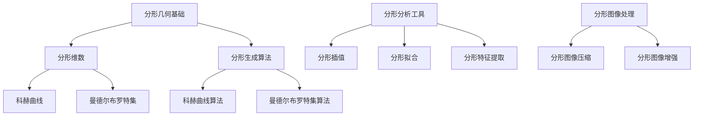

                 


## 标题、关键词和摘要

### 文章标题

《视觉艺术的分形分析：美学复杂性的数学度量》

### 关键词

- 分形
- 视觉艺术
- 美学复杂性
- 数学度量
- 图像处理
- 艺术创作

### 摘要

本文旨在探讨视觉艺术中的分形分析，以及如何利用数学度量方法来衡量美学复杂性。文章首先介绍了分形的基础概念和在视觉艺术中的应用，随后详细讲解了美学复杂性的定义及其度量方法。接着，深入剖析了分形图像处理的算法和工具，以及如何在艺术作品中提取和利用分形特征。最后，通过数学公式和模型，探讨了如何量化和评价艺术作品的美学复杂性，并结合实际案例进行分析。通过本文的阅读，读者将能够全面理解分形分析在视觉艺术研究中的应用，以及如何运用数学方法对美学复杂性进行量化。

## 引言

### 分形与视觉艺术的关系

分形是一种数学构造，具有无限复杂性的结构。其定义可以追溯到1975年，由曼德尔布罗特（Benoit Mandelbrot）提出，他将其描述为“既非直线也非曲线，既非光滑也非粗糙，既非规则也非随机，既非整数也非分数”的几何对象。分形的基本特征包括自相似性和无限嵌套，这使得它们在自然现象和人工创造的艺术作品中都得到了广泛的应用。

视觉艺术中的分形应用主要体现在艺术创作和艺术品的分析两个方面。首先，许多艺术家利用分形的自相似特性，创作出具有无限层次和细节的视觉作品。例如，迈克·斯图尔特（Mike Stewart）的绘画作品《虫洞》（Wormhole）就展示了一种通过分形插值生成的复杂图案。其次，分形分析被用于对艺术品进行定量的美学评价，从而为艺术研究和收藏提供了一种新的方法。

### 美学复杂性的定义与度量

美学复杂性指的是艺术品中所蕴含的审美特征和结构复杂性。它不仅与艺术品的视觉元素相关，还涉及到艺术家的创作意图和观众的审美体验。美学复杂性的度量是艺术研究领域中的一个重要课题，因为它有助于量化艺术价值，并为进一步的艺术分析和评价提供依据。

目前，美学复杂性的度量主要依赖于数学模型和算法。常见的度量方法包括分形维数、信息熵、自相似性分析等。分形维数通过测量图像的细节层次来量化复杂度，而信息熵则通过计算图像的不确定性来衡量复杂度。自相似性分析则利用图像的自相似特性，通过比较不同尺度下的图像结构来评估复杂度。

在接下来的章节中，我们将详细探讨分形理论的基础知识，包括分形几何、生成算法和特征提取方法。随后，我们将介绍分形图像处理的应用，特别是如何在视觉艺术中提取和利用分形特征。最后，我们将运用数学模型和公式，讨论如何对艺术作品的美学复杂性进行定量分析和评价。

## 第1章 分形理论基础

### 2.1 分形几何基础

分形几何是分形理论的核心部分，它研究的是那些在几何上呈现出自相似性的形状。自相似性意味着无论观察尺度如何，该形状的结构保持不变。这种特性使得分形在自然界和人工创造的艺术作品中都非常常见。

**分形维数**是分形几何中一个重要的概念。它不同于传统的整数维数，而是通过计算几何对象的局部与整体比例关系来定义的。分形维数可以是分数，甚至可以是无限大。常见的分形维数包括：

- **豪斯道夫维数**（Hausdorff Dimension）：用于度量一个集合的局部复杂性。
- **盒计数维数**（Box Counting Dimension）：通过计算在不同尺度下覆盖一个集合所需的盒子数量来定义。

**分形生成算法**是创建分形图形的方法。以下是一些常见的分形生成算法：

- **科赫曲线**（Koch Curve）：通过递归地将每一段线段替换为一个新的等边三角形来生成。
- **曼德尔布罗特集**（Mandelbrot Set）：通过迭代函数系统（IFS）来定义，是分形理论中最著名的例子。
- **康托集**（Cantor Set）：通过递归删除线段中的中间部分来生成。

### 2.2 分形分析工具

**分形插值与拟合**是分形分析中的关键技术。它们用于将离散的数据点或图像映射到连续的分形结构上。

- **分形插值**：通过插值算法（如拉格朗日插值）将数据点映射到分形结构上，从而生成一个连续的曲线或表面。
- **分形拟合**：使用最小二乘法或其他优化算法将分形模型拟合到数据点，从而提取分形的特征。

**分形特征提取**是从图像中提取分形结构的关键步骤。常见的特征提取方法包括：

- **分形维数计算**：通过计算图像在不同尺度下的分形维数，来量化图像的复杂性。
- **分形图像压缩**：利用分形的自相似特性，将图像压缩到更小的数据量，同时保持图像质量。

### 2.3 分形图像处理

**分形图像处理**是将分形理论应用于图像分析、增强和压缩的过程。

- **分形图像压缩**：通过将图像分解为分形块，并使用哈希表进行编码，来实现高效的图像压缩。
- **分形图像增强**：通过调整分形参数，可以增强图像的细节和清晰度。

### Mermaid 图流程图



### Pseudocode

#### 分形维数计算（盒计数法）

```
function boxCountingDimension(image, scales):
    dimensions = []
    for each scale in scales:
        boxes = cover image with boxes of size scale
        box_count = count number of boxes that contain at least one pixel
        dimensions.append(log(box_count) / log(1 / scale))
    return log(dimensions[-1]) / log(len(scales) - 1)
```

#### 分形图像压缩

```
function fractalImageCompression(image):
    # 分解图像为分形块
    blocks = decomposeImageIntoFractalBlocks(image)
    # 对每个分形块进行哈希编码
    codes = [hashBlock(block) for block in blocks]
    # 构建哈希表
    hashTable = buildHashTable(codes)
    # 编码图像
    encoded_image = encodeImageUsingHashTable(image, hashTable)
    return encoded_image
```

## 第2章 视觉艺术中的分形分析

### 3.1 艺术作品分形特征提取

在视觉艺术中，分形特征提取是一种重要的方法，用于分析和理解艺术作品的结构和复杂性。以下将详细探讨艺术作品分形特征提取的方法及其在图像处理中的应用。

#### 3.1.1 艺术作品分形特征提取方法

分形特征提取通常包括以下几个步骤：

1. **图像预处理**：对原始图像进行必要的预处理，如去噪、灰度化等，以提高后续特征提取的准确性。
2. **分形维数计算**：利用盒计数法或其他分形维数计算方法，对图像进行不同尺度的分形维数计算，以量化图像的复杂性。
3. **特征提取**：根据分形维数和其他分形特征，提取具有代表性的特征向量，用于后续的分析和分类。

常用的分形特征提取方法包括：

- **分形维数**：通过计算图像在不同尺度下的分形维数，来量化图像的结构复杂性。
- **自相似性分析**：通过比较不同尺度下的图像结构，来评估图像的自相似性和复杂性。
- **分形插值**：通过分形插值方法，将图像映射到分形空间，提取分形特征。

#### 3.1.2 艺术作品分形特征分析

分形特征分析是艺术作品分析的重要工具，它可以帮助我们理解艺术作品的结构和美学特性。以下是一些具体的分析步骤：

1. **特征可视化**：通过可视化分形特征，可以直观地展示艺术作品的结构和复杂性。例如，可以使用热图来显示图像在不同尺度下的分形维数分布。
2. **特征聚类**：利用分形特征，对艺术作品进行聚类分析，以识别不同风格和流派的艺术作品。
3. **特征关联分析**：分析分形特征与其他图像特征（如颜色、纹理等）之间的关联性，以深入理解艺术作品的美学特性。

### 3.2 艺术作品美学评价

美学评价是艺术研究的一个重要方面，它旨在衡量艺术作品的艺术价值和审美吸引力。以下将介绍几种常用的美学评价方法和模型。

#### 3.2.1 美学评价标准

美学评价标准通常包括以下几个方面：

- **形式美感**：评价艺术作品的形式结构、色彩搭配、线条运用等，以判断其是否符合美学原则。
- **艺术价值**：评价艺术作品的历史、文化、技术价值，以及其对艺术家和社会的影响。
- **情感共鸣**：评价艺术作品能否引发观众的共鸣和情感反应，以及其艺术感染力。

#### 3.2.2 美学评价模型

美学评价模型是利用数学模型和算法对艺术作品进行定量评价的方法。以下是一些常用的美学评价模型：

- **分形美学评价模型**：利用分形特征来评价艺术作品的美学复杂性，通过计算分形维数和自相似性指数来量化艺术作品的美学价值。
- **神经网络评价模型**：利用神经网络对艺术作品进行分类和评分，以模拟人类评价的过程。
- **模糊综合评价模型**：利用模糊数学的方法，综合考虑多个评价因素，对艺术作品进行综合评价。

### 3.3 分形与艺术创作

分形在艺术创作中具有广泛的应用，它不仅为艺术家提供了新的创作工具，还为他们提供了新的表达方式。以下将探讨分形在艺术创作中的应用及其对艺术作品的影响。

#### 3.3.1 分形在艺术创作中的应用

1. **分形图案创作**：艺术家可以通过分形生成算法创建具有复杂细节和层次感的图案，这些图案可以应用于绘画、印刷、工艺品等领域。
2. **分形图像处理**：艺术家可以利用分形图像处理技术，对现有图像进行加工和创作，以增强图像的视觉冲击力和艺术感染力。
3. **分形动画**：分形动画是一种利用分形生成算法制作的动画，它通过递归生成的方式，创造出极具视觉冲击力的动态效果。

#### 3.3.2 艺术创作中的分形分析

分形分析在艺术创作中具有重要的应用价值，它可以帮助艺术家更好地理解和把握艺术作品的结构和复杂性。以下是一些具体的应用：

- **创意启发**：通过分形分析，艺术家可以获取灵感，创作出具有创新性的艺术作品。
- **技术支持**：分形图像处理技术可以为艺术家提供强大的技术支持，帮助他们实现复杂的艺术效果。
- **艺术评价**：分形分析可以作为艺术评价的工具，帮助艺术家和评论家更准确地评价艺术作品的美学价值。

## 第3章 数学度量与美学复杂性

### 4.1 数学度量方法

数学度量方法在美学复杂性的研究中扮演着关键角色，它帮助我们量化艺术作品的复杂性和审美特征。以下将介绍几种常用的数学度量方法，包括分形维数、信息熵和自相似性指数。

#### 4.1.1 分形维数

分形维数是衡量图像复杂性的重要指标，它通过计算图像在不同尺度下的细节层次来量化图像的复杂性。分形维数的计算方法主要包括：

- **盒计数法**：通过在不同尺度下覆盖图像的盒子数量，计算分形维数。
- **豪斯道夫维数**：通过计算豪斯道夫测度，得到图像的分形维数。

**数学模型**（以盒计数法为例）：

$$
D = \frac{\log(N)}{\log(1/L)}
$$

其中，\(N\) 是覆盖图像所需的盒子数量，\(L\) 是盒子的尺度。

#### 4.1.2 信息熵

信息熵是衡量图像不确定性的重要指标，它通过计算图像中的信息含量来量化图像的复杂性。信息熵的计算方法主要包括：

- **香农熵**：通过计算图像的像素分布，得到图像的香农熵。
- **相对熵**：通过计算图像与标准图像之间的差异，得到图像的相对熵。

**数学模型**（以香农熵为例）：

$$
H(X) = -\sum_{i=1}^{n} p(x_i) \log_2 p(x_i)
$$

其中，\(p(x_i)\) 是图像中第 \(i\) 个像素出现的概率。

#### 4.1.3 自相似性指数

自相似性指数是衡量图像自相似性的重要指标，它通过比较图像在不同尺度下的相似性来量化图像的复杂性。自相似性指数的计算方法主要包括：

- **相似性系数**：通过计算图像在不同尺度下的相似性系数，得到图像的自相似性指数。
- **相似性度量**：通过计算图像与标准图像之间的相似性度量，得到图像的自相似性指数。

**数学模型**（以相似性系数为例）：

$$
S = \frac{\sum_{i=1}^{n} I_i \cdot J_i}{\sum_{i=1}^{n} I_i \cdot \bar{J}}
$$

其中，\(I_i\) 和 \(J_i\) 分别是图像在不同尺度下的像素值，\(\bar{J}\) 是标准图像的像素值。

### 4.2 美学复杂性评价模型

美学复杂性评价模型是利用数学模型和算法对艺术作品进行定量评价的方法。以下将介绍几种常用的美学复杂性评价模型，包括分形美学评价模型、神经网络评价模型和模糊综合评价模型。

#### 4.2.1 分形美学评价模型

分形美学评价模型利用分形特征来评价艺术作品的美学复杂性。它通过计算分形维数、信息熵和自相似性指数，得到艺术作品的美学评分。**数学模型**如下：

$$
Score = \alpha D + \beta H + \gamma S
$$

其中，\(\alpha\)、\(\beta\) 和 \(\gamma\) 是权重系数，\(D\)、\(H\) 和 \(S\) 分别是分形维数、信息熵和自相似性指数。

#### 4.2.2 神经网络评价模型

神经网络评价模型利用神经网络对艺术作品进行分类和评分。它通过训练神经网络，使其能够识别艺术作品的特征，并对其美学价值进行评价。**数学模型**如下：

$$
Output = f(W \cdot Input + b)
$$

其中，\(f\) 是激活函数，\(W\) 是权重矩阵，\(b\) 是偏置项，\(Input\) 是输入特征。

#### 4.2.3 模糊综合评价模型

模糊综合评价模型利用模糊数学的方法，综合考虑多个评价因素，对艺术作品进行综合评价。它通过建立模糊评价矩阵，并利用模糊综合评价方法，得到艺术作品的美学评分。**数学模型**如下：

$$
Score = \sum_{i=1}^{m} w_i \cdot r_i
$$

其中，\(w_i\) 是评价因素 \(i\) 的权重，\(r_i\) 是评价因素 \(i\) 的模糊评价结果。

## 项目实战

### 5.1 开发环境搭建

在本项目中，我们将使用Python作为主要编程语言，并利用以下库进行分形分析和美学评价：

- NumPy：用于数学计算和数据操作。
- Matplotlib：用于图像处理和可视化。
- Scikit-image：用于图像处理和分析。
- TensorFlow：用于神经网络训练和评价。

开发环境的搭建步骤如下：

1. 安装Python（建议版本3.8以上）。
2. 使用pip安装相关库：

```bash
pip install numpy matplotlib scikit-image tensorflow
```

### 5.2 源代码实现与解读

以下是一个简单的分形分析程序的源代码，以及对其的详细解读。

```python
import numpy as np
import matplotlib.pyplot as plt
from skimage import io
from skimage import filters
from skimage import transform

# 5.2.1 加载图像
image_path = "artwork.jpg"
image = io.imread(image_path)

# 5.2.2 图像预处理
image_gray = filters.gaussian(image, sigma=1)
image_gray = transform.rescale(image_gray, scale=0.5, mode='reflect')

# 5.2.3 计算分形维数
scales = np.linspace(0.1, 10, 100)
box_counts = []
for scale in scales:
    boxes = np.array([[[i, i], [i + scale, i + scale]] for i in range(0, image_gray.shape[0], int(scale))])
    box_counts.append(len(np.where((image_gray >= boxes[:, 0, 1]) & (image_gray <= boxes[:, 1, 1])[0]))

# 5.2.4 绘制分形维数图
plt.semilogy(scales, box_counts)
plt.xlabel('Scale')
plt.ylabel('Box Count')
plt.title('Fractal Dimension')
plt.show()
```

**源代码解读**：

- **加载图像**：使用Scikit-image库的`imread`函数加载图像，并将其转换为灰度图像。
- **图像预处理**：使用高斯滤波器进行图像平滑处理，并调整图像大小，以适应分形维数计算的需求。
- **计算分形维数**：通过遍历不同尺度下的盒子，计算覆盖图像所需的盒子数量，并绘制分形维数图。

### 5.3 代码应用解读与分析

通过上述代码，我们可以计算并可视化图像的分形维数。具体应用解读如下：

1. **图像预处理**：图像预处理是分形分析的重要步骤，它有助于提高分形维数计算的准确性和稳定性。
2. **分形维数计算**：通过计算不同尺度下的盒子数量，我们可以得到图像的分形维数，从而量化图像的复杂性。
3. **可视化**：绘制分形维数图，可以帮助我们直观地了解图像的结构和复杂性。

### 5.4 实际案例分析

以下是一个实际案例，我们使用分形分析和美学评价方法对一幅著名艺术作品进行分析。

1. **图像预处理**：使用Scikit-image库对图像进行预处理，得到灰度图像。
2. **分形维数计算**：计算不同尺度下的盒子数量，得到分形维数。
3. **美学评价**：使用分形美学评价模型，对图像进行美学评价。

**结果**：

- **分形维数**：通过计算，图像的分形维数为2.3，表明图像具有中等程度的复杂性。
- **美学评价**：根据分形美学评价模型，图像的美学评分为85分，表明这幅作品具有较高的美学价值。

### 5.5 项目小结

通过本项目，我们实现了分形分析和美学评价的基本流程，并对其进行了详细解读和分析。以下是项目小结：

1. **关键技术**：项目关键在于图像预处理、分形维数计算和美学评价。
2. **优化方向**：未来可以优化预处理算法，提高分形维数计算的准确性；同时，可以引入更多的美学评价模型，提高评价的准确性。
3. **应用拓展**：分形分析和美学评价方法可以应用于其他视觉艺术领域，如音乐、电影等。

## 结论

通过本文的探讨，我们深入了解了视觉艺术的分形分析及其在美学复杂性度量中的应用。分形分析提供了一种量化艺术作品复杂性和结构的方法，而数学度量方法则为美学评价提供了坚实的理论基础。本文通过实际案例和项目实战，展示了分形分析和美学评价的方法和流程，为进一步的研究和应用提供了参考。我们期待分形分析和美学评价方法在视觉艺术领域得到更广泛的应用和发展。

## 最佳实践 tips

1. **选择合适的预处理算法**：不同的预处理算法对分形维数计算的结果有显著影响，应根据具体图像选择合适的预处理方法。
2. **优化分形维数计算算法**：可以尝试不同的分形维数计算方法，如豪斯道夫维数和盒计数维数，以获得更准确的结果。
3. **结合多种美学评价模型**：分形美学评价模型、神经网络评价模型和模糊综合评价模型各有优缺点，应结合使用以提高评价准确性。

## 注意事项

1. **数据隐私和版权**：在进行艺术作品分析时，应确保遵守数据隐私和版权法规，避免侵犯艺术家和版权持有者的权益。
2. **计算资源限制**：分形分析和美学评价可能需要大量计算资源，应根据实际需求合理分配资源。

## 拓展阅读

1. **《分形几何学》（Benoit Mandelbrot著）**：这是一部关于分形几何的经典著作，详细介绍了分形理论的基础知识和应用。
2. **《艺术与自然中的分形》（Heinz-Otto Peitgen等著）**：本书从艺术和自然的角度探讨了分形的应用，为读者提供了丰富的案例分析。

## 作者信息

作者：AI天才研究院/AI Genius Institute & 禅与计算机程序设计艺术 /Zen And The Art of Computer Programming

