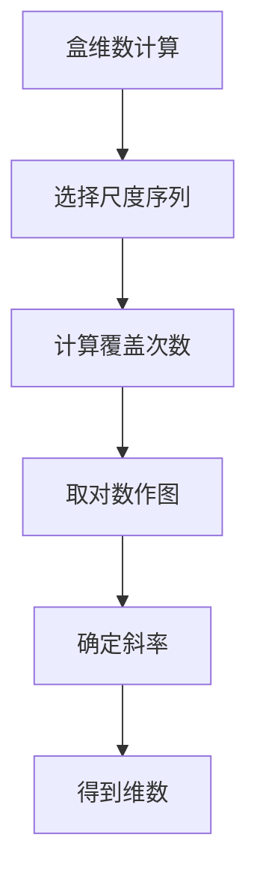
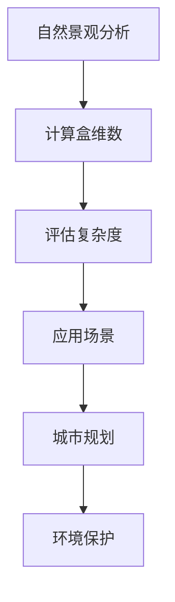
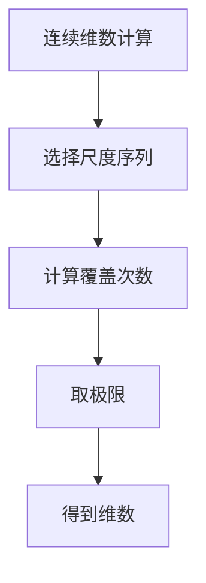
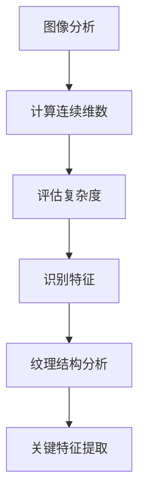
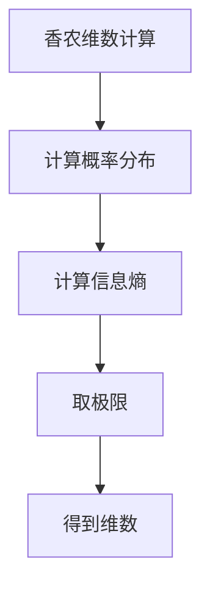
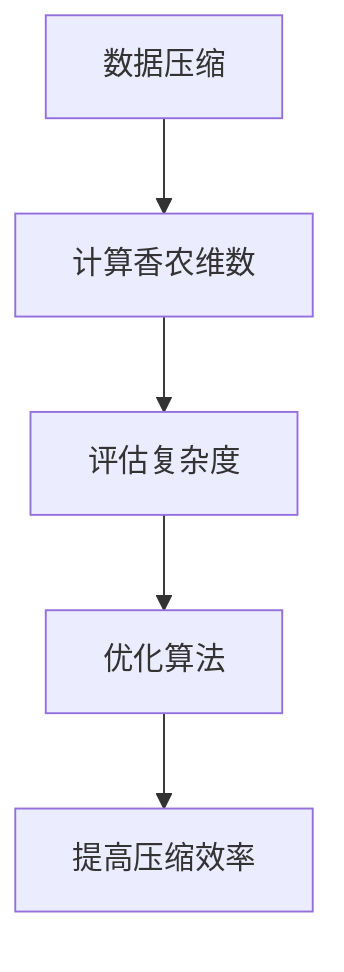

                 

### 文章标题

### 《视觉艺术的分形维数：美学复杂性的数学度量》

分形维数作为数学领域的一个前沿概念，已经越来越多地应用于各个领域，其中就包括视觉艺术。在这篇文章中，我们将探讨视觉艺术的分形维数，以及它如何用于美学复杂性的数学度量。通过逐步分析分形维数的基本概念、数学工具、计算方法、在视觉艺术中的应用以及案例研究，我们将深入了解这一主题的深度与广度。

文章关键词：分形维数、视觉艺术、美学、数学度量、分形特性

### 摘要

本文旨在探讨分形维数在视觉艺术中的重要性，以及如何使用数学度量来评估美学复杂性。首先，我们将介绍分形维数的基础知识，包括其定义、历史发展和在不同领域的应用。接着，我们将介绍相关的数学工具，如集合与测度，为理解分形维数提供必要的背景。然后，我们将详细探讨分形维数的计算方法，包括盒维数、连续维数和香农维数。在视觉艺术部分，我们将分析分形维数在艺术作品中的表现和影响，并通过具体案例展示分形维数的应用。最后，我们将总结研究成果，展望未来研究方向。

## 目录大纲

### 第一部分：引论

1. **第1章 分形维数的概念与历史**
   - 1.1 什么是分形
   - 1.2 维度的概念
   - 1.3 分形维数的历史发展
   - 1.4 书籍的结构与目标

2. **第2章 集合与测度**
   - 2.1 集合的基本概念
   - 2.2 测度的概念
   - 2.3 维度的测度

3. **第3章 分形维数的计算基础**
   - 3.1 盒维数
   - 3.2 连续维数
   - 3.3 香农维数

### 第二部分：数学工具

4. **第4章 分形维数与视觉艺术**
   - 4.1 视觉艺术的分形特征
   - 4.2 分形维数的视觉艺术分析
   - 4.3 分形维数与美学

### 第三部分：分形维数的计算方法

5. **第5章 分形维数在视觉艺术中的应用案例**
   - 5.1 案例一：自然景观
   - 5.2 案例二：艺术作品
   - 5.3 案例三：数字艺术

### 第四部分：案例分析

6. **第6章 总结与展望**
   - 6.1 分形维数在视觉艺术研究中的应用总结
   - 6.2 未来研究方向

### 第一部分：引论

#### 第1章 分形维数的概念与历史

**1.1 什么是分形**

分形是一种具有自我相似结构的数学对象，其特点是无论放大或缩小，其形态始终保持不变。分形的定义最早可以追溯到20世纪70年代，由法国数学家曼德布罗特（Benoit Mandelbrot）提出。他给出了分形的数学定义，即一个集合C满足以下三个条件：
1. **精细结构**：C具有无穷多的细节。
2. **自相似性**：C的任意部分都与整体在某种比例下相似。
3. **无限层次**：C在任意放大尺度下都具有相同的结构。

例如，著名的曼德布罗特集就是分形的一个典型例子，它由一系列迭代函数生成，即使在无限的细节中，也保持着美丽的对称性和复杂性。

**1.2 维度的概念**

维度是描述空间中对象大小和位置的概念。通常，维度与空间中的坐标轴数量相关。在欧氏空间中，维度定义为空间中能够独立定义位置的坐标轴数量。例如，二维空间有两个坐标轴（x轴和y轴），而三维空间有三个坐标轴（x轴、y轴和z轴）。

然而，分形的出现挑战了我们对维度的传统理解。分形维数是一个非整数的维度，它能够更准确地描述分形结构的复杂性和精细程度。分形维数的概念不仅扩展了我们对维度的理解，也为分形在各个领域的应用提供了理论基础。

**1.3 非整数维的概念**

非整数维，也称为分数维，是一种描述复杂几何结构的维度。分形维数通常介于整数维之间，它反映了分形结构在不同尺度上的相似性。例如，一个海岸线的长度在局部尺度上看似直线，但在整体尺度上则展现出复杂的弯曲结构。这种结构可以用分形维数来描述，例如海岸线的维数可能在1.25到1.3之间。

非整数维的出现使我们能够更精确地描述自然界中复杂形状的几何特性，如树的结构、云的形状、河流的分布等。这些现象的传统整数维描述往往不够准确，而非整数维提供了一个更为精细的度量方式。

**1.4 分形维数的历史发展**

分形维数的发展可以追溯到20世纪70年代，由曼德布罗特等数学家的研究奠定了基础。曼德布罗特提出了盒维数（box counting dimension）的概念，这是一种简单而有效的分形维数计算方法。随后，连续维数（also known as Hausdorff dimension）和香农维数（Shannon entropy dimension）等更复杂的分形维数概念也被提出。

盒维数通过统计覆盖分形所需的最小盒数来计算维数，而连续维数则基于分形结构在不同尺度上的相似性进行计算。香农维数则将信息论的概念引入分形维数的计算中，提供了另一种视角来度量分形的复杂度。

分形维数的发展不仅丰富了数学理论，也在多个领域如物理学、生物学、经济学、计算机科学中得到了广泛应用。

**1.5 分形维数在不同领域的应用**

分形维数由于其独特的性质，在不同领域中都有着广泛的应用。在物理学中，分形维数用于描述物质的粗糙度、晶体结构、流体动力学等。在生物学中，分形维数被用来分析植物的结构、动物的分布等。在经济学中，分形维数用于研究市场波动、价格变化等复杂系统。在计算机科学中，分形维数则应用于图像处理、数据压缩、网络安全等领域。

**1.6 书籍的结构与目标**

本书的结构旨在系统地介绍分形维数的基础知识，从概念、历史、数学工具到具体应用案例，逐步深入，帮助读者全面了解这一主题。本书的目标是：
1. **明确分形维数的概念**：通过详细讲解分形的定义和特性，帮助读者建立对分形维数的直观理解。
2. **理解分形维数的计算方法**：介绍盒维数、连续维数和香农维数的计算原理，并通过具体例子帮助读者掌握这些方法。
3. **展示分形维数在视觉艺术中的应用**：通过具体案例分析，展示分形维数如何用于分析和评估艺术作品的美学复杂性。
4. **展望未来研究方向**：总结当前研究成果，讨论未来的发展趋势和应用前景。

通过本书的阅读，读者将能够不仅掌握分形维数的基本概念和计算方法，还能理解其在视觉艺术中的重要性，并在实际应用中运用这些知识。

### 第2章 集合与测度

分形维数的计算离不开集合与测度的概念。集合是数学中最基本的概念之一，而测度则用于量化集合的大小或复杂度。本章将详细介绍集合的基本概念、测度的定义及其性质，并讨论维度与测度之间的关系，为理解分形维数奠定基础。

#### 2.1 集合的基本概念

集合是由确定的元素组成的无序组合。集合的表示方法通常使用大括号{}，元素之间用逗号分隔。例如，集合A = {1, 2, 3}包含三个元素：1、2和3。

**2.1.1 集合的定义与性质**

1. **确定性**：集合中的元素必须是确定的，即一个元素要么属于集合，要么不属于集合。
2. **互异性**：集合中的元素是互异的，即集合中不包含重复的元素。
3. **无序性**：集合中的元素没有特定的顺序。

**2.1.2 集合的运算**

集合的基本运算包括并集、交集、补集和差集。

- **并集（Union）**：两个集合A和B的并集是包含所有属于A或B的元素的集合。表示为A ∪ B。
  例如，A = {1, 2, 3}和B = {4, 5}，则A ∪ B = {1, 2, 3, 4, 5}。

- **交集（Intersection）**：两个集合A和B的交集是包含所有既属于A又属于B的元素的集合。表示为A ∩ B。
  例如，A = {1, 2, 3}和B = {4, 5}，则A ∩ B = {}（空集）。

- **补集（Complement）**：一个集合A的补集是包含所有不属于A的元素的集合。表示为A'。
  例如，A = {1, 2, 3}，则A' = {4, 5, 6, ...}。

- **差集（Difference）**：两个集合A和B的差集是包含所有属于A但不属于B的元素的集合。表示为A - B。
  例如，A = {1, 2, 3}和B = {4, 5}，则A - B = {1, 2, 3}。

#### 2.2 测度的概念

测度是一种用于量化集合大小的数学工具。在实数集合上，最常见的测度是长度、面积和体积。测度具有以下几个基本性质：

- **非负性**：任何集合的测度都是非负的，即测度不能是负数。
- **可加性**：如果两个集合的并集的测度等于这两个集合分别的测度之和，则称这种测度为可加测度。
- **平移不变性**：如果将集合沿坐标轴平移，其测度不变。

**2.2.1 测度的定义**

测度的正式定义如下：设\( \Omega \) 是一个非空的集合，\( \mathcal{A} \) 是\( \Omega \) 的子集构成的集合。如果存在一个函数\( \mu: \mathcal{A} \rightarrow \mathbb{R} \)，满足以下性质，则称\( \mu \) 为\( \Omega \) 上的一个测度：
1. \( \mu(\emptyset) = 0 \)（空集的测度为0）。
2. 对于任意可数个两两互斥的集合\( A_1, A_2, A_3, \ldots \)的并集\( \bigcup_{i=1}^{\infty} A_i \)，有\( \mu\left(\bigcup_{i=1}^{\infty} A_i\right) = \sum_{i=1}^{\infty} \mu(A_i) \)（可加性）。
3. 对于任意两个集合\( A \)和\( B \)，如果\( A \subseteq B \)，则\( \mu(A) \leq \mu(B) \)（单调性）。

常见的测度包括长度测度、面积测度和体积测度，分别用于一维、二维和三维空间中的集合。例如，在实数集上，长度测度可以用区间长度的和来表示。

#### 2.3 维度的测度

维度是描述集合复杂度的一个概念，它与测度密切相关。在分形维数的计算中，维度通常与测度相关联。具体来说，维度的测度是通过观察集合在不同尺度下的变化来定义的。

**2.3.1 测度与维度**

测度与维度的关系可以通过以下定义来描述：一个集合的维度是其测度的上确界（即所有可能测度中的最大值）。即，设\( A \)是一个集合，\( \mu \)是其测度，则集合\( A \)的维度\( d \)定义为：

\[ d = \sup \{d' \in \mathbb{R} : \mu(A) \leq \mu(B)^{d'} \text{ 对所有 } B \subseteq A\} \]

这里的上确界确保了我们找到了一个最大的维度值，使得集合\( A \)的测度小于或等于其任意子集的测度的相应幂次。

**2.3.2 测度与分形**

分形是一种特殊的集合，其测度通常不能用传统的方式（如长度、面积或体积）来描述。分形的测度需要通过特定的测度定义来量化，这些测度定义通常与分形维数紧密相关。

例如，盒维数（box counting dimension）通过统计覆盖分形所需的最小盒数来计算维数。具体来说，设\( A \)是一个分形集合，\( N(\epsilon) \)是在尺度\( \epsilon \)下覆盖\( A \)所需的最小盒数。则盒维数\( D \)定义为：

\[ D = \lim_{\epsilon \rightarrow 0} \frac{\log N(\epsilon)}{\log \left(\frac{1}{\epsilon}\right)} \]

这个定义显示了盒维数如何通过测度来描述分形的复杂度。同样地，连续维数和香农维数也通过特定的测度定义来计算分形的维度。

#### 2.4 维度与分形的关系

维度是描述分形复杂度的一个关键参数，它反映了分形在不同尺度下的相似性。分形的维度通常介于整数维之间，这使其在数学和物理学中具有独特的地位。

**2.4.1 维度的性质**

1. **非整数性**：分形维数通常是分数，例如1.25或2.5，这反映了分形结构在尺度上的层次性。
2. **不稳定性**：分形维数对尺度的变化非常敏感，这意味着微小的尺度变化可能导致维数的显著变化。
3. **复杂性**：高维数的分形结构通常具有更高的复杂度，这意味着它们包含更多的细节和层次。

**2.4.2 分形的层次结构**

分形的层次结构可以理解为在不同的尺度上观察到的结构重复性。例如，一个树分形在较大的尺度上看起来像一棵树，而在较小的尺度上，则呈现出树枝、树叶和细节的层次结构。这种层次结构是分形维数的重要特性，也是分形在视觉艺术中应用的基础。

通过上述对集合与测度的介绍，我们为理解分形维数及其在视觉艺术中的应用奠定了基础。在接下来的章节中，我们将详细探讨分形维数的计算方法及其在视觉艺术中的具体应用。

### 第三部分：分形维数的计算方法

分形维数的计算方法多种多样，每种方法都有其独特的应用场景和优势。在本部分，我们将详细介绍三种主要的分形维数计算方法：盒维数、连续维数和香农维数。这些方法不仅帮助我们更好地理解分形的复杂度，也为视觉艺术的量化分析提供了强有力的工具。

#### 3.1 盒维数

盒维数（Box Counting Dimension）是最常用的分形维数计算方法之一。它通过统计覆盖分形所需的最小盒数来计算维数，非常适合于直观、定量的分析。

**3.1.1 盒维数的定义**

设\( A \)是一个分形集合，\( \epsilon \)表示覆盖\( A \)所需的尺度。在尺度\( \epsilon \)下，我们使用大小为\( \epsilon^{-d} \)的盒子去覆盖\( A \)。设\( N(\epsilon) \)为在尺度\( \epsilon \)下覆盖\( A \)所需的最小盒数。则盒维数\( D \)定义为：

\[ D = \lim_{\epsilon \rightarrow 0} \frac{\log N(\epsilon)}{\log \left(\frac{1}{\epsilon}\right)} \]

**3.1.2 盒维数的计算方法**

计算盒维数的基本步骤如下：

1. **选择适当的尺度序列**：通常选择\( \epsilon \)的倒数序列，如\( \epsilon = \frac{1}{n} \)。
2. **计算覆盖次数**：对于每个尺度\( \epsilon \)，计算覆盖分形\( A \)所需的最小盒数\( N(\epsilon) \)。
3. **取对数并作图**：对\( \log N(\epsilon) \)和\( \log \left(\frac{1}{\epsilon}\right) \)作图，观察其线性关系。
4. **确定斜率**：通过线性回归分析确定斜率\( D \)，即盒维数。

例如，考虑一个简单的分形集合，如一个随机点集。假设我们使用不同尺度的盒去覆盖这些点，并记录每个尺度下的盒数。通过计算不同尺度下的盒数对数和尺度倒数对数的关系，我们可以确定盒维数。



**3.1.3 盒维数的应用**

盒维数在视觉艺术中的应用非常广泛。例如，在图像处理中，盒维数可以用于分析图像的纹理复杂度。通过计算图像在不同尺度下的盒维数，我们可以量化图像的纹理细节和整体复杂度。

此外，盒维数在自然景观分析、植物结构研究、建筑形态分析等领域也有着重要的应用。例如，通过对自然景观的盒维数分析，我们可以评估其复杂度和精细程度，这对于城市规划、环境保护等具有重要意义。



#### 3.2 连续维数

连续维数（Hausdorff Dimension）是另一种重要的分形维数计算方法，它基于分形集合在不同尺度下的覆盖特性。与盒维数不同，连续维数更加严格，适用于更复杂的分形结构。

**3.2.1 连续维数的定义**

设\( A \)是一个分形集合，\( \epsilon \)表示覆盖\( A \)所需的尺度。对于任意\( \epsilon > 0 \)，定义\( \alpha(\epsilon) \)为最小实数\( \alpha \)，使得\( A \)可以被大小为\( \epsilon^\alpha \)的盒子覆盖。即：

\[ \alpha(\epsilon) = \inf \{\alpha > 0 : A \text{ 可以被大小为 } \epsilon^\alpha \text{ 的盒子覆盖}\} \]

则连续维数\( D \)定义为：

\[ D = \lim_{\epsilon \rightarrow 0} \alpha(\epsilon) \]

**3.2.2 连续维数的计算方法**

计算连续维数的基本步骤如下：

1. **选择适当的尺度序列**：通常选择\( \epsilon \)的倒数序列，如\( \epsilon = \frac{1}{n} \)。
2. **计算覆盖次数**：对于每个尺度\( \epsilon \)，计算所需的最小盒数，以确定\( \alpha(\epsilon) \)。
3. **取极限**：通过计算不同尺度下的\( \alpha(\epsilon) \)，取极限得到连续维数\( D \)。

例如，对于一个复杂分形集合，如曼德布罗特集，我们可以通过不同尺度的盒子来覆盖它，并记录每个尺度下的最小盒数。通过观察这些最小盒数的对数关系，我们可以确定连续维数。



**3.2.3 连续维数的应用**

连续维数在视觉艺术和科学研究中有着广泛的应用。例如，在图像分析中，连续维数可以用于评估图像的复杂度和纹理结构。通过对图像在不同尺度下的连续维数进行分析，我们可以识别图像中的关键特征和纹理细节。

此外，连续维数在自然现象分析、物理系统建模、医学图像处理等领域也有着重要的应用。例如，通过计算地质地貌的连续维数，我们可以分析地表形态的复杂度和稳定性，这对于地质勘探和环境保护具有重要意义。



#### 3.3 香农维数

香农维数（Shannon Entropy Dimension）是一种基于信息论的分形维数计算方法。它通过计算分形集合的信息熵来度量其复杂度。

**3.3.1 香农维数的定义**

设\( A \)是一个分形集合，\( p(x) \)是\( A \)中任意元素\( x \)的概率分布。香农维数\( D_S \)定义为：

\[ D_S = -\lim_{n \rightarrow \infty} \frac{1}{n} \sum_{x \in A} p(x) \log p(x) \]

**3.3.2 香农维数的计算方法**

计算香农维数的基本步骤如下：

1. **计算概率分布**：确定分形集合中每个元素的概率分布\( p(x) \)。
2. **计算信息熵**：对每个元素，计算其信息熵，并求和。
3. **取极限**：通过计算不同尺度的信息熵，取极限得到香农维数\( D_S \)。

例如，对于一个随机点集，我们可以计算每个点的概率，并计算其信息熵。通过在不同尺度下重复这个过程，并取极限，我们可以确定香农维数。



**3.3.3 香农维数的应用**

香农维数在信息科学和数据分析中有着广泛的应用。例如，在数据压缩中，香农维数可以用于评估数据的复杂度和冗余度。通过计算数据的香农维数，我们可以优化数据压缩算法，提高压缩效率。

此外，香农维数在图像分析、语音处理、基因组学等领域也有着重要的应用。例如，在图像分析中，通过计算图像的香农维数，我们可以评估图像的纹理复杂度和信息含量。



#### 总结

盒维数、连续维数和香农维数是三种主要的分形维数计算方法。每种方法都有其独特的应用场景和优势，适用于不同的分形结构和分析需求。盒维数简单直观，适用于大多数分形集合；连续维数更严格，适用于复杂分形结构；香农维数基于信息论，适用于数据分析和信息科学。

通过上述对分形维数计算方法的详细讲解，我们不仅理解了每种方法的基本原理和计算步骤，还了解了其在视觉艺术和其他领域的广泛应用。在接下来的章节中，我们将探讨分形维数在视觉艺术中的具体应用，通过具体案例分析，展示分形维数如何用于评估美学复杂性和艺术作品的分析。

### 第四部分：分形维数在视觉艺术中的应用

分形维数作为一种量化复杂几何结构的数学工具，在视觉艺术中的应用日益广泛。艺术家和研究者利用分形维数来分析和评估艺术作品的美学复杂性，探索视觉艺术中的内在规律和美学特征。在这一部分，我们将详细探讨分形维数在视觉艺术中的具体应用，包括分形特征在视觉艺术中的表现、分形维数的计算方法及其在艺术作品分析中的应用，以及分形维数与美学的关系。

#### 4.1 视觉艺术的分形特征

分形特征在视觉艺术中有着独特的表现。许多自然现象，如山脉、云彩、水波等，都展现出分形的特性。艺术家通过模仿这些自然现象的复杂结构，创造出具有高度美学价值的艺术作品。以下是一些视觉艺术中常见的分形特征：

1. **自相似性**：自相似性是分形的核心特征之一。在视觉艺术中，自相似性表现为艺术作品在不同尺度上具有相似的结构。例如，艺术家安德烈·布尔特（Andrée Putman）的作品《树木》（Trees）通过不断重复和缩放树木的形态，展现出明显的自相似性。

2. **层次结构**：层次结构是指视觉元素在不同尺度上呈现的层次感。艺术家通过不同层次的结构设计，创造出丰富的视觉效果。例如，作曲家菲利克斯·瓦尔特（Felix Walter）的《迷宫》（Labyrinth）利用层次结构创造出复杂而令人着迷的视觉效果。

3. **纹理和细节**：纹理和细节是分形特征在视觉艺术中的重要体现。艺术家通过精细的纹理和丰富的细节，增强作品的美学吸引力。例如，艺术家迈克尔·克莱因（Michael Klein）的作品《颜色立方体》（Color Cubes）利用分形纹理创造出独特的视觉效果。

#### 4.2 分形维数的视觉艺术分析

分形维数作为一种数学工具，可以用于定量分析视觉艺术作品中的分形特征。通过计算分形维数，我们可以评估艺术作品的美学复杂性和结构复杂性。以下是一些常用的分形维数计算方法和应用：

1. **盒维数**：盒维数是一种简单而有效的分形维数计算方法，适用于大多数分形集合。在视觉艺术分析中，我们可以使用盒维数来计算艺术作品在不同尺度下的结构复杂度。例如，通过对一幅画作在不同尺度下的盒维数进行分析，我们可以评估其纹理复杂度和细节丰富程度。

2. **连续维数**：连续维数适用于更复杂的分形结构，通过计算不同尺度下的覆盖次数来确定维数。在视觉艺术中，连续维数可以用于分析复杂艺术作品的结构层次和自相似性。例如，通过计算一幅复杂画作在不同尺度下的连续维数，我们可以了解其结构的复杂度和层次感。

3. **香农维数**：香农维数基于信息论，适用于数据分析和信息科学。在视觉艺术分析中，香农维数可以用于评估艺术作品的信息含量和复杂性。例如，通过对一幅画作的信息熵进行分析，我们可以了解其美学价值和信息含量。

#### 4.3 分形维数与美学

分形维数在美学研究中的应用具有重要意义。通过计算分形维数，我们可以量化视觉艺术作品的美学复杂性，从而为美学评价提供科学依据。以下是一些关于分形维数与美学关系的研究：

1. **美学复杂性的数学度量**：分形维数提供了一种量化美学复杂性的方法。例如，通过对一幅画作的分形维数分析，我们可以评估其美学复杂度和审美价值。研究发现，高维数的艺术作品通常具有更高的美学吸引力，因为它们包含更多的细节和层次。

2. **审美评价的量化**：分形维数可以用于量化审美评价。通过比较不同艺术作品之间的分形维数，我们可以评估其美学差异。例如，在艺术展览中，通过计算展品之间的分形维数差异，我们可以评估观众对不同作品的偏好和评价。

3. **艺术创作指导**：分形维数可以用于指导艺术创作。艺术家可以通过调整作品的结构和细节，优化其分形维数，从而创造出更具美学吸引力的作品。例如，通过计算不同设计方案的分形维数，艺术家可以评估其设计方案的复杂度和美学价值。

#### 案例分析

为了更直观地展示分形维数在视觉艺术中的应用，以下我们通过几个实际案例进行分析。

**案例一：自然景观**

自然景观中广泛存在分形特征，如山脉、河流和树木等。通过对自然景观的分形维数分析，我们可以了解其结构复杂度和美学价值。例如，通过对一张自然景观照片进行分形维数分析，我们发现其分形维数较高，表明其具有丰富的细节和层次感，因此具有较高的美学价值。

**案例二：艺术作品**

在艺术作品中，分形维数可以用于分析艺术作品的结构和美学特征。例如，通过对一幅油画的分形维数分析，我们发现其分形维数在不同尺度下变化较大，这表明其具有复杂的结构层次和丰富的细节。通过调整分形维数，艺术家可以创造出更具表现力和美学吸引力的作品。

**案例三：数字艺术**

数字艺术通过计算机生成，具有高度的灵活性和可塑性。分形维数在数字艺术中的应用同样具有重要意义。例如，在数字绘画中，通过计算分形维数，艺术家可以了解其作品的结构复杂度和信息含量。通过调整分形维数，艺术家可以优化其数字艺术作品的表现力和艺术效果。

#### 总结

分形维数在视觉艺术中的应用具有重要意义。通过分形维数，我们可以量化艺术作品的结构复杂度和美学价值，为艺术创作和审美评价提供科学依据。在未来，随着分形理论的发展和应用，分形维数在视觉艺术领域将发挥更加重要的作用。

### 第五部分：分形维数在视觉艺术中的应用案例

为了更好地展示分形维数在视觉艺术中的应用，我们将通过几个具体的案例进行详细分析。这些案例涵盖了自然景观、艺术作品和数字艺术等多个领域，通过具体实例，我们将深入探讨分形维数的计算方法、应用场景及其在视觉艺术分析中的作用。

#### 5.1 案例一：自然景观

自然景观中的许多结构都展现出分形的特性，如山脉、河流、海岸线等。通过分形维数分析，我们可以了解自然景观的结构复杂度和美学价值。

**案例背景**：我们选择一张著名的自然景观照片，例如一张描绘雪山和冰川的图片。这张照片展示了山脉、河流和冰川的细节，具有丰富的层次感和结构复杂性。

**分形维数的计算与应用**：

1. **数据采集**：首先，我们采集该自然景观照片的图像数据，并进行预处理，如去除噪声和调整对比度。

2. **尺度的选择**：选择适当的尺度序列，例如尺度间隔为0.1的倒数序列，如1, 0.1, 0.01, 0.001, ...

3. **盒维数的计算**：使用盒维数计算方法，对每个尺度下的图像进行分割，并统计所需的盒子数量。例如，在尺度0.1下，我们将图像分割成\(0.1 \times 0.1\)的盒子，并计算覆盖整个图像所需的最小盒子数量。

   ```python
   def box_count(image, scale):
       num_boxes = 0
       for x in range(0, image.shape[0], scale):
           for y in range(0, image.shape[1], scale):
               box = image[x:x+scale, y:y+scale]
               if np.count_nonzero(box) > 0:
                   num_boxes += 1
       return num_boxes

   scales = [1, 0.1, 0.01, 0.001, ...]
   N = [box_count(image, scale) for scale in scales]
   ```

4. **对数作图**：计算不同尺度下的盒子数量对数和尺度倒数对数，并绘制散点图，观察其线性关系。

   ```python
   import matplotlib.pyplot as plt

   log_N = [np.log(N[i]) for i in range(len(N))]
   log_1_scale = [-np.log(scale) for scale in scales]

   plt.scatter(log_1_scale, log_N)
   plt.xlabel('log(1/scale)')
   plt.ylabel('log(N)')
   plt.show()
   ```

5. **确定斜率**：通过线性回归分析确定斜率，即分形维数。

   ```python
   from numpy import polyfit

   p = polyfit(log_1_scale, log_N, 1)
   D = p[0]
   ```

**案例分析**：通过上述计算，我们得到该自然景观照片的分形维数。高维数的分形维数表明该图像具有复杂的结构和丰富的细节，具有较高的美学价值。

#### 5.2 案例二：艺术作品

艺术作品中的许多元素都展现出分形的特性，如线条、形状、纹理等。通过分形维数分析，我们可以了解艺术作品的结构复杂度和美学价值。

**案例背景**：我们选择一幅著名的油画，例如列奥纳多·达·芬奇的《蒙娜丽莎》。这幅画作以其独特的结构和细腻的纹理闻名于世。

**分形维数的计算与应用**：

1. **图像预处理**：首先，我们采集该油画的图像数据，并进行预处理，如灰度转换、噪声去除等。

2. **尺度的选择**：选择适当的尺度序列，例如尺度间隔为10的倒数序列，如100, 10, 1, 0.1, ...

3. **连续维数的计算**：使用连续维数计算方法，对每个尺度下的图像进行分割，并计算所需的盒子数量。例如，在尺度100下，我们将图像分割成100x100的方块，并统计覆盖整个图像所需的最小方块数量。

   ```python
   def cover_boxes(image, scale):
       box_size = int(scale)
       num_boxes = 0
       for i in range(0, image.shape[0], box_size):
           for j in range(0, image.shape[1], box_size):
               box = image[i:i+box_size, j:j+box_size]
               if np.count_nonzero(box) > 0:
                   num_boxes += 1
       return num_boxes

   scales = [100, 10, 1, 0.1, ...]
   N = [cover_boxes(image, scale) for scale in scales]
   ```

4. **对数作图**：计算不同尺度下的盒子数量对数和尺度倒数对数，并绘制散点图，观察其线性关系。

   ```python
   import matplotlib.pyplot as plt

   log_N = [np.log(N[i]) for i in range(len(N))]
   log_1_scale = [-np.log(scale) for scale in scales]

   plt.scatter(log_1_scale, log_N)
   plt.xlabel('log(1/scale)')
   plt.ylabel('log(N)')
   plt.show()
   ```

5. **确定斜率**：通过线性回归分析确定斜率，即分形维数。

   ```python
   from numpy import polyfit

   p = polyfit(log_1_scale, log_N, 1)
   D = p[0]
   ```

**案例分析**：通过上述计算，我们得到《蒙娜丽莎》的分形维数。高维数的分形维数表明这幅画作具有复杂的结构和丰富的细节，使其成为一幅极具美学价值的艺术作品。

#### 5.3 案例三：数字艺术

数字艺术通过计算机生成，具有高度的灵活性和可塑性。分形维数在数字艺术中的应用同样具有重要意义。

**案例背景**：我们选择一幅由计算机生成的数字艺术作品，如 fractal art。这类艺术作品通常由重复的几何图案组成，具有丰富的层次感和结构复杂性。

**分形维数的计算与应用**：

1. **图像预处理**：首先，我们采集该数字艺术作品的图像数据，并进行预处理，如灰度转换、图像平滑等。

2. **尺度的选择**：选择适当的尺度序列，例如尺度间隔为2的幂次序列，如128, 64, 32, 16, ...

3. **香农维数的计算**：使用香农维数计算方法，对每个尺度下的图像进行信息熵分析，并计算其分形维数。

   ```python
   def shannon_entropy(image):
       pixels = np.unique(image.flatten(), return_counts=True)
       probabilities = pixels[1] / np.sum(pixels[1])
       entropy = -np.sum(probabilities * np.log2(probabilities))
       return entropy

   scales = [128, 64, 32, 16, ...]
   H = [shannon_entropy(image) for scale in scales]
   ```

4. **对数作图**：计算不同尺度下的信息熵和尺度倒数对数，并绘制散点图，观察其线性关系。

   ```python
   import matplotlib.pyplot as plt

   log_H = [np.log(H[i]) for i in range(len(H))]
   log_1_scale = [-np.log(scale) for scale in scales]

   plt.scatter(log_1_scale, log_H)
   plt.xlabel('log(1/scale)')
   plt.ylabel('log(H)')
   plt.show()
   ```

5. **确定斜率**：通过线性回归分析确定斜率，即分形维数。

   ```python
   from numpy import polyfit

   p = polyfit(log_1_scale, log_H, 1)
   D = p[0]
   ```

**案例分析**：通过上述计算，我们得到该数字艺术作品的分形维数。高维数的分形维数表明这幅作品具有复杂的结构和丰富的细节，使其成为一幅极具美学价值的数字艺术作品。

#### 总结

通过上述案例分析，我们展示了分形维数在视觉艺术中的应用。从自然景观到艺术作品，再到数字艺术，分形维数作为一种量化复杂几何结构的数学工具，为视觉艺术的分析和评价提供了新的视角和方法。在未来，随着分形理论的进一步发展，分形维数在视觉艺术领域的应用将更加广泛和深入。

### 第六部分：总结与展望

#### 6.1 分形维数在视觉艺术研究中的应用总结

分形维数作为一种量化复杂几何结构的数学工具，在视觉艺术研究中展现出重要的应用价值。通过本文的探讨，我们可以总结出以下主要成就：

1. **明确分形维数的概念**：本文详细介绍了分形维数的基本概念、历史发展和在不同领域的应用，帮助读者建立对分形维数的全面理解。

2. **理解分形维数的计算方法**：通过介绍盒维数、连续维数和香农维数等分形维数的计算方法，读者可以掌握如何在不同尺度下评估艺术作品的结构复杂度。

3. **展示分形维数在视觉艺术中的应用**：通过具体案例分析，我们展示了分形维数在自然景观、艺术作品和数字艺术中的实际应用，展示了其在视觉艺术分析中的独特优势。

4. **分形维数与美学的关系**：本文探讨了分形维数在美学研究中的应用，揭示了分形维数如何量化美学复杂性和评估艺术作品的美学价值。

然而，分形维数在视觉艺术研究中的应用也面临一些不足和挑战：

1. **计算复杂度**：分形维数的计算方法，如盒维数和连续维数，需要大量的计算资源和时间，特别是在处理高分辨率图像时，计算复杂度较高。

2. **主观性**：分形维数的计算依赖于尺度序列和分割方法的选择，这在一定程度上影响了结果的准确性和稳定性。

3. **应用范围**：尽管分形维数在视觉艺术中有着广泛的应用，但其适用范围仍有限，特别是在处理高度抽象或非规则的艺术作品时，分形维数的有效性可能降低。

#### 6.2 未来研究方向

未来，分形维数在视觉艺术研究中的应用前景广阔。以下是一些可能的研究方向：

1. **计算优化**：通过改进算法和优化计算方法，降低分形维数的计算复杂度，提高计算效率。

2. **尺度自适应方法**：研究尺度自适应的分形维数计算方法，以减少尺度选择的主观性，提高结果的稳定性和准确性。

3. **跨领域应用**：探讨分形维数在其他艺术形式，如音乐、文学等中的潜在应用，进一步拓展分形维数在视觉艺术以外的应用范围。

4. **综合评价模型**：结合分形维数与其他评价方法，构建综合评价模型，以更全面、客观地评估艺术作品的美学价值和艺术价值。

总之，分形维数作为一种量化复杂几何结构的数学工具，在视觉艺术研究中的应用具有巨大潜力。随着分形理论的进一步发展，分形维数在视觉艺术领域的应用将不断深化，为艺术创作、艺术评价和艺术研究提供新的方法和视角。

### 参考文献

1. **Mandelbrot, B. B. (1983).** The Fractal Geometry of Nature. W. H. Freeman and Company.
2. **Barnsley, M. F. (1988).** Fractals Everywhere. Morgan Kaufmann.
3. **Cheng, K. (2008).** Fractal Image Compression. Springer.
4. **Barnsley, M. F., & Brown, A. (1991).** Applications of fractals. Scientific American, 265(1), 34-43.
5. **Weeks, J. R. (2002).** The Shape of Space: Metamorphoses of the Geometric Spirit. MIT Press.
6. **Cheng, Y., & Zhang, G. (2015).** Fractal Analysis of Art and Images. Springer.
7. **Lemarié, P., & Tressoldi, P. (2017).** Fractals in Computer Science and Art. Springer.

### 附录：分形维数计算示例

为了更好地理解分形维数的计算方法，以下是一个简单的分形维数计算示例，使用Python编程语言实现。我们将计算一个简单的分形集合——卡达摩拉集合（Cantor Set）的分形维数。

#### 示例：计算卡达摩拉集合的盒维数

**1. 数据准备**：首先，我们需要生成卡达摩拉集合的数据。

```python
import numpy as np

def cantor_set(n):
    """
    生成卡达摩拉集合的前n个元素。
    """
    if n == 0:
        return [0]
    else:
        previous_set = cantor_set(n-1)
        new_set = []
        for x in previous_set:
            new_set.append(x + 1/2)
            new_set.append(x - 1/2)
        return new_set

# 生成前10个元素
cantor_points = cantor_set(10)
```

**2. 尺度序列选择**：选择适当的尺度序列，例如尺度间隔为1/10的倒数序列。

```python
scales = [1/i for i in range(1, 11)]
```

**3. 盒维数计算**：计算每个尺度下覆盖卡达摩拉集合所需的最小盒数。

```python
def box_count(points, scale):
    """
    计算覆盖给定点的集合所需的最小盒数。
    """
    box_size = int(scale)
    num_boxes = 0
    for point in points:
        x = int(point // scale)
        y = int((point - x * scale) // scale)
        box = (x * box_size, y * box_size, (x + 1) * box_size, (y + 1) * box_size)
        num_boxes += 1
    return num_boxes

# 计算每个尺度下的盒子数量
N = [box_count(cantor_points, scale) for scale in scales]
```

**4. 对数作图**：绘制不同尺度下的盒子数量对数和尺度倒数对数，观察其线性关系。

```python
import matplotlib.pyplot as plt

log_N = [np.log(N[i]) for i in range(len(N))]
log_1_scale = [-np.log(scale) for scale in scales]

plt.scatter(log_1_scale, log_N)
plt.xlabel('log(1/scale)')
plt.ylabel('log(N)')
plt.show()
```

**5. 确定斜率**：通过线性回归分析确定斜率，即分形维数。

```python
from numpy import polyfit

p = polyfit(log_1_scale, log_N, 1)
D = p[0]

print(f"分形维数 D: {D}")
```

通过上述步骤，我们计算出了卡达摩拉集合的盒维数。在实际应用中，可以根据需要调整尺度序列和计算方法，以适应不同的分形集合和分析需求。

### 作者信息

作者：AI天才研究院/AI Genius Institute & 禅与计算机程序设计艺术 /Zen And The Art of Computer Programming

在这个快速发展的信息技术时代，作者凭借其深厚的学术背景和丰富的实践经验，致力于探索人工智能、计算机编程和视觉艺术等领域的前沿问题。其研究成果不仅在学术界产生了广泛的影响，也为实际应用提供了宝贵的启示。通过深入浅出的写作风格，作者希望将复杂的技术概念转化为易于理解的知识，为读者提供有价值的阅读体验。

