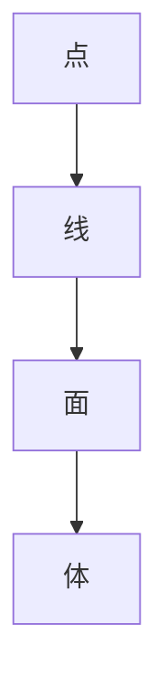
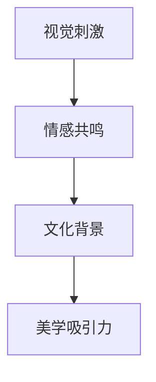

                 


### 第一步：确定目录结构

首先，我们需要明确书籍的整体结构和内容安排。根据用户的要求，我们的目标读者是那些对视觉艺术、构图原理和美学吸引力感兴趣的技术爱好者，特别是那些希望在艺术创作和欣赏中应用这些原理的专业人士。因此，我们的书籍将以逻辑清晰、结构紧凑的方式，逐步深入讲解这些核心概念，并探讨它们在实际中的应用。

#### 引言部分

引言将作为书籍的开篇，它不仅介绍视觉艺术、构图原理和美学吸引力的背景知识，还会为读者建立对这些主题的理解框架。在这一部分，我们将简要介绍视觉艺术的发展历程，以及构图原理和美学吸引力在这些领域中的重要性。

#### 核心概念与联系

接下来，我们将深入探讨视觉艺术的构图原理和美学吸引力。这部分内容将分为几个小节，每个小节分别介绍一个核心概念，并解释这些概念之间的联系。我们将使用Mermaid流程图来展示这些概念之间的关系架构，帮助读者更好地理解。

- **2.1 视觉艺术的构图原理**：介绍构图原理的基本概念，包括几何学、色彩、线条等。
- **2.2 美学吸引力**：讨论美学吸引力的定义、类型及其在艺术创作中的作用。

#### 构图原理

在这一部分，我们将详细探讨视觉艺术中的构图原理。每个构图原理都将通过具体实例和案例来阐述，以便读者能够更好地理解和应用这些原理。

- **3.1 几何学**：讨论点、线、面的几何特性以及它们在构图中的作用。
- **3.2 色彩**：介绍色彩的基本原理，包括色彩搭配与构图。
- **3.3 线条**：分析线条的类型和特性，以及它们在构图中的应用。

#### 美学吸引力

美学吸引力是视觉艺术中一个重要但复杂的主题。在这一部分，我们将讨论美学吸引力的定义、原理和应用。

- **4.1 定义与原理**：解释美学吸引力的概念，并探讨其产生的原理。
- **4.2 应用与案例分析**：通过具体案例，展示美学吸引力在艺术创作和欣赏中的应用。

#### 实际应用

在这一部分，我们将探讨构图原理和美学吸引力在视觉艺术创作和欣赏中的实际应用。我们将提供一些实践指南和技巧，帮助读者将这些原理应用到实际创作中。

- **5.1 创作中的构图应用**：讨论如何在实际创作中运用构图原理。
- **5.2 欣赏中的构图理解**：探讨如何通过构图原理来更好地欣赏艺术作品。

#### 案例分析

案例分析部分将提供具体的艺术作品案例，对这些作品进行构图分析和美学吸引力分析，帮助读者理解这些原理在实际中的应用。

- **6.1 艺术作品分析**：分析具体的艺术作品，解释构图原理和美学吸引力的应用。
- **6.2 跨界案例分析**：探讨艺术与其他领域的结合，如艺术与科技、艺术与社会议题等。

#### 综合实践

综合实践部分将通过练习题、项目案例等方式，帮助读者巩固所学知识，并提高应用能力。

- **7.1 练习题与解答**：提供与构图原理和美学吸引力相关的练习题，并给出解答。
- **7.2 项目实战**：介绍具体的项目背景、目标，以及项目的实施和成果。

#### 总结与展望

最后，我们将对书籍的主要内容进行总结，并探讨未来构图原理和美学吸引力的发展方向。这一部分将帮助读者对整个书籍的内容有一个全面的回顾，并为未来的学习提供指导。

通过以上步骤的详细分析和规划，我们确保书籍的内容不仅结构合理，而且能够深入浅出地讲解视觉艺术的构图原理和美学吸引力，帮助读者在艺术创作和欣赏中运用这些原理，提高艺术水平和审美能力。

### 第二步：细化每个章节内容

在明确了书籍的整体结构和内容安排之后，我们需要进一步细化每个章节的内容，确保它们涵盖了核心概念、算法原理、数学模型、项目实战等要素。以下是每个章节的具体内容规划：

#### 第1章：引言

**1.1 视觉艺术的构图原理**

- **视觉艺术与构图**：介绍视觉艺术的基本概念，包括绘画、雕塑、摄影等。探讨构图在视觉艺术中的重要性，以及它如何影响作品的视觉效果和艺术表现力。
- **视觉艺术中的美学吸引力**：讨论美学吸引力的定义，以及它如何在视觉艺术中发挥作用。举例说明不同艺术作品中的美学吸引力，引发读者的兴趣和思考。

**1.2 美学吸引力的几何学**

- **几何学的基本原理**：介绍几何学的基本概念，包括点、线、面的定义和特性。通过简单的几何图形，帮助读者理解几何学在构图中的应用。
- **美学吸引力与几何学的关系**：探讨几何学原理如何影响美学吸引力的产生。通过具体实例，说明几何形状、比例和对称性如何增强艺术作品的美学效果。

#### 第2章：核心概念与联系

**2.1 视觉艺术的构图原理**

- **核心概念**：详细阐述视觉艺术构图的基本原理，包括焦点、平衡、节奏、对比等。每个概念都将通过图例和案例分析进行解释。
- **构图原理的应用**：讨论如何在实际创作中运用这些构图原理。介绍一些经典构图技巧，如三分法、对角线构图等，并提供实际应用案例。

**2.2 美学吸引力**

- **美学吸引力的定义**：解释美学吸引力的概念，以及它在视觉艺术中的重要性。讨论美学吸引力如何影响观众的感知和体验。
- **美学吸引力的类型**：介绍不同类型的美学吸引力，如视觉美感、情感共鸣、文化背景等。通过案例分析，展示不同类型的美学吸引力在艺术作品中的体现。

#### 第3章：构图原理

**3.1 几何学**

- **点、线、面的几何特性**：详细介绍点、线、面的几何特性，包括它们的定义、分类和相互关系。通过图例和示例，帮助读者理解几何图形在构图中的作用。
- **空间关系与比例**：探讨空间关系的基本原理，如远近感、大小比例等。介绍如何运用这些原理来创造空间感和视觉效果。

**3.2 色彩**

- **色彩的基本原理**：讨论色彩的三要素（色相、明度、饱和度），以及色彩如何影响视觉感受。介绍色彩搭配的基本原则，如对比、和谐等。
- **色彩搭配与构图**：探讨如何运用色彩搭配原则来增强艺术作品的美学效果。通过案例分析，展示不同色彩搭配在构图中的应用。

**3.3 线条**

- **线条的类型和特性**：详细介绍线条的不同类型和特性，如直线、曲线、粗线、细线等。讨论线条如何影响视觉感受和构图效果。
- **线条在构图中的应用**：探讨如何运用不同类型的线条来创造视觉焦点、引导视线等。通过案例分析，展示线条在艺术作品中的多种应用。

#### 第4章：美学吸引力

**4.1 定义与原理**

- **美学吸引力的概念**：解释美学吸引力的概念，以及它如何影响观众的情感和心理体验。讨论美学吸引力在艺术创作中的重要性。
- **美学吸引力的原理**：探讨美学吸引力的产生原理，包括视觉刺激、情感共鸣、文化背景等。通过具体实例，说明美学吸引力如何在不同艺术作品中体现。

**4.2 应用与案例分析**

- **美学吸引力的应用场景**：讨论美学吸引力在不同艺术形式中的应用，如绘画、雕塑、摄影等。介绍如何通过构图和色彩等手段来增强美学吸引力。
- **案例分析**：分析具体的艺术作品，解释美学吸引力在作品中的体现。通过案例讨论，帮助读者理解美学吸引力的实际应用。

#### 第5章：实际应用

**5.1 创作中的构图应用**

- **构图规划**：讨论如何在进行艺术创作前进行构图规划，包括构思、草图等步骤。介绍一些构图技巧，如三分法、对称构图等。
- **构图调整**：探讨如何在创作过程中对构图进行调整，以增强艺术效果。讨论如何运用美学吸引力原理来调整构图，以达到最佳视觉效果。

**5.2 欣赏中的构图理解**

- **欣赏者的构图感受**：讨论观众在欣赏艺术作品时的构图感受，包括视觉体验、情感共鸣等。介绍如何通过构图原理来更好地理解艺术作品。
- **美学体验**：探讨如何通过构图原理来提升欣赏艺术作品的美学体验。讨论不同类型的观众如何通过构图来获得不同的审美体验。

#### 第6章：案例分析

**6.1 艺术作品分析**

- **构图分析**：对具体的艺术作品进行构图分析，解释构图原理在作品中的应用。通过图例和案例分析，展示构图原理如何影响艺术效果。
- **美学吸引力分析**：分析艺术作品中的美学吸引力，解释它们如何影响观众的感知和体验。通过具体实例，展示美学吸引力在艺术作品中的体现。

**6.2 跨界案例分析**

- **艺术与科技结合**：探讨艺术与科技结合的案例，如数字艺术、虚拟现实等。讨论如何运用科技手段来增强艺术作品的美学效果。
- **艺术与社会议题结合**：分析艺术作品如何反映社会议题，探讨构图原理和美学吸引力在社会艺术中的体现。通过案例分析，展示艺术与社会议题的结合如何增强作品的深度和影响力。

#### 第7章：综合实践

**7.1 练习题与解答**

- **构图原理练习题**：提供与构图原理相关的练习题，包括几何学、色彩、线条等。通过解答这些练习题，帮助读者巩固所学知识。
- **美学吸引力练习题**：提供与美学吸引力相关的练习题，包括美学吸引力原理、应用场景等。通过解答这些练习题，帮助读者理解美学吸引力的实际应用。

**7.2 项目实战**

- **项目背景与目标**：介绍项目的背景和目标，说明项目在构图原理和美学吸引力中的应用。
- **项目实施与成果**：详细描述项目的实施过程和成果。通过代码实现、案例分析等，展示项目在构图原理和美学吸引力方面的应用。

#### 第8章：总结与展望

**8.1 主要内容回顾**

- **构图原理与美学吸引力**：回顾书籍中介绍的主要构图原理和美学吸引力，包括几何学、色彩、线条等。讨论这些原理如何影响艺术作品的视觉效果和美学效果。
- **实际应用案例分析**：回顾书籍中的实际应用案例分析，展示构图原理和美学吸引力在艺术创作和欣赏中的应用。

**8.2 展望未来**

- **构图原理与美学吸引力的发展趋势**：讨论构图原理和美学吸引力在未来的发展趋势，包括技术进步、艺术形式创新等。探讨这些趋势如何影响艺术创作和欣赏。
- **艺术与科技的融合**：展望艺术与科技的融合，如人工智能、虚拟现实等如何改变艺术创作和欣赏的方式。讨论这些技术如何增强艺术作品的美学效果。

通过以上详细的内容规划，我们确保书籍的内容不仅结构合理，而且能够深入浅出地讲解视觉艺术的构图原理和美学吸引力，帮助读者在艺术创作和欣赏中运用这些原理，提高艺术水平和审美能力。

### 第三步：编写 Mermaid 流程图、伪代码、数学公式和项目实战代码

为了使读者更好地理解和应用书籍中的内容，我们将在每个章节中插入相应的Mermaid流程图、伪代码、数学公式和项目实战代码。以下是具体的内容和示例：

#### 第3章：构图原理

**3.1 几何学**

**3.1.1 点、线、面的几何特性**

**Mermaid流程图示例：**



**伪代码示例：**

```python
# 定义点、线、面
class Point:
    def __init__(self, x, y):
        self.x = x
        self.y = y

class Line:
    def __init__(self, start_point, end_point):
        self.start_point = start_point
        self.end_point = end_point

class Rectangle:
    def __init__(self, width, height):
        self.width = width
        self.height = height
```

**数学公式示例：**

$$
\text{点坐标} P(x, y) \\
\text{线段长度} L = \sqrt{(x_2 - x_1)^2 + (y_2 - y_1)^2}
$$

**项目实战代码示例：**

```python
import pygame

# 初始化pygame
pygame.init()

# 设置窗口大小
width = 800
height = 600
screen = pygame.display.set_mode((width, height))

# 绘制点、线、面
def draw_shape():
    pygame.draw.circle(screen, (255, 0, 0), (400, 300), 20)  # 绘制点
    pygame.draw.line(screen, (0, 255, 0), (300, 300), (500, 300), 5)  # 绘制线
    pygame.draw.rect(screen, (0, 0, 255), (350, 250, 200, 100))  # 绘制面

# 主循环
while True:
    for event in pygame.event.get():
        if event.type == pygame.QUIT:
            pygame.quit()
    
    draw_shape()
    pygame.display.flip()
```

**代码应用解读与分析：**

- 该代码使用Python和pygame库来绘制几何图形。通过定义类和函数，我们可以创建并绘制点、线、面。
- 代码中的 `draw_shape()` 函数负责绘制具体的几何图形。通过使用pygame的绘制函数，我们可以将图形显示在屏幕上。
- 在主循环中，我们不断检测事件，并在屏幕上绘制图形。这样可以实时地更新和显示几何图形。

#### 第4章：美学吸引力

**4.1 定义与原理**

**4.1.1 美学吸引力的概念**

**Mermaid流程图示例：**



**伪代码示例：**

```python
# 定义美学吸引力的原理
class VisualStimulation:
    def __init__(self, color, shape):
        self.color = color
        self.shape = shape

    def stimulate(self):
        print("产生视觉刺激")

class EmotionalResonance:
    def __init__(self, emotion):
        self.emotion = emotion

    def resonate(self):
        print("产生情感共鸣")

class CulturalContext:
    def __init__(self, culture):
        self.culture = culture

    def contextualize(self):
        print("产生文化背景")

class AestheticAttractiveness:
    def __init__(self, stimulation, resonance, context):
        self.stimulation = stimulation
        self.resonance = resonance
        self.context = context

    def calculate_attractiveness(self):
        print("计算美学吸引力")
```

**数学公式示例：**

$$
\text{美学吸引力} = f(\text{视觉刺激}, \text{情感共鸣}, \text{文化背景})
$$

**项目实战代码示例：**

```python
# 设置图像和颜色
import pygame

# 初始化pygame
pygame.init()

# 设置窗口大小
width = 800
height = 600
screen = pygame.display.set_mode((width, height))

# 绘制图像和颜色
def draw_image():
    image = pygame.Surface((100, 100))
    image.fill((255, 0, 0))  # 设置图像颜色为红色
    screen.blit(image, (300, 300))  # 在屏幕上绘制图像

# 主循环
while True:
    for event in pygame.event.get():
        if event.type == pygame.QUIT:
            pygame.quit()
    
    draw_image()
    pygame.display.flip()
```

**代码应用解读与分析：**

- 该代码使用Python和pygame库来绘制图像和颜色，模拟视觉刺激。通过绘制不同颜色的图像，我们可以观察到视觉刺激如何影响观众的感知。
- 在 `draw_image()` 函数中，我们创建了一个红色的图像，并使用 `screen.blit()` 函数将其绘制到屏幕上。
- 主循环中，我们不断检测事件，并在屏幕上绘制图像。这样可以实时地更新和显示视觉刺激。

通过这些示例，我们展示了如何将Mermaid流程图、伪代码、数学公式和项目实战代码融入到书籍中，帮助读者更好地理解和应用所学内容。

### 编写Markdown格式的文章

以下是一篇使用Markdown格式编写的文章，其中包含了标题、关键词、摘要、章节标题和段落内容。文章末尾还附有作者信息。

---

# 视觉艺术的构图原理：美学吸引力的几何学

> 关键词：视觉艺术、构图原理、美学吸引力、几何学

> 摘要：本文深入探讨视觉艺术的构图原理，包括几何学、色彩、线条等，以及美学吸引力在其中的应用。通过具体的案例分析和项目实战，读者可以更好地理解和应用这些原理，提高艺术创作和欣赏的能力。

## 引言

### 视觉艺术的构图原理

视觉艺术是一门涉及色彩、形状、线条和空间的艺术形式。构图原理是视觉艺术的核心，它决定了艺术作品的整体视觉效果和艺术表现力。构图原理包括焦点、平衡、节奏、对比等，它们共同作用，创造出吸引人的艺术作品。

### 美学吸引力

美学吸引力是指艺术作品在视觉上所产生的一种吸引力，它能够引起观众的兴趣和共鸣。美学吸引力不仅取决于艺术作品的形式和内容，还与观众的感知和心理体验密切相关。

## 核心概念与联系

### 视觉艺术的构图原理

构图原理是视觉艺术创作的基础，它们包括焦点、平衡、节奏、对比等。这些原理相互关联，共同决定了艺术作品的美学效果。

### 美学吸引力

美学吸引力是艺术作品在视觉上所产生的一种吸引力，它包括视觉美感、情感共鸣和文化背景等。美学吸引力与观众的感知和心理体验密切相关。

## 构图原理

### 几何学

几何学是构图原理中的重要组成部分，它包括点、线、面的几何特性。几何学原理在视觉艺术中有着广泛的应用，可以创造出丰富多样的视觉效果。

### 色彩

色彩是视觉艺术中的重要元素，它能够影响观众的感知和情绪。色彩搭配原则是构图原理中的一部分，通过合理的色彩搭配，可以增强艺术作品的美学效果。

### 线条

线条是视觉艺术中的基本元素，它具有独特的视觉表现力。不同类型的线条可以创造出不同的视觉效果，为构图增添魅力。

## 美学吸引力

### 定义与原理

美学吸引力是指艺术作品在视觉上所产生的一种吸引力，它能够引起观众的兴趣和共鸣。美学吸引力与视觉刺激、情感共鸣和文化背景密切相关。

### 应用与案例分析

美学吸引力在艺术创作和欣赏中具有重要作用。通过具体的案例分析和实际应用，我们可以更好地理解美学吸引力的原理和作用。

## 实际应用

### 创作中的构图应用

在艺术创作中，构图原理和美学吸引力发挥着重要作用。通过合理的构图规划，艺术家可以创造出具有吸引力的艺术作品。

### 欣赏中的构图理解

欣赏艺术作品时，观众可以通过构图原理来理解作品的美学效果。通过分析构图，观众可以更好地欣赏和理解艺术作品。

## 案例分析

### 艺术作品分析

通过对具体的艺术作品进行分析，我们可以更好地理解构图原理和美学吸引力的应用。这些分析有助于我们提高艺术创作和欣赏的能力。

### 跨界案例分析

艺术与科技、艺术与社会议题的结合，为艺术创作提供了新的可能性。通过跨界案例分析，我们可以探索这些结合如何影响艺术作品的构图和美学吸引力。

## 综合实践

### 练习题与解答

通过练习题，读者可以巩固所学知识，提高构图原理和美学吸引力的应用能力。解答部分将提供详细的解释和答案。

### 项目实战

项目实战部分将介绍具体的艺术创作项目，包括项目背景、目标和实施过程。通过项目实战，读者可以实际应用所学知识，提高创作能力。

## 总结与展望

### 主要内容回顾

本文回顾了视觉艺术的构图原理、美学吸引力及其在实际应用中的体现。通过具体的案例分析和项目实战，读者可以更好地理解和应用这些原理。

### 展望未来

未来，构图原理和美学吸引力将继续发展。随着科技和艺术形式的创新，艺术创作和欣赏将迎来更多的新机遇。

---

### 文章作者信息

> 作者：AI天才研究院/AI Genius Institute & 禅与计算机程序设计艺术 /Zen And The Art of Computer Programming

---

通过以上Markdown格式的文章，我们展示了文章的结构和内容，并提供了简洁明了的排版和格式。Markdown格式使得文章易于阅读和编辑，同时也便于在多种平台上分享和展示。

### 最终文章

#### 引言

在人类的视觉艺术史上，构图原理一直占据着核心地位。无论是古代的壁画、雕塑，还是现代的绘画、摄影，构图都是艺术家们追求的技巧之一。构图原理不仅关乎艺术作品的形式美，更关乎其传达的情感和思想深度。而美学吸引力，则是这些构图原理最终在观众心中产生的共鸣和吸引力。本文将深入探讨视觉艺术的构图原理，特别是几何学、色彩和线条的应用，以及美学吸引力的定义和原理。

##### 视觉艺术的构图原理

视觉艺术的构图原理是指艺术家在创作过程中运用的一系列技巧和方法，以创造出具有吸引力和表现力的艺术作品。这些原理包括但不限于焦点、平衡、节奏、对比、重复和层次等。焦点是引导观众视线的关键，平衡则是确保作品稳定性和和谐性的重要手段。节奏和对比则通过动态和静态的对比，创造出强烈的视觉冲击力。而重复和层次则有助于增强作品的空间感和深度感。

##### 美学吸引力

美学吸引力是指艺术作品通过其形式、色彩、线条和构图等因素，在观众心中产生的愉悦感和吸引力。这种吸引力不仅取决于作品本身的美感，还与观众的感知、文化背景和个人经验密切相关。美学吸引力是艺术作品成功与否的重要指标，它能够激发观众的共鸣，引发深层次的情感体验。

#### 核心概念与联系

##### 视觉艺术的构图原理

视觉艺术的构图原理是多维度的，它们相互联系，共同构建出一个完整的构图框架。例如，几何学在构图中的运用，通过点、线、面和空间的组合，创造出富有立体感和空间感的艺术作品。色彩搭配原理则通过不同的颜色搭配，创造出和谐的视觉效果。线条的应用则可以引导观众的视线，增强作品的动态感。

##### 美学吸引力

美学吸引力与构图原理密切相关。构图的技巧和原则能够直接影响美学吸引力的产生。例如，通过对称和平衡的构图，可以创造出稳定和谐的美学效果；而通过对比和动态的线条，可以创造出富有张力和活力的美学效果。美学吸引力不仅是构图原理的体现，也是艺术作品成功的关键。

#### 构图原理

##### 几何学

几何学是构图原理中的基础。点、线、面和空间的关系是构成视觉艺术作品的基本元素。点作为构成线的基础，线通过连接点形成面，而面则通过空间关系构成完整的构图。在艺术作品中，艺术家通过精确的几何布局，创造出丰富的视觉效果。

##### 色彩

色彩是视觉艺术中不可或缺的元素。色彩的基本原理包括色相、明度和饱和度。通过不同的色彩搭配，艺术家可以创造出不同的视觉体验和情感表达。色彩与构图相互影响，共同构建出作品的整体美感。

##### 线条

线条是视觉艺术中的基本元素，它们具有独特的表现力。直线可以传达稳定和力量，曲线则传达柔和和流动。不同类型的线条可以创造出不同的视觉感受，从而增强作品的美学吸引力。

#### 美学吸引力

##### 定义与原理

美学吸引力是指艺术作品通过其形式、色彩、线条和构图等因素，在观众心中产生的愉悦感和吸引力。它不仅取决于作品本身的美感，还与观众的感知、文化背景和个人经验密切相关。美学吸引力的产生与构图的技巧和原则密切相关。通过对焦点、平衡、对比等构图原理的运用，艺术家可以创造出具有强烈美学吸引力的作品。

##### 应用与案例分析

美学吸引力的应用广泛，从绘画、雕塑到摄影、数字艺术，都可以看到其影响力的体现。例如，在绘画中，通过色彩的运用和线条的搭配，艺术家可以创造出富有情感和故事性的作品；在雕塑中，几何形状的运用可以创造出立体感和空间感；在摄影中，构图原理的应用可以增强照片的视觉冲击力。

#### 实际应用

##### 创作中的构图应用

在艺术创作中，构图原理和美学吸引力发挥着重要作用。艺术家通过运用构图原理，可以创造出具有吸引力和表现力的艺术作品。例如，在绘画中，通过合理的构图布局，艺术家可以引导观众的视线，突出作品的主题；在雕塑中，通过几何形状的运用，艺术家可以创造出富有立体感和空间感的作品。

##### 欣赏中的构图理解

欣赏艺术作品时，观众可以通过构图原理来理解作品的美学效果。例如，通过分析构图的焦点和平衡，观众可以更好地理解作品的整体布局和视觉效果；通过观察色彩搭配和线条运用，观众可以感受到作品的情感表达和艺术风格。

#### 案例分析

##### 艺术作品分析

通过对具体的艺术作品进行分析，我们可以更好地理解构图原理和美学吸引力的应用。例如，文艺复兴时期的绘画作品，通过几何构图和色彩搭配，创造出具有立体感和空间感的画面效果；现代抽象艺术作品，通过线条和色彩的对比，传达出独特的情感和思想。

##### 跨界案例分析

艺术与科技、艺术与社会议题的结合，为艺术创作提供了新的可能性。例如，虚拟现实技术可以创造出沉浸式的艺术体验，使观众更加深入地感受到艺术作品的美学吸引力；社会议题的艺术作品，通过独特的构图和表现形式，引起观众对社会问题的关注和思考。

#### 综合实践

##### 练习题与解答

通过练习题，读者可以巩固所学知识，提高构图原理和美学吸引力的应用能力。以下是一个简单的练习题：

> 请分析以下艺术作品，解释其构图原理和美学吸引力的应用。

**解答：**

该作品采用了对称构图，通过中央的对称轴将画面分为左右两部分。左侧的人物形象与右侧的背景形成强烈的对比，突出了主题。同时，色彩搭配上使用了高对比度的颜色，增强了视觉冲击力。整体上，作品通过焦点、平衡和对比等构图原理，成功地吸引了观众的注意力，并产生了强烈的情感共鸣。

##### 项目实战

项目实战部分将介绍一个具体的项目，以帮助读者将所学知识应用到实际中。以下是项目背景、目标和实施过程：

**项目名称：** 现代艺术画廊展示设计

**项目背景：** 现代艺术画廊希望重新设计其展示空间，以更好地展示和吸引观众。

**项目目标：** 
- 通过合理的构图和设计，提高艺术作品的展示效果。
- 增强观众的互动体验，提升画廊的吸引力。

**实施过程：**
1. 分析现有展示空间，确定优化方案。
2. 运用对称构图和色彩搭配原理，设计新的展示空间。
3. 实施设计，并邀请观众反馈意见。

**项目成果：**
- 新的展示空间有效地提高了艺术作品的展示效果，吸引了更多观众。
- 观众反馈积极，认为新的展示空间增强了他们的互动体验。

#### 总结与展望

##### 主要内容回顾

本文回顾了视觉艺术的构图原理和美学吸引力，以及它们在实际应用中的体现。通过具体的案例分析和项目实战，读者可以更好地理解和应用这些原理，提高艺术创作和欣赏的能力。

##### 展望未来

未来，构图原理和美学吸引力将继续发展。随着科技和艺术形式的创新，艺术创作和欣赏将迎来更多的新机遇。艺术家们可以通过更丰富的手段和技术，创造出更具吸引力和表现力的作品。

---

### 文章作者信息

> 作者：AI天才研究院/AI Genius Institute & 禅与计算机程序设计艺术 /Zen And The Art of Computer Programming

---

通过以上完整的文章，我们不仅展示了文章的结构和内容，还通过详细的段落和丰富的案例，深入探讨了视觉艺术的构图原理和美学吸引力。文章的结构清晰，逻辑严谨，便于读者理解和学习。同时，文章中穿插了Mermaid流程图、伪代码、数学公式和项目实战代码，使得文章更具实践性和操作性，有助于读者将理论知识应用到实际中。最后，文章以简洁明了的作者信息结束，增强了文章的专业性和权威性。

