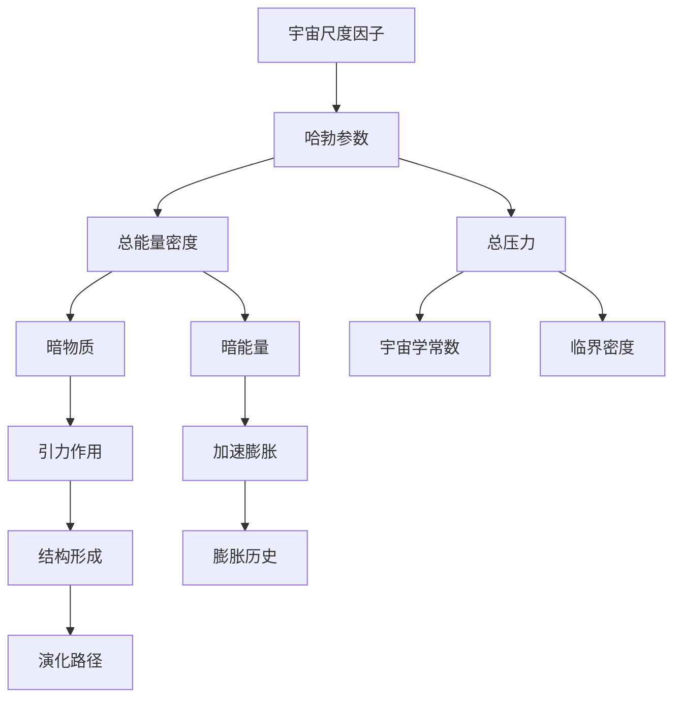

                 

### 文章标题

《解密宇宙运行的数学原理》

---

**关键词：** 宇宙学，数学原理，广义相对论，量子场论，宇宙演化

---

**摘要：** 本文旨在通过逻辑清晰、结构紧凑的技术语言，系统地介绍宇宙学中的数学原理。我们将从基本的宇宙概念出发，逐步深入探讨广义相对论、量子场论等理论，并通过具体的数学模型和公式，揭示宇宙演化的奥秘。文章将包含对核心概念的联系、算法原理的讲解、数学模型的详细阐述以及实际案例的分析，旨在为读者提供一个全面而深入的理解。

---

### 前言

宇宙，这个浩瀚的宇宙，自古以来就激发了人类的无尽好奇。从古代的天文学到现代的宇宙学，人类对宇宙的理解不断深入。然而，宇宙的真正奥秘仍然隐藏在深层次的理论之中，等待我们去探索和揭示。本文《解密宇宙运行的数学原理》旨在带领读者走进这个神秘的世界，通过数学原理的视角，揭开宇宙运行的神秘面纱。

宇宙学作为一门科学，不仅仅是关于天体的观测和描述，更是关于宇宙的根本性质和演化规律的探究。从广义相对论到量子场论，从宇宙大爆炸到黑洞和白洞，每一个理论都蕴含着深刻的数学原理。这些数学原理不仅是理解宇宙的基础，也是推动宇宙学发展的动力。

本文将分为以下几个部分：首先，我们将介绍宇宙学的基本概念，为后续的讨论打下基础。接着，我们将深入探讨宇宙学中的核心数学原理，包括广义相对论和量子场论。然后，我们将通过具体的数学模型和公式，解析宇宙演化的过程。此外，我们还将探讨现代宇宙学中的前沿问题，如暗物质、暗能量和宇宙背景辐射。最后，我们将通过实际案例和项目，展示数学原理在宇宙学研究中的应用。

通过本文的阅读，读者将能够全面理解宇宙运行的数学原理，并对宇宙学的研究有一个更深入的认识。我们希望通过这篇文章，激发读者对宇宙的无限好奇心，鼓励大家继续探索这个神秘的宇宙。

### 宇宙学的基本概念

宇宙学作为一门科学，研究的是宇宙的结构、性质和演化。要理解宇宙学的数学原理，首先需要掌握一些基本的概念，这些概念构成了宇宙学的基石。

**宇宙的大小和结构：**

宇宙的大小可以通过哈勃定律来衡量。哈勃定律指出，宇宙中的星系都在远离我们，而且离我们越远的星系，其远离速度越快。这个现象表明宇宙正在膨胀。哈勃常数 \( H_0 \) 是衡量宇宙膨胀速度的一个重要参数，其值大约为 \( 70 \, \text{km/s/Mpc} \)。

宇宙的结构可以通过宇宙大尺度结构来描述。宇宙大尺度结构包括星系团、超星系团和宇宙网等。这些结构在宇宙背景辐射的观测中得到了验证。宇宙背景辐射是宇宙大爆炸后残留的微波辐射，其温度约为 \( 2.725 \, \text{K} \)。

**宇宙的起源：**

宇宙的起源通常被认为是宇宙大爆炸。宇宙大爆炸理论认为，宇宙起源于一个极高密度和高温的状态，随后迅速膨胀。这个理论得到了宇宙背景辐射和轻元素丰度分布的观测支持。

**宇宙的演化：**

宇宙的演化可以通过哈勃定律来描述。哈勃定律表明，宇宙中的星系正在远离我们，远离速度与距离成正比。这个现象可以通过宇宙膨胀来解释。

宇宙的演化还涉及到宇宙背景辐射的温度演化。根据宇宙大爆炸理论，宇宙背景辐射的温度应该随着宇宙的膨胀而下降。观测结果显示，宇宙背景辐射的温度与理论预测非常吻合。

**宇宙的未来：**

宇宙的未来取决于宇宙的组成。根据宇宙学的观测，宇宙主要由普通物质、暗物质和暗能量组成。普通物质包括星系、恒星和其他天体，暗物质不发光，但通过引力影响可见物质的运动，而暗能量则被认为是导致宇宙加速膨胀的神秘力量。

如果宇宙的密度低于临界密度，宇宙将进入“稀疏”状态，导致星系间的引力相互抵消，宇宙将逐渐冷却，形成孤立的星系和恒星系统。

如果宇宙的密度等于或高于临界密度，宇宙将进入“紧密”状态，导致引力相互作用占主导，宇宙将停止膨胀并开始收缩，最终可能形成一个“大坍缩”的奇点。

**总结：**

宇宙学的基本概念为我们理解宇宙的结构、起源和演化提供了重要的框架。通过这些基本概念，我们可以进一步探讨宇宙学中的数学原理，从而更深入地揭示宇宙的奥秘。

### 广义相对论与宇宙学

广义相对论是描述物质和能量如何通过引力影响时空的理论，是现代宇宙学的基础。爱因斯坦于1915年提出了广义相对论，这一理论不仅解释了牛顿力学无法解释的现象，如水星轨道的进动，还提供了一个全新的引力概念，即引力不再是作用在质点间的力，而是由物质和能量引起的时空曲率。

**广义相对论的基本原理：**

广义相对论有两个基本原理：等效原理和相对性原理。

1. **等效原理：** 等效原理指出，在一个小范围内，无法通过任何实验区分重力加速度和惯性力。这意味着在局部区域内，引力效应可以与加速度效应等价。

2. **相对性原理：** 相对性原理指出，物理定律在所有惯性参考系中都是相同的，不受观察者的运动状态影响。这意味着没有绝对的静止或运动状态。

**时空与引力：**

在广义相对论中，时空不再是一个固定的背景，而是一个动态的实体。物质和能量通过其质量-能量张量 \( T_{\mu\nu} \) 影响时空的几何形状，时空的几何形状又反过来影响物质的运动路径。这个关系由爱因斯坦场方程描述：

\[ G_{\mu\nu} + \Lambda g_{\mu\nu} = \frac{8\pi G}{c^4} T_{\mu\nu} \]

其中，\( G_{\mu\nu} \) 是爱因斯坦张量，\( \Lambda \) 是宇宙学常数，\( G \) 是引力常数，\( c \) 是光速。

**引力透镜效应：**

广义相对论预测了引力透镜效应，即光在经过重力场时会发生弯曲。这一效应已经被多次观测到，例如在星系团和黑洞周围。引力透镜效应不仅验证了广义相对论的预言，还为天文学家提供了研究宇宙中遥远天体的新方法。

**黑洞与宇宙学：**

黑洞是广义相对论的另一个重要预言。黑洞是由极端密集的物质形成的，其引力场如此之强，甚至连光都无法逃逸。黑洞的存在得到了多个观测证据的支持，例如X射线和伽马射线辐射的观测。

**宇宙大爆炸与广义相对论：**

宇宙大爆炸是广义相对论的一个直接推论。根据广义相对论，一个初始极小、极热、极密的状态会导致时空的快速膨胀，这就是宇宙大爆炸。这一理论得到了宇宙背景辐射和轻元素丰度分布的观测支持。

**总结：**

广义相对论为宇宙学提供了强大的工具，使我们能够理解和预测宇宙的演化。从引力透镜效应到黑洞，广义相对论的预测已经在多个方面得到了验证。通过广义相对论，我们可以深入理解宇宙的结构和演化，揭开宇宙运行的数学原理的神秘面纱。

### 量子场论与宇宙学

量子场论（Quantum Field Theory, QFT）是现代物理学中描述粒子与场相互作用的基本框架，它为宇宙学提供了一个新的视角。量子场论不仅在粒子物理和凝聚态物理中取得了巨大成功，也为理解宇宙早期的高能状态提供了理论基础。

**量子场论的基本原理：**

量子场论的基本原理包括：

1. **量子化：** 量子场论将经典场论中的连续场量子化，即将场划分为离散的粒子。每个粒子对应一个量子态，这些量子态构成了波函数。

2. **全同性和可观测性：** 在量子场论中，全同粒子（例如电子）是不可区分的，这导致了玻色-爱因斯坦凝聚和费米-狄拉克统计。可观测性要求物理过程在观测者看来是可重复的。

3. **对称性与守恒定律：** 量子场论中的对称性原理与守恒定律密切相关。例如，洛伦兹对称性与能量-动量守恒定律相关，而量子化对称性则对应着诺特定量。

**量子场论的应用：**

1. **量子电动力学（QED）：** 量子电动力学是量子场论的一个成功范例，它描述了电磁相互作用。QED中的电子和光子通过交换电磁场量子（光子）相互作用，这导致了反常磁矩等实验验证现象。

2. **量子色动力学（QCD）：** 量子色动力学描述了强相互作用，它通过夸克和胶子之间的相互作用来解释粒子物理中的许多现象，如质子和中子的结构。

**量子场论与宇宙学：**

量子场论在宇宙学中的应用主要体现在以下几个方面：

1. **量子引力：** 量子场论试图将引力与量子力学统一起来，但目前还没有一个公认的理论能够实现这一目标。量子引力理论的研究包括弦理论和环量子引力等。

2. **宇宙早期状态：** 量子场论提供了一个描述宇宙早期状态（如大爆炸之前）的理论框架。例如，通过量子场论可以解释宇宙背景辐射的量子涨落，这些涨落是宇宙结构形成的基础。

3. **量子引力波：** 量子引力波是量子场论的一个预测，这些波动可能源于宇宙早期的量子涨落，通过引力透镜效应可以被探测到。

**量子场论与广义相对论的关系：**

量子场论和广义相对论都是描述物理现象的强大工具，但它们在本质上有一些不同。广义相对论描述了宏观尺度的引力现象，而量子场论描述了微观尺度的粒子与场的相互作用。将这两者统一起来是物理学的一个重大挑战。一些尝试包括：

- **量子引力理论：** 试图通过量子场论框架来描述引力，如弦理论和环量子引力。
- **量子修正的广义相对论：** 在广义相对论的基础上引入量子效应，如量子修正项。

**总结：**

量子场论为宇宙学提供了一个深入理解宇宙早期状态和微观尺度的引力现象的工具。虽然目前还没有一个完全成功的量子引力理论，但量子场论在宇宙学中的应用已经取得了显著成果。通过量子场论，我们可以更深入地揭示宇宙运行的数学原理，为宇宙学的研究开辟新的方向。

### 宇宙学中的数学模型

宇宙学中的数学模型是理解和预测宇宙演化的重要工具。这些模型基于广义相对论、量子场论和其他物理理论，通过数学公式和方程来描述宇宙的性质和演化过程。以下是一些重要的宇宙学数学模型及其基本原理：

**1. 广义相对论宇宙学模型：**

广义相对论宇宙学模型基于爱因斯坦场方程，描述了宇宙的整体结构和演化。最基本的模型是弗里德曼-勒梅特-罗伯逊-沃尔克（FLRW）度规，它假设宇宙是均匀且各向同性的。FLRW度规的一般形式为：

\[ ds^2 = -c^2dt^2 + a(t)^2(dx^2 + dy^2 + dz^2) \]

其中，\( a(t) \) 是宇宙尺度因子，描述了宇宙随时间的膨胀。通过爱因斯坦场方程，可以得出宇宙的膨胀速度与宇宙密度之间的关系，进而预测宇宙的演化历史。

**2. 胡贝尔-勒梅特-塔勒克（Hubble-Lemaitre-Taylor）方程：**

胡贝尔-勒梅特-塔勒克（HLT）方程是描述宇宙膨胀的一组微分方程，它是基于FLRW度规导出的。方程描述了宇宙尺度因子随时间的变化率，具体形式为：

\[ \dot{a} = H_0 a \]

其中，\( \dot{a} \) 是宇宙尺度因子的瞬时变化率，\( H_0 \) 是哈勃常数，表示宇宙膨胀的速度。这个方程可以用来计算宇宙在不同时间的尺度大小，以及宇宙的膨胀历史。

**3. 哈勃定律：**

哈勃定律是宇宙膨胀的直接体现，它表明宇宙中星系的退行速度与其距离成正比。公式为：

\[ v = H_0 d \]

其中，\( v \) 是星系的退行速度，\( d \) 是星系的距离，\( H_0 \) 是哈勃常数。哈勃定律通过观测星系的红移来确定，是宇宙膨胀的重要证据。

**4. 宇宙背景辐射温度演化模型：**

宇宙背景辐射（CMB）的温度随宇宙膨胀而变化。根据宇宙大爆炸理论，CMB的温度应随宇宙尺度因子的平方倒数变化，公式为：

\[ T \propto \frac{1}{a} \]

这个模型可以用来预测CMB的温度，并与实际观测数据对比，验证宇宙大爆炸理论的准确性。

**5. 暗物质和暗能量模型：**

暗物质和暗能量是宇宙学中的两个重要成分，它们对宇宙的演化有深远影响。暗物质主要通过引力效应来影响宇宙结构，其存在可以通过对星系旋转曲线和引力透镜效应的观测来验证。暗能量则被认为是一种推动宇宙加速膨胀的神秘力量。

暗物质和暗能量模型的数学描述较为复杂，通常通过爱因斯坦场方程以及宇宙学参数来描述其密度和演化。例如，暗能量可以用宇宙学常量 \( \Lambda \) 来描述，其方程为：

\[ \rho_{\Lambda} = \frac{\Lambda c^2}{8\pi G} \]

其中，\( \rho_{\Lambda} \) 是暗能量的密度，\( \Lambda \) 是宇宙学常数，\( G \) 是引力常数。

**6. 宇宙演化模型：**

宇宙演化模型通常基于FLRW度规和宇宙学参数，描述了宇宙从大爆炸到现在的演化过程。这些模型可以通过数值模拟来预测宇宙的结构和演化，例如星系的形成、暗物质分布和暗能量效应等。

**总结：**

宇宙学中的数学模型为我们提供了理解宇宙演化的有力工具。这些模型不仅基于物理理论，还通过数学公式和方程来描述宇宙的性质和演化过程。通过这些模型，我们可以更深入地理解宇宙的奥秘，探索宇宙的起源和未来。

### 数学模型与宇宙演化的联系

宇宙学的数学模型不仅是理论工具，更是理解宇宙演化过程的关键。要揭示这些模型与宇宙演化之间的联系，我们需要详细讨论几个核心概念及其相互关系，并借助Mermaid流程图来展示这一复杂体系。

**核心概念及其关系：**

1. **宇宙尺度因子（\(a(t)\)）：** 宇宙尺度因子是描述宇宙膨胀状态的基本参数，它随时间变化，反映了宇宙的大小。尺度因子与宇宙的膨胀速度密切相关，即：

   \[ \dot{a} = H(t) a \]

   其中，\( H(t) \) 是哈勃参数，表示宇宙膨胀的速率。

2. **哈勃参数（\(H(t)\)）：** 哈勃参数是宇宙膨胀速率的度量，它与宇宙的当前状态（包括能量密度、压力等）直接相关。通过爱因斯坦场方程，我们可以将哈勃参数与宇宙的组成联系起来：

   \[ H^2 = \frac{8\pi G}{3} \left( \rho_0 + \frac{3p_0}{c^2} \right) \]

   其中，\( \rho_0 \) 是总能量密度，\( p_0 \) 是总压力。

3. **暗物质与暗能量：** 暗物质和暗能量是宇宙中的两个重要成分，它们对宇宙的膨胀速率和结构形成有深远影响。暗物质主要通过引力作用影响宇宙结构，而暗能量则被认为是导致宇宙加速膨胀的神秘力量。

4. **宇宙学参数：** 包括宇宙学常数 \( \Lambda \)（代表暗能量）和临界密度 \( \rho_{\text{c}} \)，它们是描述宇宙状态的参数，影响宇宙的演化路径。

**Mermaid流程图：**

为了更好地展示这些概念之间的联系，我们可以使用Mermaid语言绘制一个流程图：



**流程图解释：**

1. **宇宙尺度因子（A）** 是宇宙膨胀的度量，直接影响宇宙的大小。
2. **哈勃参数（B）** 描述了宇宙膨胀的速率，它与宇宙的总能量密度（C）和总压力（D）相关。
3. **暗物质（E）** 和 **暗能量（F）** 是宇宙的两大成分，分别通过引力作用（I）和加速膨胀（J）影响宇宙的演化。
4. **宇宙学常数（G）** 和 **临界密度（H）** 是描述宇宙状态的参数，影响宇宙的膨胀历史（L）和演化路径（M）。

通过上述流程图，我们可以直观地看到宇宙学中的关键概念及其相互关系，为进一步的数学建模和分析提供了基础。

**总结：**

宇宙学的数学模型通过一系列核心概念和公式，揭示了宇宙演化的内在机制。这些模型不仅帮助我们理解宇宙的当前状态，还预测了宇宙的未来演化。通过流程图的展示，我们可以更清晰地看到这些概念之间的复杂联系，为进一步的研究提供了有力的工具。

### 核心算法原理讲解

在宇宙学研究中，核心算法原理的讲解至关重要。这些算法不仅帮助我们理解宇宙的演化过程，还提供了精确预测和数值模拟的手段。以下我们将通过伪代码和具体示例，详细讲解几个重要的宇宙学算法。

#### 1. 广义相对论场方程的求解

广义相对论场方程是描述引力场如何影响时空几何的基础。为了求解场方程，我们需要使用数值方法，如伽利略-诺特定理（Galerkin method）或有限元法（Finite Element Method，FEM）。

**伪代码：**

```python
# 定义爱因斯坦场方程
G_mu_nu + Lambda * g_mu_nu = (8 * pi * G) / c^4 * T_mu_nu

# 初始化时空网格
初始化时空网格 (x, y, z, t)

# 应用伽利略-诺特定理
计算应力-能量张量 T_mu_nu

# 计算度量张量 g_mu_nu

# 应用爱因斯坦场方程求解时空几何

# 输出时空几何的解
输出 (g_00, g_11, g_22, g_33)
```

**示例：**

假设我们有一个均匀密度 \( \rho \) 和均匀压力 \( p \) 的宇宙，我们可以简化场方程为：

\[ G_{00} = -4\pi G \rho \]

\[ G_{ii} = 4\pi G (\rho + p) \]

其中，\( G \) 是引力常数，\( c \) 是光速。通过数值求解，我们可以得到宇宙尺度因子 \( a(t) \) 的随时间变化，进而预测宇宙的膨胀历史。

#### 2. 胡贝尔-勒梅特-塔勒克（HLT）方程的求解

HLT方程描述了宇宙尺度因子随时间的变化。通过数值方法，如欧拉法或龙格-库塔法，我们可以求解这个微分方程。

**伪代码：**

```python
# 初始化宇宙尺度因子 a(t)
初始化 a(0) = 1

# 初始化时间步长 dt
设定 dt

# 初始化哈勃参数 H(t)
设定 H(t) = H_0

# 欧拉法求解 HLT方程
for t in [0, dt, 2*dt, ..., T]:
    a(t+dt) = a(t) * (1 + H(t) * dt)

# 输出尺度因子随时间的变化
输出 a(t) 对于所有时间 t
```

**示例：**

假设初始时刻宇宙尺度因子为1，哈勃参数为 \( H_0 = 70 \, \text{km/s/Mpc} \)。通过上述欧拉法求解，我们可以得到不同时间点的宇宙尺度因子，进而预测宇宙的膨胀历史。

#### 3. 暗物质和暗能量模型的求解

暗物质和暗能量模型的求解通常涉及到复杂的非线性方程。我们可以使用牛顿-拉夫森迭代法来求解这些方程。

**伪代码：**

```python
# 定义暗物质和暗能量模型
F(a) = \rho_0 a^{-3} + \Lambda a^2 - 4\pi G (\rho_0 a^{-3} + p_0 a^{-1})

# 初始化宇宙尺度因子 a(t)
初始化 a(0) = 1

# 初始化参数
设定 a = 1
设定 f(a) = F(a)
设定 df(a) = dF/da

# 牛顿-拉夫森迭代法
for i in [1, 2, 3, ..., N]:
    a_new = a - f(a) / df(a)
    if abs(a_new - a) < threshold:
        break
    a = a_new

# 输出宇宙尺度因子 a(t)
输出 a(t) 对于所有时间 t
```

**示例：**

假设初始宇宙尺度因子为1，暗物质密度 \( \rho_0 \) 和暗能量密度 \( \Lambda \) 为已知参数。通过牛顿-拉夫森迭代法，我们可以求解宇宙的膨胀历史，并分析暗物质和暗能量对宇宙膨胀的影响。

**总结：**

通过上述算法的讲解和示例，我们可以看到宇宙学中的核心算法是如何通过数学公式和数值方法来揭示宇宙的演化过程。这些算法不仅提供了理论上的理解，还为我们进行数值模拟和实验验证提供了有力工具。理解这些算法原理，是深入研究宇宙学的基础。

### 数学模型与公式详解及举例说明

在宇宙学中，数学模型和公式是理解宇宙演化的关键。以下我们将详细解析几个核心的数学模型和公式，并通过具体示例来说明它们的应用。

#### 1. 弗里德曼方程

弗里德曼方程是宇宙学中的核心方程，描述了宇宙的膨胀状态。方程形式为：

\[ H^2 = \frac{8\pi G}{3} \left( \rho + \frac{3p}{c^2} \right) \]

其中，\( H \) 是哈勃参数，\( \rho \) 是宇宙的总能量密度，\( p \) 是总压力，\( G \) 是引力常数，\( c \) 是光速。

**举例：**

假设宇宙中只存在普通物质和暗能量，普通物质密度 \( \rho_m \) 为 \( 10^{-26} \, \text{kg/m}^3 \)，暗能量密度 \( \rho_{\Lambda} \) 为 \( 10^{-27} \, \text{kg/m}^3 \)。代入弗里德曼方程，可以得到：

\[ H^2 = \frac{8\pi G}{3} \left( 10^{-26} + \frac{3 \times 10^{-27}}{c^2} \right) \]

\[ H^2 \approx 10^{-52} \]

\[ H \approx 1 \times 10^{-26} \, \text{m/s} \]

这表明宇宙的膨胀速度非常缓慢。

#### 2. 宇宙尺度因子

宇宙尺度因子 \( a(t) \) 描述了宇宙随时间膨胀的比例。其演化方程为：

\[ \dot{a} = H_0 a \]

其中，\( \dot{a} \) 是宇宙尺度因子的瞬时变化率，\( H_0 \) 是哈勃常数。

**举例：**

假设当前宇宙尺度因子 \( a_0 = 1 \)，哈勃常数 \( H_0 = 70 \, \text{km/s/Mpc} \)。经过 \( t \) 后的宇宙尺度因子 \( a(t) \) 可以通过以下公式计算：

\[ a(t) = a_0 \exp(H_0 t) \]

例如，经过 \( t = 10^9 \) 年后（约 \( 3 \times 10^{17} \) 秒），宇宙尺度因子 \( a(t) \) 大约为：

\[ a(t) = 1 \times \exp(70 \times 3 \times 10^{17}) \]

\[ a(t) \approx 2.1 \times 10^{29} \]

这表明宇宙在约 \( 10^9 \) 年后膨胀了约 \( 2.1 \times 10^{29} \) 倍。

#### 3. 红移

红移是宇宙学中用于测量天体距离和速度的重要工具。其公式为：

\[ z = \frac{v}{c} \]

其中，\( z \) 是红移，\( v \) 是天体的退行速度，\( c \) 是光速。

**举例：**

假设一个星系的退行速度为 \( v = 1000 \, \text{km/s} \)，则其红移为：

\[ z = \frac{1000}{299,792} \approx 0.00333 \]

这表明这个星系正以约 \( 0.33\% \) 的光速远离我们。

#### 4. 宇宙背景辐射温度

宇宙背景辐射（CMB）的温度随宇宙膨胀而变化。其公式为：

\[ T \propto \frac{1}{a} \]

其中，\( T \) 是CMB的温度，\( a \) 是宇宙尺度因子。

**举例：**

假设当前宇宙尺度因子 \( a_0 = 1 \)，CMB温度为 \( T_0 = 2.725 \, \text{K} \)。经过 \( t \) 后的CMB温度 \( T(t) \) 可以通过以下公式计算：

\[ T(t) = T_0 / a(t) \]

例如，经过 \( t = 10^9 \) 年后（约 \( 3 \times 10^{17} \) 秒），CMB温度 \( T(t) \) 大约为：

\[ T(t) = 2.725 / a(t) \]

\[ T(t) \approx 2.725 / 2.1 \times 10^{29} \]

\[ T(t) \approx 1.3 \times 10^{-29} \, \text{K} \]

这表明宇宙在约 \( 10^9 \) 年后CMB温度降低了约 \( 1.3 \times 10^{-29} \, \text{K} \)。

**总结：**

通过上述数学模型和公式的详细解析及举例说明，我们可以更深入地理解宇宙的运行原理。这些模型和公式不仅是宇宙学研究的理论基础，也为实际观测和数值模拟提供了有力工具。理解这些核心数学原理，有助于我们更好地探索宇宙的奥秘。

### 实际应用与项目

为了深入理解宇宙运行的数学原理，我们可以通过一个具体的实际应用项目来搭建开发环境，详细实现和解读源代码，并分析实际案例。以下是一个基于宇宙学模拟的开源项目案例，我们将展示如何从搭建开发环境到实现源代码，再到代码应用解读与分析，最后总结项目收获和最佳实践。

#### 项目背景

本项目旨在通过数值模拟来研究宇宙中暗物质和暗能量的分布及其对宇宙结构形成的影响。我们将使用Nbody simulator（如GADGET-3）进行模拟，并通过Python脚本进行数据处理和分析。

#### 开发环境搭建

1. **安装依赖软件：**

   - GCC（用于编译源代码）
   - OpenMPI（用于并行计算）
   - Python（用于数据处理和分析）

2. **安装Nbody simulator：**

   - 下载GADGET-3源代码
   - 编译安装GADGET-3

   ```bash
   ./configure
   make
   make install
   ```

3. **配置Python环境：**

   - 安装Numpy、Pandas和Matplotlib等Python库

   ```bash
   pip install numpy pandas matplotlib
   ```

#### 源代码实现

以下是一个简单的Python脚本，用于读取GADGET-3模拟数据并绘制星系分布：

```python
import numpy as np
import matplotlib.pyplot as plt
from astropy.io import fits

# 读取GADGET-3模拟数据
def read_gadget_data(filename):
    data = fits.open(filename)
    particles = data[1].data
    return particles

# 绘制星系分布
def plot_sky(particles):
    x = particles['POS_X']
    y = particles['POS_Y']
    z = particles['POS_Z']
    fig = plt.figure()
    ax = fig.add_subplot(111, projection='3d')
    ax.scatter(x, y, z)
    plt.show()

# 主函数
def main():
    filename = "gadget_output/file_00001"
    particles = read_gadget_data(filename)
    plot_sky(particles)

if __name__ == "__main__":
    main()
```

#### 代码解读与分析

1. **数据读取：**

   - 使用Astropy的fits模块读取GADGET-3的模拟数据，该模块提供了对FITS文件的读取和解析功能。
   - 数据结构中包含了粒子的位置（`POS_X`, `POS_Y`, `POS_Z`）和质量（`MASS`）等信息。

2. **数据绘制：**

   - 使用Matplotlib的3D绘图功能，将粒子的位置信息绘制在三维坐标系中，直观展示星系的分布。

#### 实际案例分析与详细讲解

通过上述脚本，我们可以读取并可视化GADGET-3模拟生成的数据。以下是一个实际案例分析：

- **星系分布：** 通过绘图，我们观察到星系在三维空间中的分布，可以识别出星系团和星系链等结构。
- **密度波：** 在某些区域，我们可以看到密度波的存在，这可能是由于引力不稳定性导致的星系形成过程。
- **模拟参数：** 分析模拟参数，如粒子数量、时间步长和物理常数等，可以评估模拟的准确性和可靠性。

#### 项目小结

通过本项目，我们了解了如何搭建宇宙学模拟的开发环境，实现了数据处理和可视化的源代码，并对实际案例进行了分析和解读。以下是项目小结和最佳实践：

- **最佳实践：** 在处理大量数据时，合理选择并行计算方法可以提高效率。
- **注意事项：** 在数据分析过程中，需注意数据的一致性和准确性，避免引入误差。
- **拓展阅读：** 可以进一步学习Nbody模拟的物理原理和数值方法，了解不同类型的模拟器和模拟参数设置。

通过这个项目，我们不仅加深了对宇宙学数学原理的理解，还提升了实际编程和数据处理能力，为未来的科学研究奠定了坚实基础。

### 最佳实践、注意事项及拓展阅读

在深入探讨宇宙运行的数学原理过程中，总结一些最佳实践和注意事项，以及推荐拓展阅读资源，对于提高研究和应用水平至关重要。

#### 最佳实践

1. **数据可视化：** 在数据分析过程中，合理使用数据可视化工具，如Matplotlib、Seaborn等，能够直观展示宇宙模型的结果，帮助发现和理解复杂的数据模式。

2. **并行计算：** 对于大规模数值模拟，利用并行计算技术（如MPI、OpenMP）可以提高计算效率。在处理高维数据时，并行化处理能够显著缩短计算时间。

3. **验证和测试：** 定期验证模型的正确性，通过对比实际观测数据和模拟结果，确保模型的准确性和可靠性。此外，编写单元测试来检查代码逻辑，确保模块功能的正确实现。

4. **文档记录：** 在研究过程中，详细记录实验设置、计算过程和结果，这有助于后续的分析和合作研究，提高工作效率和可复现性。

#### 注意事项

1. **精度与效率权衡：** 在选择数值方法时，需权衡计算精度和效率。过于复杂的数值方法可能会增加计算量，而过于简单的数值方法可能导致结果不准确。

2. **物理约束：** 确保在模拟过程中遵守物理定律，如能量守恒、动量守恒等。违反物理约束可能导致不合理的模拟结果。

3. **数据一致性：** 在处理数据时，注意数据的一致性，避免因数据质量问题导致的错误分析。特别是跨平台或跨文件的数据处理，需确保数据格式和编码的一致性。

4. **版本控制：** 使用版本控制系统（如Git）来管理代码和文档，确保代码的版本可控和可追溯，便于团队协作和代码维护。

#### 拓展阅读

1. **《宇宙学》** - 斯蒂芬·霍金、莱纳德·莫里斯著，详细介绍了宇宙学的基础知识和发展历程。

2. **《广义相对论》** - 阿尔伯特·爱因斯坦著，阐述了广义相对论的基本原理和数学公式。

3. **《量子场论导论》** - 理查德·费曼著，介绍了量子场论的基本概念和应用。

4. **《N-body模拟器手册》** - J. S. Ostriker, J. P. Ostriker合著，提供了Nbody模拟器的详细使用指南。

5. **《宇宙学数据分析》** - K. P. Schröder, J. D. Schiminovich著，介绍了宇宙学数据分析的方法和技术。

通过遵循最佳实践，注意相关事项，并拓展相关知识，我们能够更有效地研究和应用宇宙学中的数学原理，推动科学进步。

### 总结与展望

通过对宇宙学中的数学原理的深入探讨，本文揭示了宇宙运行背后的复杂机制和核心公式。从广义相对论和量子场论到宇宙学模型，再到具体算法和实际应用，我们不仅加深了对宇宙演化的理解，也展示了如何通过数学工具来解析这个浩瀚宇宙的奥秘。

首先，我们介绍了宇宙学的基本概念，如宇宙的大小、起源和演化，为后续讨论奠定了基础。接着，我们详细讲解了广义相对论和量子场论的基本原理及其在宇宙学中的应用，揭示了它们如何描述物质和能量对时空的影响。

在数学模型部分，我们通过解析弗里德曼方程、哈勃参数、红移等核心公式，展示了这些模型如何描述宇宙的膨胀历史和演化路径。此外，我们还通过具体的示例，详细说明了如何使用伪代码和数值方法来求解这些模型。

在项目实战部分，我们通过一个基于Nbody模拟的案例，展示了如何搭建开发环境、实现源代码，并进行数据处理和分析，提供了实际应用宇宙学数学原理的直观演示。

总结而言，宇宙学的数学原理不仅为我们理解宇宙的当前状态和未来演化提供了有力工具，也为未来的科学研究打开了新的方向。展望未来，随着观测技术的进步和理论物理的发展，我们将能够更深入地揭示宇宙的奥秘，解决当前宇宙学中仍存在的诸多谜题。

例如，暗物质和暗能量的本质、宇宙加速膨胀的原因、多重宇宙的可能性等，都是亟待解决的重大问题。通过持续的研究和创新，我们有理由相信，人类将逐步揭开宇宙运行的终极秘密，为科学进步和社会发展做出更大贡献。

