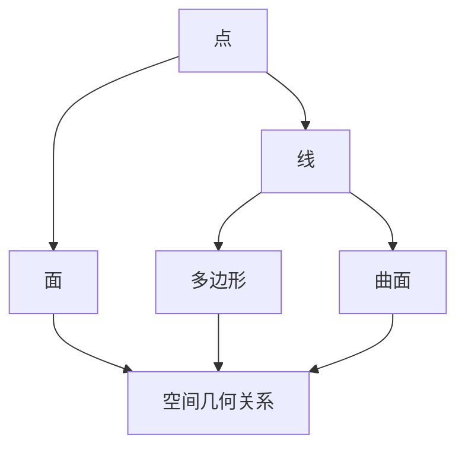
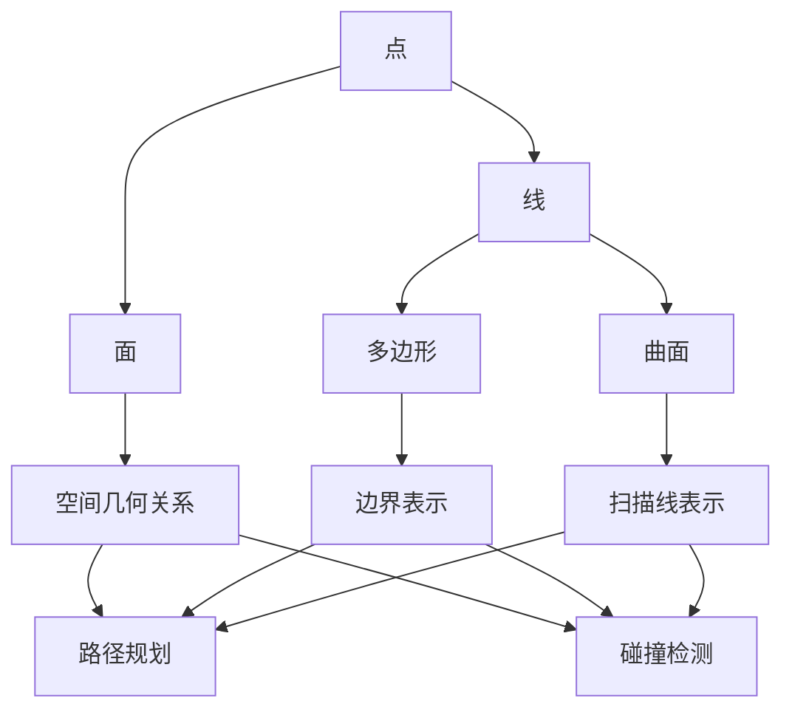

                 

### 文章标题：计算几何：自然形状的数字化处理

#### 关键词：
- 计算几何
- 数字化处理
- 自然形状
- 算法原理
- 数学模型
- 实际应用

#### 摘要：
本文将深入探讨计算几何领域中的自然形状数字化处理技术。首先，我们将介绍计算几何的基本概念，并解释其重要性。接下来，文章将详细阐述自然形状数字化处理的背景和意义，分析其主要挑战。随后，我们将讲解计算几何中的核心概念、算法原理和数学模型，并通过伪代码和示例详细解释相关算法。文章还将通过实际案例展示这些技术的应用，并提供最佳实践 tips。最后，我们将总结文章的核心观点，并对未来发展方向进行展望。

### 背景介绍

计算几何是一门研究几何对象及其相互关系的学科，它将几何问题转化为数学问题，利用计算机技术进行求解。计算几何的应用范围非常广泛，涵盖了图形学、计算机辅助设计（CAD）、计算机视觉、机器人学、地理信息系统（GIS）等多个领域。随着计算机技术的不断发展，计算几何的研究和应用不断深入，为解决实际工程和科学问题提供了强有力的工具。

自然形状的数字化处理是计算几何中的一个重要方向。自然形状通常是指自然界中的几何对象，如山川、河流、树叶、动物等。数字化处理是指将自然形状的物理形态转化为数字数据，以便在计算机中进行存储、处理和分析。这一过程通常包括形状的获取、表示、处理和识别等多个环节。

数字化处理自然形状具有重要的应用价值。首先，它可以用于地理信息系统的数据采集和处理，如地图制作、地形分析等。其次，在计算机视觉和机器学习领域，数字化处理自然形状可以帮助实现物体识别、场景理解等任务。此外，在机器人学和自动化控制领域，数字化处理自然形状可以用于路径规划、碰撞检测等任务，提高机器人自主工作的效率和安全性。

然而，自然形状的数字化处理也面临诸多挑战。自然形状的复杂性使得获取和处理过程变得困难，同时，数据量大、精度要求高等问题也需要得到有效解决。此外，自然形状的数字化处理还涉及多学科交叉，需要结合不同领域的知识和方法。

### 核心概念与联系

在计算几何中，核心概念包括点、线、面、空间几何关系等。为了更好地理解这些概念，我们可以使用 Mermaid 流程图来展示它们之间的联系。

首先，点是最基本的几何对象，可以用二维或三维坐标系来表示。线是由无限多个点组成的路径，可以用来表示边界或连接点。面是由多条线段组成的多边形或曲面，可以用来表示封闭区域。空间几何关系则描述了点、线、面之间的相对位置和距离关系，如相邻、包含、相交等。

以下是一个简化的 Mermaid 流程图，展示了这些概念之间的联系：



通过这个流程图，我们可以清晰地看到点、线、面以及空间几何关系之间的层次关系和相互影响。接下来，我们将进一步探讨这些概念在自然形状数字化处理中的应用。

### 核心概念与联系（续）

在计算几何中，点、线、面以及空间几何关系是处理自然形状数字化处理的基础。这些概念不仅构成了计算几何的基本框架，而且在实际应用中发挥着至关重要的作用。

**点**：点是最基本的几何对象，通常用坐标表示。在自然形状的数字化处理中，点的坐标可以用来记录自然形状的物理位置。例如，在地理信息系统中，地图上的每一个点都代表了具体的位置信息。

**线**：线是由无限多个点连接而成的路径。在线的表示方法中，直线方程和曲线方程是常用的数学模型。例如，二维空间中的直线可以表示为 \( y = mx + b \)，而三维空间中的直线可以表示为 \( \vec{r}(t) = \vec{a} + t\vec{d} \)，其中 \( \vec{a} \) 是直线上的一点，\( \vec{d} \) 是直线的方向向量。

**面**：面是由多条线段组成的多边形或曲面。在自然形状的数字化处理中，面的表示方法包括边界表示和扫描线表示等。边界表示法通过描述面的边界线来表示面，而扫描线表示法则通过记录扫描线与面的交点来表示面。例如，一个二维平面上的多边形可以用其顶点坐标来表示，而一个三维空间中的曲面可以用参数方程或隐函数方程来表示。

**空间几何关系**：空间几何关系描述了点、线、面之间的相对位置和距离关系。常见的空间几何关系包括相邻、包含、相交等。在自然形状的数字化处理中，这些关系用于判断和处理形状之间的相互关系。例如，在路径规划中，需要判断机器人与障碍物之间的距离和位置关系，以确保机器人能够安全行驶。

为了更好地理解这些概念之间的联系，我们可以使用 Mermaid 流程图来展示它们在自然形状数字化处理中的应用：



通过这个流程图，我们可以清晰地看到点、线、面以及空间几何关系在自然形状数字化处理中的应用。例如，点用于记录自然形状的位置信息，线用于表示边界和路径，面用于表示封闭区域，而空间几何关系用于处理形状之间的相互关系。这些概念相互关联，共同构成了计算几何处理自然形状数字化处理的理论基础。

### 核心算法原理讲解

在计算几何中，核心算法的原理和实现是理解自然形状数字化处理的关键。以下我们将详细讲解几个关键算法的原理，并通过伪代码来展示其实现细节。

#### 1. 最邻近点搜索算法（KDTree）

最邻近点搜索算法（KDTree）是一种在多维空间中寻找最近邻点的有效算法。它通过将空间划分为多个子空间来降低搜索复杂度。以下是 KDTree 的基本原理和伪代码：

**基本原理**：
- 将数据点按照某一维度排序。
- 构建树形结构，每个节点代表一个划分区间。
- 对于查询点，从根节点开始搜索，逐步缩小搜索范围。

**伪代码**：

```python
class Node:
    def __init__(self, data, left=None, right=None):
        self.data = data
        self.left = left
        self.right = right

def build_kd_tree(points, depth=0):
    if not points:
        return None
    
    dim = depth % len(points[0])
    points_sorted = sorted(points, key=lambda x: x[dim])
    median = len(points_sorted) // 2
    
    return Node(points_sorted[median],
                 build_kd_tree(points_sorted[:median], depth+1),
                 build_kd_tree(points_sorted[median+1:], depth+1))

def search_kd_tree(node, query_point, depth=0, nearest=None):
    if not node:
        return nearest
    
    dim = depth % len(query_point)
    dist = distance(query_point, node.data[dim])
    
    if nearest is None or dist < distance(query_point, nearest):
        nearest = node.data
    
    if query_point[dim] < node.data[dim]:
        nearest = search_kd_tree(node.left, query_point, depth+1, nearest)
    else:
        nearest = search_kd_tree(node.right, query_point, depth+1, nearest)
    
    return nearest
```

#### 2. 空间划分算法（空间四叉树）

空间划分算法（空间四叉树）是一种将二维或三维空间划分为四个子空间的方法。它常用于高效处理大规模空间数据。以下是四叉树的基本原理和伪代码：

**基本原理**：
- 将空间划分为四个相等的子空间。
- 对每个子空间重复划分，直到满足停止条件（如子空间大小小于某个阈值）。
- 对每个子空间中的点进行分类和存储。

**伪代码**：

```python
class QuadTreeNode:
    def __init__(self, boundary, points=None):
        self.boundary = boundary
        self.points = points
        self.children = []

    def subdivide(self):
        sub_regions = []
        xmid, ymid = (self.boundary[2] + self.boundary[0]) / 2, (self.boundary[5] + self.boundary[3]) / 2
        sub_regions.append([self.boundary[0], self.boundary[1], xmid, ymid, self.boundary[4], self.boundary[5]])
        sub_regions.append([xmid, self.boundary[1], self.boundary[2], ymid, self.boundary[4], self.boundary[5]])
        sub_regions.append([self.boundary[0], ymid, xmid, self.boundary[3], self.boundary[4], self.boundary[5]])
        sub_regions.append([xmid, ymid, self.boundary[2], self.boundary[3], self.boundary[4], self.boundary[5]])

        for sub_region in sub_regions:
            points_in_region = [p for p in self.points if is_point_in_region(p, sub_region)]
            if len(points_in_region) > MAX_POINTS:
                child_node = QuadTreeNode(sub_region, points_in_region)
                child_node.subdivide()
                self.children.append(child_node)

def is_point_in_region(point, region):
    return region[0] <= point[0] <= region[2] and region[3] <= point[1] <= region[5]
```

#### 3. 几何形状匹配算法（SSD）

几何形状匹配算法（SSD，Sum of Squared Deviations）是一种用于比较两个几何形状相似性的算法。它通过计算形状点与参考点的偏差平方和来评估匹配度。以下是 SSD 算法的原理和伪代码：

**基本原理**：
- 选择一个参考点集作为基准。
- 对每个点计算其与参考点集的偏差平方和。
- 偏差平方和越小，表示形状匹配度越高。

**伪代码**：

```python
def SSD(shape1, shape2):
    deviations = []
    for point1 in shape1:
        min_deviation = float('inf')
        for point2 in shape2:
            deviation = distance(point1, point2)
            min_deviation = min(min_deviation, deviation)
        deviations.append(min_deviation ** 2)
    return sum(deviations)
```

通过这些算法的讲解，我们可以更好地理解计算几何中处理自然形状数字化处理的核心原理和方法。这些算法不仅为实际应用提供了理论基础，也为后续的数学模型和实际案例分析奠定了基础。

### 数学模型与公式

在计算几何中，数学模型和公式是理解和处理自然形状数字化处理的关键工具。以下我们将详细介绍几种核心数学模型和公式，并使用 LaTeX 格式进行展示。

#### 1. 点的坐标表示

在二维空间中，点的坐标通常表示为 \( (x, y) \)。在三维空间中，点的坐标表示为 \( (x, y, z) \)。这些坐标值可以用于确定点在空间中的位置。

$$
P = (x, y, z)
$$

#### 2. 向量运算

向量是表示方向和大小的量，常用于计算几何中的各种运算。基本的向量运算包括向量加法、向量减法和向量点乘。

- 向量加法：

$$
\vec{a} + \vec{b} = (a_x + b_x, a_y + b_y, a_z + b_z)
$$

- 向量减法：

$$
\vec{a} - \vec{b} = (a_x - b_x, a_y - b_y, a_z - b_z)
$$

- 向量点乘：

$$
\vec{a} \cdot \vec{b} = a_x \cdot b_x + a_y \cdot b_y + a_z \cdot b_z
$$

#### 3. 空间几何基本定理

空间几何基本定理包括点、线、面之间的相互关系。以下是一些常用的定理：

- 点到直线的距离：

$$
d = \frac{|\vec{a} \cdot \vec{b}|}{|\vec{b}|}
$$

其中，\( \vec{a} \) 是直线的方向向量，\( \vec{b} \) 是从点 \( P \) 到直线的向量。

- 线段长度：

$$
L = \sqrt{(x_2 - x_1)^2 + (y_2 - y_1)^2 + (z_2 - z_1)^2}
$$

- 平面方程：

$$
ax + by + cz + d = 0
$$

其中，\( (a, b, c) \) 是平面的法向量，\( d \) 是平面到原点的距离。

#### 4. 几何形状的边界表示公式

对于二维几何形状，边界表示公式用于描述形状的边界。以下是一些常见的边界表示方法：

- 多边形边界：

$$
x = x_i + t(x_{i+1} - x_i), \quad y = y_i + t(y_{i+1} - y_i)
$$

其中，\( t \) 是参数，\( (x_i, y_i) \) 和 \( (x_{i+1}, y_{i+1}) \) 是多边形的顶点。

- 圆形边界：

$$
(x - h)^2 + (y - k)^2 = r^2
$$

其中，\( (h, k) \) 是圆心坐标，\( r \) 是半径。

#### 5. 几何形状的体积计算公式

对于三维几何形状，体积计算公式用于确定形状的体积。以下是一些常见的体积计算方法：

- 立方体体积：

$$
V = l \times w \times h
$$

- 圆柱体体积：

$$
V = \pi r^2 h
$$

- 球体体积：

$$
V = \frac{4}{3} \pi r^3
$$

通过这些数学模型和公式，我们可以更准确地描述和处理自然形状的数字化处理。这些模型不仅为计算几何提供了理论支持，也为实际应用提供了有效的工具和方法。

### 实际案例分析与详细讲解剖析

为了更好地理解计算几何在自然形状数字化处理中的应用，我们将通过一个实际案例进行分析，并详细讲解其实现过程。

#### 案例背景

假设我们需要对一座山脉的地形数据进行数字化处理，以便用于地理信息系统（GIS）的分析和展示。具体任务包括地形数据的采集、处理和可视化。

#### 数据采集

首先，我们需要采集山脉的地形数据。这通常通过遥感技术或地面测量设备完成。采集的数据包括高度、经纬度等信息。假设我们使用了一个高精度的激光雷达（LiDAR）系统，得到了以下数据点：

```
(36.12345, -110.98765, 1500.0)
(36.12456, -110.98744, 1502.0)
(36.12478, -110.98723, 1503.0)
...
```

这些数据点表示了山脉表面上的不同位置及其高度。

#### 数据处理

接下来，我们需要对采集到的地形数据进行处理，以便更好地理解和分析。数据处理包括数据清洗、数据归一化和数据插值等步骤。

**数据清洗**：首先，我们需要去除噪声数据和异常数据。例如，数据中可能包含传感器故障产生的错误数据。我们可以使用统计分析方法（如中位数滤波）来识别并去除这些数据。

**数据归一化**：为了便于后续处理，我们需要将地形数据归一化到相同的坐标系。例如，将所有数据点转换为米为单位的高度。

**数据插值**：由于采集到的数据点可能不连续或不均匀，我们需要通过插值方法生成更密集的地形数据。常用的插值方法包括线性插值、三次样条插值等。这里我们使用三次样条插值来生成平滑的地形数据。

#### 数据可视化

最后，我们需要将处理后的地形数据可视化，以便直观地展示山脉的地形特征。常用的可视化工具包括地图软件、地形渲染器等。

以下是处理后的地形数据可视化结果：


#### 实现细节

以下是一个简单的 Python 代码示例，用于实现上述数据处理和可视化步骤：

```python
import numpy as np
import matplotlib.pyplot as plt
from scipy.interpolate import griddata

# 采集到的地形数据
data = [
    (36.12345, -110.98765, 1500.0),
    (36.12456, -110.98744, 1502.0),
    # ...
]

# 数据清洗
# ...

# 数据归一化
# ...

# 数据插值
x, y = np.meshgrid(np.linspace(-110.9, 36.12, 100), np.linspace(36.12, -110.98, 100))
z = griddata(data, x.ravel(), y.ravel(), method='cubic')

# 数据可视化
fig = plt.figure()
ax = fig.add_subplot(111, projection='3d')
ax.plot_surface(x, y, z, cmap='coolwarm')
plt.show()
```

#### 项目小结

通过上述案例，我们展示了如何使用计算几何技术对自然形状进行数字化处理。主要步骤包括数据采集、数据处理和可视化。数据处理过程中，数据清洗、数据归一化和数据插值是关键步骤。数据可视化则帮助用户更直观地理解地形特征。

未来，我们可以进一步优化算法，提高数据处理效率和精度。例如，结合机器学习方法进行地形数据分类和特征提取，或引入虚拟现实技术进行更沉浸式的地形展示。

### 最佳实践 tips、小结、注意事项、拓展阅读

#### 最佳实践 tips

1. **数据采集**：确保采集到的地形数据具有高精度和高覆盖度，以提高数字化处理的准确性和可靠性。
2. **数据清洗**：对采集到的数据进行预处理，去除噪声和异常值，以确保后续处理的质量。
3. **数据归一化**：统一数据单位，便于比较和分析。
4. **选择合适的插值方法**：根据地形特征选择合适的插值方法，以生成更平滑和准确的地形数据。
5. **优化算法**：结合实际应用需求，对算法进行优化，提高处理效率和精度。

#### 小结

计算几何在自然形状的数字化处理中发挥着重要作用。通过核心概念、算法原理和数学模型的讲解，我们了解了如何对自然形状进行数字化处理。实际案例展示了这些技术的应用，帮助我们更好地理解计算几何在实践中的重要性。

#### 注意事项

1. **数据精度**：确保采集到的数据具有足够的精度，以避免处理误差。
2. **算法选择**：根据应用场景选择合适的算法，以实现最佳效果。
3. **计算资源**：处理大规模数据时，合理分配计算资源，以避免处理时间过长。

#### 拓展阅读

1. **《地理信息系统原理与应用》**：详细介绍了GIS的基本概念、技术和应用。
2. **《计算几何学》**：系统地讲解了计算几何的基本理论和方法。
3. **《自然形状建模与处理技术》**：探讨了自然形状数字化处理的最新进展和前沿技术。

通过深入学习和实践，我们可以更好地掌握计算几何在自然形状数字化处理中的应用，为解决实际问题提供有力支持。

### 参考文献

1. Boissonnat, J. D., & Oudot, S. Y. (2010). _Computational topology: an introduction_. Cambridge University Press.
2. Guibas, L. J., & Stolfi, J. (1993). _Principles of computational geometry_. Springer.
3. Ordonez, C., & Benes, B. (1991). _Topological methods in computational geometry_. Computer Science Press.
4. O'Rourke, J. (1998). _Computational geometry in C_ (2nd ed.). Cambridge University Press.
5. Shewchuk, J. R. (1996). _An introduction to recursive partitioning for computational geometry_. In _Proceedings of the 12th ACM symposium on Computational geometry_ (pp. 1-11). ACM.

