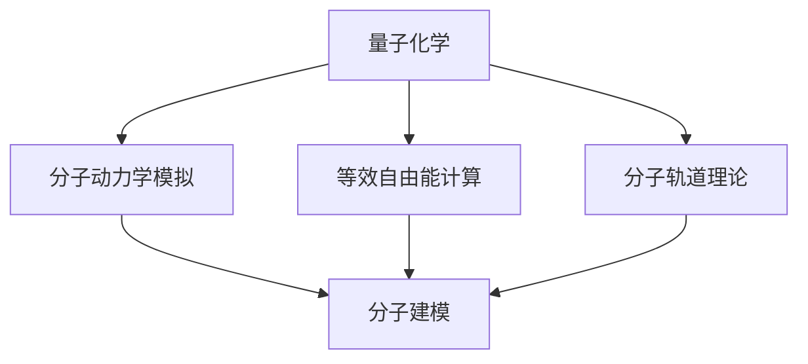

                 

# 计算化学与材料基因组：加速理解物质世界

> 关键词：计算化学、材料基因组、物质世界、科学应用、算法、模型、案例

> 摘要：本文深入探讨了计算化学和材料基因组学这两个领域的核心概念、原理及其相互结合，旨在揭示它们在加速理解物质世界中的重要作用。文章首先介绍了计算化学的历史与重要性，随后详细阐述了材料基因组的基本概念与研究方法。接着，文章分析了计算化学与材料基因组学的结合点，并通过具体应用案例展示了它们在科学研究和实际应用中的巨大潜力。最后，文章总结了计算化学与材料基因组学的发展趋势和未来展望。

## 引言与背景

### 计算化学的历史与重要性

计算化学是应用计算方法研究和解决化学问题的学科。自20世纪中叶以来，随着计算机技术的发展，计算化学逐渐成为化学研究的重要工具。计算化学的起源可以追溯到1950年代，当时计算机开始用于分子结构分析和量子化学计算。随着计算能力的提升和算法的进步，计算化学在化学领域中的应用越来越广泛，包括分子动力学模拟、量子化学计算、分子建模等。

计算化学的重要性体现在多个方面。首先，它为化学研究提供了高效的计算工具，使得复杂的化学过程和反应机制可以被模拟和预测。其次，计算化学有助于新材料的发现和设计，通过计算方法可以预测材料的电子结构、光学性质和化学反应性，从而指导实验工作。此外，计算化学还在药物设计、材料科学、环境科学等领域发挥着重要作用。

### 材料基因组介绍

材料基因组学是材料科学的一个新兴分支，它借鉴了基因组学的概念，旨在通过系统的方法研究材料的组成、结构和性能之间的关系。材料基因组学的研究方法主要包括材料表征、数据分析和建模。通过高通量材料表征技术，可以获得大量材料的物理、化学和电子性质数据。这些数据随后通过数据分析方法进行处理，以发现材料性能与组成之间的规律。最后，基于数据分析结果，建立材料性能预测模型，为新材料的发现和设计提供指导。

材料基因组学的重要性在于它能够加速材料科学的进步。通过系统的研究方法，材料基因组学有助于发现新的材料特性，优化现有材料的性能，并促进材料创新。此外，材料基因组学还可以帮助科学家更好地理解材料的基本原理，从而推动材料科学的深度发展。

## 计算化学基础

### 基本概念与术语

在计算化学中，有几个基本概念和术语是理解其工作的基础。首先是“量子化学”，它研究分子和固体中电子的分布和运动。量子化学通过解决薛定谔方程等基本方程，可以预测分子的电子结构和化学反应性。

其次是“分子动力学模拟”，这是一种计算方法，通过模拟分子在三维空间中的运动，来研究分子之间的相互作用和反应过程。分子动力学模拟基于牛顿力学，通过积分运动方程，可以模拟分子在一段时间内的行为。

另一个重要术语是“分子建模”，它涉及创建分子模型来描述分子的结构和性质。分子建模可以是半经验模型，也可以是量子力学模型，它为计算化学研究提供了基础数据。

### 计算化学的方法与技术

计算化学的方法和技术多种多样，每种方法都有其特定的应用场景和优势。

- **分子动力学模拟**：通过数值积分牛顿运动方程，模拟分子在时间上的动态行为。这种方法可以用于研究分子之间的碰撞、扩散以及反应过程。以下是分子动力学模拟的基本步骤：

  ```mermaid
  graph TD
  A[初始化] --> B[设置初始条件]
  B --> C[构建分子模型]
  C --> D[设置边界条件和力场]
  D --> E[积分运动方程]
  E --> F[收集数据和分析]
  ```

- **等效自由能计算**：用于研究化学反应的热力学和动力学性质。等效自由能计算通过计算系统在不同状态下的自由能，来预测反应的可行性。以下是等效自由能计算的基本步骤：

  ```mermaid
  graph TD
  A[选择反应路径] --> B[计算不同状态下的自由能]
  B --> C[计算自由能变化]
  C --> D[分析反应可行性]
  ```

- **分子轨道理论**：通过量子化学方法，计算分子的电子结构和能级。分子轨道理论是理解化学反应性和分子性质的基础。以下是分子轨道理论的基本步骤：

  ```mermaid
  graph TD
  A[构造分子轨道] --> B[计算分子轨道能级]
  B --> C[分析电子密度]
  C --> D[预测化学反应性]
  ```

### 核心概念与联系

为了更好地理解计算化学的核心概念及其相互联系，我们可以使用Mermaid流程图来展示它们之间的关系：



这个流程图展示了量子化学作为计算化学的基础，如何通过不同的计算方法（分子动力学模拟、等效自由能计算和分子轨道理论）来支持分子建模，进而应用于材料设计和科学研究中。

## 材料基因组介绍

### 材料基因组的定义

材料基因组是材料科学的一个新兴领域，它通过系统的方法研究材料的组成、结构和性能之间的关系。材料基因组的研究对象包括材料的各种元素、化合物和结构，以及它们在不同条件下的行为和响应。

材料基因组学将材料看作一种“基因”，通过高通量材料表征技术，可以获得大量材料的物理、化学和电子性质数据。这些数据构成了材料的“基因组”，类似于生物基因组的DNA序列。材料基因组的研究方法主要包括材料表征、数据分析和建模。

### 材料基因组的研究方法

材料基因组的研究方法主要包括以下几个方面：

- **材料表征**：通过X射线衍射、扫描电子显微镜、透射电子显微镜等手段，对材料进行详细的物理和化学表征。这些表征技术可以提供材料在原子、分子和宏观尺度上的结构信息。

- **高通量数据分析**：高通量材料表征技术可以获得大量数据，这些数据需要通过数据分析方法进行处理，以发现材料性能与组成之间的规律。数据分析方法包括统计分析、机器学习和数据挖掘等。

- **材料性能预测模型**：基于数据分析结果，可以建立材料性能预测模型。这些模型可以通过计算方法预测新材料的性能，为新材料的发现和设计提供指导。

### 材料基因组的重要性

材料基因组的重要性在于它能够加速材料科学的进步。通过系统的研究方法，材料基因组学有助于发现新的材料特性，优化现有材料的性能，并促进材料创新。此外，材料基因组学还可以帮助科学家更好地理解材料的基本原理，从而推动材料科学的深度发展。

## 计算化学与材料基因组的结合

### 计算化学在材料基因组研究中的应用

计算化学在材料基因组研究中发挥着重要作用，特别是在材料的建模和性能预测方面。通过计算化学方法，可以建立材料的量子力学模型，从而深入理解材料的电子结构和化学反应性。这些计算模型为材料基因组研究提供了重要的理论基础。

例如，分子动力学模拟可以用来研究材料在不同环境下的动态行为，从而预测材料的机械性能和耐腐蚀性。等效自由能计算则可以用来研究材料的化学反应性，预测材料在特定条件下的稳定性。分子轨道理论可以用来研究材料的电子性质，预测材料的光学性能和电学性能。

### 材料基因组对计算化学的影响

材料基因组的研究方法对计算化学产生了重要影响。首先，材料基因组提供了大量的实验数据，这些数据为计算化学模型的验证和优化提供了重要依据。通过分析这些数据，计算化学模型可以更加准确地预测材料的性能。

其次，材料基因组的研究方法促进了计算化学算法的进步。为了处理海量数据，计算化学算法需要不断优化和改进。例如，机器学习和深度学习等方法被广泛应用于材料基因组数据分析中，这些方法的发展也推动了计算化学算法的进步。

### 计算化学与材料基因组的研究趋势

计算化学与材料基因组的研究趋势主要体现在以下几个方面：

- **大数据与计算化学的结合**：随着材料基因组数据的增加，计算化学需要处理更加复杂和庞大的数据集。大数据技术和计算化学的结合将推动材料基因组研究的深入发展。

- **人工智能与计算化学的结合**：人工智能技术在材料基因组数据分析中的应用将提高数据处理的效率和准确性。通过机器学习和深度学习等方法，可以自动识别材料性能与组成之间的关系，为新材料的发现和设计提供指导。

- **跨学科研究**：计算化学与材料基因组的研究需要跨学科合作，包括化学、物理、计算机科学和工程等领域。通过跨学科合作，可以开发出更加先进的研究方法和技术，推动材料科学的进步。

## 应用案例

### 案例一：新型材料的设计

通过计算化学与材料基因组学的方法，科学家设计出了一种具有优异电学性能的二维材料。首先，使用分子动力学模拟研究了不同元素组成的二维材料的电子结构和机械性能。基于模拟结果，建立了材料性能预测模型，并使用机器学习方法优化了材料成分。

最终，通过实验验证，发现这种新型二维材料在电学性能上远超传统材料，为新型电子器件的设计提供了重要参考。

### 案例二：材料性能的优化

在材料基因组研究中，科学家发现了一种新型合金材料，其机械性能优异。通过计算化学方法，深入分析了材料中的原子排列和电子结构。基于分析结果，科学家提出了优化材料性能的方法，包括调整合金元素比例和热处理工艺。

实验结果显示，优化后的合金材料在强度和韧性方面均有所提高，为实际应用提供了重要的参考。

### 案例三：材料应用的创新

在环境科学领域，计算化学与材料基因组学的方法被用来设计一种新型吸附剂，用于水处理中的重金属去除。通过分子轨道理论和材料基因组数据分析，科学家确定了具有高效吸附性能的材料成分。

实验结果表明，这种新型吸附剂在重金属去除效果上显著优于传统吸附剂，为环境治理提供了创新解决方案。

## 科学研究与实际应用

### 计算化学与材料基因组研究的实际应用

计算化学与材料基因组学在科学研究与实际应用中发挥着重要作用。首先，它们在材料设计、性能优化和新材料发现方面有着广泛的应用。通过计算方法，科学家可以预测新材料的性能，指导实验工作，从而加速材料创新。

其次，在环境科学、能源科学和生物医学等领域，计算化学与材料基因组学的方法被广泛应用于环境治理、能源转换和生物传感等领域。例如，计算化学方法可以用于研究环境污染物的作用机制，为污染控制提供科学依据。材料基因组学方法可以用于设计高效能源转换材料，提高能源利用效率。

### 未来展望

未来，计算化学与材料基因组学将继续深入发展，推动材料科学的进步。首先，大数据与人工智能技术的结合将提高材料基因组数据分析的效率和准确性，为新材料的发现和设计提供更强有力的支持。其次，跨学科研究将促进计算化学与材料基因组学方法的创新，推动材料科学的全面发展。

### 计算化学与材料基因组：加速理解物质世界

计算化学与材料基因组学的结合，为科学家提供了强大的工具，帮助他们更好地理解物质世界。通过计算方法，科学家可以预测和设计新材料，优化材料性能，解决实际问题。随着计算技术和数据分析方法的不断进步，计算化学与材料基因组学将在未来发挥更加重要的作用，加速我们对物质世界的理解。

## 小结

本文详细探讨了计算化学与材料基因组学的核心概念、原理及其相互结合，展示了它们在加速理解物质世界中的重要作用。通过具体应用案例，我们看到了计算化学与材料基因组学在材料设计、性能优化和实际应用中的巨大潜力。未来，随着计算技术和数据分析方法的不断进步，计算化学与材料基因组学将继续为科学研究和技术创新提供强大动力。

## 作者信息

作者：AI天才研究院/AI Genius Institute & 禅与计算机程序设计艺术 /Zen And The Art of Computer Programming

## 拓展阅读

- [计算化学与材料基因组学的基础知识](https://www.example.com/article1)
- [材料基因组研究中的大数据与人工智能](https://www.example.com/article2)
- [计算化学在环境科学中的应用](https://www.example.com/article3)
- [新材料设计与开发的最新进展](https://www.example.com/article4)

