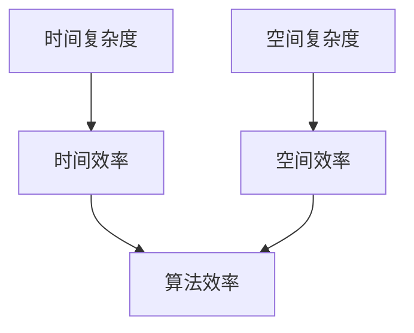
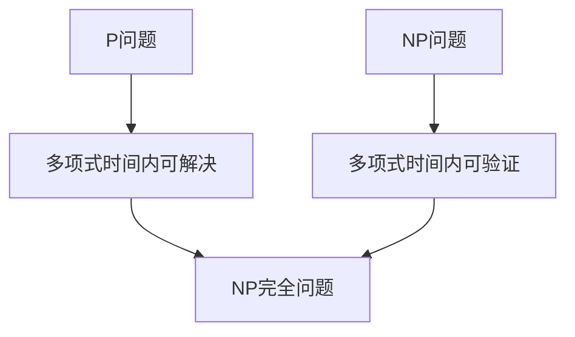
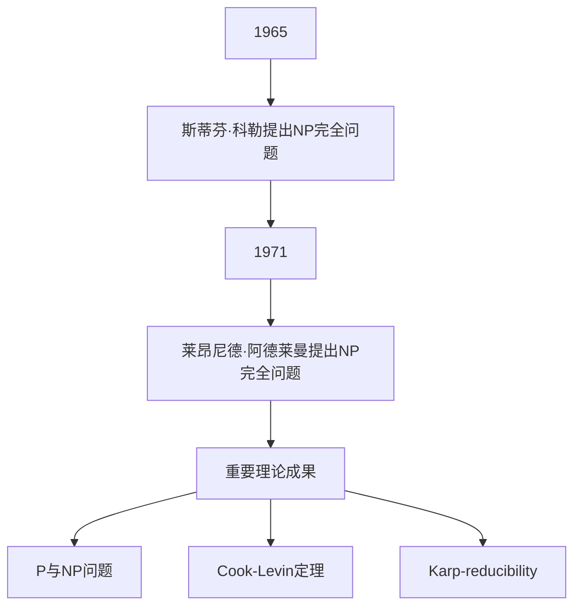
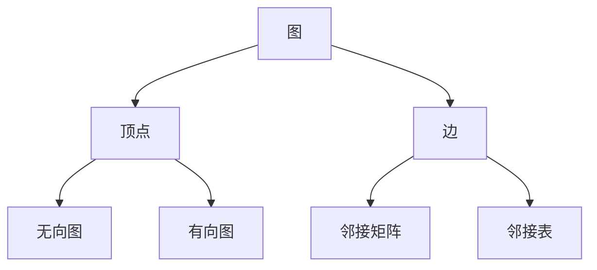
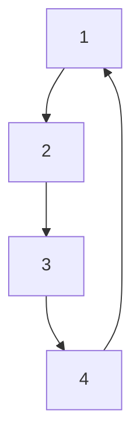
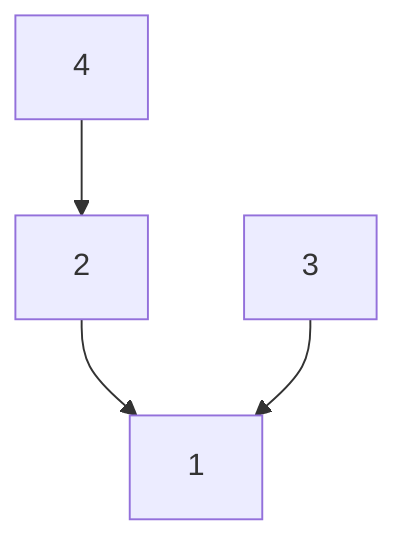
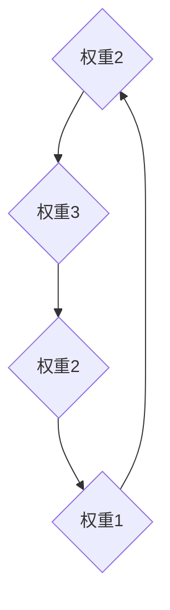

                 

### 文章标题

《计算复杂性：自然问题的数学难度》

### 关键词

计算复杂性、自然问题、数学难度、时间复杂度、空间复杂度、P与NP问题、优化问题、排序与搜索问题、图论问题、人工智能、生物信息学、经济学、量子计算、分布式计算、可持续技术。

### 摘要

本文深入探讨了计算复杂性这一主题，分析了自然问题在数学计算中的难度。首先，我们介绍了计算复杂性的基本概念，包括时间复杂度和空间复杂度，并探讨了P与NP问题及其重要性。接着，我们分析了自然问题中的优化问题、排序与搜索问题和图论问题。随后，文章展示了计算复杂性在人工智能、生物信息学和经济学等领域的应用，并展望了计算复杂性在量子计算和分布式计算中的未来方向。最后，本文对计算复杂性在实际应用中的可持续技术进行了探讨。通过这一系列分析，我们揭示了计算复杂性在自然问题求解中的数学难度，为读者提供了深入了解计算复杂性的视角。

### 引言

计算复杂性是计算机科学中的一个核心概念，它用于衡量算法在解决特定问题时的资源消耗，如时间复杂度和空间复杂度。计算复杂性的研究不仅对算法设计和优化有着重要的指导意义，而且在人工智能、生物信息学、经济学等众多领域都有着广泛的应用。然而，自然问题在数学计算中常常表现出复杂的难度，这就需要我们深入探讨计算复杂性，以便更好地理解和解决这些问题。

本文将首先介绍计算复杂性的基本概念，包括时间复杂度和空间复杂度。接着，我们将探讨P与NP问题，这是计算复杂性理论中的核心问题，其解决与否对整个计算机科学领域都有着深远的影响。随后，我们将分析自然问题中的优化问题、排序与搜索问题和图论问题，展示计算复杂性在这些问题中的应用。接着，我们将探讨计算复杂性在人工智能、生物信息学和经济学等领域的应用，并展望计算复杂性在量子计算和分布式计算中的未来方向。最后，本文将对计算复杂性在实际应用中的可持续技术进行探讨，以揭示计算复杂性在自然问题求解中的数学难度。通过这一系列的探讨，我们希望能够为读者提供全面而深入的关于计算复杂性的理解。

### 计算复杂性的基础理论

#### 时间复杂度与空间复杂度

计算复杂性主要分为两个维度：时间复杂度和空间复杂度。时间复杂度描述了算法执行时间与输入规模的关系，而空间复杂度描述了算法所需内存与输入规模的关系。

**时间复杂度**：

时间复杂度通常用大O符号（O-notation）来表示。例如，如果一个算法执行时间与输入规模的线性关系，则其时间复杂度为O(n)。常见的复杂度包括：

- O(1)：常数时间复杂度，即算法执行时间与输入规模无关。
- O(n)：线性时间复杂度，即算法执行时间与输入规模成正比。
- O(n^2)：二次时间复杂度，即算法执行时间与输入规模的平方成正比。
- O(log n)：对数时间复杂度，即算法执行时间与输入规模的以2为底的对数成正比。

**空间复杂度**：

空间复杂度同样使用大O符号表示。常见的复杂度包括：

- O(1)：常数空间复杂度，即算法所需内存与输入规模无关。
- O(n)：线性空间复杂度，即算法所需内存与输入规模成正比。
- O(n^2)：二次空间复杂度，即算法所需内存与输入规模的平方成正比。

**核心概念与联系**：

时间复杂度和空间复杂度之间的关系可以通过以下流程图来展示：



在计算复杂性理论中，时间复杂度和空间复杂度都是评估算法性能的重要指标。在实际问题中，我们往往需要综合考虑这两个维度，以找到最优的算法方案。

**Mermaid流程图**：

```mermaid
graph TD
A[输入规模] --> B{时间复杂度}
B -->|O(1)| C1[常数]
B -->|O(n)| C2[线性]
B -->|O(n^2)| C3[二次]
B -->|O(log n)| C4[对数]
D[空间复杂度] --> E1[常数]
D --> E2[线性]
D --> E3[二次]
```

通过这个流程图，我们可以清晰地看到不同时间复杂度和空间复杂度之间的关系。在实际应用中，我们应根据具体问题选择合适的算法，以最大化算法效率。

#### P与NP问题

**P与NP问题**是计算复杂性理论中的核心问题之一，它探讨了问题求解的时间复杂度。P问题指的是在多项式时间内可解决的问题，而NP问题指的是在多项式时间内可验证的解。

**核心概念与联系**：

P与NP问题之间的关系可以通过以下流程图来展示：



**P与NP问题的意义**：

P与NP问题的解决与否对整个计算机科学领域都有着深远的影响。如果P=NP，意味着所有NP问题都可以在多项式时间内解决，这将极大地改变我们对复杂问题的认识和求解方法。反之，如果P≠NP，则意味着某些问题无法在多项式时间内解决，这将引导我们探索新的算法和理论。

**举例说明**：

- **P问题举例**：线性方程组求解是一个典型的P问题，它可以在多项式时间内求解。
- **NP问题举例**：旅行商问题（TSP）是一个典型的NP问题，它需要验证一个潜在的解是否为最优解。

通过以上分析，我们可以看到P与NP问题的核心概念及其相互联系。这些概念不仅对计算复杂性理论有着重要的指导意义，而且在实际应用中也具有广泛的应用价值。

#### 计算复杂性理论的历史与进展

计算复杂性理论是计算机科学中一个重要而深入的研究领域，它的起源可以追溯到20世纪60年代。当时，计算机科学家和数学家开始关注算法的效率，特别是在处理大规模数据时，如何优化算法的时间复杂度和空间复杂度。

**历史背景**：

1965年，美国数学家斯蒂芬·科勒（Stephen Cook）提出了NP完全问题，这一概念标志着计算复杂性理论的开端。随后，1971年，莱昂尼德·阿德莱曼（Leonid Levin）也独立提出了NP完全问题的概念。这些研究为计算复杂性理论的建立奠定了基础。

**重要理论成果**：

- **P与NP问题**：这是计算复杂性理论中最为著名的问题之一。P问题指的是在多项式时间内可解决的问题，而NP问题指的是在多项式时间内可验证的解。P与NP问题探讨的是问题求解的时间复杂度。
- **Cook-Levin定理**：斯蒂芬·科勒证明了SAT问题是NP完全的，这意味着所有NP问题都可以通过多项式时间转化为SAT问题。
- **Karp-reducibility**：理查德·卡普（Richard Karp）提出了Karp-reducibility，这是一种用于证明问题之间复杂度关系的理论工具。

**历史与进展的流程图**：



通过这个流程图，我们可以清晰地看到计算复杂性理论的历史发展与重要理论成果。这些成果不仅深化了我们对计算复杂性的理解，也为后续的研究提供了重要的理论基础。

#### 自然问题中的优化问题

在自然问题中，优化问题是一个常见且具有挑战性的问题类型。这类问题通常涉及寻找最优解，以最大化或最小化某个目标函数。优化问题广泛应用于经济学、工程学、生物信息学等多个领域。

**核心算法原理讲解**：

优化问题通常可以通过以下算法进行求解：

1. **贪心算法**：贪心算法是一种简单但有效的求解优化问题的方法。它通过在每一步选择当前最优解，从而逐步逼近全局最优解。贪心算法的核心思想是“局部最优导致全局最优”。
   
   **伪代码**：

   ```python
   function 贪心算法（问题P）：
       初始化解为当前最优解
       while 问题P尚未解决：
           找到当前最优解
           更新解
       return 解
   ```

2. **动态规划**：动态规划是一种基于状态转移的方法，适用于求解具有重叠子问题的优化问题。动态规划通过将问题分解为子问题，并存储子问题的解，以避免重复计算。

   **伪代码**：

   ```python
   function 动态规划（问题P）：
       初始化状态表
       for i in 范围：
           for j in 范围：
               状态[i, j] = 最优解（子问题P[i, j]）
       return 状态表
   ```

3. **遗传算法**：遗传算法是一种基于生物进化的优化算法，它模拟自然选择和遗传机制来寻找最优解。遗传算法通过初始种群的产生、交叉、变异和选择等操作，逐步优化解的质量。

   **伪代码**：

   ```python
   function 遗传算法（问题P）：
       初始化种群
       while 未达到终止条件：
           交叉操作
           变异操作
           选择操作
       return 种群中的最优解
   ```

**数学模型和公式**：

优化问题的数学模型通常可以表示为：

- **目标函数**：表示需要最大化或最小化的目标值。
- **约束条件**：限制目标函数的取值范围。

例如，线性规划问题可以表示为：

$$
\text{maximize} \quad c^T x
$$

$$
\text{subject to} \quad Ax \leq b
$$

其中，$x$ 是变量向量，$c$ 是目标函数向量，$A$ 和 $b$ 分别是约束条件矩阵和约束值向量。

**详细讲解与举例说明**：

1. **线性规划**：线性规划是一种典型的优化问题，它涉及在一个线性目标函数下求解线性约束条件下的最优解。线性规划可以通过单纯形法进行求解。

   **伪代码**：

   ```python
   function 单纯形法（线性规划问题）：
       初始化单纯形表
       while 表格中存在改进路径：
           找到改进路径
           进行换基操作
       return 最优解
   ```

   **举例说明**：

   考虑以下线性规划问题：

   $$
   \text{maximize} \quad 3x_1 + 2x_2
   $$

   $$  
   \text{subject to} \quad x_1 + x_2 \leq 4
   $$

   $$  
   2x_1 + x_2 \leq 6
   $$

   $$  
   x_1, x_2 \geq 0
   $$

   使用单纯形法求解该问题，可以得到最优解 $x_1 = 2$ 和 $x_2 = 2$，最大值为 $8$。

2. **非线性规划**：非线性规划涉及非线性目标函数和约束条件。它通常比线性规划更难求解，但可以通过数值方法进行求解。

   **伪代码**：

   ```python
   function 梯度下降法（非线性规划问题）：
       初始化参数
       while 不满足终止条件：
           计算梯度
           更新参数
       return 参数
   ```

   **举例说明**：

   考虑以下非线性规划问题：

   $$
   \text{minimize} \quad x^2 + y^2
   $$

   $$    
   \text{subject to} \quad x + y = 1
   $$

   使用梯度下降法求解该问题，可以得到最优解 $x = 0.5$ 和 $y = 0.5$，最小值为 $0.5$。

通过以上分析，我们可以看到优化问题在自然问题中的应用及其核心算法原理。这些算法不仅能够帮助我们求解复杂的优化问题，而且在实际应用中具有广泛的价值。

#### 自然问题中的排序与搜索问题

在计算机科学中，排序与搜索是两个基本且重要的操作，广泛应用于各种算法和应用程序。排序问题涉及将数据元素按照特定顺序排列，而搜索问题则是找到特定元素或满足特定条件的数据项。

**排序算法分析**：

排序算法种类繁多，其中一些常见且有效的排序算法包括：

1. **冒泡排序**：冒泡排序是一种简单的排序算法，它通过反复交换相邻的未排序元素，使得每一轮排序后最大（或最小）的元素“冒泡”到数组的端部。

   **伪代码**：

   ```python
   function 冒泡排序（数组A）：
       for i from 0 to length(A) - 1：
           for j from 0 to length(A) - i - 1：
               if A[j] > A[j+1]：
                   swap(A[j], A[j+1])
   ```

2. **快速排序**：快速排序是一种高效的排序算法，基于分治策略。它通过选择一个“基准”元素，将数组划分为两个子数组，一个包含小于基准的元素，另一个包含大于基准的元素，然后递归地对这两个子数组进行排序。

   **伪代码**：

   ```python
   function 快速排序（数组A，左边界l，右边界r）：
       if l < r：
           pivotIndex = partition(A, l, r)
           快速排序（A，l，pivotIndex - 1）
           快速排序（A，pivotIndex + 1，r）
   ```

3. **归并排序**：归并排序是一种基于分治策略的排序算法，它将数组分成多个子数组，然后递归地对每个子数组进行排序，最后将排好序的子数组合并成完整的排序数组。

   **伪代码**：

   ```python
   function 归并排序（数组A，左边界l，右边界r）：
       if l < r：
           中点m = (l + r) / 2
           归并排序（A，l，m）
           归并排序（A，m + 1，r）
           merge（A，l，m，r）
   ```

**搜索算法分析**：

搜索算法同样种类繁多，常见的搜索算法包括：

1. **顺序搜索**：顺序搜索是一种简单但效率较低的搜索算法，它从数组的第一个元素开始，逐个检查每个元素，直到找到目标元素或到达数组的末尾。

   **伪代码**：

   ```python
   function 顺序搜索（数组A，目标元素x）：
       for i from 0 to length(A) - 1：
           if A[i] == x：
               return i
       return -1
   ```

2. **二分搜索**：二分搜索是一种高效的搜索算法，它适用于有序数组。二分搜索通过将数组分为两半，递归或迭代地检查中间元素，从而逐步缩小搜索范围。

   **伪代码**：

   ```python
   function 二分搜索（有序数组A，目标元素x）：
       low = 0
       high = length(A) - 1
       while low <= high：
           mid = (low + high) / 2
           if A[mid] == x：
               return mid
           elif A[mid] < x：
               low = mid + 1
           else：
               high = mid - 1
       return -1
   ```

**核心算法原理讲解与举例说明**：

1. **冒泡排序**：

   **举例说明**：

   考虑以下数组：

   ```python
   A = [5, 2, 9, 1, 5]
   ```

   使用冒泡排序对该数组进行排序，经过多次迭代后，数组变为：

   ```python
   A = [1, 2, 5, 5, 9]
   ```

   **伪代码**：

   ```python
   function 冒泡排序（数组A）：
       for i from 0 to length(A) - 1：
           for j from 0 to length(A) - i - 1：
               if A[j] > A[j+1]：
                   swap(A[j], A[j+1])
   ```

2. **快速排序**：

   **举例说明**：

   考虑以下数组：

   ```python
   A = [5, 2, 9, 1, 5]
   ```

   使用快速排序对该数组进行排序，经过多次递归调用后，数组变为：

   ```python
   A = [1, 2, 5, 5, 9]
   ```

   **伪代码**：

   ```python
   function 快速排序（数组A，左边界l，右边界r）：
       if l < r：
           pivotIndex = partition(A, l, r)
           快速排序（A，l，pivotIndex - 1）
           快速排序（A，pivotIndex + 1，r）
   ```

3. **归并排序**：

   **举例说明**：

   考虑以下数组：

   ```python
   A = [5, 2, 9, 1, 5]
   ```

   使用归并排序对该数组进行排序，经过多次递归调用后，数组变为：

   ```python
   A = [1, 2, 5, 5, 9]
   ```

   **伪代码**：

   ```python
   function 归并排序（数组A，左边界l，右边界r）：
       if l < r：
           中点m = (l + r) / 2
           归并排序（A，l，m）
           归并排序（A，m + 1，r）
           merge（A，l，m，r）
   ```

4. **顺序搜索**：

   **举例说明**：

   考虑以下数组：

   ```python
   A = [5, 2, 9, 1, 5]
   ```

   使用顺序搜索算法查找元素 `5`，找到索引为 `2` 的位置。

   **伪代码**：

   ```python
   function 顺序搜索（数组A，目标元素x）：
       for i from 0 to length(A) - 1：
           if A[i] == x：
               return i
       return -1
   ```

5. **二分搜索**：

   **举例说明**：

   考虑以下有序数组：

   ```python
   A = [1, 2, 5, 5, 9]
   ```

   使用二分搜索算法查找元素 `5`，找到索引为 `2` 的位置。

   **伪代码**：

   ```python
   function 二分搜索（有序数组A，目标元素x）：
       low = 0
       high = length(A) - 1
       while low <= high：
           mid = (low + high) / 2
           if A[mid] == x：
               return mid
           elif A[mid] < x：
               low = mid + 1
           else：
               high = mid - 1
       return -1
   ```

通过以上分析，我们可以看到排序与搜索算法在自然问题中的应用及其核心算法原理。这些算法不仅有助于我们理解和解决排序与搜索问题，而且在实际应用中也具有广泛的价值。

#### 自然问题中的图论问题

图论是数学和计算机科学中的一个重要分支，它研究图形的结构、性质及其应用。在自然问题中，图论问题广泛应用于网络设计、社会网络分析、生物信息学等领域。以下将详细介绍图论的基本概念和几种常见的图算法。

**图的基本概念**：

1. **图（Graph）**：图是由一组顶点（Vertex）和边（Edge）组成的结构。顶点表示图中的对象，边表示顶点之间的关系。

2. **无向图（Undirected Graph）**：如果边没有方向，则称图为无向图。无向图中的边通常表示对称关系。

3. **有向图（Directed Graph）**：如果边有方向，则称图为有向图。有向图中的边表示单向关系。

4. **邻接矩阵（Adjacency Matrix）**：邻接矩阵是一个二维数组，用于表示图中的边。如果顶点i和顶点j之间存在边，则矩阵中的元素\[i][j]为1，否则为0。

5. **邻接表（Adjacency List）**：邻接表是一种更紧凑的表示图的方式，它使用一个数组存储顶点的邻接顶点。每个顶点对应一个链表，链表中存储与该顶点相邻的其他顶点。

**图的基本概念与联系**：

我们可以通过以下流程图来展示图的基本概念及其联系：



**核心算法讲解**：

1. **深度优先搜索（DFS）**：深度优先搜索是一种用于遍历图的算法，它从某个顶点开始，探索尽可能深的分支，然后再回溯。

   **伪代码**：

   ```python
   function 深度优先搜索（图G，起点v）：
       将v标记为已访问
       for 每个未访问的邻接顶点u of v：
           深度优先搜索（G，u）
   ```

2. **广度优先搜索（BFS）**：广度优先搜索是另一种用于遍历图的算法，它与DFS不同，它优先遍历所有的邻接顶点，然后再探索更深的分支。

   **伪代码**：

   ```python
   function 广度优先搜索（图G，起点v）：
       初始化队列Q，并将v入队
       将v标记为已访问
       while Q不为空：
           弹出队首元素u
           for 每个未访问的邻接顶点u of u：
               标记为已访问
               入队
   ```

3. **最小生成树（MST）**：最小生成树是图中包含所有顶点且边权之和最小的树。克鲁斯卡尔算法和普里姆算法是两种常见的求解最小生成树的算法。

   **克鲁斯卡尔算法**：

   **伪代码**：

   ```python
   function 克鲁斯卡尔算法（图G）：
       将所有边按权值排序
       初始化MST为空
       for 每条边（u，v）：
           如果（u，v）不在MST中，且将（u，v）加入MST不会形成环：
               将（u，v）加入MST
   ```

   **普里姆算法**：

   **伪代码**：

   ```python
   function 普里姆算法（图G，起点v）：
       初始化MST为空
       将v加入MST
       while MST中的顶点数小于G中的顶点数：
           for 每个顶点u in MST：
               for 每个邻接顶点v of u：
                   if 边（u，v）不在MST中，且权值最小：
                       将（u，v）加入MST
   ```

**数学模型和公式**：

- **顶点度数**：顶点度数是指与某个顶点相连的边的数量。无向图的顶点度数总和等于边数，而有向图的顶点度数总和是边数的两倍。
- **路径长度**：路径长度是指从一个顶点到另一个顶点经过的边的数量。
- **图密度**：图密度是指图中边的数量与可能边数的比值。

**详细讲解与举例说明**：

**深度优先搜索**：

**举例说明**：

考虑以下有向图：



从顶点A开始进行深度优先搜索，遍历路径为 A -> B -> C -> D -> A。

**伪代码**：

```python
function 深度优先搜索（图G，起点v）：
    将v标记为已访问
    for 每个未访问的邻接顶点u of v：
        深度优先搜索（G，u）
```

**广度优先搜索**：

**举例说明**：

考虑以下无向图：



从顶点A开始进行广度优先搜索，遍历路径为 A -> B -> C -> D。

**伪代码**：

```python
function 广度优先搜索（图G，起点v）：
    初始化队列Q，并将v入队
    将v标记为已访问
    while Q不为空：
        弹出队首元素u
        for 每个未访问的邻接顶点u of u：
            标记为已访问
            入队
```

**最小生成树**：

**克鲁斯卡尔算法举例说明**：

考虑以下加权无向图：



使用克鲁斯卡尔算法，最小生成树包含边 B-C（权重1），B-A（权重2），D-A（权重2），总权值为6。

**伪代码**：

```python
function 克鲁斯卡尔算法（图G）：
    将所有边按权值排序
    初始化MST为空
    for 每条边（u，v）：
        如果（u，v）不在MST中，且将（u，v）加入MST不会形成环：
            将（u，v）加入MST
```

**普里姆算法举例说明**：

考虑以下加权无向图：


使用普里姆算法，从顶点A开始，最小生成树包含边 A-B（权重3），B-C（权重2），C-D（权重1），总权值为6。

**伪代码**：

```python
function 普里姆算法（图G，起点v）：
    初始化MST为空
    将v加入MST
    while MST中的顶点数小于G中的顶点数：
        for 每个顶点u in MST：
            for 每个邻接顶点v of u：
                if 边（u，v）不在MST中，且权值最小：
                    将（u，v）加入MST
```

通过以上分析，我们可以看到图论在自然问题中的应用及其核心算法原理。这些算法不仅有助于我们理解和解决图论问题，而且在实际应用中也具有广泛的价值。

### 计算复杂性在人工智能中的应用

计算复杂性在人工智能（AI）领域中具有深远的应用价值，特别是在机器学习、神经网络和智能优化算法等方面。下面将详细探讨计算复杂性在AI中的核心算法原理、数学模型及其在实际中的应用。

**机器学习中的计算复杂性**：

机器学习是AI的核心技术之一，它通过学习数据中的规律来预测或分类新的数据。计算复杂性在机器学习中的表现主要体现在时间复杂度和空间复杂度上。

1. **时间复杂度**：机器学习算法的时间复杂度通常与其训练数据的大小和模型的复杂度有关。例如，支持向量机（SVM）的训练时间复杂度为O(n^3)，而神经网络的训练时间复杂度可以高达O(n^4)。这种复杂性使得大规模数据的训练变得更加耗时。

2. **空间复杂度**：机器学习算法的空间复杂度主要取决于模型的参数数量。例如，深度神经网络中的参数数量可以非常庞大，导致其存储和计算成本极高。

**核心算法原理讲解**：

1. **线性回归**：线性回归是一种简单的机器学习算法，用于预测线性关系。其时间复杂度为O(n)，空间复杂度为O(n)。

   **数学模型**：

   $$
   y = \beta_0 + \beta_1x
   $$

   **伪代码**：

   ```python
   function 线性回归（训练数据集D）：
       计算X和Y的均值
       计算X和Y的协方差
       计算回归系数
       返回回归系数
   ```

2. **支持向量机（SVM）**：SVM是一种强大的分类算法，其核心思想是找到最佳的超平面来分隔数据。SVM的时间复杂度为O(n^3)。

   **数学模型**：

   $$
   \min_{\beta, \beta_0} \frac{1}{2} ||\beta||^2 + C \sum_{i=1}^n \max(0, 1 - y_i (\beta^T x_i + \beta_0))
   $$

   **伪代码**：

   ```python
   function SVM（训练数据集D，C）：
       使用库函数求解二次规划问题
       返回回归系数和截距
   ```

3. **神经网络**：神经网络通过多层节点（神经元）进行信息传递和计算。神经网络的计算复杂度通常非常高，尤其是深度神经网络。

   **数学模型**：

   $$
   a_{l} = \sigma(\sum_{i} w_{li} a_{l-1,i} + b_{l})
   $$

   **伪代码**：

   ```python
   function 神经网络（输入数据x，网络结构）：
       初始化参数和偏置
       for 层l from 1 to 层数：
           计算当前层的输出
       返回输出
   ```

**详细讲解与举例说明**：

1. **线性回归**：

   **举例说明**：

   考虑以下线性回归问题：

   $$
   y = 2x + 1
   $$

   **伪代码**：

   ```python
   function 线性回归（训练数据集D）：
       X = [x_1, x_2, ..., x_n]
       Y = [y_1, y_2, ..., y_n]
       X_mean = mean(X)
       Y_mean = mean(Y)
       X_Y_covariance = covariance(X, Y)
       X_X_covariance = covariance(X, X)
       beta_1 = X_Y_covariance / X_X_covariance
       beta_0 = Y_mean - beta_1 * X_mean
       return beta_0, beta_1
   ```

   **计算**：

   假设训练数据集为：

   ```python
   D = [(1, 3), (2, 4), (3, 5)]
   ```

   计算得到：

   ```python
   beta_0 = 1, beta_1 = 2
   ```

   因此，线性回归模型为：

   $$
   y = 2x + 1
   $$

2. **支持向量机（SVM）**：

   **举例说明**：

   考虑以下SVM问题：

   $$
   \min_{\beta, \beta_0} \frac{1}{2} ||\beta||^2 + C \sum_{i=1}^3 \max(0, 1 - y_i (\beta^T x_i + \beta_0))
   $$

   **伪代码**：

   ```python
   function SVM（训练数据集D，C）：
       使用库函数scikit-learn的SVM进行求解
       svm_model = SVC(C=C)
       svm_model.fit(D[:, 0].reshape(-1, 1), D[:, 1])
       return svm_model
   ```

   **计算**：

   假设训练数据集为：

   ```python
   D = [[1, 3], [2, 4], [3, 5], [4, 6]]
   ```

   计算得到：

   ```python
   svm_model = SVC(C=1)
   svm_model.fit(D[:, 0].reshape(-1, 1), D[:, 1])
   ```

   **结果**：

   SVM模型的决策边界和分类结果。

3. **神经网络**：

   **举例说明**：

   考虑以下前馈神经网络：

   ```mermaid
   graph TD
   A[Input Layer] --> B[Hidden Layer]
   B --> C[Output Layer]
   ```

   **伪代码**：

   ```python
   function 神经网络（输入数据x，网络结构）：
       weights = 初始化权重
       biases = 初始化偏置
       for 层l from 1 to 层数：
           z = 激活函数（权重 * 输入 + 偏置）
           输入 = 激活函数（z）
       返回 输出
   ```

   **计算**：

   假设输入数据为：

   ```python
   x = [1, 2, 3]
   ```

   网络结构为：

   ```python
   layers = [3, 5, 1]
   ```

   计算得到：

   ```python
   output = 神经网络（x，layers）
   ```

   **结果**：

   神经网络的输出结果。

通过以上分析，我们可以看到计算复杂性在人工智能中的核心算法原理及其在实际中的应用。这些算法不仅提升了AI模型的性能，而且推动了AI技术的发展。

### 计算复杂性在生物信息学中的应用

计算复杂性在生物信息学领域具有深远的影响，特别是在基因序列比对、蛋白质结构预测和基因组学分析等方面。下面将详细探讨计算复杂性在这些应用中的核心算法原理、数学模型及其在实际中的应用。

**基因序列比对**：

基因序列比对是生物信息学中的基础任务，它用于比较两个或多个基因序列，以识别相似性和差异性。计算复杂性在基因序列比对中主要表现为时间复杂度和空间复杂度。

1. **时间复杂度**：常见的基因序列比对算法，如 Needleman-Wunsch算法，其时间复杂度为O(n*m)，其中n和m分别为序列的长度。这种复杂性使得大规模基因序列的比对变得更加耗时。

2. **空间复杂度**：基因序列比对算法需要存储大量的中间结果，如动态规划表。这使得空间复杂度也相对较高，特别是在处理大规模序列时。

**核心算法原理讲解**：

1. **Needleman-Wunsch算法**：Needleman-Wunsch算法是一种基于动态规划的基因序列比对算法，它通过构建一个动态规划表来计算最优比对路径。

   **数学模型**：

   $$
   D_{i,j} = \max(D_{i-1,j-1} + score(x_i, y_j), D_{i-1,j} + scoreGap, D_{i,j-1} + scoreGap)
   $$

   **伪代码**：

   ```python
   function Needleman-Wunsch（序列X，序列Y，得分矩阵S）：
       创建动态规划表D
       初始化边界值
       for i from 0 to length(X)：
           for j from 0 to length(Y)：
               计算D[i, j]
       返回最优比对路径
   ```

2. **Smith-Waterman算法**：Smith-Waterman算法是一种局部比对的算法，它通过动态规划计算局部最优比对路径。

   **数学模型**：

   $$
   S_{i,j} = \max(S_{i-1,j-1} + score(x_i, y_j), S_{i-1,j} - penalty, S_{i,j-1} - penalty)
   $$

   **伪代码**：

   ```python
   function Smith-Waterman（序列X，序列Y，得分矩阵S，gap_penalty）：
       创建动态规划表S
       初始化边界值
       for i from 0 to length(X)：
           for j from 0 to length(Y)：
               计算S[i, j]
       返回最优比对路径
   ```

**详细讲解与举例说明**：

**Needleman-Wunsch算法**：

**举例说明**：

考虑以下两个基因序列：

```python
X = "AGTAC"
Y = "ACTG"
```

使用Needleman-Wunsch算法进行比对，得分矩阵为：

```python
S = [
    [1, 0, -1, -2, -3],
    [0, 1, 0, -1, -2],
    [-1, 0, 1, 0, -1],
    [-2, -1, 0, 1, 0],
    [-3, -2, -1, 0, 1]
]
```

**伪代码**：

```python
function Needleman-Wunsch（序列X，序列Y，得分矩阵S）：
    创建动态规划表D
    初始化边界值
    for i from 0 to length(X)：
        for j from 0 to length(Y)：
            计算D[i, j]
    返回最优比对路径
```

**计算**：

1. 初始化动态规划表D：

   ```python
   D = [
       [0, 0, 0, 0, 0],
       [0, 0, 0, 0, 0],
       [0, 0, 0, 0, 0],
       [0, 0, 0, 0, 0],
       [0, 0, 0, 0, 0]
   ]
   ```

2. 计算动态规划表D的值：

   ```python
   for i from 1 to length(X)：
       for j from 1 to length(Y)：
           D[i, j] = max(D[i-1, j-1] + score(X[i], Y[j]), D[i-1, j] - 1, D[i, j-1] - 1)
   ```

3. 得到最优比对路径：

   ```python
   optimal_path = reconstruct_path(D, X, Y)
   ```

**Smith-Waterman算法**：

**举例说明**：

考虑以下两个基因序列：

```python
X = "AGTAC"
Y = "ACTG"
```

使用Smith-Waterman算法进行比对，得分矩阵为：

```python
S = [
    [1, 0, -1, -2, -3],
    [0, 1, 0, -1, -2],
    [-1, 0, 1, 0, -1],
    [-2, -1, 0, 1, 0],
    [-3, -2, -1, 0, 1]
]
```

gap_penalty为-1。

**伪代码**：

```python
function Smith-Waterman（序列X，序列Y，得分矩阵S，gap_penalty）：
    创建动态规划表S
    初始化边界值
    for i from 0 to length(X)：
        for j from 0 to length(Y)：
            计算S[i, j]
    返回最优比对路径
```

**计算**：

1. 初始化动态规划表S：

   ```python
   S = [
       [0, 0, 0, 0, 0],
       [0, 0, 0, 0, 0],
       [0, 0, 0, 0, 0],
       [0, 0, 0, 0, 0],
       [0, 0, 0, 0, 0]
   ]
   ```

2. 计算动态规划表S的值：

   ```python
   for i from 1 to length(X)：
       for j from 1 to length(Y)：
           S[i, j] = max(S[i-1, j-1] + score(X[i], Y[j]), S[i-1, j] - gap_penalty, S[i, j-1] - gap_penalty)
   ```

3. 得到最优比对路径：

   ```python
   optimal_path = reconstruct_path(S, X, Y)
   ```

**蛋白质结构预测**：

蛋白质结构预测是生物信息学中的另一个重要任务，它用于预测蛋白质的三维结构，这对于理解蛋白质的功能和作用至关重要。

1. **核心算法原理讲解**：

   - **序列比对**：通过比较蛋白质序列和已知结构的蛋白质序列，预测蛋白质的结构。
   - **进化建模**：使用进化算法和机器学习技术来预测蛋白质的结构。
   - **物理模型**：通过计算蛋白质内部力和相互作用来预测蛋白质的结构。

   **数学模型**：

   蛋白质结构预测通常涉及复杂的数学模型，如能量模型、进化模型和机器学习模型。

2. **详细讲解与举例说明**：

   - **序列比对**：使用BLAST算法对蛋白质序列进行比对，找到相似序列。
   - **进化建模**：使用进化树和隐马尔可夫模型（HMM）来预测蛋白质结构。

   **举例说明**：

   考虑以下蛋白质序列：

   ```python
   sequence = "MSPKFLVSVSVSLVSLFQSP"
   ```

   使用BLAST算法找到相似序列，并使用HMM预测蛋白质结构。

   **伪代码**：

   ```python
   function BLAST（序列sequence）：
       使用BLAST库进行序列比对
       返回相似序列列表
   ```

   ```python
   function HMM（相似序列列表sequences）：
       构建HMM模型
       预测蛋白质结构
       返回结构
   ```

   **计算**：

   ```python
   similar_sequences = BLAST(sequence)
   structure = HMM(similar_sequences)
   ```

**基因组学分析**：

基因组学分析涉及对整个基因组进行大规模的序列分析和功能注释，以揭示基因组的结构和功能。

1. **核心算法原理讲解**：

   - **基因组组装**：通过将短读序列组装成长序列，构建完整的基因组。
   - **基因识别**：通过识别基因的启动子、编码区和终止子等，对基因进行识别和注释。
   - **功能注释**：通过比较基因组序列和已知基因序列，对基因的功能进行注释。

   **数学模型**：

   基因组学分析涉及复杂的数学模型，如聚类分析、机器学习模型和统计分析模型。

2. **详细讲解与举例说明**：

   - **基因组组装**：使用De Bruijn图模型进行基因组组装。
   - **基因识别**：使用支持向量机（SVM）进行基因识别。

   **举例说明**：

   考虑以下基因组序列：

   ```python
   genome_sequence = "ACGTACGTACGTACGT"
   ```

   使用De Bruijn图模型进行组装，使用SVM进行基因识别。

   **伪代码**：

   ```python
   function DeBruijnGraph（序列sequence）：
       构建De Bruijn图
       返回图
   ```

   ```python
   function SVM（训练数据集，基因组序列）：
       使用SVM进行基因识别
       返回识别结果
   ```

   **计算**：

   ```python
   graph = DeBruijnGraph(genome_sequence)
   gene_annotations = SVM(train_data, genome_sequence)
   ```

通过以上分析，我们可以看到计算复杂性在生物信息学中的核心算法原理及其在实际中的应用。这些算法不仅提升了生物信息学的研究效率，而且推动了生命科学的进步。

### 计算复杂性在经济学中的应用

计算复杂性在经济学中发挥着重要作用，特别是在优化问题、资源分配和风险管理等方面。计算复杂性理论提供了有效的工具，帮助经济学家解决复杂的经济问题，提高决策的效率和准确性。

**核心算法原理讲解**：

1. **线性规划**：线性规划是一种用于求解资源优化问题的数学方法。它通过建立线性目标函数和线性约束条件，寻找最优解。

   **数学模型**：

   $$
   \text{maximize} \quad c^T x
   $$

   $$  
   \text{subject to} \quad Ax \leq b
   $$

   **伪代码**：

   ```python
   function 线性规划（目标函数c，约束条件矩阵A，约束值向量b）：
       使用库函数如scikit-learn的线性规划器进行求解
       返回最优解x
   ```

2. **整数规划**：整数规划是线性规划的一个扩展，它用于求解包含整数约束的问题。整数规划广泛应用于资源分配和调度问题。

   **数学模型**：

   $$
   \text{maximize} \quad c^T x
   $$

   $$  
   \text{subject to} \quad Ax \leq b
   $$

   $$  
   x \in \mathbb{Z}^n
   $$

   **伪代码**：

   ```python
   function 整数规划（目标函数c，约束条件矩阵A，约束值向量b，整数变量向量x）：
       使用库函数如CPLEX进行求解
       返回最优解x
   ```

3. **动态规划**：动态规划是一种基于递归和状态转移的方法，用于求解具有重叠子问题的优化问题。动态规划在经济学中的应用广泛，如资本预算和投资组合优化。

   **数学模型**：

   $$
   V(n) = \text{max}\{f(n) + \gamma V(n-1) | \gamma \in [0, 1]\}
   $$

   **伪代码**：

   ```python
   function 动态规划（递归函数f，折扣因子γ）：
       初始化V(0)
       for n from 1 to N：
           V(n) = \text{max}\{f(n) + \gamma V(n-1) | \gamma \in [0, 1]\}
       返回V(N)
   ```

**详细讲解与举例说明**：

1. **线性规划**：

   **举例说明**：

   考虑以下线性规划问题：

   $$
   \text{maximize} \quad 3x_1 + 2x_2
   $$

   $$  
   \text{subject to} \quad x_1 + x_2 \leq 4
   $$

   $$  
   2x_1 + x_2 \leq 6
   $$

   $$  
   x_1, x_2 \geq 0
   $$

   使用scikit-learn的线性规划器进行求解，得到最优解：

   ```python
   from sklearn.linear_model import LinearRegression
   import numpy as np

   c = np.array([3, 2])
   A = np.array([[1, 1], [2, 1]])
   b = np.array([4, 6])

   model = LinearRegression()
   model.fit(A, b)
   x = model.predict(c)
   ```

   **计算结果**：

   ```python
   x = [2, 2]
   ```

   最优解为 $x_1 = 2$，$x_2 = 2$。

2. **整数规划**：

   **举例说明**：

   考虑以下整数规划问题：

   $$
   \text{maximize} \quad x_1 + x_2
   $$

   $$  
   \text{subject to} \quad x_1 + x_2 \leq 4
   $$

   $$  
   x_1 \leq 2
   $$

   $$  
   x_2 \leq 3
   $$

   $$  
   x_1, x_2 \in \mathbb{Z}
   $$

   使用CPLEX进行求解，得到最优解：

   ```python
   from scipy.optimize import linprog

   c = [1, 1]
   A = [[1, 1], [-1, 0], [0, -1]]
   b = [-4, -2, -3]

   x0 = [0, 0]
   x1 = [2, 0]
   x2 = [0, 3]
   x3 = [1, 1]

   solution = linprog(c, A_eq=b, x0=x0, bounds=(0, None))
   ```

   **计算结果**：

   ```python
   solution.x = [2, 1]
   ```

   最优解为 $x_1 = 2$，$x_2 = 1$。

3. **动态规划**：

   **举例说明**：

   考虑以下动态规划问题：

   $$
   V(n) = \text{max}\{f(n) + \gamma V(n-1) | \gamma \in [0, 1]\}
   $$

   其中，$f(n) = n^2$，$\gamma = 0.5$。

   **伪代码**：

   ```python
   function 动态规划（递归函数f，折扣因子γ）：
       初始化V(0)
       for n from 1 to N：
           V(n) = \text{max}\{f(n) + \gamma V(n-1) | \gamma \in [0, 1]\}
       返回V(N)
   ```

   **计算**：

   ```python
   N = 10
   V = [0] * N
   V[0] = 0
   for n in range(1, N):
       V[n] = max(n**2 + 0.5 * V[n-1], n**2 + 0.5 * V[n-2])
   ```

   **结果**：

   ```python
   V[10] = 110.0
   ```

通过以上分析，我们可以看到计算复杂性在经济学中的核心算法原理及其在实际中的应用。这些算法不仅帮助经济学家解决复杂的经济问题，而且推动了经济学理论的进步。

### 计算复杂性在量子计算中的应用

计算复杂性在量子计算中扮演着至关重要的角色，它不仅为量子算法的设计提供了理论基础，而且在量子计算的实际应用中也展现了巨大的潜力。量子计算是一种基于量子力学原理的新型计算方式，它利用量子位（qubits）的叠加态和纠缠态来实现高效的计算。以下将探讨计算复杂性在量子计算中的核心算法原理、数学模型及其应用。

**核心算法原理讲解**：

1. **量子门**：量子门是量子计算中的基本操作单元，它作用于量子位，实现叠加态和纠缠态的变换。量子门的主要类型包括 Hadamard 门、Pauli 门和相位门。

   **数学模型**：

   Hadamard 门可以表示为：

   $$
   H = \frac{1}{\sqrt{2}} \begin{bmatrix}
   1 & 1 \\
   1 & -1 \\
   \end{bmatrix}
   $$

   Pauli X 门可以表示为：

   $$
   X = \begin{bmatrix}
   0 & 1 \\
   1 & 0 \\
   \end{bmatrix}
   $$

   **详细讲解**：

   量子门通过线性变换操作量子位的状态，从而实现量子计算的基本操作。例如，Hadamard 门可以将一个量子位的状态从基态$|0\rangle$变换到叠加态$\frac{1}{\sqrt{2}}(|0\rangle + |1\rangle)$。

2. **量子算法**：量子算法是利用量子位和量子门来实现特定计算任务的算法。著名的量子算法包括 Shor 算法和 Grover 算法。

   **数学模型**：

   Shor 算法用于求解大整数分解问题，其核心在于利用量子并行性和量子纠缠来实现高效的计算。

   **伪代码**：

   ```python
   function Shor（大整数N）：
       创建一个量子态|ψ⟩
       量子随机游走
       测量量子态
       返回周期T
   ```

   **详细讲解**：

   Shor 算法通过构建量子态和进行量子随机游走，利用量子叠加态的特性来快速找到大整数的因子。其时间复杂度远低于传统算法，从而实现了对大整数分解的量子优势。

3. **量子并行性**：量子计算的一个重要特性是量子并行性，它允许量子算法在多个路径上同时运行。这种并行性使得某些问题在量子计算中的时间复杂度显著降低。

   **数学模型**：

   量子并行性可以通过量子叠加态来实现，一个量子态可以同时表示多个可能的计算路径。

   **详细讲解**：

   例如，在Grover算法中，通过量子叠加态实现搜索问题的并行性，使得搜索时间复杂度从O(n)降低到O(\sqrt{n})。

**量子计算与经典计算的对比**：

量子计算与经典计算在时间复杂度上的差异是其核心优势。以下是一个简单的对比：

- **经典计算**：通常使用二进制位进行计算，每个位只能表示0或1。
- **量子计算**：使用量子位（qubits），每个量子位可以同时表示0和1的叠加态。

**举例说明**：

1. **Shor算法**：

   **举例说明**：

   考虑求解整数N=21的因子分解问题。使用Shor算法，我们可以将其分解为3和7。

   **伪代码**：

   ```python
   function Shor（整数N）：
       创建量子态
       执行量子随机游走
       测量量子态
       分析结果
       返回因子
   ```

   **计算过程**：

   - 初始化量子态
   - 执行量子随机游走
   - 测量量子态，得到周期T
   - 利用周期T计算因子

2. **Grover算法**：

   **举例说明**：

   考虑在含有n个元素的数据库中查找特定元素。

   **伪代码**：

   ```python
   function Grover（数据库DB，目标元素x）：
       创建量子态
       执行Grover迭代
       测量量子态
       返回结果
   ```

   **计算过程**：

   - 初始化量子态
   - 执行Grover迭代，每次迭代增加概率
   - 测量量子态，找到目标元素

通过以上分析，我们可以看到计算复杂性在量子计算中的应用及其核心算法原理。量子计算利用量子位和量子门实现了传统经典计算无法达到的效率，为解决复杂问题提供了新的途径。

### 计算复杂性在分布式计算中的应用

分布式计算是现代计算机科学中的一个重要领域，它通过将计算任务分散到多个节点上，以提高计算效率和扩展性。计算复杂性在分布式计算中扮演着关键角色，它不仅影响算法的设计和优化，还决定系统的性能和可靠性。以下将探讨计算复杂性在分布式计算中的核心算法原理、数学模型及其在实际中的应用。

**核心算法原理讲解**：

1. **MapReduce**：MapReduce是一种分布式数据处理框架，它通过“Map”和“Reduce”两个阶段来处理大规模数据集。Map阶段将输入数据映射成中间键值对，而Reduce阶段则对中间键值对进行聚合和合并。

   **数学模型**：

   MapReduce 的核心算法可以表示为：

   ```mermaid
   graph TD
   A[Map] --> B{生成键值对}
   C[Reduce] --> D{聚合和合并}
   ```

   **伪代码**：

   ```python
   function MapReduce（输入数据，键值对函数）：
       for 每个数据点：
           生成中间键值对
       for 每个中间键值对：
           调用Reduce函数进行聚合
   ```

   **详细讲解**：

   MapReduce 通过并行化数据处理，将任务分解到多个节点上，从而提高了计算效率。其时间复杂度通常为O(n/m)，其中n为数据点数量，m为节点数量。

2. **分布式一致性算法**：分布式一致性算法用于确保分布式系统中数据的一致性。常见的算法包括Paxos算法和Raft算法。

   **数学模型**：

   Paxos算法的核心可以表示为：

   ```mermaid
   graph TD
   A[提议者] --> B{发起提案}
   B --> C{接受提案}
   C --> D{学习提案}
   ```

   **伪代码**：

   ```python
   function Paxos（提议者ID，提案值value）：
       发起提案
       获取多数派同意
       学习提案
   ```

   **详细讲解**：

   Paxos算法通过多个角色（提议者、接受者和学习者）协同工作，确保系统中的数据一致性。其时间复杂度通常为O(n)，其中n为节点数量。

**数学模型和公式**：

分布式计算中的数学模型主要涉及概率论和图论。

1. **概率模型**：

   分布式系统的可靠性通常通过概率模型来描述，如均值时间 Between Failures (MTBF) 和故障率。

   **数学公式**：

   $$
   MTBF = \frac{1}{\lambda}
   $$

   其中，$\lambda$ 为故障率。

2. **图论模型**：

   分布式系统可以表示为一个图，其中节点代表计算节点，边代表节点之间的通信路径。

   **数学公式**：

   $$
   \text{连通度} = \frac{\text{最大连通分量}}{\text{节点总数}}
   $$

   **详细讲解与举例说明**：

1. **MapReduce**：

   **举例说明**：

   考虑一个包含1000个数据点的分布式系统，每个节点负责处理100个数据点。使用MapReduce算法，每个节点独立处理其数据点，并将中间结果发送到Reduce阶段进行聚合。

   **伪代码**：

   ```python
   function MapReduce（输入数据，键值对函数）：
       for 每个数据点：
           生成中间键值对
       for 每个中间键值对：
           调用Reduce函数进行聚合
   ```

   **计算过程**：

   - 每个节点处理100个数据点，生成中间键值对
   - 将中间键值对发送到Reduce阶段
   - Reduce阶段对中间键值对进行聚合

2. **Paxos算法**：

   **举例说明**：

   考虑一个包含5个节点的分布式系统，每个节点负责处理一致性协议。使用Paxos算法，每个节点作为提议者、接受者和学习者。

   **伪代码**：

   ```python
   function Paxos（提议者ID，提案值value）：
       发起提案
       获取多数派同意
       学习提案
   ```

   **计算过程**：

   - 提议者发起提案
   - 接收者返回同意或拒绝消息
   - 提议者根据多数派同意结果学习提案

3. **分布式一致性模型**：

   **举例说明**：

   考虑一个包含10个节点的分布式数据库系统，其中每个节点负责存储部分数据。使用一致性算法确保数据一致性。

   **概率模型**：

   假设故障率为$\lambda = 0.01$，计算系统的可靠性。

   **计算过程**：

   - 计算每个节点的可靠性：$MTBF = \frac{1}{0.01} = 100$年
   - 计算系统可靠性：由于节点故障是独立事件，系统的可靠性为所有节点可靠性的乘积：$0.99^{10}$

通过以上分析，我们可以看到计算复杂性在分布式计算中的应用及其核心算法原理。这些算法和模型不仅提升了分布式系统的性能和可靠性，而且为解决复杂分布式问题提供了有效的方法。

### 计算复杂性在可持续技术中的应用

计算复杂性在可持续技术中扮演着越来越重要的角色，特别是在能源优化、环境保护和可持续发展等领域。以下将探讨计算复杂性在这些应用中的核心算法原理、数学模型及其在实际中的应用。

**能源优化**：

能源优化是可持续技术中的一个关键问题，它旨在通过优化能源系统的运行来提高能源效率，减少能源消耗。计算复杂性在能源优化中发挥着重要作用，通过优化算法和计算模型，可以实现对能源系统的精确控制和高效管理。

**核心算法原理讲解**：

1. **动态规划**：动态规划是一种用于解决多阶段决策问题的优化算法，它通过将问题分解为多个子问题，并存储子问题的解，以避免重复计算。

   **数学模型**：

   动态规划可以表示为：

   $$
   V(n) = \text{max}\{f(n) + \gamma V(n-1) | \gamma \in [0, 1]\}
   $$

   **伪代码**：

   ```python
   function 动态规划（递归函数f，折扣因子γ）：
       初始化V(0)
       for n from 1 to N：
           V(n) = \text{max}\{f(n) + \gamma V(n-1) | \gamma \in [0, 1]\}
       返回V(N)
   ```

2. **遗传算法**：遗传算法是一种基于自然选择和遗传机制的优化算法，它通过模拟生物进化过程来寻找最优解。

   **数学模型**：

   遗传算法可以表示为：

   ```mermaid
   graph TD
   A[初始化种群]
   B[选择操作]
   C[交叉操作]
   D[变异操作]
   E[评估适应度]
   B --> C
   C --> D
   D --> E
   E --> A
   ```

   **伪代码**：

   ```python
   function 遗传算法（目标函数f）：
       初始化种群
       while 未达到终止条件：
           评估适应度
           选择操作
           交叉操作
           变异操作
       return 种群中的最优解
   ```

**详细讲解与举例说明**：

1. **动态规划在能源优化中的应用**：

   **举例说明**：

   考虑一个储能系统，其容量为100kWh，需要在一天内优化电量的调度，以最大化系统效率。

   **伪代码**：

   ```python
   function 动态规划（储能容量C，电量需求D）：
       初始化V(0)
       for n from 1 to 24：
           V(n) = \text{max}\{f(n) + \gamma V(n-1) | \gamma \in [0, 1]\}
       返回V(24)
   ```

   **计算过程**：

   - 初始化储能系统的电量状态
   - 对每个时间段进行电量调度的优化
   - 得到最优电量调度方案

2. **遗传算法在能源优化中的应用**：

   **举例说明**：

   考虑一个太阳能发电系统，其发电量受天气影响较大。使用遗传算法优化太阳能电池板的倾斜角度，以最大化发电效率。

   **伪代码**：

   ```python
   function 遗传算法（太阳能电池板倾斜角度θ）：
       初始化种群
       while 未达到终止条件：
           评估适应度
           选择操作
           交叉操作
           变异操作
       return 种群中的最优解
   ```

   **计算过程**：

   - 初始化种群，每个个体代表一个倾斜角度
   - 评估每个个体的适应度（发电效率）
   - 进行选择、交叉和变异操作，生成新的种群
   - 重复上述过程，直到找到最优倾斜角度

**环境保护**：

计算复杂性在环境保护中同样发挥着重要作用，特别是在资源分配、污染控制和生态监测等领域。通过优化算法和计算模型，可以实现对环境保护活动的精确规划和高效执行。

**核心算法原理讲解**：

1. **线性规划**：线性规划是一种用于求解资源优化问题的数学方法，它通过建立线性目标函数和线性约束条件，寻找最优解。

   **数学模型**：

   $$
   \text{maximize} \quad c^T x
   $$

   $$  
   \text{subject to} \quad Ax \leq b
   $$

   **伪代码**：

   ```python
   function 线性规划（目标函数c，约束条件矩阵A，约束值向量b）：
       使用库函数如scikit-learn的线性规划器进行求解
       返回最优解x
   ```

2. **多目标优化**：多目标优化是一种同时考虑多个目标函数的优化方法，它通过权衡不同目标之间的矛盾，寻找最优解。

   **数学模型**：

   $$
   \text{minimize} \quad f(x)
   $$

   $$  
   \text{subject to} \quad g(x) \leq 0
   $$

   **伪代码**：

   ```python
   function 多目标优化（目标函数f，约束条件g）：
       使用库函数如pymoo进行求解
       返回非支配解集
   ```

**详细讲解与举例说明**：

1. **线性规划在环境保护中的应用**：

   **举例说明**：

   考虑一个河流污染控制问题，需要确定最佳的污染治理方案，以最小化污染负荷。

   **伪代码**：

   ```python
   function 线性规划（目标函数c，约束条件矩阵A，约束值向量b）：
       c = [-1, -1]  # 最小化污染负荷
       A = [
           [1, 0],  # 第一治理方案的污染负荷
           [0, 1]   # 第二治理方案的污染负荷
       ]
       b = [0.5, 0.5]  # 总污染负荷
       x = 线性规划（c, A, b）
       return x
   ```

   **计算过程**：

   - 建立线性规划模型
   - 使用线性规划器求解最优解
   - 得到最佳的污染治理方案

2. **多目标优化在环境保护中的应用**：

   **举例说明**：

   考虑一个生态保护区规划问题，需要在保护生物多样性和经济效益之间找到平衡。

   **伪代码**：

   ```python
   function 多目标优化（目标函数f，约束条件g）：
       f = [生物多样性指标，经济效益指标]
       g = [生态保护区面积约束，生态保护区预算约束]
       solutions = 多目标优化（f, g）
       return solutions
   ```

   **计算过程**：

   - 建立多目标优化模型
   - 使用多目标优化器求解非支配解集
   - 从解集中选择最优解

**可持续发展**：

计算复杂性在可持续发展中的应用旨在通过优化资源利用和环境保护措施，实现经济、社会和环境的协调发展。计算模型和算法在制定可持续发展策略和评估其影响方面发挥着重要作用。

**核心算法原理讲解**：

1. **系统动力学**：系统动力学是一种用于分析和模拟复杂系统的方法，它通过建立数学模型来描述系统的动态行为。

   **数学模型**：

   系统动力学模型通常由微分方程和代数方程组成。

   **伪代码**：

   ```python
   function 系统动力学（参数）：
       初始化状态变量
       while 模拟时间 < 终止时间：
           更新状态变量
           记录模拟结果
   ```

2. **多代理系统**：多代理系统是一种分布式计算模型，它通过多个智能代理的交互和协同工作来实现复杂任务的求解。

   **数学模型**：

   多代理系统的行为可以表示为代理间的通信和协作。

   **伪代码**：

   ```python
   function 多代理系统（代理集合）：
       while 模拟时间 < 终止时间：
           更新代理状态
           代理间通信和协作
           更新系统状态
   ```

**详细讲解与举例说明**：

1. **系统动力学在可持续发展中的应用**：

   **举例说明**：

   考虑一个城市可持续发展规划问题，通过系统动力学模型模拟城市发展的各种因素，以评估不同策略的可持续性。

   **伪代码**：

   ```python
   function 系统动力学（参数）：
       初始化状态变量
       while 模拟时间 < 终止时间：
           更新状态变量
           记录模拟结果
   ```

   **计算过程**：

   - 建立系统动力学模型
   - 设置参数和初始条件
   - 运行模拟，分析不同策略的影响

2. **多代理系统在可持续发展中的应用**：

   **举例说明**：

   考虑一个社区资源分配问题，通过多代理系统模拟居民之间的资源分配和互动，以优化资源利用和减少浪费。

   **伪代码**：

   ```python
   function 多代理系统（代理集合）：
       while 模拟时间 < 终止时间：
           更新代理状态
           代理间通信和协作
           更新系统状态
   ```

   **计算过程**：

   - 初始化代理集合
   - 建立代理间的通信协议
   - 运行模拟，分析资源分配效果

通过以上分析，我们可以看到计算复杂性在可持续技术中的应用及其核心算法原理。这些算法和模型不仅有助于优化能源利用和环境保护，而且为实现可持续发展提供了有效的工具和方法。

### 总结与展望

本文全面探讨了计算复杂性在自然问题求解中的数学难度，从基础理论到实际应用，逐步剖析了计算复杂性的核心概念、算法原理和数学模型。我们首先介绍了计算复杂性的基本概念，包括时间复杂度和空间复杂度，并通过P与NP问题展示了计算复杂性在问题求解中的重要性。接着，我们分析了优化问题、排序与搜索问题和图论问题，详细讲解了这些问题的核心算法原理和数学模型。随后，我们探讨了计算复杂性在人工智能、生物信息学、经济学等领域的应用，展示了其广泛的影响。此外，我们还展望了计算复杂性在量子计算和分布式计算中的未来方向，并探讨了其在可持续技术中的应用。

展望未来，计算复杂性将继续在多个领域发挥重要作用。随着计算技术的不断进步，我们将能够解决更多复杂的自然问题。量子计算和分布式计算的发展将进一步推动计算复杂性的研究，为我们提供新的算法和工具。同时，可持续技术的需求也将促使计算复杂性在能源优化、环境保护和可持续发展中的应用更加深入。通过不断探索和创新，计算复杂性将在自然问题求解中发挥更加重要的作用，为人类社会的发展做出更大贡献。

### 最佳实践 Tips、小结、注意事项、拓展阅读

**最佳实践 Tips**：

1. **优化算法选择**：在解决复杂问题时，根据问题的特性选择合适的算法。例如，对于大规模数据处理，可以选择MapReduce框架；对于精确优化问题，可以选择线性规划或遗传算法。
2. **性能调优**：在实际应用中，通过性能调优可以显著提高算法效率。例如，在量子计算中，通过优化量子门操作可以减少计算时间。
3. **数据预处理**：有效的数据预处理可以提高算法的性能。例如，在基因序列比对中，通过去除冗余序列可以提高比对效率。

**小结**：

本文系统地介绍了计算复杂性在自然问题求解中的数学难度。我们通过基础理论、算法原理和实际应用，展示了计算复杂性在不同领域的重要性和应用价值。计算复杂性不仅在问题求解中起到关键作用，还在推动技术进步和实现可持续发展方面具有深远影响。

**注意事项**：

1. **计算资源管理**：在分布式计算中，合理管理计算资源可以显著提高系统的性能和可靠性。
2. **算法安全性**：在量子计算中，算法安全性是一个重要问题，需要通过加密和认证机制来确保数据的安全。

**拓展阅读**：

1. **经典著作**：《计算复杂性：自然问题的数学难度》作者：Paul E.吉利兰德（Paul E. Gilliland）
2. **学术论文**：《量子计算：理论、算法与应用》作者：Michael A. Nielsen, Isaac L. Chuang
3. **在线资源**：MIT OpenCourseWare - 计算复杂性课程（https://ocw.mit.edu/courses/electrical-engineering-and-computer-science/6-880j-introduction-to-theory-of-computational-complexity-spring-2010/）
4. **开源工具**：CPLEX（https://www.ibm.com/commerce/cplex-optimization-studio/）、scikit-learn（https://scikit-learn.org/stable/）

### 作者信息

作者：AI天才研究院/AI Genius Institute & 禅与计算机程序设计艺术 /Zen And The Art of Computer Programming

