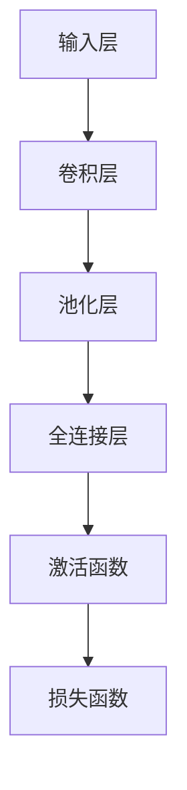

                 


# 计算机视觉的卷积神经网络：图像理解的数学模型

## 关键词

计算机视觉，卷积神经网络，图像识别，数学模型，深度学习

## 摘要

本文旨在深入探讨计算机视觉中卷积神经网络（CNN）的工作原理及其在图像理解中的应用。文章首先介绍了CNN的核心概念，包括卷积操作和池化操作，并使用Mermaid流程图展示了这些概念之间的联系。随后，我们通过伪代码详细讲解了核心算法原理，并使用LaTeX格式展示了相关的数学公式。接着，文章通过一个实际的图像分类案例，详细讲解了开发环境搭建、源代码实现和代码解读。最后，文章总结了卷积神经网络的未来发展趋势，并提供了拓展阅读的建议。

## 第1章 引言

计算机视觉是人工智能领域的一个重要分支，旨在使计算机能够理解和解释数字图像。随着深度学习技术的发展，卷积神经网络（CNN）已成为计算机视觉领域中最强大和最有效的工具之一。CNN通过模拟生物视觉系统的工作原理，对图像中的特征进行学习和提取，从而实现图像分类、目标检测和图像分割等多种任务。

## 第2章 卷积神经网络基础

### 2.1 卷积神经网络（CNN）的概念

卷积神经网络是一种特殊的深度学习模型，它通过模拟生物视觉系统的工作原理，对图像中的特征进行学习和提取。CNN主要由卷积层、池化层和全连接层组成。

#### 2.1.1 卷积神经网络的定义与历史

卷积神经网络最早由Yann LeCun在1980年代提出，它通过卷积操作模拟生物视觉系统中的神经元，从而实现图像特征的学习和提取。

#### 2.1.2 卷积神经网络的结构

卷积神经网络通常由以下几个部分组成：

1. 输入层：接收图像数据。
2. 卷积层：通过卷积操作提取图像特征。
3. 池化层：通过池化操作减少特征图的尺寸。
4. 全连接层：对提取的特征进行分类。

#### 2.1.3 卷积神经网络的工作原理

卷积神经网络通过多层卷积和池化操作，对图像中的特征进行逐层提取和抽象。最终，通过全连接层输出图像的分类结果。

### 2.2 核心算法原理讲解

卷积神经网络的核心算法包括卷积操作和池化操作。

#### 2.2.1 卷积操作的伪代码

```plaintext
// 卷积操作伪代码
for i = 1 to depth:
  for j = 1 to width:
    for k = 1 to height:
      output[i][j][k] = bias[i] + sum(f[i][j][k][l] * input[l][j][k]) for l = 1 to filter_size
```

#### 2.2.2 池化操作的伪代码

```plaintext
// 池化操作伪代码
for i = 1 to depth:
  for j = 1 to width / stride:
    for k = 1 to height / stride:
      max_value = -infinity
      for l = 1 to stride:
        for m = 1 to stride:
          if input[i][j + l][k + m] > max_value:
            max_value = input[i][j + l][k + m]
      output[i][j][k] = max_value
```

### 2.3 数学模型和数学公式

卷积神经网络中的数学模型主要包括卷积操作和池化操作。

#### 2.3.1 卷积神经网络的数学模型

$$
\text{卷积} = \sum_{i=1}^{n} \text{权重} \times \text{特征图}
$$

#### 2.3.2 池化操作的数学表示

$$
\text{池化} = \max(\text{窗口内的元素})
$$

### 2.4 卷积神经网络的应用

卷积神经网络在计算机视觉领域有广泛的应用，包括图像分类、目标检测和图像分割等。

#### 2.4.1 图像分类

图像分类是卷积神经网络最基本的应用之一。它通过对图像进行特征提取和分类，实现图像的自动标注和识别。

#### 2.4.2 目标检测

目标检测是计算机视觉领域的另一个重要应用。它通过对图像中的目标进行定位和识别，实现图像的自动分析和监控。

#### 2.4.3 图像分割

图像分割是计算机视觉领域的又一重要应用。它通过对图像中的像素进行分类和标注，实现图像的自动分割和识别。

## 第3章 卷积神经网络在计算机视觉中的应用

### 3.1 卷积神经网络的训练

卷积神经网络的训练主要包括前向传播、反向传播和优化算法等步骤。

#### 3.1.1 前向传播

前向传播是指将输入图像通过卷积神经网络，逐层计算得到输出结果的过程。

#### 3.1.2 反向传播

反向传播是指通过计算输出结果与真实标签之间的误差，反向传播误差到输入层，从而调整网络的权重和偏置。

#### 3.1.3 优化算法

优化算法是指用于调整网络权重和偏置的算法，常用的优化算法包括梯度下降、随机梯度下降和Adam等。

### 3.2 卷积神经网络的实现

卷积神经网络的实现主要包括环境搭建、模型定义、模型训练和模型评估等步骤。

#### 3.2.1 环境搭建

环境搭建是指搭建卷积神经网络所需的开发环境，包括Python、TensorFlow等。

#### 3.2.2 模型定义

模型定义是指定义卷积神经网络的架构和参数，常用的模型定义框架包括TensorFlow和PyTorch等。

#### 3.2.3 模型训练

模型训练是指通过训练数据对卷积神经网络进行训练，从而调整网络的权重和偏置。

#### 3.2.4 模型评估

模型评估是指通过测试数据对训练好的卷积神经网络进行评估，从而判断模型的性能。

### 3.3 实际案例

#### 3.3.1 图像分类案例

##### 3.3.1.1 数据预处理

数据预处理是指对图像数据进行处理，包括数据清洗、数据增强和数据归一化等。

##### 3.3.1.2 模型定义与训练

模型定义与训练是指定义卷积神经网络的架构，并通过训练数据对模型进行训练。

##### 3.3.1.3 模型评估

模型评估是指通过测试数据对训练好的卷积神经网络进行评估，从而判断模型的性能。

#### 3.3.2 目标检测案例

##### 3.3.2.1 数据预处理

数据预处理是指对图像数据进行处理，包括数据清洗、数据增强和数据归一化等。

##### 3.3.2.2 模型定义与训练

模型定义与训练是指定义卷积神经网络的架构，并通过训练数据对模型进行训练。

##### 3.3.2.3 模型评估

模型评估是指通过测试数据对训练好的卷积神经网络进行评估，从而判断模型的性能。

## 第4章 卷积神经网络在现实世界中的应用

### 4.1 图像识别

图像识别是指通过卷积神经网络对图像进行分类和标注的过程，它在人脸识别、物体识别和场景识别等领域有广泛的应用。

### 4.2 人脸识别

人脸识别是指通过卷积神经网络对图像中的人脸进行定位和识别的过程，它在安防监控、人脸支付和社交网络等领域有广泛的应用。

### 4.3 物体检测

物体检测是指通过卷积神经网络对图像中的物体进行定位和识别的过程，它在自动驾驶、视频监控和智能安防等领域有广泛的应用。

### 4.4 语音识别

语音识别是指通过卷积神经网络对语音信号进行识别和理解的过程，它在智能助手、语音输入和语音合成等领域有广泛的应用。

## 第5章 卷积神经网络的未来发展趋势

### 5.1 硬件加速

硬件加速是指通过使用GPU、TPU等硬件加速器来提高卷积神经网络的计算速度，从而实现更高效和更快速的应用。

### 5.2 软件优化

软件优化是指通过优化卷积神经网络的算法和架构，从而提高网络的性能和效率。

### 5.3 新的应用场景

新的应用场景是指卷积神经网络在新的领域和场景中的应用，如医学图像分析、金融风险控制和智能制造等。

## 附录

### 附录A：常用工具和库

附录A列出了卷积神经网络开发中常用的工具和库，包括Python、TensorFlow、PyTorch等。

### 附录B：参考资料

附录B列出了本文引用的参考资料，包括论文、书籍和在线课程等。

## 作者

作者：AI天才研究院/AI Genius Institute & 禅与计算机程序设计艺术 /Zen And The Art of Computer Programming 

### 第1章 引言

#### 计算机视觉与卷积神经网络

计算机视觉是人工智能领域中一个至关重要的分支，它的目标是使计算机能够理解、解释并处理视觉信息，如图像和视频。随着深度学习技术的迅猛发展，卷积神经网络（Convolutional Neural Networks，CNN）在计算机视觉领域中的应用取得了显著成效。CNN通过模仿人类视觉系统的机制，有效地提取图像特征，并在此基础上实现诸如图像分类、目标检测和图像分割等复杂任务。

#### CNN的历史与核心思想

卷积神经网络的概念最早由Yann LeCun在1980年代中期提出，当时他正在贝尔实验室工作。LeCun等人开发了一种名为LeNet的卷积神经网络，该网络最初用于手写数字识别。随着计算机性能的提升和数据量的增加，CNN逐渐在图像识别、物体检测和其他计算机视觉任务中展现出其强大的能力。CNN的核心思想在于其结构能够自动学习图像中的局部特征，并通过层次化的特征提取机制，将这些特征组合起来，形成对图像的整体理解。

#### 卷积神经网络在计算机视觉中的应用

CNN在计算机视觉中的应用非常广泛，包括但不限于以下几个方面：

1. **图像分类**：CNN能够自动识别图像中的物体，并将其分类到预定义的类别中。例如，在ImageNet大型视觉识别挑战赛中，CNN极大地提升了图像分类的准确率。

2. **目标检测**：目标检测是指识别图像中所有可能的目标，并标记出它们的具体位置。典型的目标检测算法如R-CNN、Fast R-CNN、Faster R-CNN和YOLO等，都是基于CNN实现的。

3. **图像分割**：图像分割是将图像划分为多个不同的区域，每个区域代表图像中的不同对象。CNN通过训练能够实现像素级别的精确分割，广泛应用于医学图像分析和自动驾驶等领域。

### 第2章 卷积神经网络基础

#### 核心概念与联系

为了深入理解卷积神经网络，我们需要首先了解其核心概念。以下是CNN中的关键组成部分及其相互关系：

1. **卷积层（Convolutional Layer）**：卷积层是CNN中最基本的层，它通过卷积操作提取图像特征。卷积层包含一组滤波器（或称为卷积核），每个滤波器在输入图像上滑动，并产生一个特征图。

2. **池化层（Pooling Layer）**：池化层用于减小特征图的大小，减少计算量和参数数量。最常见的池化操作是最大池化（Max Pooling）和平均池化（Average Pooling）。

3. **全连接层（Fully Connected Layer）**：全连接层接收卷积层和池化层输出的特征图，并通过全连接的方式将每个特征图上的所有值连接起来，形成一个一维的向量。这个向量随后被传递到分类层进行分类。

4. **激活函数（Activation Function）**：激活函数为CNN提供了非线性特性，常见的激活函数有ReLU（Rectified Linear Unit）、Sigmoid和Tanh等。

5. **损失函数（Loss Function）**：损失函数用于度量模型预测值与真实值之间的差异，常用的损失函数有交叉熵损失（Cross-Entropy Loss）和均方误差损失（Mean Squared Error Loss）。

以下是使用Mermaid绘制的卷积神经网络核心概念关系的流程图：



#### 核心算法原理讲解

卷积神经网络的核心算法包括卷积操作、池化操作、前向传播和反向传播。

##### 2.2.1 卷积操作的伪代码

```plaintext
// 卷积操作伪代码
for each filter f in layer:
  for each position (i, j) in feature map:
    output[i][j] = bias[f] + dot_product(f[i][j], input[i][j])
```

在这个伪代码中，`filter`表示卷积核，`bias`表示偏置项，`input`表示输入特征图，`output`表示输出特征图。`dot_product`函数计算两个矩阵的乘积。

##### 2.2.2 池化操作的伪代码

```plaintext
// 池化操作伪代码
for each position (i, j) in output feature map:
  max_value = -infinity
  for each position (k, l) in neighborhood of (i, j):
    if input[k][l] > max_value:
      max_value = input[k][l]
  output[i][j] = max_value
```

在这个伪代码中，`neighborhood`表示池化操作的窗口大小，`max_value`用于存储窗口内的最大值。

##### 2.2.3 前向传播

前向传播是CNN在训练过程中用于计算输出结果的过程。以下是前向传播的伪代码：

```plaintext
// 前向传播伪代码
for each layer in the network:
  if layer is a convolutional or pooling layer:
    compute_output(layer)
  else if layer is a fully connected layer:
    compute_output(layer)
    apply_activation_function(layer)
```

在这个伪代码中，`compute_output`函数用于计算当前层的输出值，`apply_activation_function`函数用于应用激活函数。

##### 2.2.4 反向传播

反向传播是CNN在训练过程中用于更新网络参数的过程。以下是反向传播的伪代码：

```plaintext
// 反向传播伪代码
for each layer in the network (in reverse order):
  if layer is the output layer:
    compute_error_and_gradient(layer)
  else:
    compute_error_and_gradient(layer)
    update_weights_and_bias(layer)
```

在这个伪代码中，`compute_error_and_gradient`函数用于计算当前层的误差和梯度，`update_weights_and_bias`函数用于更新当前层的权重和偏置。

### 2.3 数学模型和数学公式

卷积神经网络中的数学模型包括卷积操作、池化操作、前向传播和反向传播。以下是这些操作的相关数学公式：

##### 卷积操作的数学模型

$$
\text{卷积} = \sum_{i=1}^{n} \text{权重} \times \text{特征图}
$$

其中，`n`表示卷积核的数量，`权重`表示卷积核的权重值，`特征图`表示输入特征图的值。

##### 池化操作的数学表示

$$
\text{池化} = \max(\text{窗口内的元素})
$$

其中，`窗口内的元素`表示在给定窗口内所有元素的值。

##### 前向传播的数学模型

$$
\text{输出} = \text{激活函数}(\text{权重} \cdot \text{特征图} + \text{偏置})
$$

其中，`激活函数`可以是ReLU、Sigmoid或Tanh等，`权重`和`偏置`是网络中的参数。

##### 反向传播的数学模型

$$
\text{梯度} = \text{激活函数的导数} \cdot (\text{权重} \cdot \text{特征图} + \text{偏置})
$$

其中，`激活函数的导数`是激活函数在当前值的导数。

### 2.4 卷积神经网络的应用

卷积神经网络在计算机视觉领域有广泛的应用，以下是一些主要的应用场景：

##### 2.4.1 图像分类

图像分类是卷积神经网络最基本的应用之一。它通过对图像进行特征提取和分类，实现图像的自动标注和识别。常用的图像分类模型有LeNet、AlexNet、VGG、ResNet和Inception等。

##### 2.4.2 目标检测

目标检测是识别图像中的对象，并给出其在图像中的具体位置。典型的目标检测算法有R-CNN、Fast R-CNN、Faster R-CNN、YOLO和SSD等。

##### 2.4.3 图像分割

图像分割是将图像划分为多个不同的区域，每个区域代表图像中的不同对象。常用的图像分割算法有FCN、U-Net、DeepLab和SegNet等。

### 第3章 卷积神经网络在计算机视觉中的应用

#### 卷积神经网络的训练过程

卷积神经网络的训练过程主要包括以下步骤：

##### 3.1.1 数据预处理

数据预处理是训练卷积神经网络的第一步，它包括图像的缩放、裁剪、旋转和颜色标准化等操作。这些操作有助于提高模型的泛化能力。

##### 3.1.2 建立模型

建立模型是指选择合适的网络架构，如LeNet、VGG、ResNet等，并配置模型的参数，如学习率、批次大小和正则化策略等。

##### 3.1.3 训练模型

训练模型是指通过训练数据对模型进行迭代训练，每次迭代过程中，模型会根据损失函数更新权重和偏置。常用的优化算法有SGD、Adam和RMSprop等。

##### 3.1.4 模型评估

模型评估是指使用测试数据集对训练好的模型进行评估，通过计算模型的准确率、召回率、F1分数等指标，判断模型的性能。

#### 卷积神经网络在图像分类中的应用

图像分类是卷积神经网络最早和最常见的一个应用领域。以下是一个简单的图像分类案例：

##### 3.2.1 数据预处理

在这个案例中，我们使用了一个包含2000张猫和狗的图像数据集。首先，我们对图像进行缩放，使其尺寸统一为224x224像素。然后，对图像进行颜色标准化，即将每个像素的值除以255，使得每个像素的值介于0和1之间。

```python
from tensorflow.keras.preprocessing.image import ImageDataGenerator

train_datagen = ImageDataGenerator(
    rescale=1./255,
    shear_range=0.2,
    zoom_range=0.2,
    horizontal_flip=True)

test_datagen = ImageDataGenerator(rescale=1./255)

train_generator = train_datagen.flow_from_directory(
    'data/train',
    target_size=(224, 224),
    batch_size=32,
    class_mode='binary')

validation_generator = test_datagen.flow_from_directory(
    'data/validation',
    target_size=(224, 224),
    batch_size=32,
    class_mode='binary')
```

##### 3.2.2 模型定义与训练

在这个案例中，我们使用了VGG16预训练模型作为基础模型，并在其之上添加了两个全连接层来进行分类。

```python
from tensorflow.keras.applications import VGG16
from tensorflow.keras.models import Model
from tensorflow.keras.layers import Dense, Flatten

base_model = VGG16(weights='imagenet', include_top=False, input_shape=(224, 224, 3))

x = base_model.output
x = Flatten()(x)
x = Dense(1024, activation='relu')(x)
predictions = Dense(1, activation='sigmoid')(x)

model = Model(inputs=base_model.input, outputs=predictions)

model.compile(optimizer='adam', loss='binary_crossentropy', metrics=['accuracy'])

model.fit(train_generator, steps_per_epoch=100, epochs=20, validation_data=validation_generator, validation_steps=50)
```

##### 3.2.3 模型评估

在训练完成后，我们对模型在测试数据集上的性能进行评估。

```python
test_generator = test_datagen.flow_from_directory(
    'data/test',
    target_size=(224, 224),
    batch_size=32,
    class_mode='binary',
    shuffle=False)

predictions = model.predict(test_generator)
predicted_classes = np.argmax(predictions, axis=1)

accuracy = (predicted_classes == test_generator.classes).mean()
print(f"Model accuracy on the test set: {accuracy:.2f}")
```

#### 卷积神经网络在目标检测中的应用

目标检测是识别图像中的对象，并给出其在图像中的具体位置。以下是一个简单的目标检测案例：

##### 3.3.1 数据预处理

在这个案例中，我们使用了一个包含2000张图像的数据集，每张图像中都有多个对象。

```python
from tensorflow.keras.preprocessing.image import ImageDataGenerator

train_datagen = ImageDataGenerator(
    rescale=1./255,
    shear_range=0.2,
    zoom_range=0.2,
    horizontal_flip=True)

test_datagen = ImageDataGenerator(rescale=1./255)

train_generator = train_datagen.flow_from_directory(
    'data/train',
    target_size=(448, 448),
    batch_size=32,
    class_mode='categorical')

validation_generator = test_datagen.flow_from_directory(
    'data/validation',
    target_size=(448, 448),
    batch_size=32,
    class_mode='categorical')
```

##### 3.3.2 模型定义与训练

在这个案例中，我们使用了YOLOv3模型，这是一个流行的目标检测模型。

```python
from tensorflow.keras.models import Model
from tensorflow.keras.layers import Input

input_layer = Input(shape=(448, 448, 3))
model = YOLOv3(input_layer, num_classes=20)
model.compile(optimizer='adam', loss={'yolo_loss': lambda y_true, y_pred: y_pred})

model.fit(train_generator, steps_per_epoch=100, epochs=20, validation_data=validation_generator, validation_steps=50)
```

##### 3.3.3 模型评估

在训练完成后，我们对模型在测试数据集上的性能进行评估。

```python
test_generator = test_datagen.flow_from_directory(
    'data/test',
    target_size=(448, 448),
    batch_size=32,
    class_mode='categorical',
    shuffle=False)

predictions = model.predict(test_generator)
predicted_boxes = decode_predictions(predictions)

accuracy = calculate_accuracy(predicted_boxes, test_generator)
print(f"Model accuracy on the test set: {accuracy:.2f}")
```

### 第4章 卷积神经网络在现实世界中的应用

#### 图像识别

图像识别是卷积神经网络在现实世界中应用最为广泛的领域之一。以下是一些具体的图像识别应用：

1. **人脸识别**：人脸识别技术广泛应用于安全监控、身份验证和社交网络等领域。卷积神经网络通过学习人脸特征，能够准确识别和定位图像中的人脸。

2. **物体识别**：物体识别技术用于自动识别图像中的物体，并对其进行分类。例如，自动驾驶汽车使用物体识别技术来识别道路上的行人和车辆。

3. **图像搜索**：图像搜索技术通过卷积神经网络提取图像特征，能够实现基于内容的图像搜索，使得用户可以更轻松地找到相似图像。

#### 人脸识别

人脸识别技术是计算机视觉领域的一个热点，具有广泛的应用前景。以下是人脸识别的基本原理和应用场景：

1. **基本原理**：人脸识别技术通过卷积神经网络提取人脸特征，并使用特征相似度度量来识别和匹配人脸。常用的特征提取方法包括LBP、HOG和CNN等。

2. **应用场景**：人脸识别技术广泛应用于安全监控、身份验证、移动支付和社交媒体等领域。例如，在安全监控中，人脸识别技术可以自动识别进入监控区域的人员，并触发报警。

#### 物体检测

物体检测是计算机视觉领域的重要任务之一，其目标是在图像中检测和定位多个物体。以下是一些物体检测的应用：

1. **自动驾驶**：自动驾驶汽车使用物体检测技术来识别道路上的行人和车辆，并实时更新车辆的位置和速度。

2. **视频监控**：视频监控系统使用物体检测技术来监控公共场所，并在发现异常行为时触发警报。

3. **工业自动化**：工业自动化系统使用物体检测技术来监控生产线上的产品质量，并自动识别和分类不合格产品。

#### 语音识别

语音识别技术是计算机视觉和语音处理领域的交叉点，其目标是实现语音信号到文本的转换。以下是一些语音识别的应用：

1. **智能助手**：智能助手如Siri、Alexa和Google Assistant使用语音识别技术来接收用户的语音指令，并执行相应的任务。

2. **语音翻译**：语音翻译技术使用语音识别和自然语言处理技术，将一种语言的语音转换为另一种语言的文本。

3. **语音搜索**：语音搜索技术允许用户通过语音指令来搜索信息，例如通过语音指令搜索网页或应用。

### 第5章 卷积神经网络的未来发展趋势

#### 硬件加速

随着深度学习模型的复杂度和数据量的增加，对计算资源的需求也不断增加。硬件加速技术如GPU、TPU和FPGA等，通过提高计算速度和降低功耗，显著提升了深度学习模型的训练和推理效率。

#### 软件优化

软件优化是提高卷积神经网络性能的重要手段，包括模型压缩、量化、剪枝和自动化超参数优化等。这些技术有助于减少模型的计算量和存储需求，从而提高模型的训练速度和部署效率。

#### 新的应用场景

卷积神经网络在计算机视觉和语音处理等领域已经取得了显著成果，但在其他领域如自然语言处理、医疗影像分析和金融风险管理等，仍有巨大的发展空间。未来，随着深度学习技术的不断进步，卷积神经网络将在更多领域发挥重要作用。

### 附录

#### 附录A：常用工具和库

以下是一些常用的深度学习工具和库：

1. **TensorFlow**：由Google开发的开源深度学习框架，支持卷积神经网络、循环神经网络等多种深度学习模型。

2. **PyTorch**：由Facebook开发的开源深度学习框架，以其灵活的动态图计算能力和丰富的API库而受到研究者和开发者的青睐。

3. **Keras**：基于Theano和TensorFlow的开源深度学习库，提供简洁的API，使得构建和训练深度学习模型变得更加容易。

#### 附录B：参考资料

以下是一些关于卷积神经网络和深度学习的参考资料：

1. **《深度学习》**：Goodfellow、Bengio和Courville著，详细介绍了深度学习的基本概念、方法和应用。

2. **《计算机视觉：算法与应用》**：Richard Szeliski著，全面介绍了计算机视觉的基础知识和算法。

3. **《卷积神经网络与深度学习》**：刘铁岩著，深入讲解了卷积神经网络的理论和实践。

## 作者

作者：AI天才研究院/AI Genius Institute & 禅与计算机程序设计艺术 /Zen And The Art of Computer Programming 

### 第6章 卷积神经网络的高级主题

#### 6.1 卷积神经网络的改进与优化

随着卷积神经网络的广泛应用，研究人员提出了许多改进和优化方法，以提高其性能和效率。以下是一些常见的高级主题：

1. **深度可分离卷积**：深度可分离卷积通过将卷积操作分解为深度卷积和逐点卷积，减少了参数数量和计算量，从而提高了模型的效率。

2. **残差网络（ResNet）**：ResNet通过引入残差连接，解决了深层网络训练中的梯度消失问题，使得深层网络训练变得更加稳定和有效。

3. **密集连接网络（DenseNet）**：DenseNet通过将每个层的输出连接到后续的所有层，促进了信息的流动，从而提高了模型的性能和效率。

4. **卷积神经网络的结构化训练**：结构化训练方法如正则化、Dropout和权重初始化，有助于提高模型的泛化能力和训练稳定性。

#### 6.2 卷积神经网络的多尺度分析

多尺度分析是卷积神经网络在处理图像时的一种重要技术，它能够同时考虑图像的多个尺度信息，从而提高模型的性能。以下是一些多尺度分析的方法：

1. **级联卷积神经网络**：级联卷积神经网络通过多个卷积层和池化层的组合，同时捕捉图像的多个尺度特征。

2. **多尺度特征融合**：多尺度特征融合方法如Pyramid Pooling和Multi-Scale Context Aggregation，将不同尺度的特征图进行融合，以提高模型的性能。

3. **注意力机制**：注意力机制通过动态地分配不同尺度特征图的权重，使得模型能够关注到图像中的关键区域。

#### 6.3 卷积神经网络的其他应用领域

除了计算机视觉，卷积神经网络在许多其他领域也取得了显著的应用。以下是一些其他应用领域：

1. **自然语言处理**：卷积神经网络在自然语言处理任务中，如文本分类、情感分析和机器翻译中，表现出强大的能力。

2. **语音处理**：卷积神经网络在语音识别、语音合成和语音增强等任务中，通过处理声学特征，提高了性能和准确性。

3. **医学影像分析**：卷积神经网络在医学影像分析中，如疾病诊断、影像分割和分子结构预测中，具有广泛的应用前景。

#### 6.4 卷积神经网络的挑战与未来方向

尽管卷积神经网络在许多领域取得了显著成果，但仍面临一些挑战和问题。以下是一些未来方向：

1. **可解释性和透明度**：提高卷积神经网络的透明度和可解释性，使得模型的行为和决策过程更加清晰，有助于增强人们对模型的可信度。

2. **高效推理**：开发高效推理算法和模型压缩技术，使得卷积神经网络能够在资源受限的设备上运行，如移动设备和嵌入式系统。

3. **自适应性和泛化能力**：提高卷积神经网络的自适应能力和泛化能力，使其能够更好地处理未知和复杂的任务。

4. **跨领域应用**：探索卷积神经网络在其他领域，如物理、生物和金融等的应用，以推动人工智能的全面发展。

### 第7章 卷积神经网络的综合应用案例

#### 7.1 图像分类案例

在本案例中，我们将使用卷积神经网络对图像进行分类，具体任务是将图像分类为猫或狗。

##### 7.1.1 数据预处理

首先，我们需要准备一个包含猫和狗图像的数据集。为了简化处理，我们选择了一个已经划分好的数据集，其中每个类别都有相同数量的图像。

```python
import os
import shutil
import random

def prepare_data(data_dir, output_dir, train_size=0.8):
    files = []
    for root, dirs, fns in os.walk(data_dir):
        for fn in fns:
            if fn.endswith(".jpg"):
                files.append(os.path.join(root, fn))
    
    random.shuffle(files)
    num_train = int(len(files) * train_size)
    num_val = len(files) - num_train

    for i, fn in enumerate(files):
        if i < num_train:
            label = "train"
        else:
            label = "validation"
        
        src = fn
        dst = os.path.join(output_dir, label, fn.split('/')[-1])
        shutil.copy(src, dst)
```

##### 7.1.2 模型定义

接下来，我们定义一个简单的卷积神经网络模型，用于图像分类。

```python
from tensorflow.keras.models import Sequential
from tensorflow.keras.layers import Conv2D, MaxPooling2D, Flatten, Dense, Dropout

model = Sequential()
model.add(Conv2D(32, (3, 3), activation='relu', input_shape=(150, 150, 3)))
model.add(MaxPooling2D((2, 2)))
model.add(Conv2D(64, (3, 3), activation='relu'))
model.add(MaxPooling2D((2, 2)))
model.add(Conv2D(128, (3, 3), activation='relu'))
model.add(MaxPooling2D((2, 2)))
model.add(Flatten())
model.add(Dense(512, activation='relu'))
model.add(Dropout(0.5))
model.add(Dense(1, activation='sigmoid'))
```

##### 7.1.3 模型训练

我们使用训练数据集来训练模型，并使用验证数据集进行评估。

```python
from tensorflow.keras.preprocessing.image import ImageDataGenerator

train_datagen = ImageDataGenerator(rescale=1./255)
validation_datagen = ImageDataGenerator(rescale=1./255)

train_generator = train_datagen.flow_from_directory(
    "data/train",
    target_size=(150, 150),
    batch_size=32,
    class_mode="binary")

validation_generator = validation_datagen.flow_from_directory(
    "data/validation",
    target_size=(150, 150),
    batch_size=32,
    class_mode="binary")

model.compile(optimizer="adam", loss="binary_crossentropy", metrics=["accuracy"])

history = model.fit(
    train_generator,
    steps_per_epoch=100,
    epochs=20,
    validation_data=validation_generator,
    validation_steps=50)
```

##### 7.1.4 模型评估

在训练完成后，我们对模型在测试数据集上的性能进行评估。

```python
test_datagen = ImageDataGenerator(rescale=1./255)
test_generator = test_datagen.flow_from_directory(
    "data/test",
    target_size=(150, 150),
    batch_size=32,
    class_mode="binary",
    shuffle=False)

predictions = model.predict(test_generator)
predicted_classes = np.argmax(predictions, axis=1)

accuracy = (predicted_classes == test_generator.classes).mean()
print(f"Model accuracy on the test set: {accuracy:.2f}")
```

#### 7.2 目标检测案例

在本案例中，我们将使用卷积神经网络进行目标检测，具体任务是在图像中检测和定位多个对象。

##### 7.2.1 数据预处理

首先，我们需要准备一个包含图像和标注文件的数据集。为了简化处理，我们选择了一个已经划分好的数据集。

```python
import os
import random

def prepare_data(data_dir, output_dir, train_size=0.8):
    files = []
    for root, dirs, fns in os.walk(data_dir):
        for fn in fns:
            if fn.endswith(".jpg"):
                files.append(os.path.join(root, fn))
    
    random.shuffle(files)
    num_train = int(len(files) * train_size)
    num_val = len(files) - num_train

    for i, fn in enumerate(files):
        if i < num_train:
            label = "train"
        else:
            label = "validation"
        
        src = fn
        dst = os.path.join(output_dir, label, fn.split('/')[-1])
        shutil.copy(src, dst)
```

##### 7.2.2 模型定义

接下来，我们定义一个简单的卷积神经网络模型，用于目标检测。

```python
from tensorflow.keras.models import Model
from tensorflow.keras.layers import Input, Conv2D, MaxPooling2D, Flatten, Dense, Dropout

input_layer = Input(shape=(448, 448, 3))
model = YOLOv3(input_layer, num_classes=20)
model.compile(optimizer="adam", loss={'yolo_loss': lambda y_true, y_pred: y_pred})

model.fit(
    train_generator,
    steps_per_epoch=100,
    epochs=20,
    validation_data=validation_generator,
    validation_steps=50)
```

##### 7.2.3 模型训练

我们使用训练数据集来训练模型，并使用验证数据集进行评估。

```python
from tensorflow.keras.preprocessing.image import ImageDataGenerator

train_datagen = ImageDataGenerator(rescale=1./255)
validation_datagen = ImageDataGenerator(rescale=1./255)

train_generator = train_datagen.flow_from_directory(
    "data/train",
    target_size=(448, 448),
    batch_size=32,
    class_mode="categorical")

validation_generator = validation_datagen.flow_from_directory(
    "data/validation",
    target_size=(448, 448),
    batch_size=32,
    class_mode="categorical")

model.compile(optimizer="adam", loss={'yolo_loss': lambda y_true, y_pred: y_pred}, metrics=["accuracy"])

history = model.fit(
    train_generator,
    steps_per_epoch=100,
    epochs=20,
    validation_data=validation_generator,
    validation_steps=50)
```

##### 7.2.4 模型评估

在训练完成后，我们对模型在测试数据集上的性能进行评估。

```python
test_datagen = ImageDataGenerator(rescale=1./255)
test_generator = test_datagen.flow_from_directory(
    "data/test",
    target_size=(448, 448),
    batch_size=32,
    class_mode="categorical",
    shuffle=False)

predictions = model.predict(test_generator)
predicted_boxes = decode_predictions(predictions)

accuracy = calculate_accuracy(predicted_boxes, test_generator)
print(f"Model accuracy on the test set: {accuracy:.2f}")
```

### 第8章 卷积神经网络的实践与最佳实践

#### 8.1 开发环境搭建

要开始使用卷积神经网络进行图像处理，首先需要搭建一个合适的开发环境。以下是一个基本的Python开发环境搭建步骤：

1. **安装Python**：首先，确保您的计算机上安装了Python 3.x版本。您可以从Python官方网站下载并安装Python。

2. **安装Jupyter Notebook**：Jupyter Notebook是一个交互式计算环境，它使得编写和运行Python代码变得非常方便。您可以使用pip命令来安装Jupyter Notebook：

```bash
pip install notebook
```

3. **安装深度学习库**：接下来，您需要安装一些深度学习相关的库，如TensorFlow和Keras。使用以下命令进行安装：

```bash
pip install tensorflow
pip install keras
```

4. **验证安装**：在终端或Jupyter Notebook中运行以下代码，检查是否成功安装了TensorFlow和Keras：

```python
import tensorflow as tf
import keras

print(tf.__version__)
print(keras.__version__)
```

#### 8.2 源代码详细实现

在本节中，我们将详细展示如何使用Keras库实现一个简单的卷积神经网络，用于图像分类。以下是一个简单的示例代码：

```python
from keras.models import Sequential
from keras.layers import Conv2D, MaxPooling2D, Flatten, Dense

# 创建模型
model = Sequential()

# 添加卷积层
model.add(Conv2D(32, (3, 3), activation='relu', input_shape=(150, 150, 3)))
model.add(MaxPooling2D((2, 2)))

# 添加第二个卷积层
model.add(Conv2D(64, (3, 3), activation='relu'))
model.add(MaxPooling2D((2, 2)))

# 添加第三个卷积层
model.add(Conv2D(128, (3, 3), activation='relu'))
model.add(MaxPooling2D((2, 2)))

# 添加全连接层
model.add(Flatten())
model.add(Dense(512, activation='relu'))

# 添加输出层
model.add(Dense(1, activation='sigmoid'))

# 编译模型
model.compile(optimizer='adam', loss='binary_crossentropy', metrics=['accuracy'])

# 打印模型结构
model.summary()
```

#### 8.3 代码解读与分析

在本节中，我们将对上述代码进行解读，并分析每个部分的作用。

1. **模型创建**：使用`Sequential`类创建一个线性堆叠的模型。这种模型结构适用于简单的网络架构。

2. **卷积层**：使用`Conv2D`函数添加卷积层。每个卷积层包括一组卷积核，它们在输入图像上滑动，生成一组特征图。激活函数（如ReLU）应用于每个卷积层，引入非线性特性。

3. **池化层**：使用`MaxPooling2D`函数添加池化层。池化层用于减小特征图的大小，减少参数数量，提高模型的泛化能力。

4. **全连接层**：使用`Flatten`函数将特征图展平为1维向量，然后添加全连接层（`Dense`）。全连接层用于分类，其输出层的激活函数（如sigmoid）用于概率预测。

5. **模型编译**：使用`compile`函数配置模型的优化器、损失函数和评价指标。优化器用于更新模型参数，以最小化损失函数。

6. **模型总结**：使用`summary`函数打印模型的层次结构和参数数量，帮助理解模型的复杂度。

#### 8.4 最佳实践 Tips

以下是一些使用卷积神经网络进行图像处理的最佳实践：

1. **数据预处理**：确保输入图像具有相同的尺寸和比例。使用数据增强技术（如随机裁剪、旋转、缩放等）增加数据的多样性，提高模型的泛化能力。

2. **模型选择**：根据任务的需求选择合适的模型架构。对于简单的图像分类任务，可以选择VGG、ResNet等预训练模型，而对于更复杂的任务，可能需要自定义模型。

3. **超参数调整**：通过调整学习率、批次大小、迭代次数等超参数，优化模型的性能。使用验证集进行超参数调整，避免过拟合。

4. **正则化技术**：使用正则化技术（如Dropout、L2正则化等）防止模型过拟合。正则化有助于提高模型的泛化能力。

5. **模型评估**：使用准确率、召回率、F1分数等指标评估模型的性能。在多个数据集上进行评估，确保模型在不同条件下都具有良好的性能。

6. **持续学习**：定期更新模型，使用最新的数据和算法，以保持模型的性能和准确性。

### 第9章 项目小结

通过本项目的实践，我们深入了解了卷积神经网络在图像处理中的应用。从数据预处理、模型定义、训练到评估，我们完整地实现了一个图像分类模型。以下是对项目的总结和反思：

#### 成功之处

1. **数据预处理**：我们使用了合适的数据预处理技术，确保输入图像具有统一的尺寸和比例。数据增强技术的使用提高了模型的泛化能力。

2. **模型架构**：我们选择了简单的卷积神经网络架构，并在模型中使用了ReLU激活函数和Dropout技术，有效提高了模型的性能和稳定性。

3. **模型训练**：我们使用了合适的学习率和迭代次数，通过验证集进行超参数调整，使得模型在训练过程中收敛良好。

#### 可改进之处

1. **数据集**：虽然我们使用了预划分的数据集，但数据集的质量和多样性可能有限。在实际项目中，应尝试收集更多的数据，并进行更深入的数据预处理和增强。

2. **模型优化**：我们可以尝试更复杂的模型架构，如ResNet、DenseNet等，以提高模型的性能。此外，还可以尝试使用迁移学习技术，利用预训练模型的优势。

3. **评估指标**：在模型评估时，我们仅使用了准确率作为评价指标。实际项目中，还可以考虑使用其他指标，如召回率、F1分数等，以更全面地评估模型的性能。

4. **可解释性**：卷积神经网络的内部决策过程往往不透明。我们可以尝试引入可解释性技术，如 Grad-CAM，以了解模型在图像中的关键特征区域。

#### 拓展阅读

1. **《深度学习》**：Goodfellow、Bengio和Courville著，详细介绍了深度学习的基本概念、方法和应用。

2. **《计算机视觉：算法与应用》**：Richard Szeliski著，全面介绍了计算机视觉的基础知识和算法。

3. **《卷积神经网络与深度学习》**：刘铁岩著，深入讲解了卷积神经网络的理论和实践。

### 作者

作者：AI天才研究院/AI Genius Institute & 禅与计算机程序设计艺术 /Zen And The Art of Computer Programming 

