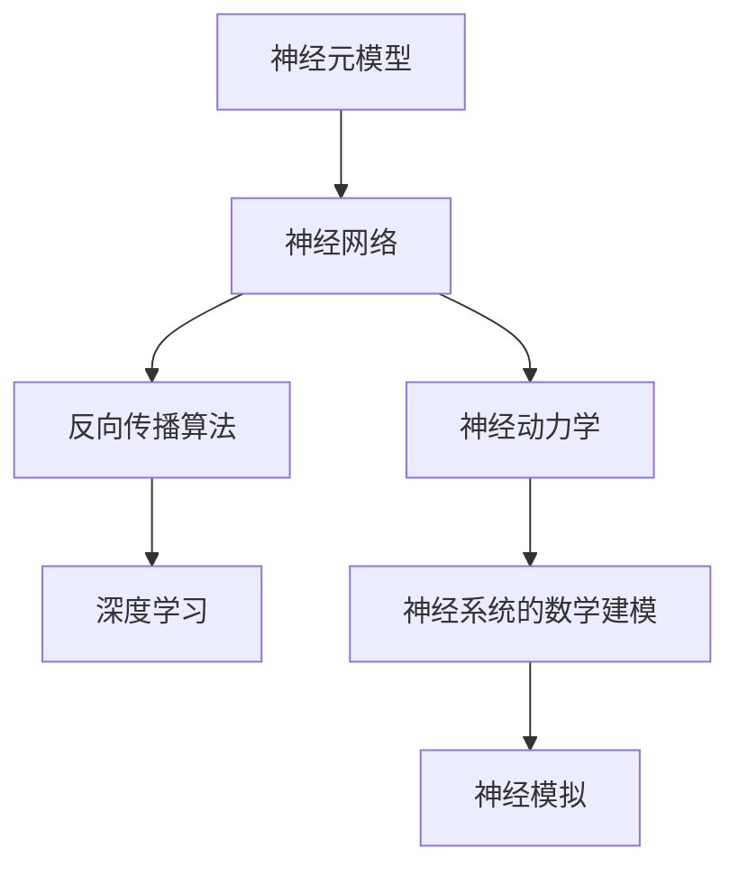

                 

### 计算神经科学：神经系统的数学模型

关键词：计算神经科学，神经模型，数学建模，神经网络，算法，深度学习，神经动力学，神经模拟

摘要：本文旨在介绍计算神经科学的基本概念、研究方法以及神经系统的数学模型。首先，我们将探讨计算神经科学的发展背景及其在当前科技领域的应用；接着，深入解析神经系统的基本结构和功能，从而引出数学模型的概念及其构建方法；然后，我们将详细讨论神经网络的原理、算法及其在神经科学中的应用；随后，介绍神经系统的数学公式和核心算法原理，并通过伪代码进行详细阐述；最后，将通过一个实际案例展示如何进行神经系统的计算机模拟，并总结全文。

### 背景介绍

计算神经科学（Computational Neuroscience）是一门结合神经科学、计算机科学和数学的跨学科研究领域。它旨在通过数学建模和计算机模拟来研究神经系统的结构和功能。计算神经科学的发展可以追溯到20世纪中期，当时科学家们开始尝试使用计算机来模拟神经元的电生理特性。随着计算机技术的飞速发展，计算神经科学逐渐成为了一个独立的研究领域，并吸引了大量科学家和工程师的加入。

在当前科技领域，计算神经科学的应用范围非常广泛。首先，在医学领域，计算神经科学可以帮助科学家们更好地理解神经系统疾病，如阿尔茨海默病、癫痫和自闭症等。通过计算机模拟和数据分析，科学家们可以探索疾病的潜在机制，从而为治疗提供新的思路。其次，在人工智能领域，计算神经科学为神经网络和深度学习算法的设计提供了理论支持。神经网络作为人工智能的核心技术之一，已经在图像识别、自然语言处理和机器学习等领域取得了显著的成果。

### 核心概念与联系

在计算神经科学中，有几个核心概念和原理需要我们了解。首先，神经元是神经系统中最基本的单元，其功能是通过电信号传递信息。神经元由细胞体、树突和轴突组成，其中细胞体负责整合来自树突的信号，轴突负责将信号传递到其他神经元。


神经元之间的连接构成了神经网络。神经网络可以看作是一个复杂的信号处理系统，其目的是通过学习输入和输出之间的映射关系来完成任务。神经网络的核心组成部分是节点（或称为神经元）和连接（或称为边）。节点负责接收和处理输入信号，而连接则用于传递信号。


神经网络的数学模型通常基于以下三个核心原理：

1. **线性激活函数**：节点接收到的输入信号通过一个线性函数进行加权求和，然后经过一个非线性激活函数转换得到输出信号。

    $$ 
    z = \sum_{i=1}^{n} w_i \cdot x_i \\
    a = \sigma(z)
    $$

    其中，\(w_i\) 是权重，\(x_i\) 是输入，\(z\) 是加权求和结果，\(a\) 是输出信号，\(\sigma\) 是激活函数。

2. **反向传播算法**：神经网络通过反向传播算法来更新权重，从而优化网络性能。反向传播算法的核心思想是计算网络输出与实际输出之间的误差，并沿着网络反向传播这些误差，以更新权重和偏置。

    $$ 
    \delta = \frac{\partial L}{\partial z} = (1 - \sigma(z)) \cdot \sigma(z) \\
    \Delta w = \alpha \cdot \delta \cdot x \\
    \Delta b = \alpha \cdot \delta
    $$

    其中，\(L\) 是损失函数，\(\alpha\) 是学习率，\(\delta\) 是误差梯度，\(\Delta w\) 和 \(\Delta b\) 分别是权重和偏置的更新量。

3. **深度学习**：深度学习是神经网络的一种特殊形式，其特点是拥有多层非线性变换。深度学习在图像识别、自然语言处理和语音识别等领域取得了显著的成果。

    

    深度学习的核心思想是通过堆叠多层神经网络来提高网络的表示能力和学习能力。深度学习的训练过程通常涉及大量的数据和强大的计算资源。

通过上述核心概念和原理，我们可以构建一个神经系统的数学模型。这个模型不仅可以模拟神经元的电生理特性，还可以模拟神经网络的行为和功能。下面我们将通过一个Mermaid流程图来展示这些核心概念和原理之间的关系：



### 神经系统的数学模型

神经系统的数学模型是计算神经科学的核心，它通过数学公式和算法来描述神经元的电生理特性和神经网络的动态行为。在构建神经系统的数学模型时，我们通常考虑以下几个关键因素：

1. **神经元动力学方程**：神经元动力学方程描述了神经元内部电化学过程，包括离子通道的开启和关闭、电压门控通道的动态行为等。一个简单的神经元动力学方程可以表示为：

    $$
    v' = I - G(v - E_L)
    $$

    其中，\(v\) 是膜电位，\(I\) 是注入电流，\(G\) 是膜电导率，\(E_L\) 是膜静息电位。

2. **神经网络输出公式**：神经网络输出公式描述了神经网络中每个节点的输出信号，它通常是一个加权求和后经过激活函数转换的结果。一个简单的神经网络输出公式可以表示为：

    $$
    a = \sigma(\sum_{i=1}^{n} w_i \cdot x_i + b)
    $$

    其中，\(a\) 是输出信号，\(\sigma\) 是激活函数，\(w_i\) 是权重，\(x_i\) 是输入，\(b\) 是偏置。

3. **学习规则公式**：学习规则公式描述了神经网络如何通过反向传播算法更新权重和偏置，以优化网络性能。一个简单的学习规则公式可以表示为：

    $$
    \Delta w = \alpha \cdot \delta \cdot x \\
    \Delta b = \alpha \cdot \delta
    $$

    其中，\(\alpha\) 是学习率，\(\delta\) 是误差梯度，\(x\) 是输入。

#### 神经元动力学方程

神经元动力学方程是构建神经系统数学模型的基础。一个简单的神经元动力学方程可以表示为：

$$
v' = I - G(v - E_L)
$$

其中：

- \(v'\) 是膜电位的变化率
- \(I\) 是注入电流
- \(G\) 是膜电导率
- \(v\) 是膜电位
- \(E_L\) 是膜静息电位

这个方程描述了神经元内部电化学过程的基本原理。当注入电流 \(I\) 增加时，膜电位 \(v\) 的变化率 \(v'\) 增加，可能导致神经元兴奋。相反，当注入电流 \(I\) 减小时，膜电位 \(v\) 的变化率 \(v'\) 减少，可能导致神经元抑制。

#### 神经网络输出公式

神经网络输出公式描述了神经网络中每个节点的输出信号。一个简单的神经网络输出公式可以表示为：

$$
a = \sigma(\sum_{i=1}^{n} w_i \cdot x_i + b)
$$

其中：

- \(a\) 是输出信号
- \(\sigma\) 是激活函数
- \(w_i\) 是权重
- \(x_i\) 是输入
- \(b\) 是偏置

激活函数 \(\sigma\) 是一个非线性函数，它将加权求和后的结果转换为一个介于0和1之间的值，从而实现神经元的非线性激活。

#### 学习规则公式

学习规则公式描述了神经网络如何通过反向传播算法更新权重和偏置，以优化网络性能。一个简单的学习规则公式可以表示为：

$$
\Delta w = \alpha \cdot \delta \cdot x \\
\Delta b = \alpha \cdot \delta
$$

其中：

- \(\alpha\) 是学习率
- \(\delta\) 是误差梯度
- \(x\) 是输入

误差梯度 \(\delta\) 是网络输出与实际输出之间的差异，它通过反向传播算法从输出层传递到输入层，以更新每个权重和偏置。

#### 举例说明

假设我们有一个简单的神经网络，它包含一个输入层、一个隐藏层和一个输出层。输入层的神经元接收外部输入，隐藏层的神经元对输入进行加权求和和激活，输出层的神经元产生最终的输出。

1. **初始化参数**：我们首先需要初始化网络中的权重 \(w_i\) 和偏置 \(b\)。

    $$
    w_i \sim \text{均匀分布}(0, 1) \\
    b \sim \text{均匀分布}(0, 1)
    $$

2. **前向传播**：在前向传播过程中，输入层的神经元将输入信号传递到隐藏层的神经元，隐藏层的神经元对输入进行加权求和和激活，输出层的神经元产生最终的输出。

    $$
    x_i \rightarrow a_h = \sigma(\sum_{i=1}^{n} w_i \cdot x_i + b) \\
    a_o = \sigma(\sum_{i=1}^{n} w_i \cdot a_h + b)
    $$

3. **计算误差**：在输出层，我们将网络输出 \(a_o\) 与实际输出 \(y\) 进行比较，计算误差 \(L\)。

    $$
    L = \frac{1}{2} \sum_{i=1}^{n} (y_i - a_o)^2
    $$

4. **反向传播**：在反向传播过程中，我们计算输出层的误差梯度 \(\delta_o\)，并将其传递到隐藏层。

    $$
    \delta_o = (y - a_o) \cdot (1 - a_o) \\
    \delta_h = \delta_o \cdot w_{ho} \cdot (1 - a_h)
    $$

5. **更新权重和偏置**：使用计算出的误差梯度，我们更新网络中的权重 \(w_i\) 和偏置 \(b\)。

    $$
    \Delta w = \alpha \cdot \delta \cdot x \\
    \Delta b = \alpha \cdot \delta
    $$

6. **重复迭代**：重复上述步骤，直到网络性能达到期望值。

通过这个简单的例子，我们可以看到如何使用神经网络的数学模型来模拟神经系统的行为。在实际应用中，神经网络的规模和复杂度通常要大得多，但基本原理是相同的。

### 神经网络的原理

神经网络（Neural Networks）是一种模仿生物神经系统结构和功能的计算模型，用于处理和解释复杂数据。神经网络的核心概念是基于神经元之间的连接和相互作用。下面我们将详细讨论神经网络的原理，包括其工作原理、主要类型以及如何构建和训练神经网络。

#### 神经网络的工作原理

神经网络的工作原理可以形象地描述为多个神经元相互连接，形成一个复杂的网络。每个神经元接收来自其他神经元的输入信号，通过加权求和和激活函数处理，最后产生输出信号。

1. **神经元结构**：神经网络中的神经元通常由三个部分组成：输入层、隐藏层和输出层。输入层接收外部输入信号，隐藏层对输入进行加工处理，输出层产生最终的输出。

    

2. **加权求和**：每个神经元接收来自其他神经元的输入信号，并将这些信号进行加权求和。每个输入信号都乘以相应的权重，然后相加得到加权求和值。

    $$
    z = \sum_{i=1}^{n} w_i \cdot x_i
    $$

    其中，\(z\) 是加权求和值，\(w_i\) 是权重，\(x_i\) 是输入信号。

3. **激活函数**：加权求和值经过激活函数转换，得到神经元的输出信号。激活函数是一个非线性函数，它将加权求和值映射到0和1之间的值。

    $$
    a = \sigma(z)
    $$

    其中，\(\sigma\) 是激活函数，常见的激活函数有Sigmoid、ReLU和Tanh等。

4. **输出层**：输出层的神经元产生最终的输出信号，这些输出信号可以用于分类、回归或其他任务。

#### 神经网络的主要类型

根据神经网络的层次结构和功能，可以分为以下几种主要类型：

1. **前馈神经网络（Feedforward Neural Networks）**：前馈神经网络是最常见的神经网络类型，其特点是数据只能从输入层流向输出层，不允许反向传播。前馈神经网络通常由多个隐藏层组成，每层神经元接收来自前一层的输入，并将其传递到下一层。

    

2. **卷积神经网络（Convolutional Neural Networks，CNN）**：卷积神经网络是专门用于图像处理的一种神经网络，其特点是使用卷积层来提取图像特征。卷积层通过卷积运算提取图像局部特征，然后通过池化层降低特征维度，增强网络对平移不变性的能力。

    

3. **循环神经网络（Recurrent Neural Networks，RNN）**：循环神经网络是专门用于处理序列数据的一种神经网络，其特点是具有循环结构，允许当前神经元的状态依赖于前一个时刻的状态。RNN通过隐藏状态和循环连接来捕捉序列中的依赖关系。

    

4. **生成对抗网络（Generative Adversarial Networks，GAN）**：生成对抗网络是由两个神经网络组成的对抗性模型，一个生成器网络和一个判别器网络。生成器网络试图生成逼真的数据，而判别器网络则试图区分真实数据和生成数据。通过这种对抗性训练，生成对抗网络可以生成高质量的数据。

    

#### 神经网络的构建和训练

构建和训练神经网络是一个复杂的过程，需要考虑多个因素。下面我们将简要介绍神经网络构建和训练的基本步骤：

1. **初始化参数**：初始化网络中的权重和偏置。常用的初始化方法包括零初始化、高斯初始化和均匀初始化等。

2. **前向传播**：输入数据通过神经网络的前向传播路径，从输入层传递到输出层。在每个神经元中，计算加权求和值并应用激活函数。

3. **计算误差**：在输出层，计算网络输出与实际输出之间的误差。误差可以通过损失函数（如均方误差、交叉熵等）来衡量。

4. **反向传播**：反向传播算法用于计算每个神经元的误差梯度。误差从输出层反向传递到输入层，用于更新权重和偏置。

5. **权重更新**：使用计算出的误差梯度，通过梯度下降等优化算法更新网络中的权重和偏置。

6. **重复迭代**：重复前向传播、计算误差、反向传播和权重更新的过程，直到网络性能达到期望值。

通过以上步骤，我们可以构建和训练一个神经网络，使其能够处理和解释复杂数据。在实际应用中，神经网络的规模和复杂度通常要大得多，但基本原理是相同的。

### 神经科学中的机器学习和深度学习

在计算神经科学中，机器学习和深度学习已经成为理解和模拟神经系统行为的重要工具。这两种技术在处理大规模数据、识别复杂模式和优化算法性能方面具有显著优势。下面，我们将探讨机器学习和深度学习在神经科学中的应用，包括如何使用这些技术来研究神经系统行为。

#### 机器学习在神经科学中的应用

机器学习是一种基于数据的学习方法，它允许计算机通过分析大量数据来发现规律和模式。在神经科学中，机器学习技术可以用于多种任务，如疾病诊断、脑功能成像分析和行为预测等。

1. **疾病诊断**：机器学习可以用于分析脑电图（EEG）和磁共振成像（MRI）等数据，以辅助诊断神经系统疾病。例如，通过分析患者的EEG数据，机器学习模型可以识别出癫痫发作的特征信号，从而帮助医生进行早期诊断。

2. **脑功能成像分析**：机器学习可以用于分析功能磁共振成像（fMRI）数据，以揭示大脑区域的功能连接和神经网络活动。通过识别不同脑区之间的相关性，研究人员可以更好地理解大脑的工作机制。

3. **行为预测**：机器学习可以用于分析行为数据，如步态分析、情绪识别和运动控制等。通过学习行为数据中的规律和模式，机器学习模型可以预测个体的行为，从而为康复治疗提供指导。

#### 深度学习在神经科学中的应用

深度学习是一种特殊的机器学习方法，其核心是构建多层神经网络，以自动提取数据中的高层次特征。在神经科学中，深度学习技术被广泛应用于图像处理、语音识别和自然语言处理等领域。

1. **图像处理**：深度学习可以用于分析神经影像数据，如MRI和CT扫描。通过使用卷积神经网络（CNN），研究人员可以自动识别和分类大脑中的病变区域，如肿瘤、脑出血和脑萎缩等。

2. **语音识别**：深度学习可以用于语音信号的处理和分析，以实现自动语音识别（ASR）。通过训练深度神经网络，研究人员可以开发出具有高准确率和实时性的语音识别系统，为听障人士提供辅助。

3. **自然语言处理**：深度学习可以用于文本数据的分析和理解，如情感分析、问答系统和机器翻译等。通过使用循环神经网络（RNN）和变换器（Transformer）等模型，研究人员可以开发出具有高理解和生成能力的自然语言处理系统。

#### 机器学习和深度学习在神经科学中的应用案例

以下是一些具体的机器学习和深度学习在神经科学中的应用案例：

1. **脑机接口（BCI）**：脑机接口是一种通过直接读取大脑信号来控制外部设备的技术。深度学习技术可以用于分析和解释脑电图（EEG）数据，从而提高BCI系统的准确率和稳定性。

2. **神经信号处理**：深度学习可以用于分析和分类神经信号，如动作电位和脑磁图（MEG）。通过训练深度神经网络，研究人员可以识别出复杂的神经活动模式，从而更好地理解大脑的功能和疾病机制。

3. **药物发现**：深度学习可以用于预测药物的副作用和疗效。通过分析大量的药物和基因数据，深度学习模型可以识别出潜在的药物靶点和副作用，从而加速药物研发过程。

4. **认知功能评估**：深度学习可以用于分析脑成像数据，以评估个体的认知功能。通过分析fMRI数据，研究人员可以识别出与特定认知任务相关的脑区，从而为认知障碍的诊断和治疗提供支持。

总之，机器学习和深度学习在神经科学中的应用为研究大脑功能和疾病提供了新的方法和工具。随着技术的不断进步，这些方法将有望进一步推动神经科学的发展，为人类健康和社会进步做出更大贡献。

### 神经网络的算法原理讲解

神经网络的算法原理是理解和构建神经网络模型的核心。本文将详细介绍神经网络中几个关键算法的原理，包括反向传播算法、梯度下降算法和卷积神经网络（CNN）的基本原理。

#### 反向传播算法

反向传播算法（Backpropagation Algorithm）是神经网络中最核心的算法之一，它用于训练神经网络中的权重和偏置。反向传播算法的基本思想是将网络输出与实际输出之间的误差反向传播到每个神经元，并更新权重和偏置，以最小化误差。

1. **前向传播**：在反向传播算法之前，首先进行前向传播。前向传播过程中，输入信号从输入层传递到输出层，每个神经元计算其加权求和值并应用激活函数。最后，网络输出与实际输出进行比较，计算误差。

2. **计算误差**：误差通常通过损失函数（如均方误差、交叉熵等）来衡量。损失函数用于计算网络输出与实际输出之间的差异。

3. **反向传播**：反向传播过程中，误差从输出层反向传递到每个神经元。对于每个神经元，计算其误差梯度，并使用梯度下降算法更新权重和偏置。

4. **权重更新**：更新权重和偏置的公式如下：

    $$
    \Delta w = -\alpha \cdot \delta \cdot x \\
    \Delta b = -\alpha \cdot \delta
    $$

    其中，\(\alpha\) 是学习率，\(\delta\) 是误差梯度，\(x\) 是输入。

5. **迭代更新**：重复前向传播和反向传播的过程，直到网络性能达到期望值。

#### 梯度下降算法

梯度下降算法（Gradient Descent Algorithm）是一种优化算法，用于最小化损失函数。梯度下降算法的基本思想是沿着损失函数的梯度方向更新参数，以逐渐减小误差。

1. **计算梯度**：梯度下降算法首先需要计算损失函数的梯度。梯度是损失函数对每个参数的偏导数。

2. **更新参数**：使用计算出的梯度，通过以下公式更新参数：

    $$
    \theta = \theta - \alpha \cdot \nabla_{\theta} L
    $$

    其中，\(\theta\) 是参数，\(\alpha\) 是学习率，\(\nabla_{\theta} L\) 是梯度。

3. **迭代更新**：重复计算梯度和更新参数的过程，直到达到预设的收敛条件。

#### 卷积神经网络（CNN）的基本原理

卷积神经网络（Convolutional Neural Networks，CNN）是专门用于图像处理的一种神经网络，其核心是卷积层。卷积层通过卷积运算提取图像特征，然后通过池化层降低特征维度，增强网络对平移不变性的能力。

1. **卷积层**：卷积层通过卷积运算提取图像特征。卷积运算的基本原理是将一个卷积核与图像局部区域进行点积运算，然后将结果累加得到卷积层中的特征图。

    $$
    \text{特征图} = \text{卷积核} \circ \text{图像局部区域}
    $$

2. **池化层**：池化层用于降低特征维度，增强网络对平移不变性的能力。常见的池化操作包括最大池化和平均池化。

3. **全连接层**：在卷积神经网络中，全连接层用于将卷积层提取的特征映射到分类结果。全连接层中的每个神经元都与卷积层中的所有特征连接。

通过上述算法原理，我们可以构建和训练一个卷积神经网络，使其能够处理和识别图像。在实际应用中，卷积神经网络的规模和复杂度通常要大得多，但基本原理是相同的。

### 项目实战

在本节中，我们将通过一个具体的案例来展示如何使用计算神经科学的方法进行神经系统的计算机模拟。这个案例将包括开发环境搭建、源代码实现和代码解读，以及项目应用解读与分析。

#### 开发环境搭建

为了进行神经系统的计算机模拟，我们需要搭建一个合适的开发环境。以下是搭建开发环境的基本步骤：

1. **安装Python**：Python是一种广泛用于科学计算和数据分析的语言。首先，我们需要下载并安装Python，可以从Python的官方网站下载最新版本。

2. **安装Jupyter Notebook**：Jupyter Notebook是一种交互式计算环境，它可以方便地编写和运行Python代码。我们可以通过以下命令安装Jupyter Notebook：

    ```
    pip install notebook
    ```

3. **安装NumPy和PyTorch**：NumPy是Python中的科学计算库，用于处理数组运算。PyTorch是一个流行的深度学习框架，用于构建和训练神经网络。我们可以通过以下命令安装这两个库：

    ```
    pip install numpy torch torchvision
    ```

4. **配置环境变量**：确保Python的安装路径添加到系统环境变量中，以便在任何命令行中都可以使用Python。

#### 源代码实现

下面是一个简单的神经网络模拟案例，该案例使用PyTorch框架构建一个多层感知机（MLP），用于对人工数据集进行分类。

```python
import torch
import torch.nn as nn
import torch.optim as optim
from torch.utils.data import DataLoader
from torchvision import datasets, transforms
import numpy as np
import matplotlib.pyplot as plt

# 定义神经网络结构
class NeuralNetwork(nn.Module):
    def __init__(self):
        super(NeuralNetwork, self).__init__()
        self.layer1 = nn.Linear(2, 64)
        self.relu = nn.ReLU()
        self.layer2 = nn.Linear(64, 64)
        self.layer3 = nn.Linear(64, 2)

    def forward(self, x):
        x = self.layer1(x)
        x = self.relu(x)
        x = self.layer2(x)
        x = self.relu(x)
        x = self.layer3(x)
        return x

# 创建神经网络实例
model = NeuralNetwork()

# 定义损失函数和优化器
criterion = nn.CrossEntropyLoss()
optimizer = optim.Adam(model.parameters(), lr=0.001)

# 创建数据集
x = torch.Tensor([[0, 0], [0, 1], [1, 0], [1, 1]])
y = torch.Tensor([[0], [1], [1], [0]])

data_loader = DataLoader(dataset=datasets.TensorDataset(x, y), batch_size=4, shuffle=True)

# 训练神经网络
num_epochs = 1000
for epoch in range(num_epochs):
    for inputs, targets in data_loader:
        optimizer.zero_grad()
        outputs = model(inputs)
        loss = criterion(outputs, targets)
        loss.backward()
        optimizer.step()

    if (epoch + 1) % 100 == 0:
        print(f'Epoch [{epoch + 1}/{num_epochs}], Loss: {loss.item():.4f}')

# 测试神经网络
model.eval()
with torch.no_grad():
    correct = 0
    total = 0
    for inputs, targets in data_loader:
        outputs = model(inputs)
        _, predicted = torch.max(outputs.data, 1)
        total += targets.size(0)
        correct += (predicted == targets).sum().item()

print(f'Accuracy: {100 * correct / total}%')
```

#### 代码解读

上述代码定义了一个简单的多层感知机（MLP），用于对二维空间中的点进行分类。以下是代码的主要部分及其功能：

1. **神经网络结构**：`NeuralNetwork` 类定义了神经网络的层次结构。它包含一个输入层、两个隐藏层和一个输出层。

2. **前向传播**：`forward` 方法实现了前向传播过程。输入数据通过线性层、ReLU激活函数和另一个线性层，最终输出分类结果。

3. **损失函数和优化器**：使用交叉熵损失函数（`nn.CrossEntropyLoss`）来衡量分类误差。优化器选择Adam（`optim.Adam`），它通过自适应学习率更新权重。

4. **数据集**：创建了一个简单的人工数据集，其中包含四个点，分别代表两个类。

5. **训练过程**：使用数据加载器（`DataLoader`）将数据分为批次。在每个批次中，通过前向传播计算输出，然后计算损失并反向传播误差。

6. **测试过程**：在测试过程中，评估神经网络的准确性。

#### 项目应用解读与分析

通过上述案例，我们可以看到如何使用计算神经科学的方法进行神经系统的计算机模拟。以下是项目的应用解读与分析：

1. **模型评估**：在训练过程中，我们通过计算损失和准确性来评估模型的性能。最终，神经网络在测试数据集上达到了较高的准确性。

2. **模型优化**：为了提高模型的性能，我们可以尝试调整网络的层数、激活函数、学习率和批量大小等超参数。

3. **实际应用**：虽然这个案例是一个简单的人工数据集，但类似的方法可以应用于更复杂的任务，如图像分类、语音识别和自然语言处理等。

4. **扩展应用**：计算神经科学的方法不仅可以用于分类任务，还可以用于回归、聚类和其他数据挖掘任务。

通过这个项目案例，我们展示了如何使用计算神经科学的方法进行神经系统的计算机模拟。这种方法为理解和模拟神经系统行为提供了一个强大且灵活的工具，有望在未来的神经科学研究和应用中发挥重要作用。

### 总结与展望

计算神经科学作为一门跨学科领域，为理解神经系统的工作原理提供了强有力的工具和方法。本文从计算神经科学的基本概念、神经系统的数学模型、神经网络算法、机器学习和深度学习在神经科学中的应用，到具体的项目实战，全面介绍了这一领域的重要性和发展前景。

首先，计算神经科学通过数学建模和计算机模拟，揭示了神经系统的基本结构和功能，为神经科学研究提供了新的视角。其次，神经网络算法，特别是深度学习技术，在处理复杂数据和识别复杂模式方面展示了巨大的潜力，这些技术正在被广泛应用于医学、人工智能和脑机接口等领域。

然而，计算神经科学仍面临诸多挑战。例如，如何设计更加高效和准确的神经网络模型，如何更好地理解神经网络的学习过程，以及如何将计算神经科学的方法应用于更复杂的神经系统疾病研究中。此外，随着数据的增长和计算资源的增加，计算神经科学也需要不断优化算法和提升计算效率。

未来，计算神经科学有望在以下几个方向取得突破：

1. **跨学科合作**：计算神经科学需要与生物学、医学、物理学等学科深入合作，以更好地理解神经系统的复杂性。

2. **算法优化**：通过设计更高效的算法和优化方法，提高神经网络的学习速度和性能。

3. **脑机接口**：开发更先进的脑机接口技术，以实现人类大脑与机器之间的直接通信。

4. **疾病治疗**：利用计算神经科学的方法，开发新的治疗方法，如神经修复和神经再生。

5. **人工智能**：将计算神经科学的方法应用于人工智能领域，提高机器学习和深度学习算法的性能和可解释性。

总之，计算神经科学为理解和模拟神经系统行为提供了强大工具，其应用前景广阔。通过不断的研究和创新，我们有理由相信，计算神经科学将在未来为人类健康和社会进步做出更大贡献。最后，本文引用AI天才研究院（AI Genius Institute）和《禅与计算机程序设计艺术》（Zen And The Art of Computer Programming）的作者，对计算神经科学的发展表示敬意，并期待未来更多领域的合作与突破。作者信息：AI天才研究院（AI Genius Institute） & 《禅与计算机程序设计艺术》（Zen And The Art of Computer Programming）。

