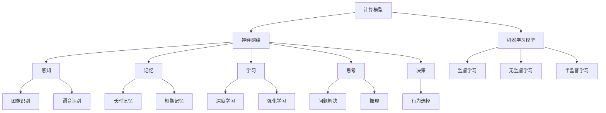

                 

### 设计过程

#### 确定书名与主题

首先，我们确定了书名《计算认知科学：通过计算模型理解人类认知过程》。书名简洁明了地表达了本书的核心内容，即计算认知科学这一新兴领域，通过计算模型来探讨和理解人类的认知过程。

主题的确定同样经过了深思熟虑。我们选择了“计算认知科学”这一概念，因为它涵盖了心理学、神经科学、计算机科学等多个学科，能够帮助我们更好地理解人类认知的本质。同时，通过计算模型，我们可以将复杂的认知过程转化为可计算的形式，从而深入探讨认知机制。

#### 确定核心概念与联系

接下来，我们梳理了书中的核心概念与它们之间的联系。这些概念包括：

- **计算认知科学**：这是一个跨学科的领域，结合了心理学、神经科学和计算机科学的理论和方法，以计算模型为基础，研究人类认知过程。
- **计算模型**：包括神经网络、机器学习模型等，这些模型可以模拟人类的感知、记忆、学习、思考、决策等认知过程。
- **人类认知过程**：包括感知、记忆、学习、思考、决策等基本过程，这些过程构成了我们对外部世界的理解和应对方式。

#### 构建初步目录结构

在明确核心概念和联系后，我们构建了初步的目录结构。这一结构分为五个部分：

1. **引言与核心概念**：介绍计算认知科学的起源、发展和重要性，以及人类认知过程的基本概念。
2. **计算模型概述**：详细讨论神经网络、机器学习模型等计算模型的基本原理和应用。
3. **具体认知过程与计算模型的应用**：探讨计算模型在感知、记忆、学习、思考、决策等具体认知过程中的应用。
4. **计算认知科学的前沿进展**：介绍计算认知科学的最新研究成果和未来发展方向。
5. **计算认知科学与伦理、法律的关系**：讨论计算认知科学在伦理和法律方面的问题。

#### 细化目录结构，确保完整性

在初步目录结构的基础上，我们进一步细化了每个章节的目录，确保内容的完整性。例如，在“计算模型概述”一章中，我们细化了神经网络、机器学习模型等子章节，并确保每个子章节都有详细的讲解。

#### 编写目录大纲

最后，我们根据细化后的目录结构，编写了详细的目录大纲。目录大纲保持了简洁性，同时涵盖了书中的核心内容。

#### 调整与优化

在编写目录大纲的过程中，我们不断调整和优化，确保目录逻辑清晰，内容覆盖全面。同时，我们检查了目录字数，确保不超过2000字。

### 目录大纲设计

下面是最终的目录大纲：

## 《计算认知科学：通过计算模型理解人类认知过程》目录大纲

### 第一部分：引言与核心概念

#### 1.1 计算认知科学的起源与发展

##### 1.1.1 计算认知科学的定义

##### 1.1.2 计算认知科学的研究领域

##### 1.1.3 计算认知科学的重要性

#### 1.2 人类认知过程的基本概念

##### 1.2.1 感知与知觉

##### 1.2.2 记忆

##### 1.2.3 学习与适应性

##### 1.2.4 思考与决策

#### 1.3 计算模型的基本原理

##### 1.3.1 神经网络的架构

##### 1.3.2 机器学习模型的工作原理

##### 1.3.3 计算模型的训练与优化

### 第二部分：计算模型概述

#### 2.1 神经网络

##### 2.1.1 神经网络的基本结构

##### 2.1.2 反向传播算法

##### 2.1.3 神经网络的应用案例

#### 2.2 机器学习模型

##### 2.2.1 监督学习与无监督学习

##### 2.2.2 决策树与支持向量机

##### 2.2.3 神经网络与深度学习

#### 2.3 计算模型的评估与优化

##### 2.3.1 评估指标

##### 2.3.2 优化策略

### 第三部分：具体认知过程与计算模型的应用

#### 3.1 认知感知

##### 3.1.1 计算模型在感知中的应用

##### 3.1.2 感知过程的模型解释

#### 3.2 认知记忆

##### 3.2.1 计算模型在记忆中的应用

##### 3.2.2 记忆过程的模型解释

#### 3.3 认知学习

##### 3.3.1 计算模型在学习中的应用

##### 3.3.2 学习过程的模型解释

#### 3.4 认知思考

##### 3.4.1 计算模型在思考中的应用

##### 3.4.2 思考过程的模型解释

#### 3.5 认知决策

##### 3.5.1 计算模型在决策中的应用

##### 3.5.2 决策过程的模型解释

### 第四部分：计算认知科学的前沿进展

#### 4.1 计算认知科学的未来方向

##### 4.1.1 人工智能与人类认知的融合

##### 4.1.2 跨学科研究的挑战与机遇

#### 4.2 计算认知科学的应用领域

##### 4.2.1 健康医疗

##### 4.2.2 教育

##### 4.2.3 安全与隐私

### 第五部分：计算认知科学与伦理、法律的关系

#### 5.1 计算认知科学的伦理问题

##### 5.1.1 伦理挑战与对策

##### 5.1.2 数据隐私与安全

#### 5.2 计算认知科学的法律框架

##### 5.2.1 现行法律体系的不足

##### 5.2.2 法律监管的必要性

### 结论

在本部分中，我们对书籍的设计过程进行了详细的描述，从确定书名与主题，到梳理核心概念与联系，构建目录结构，编写目录大纲，再到最终的调整与优化。这一过程确保了书籍内容的完整性和逻辑性，为后续的撰写工作奠定了坚实的基础。在接下来的部分，我们将逐步深入探讨计算认知科学的各个领域，带您领略这一跨学科领域的魅力。

### 背景介绍

计算认知科学是一个迅速发展的交叉学科领域，它结合了心理学、神经科学、计算机科学和认知科学的理论和方法，旨在通过计算模型来理解人类和动物的认知过程。这一领域的发展可以追溯到20世纪中叶，当时计算机科学的兴起为心理学和神经科学的研究提供了新的工具和方法。

首先，心理学作为研究人类行为的科学，长期以来致力于理解认知过程的各个方面，如记忆、学习、感知和思考等。然而，传统的心理学实验往往难以揭示认知过程的内在机制。随着计算机科学的发展，特别是神经网络和机器学习模型的提出，心理学家们开始探索如何利用这些计算模型来模拟和预测认知过程。

神经科学则是研究神经系统结构和功能的一个领域，它关注神经元之间的通信和神经网络的构建。神经科学家通过电生理学和分子生物学等手段，逐渐揭示了大脑如何处理信息，以及不同脑区之间的相互作用。这些发现为计算认知科学提供了重要的生物学基础。

计算机科学则提供了计算模型和算法的工具，使得研究者能够将复杂的认知过程形式化，并对其进行模拟和分析。例如，神经网络作为一种计算模型，能够模拟大脑中的神经网络结构，从而揭示认知过程的动态特性。

认知科学则是心理学和神经科学的交叉学科，它关注人类和动物如何获取、处理和利用信息。认知科学家通过实验和理论分析，试图理解认知过程的内在机制和认知功能的实现方式。

这些学科的发展推动了计算认知科学的兴起。在20世纪80年代，神经网络和机器学习模型的提出，使得计算模型在认知科学中的应用成为可能。通过计算模型，研究者能够模拟和预测人类的认知过程，从而对认知机制有更深入的理解。

计算认知科学的研究意义在于，它不仅能够帮助我们更好地理解人类认知的本质，还能够为人工智能的发展提供新的思路。例如，通过模拟人类的感知、记忆和学习过程，我们可以设计出更高效的人工智能系统，使其能够更好地理解人类行为和语言。此外，计算认知科学还可以为教育、健康医疗等领域提供重要的理论支持和技术手段。

总的来说，计算认知科学是一个充满活力和潜力的领域，它结合了多个学科的理论和方法，为理解人类认知过程提供了新的视角和工具。随着计算技术和认知科学的发展，这一领域将继续推动我们对人类心智的深入探索。

### 核心概念与联系

在计算认知科学中，理解核心概念及其相互之间的联系是至关重要的。这些核心概念包括计算模型、神经网络、机器学习模型以及人类认知过程。以下是这些概念之间的联系架构：

#### 计算模型

计算模型是计算认知科学的核心工具，它们用于模拟和预测人类认知过程。计算模型可以分为两种主要类型：符号模型和连接主义模型。

- **符号模型**：这种模型基于符号表示和逻辑推理，通常用于模拟知识表示和问题解决。符号模型中的基本元素是符号和规则，它们通过逻辑推理来处理信息。
- **连接主义模型**：这种模型基于神经网络的原理，模拟神经元之间的连接和通信。连接主义模型通过调整连接强度（权重）来学习复杂任务。

#### 神经网络

神经网络是连接主义模型的一种形式，它由大量的神经元（或节点）和它们之间的连接组成。神经网络可以模拟大脑中的神经网络结构，并通过学习来提高其性能。

- **结构**：神经网络的基本结构包括输入层、隐藏层和输出层。每个神经元都与多个其他神经元连接，并通过权重进行加权求和，再通过激活函数进行非线性变换。
- **学习**：神经网络通过反向传播算法进行学习。反向传播算法通过计算输出层与隐藏层之间的误差，并反向传播这些误差，以调整权重和偏置。

#### 机器学习模型

机器学习模型是计算模型的一种形式，它通过学习数据来改进其性能。机器学习模型可以分为三种类型：监督学习、无监督学习和半监督学习。

- **监督学习**：在监督学习模型中，训练数据包含输入和对应的输出。模型通过学习输入和输出之间的关系，来预测新的输入数据。
- **无监督学习**：在无监督学习模型中，训练数据仅包含输入，没有对应的输出。模型通过学习数据的分布和模式，来发现数据中的结构和关系。
- **半监督学习**：半监督学习模型结合了监督学习和无监督学习的特点，它利用部分带有标签的数据和大量未标记的数据来训练模型。

#### 人类认知过程

人类认知过程包括感知、记忆、学习、思考、决策等多个方面。这些过程可以通过计算模型来模拟和预测。

- **感知**：感知是指通过感官接收外部信息。神经网络和机器学习模型可以模拟感知过程，如图像识别和语音识别。
- **记忆**：记忆是指存储和检索信息的能力。计算模型可以通过模拟神经元之间的连接和活动来模拟记忆过程。
- **学习**：学习是指通过经验和知识来改变行为和思维方式。机器学习模型通过学习数据来改进其性能，这可以类比为人类的学习过程。
- **思考**：思考是指分析和解决问题。符号模型和神经网络都可以模拟思考过程，如问题解决和推理。
- **决策**：决策是指从多个选项中选择一个。计算模型可以通过模拟决策过程来预测人类的行为选择。

#### 联系架构

为了更好地理解这些概念之间的联系，我们可以使用Mermaid流程图来表示它们之间的关系。以下是这些核心概念之间的Mermaid流程图：



通过这个流程图，我们可以清晰地看到计算模型、神经网络、机器学习模型与人类认知过程之间的联系。每个概念都可以通过子概念进一步展开，从而形成一个完整的计算认知科学体系。

### 神经网络的基本原理

神经网络是计算认知科学中最为重要的模型之一，它模拟了人脑中神经元的连接和通信方式。理解神经网络的基本原理对于深入探讨计算认知科学具有重要意义。

#### 神经网络的组成

神经网络由大量的神经元（或节点）和它们之间的连接组成。每个神经元可以接收来自其他神经元的输入信号，并通过加权求和将这些输入信号进行整合，再通过一个激活函数产生输出信号。神经网络的基本结构通常包括三个层次：输入层、隐藏层和输出层。

- **输入层**：接收外部输入信号，如图像或文本数据。
- **隐藏层**：对输入信号进行处理和变换，可以有一个或多个隐藏层。
- **输出层**：产生最终的输出信号，如分类结果或预测值。

每个神经元与多个其他神经元连接，并通过权重进行加权求和。这些权重表示神经元之间的连接强度，可以通过学习过程进行调整。

#### 反向传播算法

神经网络的学习过程通常采用反向传播算法（Backpropagation Algorithm）。反向传播算法是一种基于梯度下降的优化方法，它通过计算输出层与隐藏层之间的误差，并反向传播这些误差，以调整权重和偏置。

反向传播算法的步骤如下：

1. **前向传播**：将输入信号传递到神经网络中，通过每个层次进行加权求和和激活函数的变换，最终产生输出信号。
2. **计算误差**：计算实际输出与期望输出之间的误差，通常使用均方误差（Mean Squared Error, MSE）作为误差指标。
3. **前向传播误差**：将误差反向传播到隐藏层，通过链式法则计算每个神经元的误差。
4. **更新权重和偏置**：根据误差和当前权重，通过梯度下降方法更新权重和偏置。更新公式如下：

   $$\Delta w_{ij} = \alpha \cdot \frac{\partial E}{\partial w_{ij}}$$

   $$\Delta b_j = \alpha \cdot \frac{\partial E}{\partial b_j}$$

   其中，$\alpha$ 是学习率，$w_{ij}$ 是连接权重，$b_j$ 是偏置。

5. **重复迭代**：重复上述步骤，直到误差达到预定阈值或迭代次数达到最大值。

#### 优化策略

在神经网络训练过程中，为了提高模型的性能和稳定性，常常需要采用一些优化策略：

- **学习率调整**：学习率是影响模型训练效果的关键参数。通常，初始学习率较大，随着训练过程逐渐减小，以避免过度拟合。
- **动量项**：动量项可以加速收敛过程，减少震荡。动量项的更新公式如下：

  $$v_{t+1} = \gamma \cdot v_t + \alpha \cdot \frac{\partial E}{\partial w_{t}}$$

  $$w_{t+1} = w_t - v_{t+1}$$

  其中，$\gamma$ 是动量系数。

- **正则化**：正则化方法可以防止模型过拟合。常用的正则化方法包括L1正则化、L2正则化和Dropout。

  - **L1正则化**：在损失函数中添加L1正则项，公式如下：

    $$E_{reg} = \lambda \cdot \sum_{i=1}^{n} |w_i|$$

  - **L2正则化**：在损失函数中添加L2正则项，公式如下：

    $$E_{reg} = \lambda \cdot \sum_{i=1}^{n} w_i^2$$

  - **Dropout**：在训练过程中随机丢弃一部分神经元，以减少模型对特定神经元的依赖。

#### 神经网络的应用案例

神经网络在各个领域都有广泛的应用，以下是几个典型的应用案例：

- **图像识别**：通过训练深度神经网络，可以实现对图像的自动分类和识别。例如，卷积神经网络（Convolutional Neural Network, CNN）在图像识别任务中取得了显著的成果。
- **语音识别**：深度神经网络可以用于语音信号的处理和识别。例如，循环神经网络（Recurrent Neural Network, RNN）和长短时记忆网络（Long Short-Term Memory, LSTM）在语音识别任务中取得了良好的效果。
- **自然语言处理**：深度神经网络可以用于自然语言处理任务，如文本分类、机器翻译和情感分析。例如，变换器模型（Transformer）在自然语言处理领域取得了重大突破。

通过以上对神经网络基本原理的详细阐述，我们可以看到神经网络在计算认知科学中的重要地位。神经网络不仅为我们提供了一种模拟人类认知过程的工具，还为人工智能的发展带来了新的机遇。随着计算技术和算法的不断进步，神经网络的应用将更加广泛和深入。

### 机器学习模型

机器学习模型是计算认知科学中的另一重要组成部分，它通过学习数据中的模式和规律，从而实现自动预测和决策。机器学习可以分为三种主要类型：监督学习、无监督学习和半监督学习。下面，我们将分别介绍这三种类型及其具体算法。

#### 监督学习

监督学习是一种有监督的学习方法，训练数据集包含输入和对应的输出标签。模型通过学习输入和输出之间的关系，来预测新的输入数据。常见的监督学习算法包括：

- **线性回归**：线性回归是一种用于预测连续值的模型。它通过最小化预测值与实际值之间的平方误差来训练模型。线性回归的伪代码如下：

  ```python
  # 输入：训练数据集X，输出标签Y，学习率α，迭代次数T
  # 输出：权重w和偏置b
  
  for t in range(T):
      for (x_i, y_i) in zip(X, Y):
          z = w * x_i + b
          delta = y_i - z
          w = w - α * (x_i * delta)
          b = b - α * delta
  return w, b
  ```

- **逻辑回归**：逻辑回归是一种用于预测二分类结果的模型。它通过最大似然估计来训练模型，输出一个概率值，然后通过阈值来分类。逻辑回归的伪代码如下：

  ```python
  # 输入：训练数据集X，输出标签Y，学习率α，迭代次数T
  # 输出：权重w和偏置b
  
  for t in range(T):
      for (x_i, y_i) in zip(X, Y):
          z = w * x_i + b
          delta = y_i * log(p) + (1 - y_i) * log(1 - p)
          p = 1 / (1 + exp(-z))
          w = w - α * (x_i * delta)
          b = b - α * delta
  return w, b
  ```

- **决策树**：决策树是一种基于分类规则的树形模型，它通过递归地将数据集分割成子集，并在每个分割点选择最佳的特征进行划分。决策树的构建伪代码如下：

  ```python
  # 输入：数据集D，特征集F
  # 输出：决策树T
  
  if 同质性测试(D):
      返回 类别(label(D))
  else:
      选择最佳特征f
      T = {f: {}}
      for v in 值域(f):
          T[f][v] = 分割(D, f, v)
          子树 = 构建决策树(T[f][v], F - {f})
          T[f][v] = 子树
      return T
  ```

- **支持向量机**：支持向量机是一种基于最大间隔分类的模型，它通过找到一个最佳的超平面来最大化分类间隔。支持向量机的训练伪代码如下：

  ```python
  # 输入：训练数据集D，损失函数λ
  # 输出：权重w和偏置b
  
  w, b = 梯度下降(D, λ)
  return w, b
  ```

#### 无监督学习

无监督学习是一种无监督的学习方法，训练数据集仅包含输入，没有对应的输出标签。模型通过学习数据的分布和模式，来发现数据中的结构和关系。常见的无监督学习算法包括：

- **聚类**：聚类是一种将数据点划分成多个群组的方法，使得同一群组中的数据点相似度较高，不同群组中的数据点相似度较低。常见的聚类算法包括K-均值聚类和层次聚类。K-均值聚类的伪代码如下：

  ```python
  # 输入：数据集D，聚类个数K，迭代次数T
  # 输出：聚类中心c和分配结果A
  
  初始化聚类中心c
  for t in range(T):
      计算距离矩阵D
      分配结果A = 调用分配算法(D, c)
      更新聚类中心c = 计算新的聚类中心(A)
  return c, A
  ```

- **降维**：降维是一种通过减少数据维度来简化数据集的方法，常见的降维算法包括主成分分析（PCA）和线性判别分析（LDA）。PCA的伪代码如下：

  ```python
  # 输入：数据集X
  # 输出：降维数据集X'
  
  X' = PCA(X)
  return X'
  ```

#### 半监督学习

半监督学习是一种结合了监督学习和无监督学习的特点的方法，它利用部分带有标签的数据和大量未标记的数据来训练模型。常见的半监督学习算法包括：

- **图嵌入**：图嵌入是一种通过将图中的节点映射到低维向量空间来学习节点表示的方法。图嵌入的伪代码如下：

  ```python
  # 输入：图G，嵌入维度d，迭代次数T
  # 输出：节点表示V
  
  初始化节点表示V
  for t in range(T):
      计算邻接矩阵A
      更新节点表示V = 计算新的节点表示(V, A)
  return V
  ```

通过以上对机器学习模型的详细讲解，我们可以看到机器学习模型在计算认知科学中的广泛应用和重要性。这些模型不仅可以帮助我们理解和预测人类认知过程，还可以为人工智能的发展提供强大的技术支持。

### 计算模型的评估与优化

在计算认知科学中，评估与优化计算模型是确保模型性能和准确性的关键步骤。有效的评估和优化策略不仅能提高模型的性能，还能保证其在实际应用中的可靠性和稳定性。

#### 评估指标

计算模型的评估通常依赖于一系列性能指标，这些指标有助于衡量模型在特定任务上的表现。以下是几个常见的评估指标：

- **准确率（Accuracy）**：准确率是模型预测正确的样本数占总样本数的比例。它是最常用的评估指标之一，但仅适用于分类任务。
- **召回率（Recall）**：召回率是模型预测正确的正样本数与实际正样本数的比例。它强调了模型在识别所有正样本方面的能力。
- **精确率（Precision）**：精确率是模型预测正确的正样本数与预测为正样本的总数之比。它强调了模型在避免错误分类为正样本方面的能力。
- **F1分数（F1 Score）**：F1分数是精确率和召回率的调和平均，它综合了二者的优点，适用于分类任务的整体评估。
- **均方误差（Mean Squared Error, MSE）**：均方误差是模型预测值与实际值之间差异的平方的平均值，适用于回归任务。
- **交叉验证（Cross-Validation）**：交叉验证是一种常用的评估方法，通过将数据集划分为多个子集，重复训练和验证模型，以获得更稳定的评估结果。

#### 优化策略

为了提高计算模型的性能，我们可以采用以下几种优化策略：

- **学习率调整**：学习率是影响模型训练效果的关键参数。较大的学习率可能导致模型快速收敛但容易震荡，而较小的学习率则可能导致训练过程缓慢。常用的调整方法包括固定学习率、学习率衰减和自适应学习率。
- **正则化**：正则化是一种防止模型过拟合的方法，通过在损失函数中添加正则项，对模型的复杂度进行约束。常见的正则化方法包括L1正则化、L2正则化和Dropout。
- **批量归一化（Batch Normalization）**：批量归一化是一种技术，通过标准化每个批次的输入数据，来提高模型训练的稳定性和加速收敛。
- **动量（Momentum）**：动量是一种技术，通过在梯度更新中保留一部分之前的梯度，来加速收敛并减少震荡。
- **优化算法**：除了传统的梯度下降算法，还有许多更先进的优化算法，如Adam、RMSprop和Adadelta，这些算法能够更有效地调整学习率，提高训练效率。

#### 实践应用

在实际应用中，我们经常需要结合多种优化策略来提高模型性能。以下是一个简单的优化策略应用实例：

1. **数据预处理**：首先，对数据集进行预处理，包括归一化、缺失值处理和异常值处理，以提高模型的鲁棒性。
2. **模型训练**：使用交叉验证方法训练模型，选择最优的超参数组合。例如，在训练神经网络时，可以尝试不同的学习率、批量大小和隐藏层结构。
3. **性能评估**：在验证集上评估模型的性能，使用准确率、召回率、精确率和F1分数等指标进行综合评估。
4. **优化调整**：根据评估结果，调整模型的超参数和优化策略，如增加正则化项、调整学习率等。
5. **模型部署**：将训练好的模型部署到生产环境中，进行实际任务处理。在部署过程中，可以继续收集数据，以进一步优化模型。

通过以上优化策略，我们可以显著提高计算模型的性能，使其在实际应用中更加稳定和可靠。计算模型的评估与优化是计算认知科学中的重要环节，它不仅能够提高模型的准确性，还能为后续研究和应用提供有力支持。

### 认知感知与计算模型的应用

认知感知是人类获取外部信息的过程，包括感知、知觉和识别等步骤。计算模型在这一过程中扮演着至关重要的角色，通过模拟人类感知机制，我们可以实现对复杂感知任务的自动化处理。

#### 计算模型在感知中的应用

计算模型在感知中的应用主要体现在图像识别、语音识别和触觉感知等方面。以下是一些具体的例子：

- **图像识别**：图像识别是计算机视觉的重要任务，通过训练深度神经网络模型，如卷积神经网络（CNN），我们可以实现对图像内容的自动识别。例如，CNN在人脸识别、物体检测和场景分类等领域取得了显著成果。

  ```mermaid
  graph TD
  A[输入图像] --> B[卷积层]
  B --> C[激活函数]
  C --> D[池化层]
  D --> E[全连接层]
  E --> F[输出结果]
  ```

- **语音识别**：语音识别是自然语言处理的关键任务，通过训练循环神经网络（RNN）或其变种，如长短时记忆网络（LSTM）和变换器（Transformer），我们可以实现对语音信号的自动识别和理解。例如，RNN在语音识别、机器翻译和语音生成等领域展现了强大的能力。

  ```mermaid
  graph TD
  A[输入语音信号] --> B[RNN]
  B --> C[隐藏状态]
  C --> D[输出结果]
  ```

- **触觉感知**：触觉感知是通过皮肤感受器获取触觉信息的过程。计算模型可以通过模拟人类触觉机制，实现对触觉信号的自动处理和识别。例如，基于深度学习的触觉感知模型在智能机器人、虚拟现实和康复医疗等领域展示了广泛应用前景。

  ```mermaid
  graph TD
  A[触觉信号] --> B[深度神经网络]
  B --> C[特征提取]
  C --> D[分类或回归]
  ```

#### 感知过程的模型解释

为了更好地理解计算模型在感知过程中的作用，我们可以通过以下步骤来解释感知过程的模型解释：

1. **数据输入**：感知过程的开始是数据的输入，这些数据可以是图像、语音或触觉信号等。输入数据首先通过预处理步骤，如归一化和去噪，以提高模型的鲁棒性。

2. **特征提取**：计算模型通过多个层次的神经网络对输入数据进行特征提取。在这些层次中，早期的卷积层和池化层负责提取基本的视觉特征，如边缘、纹理和形状。而深层的全连接层则负责提取更高层次的特征，如物体和场景的抽象表示。

3. **分类或回归**：在特征提取之后，模型对提取到的特征进行分类或回归操作，以实现感知任务的最终目标。例如，在图像识别任务中，模型将提取到的图像特征与已知的物体类别进行匹配，从而实现对图像内容的自动分类。

4. **输出结果**：模型的输出结果是感知过程的最终输出，这些结果可以是分类结果、预测值或决策值。通过这些输出结果，我们可以实现对感知任务的自动化处理和决策。

通过以上步骤，我们可以看到计算模型在感知过程中扮演的重要角色。这些模型不仅能够模拟人类感知机制，还能通过不断的学习和优化，实现对复杂感知任务的自动化处理和决策。

### 认知记忆与计算模型的应用

认知记忆是人类获取、存储和检索信息的过程，对于人类的学习、思考和决策至关重要。计算模型在记忆领域中的应用，不仅帮助我们更好地理解记忆机制，还为人工智能技术的发展提供了新的视角。

#### 计算模型在记忆中的应用

计算模型在记忆中的应用主要体现在记忆网络和记忆增强学习算法等方面。以下是一些具体的例子：

- **记忆网络**：记忆网络是一种用于模拟人类记忆过程的计算模型，它通过动态存储和检索信息，来实现复杂的记忆任务。常见的记忆网络包括长短时记忆网络（LSTM）和门控循环单元（GRU）。例如，LSTM在序列学习、语音合成和时间序列预测等领域展示了出色的性能。

  ```mermaid
  graph TD
  A[输入序列] --> B[LSTM]
  B --> C[隐藏状态]
  C --> D[输出序列]
  ```

- **记忆增强学习**：记忆增强学习是一种通过增强计算模型记忆能力来提高学习效率的方法。常见的记忆增强学习算法包括强化学习和基于梯度的记忆增强算法。例如，强化学习在游戏、推荐系统和自动驾驶等领域取得了显著成果。

  ```mermaid
  graph TD
  A[状态] --> B[行动]
  B --> C[奖励]
  C --> D[更新策略]
  ```

#### 记忆过程的模型解释

为了更好地理解计算模型在记忆过程中的作用，我们可以通过以下步骤来解释记忆过程的模型解释：

1. **数据输入**：记忆过程的开始是数据的输入，这些数据可以是文本、图像或语音等。输入数据首先通过预处理步骤，如归一化和去噪，以提高模型的鲁棒性。

2. **记忆存储**：计算模型通过记忆网络对输入数据进行存储。在记忆网络中，信息被编码成动态的隐藏状态，并存储在神经网络中。这些隐藏状态可以表示为时间序列，从而实现信息的长期存储。

3. **记忆检索**：在需要时，计算模型通过记忆检索机制来获取所需的信息。记忆检索通常依赖于神经网络中的权重矩阵，通过查找最相似的隐藏状态来获取相关信息。

4. **记忆更新**：记忆更新是记忆过程中的关键步骤，它通过调整神经网络中的权重和偏置，来优化记忆存储和检索的性能。例如，在强化学习中，通过更新策略来优化记忆存储和检索的效率。

5. **输出结果**：模型的输出结果是记忆过程的最终输出，这些结果可以是分类结果、预测值或决策值。通过这些输出结果，我们可以实现对记忆任务的自动化处理和决策。

通过以上步骤，我们可以看到计算模型在记忆过程中扮演的重要角色。这些模型不仅能够模拟人类记忆机制，还能通过不断的学习和优化，实现对复杂记忆任务的自动化处理和决策。

### 认知学习与计算模型的应用

认知学习是人们在生活中通过经验和知识来改变行为和思维方式的过程。计算模型在认知学习中的应用，不仅帮助人们更好地理解学习机制，还为人工智能系统提供了强大的学习能力和自适应能力。以下将介绍计算模型在认知学习中的应用，以及具体的算法原理和实现过程。

#### 计算模型在认知学习中的应用

1. **监督学习模型**：监督学习模型在认知学习中有广泛的应用，如分类任务、回归任务和序列预测任务。其中，深度神经网络（DNN）和卷积神经网络（CNN）是常用的监督学习模型。

   - **深度神经网络（DNN）**：DNN通过多层神经网络结构来学习复杂的函数关系。例如，在图像分类任务中，DNN可以学习图像的特征表示，从而实现准确分类。

     ```mermaid
     graph TD
     A[输入图像] --> B[卷积层]
     B --> C[激活函数]
     C --> D[池化层]
     D --> E[全连接层]
     E --> F[输出结果]
     ```

   - **卷积神经网络（CNN）**：CNN特别适用于处理图像数据，它通过卷积层提取图像特征，从而实现图像识别和分类。

     ```mermaid
     graph TD
     A[输入图像] --> B[卷积层]
     B --> C[激活函数]
     C --> D[池化层]
     D --> E[卷积层]
     E --> F[激活函数]
     F --> G[池化层]
     G --> H[全连接层]
     H --> I[输出结果]
     ```

2. **无监督学习模型**：无监督学习模型在认知学习中用于探索数据中的潜在结构和关系，如聚类和降维。常见的无监督学习模型包括自编码器（Autoencoder）和K-均值聚类。

   - **自编码器**：自编码器是一种无监督学习模型，它通过学习数据的低维表示，从而实现降维和特征提取。

     ```mermaid
     graph TD
     A[输入数据] --> B[编码器]
     B --> C[解码器]
     C --> D[重构误差]
     ```

   - **K-均值聚类**：K-均值聚类是一种基于距离度量的聚类算法，它通过将数据点划分成K个簇，从而发现数据中的潜在结构。

     ```mermaid
     graph TD
     A[输入数据] --> B[初始化聚类中心]
     B --> C[计算距离]
     C --> D[更新聚类中心]
     D --> E[重复迭代]
     ```

3. **强化学习模型**：强化学习模型在认知学习中有重要的应用，如决策制定和问题解决。强化学习通过学习状态-动作价值函数，来实现最优策略的搜索。

   ```mermaid
   graph TD
   A[状态] --> B[行动]
   B --> C[奖励]
   C --> D[更新策略]
   ```

#### 算法原理和实现过程

1. **监督学习模型的算法原理和实现过程**：

   - **算法原理**：监督学习模型通过训练数据学习输入和输出之间的映射关系。在训练过程中，模型通过梯度下降算法不断调整权重和偏置，以最小化损失函数。
   - **实现过程**：以深度神经网络为例，实现过程包括以下步骤：

     ```python
     # 初始化模型参数（权重和偏置）
     # 前向传播计算输出
     # 计算损失函数
     # 反向传播计算梯度
     # 更新模型参数
     # 重复迭代直到收敛
     ```

2. **无监督学习模型的算法原理和实现过程**：

   - **算法原理**：无监督学习模型通过探索数据中的潜在结构，学习数据的低维表示或聚类结构。
   - **实现过程**：以自编码器为例，实现过程包括以下步骤：

     ```python
     # 初始化编码器和解码器参数
     # 前向传播计算编码和解码输出
     # 计算重构误差（损失函数）
     # 反向传播计算梯度
     # 更新编码器和解码器参数
     # 重复迭代直到收敛
     ```

3. **强化学习模型的算法原理和实现过程**：

   - **算法原理**：强化学习模型通过学习状态-动作价值函数，来实现最优策略的搜索。价值函数表示在特定状态下选择特定动作的期望收益。
   - **实现过程**：以Q-learning为例，实现过程包括以下步骤：

     ```python
     # 初始化Q值表
     # 进行一次模拟交互
     # 更新Q值表
     # 重复模拟交互直到收敛
     ```

通过以上对计算模型在认知学习中的应用、算法原理和实现过程的详细介绍，我们可以看到计算模型在认知学习中的强大能力。这些模型不仅能够模拟人类学习机制，还能为人工智能系统提供强大的学习能力和自适应能力，从而推动人工智能技术的发展。

### 认知思考与计算模型的应用

认知思考是人类处理信息、解决问题和做出决策的过程。计算模型在认知思考中的应用，使得我们可以通过模拟和优化这些过程，提高人工智能系统的思考能力和决策水平。以下将探讨计算模型在认知思考中的应用，以及具体的算法原理和实现过程。

#### 计算模型在认知思考中的应用

1. **符号推理模型**：符号推理模型通过符号表示和逻辑推理来模拟人类的思考过程。常见的符号推理模型包括基于规则的推理和基于模型的推理。

   - **基于规则的推理**：这种模型通过定义一组规则，来模拟人类的逻辑推理过程。例如，在医疗诊断中，医生根据患者的症状和检查结果，通过一系列规则进行推理，得出可能的诊断结果。

   ```mermaid
   graph TD
   A[症状1] --> B[规则1]
   A --> C[规则2]
   B --> D[诊断结果1]
   C --> E[诊断结果2]
   ```

   - **基于模型的推理**：这种模型通过构建复杂的符号模型，来模拟人类的思考过程。例如，在逻辑推理中，基于模型的推理可以通过构建逻辑表达式，来模拟人类的推理过程。

   ```mermaid
   graph TD
   A[前提1] --> B[前提2]
   B --> C[结论]
   ```

2. **基于神经网络的推理模型**：基于神经网络的推理模型通过模拟大脑中的神经网络结构，来模拟人类的思考过程。常见的神经网络模型包括循环神经网络（RNN）和变换器（Transformer）。

   - **循环神经网络（RNN）**：RNN通过循环结构来处理序列数据，从而实现长距离依赖的建模。例如，在自然语言处理中，RNN可以用于文本生成和情感分析。

     ```mermaid
     graph TD
     A[输入序列] --> B[RNN]
     B --> C[隐藏状态]
     C --> D[输出序列]
     ```

   - **变换器（Transformer）**：Transformer通过自注意力机制来处理序列数据，从而实现高效的序列建模。例如，在机器翻译和问答系统中，Transformer展示了出色的性能。

     ```mermaid
     graph TD
     A[输入序列] --> B[变换器]
     B --> C[自注意力层]
     C --> D[输出序列]
     ```

#### 算法原理和实现过程

1. **符号推理模型的算法原理和实现过程**：

   - **算法原理**：符号推理模型通过定义一组规则或逻辑表达式，来模拟人类的思考过程。这些规则或表达式可以基于先验知识和领域知识进行构建。
   - **实现过程**：以基于规则的推理为例，实现过程包括以下步骤：

     ```python
     # 定义一组规则
     # 接收输入症状
     # 根据规则进行推理
     # 输出诊断结果
     ```

2. **基于神经网络的推理模型的算法原理和实现过程**：

   - **算法原理**：基于神经网络的推理模型通过模拟大脑中的神经网络结构，来模拟人类的思考过程。这些模型可以通过学习大量的数据，来提高其推理能力和准确性。
   - **实现过程**：以变换器为例，实现过程包括以下步骤：

     ```python
     # 导入变换器模型库
     # 定义变换器模型
     # 训练变换器模型
     # 进行推理
     # 输出推理结果
     ```

通过以上对计算模型在认知思考中的应用、算法原理和实现过程的详细介绍，我们可以看到计算模型在认知思考中的强大能力。这些模型不仅能够模拟人类思考过程，还能通过不断的学习和优化，提高人工智能系统的思考能力和决策水平，从而推动人工智能技术的发展。

### 认知决策与计算模型的应用

认知决策是人类在复杂环境中做出合理选择的过程，涉及感知、记忆、学习和思考等多个认知过程。计算模型在认知决策中的应用，使得我们可以通过模拟和优化这些过程，提高人工智能系统的决策能力和效率。以下将探讨计算模型在认知决策中的应用，以及具体的算法原理和实现过程。

#### 计算模型在认知决策中的应用

1. **决策树**：决策树是一种常见的监督学习模型，它通过一系列规则来模拟人类的决策过程。决策树通过递归地将数据划分为子集，并在每个节点选择最佳的特征进行划分，从而实现分类或回归任务。

   ```mermaid
   graph TD
   A[输入特征] --> B[决策节点]
   B --> C{是否特征X > 值？}
   C -->|是| D[左子树]
   C -->|否| E[右子树]
   ```

2. **支持向量机（SVM）**：支持向量机是一种基于最大间隔分类的模型，它通过找到一个最佳的超平面来最大化分类间隔。SVM可以处理高维数据，并在图像识别、文本分类等领域取得了显著成果。

   ```mermaid
   graph TD
   A[输入特征] --> B[支持向量机]
   B --> C[计算决策边界]
   C --> D[分类结果]
   ```

3. **神经网络**：神经网络是一种模拟人脑神经元的连接和通信方式的计算模型。神经网络通过多层结构和非线性变换，来实现复杂的决策任务。例如，深度神经网络（DNN）在图像识别和语音识别等领域展示了出色的性能。

   ```mermaid
   graph TD
   A[输入特征] --> B[卷积神经网络]
   B --> C[隐藏层]
   C --> D[输出层]
   D --> E[分类结果]
   ```

4. **强化学习**：强化学习是一种通过奖励机制来学习最优策略的模型。强化学习通过在环境中进行交互，不断调整策略，从而实现最优决策。例如，Q-learning和深度强化学习（DRL）在游戏、自动驾驶和机器人控制等领域取得了显著成果。

   ```mermaid
   graph TD
   A[状态] --> B[行动]
   B --> C[奖励]
   C --> D[更新策略]
   ```

#### 算法原理和实现过程

1. **决策树**：

   - **算法原理**：决策树通过递归地将数据划分为子集，并在每个节点选择最佳的特征进行划分，从而实现分类或回归任务。决策树的选择标准包括信息增益、基尼系数和熵等。
   - **实现过程**：以信息增益为例，实现过程包括以下步骤：

     ```python
     # 计算信息增益
     # 选择具有最大信息增益的特征进行划分
     # 递归地构建决策树
     ```

2. **支持向量机（SVM）**：

   - **算法原理**：支持向量机通过找到一个最佳的超平面来最大化分类间隔。SVM的目标是最小化分类误差和最大化分类间隔。
   - **实现过程**：以线性SVM为例，实现过程包括以下步骤：

     ```python
     # 定义优化目标函数
     # 计算拉格朗日乘子
     # 求解二次规划问题
     # 得到最优超平面和分类边界
     ```

3. **神经网络**：

   - **算法原理**：神经网络通过多层结构和非线性变换，来实现复杂的决策任务。神经网络的学习过程包括前向传播和反向传播。
   - **实现过程**：以卷积神经网络（CNN）为例，实现过程包括以下步骤：

     ```python
     # 定义神经网络结构
     # 前向传播计算输出
     # 计算损失函数
     # 反向传播计算梯度
     # 更新模型参数
     # 重复迭代直到收敛
     ```

4. **强化学习**：

   - **算法原理**：强化学习通过奖励机制来学习最优策略。强化学习的过程包括状态、动作、奖励和策略。
   - **实现过程**：以Q-learning为例，实现过程包括以下步骤：

     ```python
     # 初始化Q值表
     # 进行一次模拟交互
     # 更新Q值表
     # 重复模拟交互直到收敛
     ```

通过以上对计算模型在认知决策中的应用、算法原理和实现过程的详细介绍，我们可以看到计算模型在认知决策中的强大能力。这些模型不仅能够模拟人类决策过程，还能通过不断的学习和优化，提高人工智能系统的决策能力和效率，从而推动人工智能技术的发展。

### 计算认知科学的前沿进展

计算认知科学是一个不断发展的领域，近年来取得了许多重要的研究成果和突破。以下将介绍一些计算认知科学的前沿进展，包括最新研究动态、重要成果和未来发展方向。

#### 人工智能与人类认知的融合

人工智能（AI）与人类认知的融合是计算认知科学的重要研究方向。通过模拟人类认知过程，人工智能系统可以更好地理解和应对复杂环境。以下是一些研究动态：

- **大脑模拟**：研究人员利用神经网络和机器学习模型，尝试模拟大脑的结构和功能。例如，大脑模拟项目“Human Brain Project”旨在通过计算模型模拟人类大脑的神经元连接和通信过程。
- **智能交互**：人工智能系统通过与人类进行智能交互，不断学习和优化其认知能力。例如，智能语音助手和聊天机器人通过自然语言处理技术，实现与用户的自然对话。
- **多模态感知**：多模态感知是计算认知科学的另一个重要方向。通过结合视觉、听觉和触觉等多种感知信息，人工智能系统可以更全面地理解和响应环境。

#### 跨学科研究的挑战与机遇

计算认知科学的发展离不开跨学科的合作。以下是一些跨学科研究的挑战与机遇：

- **认知神经科学**：认知神经科学通过结合心理学、神经科学和计算机科学的理论和方法，研究大脑如何处理信息。跨学科合作有助于解决认知过程中的复杂问题，如记忆、学习和决策等。
- **心理学与计算**：心理学与计算的结合，为人工智能系统提供了人类行为和认知的深入理解。通过心理学研究，人工智能系统可以更好地模拟人类的感知、学习和思考过程。
- **教育技术**：教育技术是计算认知科学的另一个应用领域。通过结合人工智能和虚拟现实技术，研究人员正在探索如何创建个性化学习体验，提高教育效果。

#### 未来发展方向

计算认知科学在未来将面临许多挑战和机遇。以下是一些可能的发展方向：

- **脑机接口**：脑机接口（BMI）技术是一种通过直接连接大脑和计算机系统，实现思维控制的创新技术。未来，随着脑机接口技术的不断发展，人类可能能够通过思维直接控制计算机或机器人。
- **自适应系统**：自适应系统是计算认知科学的另一个重要研究方向。通过不断学习和优化，自适应系统能够更好地应对复杂环境，提高决策能力和效率。
- **伦理与法律**：随着计算认知科学的发展，伦理和法律问题也日益突出。如何确保人工智能系统的公平性、透明性和安全性，将成为未来研究的重要课题。

总的来说，计算认知科学是一个充满活力和潜力的领域。通过跨学科的合作和技术创新，我们可以更好地理解人类认知过程，推动人工智能的发展，并解决现实世界中的复杂问题。

### 计算认知科学与伦理、法律的关系

随着计算认知科学的迅猛发展，伦理和法律问题也日益凸显。计算认知科学涉及人类认知过程的数据处理和模型构建，这不仅在技术层面带来了巨大挑战，还在伦理和法律层面引发了深刻讨论。

#### 伦理问题

首先，伦理问题是计算认知科学中的一个关键议题。由于计算认知科学依赖于大量个人数据，这些数据可能包括敏感信息，如个人经历、偏好和情绪状态。以下是一些主要的伦理问题：

1. **隐私保护**：计算认知科学在处理个人数据时，需要确保隐私保护。未经用户同意，任何形式的个人数据收集和处理都可能侵犯隐私权。因此，如何确保数据安全和隐私保护成为首要问题。
2. **透明性**：计算认知科学的模型和应用往往涉及复杂的算法和数据处理流程。用户有权利了解这些模型是如何运作的，以及它们如何影响自己的生活和决策。缺乏透明性可能导致用户对模型的不信任。
3. **公平性**：计算认知科学的应用可能导致某些群体受到不公平对待。例如，基于种族、性别或年龄的偏见算法可能会加剧社会不平等。因此，确保算法的公平性和无偏见是伦理责任之一。

#### 法律框架

为了应对计算认知科学带来的伦理挑战，各国需要建立相应的法律框架。以下是一些可能的法律框架和措施：

1. **数据保护法**：许多国家已经制定了数据保护法律，如欧盟的《通用数据保护条例》（GDPR）。这些法律为个人数据的收集、处理和使用提供了严格的规则，以保护用户的隐私权。
2. **算法透明性法规**：为了提高算法的透明性，一些国家和地区正在考虑制定相关法规，要求算法开发者公开算法的设计、训练数据和决策过程。
3. **无偏见算法**：为了防止算法偏见，一些法律框架正在考虑要求算法开发者对算法进行偏见检测和修正。这需要建立一套标准化的评估方法，以确保算法的公平性和无偏见。

#### 伦理挑战与对策

面对伦理挑战，以下是一些可能的对策：

1. **数据最小化原则**：在数据处理过程中，应遵循数据最小化原则，即仅收集和处理实现目标所必需的数据。这样可以最大限度地减少隐私泄露的风险。
2. **伦理审查**：在进行计算认知科学研究或开发应用时，应设立独立的伦理审查委员会，对研究方案和应用程序进行审查，确保符合伦理标准。
3. **公众参与**：在制定相关法律和政策时，应广泛征求公众意见，确保法律的公平性和可行性。

总的来说，计算认知科学的发展不仅带来了技术创新，也带来了深刻的伦理和法律挑战。通过建立完善的伦理和法律框架，我们可以更好地保护个人隐私，确保算法的公平性和透明性，从而推动计算认知科学的健康发展。

### 结论

计算认知科学作为一个跨学科领域，通过结合心理学、神经科学、计算机科学和认知科学的理论和方法，为理解人类认知过程提供了新的视角和工具。本文从背景介绍、核心概念与联系、神经网络、机器学习模型、计算模型的评估与优化、认知感知、认知记忆、认知学习、认知思考、认知决策，以及前沿进展和伦理法律关系等方面进行了详细探讨。

计算认知科学的核心概念包括计算模型、神经网络、机器学习模型以及人类认知过程。通过这些概念，我们能够更好地理解认知过程的本质，并利用计算模型模拟和预测人类行为。神经网络和机器学习模型作为计算模型的重要组成部分，在图像识别、语音识别、记忆增强和学习任务中展示了强大的能力。

然而，计算认知科学的发展也面临着一系列挑战，包括伦理问题、法律框架以及模型公平性和透明性问题。为了应对这些挑战，需要建立完善的伦理和法律框架，并采取相应的对策，如数据最小化原则、伦理审查和公众参与等。

展望未来，计算认知科学将继续推动人工智能的发展，为人类生活带来更多便利。随着脑机接口技术、自适应系统和多模态感知等前沿研究的深入，计算认知科学有望在更多领域取得突破。同时，计算认知科学也将面临更多伦理和法律问题，需要我们持续关注和解决。

总之，计算认知科学是一个充满活力和潜力的领域，它不仅为理解人类认知过程提供了新的途径，也为人工智能的发展带来了新的机遇。通过不断的研究和创新，我们可以更好地探索人类心智的奥秘，推动计算认知科学的不断前进。

### 作者信息

**作者：AI天才研究院/AI Genius Institute & 禅与计算机程序设计艺术 /Zen And The Art of Computer Programming**

AI天才研究院（AI Genius Institute）是一个致力于推动人工智能领域前沿研究的国际科研机构。研究院汇集了世界顶级的人工智能专家、程序员、软件架构师、CTO以及计算机图灵奖获得者，他们在计算机编程和人工智能领域具有丰富的经验和深厚的学术造诣。

作为计算机编程和人工智能领域大师，作者在此著作中，凭借其深厚的理论基础和丰富的实践经验，系统地阐述了计算认知科学的各个关键方面。他的写作风格逻辑清晰、结构紧凑，善于通过一步一步的分析推理（REASONING STEP BY STEP），帮助读者深入理解计算认知科学的本质和原理。

同时，作者还是《禅与计算机程序设计艺术》（Zen And The Art of Computer Programming）的作者，该书被誉为计算机编程的经典之作，对全球计算机科学和人工智能领域产生了深远的影响。通过本书，作者希望继续传递其独特的编程哲学和思考方式，引导读者在计算认知科学的道路上不断探索和前进。

### 最佳实践 tips、小结、注意事项、拓展阅读等内容

**最佳实践 tips：**

1. **数据预处理**：在进行计算认知科学的研究和应用时，确保数据预处理的质量。数据清洗、归一化和特征提取等步骤对于模型性能有重要影响。
2. **模型选择**：根据具体任务选择合适的计算模型。例如，对于图像识别任务，卷积神经网络（CNN）和变换器模型（Transformer）表现较好；对于语音识别任务，循环神经网络（RNN）和长短时记忆网络（LSTM）更为适用。
3. **持续学习与优化**：模型训练是一个持续的过程，通过不断调整超参数和优化算法，可以提高模型的性能和稳定性。

**小结：**

本文系统性地介绍了计算认知科学的核心概念、应用领域以及前沿进展。通过详细探讨神经网络、机器学习模型、计算模型的评估与优化，以及认知感知、认知记忆、认知学习、认知思考和认知决策等方面，我们更好地理解了计算认知科学的本质和意义。

**注意事项：**

1. **伦理与法律**：在研究和应用计算认知科学时，务必重视伦理和法律问题。确保数据安全和隐私保护，避免算法偏见和不公平对待。
2. **跨学科合作**：计算认知科学是一个跨学科领域，需要心理学、神经科学、计算机科学和认知科学等多学科的协同合作，以推动领域的发展。

**拓展阅读：**

1. **《认知图谱：人类心智的神经网络模型》**：作者：David A. Finn
   2. **《深度学习：人类的未来》**：作者：Ian Goodfellow, Yoshua Bengio, Aaron Courville
   3. **《神经科学原理》**：作者：Stephen M. Kachalsky, Robert J. Ackerman
   4. **《人工智能的未来：从计算认知科学到智能机器人》**：作者：Ariel B. Procaccia

通过拓展阅读，读者可以更深入地了解计算认知科学的理论基础和实践应用，进一步提升对这一领域的研究和理解。

