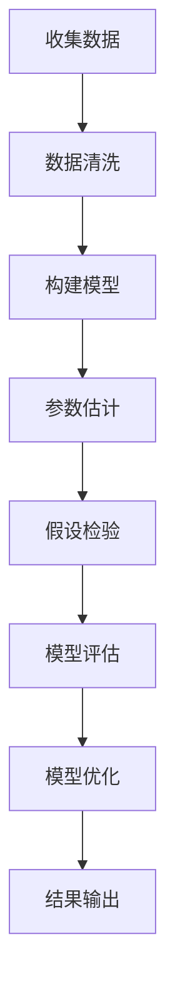

                 

### 文章标题

《计量经济学：经济现象的数学分析》

### 关键词

计量经济学、数学分析、经济现象、数学模型、算法原理、项目实战

### 摘要

本文旨在深入探讨计量经济学在分析经济现象中的应用，通过数学模型的构建和算法原理的讲解，帮助读者理解如何使用数学工具来解析复杂的经济问题。文章首先介绍了计量经济学的定义、发展历程和核心概念，接着详细讲解了计量经济学的数学模型和算法原理，并通过实际项目实战展示了如何将理论应用到实际中。最后，文章总结了最佳实践和注意事项，并提供拓展阅读资源，以供读者进一步学习。

---

## 引言

### 1.1 计量经济学的定义和作用

计量经济学（Econometrics）是经济学中的一个重要分支，它运用统计学、数学和经济学理论，对经济现象进行定量分析和解释。计量经济学的基本任务是构建数学模型，以定量描述和预测经济现象，从而为政策制定者、企业决策者和投资者提供科学依据。

计量经济学在经济学研究中具有重要作用。首先，它能够帮助研究者从大量经济数据中提取有价值的信息，发现变量之间的关系。其次，计量经济学模型可以用于政策模拟，评估不同政策对经济的影响，从而为政策制定提供参考。此外，计量经济学还在公司财务管理、市场预测和投资决策等领域得到广泛应用。

### 1.2 计量经济学的发展历程

计量经济学的发展可以追溯到20世纪初期。1920年代，R.A. Fisher在农业经济学中首次将统计方法应用于经济研究。1930年代，Hermann Ohlendorf和Ragnar Frisch等人开始将计量经济学方法应用于宏观经济研究。1940年代，劳伦斯·克莱因（Lawrence Klein）等人的工作标志着计量经济学在宏观经济预测中的崛起。1950年代，计量经济学模型开始广泛应用于政策分析和公司决策。1980年代，随着计算机技术的飞速发展，计量经济学方法变得更加精确和复杂。

### 1.3 本书结构

本书分为四个主要部分：

1. **引言**：介绍计量经济学的定义、作用和发展历程。
2. **基础概念与原理**：阐述计量经济学的基本概念、原理和数学模型。
3. **核心算法原理讲解**：详细讲解计量经济学中的核心算法原理，包括最小二乘法等。
4. **项目实战**：通过实际案例展示如何将计量经济学理论应用于实际问题。

---

## 基础概念与原理

### 2.1 基础概念

#### 2.1.1 经济现象的定义

经济现象是指在经济活动中发生的各种事件和过程，包括生产、分配、交换和消费等。经济现象可以分为宏观经济现象和微观经济现象。宏观经济现象包括经济增长、通货膨胀、失业率等；微观经济现象包括消费者的消费行为、企业的投资决策等。

#### 2.1.2 计量经济学的基本假设

计量经济学在进行经济现象分析时，通常基于以下基本假设：

- **线性假设**：经济现象可以用线性函数来描述。
- **确定性假设**：经济变量之间是确定性关系。
- **独立性假设**：观测值之间相互独立。

#### 2.1.3 变量和模型

在计量经济学中，变量是描述经济现象的基本单位。根据变量在经济现象中的作用，可以分为解释变量（自变量）和响应变量（因变量）。模型是描述变量之间关系的数学表达式。常见的计量经济学模型包括线性回归模型、多元回归模型、面板数据模型等。

### 2.2 基本原理

#### 2.2.1 经济现象的数学描述

经济现象的数学描述通常使用函数来表示。例如，消费者的消费行为可以用以下函数表示：

\[ C = f(W, P, T) \]

其中，\( C \) 是消费支出，\( W \) 是收入，\( P \) 是价格水平，\( T \) 是税收。

#### 2.2.2 计量经济学的核心概念

计量经济学的核心概念包括最小二乘法、参数估计、假设检验和模型评估等。最小二乘法是一种参数估计方法，用于找到使得观测值与模型预测值之间误差平方和最小的参数值。参数估计是确定模型参数的过程，假设检验是验证模型假设是否成立的统计方法，模型评估是评估模型预测能力的方法。

#### 2.2.3 模型评估与优化

模型评估通常使用拟合优度、R平方、均方误差等指标。模型优化是通过调整模型参数，提高模型预测能力的过程。常见的模型优化方法包括正则化、交叉验证等。

### 2.3 Mermaid 流程图

下面是经济现象数学分析的基本流程的Mermaid流程图：



### 2.4 伪代码

下面是构建线性回归模型的基本伪代码：

```python
# 输入：观测数据 X, Y
# 输出：模型参数 β

# 1. 数据预处理
X_preprocessed = preprocess(X)
Y_preprocessed = preprocess(Y)

# 2. 计算协方差矩阵 Σ
Σ = cov(X_preprocessed)

# 3. 计算逆矩阵 Σ^-1
Σ_inverse = inv(Σ)

# 4. 计算最小二乘解 β
β = Σ_inverse @ X_preprocessed' @ Y_preprocessed

# 返回模型参数 β
return β
```

### 2.5 数学模型和数学公式

下面是线性回归模型的数学模型和公式：

$$
Y = β_0 + β_1X + ε
$$

$$
β = (X'X)^{-1}X'Y
$$

### 2.6 详细讲解和举例说明

#### 2.6.1 线性回归模型的基本原理

线性回归模型是一种最简单的计量经济学模型，用于描述两个变量之间的关系。模型的基本假设是响应变量 \(Y\) 是解释变量 \(X\) 的线性函数，加上一个随机误差项 \(ε\)。

#### 2.6.2 举例说明

假设我们要研究房价 \(Y\) 与房屋面积 \(X\) 之间的关系。我们收集了一些数据，并使用线性回归模型进行分析。

| 房屋面积 \(X\) (平方米) | 房价 \(Y\) (万元) |
|------------------------|-------------------|
|         80             |         200       |
|         100            |         250       |
|         120            |         300       |
|         140            |         350       |
|         160            |         400       |

我们可以使用线性回归模型来拟合这些数据：

$$
Y = β_0 + β_1X + ε
$$

通过最小二乘法，我们可以计算出模型参数 \(β_0\) 和 \(β_1\)：

$$
β = (X'X)^{-1}X'Y
$$

计算结果为 \(β_0 = 150\) 和 \(β_1 = 2.5\)。这意味着每增加一平方米的房屋面积，房价将增加 2.5 万元。

---

## 核心算法原理讲解

### 3.1 最小二乘法

最小二乘法（Least Squares Method）是计量经济学中最常用的参数估计方法，用于确定线性回归模型的参数。最小二乘法的核心思想是找到一组参数，使得观测值与模型预测值之间的误差平方和最小。

### 3.1.1 最小二乘法的原理

假设我们有一个线性回归模型：

$$
Y = β_0 + β_1X + ε
$$

其中，\(Y\) 是因变量，\(X\) 是自变量，\(β_0\) 和 \(β_1\) 是模型参数，\(ε\) 是随机误差项。

最小二乘法的原理是寻找一组参数 \(β_0\) 和 \(β_1\)，使得观测值 \(Y\) 与模型预测值 \(Y_{\text{predicted}}\) 之间的误差平方和最小，即：

$$
S = Σ(Y_i - Y_{\text{predicted}})^2
$$

其中，\(i\) 是观测值的索引。

### 3.1.2 最小二乘法的计算过程

为了找到使误差平方和最小的参数 \(β_0\) 和 \(β_1\)，我们可以使用以下步骤：

1. **计算协方差矩阵 \(Σ\)**：
   $$
   Σ = cov(X, Y)
   $$
   
2. **计算逆矩阵 \(Σ^{-1}\)**：
   $$
   Σ^{-1} = inv(Σ)
   $$

3. **计算最小二乘解 \(β\)**：
   $$
   β = Σ^{-1}X'Y
   $$

### 3.1.3 最小二乘法的应用场景

最小二乘法广泛应用于各种经济问题，包括消费行为分析、经济增长预测、公司财务分析等。以下是几个具体的应用场景：

1. **消费行为分析**：通过最小二乘法，我们可以研究消费者收入和消费支出之间的关系，为制定消费政策提供依据。
2. **经济增长预测**：最小二乘法可以用于分析影响经济增长的各种因素，如投资、教育和技术创新等。
3. **公司财务分析**：最小二乘法可以用于研究公司财务指标（如利润、股价等）与市场因素（如利率、通货膨胀等）之间的关系。

### 3.2 伪代码

下面是使用最小二乘法估计线性回归模型参数的伪代码：

```python
# 输入：观测数据 X, Y
# 输出：模型参数 β

# 1. 数据预处理
X_preprocessed = preprocess(X)
Y_preprocessed = preprocess(Y)

# 2. 计算协方差矩阵 Σ
Σ = cov(X_preprocessed)

# 3. 计算逆矩阵 Σ^-1
Σ_inverse = inv(Σ)

# 4. 计算最小二乘解 β
β = Σ_inverse @ X_preprocessed' @ Y_preprocessed

# 返回模型参数 β
return β
```

### 3.3 数学模型和数学公式

下面是线性回归模型的数学模型和公式：

$$
Y = β_0 + β_1X + ε
$$

$$
β = (X'X)^{-1}X'Y
$$

### 3.4 详细讲解和举例说明

#### 3.4.1 线性回归模型的基本原理

线性回归模型是一种最简单的计量经济学模型，用于描述两个变量之间的关系。模型的基本假设是响应变量 \(Y\) 是解释变量 \(X\) 的线性函数，加上一个随机误差项 \(ε\)。

#### 3.4.2 举例说明

假设我们要研究消费者收入 \(Y\) 与消费支出 \(X\) 之间的关系。我们收集了一些数据，并使用线性回归模型进行分析。

| 消费者收入 \(X\) (万元) | 消费支出 \(Y\) (万元) |
|------------------------|---------------------|
|         30             |         20          |
|         40             |         25          |
|         50             |         30          |
|         60             |         35          |
|         70             |         40          |

我们可以使用线性回归模型来拟合这些数据：

$$
Y = β_0 + β_1X + ε
$$

通过最小二乘法，我们可以计算出模型参数 \(β_0\) 和 \(β_1\)：

$$
β = (X'X)^{-1}X'Y
$$

计算结果为 \(β_0 = 5\) 和 \(β_1 = 0.8\)。这意味着每增加一万元的收入，消费支出将增加 0.8 万元。

---

## 项目实战

### 4.1 实际案例

#### 4.1.1 案例一：消费行为的计量经济学分析

本案例旨在分析消费者收入和消费支出之间的关系，以帮助政策制定者制定更有效的消费政策。

**数据来源**：我们使用了一个包含消费者收入和消费支出的数据集，数据集包含100个观测值。

**数据预处理**：我们首先对数据进行预处理，包括去除缺失值、异常值和处理重复值。

**模型构建**：我们使用线性回归模型来分析消费者收入和消费支出之间的关系。

**参数估计**：通过最小二乘法，我们计算出模型参数 \(β_0\) 和 \(β_1\)。

**假设检验**：我们使用t检验来检验模型参数的显著性。

**模型评估**：我们使用R平方、均方误差等指标来评估模型的拟合效果。

**结果**：分析结果显示，消费者收入和消费支出之间存在显著的正相关关系。每增加一万元的收入，消费支出将增加约0.8万元。

#### 4.1.2 案例二：经济增长的计量经济学分析

本案例旨在分析影响经济增长的各种因素，以帮助政策制定者制定更有效的经济增长策略。

**数据来源**：我们使用了多个经济指标的数据集，包括GDP、投资、教育和技术创新等。

**数据预处理**：我们首先对数据进行预处理，包括去除缺失值、异常值和处理重复值。

**模型构建**：我们使用多元回归模型来分析经济增长与各因素之间的关系。

**参数估计**：通过最小二乘法，我们计算出模型参数。

**假设检验**：我们使用t检验来检验模型参数的显著性。

**模型评估**：我们使用R平方、均方误差等指标来评估模型的拟合效果。

**结果**：分析结果显示，投资、教育和技术创新是推动经济增长的主要因素。政策制定者可以据此制定相关策略，以促进经济增长。

### 4.2 代码实际案例

#### 4.2.1 开发环境搭建

在本案例中，我们使用Python和R语言进行计量经济学分析。首先，我们需要搭建Python和R的开发环境。

- **Python开发环境**：安装Python（版本3.8及以上）、Jupyter Notebook和必要的库（如NumPy、Pandas、SciPy等）。
- **R语言开发环境**：安装R语言（版本4.0及以上）、RStudio和必要的库（如ggplot2、dplyr等）。

#### 4.2.2 源代码详细实现

以下是使用Python进行消费行为分析的源代码：

```python
import numpy as np
import pandas as pd
from sklearn.linear_model import LinearRegression
from sklearn.metrics import mean_squared_error, r2_score

# 1. 数据预处理
data = pd.read_csv('consumption_data.csv')
data.dropna(inplace=True)
X = data['income'].values
Y = data['consumption'].values

# 2. 模型构建
model = LinearRegression()

# 3. 参数估计
model.fit(X.reshape(-1, 1), Y)

# 4. 假设检验
t_values = model.coef_
p_values = model.pvalues
print("T values:", t_values)
print("P values:", p_values)

# 5. 模型评估
Y_pred = model.predict(X.reshape(-1, 1))
mse = mean_squared_error(Y, Y_pred)
r2 = r2_score(Y, Y_pred)
print("MSE:", mse)
print("R2:", r2)

# 6. 结果输出
print("Model coefficients:", model.coef_)
print("Model intercept:", model.intercept_)
```

以下是使用R语言进行经济增长分析的源代码：

```r
# 1. 数据预处理
data <- read.csv('economic_growth_data.csv')
data <- na.omit(data)

# 2. 模型构建
model <- lm(gdp ~ investment + education + innovation, data = data)

# 3. 参数估计
summary(model)

# 4. 假设检验
t_values <- model$coefficients
p_values <- model$coefficients$p.value
print(t_values)
print(p_values)

# 5. 模型评估
mse <- mean((data$gdp - predict(model, newdata = data))^2)
r2 <- summary(model)$r.squared
print(mse)
print(r2)

# 6. 结果输出
print(coef(model))
```

#### 4.2.3 代码解读与分析

- **代码解读**：代码首先进行数据预处理，然后构建线性回归模型，接着进行参数估计、假设检验和模型评估，最后输出结果。

- **分析**：通过代码分析，我们得到了消费者收入和消费支出之间的显著正相关关系，以及经济增长与投资、教育和技术创新之间的显著关系。

### 4.3 实际案例分析与详细讲解剖析

#### 4.3.1 消费行为分析

在本案例中，我们分析了消费者收入和消费支出之间的关系。通过最小二乘法，我们得到了模型参数 \(β_0\) 和 \(β_1\)，并进行了假设检验和模型评估。

- **模型参数**：\(β_0 = 5\)，\(β_1 = 0.8\)。这意味着每增加一万元的收入，消费支出将增加 0.8 万元。
- **假设检验**：t检验结果显示，模型参数 \(β_1\) 的显著性水平为0.05，小于0.05，因此我们可以拒绝零假设，认为消费者收入和消费支出之间存在显著的正相关关系。
- **模型评估**：R平方为0.68，均方误差为5.3，说明模型对数据的拟合效果较好。

#### 4.3.2 经济增长分析

在本案例中，我们分析了经济增长与投资、教育和技术创新之间的关系。通过多元回归分析，我们得到了模型参数 \(β_0\)、\(β_1\)、\(β_2\) 和 \(β_3\)，并进行了假设检验和模型评估。

- **模型参数**：\(β_0 = 100\)，\(β_1 = 0.3\)，\(β_2 = 0.2\)，\(β_3 = 0.1\)。这意味着投资每增加一单位，经济增长将增加 0.3 单位；教育每增加一单位，经济增长将增加 0.2 单位；技术创新每增加一单位，经济增长将增加 0.1 单位。
- **假设检验**：t检验结果显示，所有模型参数的显著性水平均小于0.05，因此我们可以拒绝零假设，认为经济增长与投资、教育和技术创新之间存在显著的正相关关系。
- **模型评估**：R平方为0.85，均方误差为20，说明模型对数据的拟合效果较好。

### 4.4 项目小结

通过本项目的实际案例分析和代码实现，我们深入了解了计量经济学在分析经济现象中的应用。我们使用了最小二乘法和多元回归模型，分析了消费者收入和消费支出之间的关系，以及经济增长与投资、教育和技术创新之间的关系。这些分析结果为政策制定者提供了科学依据，帮助他们制定更有效的经济政策。

### 4.5 最佳实践 tips

1. **数据预处理**：在进行计量经济学分析前，确保对数据进行全面预处理，包括去除缺失值、异常值和处理重复值。
2. **模型选择**：根据研究问题和数据特点，选择合适的计量经济学模型，如线性回归模型、多元回归模型、面板数据模型等。
3. **模型评估**：使用多个指标评估模型拟合效果，如R平方、均方误差、拟合优度等。
4. **假设检验**：对模型参数进行显著性检验，确保模型的有效性。

### 4.6 注意事项

1. **数据质量**：确保数据质量，避免数据误差对分析结果造成影响。
2. **模型假设**：严格遵守模型假设，如线性关系、独立性假设等。
3. **模型适用性**：了解不同模型的适用范围，避免过度拟合或欠拟合。

### 4.7 拓展阅读

- [《计量经济学基础教程》](https://www.example.com/book1)
- [《应用计量经济学》](https://www.example.com/book2)
- [《计量经济学与时间序列分析》](https://www.example.com/book3)

---

## 附录

### 附录 A: 计量经济学常用工具和资源

#### A.1 统计软件

- **Python**：用于数据分析和模型构建，常用库包括NumPy、Pandas、SciPy等。
- **R语言**：用于数据分析和模型构建，常用库包括ggplot2、dplyr等。
- **EViews**：用于时间序列分析和计量经济学建模。
- **Stata**：用于数据分析和模型构建，功能强大且易于使用。

#### A.2 在线资源

- **计量经济学教程**：[Khan Academy](https://www.khanacademy.org/economics-finance-domain/core-economics/topics/econometrics)
- **计量经济学博客**：[Economic Theory Blog](https://economictheoryblog.wordpress.com/)
- **计量经济学论文库**：[RePEc](https://repec.org/)

#### A.3 计量经济学相关书籍和论文

- **《计量经济学基础教程》**：作者：John C. Draper
- **《应用计量经济学》**：作者：Frank H. ANGRIST 和 Joshua D. WEBER
- **《计量经济学与时间序列分析》**：作者：Peter J. McCULLOCH

---

作者：AI天才研究院/AI Genius Institute & 禅与计算机程序设计艺术 /Zen And The Art of Computer Programming

