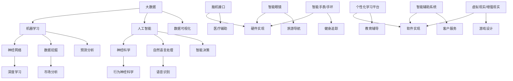

                 

## 第1章：认知增强技术的概述

### 1.1 认知增强技术的定义与历史

#### 1.1.1 认知增强技术的定义

认知增强技术（Cognitive Augmentation Technologies, CAT）是指通过外部设备或软件系统，对人类大脑的认知能力进行增强的一类技术。这些技术可以帮助人类在感知、记忆、思维、学习等认知活动中表现得更加出色。具体来说，认知增强技术可以包括以下几个方面：

- **增强感知**：利用传感器和机器视觉技术，提高人类的感知能力，如增强现实（AR）和虚拟现实（VR）技术。

- **增强记忆**：通过记忆辅助工具，如电子笔记和记忆增强应用，提高人类的记忆效率和准确性。

- **增强思维**：使用人工智能算法和思维导图等工具，帮助人类进行更高效、更有逻辑的思维活动。

- **增强学习**：利用在线教育平台和虚拟教学环境，提供个性化的学习体验，提高学习效果。

#### 1.1.2 认知增强技术的历史

认知增强技术的发展可以追溯到古代，比如使用记忆宫殿来帮助记忆。现代认知增强技术起源于20世纪80年代，随着计算机技术的发展，开始有学者提出利用计算机来增强人类的认知能力。21世纪初，随着人工智能和神经科学的发展，认知增强技术得到了更多的关注和应用。以下是认知增强技术发展的几个重要里程碑：

- **20世纪80年代**：计算机辅助设计和计算机模拟技术的出现，使得人类能够在复杂问题中快速获取信息，提高工作效率。

- **21世纪初**：智能手机和平板电脑的普及，使得认知增强应用得以广泛传播，如移动学习应用和健康监测设备。

- **2010年后**：人工智能和大数据技术的快速发展，使得认知增强技术开始融入更广泛的应用场景，如个性化医疗和智能教育。

### 1.2 认知增强技术的应用领域

#### 1.2.1 教育领域的应用

在教育领域，认知增强技术已经被广泛应用于个性化学习、在线教育、虚拟现实教学等方面。通过这些技术，可以显著提高学习效率，促进知识的深度理解和记忆。

- **个性化学习**：通过分析学生的学习行为和成绩，提供个性化的学习路径和资源，帮助学生实现个性化学习。

- **在线教育**：利用网络平台，提供丰富的在线课程和学习资源，使学生能够随时随地学习。

- **虚拟现实教学**：通过虚拟现实技术，为学生提供沉浸式的学习体验，增强学习效果。

#### 1.2.2 医疗领域的应用

在医疗领域，认知增强技术主要用于疾病诊断、患者护理、医学教育等方面。

- **疾病诊断**：利用人工智能算法和大数据分析，提高疾病诊断的准确性和效率。

- **患者护理**：通过智能监控设备，实时监测患者的健康状况，提高护理质量。

- **医学教育**：利用虚拟现实和增强现实技术，为学生提供更直观、更生动的医学教学体验。

#### 1.2.3 军事领域的应用

在军事领域，认知增强技术主要用于军事模拟、情报分析和作战指挥等方面。

- **军事模拟**：通过模拟环境，帮助士兵进行训练和演练，提高作战能力。

- **情报分析**：利用大数据分析和人工智能算法，从大量信息中提取有价值的信息，支持决策。

- **作战指挥**：通过智能决策系统，为指挥官提供实时、准确的作战建议，提高作战效果。

### 1.3 认知增强技术的优势与挑战

#### 1.3.1 认知增强技术的优势

- **提高工作效率**：通过增强人类的感知、记忆、思维和学习能力，显著提高工作效率。

- **优化决策过程**：利用人工智能和大数据分析，提供更准确、更全面的信息支持决策。

- **促进创新**：为人类提供更强大的认知能力，有助于推动科学研究和技术创新。

- **改善生活质量**：通过个性化医疗和教育，提高人们的生活质量和幸福感。

#### 1.3.2 认知增强技术的挑战

- **伦理问题**：如何确保技术的使用不会侵犯个人隐私，如何处理人机关系等问题。

- **技术成熟度**：虽然认知增强技术发展迅速，但仍然存在许多技术难题需要解决。

- **社会接受度**：认知增强技术可能改变人们的生活方式和工作方式，如何确保社会对这项技术的接受度。

在接下来的章节中，我们将进一步探讨认知增强技术的工作原理、伦理问题以及在不同领域的应用。让我们一起来深入了解这一前沿科技领域，思考其带来的机遇和挑战。## 第2章：认知增强技术的工作原理

### 2.1 大数据和机器学习

#### 2.1.1 大数据的概念

大数据（Big Data）是指数据量巨大、类型繁多、价值密度低、处理速度快的信息集合。大数据通常包括结构化数据、半结构化数据和非结构化数据，如文本、图像、视频、音频等。大数据的关键特征可以用3V来概括：数据量（Volume）、数据速度（Velocity）和数据多样性（Variety）。

#### 2.1.2 机器学习的基础

机器学习（Machine Learning）是人工智能（Artificial Intelligence, AI）的一个重要分支，主要研究如何使计算机系统能够从数据中自动学习并作出决策。机器学习算法可以分为监督学习、无监督学习和强化学习。

- **监督学习**：通过已知的输入和输出，训练模型来预测新的输入对应的输出。

- **无监督学习**：在没有已知输出标签的情况下，通过分析数据间的结构和关系来发现数据中的模式和规律。

- **强化学习**：通过与环境的交互，不断调整策略，以实现最大化累积奖励。

### 2.2 人工智能与神经科学

#### 2.2.1 人工智能的基本概念

人工智能（Artificial Intelligence, AI）是指通过计算机模拟人类智能的行为，实现感知、思考、学习、决策等过程的技术。人工智能可以分为弱人工智能和强人工智能。

- **弱人工智能**：指在特定领域内表现出人类智能的计算机程序。

- **强人工智能**：指具有全面认知能力，能够像人类一样理解、学习和适应各种环境和情境的计算机智能。

#### 2.2.2 神经科学的基本概念

神经科学（Neuroscience）是研究神经系统结构和功能的科学，包括神经细胞、神经元之间的连接以及神经系统的整体功能。神经科学的研究成果对认知增强技术的设计和应用有着重要的影响。

- **神经元**：是神经系统的基本单位，负责传递电信号。

- **神经网络**：是模拟人脑结构的计算机模型，用于处理和分析信息。

### 2.3 认知增强技术的实现方法

#### 2.3.1 硬件实现

硬件实现是指通过物理设备来增强人类认知能力。常见的硬件实现方法包括：

- **脑机接口**（Brain-Computer Interface, BCI）：通过直接连接大脑和计算机，将大脑信号转化为计算机指令。

- **智能眼镜**：通过增强现实（AR）技术，提供额外的视觉信息，辅助人类感知和理解环境。

- **智能手表和手环**：通过健康监测功能，实时跟踪用户的生理和心理状态，提供个性化的建议和干预。

#### 2.3.2 软件实现

软件实现是指通过计算机程序和算法来增强人类认知能力。常见的软件实现方法包括：

- **个性化学习平台**：通过分析学习者的行为数据，提供个性化的学习资源和路径。

- **智能辅助系统**：通过自然语言处理和机器学习技术，提供问答、提醒和决策支持。

- **虚拟现实和增强现实应用**：通过模拟和增强现实环境，提供沉浸式的学习和工作体验。

### 2.4 认知增强技术的核心概念与联系

为了更好地理解认知增强技术的工作原理，我们可以使用Mermaid流程图来展示核心概念之间的关系架构。以下是认知增强技术的核心概念关系图：



通过上述流程图，我们可以看到大数据和机器学习是认知增强技术的基础，它们与人工智能和神经科学紧密相关。同时，硬件实现和软件实现是认知增强技术的两大实现途径，分别通过脑机接口、智能眼镜、智能手表/手环等硬件设备和个性化学习平台、智能辅助系统、虚拟现实/增强现实等软件应用来实现认知增强。

### 2.5 认知增强技术的核心算法原理讲解

为了深入理解认知增强技术的核心算法原理，我们将使用伪代码来详细阐述几个关键算法。

#### 2.5.1 支持向量机（SVM）算法

支持向量机是一种监督学习算法，主要用于分类问题。以下是SVM算法的伪代码：

```plaintext
输入：训练数据集 D = {(x1, y1), (x2, y2), ..., (xn, yn)}
输出：分类模型 f(x)

初始化：选择适当的核函数 K(x, x')

计算最优超平面：
    最小化损失函数 L(w, b) = 1/2 * ||w||^2 + C * Σ[λi]

求解拉格朗日乘子：
    L(w, b, λ) = 1/2 * ||w||^2 + C * Σ[λi - yi * (w * xi + b)]

求解最优化问题：
    求解以下方程组：
        0 = w * w + C * λ
        λi ≥ 0
        yi * (w * xi + b) = 1

输出：分类模型 f(x) = sign(w * xi + b)
```

#### 2.5.2 深度学习算法

深度学习算法是一种无监督学习算法，主要用于特征提取和分类。以下是深度学习算法的伪代码：

```plaintext
输入：训练数据集 D = {x1, x2, ..., xn}
输出：特征提取模型 F(x)

初始化：随机选择初始权重和偏置

正向传播：
    对于每个训练样本 xi：
        计算输入特征向量 h1 = F(x; W1, B1)
        计算隐藏层输出 h2 = F(h1; W2, B2)
        ...
        计算输出层输出 y = F(hn; Wn, Bn)

反向传播：
    计算输出误差 dy = y - y'
    对于每个隐藏层 h：
        计算误差 dh = ∂L/∂h
        更新权重 W 和偏置 B

重复正向传播和反向传播，直到收敛
```

#### 2.5.3 神经网络算法

神经网络算法是一种模拟人脑结构的计算模型，主要用于数据分析和决策。以下是神经网络算法的伪代码：

```plaintext
输入：训练数据集 D = {(x1, y1), (x2, y2), ..., (xn, yn)}
输出：神经网络模型 F(x)

初始化：随机选择初始权重和偏置

正向传播：
    对于每个训练样本 xi：
        计算输入特征向量 xi
        通过多个隐藏层进行信息传递
        计算输出层输出 y = F(hn; Wn, Bn)

反向传播：
    计算输出误差 dy = y - y'
    通过反向传播计算每个层的误差
    更新权重和偏置

重复正向传播和反向传播，直到收敛
```

通过上述伪代码，我们可以看到认知增强技术的核心算法原理。这些算法通过模拟人脑结构和功能，实现数据的特征提取、模式识别和分类，为认知增强技术的实现提供了理论基础。在接下来的章节中，我们将进一步探讨认知增强技术的伦理问题和在不同领域的应用。## 第3章：认知增强技术的伦理问题

### 3.1 隐私保护

#### 3.1.1 数据收集与存储

在认知增强技术的应用过程中，大量的数据被收集和存储。这些数据可能包括个人的生物特征信息、行为数据、学习记录等。如何保护这些数据不被滥用是一个重要的伦理问题。

- **数据收集**：在收集数据时，应确保数据收集的合法性和必要性，避免过度收集。

- **数据存储**：在存储数据时，应采用加密技术来保护数据安全，防止数据泄露。

#### 3.1.2 数据泄露的风险

数据泄露是认知增强技术面临的一个主要风险。一旦数据泄露，可能会导致个人隐私受到侵犯，甚至对社会造成严重影响。

- **防范措施**：采用先进的加密技术和访问控制策略，确保数据在传输和存储过程中的安全性。

- **应急响应**：制定应急响应计划，一旦发生数据泄露，能够迅速采取措施，降低损失。

### 3.2 数据安全

#### 3.2.1 数据加密

数据加密是保护数据安全的重要手段。通过加密技术，可以确保数据在传输和存储过程中的安全性。

- **加密算法**：选择合适的加密算法，如AES（高级加密标准）和RSA（RSA加密算法），确保数据的保密性和完整性。

- **密钥管理**：确保密钥的安全存储和传输，防止密钥泄露。

#### 3.2.2 数据共享

在认知增强技术的应用中，数据共享是提高效率和效果的重要手段。但如何确保数据共享的安全性和合规性是一个重要问题。

- **数据共享协议**：制定明确的数据共享协议，确保数据的共享符合相关法律法规和伦理标准。

- **隐私保护技术**：采用隐私保护技术，如差分隐私和同态加密，确保数据在共享过程中的隐私性。

### 3.3 人机关系

#### 3.3.1 人机交互

在人机交互方面，认知增强技术可能带来一些伦理问题。

- **人机平衡**：如何在增强人类认知能力的同时，保持人类的主导地位，避免过度依赖技术。

- **用户隐私**：在提供人机交互服务时，如何保护用户的隐私，避免用户的个人信息被滥用。

#### 3.3.2 机器伦理

随着认知增强技术的发展，机器伦理成为一个越来越重要的话题。如何确保机器的行为符合伦理标准，避免机器对人类造成伤害，是一个亟待解决的问题。

- **伦理准则**：制定明确的伦理准则，确保机器的行为符合道德和法律要求。

- **伦理审查**：在机器学习和人工智能系统的设计和应用过程中，进行伦理审查，确保技术发展的方向是正确的。

### 3.4 社会影响

#### 3.4.1 社会公平

认知增强技术可能会对社会公平产生影响。如何确保技术发展不会加剧社会不平等，是一个重要问题。

- **公平性原则**：在认知增强技术的应用过程中，应遵循公平性原则，确保所有人都能平等地享受技术带来的好处。

- **技术普及**：推动技术普及，确保技术的收益能够惠及更广泛的社会群体。

#### 3.4.2 社会不平等

认知增强技术可能会加剧社会不平等。如何解决这一问题，是一个重要挑战。

- **政策干预**：通过政策干预，如提供补贴和税收优惠，鼓励企业和社会组织推动技术普及。

- **教育普及**：提高公众对认知增强技术的认识和接受度，减少技术带来的负面影响。

### 3.5 伦理考量的综合分析

认知增强技术的伦理考量是一个复杂的问题，需要从多个方面进行综合分析。

- **隐私保护**：确保个人隐私不被侵犯，是认知增强技术发展的基础。

- **数据安全**：保护数据安全，防止数据泄露，是认知增强技术应用的必要条件。

- **人机关系**：处理好人机关系，确保人类在认知增强技术中的应用中保持主导地位。

- **社会公平**：确保技术发展不会加剧社会不平等，是实现可持续发展的重要目标。

通过上述综合分析，我们可以看到，认知增强技术的伦理考量是一个多层次、多方面的问题。只有在充分考虑这些问题的前提下，认知增强技术才能实现可持续、健康发展。在接下来的章节中，我们将进一步探讨认知增强技术在不同领域的应用。## 第4章：认知增强技术的应用场景

### 4.1 教育领域的认知增强技术

#### 4.1.1 在线学习平台

在线学习平台是认知增强技术在教育领域的重要应用之一。通过在线学习平台，学生可以随时随地获取学习资源，进行自主学习和互动学习。

- **平台的构建**：在线学习平台通常包括课程发布、学习管理、作业提交、成绩统计等功能。平台的设计需要考虑用户体验，确保学习过程的流畅和便捷。

- **平台的功能**：在线学习平台的功能包括课程视频、文档资料、互动问答、在线测试等。通过这些功能，学生可以全方位地参与到学习过程中，提高学习效果。

#### 4.1.2 个性化学习

个性化学习是认知增强技术在教育领域的又一重要应用。通过分析学生的学习行为和成绩数据，平台可以提供个性化的学习资源和学习路径，帮助学生实现个性化学习。

- **个性化学习的原理**：个性化学习的原理是基于学习分析技术，通过收集和分析学生的学习行为和成绩数据，识别学生的学习需求和特点，提供相应的学习资源和学习路径。

- **个性化学习的方法**：个性化学习的方法包括自适应学习、推荐系统和学习路径规划等。自适应学习可以根据学生的学习进度和成绩，动态调整学习内容和难度；推荐系统可以根据学生的学习兴趣和学习习惯，推荐相关的学习资源和课程；学习路径规划可以根据学生的学习需求和特点，制定个性化的学习计划。

#### 4.1.3 虚拟现实教学

虚拟现实（VR）技术是认知增强技术在教育领域的又一重要应用。通过虚拟现实技术，学生可以沉浸在虚拟的学习环境中，进行沉浸式的学习和互动。

- **虚拟现实技术的应用**：虚拟现实技术的应用包括虚拟课堂、虚拟实验室、虚拟旅游等。通过虚拟现实技术，学生可以模拟真实的学习场景，增强学习体验。

- **虚拟现实教学的优势**：虚拟现实教学的优势包括增强学习体验、提高学习效果、降低学习成本等。通过虚拟现实技术，学生可以亲身体验和学习，提高学习的趣味性和互动性，从而提高学习效果。

### 4.2 医疗领域的认知增强技术

#### 4.2.1 疾病诊断

疾病诊断是认知增强技术在医疗领域的重要应用之一。通过认知增强技术，可以提高疾病诊断的准确性和效率。

- **诊断模型的建立**：疾病诊断模型的建立通常基于机器学习和人工智能技术，通过对大量医疗数据进行分析和训练，构建能够诊断疾病的模型。

- **诊断结果的预测**：通过诊断模型，可以对患者的病情进行预测和分析，提供诊断建议。诊断结果的预测可以帮助医生快速识别疾病，制定治疗方案。

#### 4.2.2 患者护理

患者护理是认知增强技术在医疗领域的另一个重要应用。通过认知增强技术，可以提高患者护理的质量和效率。

- **患者信息的管理**：通过认知增强技术，可以实现对患者信息的全面管理，包括患者的基本信息、病史、治疗方案等。患者信息的管理有助于提高护理工作的效率和质量。

- **患者情绪的监测**：通过认知增强技术，可以对患者的情绪进行监测和分析，识别患者的情绪状态，提供相应的心理支持和干预。

#### 4.2.3 医学教育

医学教育是认知增强技术在医疗领域的又一重要应用。通过认知增强技术，可以提高医学教育的质量和效果。

- **医学知识的传播**：通过认知增强技术，可以将医学知识以更加生动、直观的方式传授给学生，提高医学知识的传播效果。

- **医学教育的创新**：通过认知增强技术，可以探索新的医学教育模式，如虚拟手术训练、远程教学等，提高医学教育的创新性和灵活性。

### 4.3 军事领域的认知增强技术

#### 4.3.1 军事模拟

军事模拟是认知增强技术在军事领域的重要应用之一。通过军事模拟，可以模拟真实的军事环境和任务，帮助士兵进行训练和演练。

- **模拟环境的构建**：军事模拟环境的构建通常基于虚拟现实和增强现实技术，可以模拟各种军事场景和任务。

- **模拟结果的评估**：通过评估模拟结果，可以评估士兵的训练效果，发现存在的问题，提供改进建议。

#### 4.3.2 情报分析

情报分析是认知增强技术在军事领域的另一个重要应用。通过认知增强技术，可以实现对大量情报信息的快速分析和处理，为军事决策提供支持。

- **情报收集与处理**：通过认知增强技术，可以实现对情报信息的快速收集和处理，包括图像识别、语音识别、文本分析等。

- **情报分析的算法**：情报分析的算法通常基于机器学习和人工智能技术，可以实现对情报信息的自动分析和分类，提高情报分析的效果。

#### 4.3.3 作战指挥

作战指挥是认知增强技术在军事领域的又一重要应用。通过认知增强技术，可以实现对军事作战的实时指挥和决策支持。

- **作战计划的制定**：通过认知增强技术，可以实现对作战计划的快速制定和优化，提高作战计划的科学性和可行性。

- **作战效果的评估**：通过认知增强技术，可以实现对作战效果的实时评估和反馈，为后续作战提供支持。

### 4.4 认知增强技术的综合应用

认知增强技术在各个领域的应用，不仅提高了效率和效果，还带来了新的挑战和问题。如何平衡技术应用与社会伦理，是一个需要持续探讨的问题。

- **技术发展与伦理考量**：在认知增强技术的应用过程中，需要充分考虑伦理考量，确保技术的发展符合社会伦理和道德要求。

- **技术应用与人才培养**：在认知增强技术的应用过程中，需要加强人才培养，提高人们对技术的认知和接受度，确保技术的可持续发展。

- **技术应用与社会公平**：在认知增强技术的应用过程中，需要关注社会公平问题，确保技术的收益能够惠及更广泛的社会群体。

通过上述分析，我们可以看到，认知增强技术在各个领域的应用，不仅带来了技术变革，也带来了伦理和社会挑战。只有在充分考虑这些问题的基础上，认知增强技术才能实现可持续、健康发展。## 第5章：认知增强技术的未来发展趋势

### 5.1 新兴技术的融合

#### 5.1.1 5G技术

5G技术作为下一代通信技术，其高速、低延迟和高可靠性的特点，为认知增强技术的应用提供了强大的基础设施支持。5G技术的应用，使得认知增强技术的数据处理和传输速度大幅提升，促进了认知增强技术在实时性要求较高的领域，如智能医疗和自动驾驶中的应用。

- **实时数据处理**：5G技术的高带宽和低延迟特性，使得大规模数据处理和分析成为可能，为认知增强技术的实时决策提供了基础。

- **远程交互**：5G技术使得远程交互更加流畅，为认知增强技术在虚拟现实和增强现实领域的应用提供了更好的用户体验。

#### 5.1.2 虚拟现实技术

虚拟现实（VR）技术和增强现实（AR）技术是认知增强技术的重要实现手段。随着技术的不断成熟，VR和AR技术在认知增强领域的应用前景广阔。

- **沉浸式学习**：VR技术可以为学习者提供沉浸式的学习体验，增强学习的趣味性和互动性。

- **远程协作**：AR技术可以通过增强现实界面，实现远程协作，提高工作效率。

### 5.2 伦理问题的解决

#### 5.2.1 隐私保护

隐私保护是认知增强技术面临的重要伦理问题。随着技术的进步，隐私保护技术也在不断发展。

- **差分隐私**：差分隐私是一种隐私保护技术，通过在数据中加入噪声，确保单个个体的隐私不被泄露。

- **同态加密**：同态加密是一种加密技术，允许在密文中进行计算，而不需要解密，从而保护数据隐私。

#### 5.2.2 数据安全

数据安全是认知增强技术的另一个关键问题。随着数据量的增加，数据安全风险也在增大。

- **分布式存储**：分布式存储技术可以提高数据的可靠性，防止数据丢失。

- **区块链技术**：区块链技术可以确保数据的不可篡改性和透明性，提高数据安全。

### 5.3 社会影响的积极应对

#### 5.3.1 公平性问题

公平性问题是认知增强技术带来的重要社会影响之一。如何确保技术发展不会加剧社会不平等，是一个重要挑战。

- **政策引导**：通过政策引导，鼓励企业和社会组织关注公平性问题，制定相应的措施，确保技术发展的公平性。

- **技术普及**：通过技术普及，提高公众对认知增强技术的认知和接受度，减少技术带来的负面影响。

#### 5.3.2 不平等问题的解决

不平等问题是一个复杂的社会问题，认知增强技术可以在一定程度上缓解这一问题。

- **教育资源**：通过认知增强技术，提供个性化的教育资源，提高教育公平性。

- **医疗资源**：通过认知增强技术，提高医疗服务的效率和质量，缩小医疗资源的不平等。

### 5.4 认知增强技术的未来发展展望

#### 5.4.1 技术创新

随着技术的不断发展，认知增强技术将不断涌现出新的创新应用。例如，脑机接口技术将使人类与机器的交互更加紧密，虚拟现实技术将使人类的学习和工作方式发生重大变革。

#### 5.4.2 应用拓展

认知增强技术的应用领域将不断拓展，从教育、医疗、军事等领域，到智能家居、智能交通等民用领域，认知增强技术都将发挥重要作用。

#### 5.4.3 社会影响

认知增强技术将对社会产生深远影响，不仅改变人们的生活方式和工作方式，还将影响社会的结构和发展方向。

通过上述分析，我们可以看到，认知增强技术的未来发展趋势充满机遇和挑战。在技术创新、伦理问题和社会影响的共同推动下，认知增强技术将不断推动社会进步，为人类带来更多的福祉。## 第6章：认知增强技术的国际发展

### 6.1 各国认知增强技术的发展状况

#### 6.1.1 美国的认知增强技术

美国在认知增强技术领域处于领先地位，其研发和应用水平在全球范围内具有很高的影响力。美国的认知增强技术研究主要集中在脑机接口、虚拟现实和增强现实、人工智能与神经科学等领域。

- **脑机接口**：美国的研究机构和企业，如布朗大学和特斯拉公司，致力于研发高精度、低延迟的脑机接口技术，旨在实现人类大脑与计算机的直接交互。

- **虚拟现实与增强现实**：美国企业如Facebook（现Meta）、谷歌和微软，在虚拟现实和增强现实技术方面具有强大的研发实力，推出了一系列领先的产品和服务。

- **人工智能与神经科学**：美国的科研机构和高校，如斯坦福大学和麻省理工学院，在人工智能与神经科学领域开展了广泛的研究，为认知增强技术的理论和应用提供了坚实的基础。

#### 6.1.2 欧洲的认知增强技术

欧洲在认知增强技术领域也有显著的发展，其研究重点主要涉及隐私保护、社会影响和医疗应用等方面。

- **隐私保护**：欧洲在数据隐私保护方面具有严格的法律法规，如《通用数据保护条例》（GDPR），推动认知增强技术在隐私保护方面的研究和发展。

- **医疗应用**：欧洲的研究机构和企业，如德国的西门子和法国的赛诺菲，在认知增强技术在医疗领域的应用方面取得了重要成果，如智能诊断、个性化治疗等。

- **教育应用**：欧洲各国，如英国、法国和德国，在教育领域积极推广认知增强技术，通过在线学习平台、虚拟现实教学等手段，提高教育质量和效率。

#### 6.1.3 亚洲的认知增强技术

亚洲在认知增强技术领域的发展也备受关注，尤其以中国、日本和韩国为代表。

- **中国**：中国在认知增强技术领域投入了大量资金和人力，积极推动脑机接口、虚拟现实和人工智能的研究。中国的企业和研究机构，如华为、百度和清华大学，在认知增强技术的研发和应用方面取得了显著进展。

- **日本**：日本在认知增强技术，特别是脑机接口和医疗应用方面具有独特的优势。日本的研究机构和企业，如东京大学和索尼公司，致力于研发高精度、实用的认知增强技术。

- **韩国**：韩国在虚拟现实和增强现实技术方面取得了重要突破，韩国企业如三星和LG在虚拟现实头戴设备、增强现实应用方面具有很高的市场占有率。

### 6.2 国际合作的现状与展望

#### 6.2.1 国际合作的意义

国际合作在认知增强技术领域具有重要意义。通过国际合作，各国可以共享资源和知识，推动技术的快速发展和创新。

- **资源整合**：国际合作有助于整合各国在认知增强技术领域的研发资源，提高研发效率。

- **知识共享**：国际合作可以促进各国在认知增强技术领域的知识交流，加速技术的进步和应用。

- **市场开拓**：国际合作有助于开拓国际市场，推动认知增强技术的商业化应用。

#### 6.2.2 国际合作的发展趋势

随着认知增强技术的快速发展，国际合作也在不断加强。

- **项目合作**：各国研究机构和企业之间的项目合作不断增加，共同开展认知增强技术的研究和应用。

- **技术交流**：国际会议、研讨会等活动成为各国分享认知增强技术研究成果的重要平台。

- **政策协调**：各国政府逐渐认识到认知增强技术的重要性和潜在影响，开始加强政策协调，推动技术发展。

#### 6.2.3 未来展望

在未来，国际合作在认知增强技术领域将发挥更加重要的作用。

- **技术创新**：国际合作将推动认知增强技术的创新和发展，促进新兴技术的突破和应用。

- **市场融合**：国际合作将促进全球认知增强技术市场的融合，推动技术的普及和应用。

- **社会影响**：国际合作将有助于平衡社会影响，确保认知增强技术的健康发展，为人类社会带来更多的福祉。

通过加强国际合作，各国可以共同应对认知增强技术带来的挑战，推动技术发展，为人类社会创造更多的价值。## 第7章：认知增强技术的未来社会影响

### 7.1 对社会生产的影响

#### 7.1.1 生产效率的提升

认知增强技术在社会生产中的影响显著，尤其在提高生产效率方面。通过认知增强技术，企业可以实时获取和分析大量生产数据，优化生产流程，减少浪费，提高资源利用率。

- **实时监控**：认知增强技术可以实现对生产过程的实时监控，快速发现和解决问题，确保生产线的稳定运行。

- **智能决策**：利用机器学习和数据分析，认知增强技术可以帮助企业制定更科学的决策，提高生产效率。

#### 7.1.2 生产模式的改变

认知增强技术不仅提升了生产效率，还改变了传统的生产模式。

- **定制化生产**：通过个性化数据分析，企业可以根据客户需求进行定制化生产，提高客户满意度。

- **智能制造**：认知增强技术与物联网（IoT）结合，实现了生产设备的智能化，推动了智能制造的发展。

### 7.2 对社会生活的影响

#### 7.2.1 生活质量的提升

认知增强技术在提升生活质量方面发挥了重要作用。

- **健康监测**：通过智能穿戴设备和健康监测系统，认知增强技术可以实时监测个人健康状况，提供个性化的健康建议。

- **便捷服务**：虚拟现实和增强现实技术使得远程办公、在线教育、娱乐体验更加便捷，提升了人们的日常生活质量。

#### 7.2.2 社会结构的改变

认知增强技术的应用也带来了社会结构的改变。

- **劳动力市场**：随着自动化和智能化的推进，劳动力市场结构发生变化，对劳动者的技能要求提高，同时也创造了新的就业机会。

- **城乡差距**：认知增强技术有助于缩小城乡差距，通过远程教育和远程医疗服务，提高农村地区的教育水平和医疗服务质量。

### 7.3 对教育、医疗、军事等领域的深远影响

#### 7.3.1 教育领域的深远影响

在教育领域，认知增强技术推动了教育模式的变革。

- **个性化教育**：通过分析学生的学习行为和成绩，认知增强技术为每个学生提供个性化的学习资源，提高学习效果。

- **虚拟课堂**：虚拟现实和增强现实技术使教育更加生动和互动，提高了教学效果。

#### 7.3.2 医疗领域的深远影响

在医疗领域，认知增强技术的应用极大地提升了医疗服务的质量和效率。

- **智能诊断**：利用人工智能和大数据分析，认知增强技术可以辅助医生进行疾病诊断，提高诊断的准确性和速度。

- **个性化治疗**：通过分析患者的病史和基因信息，认知增强技术可以为患者制定个性化的治疗方案。

#### 7.3.3 军事领域的深远影响

在军事领域，认知增强技术为军事作战和训练提供了强大的支持。

- **模拟训练**：通过虚拟现实和增强现实技术，士兵可以进行沉浸式的训练，提高作战能力。

- **智能决策**：利用人工智能和大数据分析，认知增强技术可以帮助指挥官进行更科学、更高效的决策。

### 7.4 未来影响展望

随着认知增强技术的不断发展，其对社会的影响将进一步扩大。

- **技术创新**：认知增强技术将推动更多新兴技术的出现，如脑机接口、量子计算等，为社会带来更多可能性。

- **社会变革**：认知增强技术将促进社会变革，改变人们的生产、生活和社会结构，推动社会进步。

- **国际合作**：认知增强技术将加强国际合作，推动全球技术交流与合作，共同应对技术发展带来的挑战。

通过认知增强技术，人类社会将进入一个更加智能、高效和公平的新时代。在享受技术带来的便利和变革的同时，我们也要关注技术发展可能带来的伦理和社会问题，确保技术的健康发展，为人类社会创造更多的价值。## 附录

### 附录A：认知增强技术相关术语解释

#### 脑机接口（Brain-Computer Interface, BCI）
脑机接口是一种直接连接人脑和外部设备的系统，允许人脑通过思维信号来控制外部设备。

#### 增强现实（Augmented Reality, AR）
增强现实是一种将虚拟信息叠加到现实世界中的技术，通过特殊设备（如智能眼镜）使用户能够看到现实世界中的虚拟元素。

#### 虚拟现实（Virtual Reality, VR）
虚拟现实是一种完全沉浸式的体验，通过特殊设备（如VR头盔）使用户感受到一个模拟的环境，仿佛置身其中。

#### 大数据（Big Data）
大数据是指数据量巨大、类型繁多、价值密度低、处理速度快的信息集合。

#### 机器学习（Machine Learning）
机器学习是人工智能的一个分支，通过数据和算法让计算机系统能够学习并作出决策。

#### 神经网络（Neural Networks）
神经网络是一种模拟人脑结构的计算模型，用于处理和分析信息。

#### 个性化学习（Personalized Learning）
个性化学习是根据学生的学习特点、需求和进度，提供个性化的教学资源和学习路径。

#### 在线学习平台（Online Learning Platform）
在线学习平台是一种通过网络提供学习资源和互动学习的平台，学生可以随时随地访问课程和学习材料。

### 附录B：认知增强技术相关资源

#### 学术论文
1. "Brain-Computer Interface (BCI): An Overview" by J. Farwell and M. Donchin (1988)
2. "The Rise of the Human-Machine Symbiosis: Virtual Reality, Augmented Reality, and Cognitive Enhancement" by T. K. Piech (2018)

#### 技术报告
1. "Enhancing Human Performance: The Promise and Challenges of Cognitive Augmentation" by National Academy of Sciences, Engineering, and Medicine (2020)
2. "Cognitive Enhancement: Methodological and Ethical Considerations" by European Commission (2017)

#### 教育资源
1. "Enhancing Learning and Memory with Cognitive Augmentation" by Education Week (2019)
2. "Virtual Reality in Education: A Review of Current Research and Applications" by Journal of Virtual Reality Education (2020)

#### 医疗资源
1. "Artificial Intelligence in Healthcare: Improving Diagnosis, Treatment, and Patient Care" by Journal of the American Medical Association (2021)
2. "Cognitive Computing in Medicine: Opportunities and Challenges" by Annual Review of Biomedical Engineering (2020)

#### 军事资源
1. "Cognitive Enhancement in Military Operations: Potential Applications and Ethical Considerations" by Military Review (2019)
2. "Virtual Reality Training for Military Applications: A Review" by Military Technology Journal (2018)

### 附录C：最佳实践 Tips、小结、注意事项

#### 最佳实践 Tips
- **隐私保护**：在设计和使用认知增强技术时，应优先考虑用户的隐私保护，采用差分隐私和同态加密等技术。
- **数据安全**：确保数据在传输和存储过程中的安全性，采用分布式存储和区块链技术。
- **人机关系**：在设计人机交互系统时，保持人类的主导地位，避免过度依赖技术。
- **社会公平**：关注技术对社会公平的影响，确保技术的收益能够惠及更广泛的社会群体。

#### 小结
认知增强技术具有广泛的应用前景，可以提高工作效率、改善生活质量、推动社会进步。但同时也面临着隐私保护、数据安全、人机关系和社会公平等伦理挑战。

#### 注意事项
- **技术成熟度**：在应用认知增强技术时，要考虑技术的成熟度，避免过早应用尚不成熟的技术。
- **政策法规**：遵守相关法律法规，确保技术应用符合政策要求。
- **用户培训**：为用户提供必要的培训，提高他们对认知增强技术的认知和接受度。

#### 拓展阅读
- "The Ethics of Cognitive Enhancement" by Nick Bostrom (2016)
- "Cognitive Enhancement: Methods, Ethical Considerations, and Future Prospects" by Adam Gazzaley and Adam D. I. Kramer (2017)
- "Enhancing Human Cognitive Abilities:通往人类智力极限之路" by Raymond C. Kurzweil (2012)

通过附录的内容，读者可以进一步了解认知增强技术的相关术语、资源，以及最佳实践和注意事项，为深入研究认知增强技术提供参考。## 总结

### 认知增强技术的伦理考量

认知增强技术的伦理考量是当前科技发展中不可忽视的重要议题。随着认知增强技术的不断进步和应用，其在提高人类认知能力、优化生产效率、改善生活质量等方面展现出巨大的潜力。然而，与此同时，我们也必须面对一系列伦理挑战，包括隐私保护、数据安全、人机关系和社会公平等。

#### 隐私保护

隐私保护是认知增强技术面临的首要伦理问题。在认知增强技术的应用过程中，大量的个人数据被收集、存储和分析，这可能导致个人隐私被泄露或滥用。为此，需要采取一系列措施来确保个人隐私的安全。例如，采用差分隐私和同态加密等技术来保护数据隐私，加强数据安全和访问控制，以及制定明确的隐私政策，确保用户对自身数据的知情权和控制权。

#### 数据安全

数据安全是认知增强技术健康发展的基础。随着数据量的不断增加，数据安全风险也在加剧。为了保障数据安全，需要采取分布式存储和区块链技术，确保数据的可靠性和完整性。同时，建立完善的数据安全管理体系，制定应急预案，以应对可能的数据泄露和恶意攻击。

#### 人机关系

在人机关系方面，认知增强技术可能带来一些伦理问题。如何在增强人类认知能力的同时，保持人类的主导地位，避免过度依赖技术，是一个亟待解决的问题。为此，需要设计合理的人机交互系统，确保人类在认知增强技术中的应用中保持主动性和自主性，避免技术的过度干预。

#### 社会影响

社会影响是认知增强技术发展过程中的一个关键考量。认知增强技术可能对社会公平产生影响，如何确保技术发展不会加剧社会不平等，是一个重要挑战。为此，需要通过政策引导、技术普及和教育普及等措施，确保认知增强技术的收益能够惠及更广泛的社会群体。

#### 未来展望

面对认知增强技术的伦理挑战，我们需要从多方面进行综合考量，确保技术的健康发展。在未来，随着技术的不断进步和应用，认知增强技术将在教育、医疗、军事等领域发挥更加重要的作用。同时，我们也需要加强国际合作，共同应对技术发展带来的全球性挑战，推动技术的可持续发展。

### 总结

认知增强技术的伦理考量不仅仅是对现有技术的反思，更是对未来发展的预判。在提升世界理解能力的同时，我们也需要关注技术带来的伦理挑战，确保技术发展的可持续性和社会的公平性。通过合理、负责任的技术应用，我们可以更好地利用认知增强技术，为人类社会带来更多的福祉。在接下来的日子里，让我们继续关注认知增强技术的最新发展，共同探讨其在伦理和社会层面的影响。作者：AI天才研究院/AI Genius Institute & 禅与计算机程序设计艺术 /Zen And The Art of Computer Programming。

