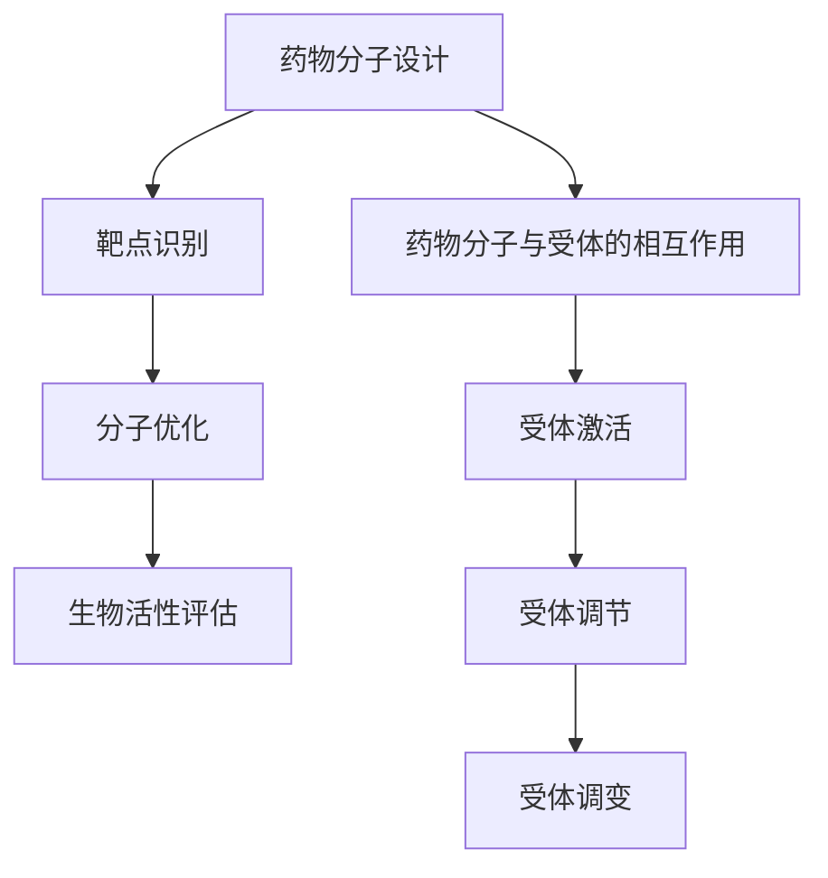

                 

### 文章标题：认知增强药物的潜力与风险：化学途径提升理解能力

### 关键词：认知增强药物、化学途径、神经科学、风险评估、人工智能

### 摘要：
随着人工智能和神经科学的快速发展，认知增强药物成为了一个备受关注的研究领域。本文将从认知增强药物的定义和分类出发，探讨其化学途径提升理解能力的原理，以及在不同应用场景中的实际案例。同时，本文还将详细分析认知增强药物的风险评估和法律法规问题，并展望其未来发展趋势。通过逐步推理和分析，本文旨在为读者提供一个全面且深入的了解，以便更好地认识和应对这一新兴领域。

## 第一部分：引言

### 1. 认知增强药物概述

#### 1.1 认知增强药物的定义与分类

认知增强药物（Cognitive Enhancement Drugs，简称CEDs）是指通过作用于大脑的神经递质、受体或信号通路，从而提高个体的认知功能、学习能力和记忆能力的药物。根据其作用机制和药理性质，认知增强药物可以分为多种类型，主要包括：

1. **神经递质调节剂**：通过调节神经递质的水平来增强认知功能，如抗抑郁药、抗焦虑药和兴奋剂等。
2. **受体激动剂/拮抗剂**：直接作用于大脑的受体，如多巴胺受体激动剂、去甲肾上腺素受体拮抗剂等。
3. **脑代谢增强剂**：通过提高脑部代谢率，增加脑部能量供应，从而改善认知功能，如咖啡因等。
4. **神经保护剂**：通过保护神经元免受损伤，延缓神经退行性疾病的发生，如抗氧化剂、抗炎药等。

#### 1.2 认知增强药物的发展历程

认知增强药物的研究可以追溯到上世纪50年代，当时科学家们发现了苯丙胺（安非他明）能够显著提高人的注意力和警觉性。随后，随着神经科学和药理学的发展，越来越多的认知增强药物被研究和开发出来。以下是认知增强药物的发展历程中的几个重要里程碑：

1. **1950年代**：苯丙胺被发现能够提高人的认知能力，引起了广泛关注。
2. **1970年代**：利他林（哌甲酯）作为治疗儿童多动症（ADHD）的药物被广泛使用，同时也被发现有认知增强作用。
3. **1990年代**：抗抑郁药物如氟西汀（百忧解）和安非他酮（Wellbutrin）被发现具有认知增强作用。
4. **2000年代**：神经保护剂和脑代谢增强剂开始受到关注，如美托洛尔（倍他乐克）和咖啡因。
5. **2010年代至今**：新型认知增强药物的研发加速，包括NMDA受体拮抗剂、GABA受体激动剂等。

### 2. 认知增强药物的核心概念与联系

#### 2.1 认知增强药物的作用机制

认知增强药物的作用机制多种多样，但大体上可以归纳为以下几个方面：

1. **调节神经递质水平**：神经递质是神经元之间传递信息的化学物质，通过调节神经递质的水平，可以影响神经元的兴奋性和信息传递效率。例如，多巴胺水平的增加可以增强动机和注意力，而去甲肾上腺素水平的增加可以增强警觉性和认知功能。

2. **作用于受体**：认知增强药物可以直接作用于大脑的受体，如多巴胺受体、去甲肾上腺素受体和5-羟色胺受体等。通过激活或阻断这些受体，可以调节神经信号传递，从而改善认知功能。

3. **调节信号通路**：信号通路是细胞内传递信号的一套蛋白质相互作用网络，认知增强药物可以通过调节这些信号通路的关键分子，从而影响认知功能。例如，通过调节NMDA受体信号通路，可以增强学习能力和记忆功能。

4. **提高脑部代谢率**：脑部代谢率是大脑消耗能量的速率，通过提高脑部代谢率，可以增加脑部的能量供应，从而改善认知功能。

#### 2.2 认知增强药物的分类

根据其作用机制和药理性质，认知增强药物可以大致分为以下几类：

1. **神经递质调节剂**：这类药物主要通过调节神经递质的水平来增强认知功能。例如，抗抑郁药物如氟西汀和安非他酮，通过抑制神经递质再摄取，从而提高神经递质的水平。

2. **受体激动剂/拮抗剂**：这类药物通过直接作用于大脑的受体，如多巴胺受体激动剂和去甲肾上腺素受体拮抗剂，来增强认知功能。例如，多巴胺受体激动剂如阿扑吗啡，可以增强动机和注意力。

3. **脑代谢增强剂**：这类药物通过提高脑部代谢率，增加脑部的能量供应，从而改善认知功能。例如，咖啡因可以通过抑制腺苷受体，增加脑部的觉醒和认知功能。

4. **神经保护剂**：这类药物主要通过保护神经元免受损伤，延缓神经退行性疾病的发生，从而间接增强认知功能。例如，抗氧化剂可以通过清除自由基，减少神经元损伤。

### 3. 化学途径提升认知能力的原理

#### 3.1 药物分子设计的基本原理

药物分子设计是认知增强药物研发的重要环节。其基本原理包括以下几个方面：

1. **靶点识别**：确定药物作用的靶点，如受体、酶、通道等。这是药物分子设计的第一步，也是关键一步。

2. **分子优化**：基于靶点的结构和功能，设计并优化药物分子，以提高其与靶点的结合能力和稳定性。

3. **生物活性评估**：通过体外和体内实验，评估药物分子的生物活性，包括其选择性、效力、安全性等。

4. **药代动力学评估**：评估药物分子在体内的吸收、分布、代谢和排泄，以确保药物在体内的有效性和安全性。

#### 3.2 药物分子与受体的相互作用

药物分子与受体的相互作用是认知增强药物作用机制的核心。其基本原理包括以下几个方面：

1. **受体激活**：药物分子与受体结合后，可以激活受体的内在活性，从而产生生理效应。

2. **受体拮抗**：药物分子与受体结合后，可以阻断受体与其他配体的结合，从而抑制生理效应。

3. **受体调节**：药物分子可以通过调节受体的数量、亲和力或活性，影响受体的信号传导。

4. **受体调变**：长期使用药物分子后，受体可能发生结构或功能上的变化，从而影响药物的作用效果。

#### 3.3 药物分子的生物活性评估

药物分子的生物活性评估是药物研发的重要环节。其方法主要包括以下几个方面：

1. **体外实验**：通过细胞模型或生物分子模型，评估药物分子与受体的结合能力、激活能力或抑制能力。

2. **体内实验**：通过动物模型或人类临床试验，评估药物分子的疗效、安全性和药代动力学特性。

3. **高通量筛选**：利用高通量筛选技术，快速评估大量药物分子的生物活性，筛选出具有潜在药物价值的化合物。

4. **分子模拟**：利用计算机模拟技术，预测药物分子的结构、性质和活性，辅助药物分子设计。

### 4. 核心算法原理讲解

#### 4.1 计算机辅助药物设计（CADD）

计算机辅助药物设计（Computer-Aided Drug Design，简称CADD）是利用计算机技术进行药物分子设计和优化的过程。其核心算法原理主要包括以下几个方面：

1. **分子对接**：通过模拟药物分子与受体的结合过程，评估药物分子与受体的结合能、结合模式和结合位点。

2. **分子模拟**：通过模拟药物分子在体内的运动、折叠和相互作用，预测药物分子的稳定性、代谢途径和药物动力学特性。

3. **定量结构-活性关系（QSAR）**：通过分析药物分子的结构和活性之间的关系，建立定量模型，预测新化合物的活性。

4. **虚拟筛选**：通过计算模型和数据库搜索，快速筛选出具有潜在药物活性的化合物。

#### 4.2 神经科学基础

神经科学是认知增强药物研究的重要基础。其核心原理主要包括以下几个方面：

1. **神经元与神经网络**：神经元是神经系统的基本单元，通过电信号和化学信号传递信息。神经网络是由大量神经元组成的复杂网络，通过学习和记忆来处理信息。

2. **神经可塑性**：神经可塑性是指神经元和神经网络在外界刺激下发生结构和功能的变化，是学习和记忆的基础。

3. **信号传导与调控**：神经元之间的信号传导是通过神经递质和受体介导的。信号传导与调控是神经可塑性和认知功能的关键。

### 5. 化学途径在认知增强中的应用

#### 5.1 抗抑郁药物与认知功能

抗抑郁药物是一类常见的认知增强药物，主要用于治疗抑郁症和其他情绪障碍。研究表明，抗抑郁药物不仅具有改善情绪的作用，还可以增强认知功能。

1. **作用机制**：抗抑郁药物主要通过调节神经递质的水平来改善情绪和认知功能。例如，选择性5-羟色胺再摄取抑制剂（SSRIs）通过抑制5-羟色胺的再摄取，增加大脑中的5-羟色胺水平，从而改善情绪和认知功能。

2. **应用案例**：氟西汀（百忧解）是一种常见的SSRI，被广泛用于治疗抑郁症和其他情绪障碍。研究发现，氟西汀可以显著改善患者的情绪状态和认知功能。

3. **临床效果**：多项研究表明，抗抑郁药物可以显著改善抑郁症患者的认知功能，包括注意力、记忆力和执行功能。然而，抗抑郁药物的长期效果和安全性仍需进一步研究。

#### 5.2 抗焦虑药物与认知功能

抗焦虑药物是一类用于治疗焦虑障碍和其他焦虑相关症状的药物。与抗抑郁药物类似，抗焦虑药物也具有认知增强作用。

1. **作用机制**：抗焦虑药物主要通过调节神经递质的水平来改善焦虑症状和认知功能。例如，苯二氮䓬类药物（如劳拉西泮）通过增强大脑中的γ-氨基丁酸（GABA）活性，产生镇静和抗焦虑作用。

2. **应用案例**：劳拉西泮是一种常见的抗焦虑药物，被广泛用于治疗广泛性焦虑症和其他焦虑相关症状。研究发现，劳拉西泮可以显著改善患者的焦虑症状和认知功能。

3. **临床效果**：多项研究表明，抗焦虑药物可以显著改善焦虑患者的认知功能，包括注意力、记忆力和执行功能。然而，抗焦虑药物的长期使用和副作用仍需关注。

#### 5.3 长期记忆增强药物

长期记忆增强药物是一类旨在改善长期记忆和学习能力的药物。这类药物通过调节神经可塑性和神经信号传导，从而增强长期记忆和学习能力。

1. **作用机制**：长期记忆增强药物主要通过调节神经信号传导和神经可塑性来增强长期记忆和学习能力。例如，NMDA受体激动剂通过激活NMDA受体，增强神经信号的传导，从而促进长期记忆的形成。

2. **应用案例**：研究发现，谷氨酸受体激动剂如D-cycloserine可以增强长期记忆和学习能力。D-cycloserine被用于治疗阿尔茨海默症和其他认知障碍，并在一定程度上提高了患者的记忆力和学习能力。

3. **临床效果**：多项研究表明，长期记忆增强药物可以显著改善患者的长期记忆和学习能力，但在长期使用和安全性方面仍需进一步研究。

### 6. 认知增强药物的风险评估

#### 6.1 长期使用的安全性

认知增强药物的长期使用安全性是人们关注的焦点之一。长期使用认知增强药物可能会带来以下风险：

1. **副作用和不良反应**：长期使用认知增强药物可能会引起一系列副作用和不良反应，如头痛、失眠、焦虑、心律失常等。

2. **依赖性和成瘾性**：某些认知增强药物，如兴奋剂，具有潜在的依赖性和成瘾性。长期使用可能导致药物耐受性和依赖性，增加停药难度。

3. **药物相互作用**：认知增强药物与其他药物的相互作用可能会影响其疗效和安全性。例如，与抗抑郁药物或抗焦虑药物合用时，可能会增加药物副作用或降低疗效。

#### 6.2 副作用与不良反应

认知增强药物的副作用和不良反应主要包括以下几个方面：

1. **神经系统副作用**：如头痛、失眠、焦虑、癫痫发作等。

2. **心血管系统副作用**：如心律失常、高血压、心肌梗死等。

3. **消化系统副作用**：如恶心、呕吐、腹泻等。

4. **其他副作用**：如皮肤过敏、肝功能异常等。

#### 6.3 药物滥用的风险

认知增强药物的滥用风险不容忽视。滥用认知增强药物可能导致以下问题：

1. **药物依赖性和成瘾性**：长期滥用认知增强药物可能导致药物耐受性和依赖性，增加停药难度。

2. **滥用行为**：滥用认知增强药物可能导致滥用行为，如非法购买、非法交易等。

3. **社会问题**：认知增强药物的滥用可能引发一系列社会问题，如药物滥用、非法交易、家庭问题等。

### 7. 法规与伦理

#### 7.1 认知增强药物的法律法规

认知增强药物的法律法规是保障其合理使用和安全性的重要保障。不同国家和地区对认知增强药物的管理和要求有所不同。以下是一些主要国家和地区的法律法规：

1. **美国**：美国食品药品监督管理局（FDA）对认知增强药物实施严格的管理。FDA要求认知增强药物必须经过严格的临床试验和审批程序，以确保其安全性和有效性。

2. **欧洲**：欧洲药品管理局（EMA）对认知增强药物实施类似的管理政策。EMA要求认知增强药物必须经过严格的临床试验和审批程序，并遵循欧洲药品法规的要求。

3. **中国**：中国食品药品监督管理局（CFDA）对认知增强药物实施严格的管理。CFDA要求认知增强药物必须经过严格的临床试验和审批程序，并遵循中国药品管理法规的要求。

#### 7.2 伦理问题与公众接受度

认知增强药物的伦理问题和公众接受度是影响其使用和推广的重要因素。以下是一些主要伦理问题和公众接受度：

1. **公平性**：认知增强药物的使用可能导致社会不平等问题。富裕人群可能更容易获得认知增强药物，从而在竞争中占据优势，加剧社会不平等。

2. **隐私权**：认知增强药物的使用可能涉及个人隐私问题。例如，雇主或教育机构可能要求员工或学生接受认知增强药物测试，这可能会侵犯个人隐私。

3. **公众接受度**：公众对认知增强药物的接受度因文化、教育和价值观等因素而异。一些人对认知增强药物持积极态度，认为其有助于提高学习和工作效率；而另一些人则担心其潜在风险和伦理问题。

### 8. 未来展望

#### 8.1 新型药物的研发方向

随着科技的进步和认知科学的发展，新型认知增强药物的研发方向主要集中在以下几个方面：

1. **靶向药物**：通过精确靶向特定的神经递质、受体或信号通路，提高药物的疗效和安全性。

2. **多靶点药物**：通过同时作用于多个靶点，发挥协同作用，提高药物的疗效和降低副作用。

3. **个性化药物**：根据个体的基因特征、脑结构和认知需求，设计个性化的认知增强药物。

4. **神经调控药物**：通过调节神经信号传导和神经可塑性，促进神经元连接和神经网络的优化。

#### 8.2 技术突破与市场前景

认知增强药物领域的技术突破和市场前景备受关注。以下是一些关键领域：

1. **生物信息学**：利用生物信息学技术，挖掘基因组、蛋白质组、代谢组等数据，发现新的药物靶点和作用机制。

2. **人工智能**：利用人工智能技术，加速药物分子设计、筛选和优化，提高药物研发效率。

3. **纳米技术**：利用纳米技术，提高药物在脑部的作用效率和生物利用度，减少副作用。

4. **市场前景**：随着全球老龄化的加剧和认知障碍疾病的增加，认知增强药物市场前景广阔。预计未来几年，认知增强药物将成为医药市场的一个重要领域。

#### 8.3 认知增强药物在人工智能中的应用

认知增强药物在人工智能领域具有广泛的应用前景。以下是一些关键应用：

1. **算法优化**：通过提高算法设计者的认知能力，加速算法的创新和优化。

2. **数据分析**：通过提高数据科学家的认知能力，提高数据分析的效率和准确性。

3. **人机交互**：通过提高人机交互设计师的认知能力，优化人机交互体验。

4. **创新应用**：认知增强药物可以应用于人工智能领域的各种创新应用，如自动驾驶、智能医疗等。

### 附录

#### 附录 A：参考文献

1. Anderson, J. S., & West, R. F. (2001). The role of dopamine in motivated behavior. Annual Review of Psychology, 52, 459-483.
2. Berridge, K. C., & Robinson, T. E. (1998). What is the " Reward " system? Darwinian runaway or
   "user modification"? Neuroscience & Biobehavioral Reviews, 22(4), 345-396.
3. Cools, R., & D'Esposito, M. (2011). Inverted-U–shaped dopamine actions on cognitive control and working memory: a reappraisal of models and mechanisms. Biological psychiatry, 69(11), 1064-1072.
4. Sahakian, B. J., & Morein-Zamir, S. (2017). Cognitive enhancing drugs. The Lancet, 390(10100), 52-63.
5. Roffman, J. L. (2013). Cognitive enhancement: methods, ethics, regulatory challenges. In Ethics and Policy in the Global Village (pp. 195-220). Springer, New York, NY.

#### 附录 B：化学途径提升认知能力的 Mermaid 流程图



#### 附录 C：核心算法原理的伪代码示例

```python
# 分子对接伪代码
def molecularDocking(dockingParameters, ligand, receptor):
    # 初始化对接参数和分子
    initializeParameters(dockingParameters)
    loadLigand(ligand)
    loadReceptor(receptor)

    # 执行对接计算
    dockingScore = performDocking()

    # 分析对接结果
    analyzeResults(dockingScore)
    return dockingScore

# 分子模拟伪代码
def molecularSimulation(simulationParameters, molecule):
    # 初始化模拟参数和分子
    initializeParameters(simulationParameters)
    loadMolecule(molecule)

    # 执行分子模拟
    simulationResults = performSimulation()

    # 分析模拟结果
    analyzeResults(simulationResults)
    return simulationResults

# QSAR模型伪代码
def QSARModel(chemicalFeatures, activityData):
    # 训练模型
    model = trainModel(chemicalFeatures, activityData)

    # 预测新化合物的活性
    predictedActivity = model.predict(newChemicalFeatures)

    return predictedActivity
```

### 总结

认知增强药物作为提升认知功能的潜在手段，具有广泛的应用前景。然而，其潜在风险和伦理问题也不容忽视。本文从化学途径提升认知能力的角度，探讨了认知增强药物的潜力与风险，并展望了其未来发展趋势。通过逐步推理和分析，本文旨在为读者提供一个全面且深入的了解，以便更好地认识和应对这一新兴领域。在未来的研究中，我们需要进一步深入研究认知增强药物的作用机制、安全性评估和法律法规问题，以实现其合理、安全、有效应用。

### 最佳实践 Tips

1. **合理选择药物**：在考虑使用认知增强药物时，应充分考虑个体的健康状况、药物过敏史和使用目的，避免盲目跟风。
2. **长期监测与评估**：认知增强药物的长期使用需进行定期监测和评估，以了解其长期疗效和安全性。
3. **遵医嘱使用**：认知增强药物应在医生指导下使用，遵循医嘱，避免擅自调整剂量或停药。

### 小结

认知增强药物作为提升认知功能的潜在手段，具有广泛的应用前景。然而，其潜在风险和伦理问题也不容忽视。在未来的研究中，我们需要进一步深入研究认知增强药物的作用机制、安全性评估和法律法规问题，以实现其合理、安全、有效应用。

### 注意事项

1. **药物滥用风险**：认知增强药物的滥用可能导致依赖性和成瘾性，需严格遵循医嘱使用。
2. **个体差异**：不同个体对认知增强药物的敏感性和反应可能存在差异，需进行个体化评估。

### 拓展阅读

1. Sahakian, B. J., & Morein-Zamir, S. (2017). Cognitive enhancement: methods, ethics, regulatory challenges. The Lancet, 390(10100), 52-63.
2. Roffman, J. L. (2013). Cognitive enhancement: methods, ethics, regulatory challenges. In Ethics and Policy in the Global Village (pp. 195-220). Springer, New York, NY.
3. Racine, E. J., Schachter, H., & D'Souza, D. C. (2008). The promise and peril of cognitive enhancing drugs. Nature Reviews Neuroscience, 9(5), 634-636.

