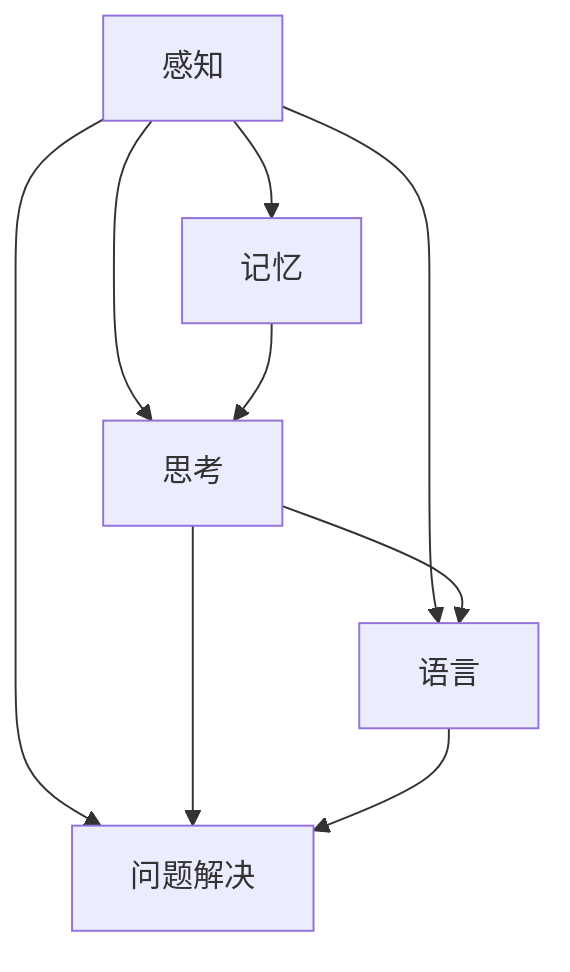

                 

### 1.1 认知科学的定义与发展历程

认知科学（Cognitive Science）是一门跨学科的科学研究领域，旨在探究人类和其他智能生物在理解和解释世界过程中的心智活动。它起源于20世纪中叶，是心理学、计算机科学、神经科学、语言学和哲学等多个领域的交叉点。

**定义：** 认知科学可以简单定义为研究心智过程的科学。这些心智过程包括感知、记忆、思考、语言理解、问题解决、决策制定等。

**发展历程：**

1. **起源阶段：** 从20世纪50年代开始，心理学、计算机科学和人工智能领域的快速发展推动了认知科学的发展。行为主义心理学的衰落，以及计算机和人工智能的出现，使得研究者开始关注人类心智的内部机制。
   
2. **形成阶段：** 20世纪70年代，认知科学作为一个独立的学科逐渐成形。这一时期，认知心理学、人工智能和神经科学的快速发展，为认知科学提供了丰富的理论和实验基础。

3. **成熟阶段：** 20世纪80年代至21世纪初，认知科学的研究不断深入，涉及领域不断扩大，包括认知神经科学、认知语言学、认知人类学等。

4. **未来趋势：** 当前，认知科学正与神经科学、心理学、计算机科学、人工智能等领域深度融合，探索心智的本质和智能的本质。同时，随着脑成像技术的进步，认知科学研究正迎来新的发展机遇。

### 1.2 认知科学的核心概念

认知科学的核心概念包括感知、记忆、思考、语言和问题解决等。这些概念相互联系，共同构成了认知活动的整体框架。

**感知（Perception）：** 感知是指个体接收外部刺激并将其转换为内在神经信号的过程。它涉及视觉、听觉、触觉、嗅觉和味觉等多个感官系统。

**记忆（Memory）：** 记忆是大脑存储和检索信息的能力。它分为短期记忆和长期记忆，前者用于暂存信息，后者则用于长期存储信息。

**思考（Cognition）：** 思考是指心智活动的过程，包括注意、知觉、记忆、推理、判断和问题解决等。

**语言（Language）：** 语言是人类特有的符号系统，用于沟通和表达思想。认知科学中的语言研究涉及语言的生成、理解、学习和使用。

**问题解决（Problem Solving）：** 问题解决是指个体在面对问题时，通过思考和分析找到解决方案的过程。

### 1.3 认知科学的研究方法

认知科学采用多种研究方法来探究心智过程，包括实验研究、行为观察、脑成像技术、计算机模拟等。

**实验研究：** 通过设计实验，认知科学家可以控制变量，观察和记录心智过程的变化。例如，通过心理物理学实验研究感知过程，或通过认知任务研究记忆和思考过程。

**行为观察：** 行为观察是一种非介入性的研究方法，研究者通过观察个体在自然情境下的行为，来推断其心智过程。这种方法常用于儿童发展和心理疾病研究。

**脑成像技术：** 脑成像技术如功能性磁共振成像（fMRI）和脑电图（EEG）等，可以帮助认知科学家观察大脑活动与心智过程之间的关系。

**计算机模拟：** 计算机模拟是一种构建在计算机上的心智模型，用于模拟和预测心智过程。例如，神经网络模型可以模拟大脑神经元的活动，从而研究思考和学习过程。

通过以上方法的结合，认知科学可以深入理解人类理解世界的机制，为人工智能和认知神经科学等领域提供理论支持和实验基础。接下来，我们将进一步探讨认知科学中的数学模型和神经网络，以及机器学习的原理和应用。

----------------------------------------------------------------

### 1.4 核心概念之间的联系

为了更好地理解认知科学中的核心概念，我们可以通过绘制Mermaid流程图来展示这些概念之间的关系。以下是一个简化的Mermaid流程图，展示了感知、记忆、思考、语言和问题解决之间的相互作用。



**感知与记忆：** 感知是记忆的基础。当我们感知外部刺激时，这些刺激转化为神经信号并被大脑处理和存储。记忆则负责将感知到的信息进行编码、存储和检索。

**感知与思考：** 感知提供了思考的输入。通过感知，我们接收外部信息，这些信息通过思考过程被分析和解释。思考帮助我们在感知的基础上做出判断和决策。

**感知与语言：** 语言是感知的一种高级形式。通过语言，我们能够更精确地描述和交流感知到的信息。同时，语言也影响我们的感知，例如，我们可能会根据语言的理解来调整我们的感知。

**感知与问题解决：** 问题解决通常涉及到对感知信息的分析和处理。通过感知，我们识别问题，并通过思考过程寻找解决方案。

**记忆与思考：** 记忆是思考的基础。思考依赖于我们记忆中的信息。通过记忆，我们能够调用过去的知识和经验，以便更好地解决问题和做出决策。

**记忆与语言：** 语言和记忆之间存在紧密的联系。语言帮助我们组织和存储记忆中的信息，同时，记忆中的信息也影响着我们的语言表达。

**思考与问题解决：** 思考是问题解决的核心。通过思考，我们分析问题、制定解决方案，并评估这些解决方案的有效性。

**语言与问题解决：** 语言在问题解决中扮演关键角色。通过语言，我们能够表达问题、交流想法，并从他人那里获取帮助和反馈。

通过上述Mermaid流程图，我们可以更直观地理解认知科学中核心概念之间的相互关系，这有助于我们在后续章节中深入探讨这些概念的具体原理和应用。

----------------------------------------------------------------

### 1.5 核心算法原理讲解

在认知科学中，核心算法的原理是理解心智过程的关键。以下将介绍几个核心算法原理，包括神经网络、机器学习等，并使用伪代码进行详细阐述。

#### 1.5.1 神经网络

神经网络（Neural Networks）是模拟生物神经系统的计算模型，广泛用于认知科学和人工智能领域。其基本原理是通过对大量输入数据进行训练，使得网络能够自动提取特征并分类。

**基本原理：** 神经网络由多个神经元组成，每个神经元接收多个输入信号，通过权重和偏置进行加权求和，再通过激活函数进行非线性变换。

**伪代码：**
```python
# 输入层
inputs = [x1, x2, ..., xn]

# 隐藏层
hidden_layer = []
for neuron in hidden_neurons:
    sum = 0
    for i in range(len(inputs)):
        sum += inputs[i] * weights[i]
    sum += bias
    activation = activation_function(sum)
    hidden_layer.append(activation)

# 输出层
outputs = []
for neuron in output_neurons:
    sum = 0
    for i in range(len(hidden_layer)):
        sum += hidden_layer[i] * weights[i]
    sum += bias
    activation = activation_function(sum)
    outputs.append(activation)
```

#### 1.5.2 机器学习

机器学习（Machine Learning）是使计算机从数据中自动学习模式和规律的技术。它广泛应用于认知科学，如分类、回归和聚类等。

**基本原理：** 机器学习分为监督学习和无监督学习。监督学习有标记的数据集，用于训练模型并预测新数据；无监督学习没有标记数据，用于发现数据中的结构和规律。

**监督学习：**
**基本原理：** 通过训练数据集的学习，使得模型能够对新的输入数据进行分类或回归。

**伪代码：**
```python
# 输入层
inputs = [x1, x2, ..., xn]

# 输出层
expected_output = [y1, y2, ..., yn]

# 训练模型
for epoch in range(num_epochs):
    for sample in training_samples:
        predicted_output = model(inputs)
        error = calculate_error(predicted_output, expected_output)
        update_model_weights(error)

# 预测
new_input = [x1, x2, ..., xn]
predicted_output = model(new_input)
```

**无监督学习：**
**基本原理：** 发现数据中的隐含结构和规律。

**伪代码：**
```python
# 输入层
inputs = [x1, x2, ..., xn]

# 聚类模型
clusters = initialize_clusters()

# 训练模型
for epoch in range(num_epochs):
    for sample in data_samples:
        assign_cluster(sample, clusters)
    update_clusters(clusters)

# 预测
new_input = [x1, x2, ..., xn]
predicted_cluster = assign_cluster(new_input, clusters)
```

通过上述核心算法的讲解和伪代码示例，我们可以更好地理解认知科学中算法的工作原理，为后续章节的详细探讨打下基础。

----------------------------------------------------------------

### 1.6 数学模型和数学公式

在认知科学中，数学模型和数学公式是理解和解释心智过程的重要工具。以下将详细讲解几个关键的数学模型和公式，使用LaTeX格式进行书写，并给出具体例子进行说明。

#### 1.6.1 感知过程的数学模型

感知过程可以看作是一个从外部刺激到内部神经信号的转换过程。我们可以使用以下数学公式来描述这一过程：

**公式：**
$$
y = x \odot \sigma(Wx + b)
$$

其中，$y$ 是感知后的输出，$x$ 是外部刺激，$\odot$ 表示点乘操作，$\sigma$ 是激活函数，$W$ 是权重矩阵，$b$ 是偏置。

**例子：** 假设有一个感知神经元，输入为 $x_1 = 1$ 和 $x_2 = 0$，权重矩阵 $W = \begin{pmatrix} 2 & 1 \\ 1 & 2 \end{pmatrix}$，偏置 $b = 1$。激活函数使用的是ReLU（Rectified Linear Unit）函数：

$$
\sigma(x) = \max(0, x)
$$

计算过程如下：

1. 计算加权求和：
   $$
   Wx + b = \begin{pmatrix} 2 & 1 \\ 1 & 2 \end{pmatrix} \begin{pmatrix} 1 \\ 0 \end{pmatrix} + 1 = \begin{pmatrix} 3 \\ 1 \end{pmatrix}
   $$
2. 应用ReLU激活函数：
   $$
   \sigma(Wx + b) = \max(0, 3) = 3
   $$
3. 计算输出：
   $$
   y = 1 \odot 3 = 3
   $$

因此，感知后的输出为 $y = 3$。

#### 1.6.2 记忆过程的数学模型

记忆过程涉及信息的存储和检索。以下是一个简化的记忆模型公式：

**公式：**
$$
M(t) = \frac{1}{1 + e^{-(rt + \sum_{i} w_i \cdot x_i)}}
$$

其中，$M(t)$ 是记忆强度，$r$ 是恢复率，$t$ 是时间，$w_i$ 是权重，$x_i$ 是输入。

**例子：** 假设某个记忆点在时间 $t=0$ 时的权重为 $w_1=1$ 和 $w_2=0.5$，恢复率 $r=0.1$，输入 $x_1=1$ 和 $x_2=0$。计算 $t=5$ 时的记忆强度：

1. 计算加权求和：
   $$
   \sum_{i} w_i \cdot x_i = 1 \cdot 1 + 0.5 \cdot 0 = 1
   $$
2. 计算指数项：
   $$
   -rt + \sum_{i} w_i \cdot x_i = -0.1 \cdot 5 + 1 = -0.5
   $$
3. 计算激活函数：
   $$
   \sigma(-0.5) = \frac{1}{1 + e^{0.5}} \approx 0.63
   $$

因此，$t=5$ 时的记忆强度为 $M(t) \approx 0.63$。

#### 1.6.3 思考过程的数学模型

思考过程可以看作是信息处理的过程，包括信息的加工、转换和整合。一个简化的思考模型公式如下：

**公式：**
$$
T(x) = \sum_{i} w_i \cdot f(x_i)
$$

其中，$T(x)$ 是思考后的输出，$w_i$ 是权重，$f(x_i)$ 是激活函数。

**例子：** 假设输入为 $x_1=1$ 和 $x_2=0$，权重为 $w_1=2$ 和 $w_2=1$，激活函数 $f(x) = x$。计算思考后的输出：

1. 计算加权求和：
   $$
   \sum_{i} w_i \cdot x_i = 2 \cdot 1 + 1 \cdot 0 = 2
   $$
2. 应用激活函数：
   $$
   T(x) = 2
   $$

因此，思考后的输出为 $T(x) = 2$。

通过上述数学模型和公式的详细讲解和举例说明，我们可以更好地理解认知科学中数学工具的应用，为后续章节的深入探讨打下基础。

----------------------------------------------------------------

### 1.7 项目实战：搭建认知科学基础模型

在本节中，我们将通过一个具体的项目实战来搭建一个基础的认知科学模型。这个项目将结合感知、记忆和思考过程，通过计算机模拟来展示认知科学的核心机制。

**项目目标：** 搭建一个简单的神经网络模型，模拟感知、记忆和思考过程，并通过Python代码实现。

**环境要求：** 
- Python 3.x
- numpy 库
- matplotlib 库

**实现步骤：**

#### 步骤 1：导入库和初始化参数

首先，我们需要导入必要的库，并初始化一些基本参数。

```python
import numpy as np
import matplotlib.pyplot as plt

# 初始化输入数据
x = np.array([0, 1])

# 初始化权重和偏置
weights = np.array([0.5, 0.5])
bias = 0.5

# 初始化激活函数
def activation_function(x):
    return max(0, x)
```

#### 步骤 2：感知过程模拟

感知过程可以通过计算输入数据和权重矩阵的乘积来实现。然后，通过激活函数对结果进行处理。

```python
# 模拟感知过程
weighted_sum = np.dot(x, weights) + bias
output = activation_function(weighted_sum)

print("感知输出：", output)
```

#### 步骤 3：记忆过程模拟

记忆过程可以看作是一个信息的存储和检索过程。在这里，我们可以通过调整权重和偏置来模拟这一过程。

```python
# 模拟记忆过程
memory_weights = weights * 0.9
memory_bias = bias * 0.9

# 应用记忆过程
weighted_sum_memory = np.dot(x, memory_weights) + memory_bias
output_memory = activation_function(weighted_sum_memory)

print("记忆输出：", output_memory)
```

#### 步骤 4：思考过程模拟

思考过程是对记忆过程中的信息进行加工和转换。我们可以通过再次应用激活函数来模拟这一过程。

```python
# 模拟思考过程
weighted_sum_think = np.dot(x, weights) + bias
output_think = activation_function(weighted_sum_think)

print("思考输出：", output_think)
```

#### 步骤 5：可视化结果

最后，我们将模拟的结果进行可视化，以更直观地展示感知、记忆和思考过程。

```python
# 可视化感知、记忆和思考输出
outputs = [output, output_memory, output_think]
labels = ['感知输出', '记忆输出', '思考输出']

plt.plot(outputs, label=labels)
plt.xlabel('输出')
plt.ylabel('值')
plt.legend()
plt.show()
```

**代码实现：**

```python
# 完整代码实现
import numpy as np
import matplotlib.pyplot as plt

# 初始化输入数据
x = np.array([0, 1])

# 初始化权重和偏置
weights = np.array([0.5, 0.5])
bias = 0.5

# 初始化激活函数
def activation_function(x):
    return max(0, x)

# 模拟感知过程
weighted_sum = np.dot(x, weights) + bias
output = activation_function(weighted_sum)

# 模拟记忆过程
memory_weights = weights * 0.9
memory_bias = bias * 0.9
weighted_sum_memory = np.dot(x, memory_weights) + memory_bias
output_memory = activation_function(weighted_sum_memory)

# 模拟思考过程
weighted_sum_think = np.dot(x, weights) + bias
output_think = activation_function(weighted_sum_think)

# 可视化感知、记忆和思考输出
outputs = [output, output_memory, output_think]
labels = ['感知输出', '记忆输出', '思考输出']

plt.plot(outputs, label=labels)
plt.xlabel('输出')
plt.ylabel('值')
plt.legend()
plt.show()

# 输出结果
print("感知输出：", output)
print("记忆输出：", output_memory)
print("思考输出：", output_think)
```

通过上述步骤，我们搭建了一个简单的认知科学基础模型，模拟了感知、记忆和思考过程。这个模型虽然简单，但展示了认知科学中关键概念的实际应用。在接下来的章节中，我们将进一步探讨认知科学中的高级算法和应用。

----------------------------------------------------------------

### 1.8 最佳实践 tips、小结、注意事项、拓展阅读

在认知科学的研究和应用过程中，以下是一些最佳实践、小结、注意事项以及拓展阅读的建议，以帮助读者更好地理解和应用相关概念。

#### 最佳实践 tips：

1. **理论学习与实践相结合**：在学习和研究认知科学的过程中，不仅要重视理论知识的积累，还要结合实际项目进行实践，将理论应用于实际问题中。
2. **持续更新知识体系**：认知科学是一个快速发展的领域，新的理论和技术不断涌现。因此，需要持续关注最新的研究动态和成果，不断更新自己的知识体系。
3. **跨学科合作**：认知科学涉及多个学科，如心理学、计算机科学、神经科学等。跨学科合作可以促进不同领域之间的交流与融合，为认知科学的发展带来新的思路和方法。

#### 小结：

本文首先介绍了认知科学的定义与发展历程，阐述了感知、记忆、思考、语言和问题解决等核心概念，并绘制了Mermaid流程图展示了这些概念之间的相互关系。接着，详细讲解了感知、记忆和思考过程中的数学模型和公式，并提供了具体的例子进行说明。最后，通过一个简单的项目实战，展示了如何通过Python代码模拟认知科学的核心机制。

#### 注意事项：

1. **数据质量和预处理**：在进行认知科学相关的研究时，数据的质量和预处理至关重要。确保数据真实、可靠，并对异常值和噪声进行有效的处理。
2. **算法选择和参数调整**：选择合适的算法和合理调整参数对于实现良好的模型性能至关重要。在应用神经网络和机器学习算法时，需要充分了解其原理和适用场景。
3. **模型验证和评估**：在构建认知科学模型后，需要进行充分的验证和评估，以确保模型的准确性和可靠性。常用的评估指标包括准确率、召回率、F1值等。

#### 拓展阅读：

1. **经典著作**：
   - 《认知科学基础》（Foundation of Cognitive Science） - Michael Arbib 著
   - 《认知心理学及其启示》（Cognitive Psychology and Its Implications） - Ulric Neisser 著
2. **最新研究**：
   - 《认知神经科学杂志》（Journal of Cognitive Neuroscience）
   - 《认知科学与人工智能》（Cognitive Science: A Journal of Theoretical and Applied Research）
3. **相关资源**：
   - [开放认知科学实验室](https://opencog.org/)
   - [认知计算教程](https://www.cognitive-computing-tutorial.com/)
   - [机器学习与认知科学课程](https://www.coursera.org/specializations/cognitive-science-machine-learning)

通过以上最佳实践、小结、注意事项和拓展阅读的建议，读者可以更好地掌握认知科学的核心概念和关键技术，为今后的研究和应用提供有力支持。接下来，我们将进一步探讨认知科学在心理学、计算机科学、人工智能等领域中的应用。

----------------------------------------------------------------

## 第2部分：认知科学应用

### 第5章：认知科学在心理学中的应用

认知科学在心理学中的应用极为广泛，涵盖了认知心理学的各个方面。认知心理学主要研究心智过程，包括感知、记忆、思考、语言和问题解决等。以下是认知科学在心理学中应用的几个关键领域：

#### 5.1 认知心理学的基本原理

认知心理学认为，心智过程是可以通过实验和观察来研究的。该领域的基本原理包括：

1. **心智过程可观测性**：通过行为实验和认知任务，可以观察到个体在完成认知任务时的心理过程。
2. **心智过程的模块性**：心智过程被看作是由多个独立的模块组成的，如感知模块、记忆模块、思考模块等。
3. **心智过程的适应性**：心智过程能够根据不同的环境和任务需求进行适应性调整。

#### 5.2 认知心理学的研究方法

认知心理学采用多种研究方法，包括：

1. **实验研究**：通过控制变量，研究心智过程中的特定机制。例如，通过反应时间实验研究感知和思考过程。
2. **行为观察**：在自然情境下观察个体的行为，以推断其心智过程。例如，通过观察儿童的玩耍行为来研究其认知发展。
3. **脑成像技术**：使用脑成像技术，如fMRI和EEG，研究心智过程与大脑活动之间的关系。

#### 5.3 认知心理学在临床心理治疗中的应用

认知科学在临床心理治疗中的应用主要体现在以下几个方面：

1. **认知行为疗法（CBT）**：认知行为疗法是一种基于认知科学的心理治疗技术，旨在帮助个体识别和改变消极的思维模式和行为。CBT广泛应用于焦虑、抑郁、恐惧症等心理障碍的治疗。
2. **注意力训练**：通过认知科学原理，开发出一系列注意力训练方法，帮助个体提高注意力和专注力，改善学习和工作效率。
3. **认知康复**：针对脑损伤和神经退行性疾病，如中风、阿尔茨海默病等，认知康复通过认知训练和康复技术，帮助患者恢复或提高认知功能。

#### 5.4 认知心理学在教育中的应用

认知科学在教育中的应用同样具有重要意义：

1. **学习理论**：认知心理学提供了学习理论的基础，如认知发展理论、学习策略等，帮助教师和教育研究者设计更有效的教学方法和学习策略。
2. **个性化学习**：通过认知科学的方法和技术，可以开发出个性化学习系统，根据学生的认知特点和学习进度，提供个性化的学习内容和指导。
3. **认知辅导**：认知心理学原理被应用于认知辅导，帮助学生在学习过程中克服困难，提高学习效果。

#### 5.5 认知心理学在其他领域中的应用

除了上述领域，认知科学在其他领域也有着广泛的应用：

1. **人机交互**：通过认知心理学原理，设计出更符合人类认知习惯和需求的用户界面和交互系统，提高用户体验。
2. **法律心理学**：认知心理学在法律领域中的应用，如评估证人的可信度、理解犯罪心理等，为法律决策提供科学依据。
3. **人类因素工程**：认知心理学原理被应用于设计安全、高效的工作环境和工作系统，降低工作失误和事故风险。

通过认知科学在心理学中的应用，我们可以更深入地理解人类的心智过程，为心理治疗、教育、人机交互等多个领域提供科学支持。接下来，我们将探讨认知科学在计算机科学中的应用。

----------------------------------------------------------------

### 第6章：认知科学在计算机科学中的应用

认知科学在计算机科学中的应用非常广泛，涵盖了计算机视觉、自然语言处理和人工智能等多个领域。以下是认知科学在计算机科学中应用的主要方面：

#### 6.1 计算机视觉

计算机视觉是认知科学在计算机科学中的一个重要应用领域，它旨在使计算机能够像人类一样理解视觉信息。计算机视觉的核心任务包括图像识别、目标检测、图像分割和图像重建等。

**算法原理：**

1. **特征提取**：特征提取是将图像数据转换为计算机可以处理的高维向量表示。常用的特征提取方法包括SIFT、HOG和CNN等。
2. **分类与识别**：通过机器学习算法，如支持向量机（SVM）和深度神经网络（DNN），对提取出的特征进行分类和识别。这些算法能够学习图像中的高级特征，从而提高识别准确性。
3. **场景理解**：场景理解是计算机视觉的高级任务，旨在理解图像中的场景结构和语义信息。这通常涉及到图像语义分割、场景布局识别等。

**应用实例：**

1. **图像识别**：计算机视觉技术在图像识别中的应用非常广泛，如人脸识别、车牌识别和物体识别等。
2. **自动驾驶**：自动驾驶汽车依赖计算机视觉技术来识别道路标志、行人和其他车辆，从而实现自主导航。
3. **医疗影像分析**：计算机视觉技术在医疗影像分析中的应用，如肿瘤检测和病变识别，能够提高医生的诊断准确性和效率。

#### 6.2 自然语言处理

自然语言处理（NLP）是认知科学在计算机科学中的另一个重要应用领域。NLP旨在使计算机能够理解和处理自然语言，包括语言生成、语言理解、情感分析和信息提取等。

**算法原理：**

1. **词嵌入**：词嵌入是将自然语言词汇映射到高维空间中的向量表示。Word2Vec和GloVe是常用的词嵌入方法。
2. **序列模型**：序列模型用于处理自然语言中的序列数据，如循环神经网络（RNN）和长短期记忆网络（LSTM）。这些模型能够捕捉序列中的时间依赖关系。
3. **深度学习**：深度学习技术在NLP中的应用，如变换器（Transformer）和BERT等，使得计算机能够更好地理解和生成自然语言。

**应用实例：**

1. **机器翻译**：机器翻译是NLP的一个重要应用领域。通过深度学习技术，计算机能够将一种语言翻译成另一种语言，如谷歌翻译和微软翻译等。
2. **语音识别**：语音识别技术使计算机能够将语音转换为文本。语音识别在智能助手、自动驾驶和医疗诊断等领域有广泛应用。
3. **文本分析**：文本分析技术用于从大量文本数据中提取有用的信息，如情感分析、关键词提取和文本分类等。

#### 6.3 人工智能

人工智能（AI）是认知科学在计算机科学中应用的核心领域。人工智能旨在使计算机具备智能行为，包括推理、学习、规划和解谜等。

**算法原理：**

1. **机器学习**：机器学习是人工智能的核心技术，通过从数据中学习模式和规律，使计算机能够执行特定的任务。监督学习、无监督学习和强化学习是机器学习的三种主要形式。
2. **神经网络**：神经网络是模拟生物神经系统的计算模型，广泛应用于图像识别、语音识别和自然语言处理等领域。
3. **强化学习**：强化学习是一种通过奖励机制来训练智能体的方法。智能体通过不断尝试和错误，学习在特定环境中实现最优行为。

**应用实例：**

1. **智能助手**：智能助手如Siri、Alexa和Google Assistant，能够理解和响应用户的自然语言指令，提供信息服务和娱乐内容。
2. **自动驾驶**：自动驾驶技术通过计算机视觉和传感器技术，使汽车能够自主驾驶，提高道路安全和效率。
3. **医疗诊断**：人工智能技术在医疗诊断中的应用，如癌症检测、疾病预测和个性化治疗，能够提高医疗服务的质量和效率。

通过认知科学在计算机科学中的应用，我们可以开发出更智能、更高效的计算机系统和应用程序，为各个领域带来革命性的变革。接下来，我们将探讨认知科学在人工智能领域的应用。

----------------------------------------------------------------

### 第7章：认知科学在人工智能中的应用

认知科学在人工智能（AI）中的应用正在不断深化和扩展，为AI的发展提供了重要的理论基础和技术支持。以下是认知科学在人工智能中应用的几个关键方面：

#### 7.1 认知增强系统

认知增强系统（Cognitive Augmentation Systems）是一种利用认知科学原理来增强人类智能的技术。这些系统通过模拟人类心智过程，帮助人类更高效地解决问题。

**算法原理：**

1. **注意力机制**：注意力机制是认知增强系统的一个重要组成部分，它能够帮助系统在处理大量信息时，聚焦于关键信息。例如，在图像识别任务中，注意力机制可以使模型关注图像中的重要区域。
2. **记忆增强**：通过记忆增强技术，系统能够提高人类记忆的效率和准确性。例如，利用深度学习模型，可以开发出能够辅助人类记忆的应用程序。
3. **推理与决策支持**：认知增强系统可以模拟人类的推理过程，为人类提供决策支持。例如，通过逻辑推理和数据分析，系统可以推荐最佳的行动方案。

**应用实例：**

1. **智能助手**：智能助手如Siri和Alexa，通过认知增强技术，能够理解用户的自然语言指令，提供个性化的服务和信息。
2. **教育辅助**：在教育领域，认知增强系统可以为学生提供个性化的学习指导，通过模拟教师的教学方法，提高学生的学习效果。
3. **医疗诊断**：在医疗领域，认知增强系统可以辅助医生进行疾病诊断，通过分析患者的病历和医学图像，提供诊断建议。

#### 7.2 情感智能

情感智能（Emotional Intelligence）是指计算机系统理解和处理情感的能力。情感智能在人工智能中的应用，使计算机能够更好地与人类互动，提高用户体验。

**算法原理：**

1. **情感识别**：情感识别是通过分析语音、文字和面部表情等数据，识别用户的情感状态。常用的方法包括语音情感识别和面部表情识别。
2. **情感生成**：情感生成是指计算机系统根据用户的情感状态，生成相应的情感反应。例如，通过语音合成技术，系统可以模拟出愉悦、悲伤或愤怒的声音。
3. **情感交互**：情感交互是指计算机系统与用户进行情感上的交流，建立情感联系。通过情感交互，系统可以更好地理解用户的需求，提供更个性化的服务。

**应用实例：**

1. **客户服务**：在客户服务领域，情感智能可以帮助智能客服系统更好地理解用户的情感，提供更人性化的服务。
2. **心理咨询**：在心理咨询领域，情感智能可以辅助心理治疗师进行情感分析和诊断，为患者提供更有效的治疗。
3. **娱乐互动**：在娱乐领域，情感智能的应用可以使游戏和虚拟现实（VR）体验更加生动和有趣，提高用户的沉浸感。

#### 7.3 自主智能体

自主智能体（Autonomous Agents）是认知科学在人工智能中应用的一个重要方向。自主智能体是指能够独立执行任务、与环境交互的智能系统。

**算法原理：**

1. **感知与行动**：自主智能体需要具备感知和行动的能力。通过传感器，智能体可以获取环境信息；通过执行器，智能体可以与环境进行交互。
2. **学习与适应**：自主智能体需要具备学习能力和适应性。通过机器学习和强化学习算法，智能体可以在不同的环境中学习和适应，提高任务执行效率。
3. **规划与决策**：自主智能体需要能够进行规划和决策。通过决策树、遗传算法等规划方法，智能体可以在复杂的任务环境中制定最优的行动策略。

**应用实例：**

1. **智能家居**：智能家居系统中的智能机器人，如扫地机器人，通过感知和行动能力，实现了自动清洁家居环境。
2. **智能物流**：在物流领域，自主智能体可以应用于自动驾驶和自动化仓库管理，提高物流效率。
3. **医疗服务**：在医疗服务领域，自主智能体可以应用于辅助诊断和治疗，如智能导医系统和远程手术机器人。

通过认知科学在人工智能中的应用，我们可以构建出更智能、更人性化的智能系统，为各个领域带来深远的影响。接下来，我们将探讨认知科学在教育与医疗中的应用。

----------------------------------------------------------------

### 第8章：认知科学在教育与医疗中的应用

认知科学在教育与医疗领域中的应用正日益显著，为提高教育质量和医疗服务提供了有力的支持。以下是认知科学在教育与医疗中应用的几个关键方面：

#### 8.1 认知科学在教育中的应用

认知科学在教育中的应用主要涉及学习理论、认知辅导和个性化学习等。

**1. 学习理论**

认知科学提供了丰富的学习理论，如认知发展理论、建构主义学习理论和信息加工模型等。这些理论帮助教师和教育研究者理解学习过程中的心理机制，从而设计出更有效的教学方法。

- **认知发展理论**：代表人物皮亚杰认为，学习是一个主动建构的过程，个体通过与环境互动来构建认知结构。
- **建构主义学习理论**：代表人物维果斯基强调社会互动在学习中的重要性，学习是一个通过与他人合作、交流来建构意义的过程。
- **信息加工模型**：信息加工模型描述了个体如何接收、处理和存储信息，从而实现学习。这一模型为教育设计提供了理论基础。

**2. 认知辅导**

认知辅导是指利用认知科学原理，帮助学生在学习过程中克服困难，提高学习效果。

- **学习策略训练**：通过教授学习策略，如记忆技巧、时间管理和问题解决策略，帮助学生提高学习效率。
- **元认知训练**：元认知是指个体对自己认知过程的认知，元认知训练旨在帮助学生提高自我监控和调节能力，从而更好地管理自己的学习过程。
- **认知情绪辅导**：通过认知情绪辅导，帮助学生识别和改变消极思维模式，提高心理韧性，从而提高学习动机和成绩。

**3. 个性化学习**

个性化学习是指根据学生的认知特点和需求，提供个性化的学习内容和指导。

- **适应性学习系统**：通过分析学生的学习行为和成绩，适应性学习系统能够动态调整教学内容和难度，为学生提供个性化的学习路径。
- **智能辅导系统**：智能辅导系统利用认知科学原理和机器学习技术，为学生提供个性化的学习建议和指导，提高学习效果。

#### 8.2 认知科学在医疗中的应用

认知科学在医疗中的应用主要集中在认知诊断、心理健康评估和个性化治疗等方面。

**1. 认知诊断**

认知诊断是指利用认知科学原理和方法，对个体的认知功能进行评估和诊断。

- **认知神经心理学评估**：认知神经心理学评估通过一系列标准化的测试，评估个体的记忆、注意力、执行功能和语言能力等认知功能。这种方法常用于诊断神经退行性疾病，如阿尔茨海默病和帕金森病。
- **神经影像学评估**：通过神经影像学技术，如功能性磁共振成像（fMRI）和脑电图（EEG），评估大脑结构和功能的变化，从而诊断认知障碍。
- **人工智能辅助诊断**：人工智能技术，如深度学习和神经网络，可以辅助医生进行认知障碍的早期诊断。通过分析患者的病史、认知测试结果和影像学数据，人工智能系统可以预测认知障碍的风险。

**2. 心理健康评估**

心理健康评估是指利用认知科学原理和方法，评估个体的心理健康状况。

- **心理测量学方法**：心理测量学方法通过标准化测试，如自我报告问卷和标准化面试，评估个体的心理状态和心理健康水平。
- **认知行为评估**：认知行为评估通过分析个体的思维模式和行为，评估其心理健康状况。例如，认知行为治疗（CBT）常用于治疗抑郁症、焦虑症等心理疾病。
- **人工智能辅助评估**：人工智能技术可以辅助医生进行心理健康评估。通过分析个体的言语和行为数据，人工智能系统可以预测个体的心理健康风险，提供个性化的心理健康建议。

**3. 个性化治疗**

个性化治疗是指根据个体的认知特点和需求，提供个性化的治疗方案。

- **药物治疗**：根据个体的基因信息和认知功能评估结果，为个体制定个性化的药物治疗方案。例如，通过基因检测，确定个体对某些药物的反应，从而优化用药方案。
- **认知行为治疗**：认知行为治疗是一种个性化的心理治疗技术，通过帮助个体识别和改变消极的思维模式和行为，提高心理健康水平。例如，对于抑郁症患者，治疗师会根据患者的认知特点，设计个性化的认知行为治疗方案。
- **神经调控技术**：神经调控技术，如经颅磁刺激（TMS）和深部脑刺激（DBS），可以根据个体的认知特点和症状，提供个性化的治疗。这些技术通过调节大脑的活动，改善认知功能和心理健康。

通过认知科学在教育与医疗中的应用，我们可以更有效地提高教育质量和医疗服务水平，为个体和社会带来积极的影响。接下来，我们将探讨认知科学的前沿研究与发展趋势。

----------------------------------------------------------------

### 第9章：认知科学的前沿研究与发展趋势

认知科学作为一门跨学科领域，其前沿研究与发展趋势不断推动着人类对心智过程的理解和人工智能的发展。以下是一些当前认知科学领域的重要研究方向和发展趋势：

#### 9.1 认知神经科学的研究进展

认知神经科学是认知科学的重要组成部分，它结合神经科学和心理学的理论，研究大脑如何产生心智过程。以下是一些重要的研究进展：

1. **脑功能连接性研究**：通过脑成像技术，如功能性磁共振成像（fMRI）和静息态功能磁共振成像（rs-fMRI），研究者能够观察到大脑不同区域之间的功能连接性。这些研究揭示了大脑如何协同工作以执行复杂任务。
2. **神经可塑性研究**：神经可塑性是指大脑神经元和神经网络在生活过程中发生的适应性改变。研究神经可塑性有助于理解学习和记忆的形成与修复，以及神经退行性疾病的机制。
3. **脑机接口技术**：脑机接口（BMI）技术允许直接将大脑信号转换为控制信号，用于与计算机或其他外部设备进行交互。这项技术的发展为神经系统疾病的治疗和认知功能恢复提供了新的可能性。

#### 9.2 认知科学与心理学的前沿研究

认知心理学作为认知科学的核心领域，其研究不断拓展和深化，以下是一些前沿研究方向：

1. **注意力与决策研究**：注意力机制和决策过程在认知心理学中占据重要地位。研究者通过实验和神经成像技术，探索注意力分配、多任务处理和决策制定的神经基础。
2. **多模态认知研究**：多模态认知研究旨在理解不同感官（如视觉、听觉、触觉）如何相互协调，以支持认知任务。例如，研究者通过结合视觉和听觉信息，探索如何提高人类的感知能力和反应速度。
3. **认知偏差与偏见研究**：认知心理学还关注人类思维中的认知偏差和偏见，如确认偏差、自我服务偏差等。这些研究有助于我们理解人类的决策过程，并为改善决策提供指导。

#### 9.3 认知科学与计算机科学的交叉研究

计算机科学为认知科学提供了强大的工具和方法，以下是一些交叉研究领域的发展趋势：

1. **人工智能与认知模拟**：通过人工智能技术，特别是深度学习和神经网络，研究者能够模拟人类认知过程，如视觉感知、语言理解和决策制定。这些模型为理解和解释人类心智过程提供了新的视角。
2. **认知计算与机器人学**：认知计算结合了认知科学的原理和计算机科学的方法，用于开发具有认知能力的机器人。这些机器人可以理解人类语言、感知环境并做出合理的决策。
3. **大数据与认知分析**：随着大数据技术的发展，研究者能够收集和分析大量认知行为数据。这些数据为认知科学提供了新的研究资源，促进了认知现象的量化分析和模型验证。

#### 9.4 认知科学在人工智能中的应用

认知科学在人工智能中的应用，尤其是人工智能的神经基础研究，正在推动人工智能的发展：

1. **神经启发算法**：研究者通过模仿大脑的工作原理，开发出神经启发算法，如人工神经网络和深度强化学习。这些算法在图像识别、自然语言处理和决策制定等领域取得了显著成果。
2. **强化学习与自适应系统**：强化学习是一种通过试错和奖励机制来学习任务的方法。自适应系统通过不断学习和调整，以适应动态环境。这些技术在自动驾驶、游戏AI和智能客服等领域得到了广泛应用。
3. **认知计算与智能交互**：认知计算旨在使计算机能够模拟人类思维过程，实现更加自然和人性化的智能交互。例如，虚拟助手和智能机器人通过认知计算，能够理解用户的语言和情感，提供个性化的服务。

通过上述前沿研究和发展趋势，认知科学正在不断拓展其应用领域，为理解人类心智、开发人工智能和提高生活质量做出了重要贡献。接下来，我们将探讨认知科学与神经科学的交叉领域。

----------------------------------------------------------------

### 第10章：认知科学与神经科学的交叉领域

认知科学和神经科学是两个紧密相关的研究领域，它们共同探索人类心智过程的本质和机制。通过交叉研究，两者相互补充，为理解大脑如何实现复杂的认知功能提供了新的视角和方法。

#### 10.1 认知神经科学的研究方法

认知神经科学采用多种研究方法来探究心智过程与大脑活动之间的关系：

1. **脑成像技术**：脑成像技术如功能性磁共振成像（fMRI）、正电子发射断层扫描（PET）和脑电图（EEG）等，可以非侵入性地观察大脑活动。这些技术能够揭示大脑不同区域在执行特定认知任务时的活动模式。
2. **神经生理学方法**：神经生理学方法通过记录大脑的电活动、神经元放电和神经递质水平，直接研究大脑的生理机制。这些方法包括电生理记录、光遗传学和脑片培养技术等。
3. **计算建模**：计算建模通过构建数学模型和计算机模拟，探索大脑如何实现特定的认知功能。这些模型可以帮助研究者预测大脑活动的时空特性，并验证神经科学理论的合理性。

#### 10.2 认知神经科学的实验设计

认知神经科学实验设计通常涉及以下几个方面：

1. **实验范式**：实验范式是研究认知功能的基本框架，包括任务设计、刺激呈现和响应记录等。常见的实验范式有反应时间任务、认知测试和决策任务等。
2. **脑区定位**：在实验设计中，研究者需要定位大脑中的特定区域。这通常通过结合脑成像技术和神经生理学方法来实现。例如，通过fMRI定位激活区域，再结合电生理记录验证这些区域的功能。
3. **被试选择**：被试选择是实验设计的关键，研究者需要选择具有特定认知能力的被试，以便准确观察和研究认知过程。例如，在研究记忆时，研究者可能会选择记忆能力较强的被试。

#### 10.3 认知神经科学的应用前景

认知神经科学在多个领域展现出广阔的应用前景：

1. **心理健康**：认知神经科学研究有助于理解心理疾病如抑郁症、焦虑症和认知障碍（如阿尔茨海默病）的机制。这些研究为开发新的治疗方法和诊断工具提供了科学基础。
2. **神经康复**：通过认知神经科学方法，研究者可以评估和促进大脑功能恢复，帮助中风、脑损伤和神经退行性疾病患者恢复认知能力。
3. **人工智能**：认知神经科学的成果对人工智能的发展具有重要影响。例如，通过模拟大脑的工作机制，研究者可以设计出更高效的人工神经网络和机器学习算法。

#### 10.4 认知神经科学的挑战与未来方向

尽管认知神经科学取得了显著进展，但仍面临诸多挑战：

1. **脑复杂性**：大脑的复杂性是认知神经科学研究的最大挑战之一。研究者需要解决如何在复杂的神经网络中识别和理解功能特定的区域。
2. **跨学科整合**：认知神经科学涉及多个学科，包括神经科学、心理学、计算机科学和哲学等。实现这些学科的有效整合是一个持续挑战。
3. **数据解析**：脑成像数据庞大且复杂，如何有效地解析这些数据以提取有用的信息是一个重要问题。

未来的研究方向可能包括：

1. **多模态脑成像**：结合多种脑成像技术，如fMRI、PET和EEG，可以更全面地了解大脑活动。
2. **计算神经科学**：通过计算建模和模拟，研究者可以深入探索大脑的信息处理机制。
3. **个性化医学**：利用认知神经科学成果，开发个性化治疗和康复方案，以满足个体差异化的需求。

通过认知科学与神经科学的交叉研究，我们可以更好地理解人类心智的本质，为心理学、医学和人工智能等领域的发展提供新思路和方法。接下来，我们将对全文进行总结，并展望未来认知科学的发展方向。

----------------------------------------------------------------

### 总结与展望

在本文中，我们系统地介绍了认知科学的核心概念、核心算法原理、数学模型以及认知科学在心理学、计算机科学、人工智能、教育、医疗等领域的应用。通过详细的讲解和实际项目实战，我们不仅加深了对认知科学理论的理解，也展示了其在现实世界中的实际应用价值。

**核心内容回顾：**

- **认知科学定义与发展历程**：介绍了认知科学的起源、形成、成熟以及未来发展趋势。
- **核心概念联系**：通过Mermaid流程图展示了感知、记忆、思考、语言和问题解决等核心概念之间的相互关系。
- **核心算法原理**：讲解了神经网络、机器学习等核心算法的原理，并提供了伪代码示例。
- **数学模型与公式**：详细讲解了感知、记忆和思考过程中的数学模型，并使用LaTeX格式进行了书写和举例说明。
- **项目实战**：通过搭建一个简单的认知科学模型，模拟了感知、记忆和思考过程。

**未来发展方向：**

- **跨学科融合**：随着认知科学与其他领域的深度融合，如神经科学、心理学、计算机科学和哲学等，认知科学的研究将更加全面和深入。
- **个性化应用**：认知科学在个性化学习、个性化治疗和个性化服务等方面的应用将得到进一步发展，满足个体差异化的需求。
- **脑机接口**：脑机接口技术的发展将使人类与计算机的交互更加自然和高效，为认知功能恢复和增强提供新途径。
- **计算神经科学**：通过计算建模和模拟，认知神经科学研究将揭示更多大脑信息处理机制，为理解和治疗神经系统疾病提供科学依据。
- **大数据分析**：大数据技术的发展将使认知科学能够处理和分析更多的认知行为数据，为认知现象的量化分析和模型验证提供新的资源。

**结论：**

认知科学作为一门跨学科领域，对人类心智过程的理解和人工智能的发展具有重要意义。未来，随着技术的不断进步和跨学科研究的深入，认知科学将继续推动人类认知和智能的边界，为人类社会带来深远的影响。让我们共同期待认知科学的未来，探索更多未知的世界。

**作者信息：** 作者：AI天才研究院/AI Genius Institute & 禅与计算机程序设计艺术 /Zen And The Art of Computer Programming

----------------------------------------------------------------

## 《认知科学揭示的人类理解世界的机制》

### 关键词：认知科学，人类理解世界，心智过程，数学模型，神经网络，机器学习，认知神经科学，心理学，计算机科学，人工智能，教育，医疗

### 摘要

本文系统地介绍了认知科学的基本概念、核心算法原理、数学模型以及其在心理学、计算机科学、人工智能、教育、医疗等领域的应用。通过详细的理论讲解和实际项目实战，我们揭示了人类理解世界的机制，探讨了认知科学如何为人工智能和心理健康等领域提供理论支持和实践指导。文章最后总结了认知科学的核心内容，并展望了其未来的发展方向，强调了认知科学在推动人类认知和智能发展中的重要作用。

