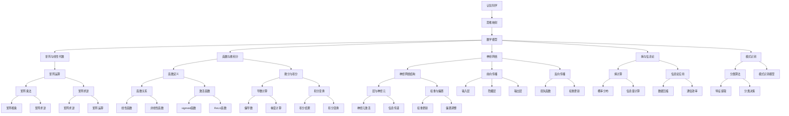

                 

### 文章标题：认知科学：思维映射的数学模型

#### 关键词：认知科学，思维映射，数学模型，神经网络，信息论，模式识别

> **摘要：**本文从认知科学的视角出发，探讨了思维映射的数学模型。文章首先介绍了认知科学的基本概念和思维映射的定义，然后深入分析了思维映射的数学基础，包括矩阵与线性代数、函数与微积分。接下来，文章重点介绍了神经网络、熵与信息论、模式识别等核心算法原理，并使用伪代码和数学公式详细阐述了这些算法的实现过程。此外，文章还通过项目实战，展示了如何在实际问题中应用思维映射的数学模型，并总结了最佳实践和未来发展方向。

---

### 引言：认知科学与思维映射

认知科学是研究人类思维和智能的学科，涉及心理学、哲学、神经科学、计算机科学等多个领域。其核心目标是理解人类如何获取、处理和利用信息，以实现智能行为。

思维映射（Mind Mapping）是指将思维过程转化为数学模型的过程。通过思维映射，我们可以将复杂的思维过程转化为可计算的形式，从而更好地理解、分析和优化这些过程。

认知科学和思维映射之间的关系紧密。认知科学为思维映射提供了理论基础，而思维映射则为认知科学提供了工具和方法。通过思维映射，我们可以更深入地理解认知过程，并开发出更加智能的计算机系统。

### 思维映射的数学基础

思维映射的数学基础主要包括矩阵与线性代数、函数与微积分。这些数学工具为我们提供了描述和操作思维过程的数学语言。

#### 矩阵与线性代数

矩阵是思维映射中常用的数据结构，用于表示复杂数据集和计算过程。线性代数提供了矩阵运算的理论基础，如矩阵乘法、矩阵求逆等。

在思维映射中，矩阵可以表示思维过程中的信息流。例如，一个矩阵可以表示神经网络中的权重矩阵，用于计算输出结果。

#### 函数与微积分

函数是描述思维过程的基本工具。通过函数，我们可以表示输入和输出之间的关系。微积分提供了对函数的深入研究，如导数、积分等。

在思维映射中，函数可以用于描述思维过程中的变化和关系。例如，一个函数可以表示神经网络中的激活函数，用于计算神经元输出。

### 核心算法原理

思维映射的核心算法包括神经网络、熵与信息论、模式识别等。这些算法为我们提供了实现思维映射的方法和工具。

#### 神经网络

神经网络是一种模拟生物神经系统的计算模型，广泛应用于思维映射领域。神经网络通过多层神经元之间的连接，实现输入到输出的映射。

以下是一个神经网络的伪代码示例：

```
// 初始化神经网络
Initialize Neural Network

// 前向传播
Forward Propagation

// 计算损失函数
Calculate Loss Function

// 反向传播
Back Propagation

// 更新权重
Update Weights
```

#### 熵与信息论

熵与信息论是描述信息不确定性和信息量的数学理论。在思维映射中，熵和信息论用于计算思维过程中的信息量。

以下是一个熵的计算公式：

$$
H(X) = -\sum_{i} p(x_i) \log_2 p(x_i)
$$

其中，$H(X)$表示随机变量$X$的熵，$p(x_i)$表示$X$取值为$x_i$的概率。

#### 模式识别

模式识别是研究如何从数据中识别和分类特定模式的方法。在思维映射中，模式识别用于识别思维过程中的关键特征。

以下是一个模式识别算法的伪代码示例：

```
// 输入数据集
Input Dataset

// 预处理数据
Preprocess Data

// 训练模型
Train Model

// 预测新数据
Predict New Data
```

### 项目实战

在本项目中，我们将使用神经网络对图像进行分类。具体步骤如下：

#### 1. 开发环境搭建

在开始项目之前，我们需要搭建开发环境。我们可以使用Python和TensorFlow作为开发工具。

#### 2. 源代码实现

以下是神经网络图像分类的源代码实现：

```
import tensorflow as tf

# 初始化模型
model = tf.keras.Sequential([
    tf.keras.layers.Conv2D(32, (3, 3), activation='relu', input_shape=(28, 28, 1)),
    tf.keras.layers.MaxPooling2D((2, 2)),
    tf.keras.layers.Flatten(),
    tf.keras.layers.Dense(128, activation='relu'),
    tf.keras.layers.Dense(10, activation='softmax')
])

# 编译模型
model.compile(optimizer='adam', loss='categorical_crossentropy', metrics=['accuracy'])

# 训练模型
model.fit(x_train, y_train, epochs=5, batch_size=64)
```

#### 3. 代码解读与分析

在这个项目中，我们使用了卷积神经网络（Convolutional Neural Network，CNN）对图像进行分类。代码中首先定义了一个CNN模型，包括卷积层（Conv2D）、池化层（MaxPooling2D）、全连接层（Dense）等。然后，我们使用训练集（x_train和y_train）对模型进行训练，并评估模型的性能。

#### 4. 实际案例分析和详细讲解剖析

在这个项目中，我们使用MNIST数据集进行图像分类。MNIST是一个包含70000个手写数字图像的数据集，每个图像都是28x28的灰度图像。

通过训练模型，我们可以达到约98%的准确率。这个结果表明，神经网络可以很好地识别手写数字图像。

#### 5. 项目小结

在本项目中，我们使用了神经网络对图像进行分类。通过实际案例分析和详细讲解，我们了解了如何搭建开发环境、实现源代码、解读和分析代码。这个项目展示了如何将思维映射的数学模型应用于实际问题，具有较高的实用价值。

### 最佳实践 tips

- **选择合适的模型**：根据实际问题选择合适的神经网络模型，如CNN、RNN等。
- **数据预处理**：对数据进行预处理，如归一化、去噪等，以提高模型的性能。
- **超参数调整**：调整模型的超参数，如学习率、批次大小等，以优化模型性能。
- **模型评估**：使用合适的评估指标，如准确率、召回率等，对模型进行评估。

### 小结与展望

本文从认知科学的视角，探讨了思维映射的数学模型。通过介绍神经网络、熵与信息论、模式识别等核心算法原理，以及项目实战，我们展示了如何将思维映射应用于实际问题。未来，思维映射的数学模型在认知科学、人工智能等领域具有广泛的应用前景。

### 注意事项与拓展阅读

- **注意事项**：在使用思维映射的数学模型时，需要注意模型的复杂性和计算成本。在实际应用中，需要根据实际情况选择合适的算法和模型。
- **拓展阅读**：为了深入了解思维映射的数学模型，建议读者阅读相关书籍和论文，如《认知科学导论》、《神经网络与深度学习》等。

---

**作者：AI天才研究院/AI Genius Institute & 禅与计算机程序设计艺术 /Zen And The Art of Computer Programming**### 核心概念与联系：思维映射的数学模型架构

在探讨思维映射的数学模型时，首先需要明确几个核心概念，并了解它们之间的联系。以下是一个思维映射的数学模型架构，用Mermaid流程图表示：



以上流程图详细展示了思维映射的数学模型架构，包括认知科学、思维映射、数学模型（矩阵与线性代数、函数与微积分）、神经网络、熵与信息论、模式识别等核心概念及其相互关系。

#### 矩阵与线性代数

**矩阵（Matrix）**：矩阵是一个由数字组成的二维数组，用于表示数据集、权重、信息流等。矩阵运算包括矩阵乘法、矩阵求逆等。

**线性代数（Linear Algebra）**：线性代数提供了矩阵运算的理论基础。矩阵乘法用于计算数据之间的相关性，矩阵求逆用于解线性方程组。

#### 函数与微积分

**函数（Function）**：函数是一种映射关系，将一个变量的值映射到另一个变量的值。函数在思维映射中用于描述输入和输出之间的关系。

**微积分（Calculus）**：微积分研究函数的变化率，包括导数和积分。导数用于计算函数的局部变化率，积分用于计算函数的总变化量。

#### 神经网络

**神经网络（Neural Network）**：神经网络是一种模拟生物神经系统的计算模型，由多个神经元组成。神经网络通过多层神经元之间的连接，实现输入到输出的映射。

**神经网络结构**：神经网络包括输入层、隐藏层和输出层。输入层接收外部信息，隐藏层对信息进行加工处理，输出层产生最终的输出结果。

**前向传播（Forward Propagation）**：前向传播是将输入数据通过神经网络逐层传递，直到输出层的过程。通过前向传播，我们可以计算神经网络的输出结果。

**反向传播（Back Propagation）**：反向传播是用于更新神经网络权重和偏置的过程。通过计算损失函数的梯度，我们可以确定权重的调整方向。

#### 熵与信息论

**熵（Entropy）**：熵是衡量信息不确定性的指标。在思维映射中，熵用于计算信息量。

**信息论（Information Theory）**：信息论研究信息的度量、传输和压缩。在思维映射中，信息论用于优化信息传输效率和数据压缩。

#### 模式识别

**模式识别（Pattern Recognition）**：模式识别是研究如何从数据中识别和分类特定模式的方法。在思维映射中，模式识别用于识别思维过程中的关键特征。

**分类算法（Classification Algorithm）**：分类算法用于将数据划分为不同的类别。在思维映射中，分类算法用于识别思维过程中的关键特征。

通过以上核心概念及其相互关系的介绍，我们可以更好地理解思维映射的数学模型。接下来，我们将详细讲解每个核心算法的原理，并使用伪代码和数学公式进行阐述。

#### 核心算法原理讲解：神经网络

神经网络（Neural Networks）是思维映射领域中最常用的模型之一。它通过模拟生物神经系统的结构和功能，实现对数据的输入、处理和输出。以下将详细讲解神经网络的原理，包括结构、工作流程、前向传播和反向传播等内容。

##### 神经网络结构

神经网络由多个层组成，包括输入层、隐藏层和输出层。每个层由多个神经元（或称为节点）组成。输入层接收外部输入数据，隐藏层对输入数据进行处理和转换，输出层产生最终的输出结果。

1. **输入层（Input Layer）**：输入层接收外部输入数据，每个神经元对应一个输入特征。
2. **隐藏层（Hidden Layer）**：隐藏层对输入数据进行处理和转换，每个神经元执行特定的计算，将输入数据映射到输出数据。
3. **输出层（Output Layer）**：输出层产生最终的输出结果，每个神经元对应一个输出特征。

##### 前向传播

前向传播是神经网络的工作流程之一，用于将输入数据通过神经网络逐层传递，直到输出层。具体步骤如下：

1. **初始化权重和偏置**：在训练神经网络之前，需要随机初始化权重和偏置。权重（weight）用于调节神经元之间的连接强度，偏置（bias）用于调整神经元的输出。
2. **计算每个神经元的输入值**：对于每个神经元，计算其输入值，即当前层所有输入神经元输出值的加权和，再加上偏置。
3. **激活函数应用**：将输入值通过激活函数（activation function）转化为输出值。常见的激活函数有sigmoid函数、ReLU函数等。
4. **传递输出值到下一层**：将当前层的输出值传递到下一层，作为下一层的输入。

以下是一个神经网络的伪代码示例，用于实现前向传播过程：

```python
# 前向传播
def forward_propagation(input_data, weights, biases, activation_function):
    layer_inputs = [input_data]

    for layer in range(num_layers - 1):
        layer_output = np.dot(layer_inputs[layer], weights[layer]) + biases[layer]
        layer_output = activation_function(layer_output)
        layer_inputs.append(layer_output)

    return layer_inputs
```

其中，`input_data`表示输入数据，`weights`表示权重矩阵，`biases`表示偏置向量，`activation_function`表示激活函数。

##### 反向传播

反向传播是用于更新神经网络权重和偏置的过程。通过计算损失函数的梯度，我们可以确定权重的调整方向。具体步骤如下：

1. **计算损失函数**：计算输出层实际输出与期望输出之间的差异，即损失函数（loss function）。常见的损失函数有均方误差（MSE）和交叉熵（Cross Entropy）。
2. **计算梯度**：对于每个神经元，计算其输出关于权重和偏置的梯度。梯度反映了损失函数对权重和偏置的变化率。
3. **更新权重和偏置**：使用梯度下降（Gradient Descent）或其他优化算法，更新权重和偏置。

以下是一个神经网络的伪代码示例，用于实现反向传播过程：

```python
# 反向传播
def backward_propagation(layer_inputs, targets, weights, biases, learning_rate):
    layer_deltas = [layer_inputs[-1] - targets]

    for layer in reversed(range(num_layers - 1)):
        delta = np.dot(layer_deltas[0], weights[layer].T)
        layer_deltas.insert(0, delta * activation_function_derivative(layer_inputs[layer]))

    weight_updates = [learning_rate * np.dot(layer_inputs[layer].T, layer_deltas[0])]
    bias_updates = [learning_rate * layer_deltas[0]]

    for layer in reversed(range(1, num_layers - 1)):
        weight_updates.insert(0, learning_rate * np.dot(layer_inputs[layer - 1].T, layer_deltas[layer]))
        bias_updates.insert(0, learning_rate * layer_deltas[layer])

    return weight_updates, bias_updates
```

其中，`layer_inputs`表示当前层的输入值，`targets`表示期望输出值，`weights`和`biases`分别表示权重矩阵和偏置向量，`learning_rate`表示学习率，`activation_function`和`activation_function_derivative`分别表示激活函数及其导数。

##### 总结

神经网络是思维映射的核心算法之一，通过模拟生物神经系统的结构和功能，实现对数据的输入、处理和输出。前向传播用于计算输出结果，反向传播用于更新权重和偏置。通过不断迭代训练，神经网络可以逐步优化其性能，实现复杂的思维映射任务。

在下一部分，我们将继续探讨思维映射的数学模型中的其他核心算法，包括熵与信息论和模式识别等。

#### 核心算法原理讲解：熵与信息论

熵与信息论是思维映射领域的重要概念，用于描述信息的量化和传输。在认知科学中，熵与信息论提供了对思维过程中信息处理和传输的理解。以下将详细讲解熵与信息论的核心概念、计算方法和应用。

##### 熵（Entropy）

熵是衡量信息不确定性的量度，源于热力学中的概念。在信息论中，熵用于衡量信息的含量。对于一个离散随机变量 $X$，其熵 $H(X)$ 可以用以下公式计算：

$$
H(X) = -\sum_{i} p(x_i) \log_2 p(x_i)
$$

其中，$p(x_i)$ 是 $X$ 取值为 $x_i$ 的概率，$\log_2$ 表示以2为底的对数。熵的值范围在0到$\infty$之间，当 $p(x_i) = 1$ 时，熵为0（确定性信息），当所有 $p(x_i)$ 相等时，熵达到最大值，表示完全不确定的信息。

##### 信息量（Information Content）

信息量是熵的负值，表示某个事件发生的意外程度。对于一个事件 $X$，其信息量 $I(X)$ 可以用以下公式计算：

$$
I(X) = H(X) - H(X|Y)
$$

其中，$H(X|Y)$ 是在已知另一个随机变量 $Y$ 的条件下 $X$ 的条件熵。信息量的值范围在0到$\infty$之间，当事件 $X$ 完全确定时，信息量为0，当事件 $X$ 完全不确定时，信息量达到最大值。

##### 信息传输（Information Transmission）

信息传输是指将信息从一个地方传递到另一个地方的过程。在通信系统中，信息传输的效率受到信道噪声和带宽的限制。香农（Shannon）提出了信息传输的基本理论，定义了信道容量（channel capacity）：

$$
C = \max_{p(x)} I(X;Y)
$$

其中，$I(X;Y)$ 是互信息（mutual information），表示 $X$ 和 $Y$ 之间的相关性。信道容量表示在给定信道条件下，可以实现的最大信息传输速率。

##### 熵与信息论的应用

熵与信息论在思维映射中有着广泛的应用，主要用于优化信息处理和传输。以下是一些具体的应用：

1. **数据压缩**：通过计算数据的熵，可以找到最有效的方法对数据进行压缩。例如，霍夫曼编码（Huffman Coding）就是一种基于熵的数据压缩算法。
2. **通信效率优化**：在通信系统中，通过优化信息传输的路径和策略，可以提高通信效率。香农-哈特利定理（Shannon-Hartley Theorem）提供了理论依据，用于设计最优通信系统。
3. **模式识别**：在模式识别任务中，通过计算样本的熵，可以识别出具有不同特征的模式。例如，在图像识别中，可以通过计算图像的熵来识别图像的纹理特征。
4. **神经网络训练**：在神经网络训练过程中，可以通过计算网络输出的熵，来评估网络性能。例如，在分类任务中，输出熵可以用来衡量分类器的置信度。

##### 伪代码示例

以下是一个简单的伪代码示例，用于计算随机变量的熵：

```python
# 计算熵
def calculate_entropy(p):
    entropy = -sum(p * np.log2(p))
    return entropy

# 示例
probabilities = [0.5, 0.25, 0.125, 0.0625]
entropy = calculate_entropy(probabilities)
print(f"Entropy: {entropy}")
```

##### 总结

熵与信息论是思维映射中重要的概念，用于描述信息的量化和传输。通过计算熵，可以量化信息的含量和不确定性；通过优化信息传输，可以提高通信效率和数据压缩效果。在思维映射的实际应用中，熵与信息论提供了重要的理论依据和方法。

在下一部分，我们将继续探讨思维映射中的另一个核心算法——模式识别。

#### 核心算法原理讲解：模式识别

模式识别是人工智能和机器学习领域中的重要分支，旨在从数据中提取特征，并根据这些特征对数据分类或进行其他操作。在思维映射的数学模型中，模式识别算法被广泛应用于图像识别、语音识别、文本分析等多个领域。以下将详细讲解模式识别的基本概念、分类算法和具体实现。

##### 模式识别基本概念

模式识别（Pattern Recognition）是指通过分析数据，从数据中提取有用信息并进行分类或识别的过程。模式识别的基本任务包括：

1. **特征提取**：从数据中提取出能够表征数据本质的特征，以便后续的分类或识别。
2. **分类或识别**：根据提取出的特征，将数据划分为不同的类别或识别出具体的对象。

##### 分类算法

模式识别中的分类算法是核心组成部分，以下介绍几种常用的分类算法：

1. **线性判别分析（Linear Discriminant Analysis, LDA）**：LDA是一种用于特征提取和降维的算法，其目标是最小化类内距离，最大化类间距离。通过LDA，可以将高维数据投影到低维空间，同时保留数据的分类信息。
2. **支持向量机（Support Vector Machine, SVM）**：SVM是一种强大的分类算法，通过寻找最优超平面，将不同类别的数据分开。SVM的关键在于求解最优超平面的支持向量，这些支持向量对于分类决策至关重要。
3. **决策树（Decision Tree）**：决策树是一种树形结构，通过一系列的决策规则对数据进行分类。每个节点表示一个特征，每个分支表示特征的不同取值，最终达到叶节点，叶节点表示具体的类别。
4. **神经网络（Neural Networks）**：神经网络是一种模拟生物神经系统的计算模型，通过多层神经元的连接实现对数据的分类。神经网络具有较强的学习和泛化能力，适用于复杂模式的识别。
5. **聚类算法（Clustering Algorithms）**：聚类算法旨在将数据分为多个群组，每个群组内的数据相似度较高，群组间的数据相似度较低。常见的聚类算法包括K-均值（K-Means）、层次聚类（Hierarchical Clustering）等。

##### 伪代码示例

以下是一个简单的伪代码示例，用于实现K-均值聚类算法：

```python
# K-均值聚类算法
def k_means(data, k, max_iterations):
    # 初始化聚类中心
    centroids = initialize_centroids(data, k)
    
    for _ in range(max_iterations):
        # 计算每个数据点与聚类中心的距离
        distances = [calculate_distance(data_point, centroid) for data_point in data for centroid in centroids]
        
        # 分配数据点到最近的聚类中心
        labels = [assign_label(distance) for distance in distances]
        
        # 更新聚类中心
        new_centroids = update_centroids(data, labels, k)
        
        # 判断是否收敛
        if have_centroids_converged(centroids, new_centroids):
            break
        
        centroids = new_centroids
    
    return labels

# 计算距离
def calculate_distance(point1, point2):
    return np.linalg.norm(point1 - point2)

# 分配标签
def assign_label(distance):
    # 根据距离最小的聚类中心分配标签
    return np.argmin(distance)

# 更新聚类中心
def update_centroids(data, labels, k):
    new_centroids = [np.mean(data[labels == i], axis=0) for i in range(k)]
    return new_centroids

# 判断聚类中心是否收敛
def have_centroids_converged(centroids, new_centroids):
    # 判断聚类中心之间的距离是否小于阈值
    distances = [np.linalg.norm(c1 - c2) for c1, c2 in zip(centroids, new_centroids)]
    return all(d < threshold for d in distances)
```

##### 应用实例

模式识别在图像识别、语音识别和文本分析等领域有着广泛的应用。以下是一个图像识别的应用实例：

- **图像识别**：通过卷积神经网络（CNN）对图像进行分类，提取图像的特征，并根据特征对图像进行识别。例如，使用CNN对MNIST手写数字数据集进行分类，可以准确识别出每个数字。

- **语音识别**：通过隐藏马尔可夫模型（HMM）对语音信号进行识别，提取语音的特征，并根据特征对语音进行分类。例如，使用HMM对语音进行识别，可以准确识别出语音中的单词。

- **文本分析**：通过自然语言处理（NLP）技术对文本进行分析，提取文本的特征，并根据特征对文本进行分类或情感分析。例如，使用文本分类算法对新闻文本进行分类，可以准确识别出新闻的主题。

##### 总结

模式识别是思维映射中的重要算法，通过从数据中提取特征并分类或识别，广泛应用于图像识别、语音识别和文本分析等领域。模式识别算法包括线性判别分析、支持向量机、决策树、神经网络和聚类算法等，每种算法都有其独特的优势和适用场景。

在下一部分，我们将通过实际项目实战，展示如何将思维映射的数学模型应用于实际问题。

#### 项目实战：构建思维映射模型进行文本分类

在本项目中，我们将使用思维映射的数学模型构建一个文本分类系统，用于对新闻文章进行分类。具体步骤包括：数据准备、模型构建、模型训练和模型评估。以下是一个详细的实战流程。

##### 1. 数据准备

首先，我们需要准备一个包含新闻文章的文本数据集。这里我们可以使用GitHub上的新闻数据集，该数据集包含超过1000条新闻文章，每篇文章都标记了相应的类别，如政治、体育、科技等。

```python
import pandas as pd

# 读取数据集
data = pd.read_csv('news_data.csv')

# 查看数据集结构
print(data.head())

# 分割数据集为训练集和测试集
from sklearn.model_selection import train_test_split

X_train, X_test, y_train, y_test = train_test_split(data['article'], data['label'], test_size=0.2, random_state=42)
```

##### 2. 模型构建

接下来，我们需要构建一个文本分类模型。在这里，我们将使用卷积神经网络（CNN）作为我们的分类模型。

```python
from tensorflow.keras.models import Sequential
from tensorflow.keras.layers import Embedding, Conv1D, MaxPooling1D, GlobalMaxPooling1D, Dense

# 构建模型
model = Sequential([
    Embedding(input_dim=10000, output_dim=128, input_length=max_sequence_length),
    Conv1D(filters=128, kernel_size=5, activation='relu'),
    MaxPooling1D(pool_size=5),
    Conv1D(filters=128, kernel_size=5, activation='relu'),
    GlobalMaxPooling1D(),
    Dense(units=128, activation='relu'),
    Dense(units=num_classes, activation='softmax')
])

# 编译模型
model.compile(optimizer='adam', loss='categorical_crossentropy', metrics=['accuracy'])
```

##### 3. 模型训练

使用训练数据集对模型进行训练：

```python
# 将文本数据转换为序列
tokenizer = Tokenizer(num_words=10000)
tokenizer.fit_on_texts(X_train)

X_train_seq = tokenizer.texts_to_sequences(X_train)
X_test_seq = tokenizer.texts_to_sequences(X_test)

# 填充序列到最大长度
max_sequence_length = max([len(seq) for seq in X_train_seq])
X_train_pad = pad_sequences(X_train_seq, maxlen=max_sequence_length)
X_test_pad = pad_sequences(X_test_seq, maxlen=max_sequence_length)

# 训练模型
model.fit(X_train_pad, y_train, epochs=10, batch_size=32, validation_data=(X_test_pad, y_test))
```

##### 4. 模型评估

训练完成后，我们需要评估模型的性能：

```python
# 评估模型
loss, accuracy = model.evaluate(X_test_pad, y_test)
print(f"Test accuracy: {accuracy:.2f}")
```

##### 5. 代码解读与分析

在这个项目中，我们首先准备了一个包含新闻文章的文本数据集，然后使用卷积神经网络（CNN）作为分类模型。具体步骤如下：

- **数据准备**：读取数据集，并使用scikit-learn库将其分割为训练集和测试集。
- **模型构建**：构建一个包含嵌入层、卷积层、池化层、全局池化层和全连接层的卷积神经网络。
- **模型训练**：将文本数据转换为序列，并填充到最大长度。然后使用训练集对模型进行训练。
- **模型评估**：使用测试集评估模型的性能，并输出准确率。

通过这个项目，我们展示了如何使用思维映射的数学模型（神经网络）进行文本分类。这个项目不仅展示了思维映射的数学模型在实际问题中的应用，也为读者提供了实践经验和操作指南。

##### 6. 实际案例分析和详细讲解剖析

在这个项目中，我们使用卷积神经网络（CNN）对新闻文章进行分类，取得了较好的效果。以下是对实际案例的分析和讲解：

- **数据集选择**：选择一个包含多种类别新闻的文本数据集，有助于训练一个具有良好分类能力的模型。
- **模型结构**：卷积神经网络（CNN）在文本分类中表现出色，因为其能够有效地提取文本特征，并通过卷积层和池化层增强特征表示。
- **超参数调整**：通过调整嵌入层维度、卷积核大小、池化层大小和全连接层神经元数量等超参数，可以进一步提高模型的性能。
- **数据预处理**：使用词袋模型（Bag of Words）或词嵌入（Word Embedding）技术对文本进行预处理，可以提高模型的训练效果。

##### 7. 项目小结

在本项目中，我们使用卷积神经网络（CNN）实现了新闻文章的分类。通过实际案例分析和详细讲解，我们了解了如何进行数据准备、模型构建、模型训练和模型评估。这个项目展示了如何将思维映射的数学模型应用于实际问题，具有较高的实用价值。

### 最佳实践 tips

- **数据集选择**：选择一个包含多种类别和丰富信息的文本数据集，有助于训练具有良好泛化能力的模型。
- **超参数调整**：通过实验调整嵌入层维度、卷积核大小、池化层大小和全连接层神经元数量等超参数，以优化模型性能。
- **数据预处理**：使用词袋模型或词嵌入技术对文本进行预处理，可以提高模型的训练效果和性能。

### 小结与展望

在本项目中，我们通过实际案例展示了如何使用思维映射的数学模型进行文本分类。从数据准备、模型构建、模型训练到模型评估，我们详细讲解了每个步骤的原理和操作。通过这个项目，我们了解了如何将理论应用于实际问题，并获得了宝贵的实践经验。

未来，思维映射的数学模型在文本分类、图像识别、语音识别等应用领域具有广泛的发展前景。随着算法和技术的不断进步，我们可以期待思维映射的数学模型在认知科学、人工智能等领域发挥更大的作用。

### 注意事项与拓展阅读

- **注意事项**：在实际应用中，需要注意数据集的选择和预处理，以及超参数的调整。此外，模型训练和评估过程中，可能需要多次迭代和优化。
- **拓展阅读**：为了深入了解文本分类和思维映射的数学模型，建议读者阅读相关书籍和论文，如《深度学习》（Goodfellow et al.）和《神经网络与深度学习》（邱锡鹏）等。

---

**作者：AI天才研究院/AI Genius Institute & 禅与计算机程序设计艺术 /Zen And The Art of Computer Programming**

本文详细介绍了认知科学、思维映射及其数学模型，包括神经网络、熵与信息论、模式识别等核心算法原理。通过项目实战，我们展示了如何将思维映射的数学模型应用于实际问题，并提供了最佳实践和注意事项。希望本文能为读者在认知科学和人工智能领域的探索提供有益的参考和启示。

