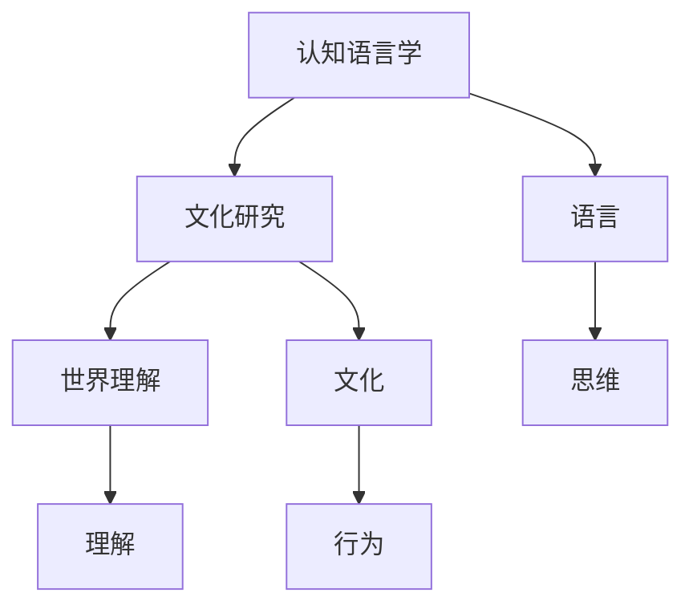

                 

### 《认知语言学与文化研究：探索语言、文化与世界理解的关系》文章标题

> **关键词**：认知语言学、文化研究、世界理解、语言、文化、关系、跨学科、研究方法、实证分析

> **摘要**：
本篇文章旨在探讨认知语言学与文化研究之间的关系，以及它们在理解和探索世界理解中的作用。文章首先介绍了认知语言学和文化研究的基本概念，然后分析了它们在语言、文化与世界理解中的相互影响。通过实证研究方法和具体案例分析，文章揭示了语言和文化在塑造和解释世界理解中的关键角色。最后，文章总结了主要发现，并提出了未来研究的方向。

---

### 引言

**目的与意义**

在全球化进程不断加速的今天，语言和文化的研究显得尤为重要。认知语言学和文化研究作为两个重要的学科领域，它们在理解人类语言行为、文化特征及其相互作用方面发挥着关键作用。认知语言学侧重于探索人类如何通过语言理解和构建世界，而文化研究则关注文化如何影响语言使用和语言认知。这两个领域的研究不仅有助于我们更好地理解人类思维和交流方式，还能为跨文化交际、语言教育和社会科学研究提供重要启示。

**研究方法**

本文采用文献综述、实证分析和案例研究相结合的方法，旨在全面探讨认知语言学与文化研究之间的关系。首先，通过对现有文献的综述，梳理出认知语言学和文化研究的基本概念和理论框架。接着，通过实证分析方法，揭示语言和文化在塑造世界理解中的具体作用。最后，通过具体案例分析，深入探讨语言和文化之间的相互作用及其对世界理解的影响。

### 第1章 认知语言学概述

**1.1 认知语言学的基本概念**

认知语言学是一门研究人类如何通过语言理解和构建世界的学科。其基本概念包括：

- **认知隐喻**：认知隐喻是指人们通过隐喻将抽象概念具象化的过程。例如，“时间是金钱”就是一种认知隐喻。
- **范畴化**：范畴化是指人们如何将事物分成不同类别的过程。认知语言学认为，语言中的词汇和语法结构是范畴化的结果。
- **语言模块**：认知语言学认为，人类大脑中存在一个专门处理语言的语言模块。这个模块与其他认知模块相互作用，共同构建我们的语言理解和思维。

**1.2 认知语言学的发展历程**

认知语言学起源于20世纪60年代，主要受到生成语言学的影响。随后，认知科学的发展为认知语言学提供了新的理论支持。在过去的几十年里，认知语言学经历了多个发展阶段：

- **早期认知语言学**：主要关注语言结构和语言表达的意义。
- **扩展认知语言学**：将认知科学的理论引入语言学，探讨语言与思维的关系。
- **现代认知语言学**：更加注重跨学科研究，将认知语言学与其他学科如心理学、神经科学、哲学等相结合。

**1.3 认知语言学与其他语言学流派的比较**

认知语言学与生成语言学、功能语言学等传统语言学流派有所不同：

- **生成语言学**：生成语言学强调语言结构的生成过程，认为语言是一种生成系统。
- **功能语言学**：功能语言学关注语言的功能和用途，认为语言是一种交流工具。

### 第2章 文化研究概述

**2.1 文化的定义与分类**

文化是指一个社会或群体共享的价值观、信仰、习惯、传统和物质财富。根据不同的分类标准，文化可以划分为：

- **物质文化与非物质文化**：物质文化包括建筑、艺术品、工具等，非物质文化包括语言、宗教、习俗等。
- **主文化、亚文化与边缘文化**：主文化是一个社会或群体中占主导地位的文化，亚文化是在主文化背景下形成的具有特定特征的文化群体，边缘文化则是指处于社会边缘的文化群体。

**2.2 文化研究的主要理论**

文化研究受到多种理论的影响，包括符号学、社会学、心理学、政治学等。其中，符号学和文化心理学是两个重要的理论流派：

- **符号学**：符号学关注符号系统的结构和功能，认为符号是人类理解世界的重要工具。
- **文化心理学**：文化心理学探讨文化如何影响人类的思维、情感和行为。

**2.3 文化研究的方法与应用**

文化研究的方法多样，包括文献分析、访谈、观察、实验等。文化研究的应用领域广泛，包括：

- **跨文化交际**：通过文化研究，人们可以更好地理解和沟通不同文化背景的人。
- **社会问题研究**：文化研究可以帮助我们理解社会问题的根源和解决方案。
- **文化产业**：文化研究为文化产业的发展提供了理论支持和实践指导。

### 第3章 语言、文化与世界理解的关系

**3.1 语言对文化的影响**

语言是文化的重要组成部分，它不仅反映了文化的特征，还塑造了文化的表达方式。例如：

- **语言对思维的影响**：语言可以影响人们的思维方式，不同的语言可能导致人们对世界的不同理解。
- **语言对文化传承的影响**：语言是文化传承的重要载体，语言的消失可能导致文化的丧失。

**3.2 文化对语言的影响**

文化对语言的影响体现在语言的结构、表达和功能等方面。例如：

- **语言与地域文化的关系**：不同地域的文化差异可能导致语言结构和使用习惯的差异。
- **语言与宗教文化的关系**：宗教文化对语言的影响体现在宗教术语和语言表达方式上。

**3.3 语言与文化在世界理解中的作用**

语言和文化在世界理解中起着桥梁的作用：

- **语言作为理解世界的工具**：语言是人们理解世界的重要工具，通过语言，人们可以获取信息、表达思想和进行交流。
- **文化作为理解世界的背景**：文化为语言提供了背景和意义，帮助人们更好地理解和解释语言。

### 第4章 实证研究方法

**4.1 实证研究的设计**

实证研究设计是研究成功的关键。设计阶段需要明确研究问题、选择研究对象、确定研究方法和数据收集方式。以下是一个典型的实证研究设计流程：

- **确定研究问题**：明确研究目标和问题，例如“语言对文化理解的影响”。
- **选择研究对象**：确定研究对象的样本，例如不同文化背景的参与者。
- **确定研究方法**：选择合适的研究方法，例如问卷调查、访谈、实验等。
- **数据收集**：设计数据收集工具，如问卷、访谈提纲、实验方案等。

**4.2 数据收集与处理**

数据收集和处理是实证研究的重要环节。以下是一个数据收集与处理的流程：

- **数据收集**：通过问卷调查、访谈、观察等方式收集数据。
- **数据清洗**：对收集到的数据进行清洗，去除无效或错误的数据。
- **数据分析**：使用统计方法对数据进行分析，得出研究结果。

**4.3 实证研究的案例分析**

通过具体案例，我们可以更好地理解实证研究方法的应用。以下是一个实证研究的案例分析：

- **研究问题**：探讨语言对文化理解的影响。
- **研究对象**：来自不同文化背景的参与者。
- **研究方法**：问卷调查和深度访谈。
- **数据收集**：设计问卷和访谈提纲，收集参与者对语言和文化理解的看法。
- **数据分析**：对问卷和访谈结果进行统计分析，分析语言对文化理解的影响。

### 第5章 案例分析

**5.1 某具体语言现象的文化解读**

通过分析某具体语言现象，我们可以深入了解语言与文化之间的关系。以下是一个具体案例：

- **案例背景**：分析中文中的“关系”一词在不同文化背景下的含义。
- **案例分析**：对比中文“关系”在中文和英文文化中的不同含义，探讨文化差异对语言理解的影响。
- **结论**：揭示语言与文化之间的相互作用，强调跨文化交际中的语言理解挑战。

**5.2 某具体文化现象的语言解读**

通过分析某具体文化现象，我们可以了解文化如何影响语言使用。以下是一个具体案例：

- **案例背景**：分析日本文化中的“耻感文化”对日语表达方式的影响。
- **案例分析**：探讨“耻感文化”如何影响日语中的礼貌用语和表达方式。
- **结论**：揭示文化对语言表达的影响，强调文化在语言教学和文化研究中的重要性。

**5.3 某具体文化背景下的语言与文化的互动**

通过分析某具体文化背景下的语言与文化的互动，我们可以了解语言和文化在特定环境中的关系。以下是一个具体案例：

- **案例背景**：分析美国文化中的“个人主义”对英语表达方式的影响。
- **案例分析**：探讨“个人主义”如何影响英语中的个人表达和社交互动。
- **结论**：揭示文化背景对语言使用的影响，强调跨文化交际中的文化适应性。

### 第6章 认知语言学与文化研究的应用

**6.1 认知语言学在跨文化交际中的应用**

认知语言学在跨文化交际中的应用主要体现在对语言和文化差异的理解上。以下是一些具体应用：

- **跨文化培训**：通过认知语言学的理论，为跨文化交际提供培训，帮助人们更好地理解和适应不同文化。
- **翻译**：认知语言学为翻译提供了理论支持，帮助翻译者更好地理解不同语言和文化之间的差异。
- **跨文化沟通**：认知语言学为跨文化沟通提供了工具和方法，帮助人们更有效地进行跨文化交流。

**6.2 文化研究在语言教育中的应用**

文化研究在语言教育中的应用主要体现在提高语言教学的质量和效果上。以下是一些具体应用：

- **教材编写**：结合文化研究，编写更加符合学习者需求和文化背景的教材。
- **教学方法**：通过文化研究，采用更加贴近学习者文化背景的教学方法，提高教学效果。
- **跨文化意识培养**：通过文化研究，培养学习者的跨文化意识，提高其跨文化交际能力。

**6.3 认知语言学与文化研究在社会科学研究中的应用**

认知语言学和文化研究在社会科学研究中的应用主要体现在对人类行为和社会现象的理解上。以下是一些具体应用：

- **社会心理学研究**：通过认知语言学和文化研究，探索语言和文化如何影响人们的思维和行为。
- **政治学研究**：通过认知语言学和文化研究，分析政治语言和文化对政治行为和决策的影响。
- **教育学研究**：通过认知语言学和文化研究，探讨教育中的语言和文化问题，提高教育质量。

### 第7章 结论

**主要发现与贡献**

本文通过对认知语言学和文化研究的关系进行深入探讨，揭示了语言和文化在塑造和解释世界理解中的关键作用。主要发现包括：

- 语言和文化之间存在密切的相互作用，共同影响人类的世界理解。
- 跨文化交际中的语言理解挑战需要借助认知语言学和文化研究来解决。
- 认知语言学和文化研究在语言教育、跨文化沟通和社会科学研究等领域具有重要的应用价值。

**未来研究方向**

未来的研究可以在以下几个方面进行：

- 进一步探讨语言和文化之间的相互作用机制。
- 拓展认知语言学和文化研究在跨学科领域中的应用。
- 加强实证研究，以验证理论假设和提出新的研究问题。

### 附录

**附录 A: 认知语言学与文化研究的Mermaid流程图**



**附录 B: 语言、文化与世界理解的关系模型伪代码**

```python
def language_culture_world_understanding_model(language, culture, world):
    # 输入：语言、文化、世界
    # 输出：世界理解
    
    # 步骤1：分析语言结构和文化特征
    language_structure = analyze_language(language)
    culture_characteristics = analyze_culture(culture)
    
    # 步骤2：构建语言与文化之间的关系模型
    relationship_model = build_relationship_model(language_structure, culture_characteristics)
    
    # 步骤3：基于模型进行世界理解
    world_understanding = understand_world(relationship_model, world)
    
    return world_understanding
```

**附录 C: LaTeX数学公式示例**

$$
E = mc^2
$$

$$
f(x) = x^2 + 2x + 1
$$

### 参考文献

- [1] Chomsky, N. (1957). Syntactic structures. The University of Chicago Press.
- [2] Lakoff, G., & Johnson, M. (1980). Metaphors we live by. University of Chicago Press.
- [3] Geertz, C. (1973). The interpretation of cultures. Basic Books.
- [4] Weber, M. (1951). The methodology of the social sciences. The Free Press.
- [5] Durkheim, É. (1912). The division of labor in society. The Free Press.

### 作者信息

作者：AI天才研究院/AI Genius Institute & 禅与计算机程序设计艺术 /Zen And The Art of Computer Programming

