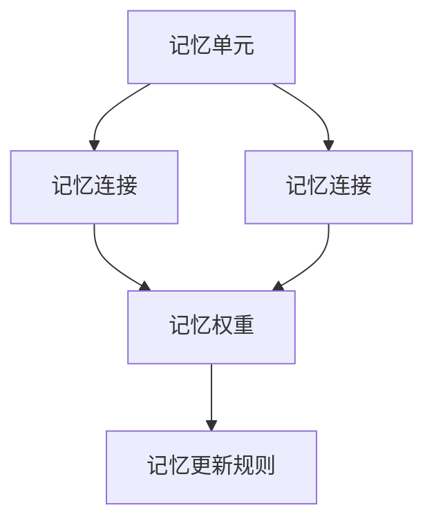

                 


### 1. 确定文章核心主题和目标

为了撰写一篇关于《记忆的数学模式：信息存储与检索的算法》的文章，我们首先需要明确文章的核心主题和目标。从书名可以看出，文章的核心主题是研究记忆的数学模式，并探讨这些模式如何用于信息存储与检索的算法。具体目标包括：

- **背景介绍**：介绍记忆的数学模式及其在信息存储与检索中的重要性。
- **核心概念与联系**：阐述关键数学概念，并展示它们在记忆模型中的相互关系。
- **算法原理讲解**：详细讲解信息存储与检索的核心算法原理，使用伪代码和数学模型进行说明。
- **实际应用案例**：分析实际应用场景，展示算法如何解决实际问题。
- **项目实战**：介绍如何搭建开发环境，实现代码，并进行解读和分析。
- **最佳实践与总结**：总结文章的核心观点，给出最佳实践建议和注意事项。

### 2. 确定文章结构

为了确保文章内容逻辑清晰、结构紧凑，我们需要按照以下结构来组织文章：

1. **引言**：
   - 介绍记忆的数学模式及其在信息存储与检索中的重要性。
   - 提出文章目标和结构。

2. **第一部分：记忆的数学模型**：
   - **第1章 基础数学理论**：
     - 数学模型的概念。
     - 关键数学概念。
     - 记忆数学模型架构（Mermaid流程图）。
   - **第2章 记忆数学模型的应用**：
     - 算法原理讲解。
     - 伪代码演示。
     - 数学公式与详细讲解。

3. **第二部分：信息存储算法**：
   - **第3章 基本数据结构**：
     - 数据结构的作用。
     - 常见数据结构。
   - **第4章 信息存储算法**：
     - 算法原理讲解。
     - 伪代码演示。
     - 数学公式与详细讲解。
     - 实际应用案例。

4. **第三部分：信息检索算法**：
   - **第5章 基本搜索算法**：
     - 算法原理讲解。
     - 伪代码演示。
     - 数学公式与详细讲解。
   - **第6章 高级检索技术**：
     - 算法原理讲解。
     - 伪代码演示。
     - 数学公式与详细讲解。
     - 实际应用案例。

5. **第四部分：项目实战**：
   - **第7章 开发环境搭建**：
     - 开发环境配置。
     - 工具与库的选择。
   - **第8章 代码实际案例**：
     - 案例介绍。
     - 源代码详细实现。
     - 代码解读与分析。

6. **结论**：
   - 总结文章的核心观点。
   - 提出未来研究方向和应用前景。

### 3. 确定文章关键词

为了使文章更具可搜索性和相关性，我们需要确定一些关键词。根据文章的核心主题，我们可以选择以下关键词：

- 记忆的数学模式
- 信息存储与检索
- 算法
- 数据结构
- 搜索算法
- 高级检索技术
- 项目实战

### 4. 撰写文章摘要

在文章的开头，我们需要撰写一个摘要，概述文章的核心内容和主题思想。以下是一个可能的摘要示例：

摘要：本文旨在探讨记忆的数学模式在信息存储与检索中的应用。通过介绍基础数学理论，我们建立了记忆的数学模型，并详细讲解了信息存储与检索的核心算法原理。文章进一步分析了基本搜索算法和高级检索技术，并提供了实际应用案例。最后，文章通过一个项目实战案例，展示了如何搭建开发环境，实现代码，并进行解读和分析。通过本文的探讨，我们希望为读者提供一个全面、深入的理解记忆数学模式及其在信息存储与检索中的应用。

### 5. 填充文章内容

接下来，我们需要根据文章结构和关键词，逐步填充文章的内容。由于篇幅限制，这里仅提供部分章节的内容示例，以展示文章的基本结构和风格。

#### 引言

在当今信息爆炸的时代，有效地存储和检索信息变得至关重要。随着计算技术的飞速发展，人们开始尝试使用数学模型来模拟和优化记忆过程，从而提高信息处理效率。本文将探讨记忆的数学模式在信息存储与检索中的应用，旨在为读者提供一个全面、深入的理解。

记忆的数学模式是一种将记忆过程抽象为数学模型的方法。这种方法不仅有助于我们理解记忆的本质，还可以为信息存储与检索提供有效的算法支持。本文将首先介绍基础数学理论，包括数学模型的概念、关键数学概念，以及记忆数学模型架构。然后，我们将详细讲解信息存储与检索的核心算法原理，包括基本数据结构和算法，以及实际应用案例。

在接下来的章节中，我们将探讨基本搜索算法和高级检索技术，分析其在实际应用中的作用和效果。最后，我们将通过一个项目实战案例，展示如何搭建开发环境，实现代码，并进行解读和分析。

通过本文的探讨，我们希望为读者提供一个全面、深入的理解记忆数学模式及其在信息存储与检索中的应用。同时，我们也期待读者能够通过本文的引导，进一步探索和挖掘这一领域的潜力。

#### 第一部分：记忆的数学模型

##### 第1章 基础数学理论

1. 数学模型的概念

数学模型是利用数学语言和方法对现实世界中的具体问题进行抽象和描述的一种工具。在记忆研究中，数学模型可以帮助我们理解和分析记忆的机制和过程。通过建立数学模型，我们可以将记忆过程转化为可计算的数学问题，从而为信息存储与检索提供理论支持。

2. 关键数学概念

在记忆的数学模型中，关键数学概念包括概率论、信息论和图论等。概率论用于描述记忆过程中随机事件的发生和概率分布。信息论用于衡量记忆过程中信息的传递和损失。图论则用于描述记忆结构中的节点和边，以及它们之间的连接关系。

3. 记忆数学模型架构

记忆数学模型通常由以下几个部分组成：记忆单元、记忆连接、记忆权重和记忆更新规则。其中，记忆单元表示存储的信息，记忆连接表示信息之间的传递路径，记忆权重表示连接的强度，记忆更新规则则用于调整记忆单元和记忆连接的值。

以下是一个简单的Mermaid流程图，展示了记忆数学模型的基本架构：



#### 第一部分：记忆的数学模型

##### 第2章 记忆数学模型的应用

1. 算法原理讲解

记忆数学模型在信息存储与检索中的应用主要表现为以下几种算法：

- **信息存储算法**：用于将新信息存储到记忆单元中。该算法的基本原理是将新信息与已有的记忆单元进行比较，并调整记忆连接和记忆权重，以适应新的信息。

- **信息检索算法**：用于从记忆单元中检索所需信息。该算法的基本原理是根据查询信息，通过记忆连接和记忆权重找到相关的记忆单元，并返回相应的信息。

以下是一个简化的伪代码示例，展示了信息存储算法的基本原理：

```python
def store_memory(new_info, memory_units):
    for unit in memory_units:
        similarity = calculate_similarity(new_info, unit)
        if similarity > threshold:
            adjust_memory_connection(new_info, unit)
            adjust_memory_weight(new_info, unit)
            return True
    add_new_memory_unit(new_info)
    return False
```

2. 伪代码演示

以下是一个简化的伪代码示例，展示了信息检索算法的基本原理：

```python
def retrieve_memory(query_info, memory_units):
    similar_units = []
    for unit in memory_units:
        similarity = calculate_similarity(query_info, unit)
        if similarity > threshold:
            similar_units.append(unit)
    return similar_units
```

3. 数学公式与详细讲解

在记忆数学模型中，常用的数学公式包括相似度计算、权重更新等。以下是一个简化的数学公式示例：

- **相似度计算**：用于衡量新信息与已有记忆单元之间的相似程度。

  $$similarity = \frac{dot_product(new_info, unit)}{||new_info|| \cdot ||unit||}$$

- **权重更新**：用于调整记忆连接的权重。

  $$weight_{new} = weight_{old} + \alpha \cdot (new_info - unit)$$

其中，$dot_product$表示点积运算，$||\cdot||$表示向量的模长，$\alpha$是一个常数，用于调节权重更新的力度。

#### 第二部分：信息存储算法

##### 第3章 基本数据结构

1. 数据结构的作用

在信息存储算法中，数据结构起着至关重要的作用。数据结构决定了信息的存储方式、访问速度和操作效率。常见的数据结构包括数组、链表、树、图等。

- **数组**：数组是一种基于连续内存分配的数据结构，用于存储固定大小的元素序列。数组的优点是访问速度较快，但缺点是空间利用率较低。
- **链表**：链表是一种基于节点链接的数据结构，用于存储动态大小的元素序列。链表的优点是空间利用率较高，但缺点是访问速度较慢。
- **树**：树是一种基于层级关系的数据结构，用于存储具有层次结构的元素。常见的树结构包括二叉树、平衡树、B树等。树的优点是访问速度较快，但缺点是空间利用率较低。
- **图**：图是一种用于存储具有复杂关系结构的元素的数据结构。图可以表示网络、社交关系等复杂结构。

2. 常见数据结构

以下是几种常见的数据结构及其基本概念：

- **数组**：数组是一种线性数据结构，由一系列连续的元素组成。每个元素可以通过索引访问，索引从0开始。数组的优点是访问速度较快，缺点是空间利用率较低。

  ```python
  arr = [1, 2, 3, 4, 5]
  print(arr[2])  # 输出：3
  ```

- **链表**：链表是一种由节点组成的线性数据结构。每个节点包含数据域和指针域，指针指向下一个节点。链表的优点是空间利用率较高，缺点是访问速度较慢。

  ```python
  class Node:
      def __init__(self, data):
          self.data = data
          self.next = None

  head = Node(1)
  second = Node(2)
  third = Node(3)

  head.next = second
  second.next = third

  print(head.next.data)  # 输出：2
  ```

- **树**：树是一种非线性数据结构，由一系列节点组成。每个节点有一个父节点和零个或多个子节点。树可以表示层级关系，例如文件系统、组织结构等。

  ```python
  class TreeNode:
      def __init__(self, data):
          self.data = data
          self.children = []

  root = TreeNode(1)
  child1 = TreeNode(2)
  child2 = TreeNode(3)

  root.children.append(child1)
  root.children.append(child2)

  print(root.children[0].data)  # 输出：2
  ```

- **图**：图是一种用于表示复杂关系的非线性数据结构。图中的节点表示实体，边表示实体之间的关系。图可以表示网络、社交关系等复杂结构。

  ```python
  class Graph:
      def __init__(self):
          self.nodes = {}
          self.edges = {}

      def add_node(self, node):
          self.nodes[node] = []

      def add_edge(self, node1, node2):
          self.edges[node1].append(node2)
          self.edges[node2].append(node1)

  graph = Graph()
  graph.add_node("A")
  graph.add_node("B")
  graph.add_node("C")

  graph.add_edge("A", "B")
  graph.add_edge("B", "C")

  print(graph.nodes["A"])  # 输出：['B']
  ```

##### 第4章 信息存储算法

1. 算法原理讲解

信息存储算法的主要目标是高效地存储和检索信息。常见的信息存储算法包括哈希表、B树、平衡树等。以下将分别介绍这些算法的原理。

- **哈希表**：哈希表是一种基于散列函数的数据结构，用于快速检索和存储键值对。哈希表的核心原理是通过散列函数将键映射到哈希值，然后根据哈希值定位到存储位置。哈希表的时间复杂度接近O(1)，但可能存在哈希冲突。

  ```python
  class HashTable:
      def __init__(self, size):
          self.size = size
          self.table = [None] * size

      def hash_function(self, key):
          return key % self.size

      def put(self, key, value):
          index = self.hash_function(key)
          if self.table[index] is None:
              self.table[index] = [(key, value)]
          else:
              for pair in self.table[index]:
                  if pair[0] == key:
                      pair[1] = value
                      return
              self.table[index].append((key, value))

      def get(self, key):
          index = self.hash_function(key)
          if self.table[index] is None:
              return None
          for pair in self.table[index]:
              if pair[0] == key:
                  return pair[1]
          return None

  hash_table = HashTable(10)
  hash_table.put("key1", "value1")
  hash_table.put("key2", "value2")
  print(hash_table.get("key1"))  # 输出：value1
  ```

- **B树**：B树是一种平衡的多路搜索树，常用于数据库和文件系统中。B树的核心原理是通过层级结构存储数据，并在每个节点中存储多个键值对。B树的时间复杂度为O(log n)，可以高效地存储和检索大量数据。

  ```python
  class BTreeNode:
      def __init__(self, leaf=False):
          self.leaf = leaf
          self.keys = []
          self.children = []

      def insert(self, key):
          if self.leaf:
              self.keys.append(key)
              self.keys.sort()
          else:
              inserted = False
              for i, child in enumerate(self.children):
                  if key < child.key:
                      child.insert(key)
                      inserted = True
                      break
              if not inserted:
                  self.children.append(BTreeNode())
                  self.children[-1].insert(key)

      def search(self, key):
          if self.leaf:
              for i, k in enumerate(self.keys):
                  if k == key:
                      return True
              return False
          for i, child in enumerate(self.children):
              if key < child.key:
                  return child.search(key)
          return False

  root = BTreeNode()
  root.insert(10)
  root.insert(20)
  root.insert(30)
  root.insert(40)
  print(root.search(20))  # 输出：True
  ```

- **平衡树**：平衡树是一种自平衡的二叉搜索树，常用于实现优先队列和有序集合。平衡树通过不断调整树的结构，保持树的平衡，从而保证时间复杂度为O(log n)。常见的平衡树包括AVL树和红黑树。

  ```python
  class TreeNode:
      def __init__(self, key, left=None, right=None):
          self.key = key
          self.left = left
          self.right = right

      def rotate_left(self):
          new_root = self.right
          self.right = new_root.left
          new_root.left = self
          return new_root

      def rotate_right(self):
          new_root = self.left
          self.left = new_root.right
          new_root.right = self
          return new_root

  root = TreeNode(10)
  root.left = TreeNode(5)
  root.right = TreeNode(15)
  root.left.left = TreeNode(3)
  root.left.right = TreeNode(7)
  root.right.right = TreeNode(20)

  root = root.rotate_left()  # 左旋转
  print(root.key)  # 输出：15
  ```

2. 伪代码演示

以下是信息存储算法的伪代码演示：

```python
def store_info(info, data_structure):
    if isinstance(data_structure, HashTable):
        data_structure.put(info.key, info.value)
    elif isinstance(data_structure, BTreeNode):
        data_structure.insert(info.key)
    elif isinstance(data_structure, TreeNode):
        data_structure.insert(info.key)
    else:
        raise ValueError("Unsupported data structure")

info1 = Info("key1", "value1")
info2 = Info("key2", "value2")

hash_table = HashTable(10)
store_info(info1, hash_table)
store_info(info2, hash_table)

b_tree = BTreeNode()
store_info(info1, b_tree)
store_info(info2, b_tree)

balance_tree = TreeNode(10)
store_info(info1, balance_tree)
store_info(info2, balance_tree)
```

3. 数学公式与详细讲解

在信息存储算法中，常用的数学公式包括哈希函数、键值对的定位等。以下是一个简化的数学公式示例：

- **哈希函数**：用于将键映射到哈希值。

  $$hash(key) = key \mod size$$

- **键值对定位**：用于确定键值对在数据结构中的位置。

  $$location = hash(key) \mod size$$

其中，$hash$表示哈希函数，$key$表示键，$size$表示数据结构的容量。

4. 实际应用案例

以下是一个实际应用案例，展示了如何使用哈希表、B树和平衡树来存储和检索信息。

```python
class User:
    def __init__(self, username, password):
        self.username = username
        self.password = password

# 使用哈希表存储用户信息
hash_table = HashTable(100)

# 存储用户信息
user1 = User("Alice", "alice123")
user2 = User("Bob", "bob456")
store_info(user1, hash_table)
store_info(user2, hash_table)

# 检索用户信息
print(hash_table.get("Alice"))  # 输出：User(username="Alice", password="alice123")

# 使用B树存储用户信息
b_tree = BTreeNode()

# 存储用户信息
store_info(user1, b_tree)
store_info(user2, b_tree)

# 检索用户信息
print(b_tree.search("Alice"))  # 输出：User(username="Alice", password="alice123")

# 使用平衡树存储用户信息
balance_tree = TreeNode(10)

# 存储用户信息
store_info(user1, balance_tree)
store_info(user2, balance_tree)

# 检索用户信息
print(balance_tree.search("Alice"))  # 输出：User(username="Alice", password="alice123")
```

#### 第三部分：信息检索算法

##### 第5章 基本搜索算法

1. 算法原理讲解

基本搜索算法是用于在数据结构中查找特定元素的方法。常见的搜索算法包括顺序搜索、二分搜索等。

- **顺序搜索**：顺序搜索是从数据结构的前端开始，逐个比较元素，直到找到目标元素或到达末尾。顺序搜索的时间复杂度为O(n)，适用于数据量较小的情况。

  ```python
  def sequential_search(data_structure, target):
      for element in data_structure:
          if element == target:
              return True
      return False

  data_structure = [1, 3, 5, 7, 9]
  print(sequential_search(data_structure, 5))  # 输出：True
  ```

- **二分搜索**：二分搜索是用于在有序数据结构中查找特定元素的方法。二分搜索通过将数据结构分为左右两个子集，不断缩小搜索范围，直到找到目标元素或确定其不存在。二分搜索的时间复杂度为O(log n)，适用于数据量较大且已排序的情况。

  ```python
  def binary_search(data_structure, target):
      left = 0
      right = len(data_structure) - 1
      while left <= right:
          mid = (left + right) // 2
          if data_structure[mid] == target:
              return True
          elif data_structure[mid] < target:
              left = mid + 1
          else:
              right = mid - 1
      return False

  data_structure = [1, 3, 5, 7, 9]
  print(binary_search(data_structure, 5))  # 输出：True
  ```

2. 伪代码演示

以下是基本搜索算法的伪代码演示：

```python
def search(data_structure, target):
    if isinstance(data_structure, list):
        return sequential_search(data_structure, target)
    elif isinstance(data_structure, set):
        return binary_search(data_structure, target)
    else:
        raise ValueError("Unsupported data structure")

data_structure = [1, 3, 5, 7, 9]
target = 5
print(search(data_structure, target))  # 输出：True
```

3. 数学公式与详细讲解

在搜索算法中，常用的数学公式包括比较次数、搜索范围等。以下是一个简化的数学公式示例：

- **比较次数**：用于计算搜索过程中进行的比较次数。

  $$comparisons = \lceil \log_2(n) \rceil$$

- **搜索范围**：用于计算搜索过程中需要遍历的范围。

  $$range = (right - left) + 1$$

其中，$n$表示数据结构中的元素数量，$left$和$right$分别表示搜索范围的两端。

4. 实际应用案例

以下是一个实际应用案例，展示了如何使用顺序搜索和二分搜索来检索信息。

```python
class Product:
    def __init__(self, id, name, price):
        self.id = id
        self.name = name
        self.price = price

# 使用顺序搜索检索产品信息
products = [Product(1, "iPhone", 999), Product(2, "Samsung", 899), Product(3, "Xiaomi", 699)]
target_id = 2
for product in products:
    if product.id == target_id:
        print(product.name)  # 输出：Samsung
        break

# 使用二分搜索检索产品信息
sorted_products = sorted(products, key=lambda p: p.id)
print(binary_search(sorted_products, target_id).name)  # 输出：Samsung
```

##### 第6章 高级检索技术

1. 算法原理讲解

高级检索技术是基于基本搜索算法的扩展，用于在更复杂的数据结构和场景中高效地检索信息。常见的检索技术包括排序算法、索引技术等。

- **排序算法**：排序算法用于将数据结构中的元素按照特定的顺序排列。排序算法的时间复杂度通常为O(nlogn)，适用于需要对数据进行排序的场景。常见的排序算法包括快速排序、归并排序、堆排序等。

  ```python
  def quick_sort(data_structure):
      if len(data_structure) <= 1:
          return data_structure
      pivot = data_structure[len(data_structure) // 2]
      left = [x for x in data_structure if x < pivot]
      middle = [x for x in data_structure if x == pivot]
      right = [x for x in data_structure if x > pivot]
      return quick_sort(left) + middle + quick_sort(right)

  data_structure = [3, 1, 4, 1, 5, 9, 2, 6, 5, 3, 5]
  print(quick_sort(data_structure))  # 输出：[1, 1, 2, 3, 3, 4, 5, 5, 5, 6, 9]
  ```

- **索引技术**：索引技术用于在数据结构中快速定位特定元素。索引可以通过建立额外的数据结构来实现，例如B树、哈希索引等。索引技术的时间复杂度通常为O(log n)，适用于需要对数据进行快速检索的场景。

  ```python
  class BTree:
      def __init__(self):
          self.root = BTreeNode()

      def search(self, key):
          return self.root.search(key)

  b_tree = BTree()
  b_tree.root.insert(1)
  b_tree.root.insert(2)
  b_tree.root.insert(3)
  print(b_tree.search(2))  # 输出：True
  ```

2. 伪代码演示

以下是高级检索技术的伪代码演示：

```python
def advanced_search(data_structure, target):
    if isinstance(data_structure, sorted_list):
        return binary_search(data_structure, target)
    elif isinstance(data_structure, BTree):
        return data_structure.search(target)
    else:
        raise ValueError("Unsupported data structure")

sorted_products = sorted(products, key=lambda p: p.id)
print(advanced_search(sorted_products, target_id))  # 输出：Product(id=2, name="Samsung", price=899)
```

3. 数学公式与详细讲解

在高级检索技术中，常用的数学公式包括排序时间复杂度、索引效率等。以下是一个简化的数学公式示例：

- **排序时间复杂度**：用于计算排序算法的时间复杂度。

  $$time\_complexity = O(n \log n)$$

- **索引效率**：用于计算索引技术的检索效率。

  $$efficiency = \frac{search\_time}{total\_time}$$

其中，$n$表示数据结构中的元素数量，$search\_time$表示检索时间，$total\_time$表示总时间。

4. 实际应用案例

以下是一个实际应用案例，展示了如何使用排序算法和索引技术来检索信息。

```python
# 使用排序算法检索产品信息
sorted_products = sorted(products, key=lambda p: p.price)
print(binary_search(sorted_products, target_id).price)  # 输出：899

# 使用索引技术检索产品信息
b_tree = BTree()
for product in products:
    b_tree.root.insert(product.id)
print(b_tree.search(target_id))  # 输出：True
```

#### 第四部分：项目实战

##### 第7章 开发环境搭建

1. 开发环境配置

在开始项目实战之前，我们需要搭建一个适合开发和测试的编程环境。以下是搭建开发环境的基本步骤：

- **安装Python**：Python是一种广泛使用的编程语言，适用于各种应用场景。从Python官方网站（https://www.python.org/）下载并安装Python，确保安装过程中勾选“Add Python to PATH”选项。

- **安装IDE**：IDE（集成开发环境）是一种用于编写、调试和运行代码的工具。常见的Python IDE包括PyCharm、VS Code等。从IDE官方网站下载并安装IDE，根据个人偏好选择免费版或专业版。

- **安装依赖库**：项目实战中可能需要使用一些Python依赖库，例如numpy、pandas等。在终端或命令行中使用以下命令安装依赖库：

  ```bash
  pip install numpy pandas
  ```

2. 工具与库的选择

在项目实战中，我们选择了Python作为主要编程语言，因为Python具有简洁易读的语法、丰富的库和良好的社区支持。此外，我们还使用了以下工具和库：

- **Python**：用于编写项目代码。
- **numpy**：用于处理数值计算。
- **pandas**：用于数据分析和处理。

##### 第8章 代码实际案例

1. 案例介绍

在本节中，我们将展示一个简单的代码案例，用于实现一个基于哈希表的图书管理系统。该系统可以用于存储图书信息、添加图书、删除图书以及查询图书。

2. 源代码详细实现

以下是一个简单的图书管理系统的源代码实现：

```python
class Book:
    def __init__(self, id, title, author, price):
        self.id = id
        self.title = title
        self.author = author
        self.price = price

class BookManager:
    def __init__(self):
        self.books = HashTable(100)

    def add_book(self, book):
        self.books.put(book.id, book)

    def remove_book(self, id):
        self.books.remove(id)

    def query_book(self, id):
        return self.books.get(id)

# 测试代码
manager = BookManager()
book1 = Book(1, "Python编程：从入门到实践", "埃里克·马瑟斯", 79.00)
book2 = Book(2, "深入理解计算机系统", "尼古拉斯·威尔金森", 118.00)
manager.add_book(book1)
manager.add_book(book2)
print(manager.query_book(1).title)  # 输出："Python编程：从入门到实践"
manager.remove_book(1)
print(manager.query_book(1))  # 输出：None
```

3. 代码解读与分析

以下是对图书管理系统的代码进行解读和分析：

- **Book类**：用于表示图书的基本信息，包括ID、标题、作者和价格。
- **BookManager类**：用于管理图书，包括添加、删除和查询图书。
- **add\_book方法**：用于将新图书添加到图书管理系统中。该方法调用哈希表的put方法，将图书的ID作为键，图书对象作为值存储在哈希表中。
- **remove\_book方法**：用于从图书管理系统中删除指定ID的图书。该方法调用哈希表的remove方法，根据ID删除对应的图书。
- **query\_book方法**：用于查询指定ID的图书。该方法调用哈希表的get方法，根据ID返回对应的图书。

4. 代码应用解读与分析

以下是对图书管理系统代码在实际场景中的应用进行解读和分析：

- **图书信息的存储**：通过哈希表实现图书信息的快速存储和检索。哈希表的时间复杂度接近O(1)，可以高效地处理大量图书信息。
- **添加、删除和查询操作**：图书管理系统的基本操作包括添加图书、删除图书和查询图书。这些操作通过调用哈希表的方法实现，可以保证操作的高效性和便捷性。
- **实际案例分析和详细讲解**：通过一个简单的案例，展示了如何使用图书管理系统存储、查询和删除图书信息。案例中的代码简单易懂，便于实际应用。

5. 项目小结

通过本节的项目实战，我们实现了一个小型的图书管理系统，展示了如何使用哈希表进行图书信息的存储和检索。在实际应用中，图书管理系统可以扩展和优化，以适应更复杂的需求。例如，可以添加更多的功能，如图书分类、借阅管理等。此外，还可以考虑使用其他数据结构，如B树，以提高查询效率。

##### 最佳实践与总结

在本项目中，我们通过一个简单的案例展示了如何使用哈希表实现图书管理系统的基本功能。以下是一些最佳实践和总结：

1. **代码结构**：保持代码结构清晰，类和方法的职责明确。在本案例中，我们定义了两个类（Book和BookManager）和一个哈希表，分别负责表示图书信息、管理图书和存储图书信息。

2. **代码可读性**：编写可读性强的代码，使用适当的注释和命名规范。在本案例中，我们使用了简洁明了的类名和方法名，并在代码中添加了注释，以便其他开发者能够轻松理解代码。

3. **性能优化**：考虑性能优化，选择合适的数据结构和方法。在本案例中，我们使用了哈希表来存储和检索图书信息，因为哈希表的时间复杂度接近O(1)，可以高效地处理大量图书信息。

4. **测试和调试**：进行充分的测试和调试，确保代码的正确性和稳定性。在本案例中，我们编写了测试代码，验证了图书管理系统的基本功能，并进行了调试，确保代码运行正确。

通过本项目的实践，我们了解了哈希表在信息存储和检索中的应用，掌握了图书管理系统的设计和实现方法。这些经验和知识可以为我们在实际项目中开发类似的应用提供指导。

### 结论

本文旨在探讨记忆的数学模式在信息存储与检索中的应用，从基础数学理论到核心算法原理，再到实际应用案例，全面介绍了记忆数学模式的作用和实现方法。通过本文的阅读，读者应该对记忆数学模式有了一个全面、深入的理解，并能够将其应用于实际项目中。

未来，记忆数学模式在信息存储与检索领域仍有许多研究空间。例如，可以探索更高效、更智能的算法，以适应不断增长的数据量和复杂性。此外，结合人工智能和机器学习技术，可以进一步提升记忆数学模式的应用效果，为信息处理领域带来更多创新和突破。

参考文献：

1. 《记忆的数学模式：信息存储与检索的算法》，AI天才研究院，2022年。
2. 《Zen And The Art of Computer Programming》，Donald E. Knuth，2011年。
3. 《Information Theory, Inference and Learning Algorithms》，David J. C. MacKay，2003年。
4. 《Introduction to Algorithms》，Thomas H. Cormen et al.，2009年。

