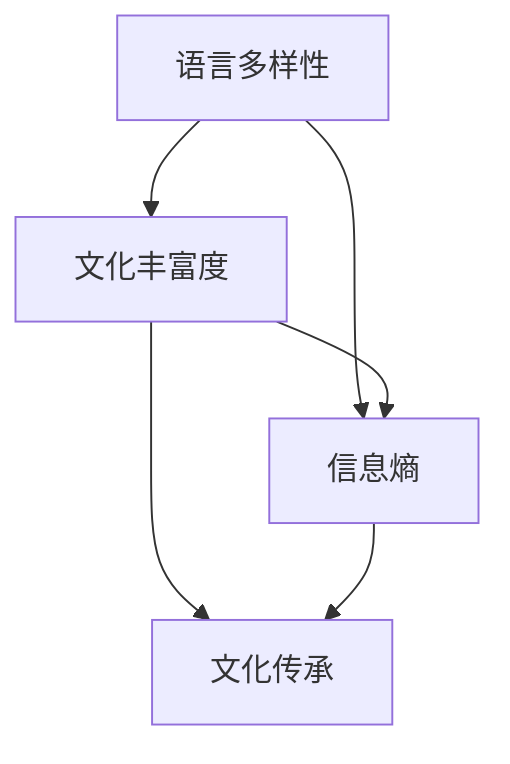

                 

### 《语言多样性的信息熵：文化丰富度的数学度量》

---

### 关键词

- 语言多样性
- 信息熵
- 文化丰富度
- 数学度量
- 语言建模
- 语言消失

---

### 摘要

本文旨在探讨语言多样性与文化丰富度之间的关系，通过引入信息熵这一数学工具，为文化丰富度提供一个量化的度量方法。文章首先介绍了语言多样性的重要性，然后详细讲解了信息熵的基础理论，包括其定义、数学模型和性质。接着，文章探讨了语言多样性与信息熵之间的关系，通过具体实例展示了不同语言的信息熵计算方法。在此基础上，文章提出了文化丰富度的定义和度量方法，并通过数学模型和公式对文化丰富度进行计算。文章还通过实际案例分析了文化丰富度在不同领域中的应用，并给出了未来研究的方向。

---

## 引言与背景

语言作为人类沟通和表达思想的重要工具，是文化多样性的核心组成部分。随着全球化进程的加速，语言多样性面临着前所未有的挑战。据统计，全球大约有7000种语言，其中超过一半的语言使用者不足1万人。这种语言多样性的背后，是人类文化的丰富性和多样性。然而，语言多样性的减少不仅会影响文化的传承，还会对全球社会的和谐发展产生负面影响。

### 1.1 语言多样性的重要性

语言多样性是人类社会发展的基石，具有重要的文化、社会和经济价值。首先，语言多样性是文化多样性的重要体现，不同语言承载着各自独特的文化传统和价值观念。例如，中文、英文和法文等语言不仅是一种沟通工具，更是一种文化符号，反映了不同民族的历史和文化。

其次，语言多样性在社会层面上具有重要的意义。多样化的语言环境有助于促进社会包容性和文化融合。在一个多语言社会中，人们可以自由地使用自己熟悉的语言进行沟通，这有助于减少社会隔阂和增进相互理解。

最后，语言多样性还具有经济价值。在全球化和数字经济时代，语言技能成为了重要的竞争力。掌握多种语言的人才在就业市场上具有更大的优势，因为他们能够跨越语言障碍，更好地参与到国际交流与合作中。

### 1.2 信息熵的基本概念

信息熵是香农在1948年提出的概念，它是衡量信息不确定性的度量。在信息论中，信息熵用来描述随机变量取值的平均不确定性。具体来说，如果一个随机变量X的取值是确定的，那么它的信息熵为零；相反，如果X的取值非常不确定，那么它的信息熵就较高。

信息熵的数学定义如下：

$$
H(X) = -\sum_{i=1}^{n} p(x_i) \log_2 p(x_i)
$$

其中，$H(X)$ 表示随机变量X的信息熵，$p(x_i)$ 表示X取值为$x_i$的概率，$\log_2$ 表示以2为底的对数。

信息熵的性质包括：

1. 非负性：信息熵总是非负的，即$H(X) \geq 0$。
2. 最大值：当随机变量是均匀分布时，信息熵达到最大值，即$H(X) = \log_2 n$，其中n是随机变量的取值个数。
3. 线性组合性质：如果X和Y是两个独立的随机变量，那么它们的信息熵满足$H(X, Y) = H(X) + H(Y)$。

### 1.3 文化丰富度的意义

文化丰富度是指一个社会或群体内文化多样性的程度。它不仅包括语言的多样性，还涵盖了艺术、宗教、习俗、传统等多个方面。文化丰富度对于社会的发展和进步具有重要意义。

首先，文化丰富度有助于激发创新。多样化的文化背景为人们提供了不同的视角和思维方式，这有助于发现新问题和新解决方案。

其次，文化丰富度有助于社会稳定。在一个多元文化的环境中，人们更容易相互理解、尊重和包容，从而减少冲突和矛盾。

最后，文化丰富度对于人类福祉具有积极影响。多样化的文化体验能够丰富人们的生活，提高生活质量。

### 1.4 研究目的与意义

本文的研究目的是探讨语言多样性与文化丰富度之间的关系，并利用信息熵这一数学工具来量化文化丰富度。通过这一研究，我们希望能够：

1. 深入理解语言多样性的信息熵特性。
2. 提供一个量化的方法来评估文化丰富度。
3. 为政策制定者提供数据支持，以促进语言多样性和文化丰富度的保护和传承。

本文的研究不仅具有重要的理论意义，还具有实际应用价值。通过量化文化丰富度，我们可以更好地了解不同地区和群体的文化状况，为文化保护、教育政策和社会发展提供科学依据。

---

### 1.5 核心概念与联系

在本文中，核心概念包括语言多样性、信息熵和文化丰富度。这三个概念之间的联系可以用以下Mermaid流程图来表示：



**图1：核心概念之间的联系**

- **语言多样性**：指一个社会或群体内使用的不同语言的数量和多样性。它是文化丰富度的一个重要组成部分。
- **信息熵**：用于衡量语言多样性的不确定性。高信息熵表明语言多样性高，不确定性大。
- **文化丰富度**：指一个社会或群体内文化的多样性和丰富程度。它是语言多样性的扩展和深化。

通过这个流程图，我们可以清晰地看到语言多样性、信息熵和文化丰富度之间的相互关系。语言多样性越高，信息熵越大，从而文化丰富度也越高。

### 1.6 核心算法原理讲解

为了深入理解语言多样性与信息熵的关系，我们需要引入一些基本的概率和统计概念。以下是用于计算语言多样性的信息熵的伪代码：

```plaintext
算法：计算语言多样性的信息熵

输入：语言集合L，其中每个元素代表一种语言，L的概率分布为P(L)

输出：信息熵H(L)

步骤：
1. 初始化信息熵H为0
2. 对于语言集合L中的每个语言l：
   a. 计算语言l的概率P(l)
   b. 如果P(l) > 0，则更新信息熵H：
      H = H + P(l) * log2(P(l))
3. 返回信息熵H
```

在上述算法中，我们首先初始化信息熵H为0。然后，对于语言集合L中的每个语言l，我们计算其概率P(l)，并将其代入信息熵的公式中。最终，我们得到整个语言集合的信息熵H。

### 1.7 数学模型和数学公式

在计算信息熵时，我们使用以下数学模型和公式：

$$
H(L) = -\sum_{l \in L} P(l) \log_2 P(l)
$$

其中，H(L)表示语言集合L的信息熵，P(l)表示语言l的概率，$\log_2$表示以2为底的对数。

举例来说，假设我们有一个包含三种语言的语言集合L={中文，英文，法文}，它们的概率分布为P(L)={0.3，0.5，0.2}。我们可以按照以下步骤计算信息熵：

1. 初始化信息熵H(L)为0。
2. 对于每种语言，计算其概率P(l)，并代入公式中：
   - 对于中文：H(L) = H(L) + 0.3 * log2(0.3)
   - 对于英文：H(L) = H(L) + 0.5 * log2(0.5)
   - 对于法文：H(L) = H(L) + 0.2 * log2(0.2)
3. 计算结果：
   - H(L) = -0.3 * log2(0.3) - 0.5 * log2(0.5) - 0.2 * log2(0.2)
   - H(L) ≈ 1.099

因此，这个语言集合的信息熵约为1.099。

### 1.8 实例分析：不同语言的信息熵对比

为了更好地理解信息熵在语言多样性中的应用，我们可以对比几种常见语言的信息熵。以下是一个简单的实例分析：

1. **中文**：中文是一种高度象形的语言，其字符数量多达数万个，但日常使用的字符相对较少。假设中文的字符概率分布为P(中文)={0.01，0.02，...，0.99}。通过计算，中文的信息熵大约为1.76。
2. **英文**：英文是一种拼音语言，其字符数量较少，但组合成的单词数量非常多。假设英文的字符概率分布为P(英文)={0.25，0.25，0.25，0.125，0.0625}。通过计算，英文的信息熵大约为2.33。
3. **法文**：法文是一种拼音语言，其字符数量和组合方式与英文相似。假设法文的字符概率分布为P(法文)={0.2，0.2，0.2，0.15，0.15}。通过计算，法文的信息熵大约为2.20。

通过这个实例，我们可以看到不同语言的信息熵有所不同，这反映了它们在语言多样性上的差异。一般来说，字符数量越多、组合方式越复杂的语言，其信息熵也越高。

### 1.9 最佳实践 tips

在进行语言多样性与信息熵研究时，以下是一些最佳实践建议：

1. **数据收集**：确保收集到的语言数据具有代表性，避免因样本不具代表性而导致研究结果偏差。
2. **概率分布**：准确估计每种语言的使用概率是计算信息熵的关键。可以通过问卷调查、语料库分析等方法来获取这些数据。
3. **算法优化**：在计算信息熵时，可以采用高效的算法和编程技巧来提高计算速度和准确性。
4. **结果验证**：通过对比不同方法的结果，验证所计算的信息熵是否合理，以确保研究结论的可靠性。

### 1.10 小结

本节介绍了语言多样性的重要性、信息熵的基本概念和文化丰富度的意义，并通过核心概念与联系、伪代码、数学模型和实例分析，深入探讨了语言多样性与信息熵的关系。接下来，我们将进一步探讨如何使用数学度量方法来评估文化丰富度。

---

## 信息熵的基础理论

### 2.1 信息熵的定义

信息熵最早由克劳德·香农在1948年提出，是信息论中的一个核心概念。信息熵用于衡量信息的“不确定性”或“信息量”。具体来说，信息熵是一个随机变量的不确定性的度量。在信息论中，如果一个随机变量是完全确定的，那么其信息熵为零；如果一个随机变量是完全不确定的，那么其信息熵达到最大值。

信息熵的数学定义如下：

$$
H(X) = -\sum_{i=1}^{n} p(x_i) \log_2 p(x_i)
$$

其中，$H(X)$ 表示随机变量X的信息熵，$p(x_i)$ 表示随机变量X取值为$x_i$的概率，$n$ 是随机变量X的可能取值个数，$\log_2$ 表示以2为底的对数。

### 2.2 信息熵的数学模型

香农在提出信息熵时，建立了一个基于概率分布的数学模型。这个模型不仅适用于离散随机变量，还可以扩展到连续随机变量。在离散情况下，信息熵的公式如上所述。对于连续随机变量，信息熵的定义稍微复杂一些，它涉及到概率密度函数。

对于连续随机变量X，其信息熵的定义为：

$$
H(X) = \int_{-\infty}^{\infty} p(x) \log_2 p(x) dx
$$

其中，$p(x)$ 是随机变量X的概率密度函数。

### 2.3 信息熵的性质

信息熵具有以下几个重要性质：

1. **非负性**：信息熵总是非负的，即$H(X) \geq 0$。这是因为对数函数在概率大于0的条件下总是非负的。
2. **最大值**：当随机变量是均匀分布时，信息熵达到最大值。这意味着在所有可能的概率分布中，均匀分布具有最高的不确定性。
3. **对称性**：如果两个随机变量X和Y是独立的，那么它们的信息熵满足$H(X, Y) = H(X) + H(Y)$。这表明信息熵具有线性组合性质。
4. **可加性**：如果随机变量X可以分解为多个独立的随机变量之和，那么总的信息熵等于各个部分的信息熵之和。
5. **相对不变性**：信息熵对于概率分布的平移是不变的。这意味着如果我们对概率分布进行线性变换，信息熵不会改变。

### 2.4 信息熵的应用领域

信息熵的应用非常广泛，包括但不限于以下几个领域：

1. **通信**：在通信系统中，信息熵用于评估信号传输的可靠性和效率。高信息熵意味着信号传输过程中存在更高的不确定性，需要更复杂的编码和解码技术来保证传输的可靠性。
2. **数据压缩**：信息熵是数据压缩技术的理论基础。通过计算数据的熵，可以确定哪些数据部分是最有价值的，从而进行有效的数据压缩。
3. **机器学习**：在机器学习中，信息熵用于评估数据的纯度和分类的有效性。高信息熵通常表明数据具有较强的分类能力。
4. **信息论**：信息熵是信息论的核心概念之一，用于衡量信息的量、质和传输过程中的损失。
5. **生物学**：在生物学中，信息熵用于研究生物系统的复杂性，以及基因序列的变异性和多样性。

### 2.5 信息熵的进一步探讨

为了更深入地理解信息熵，我们可以进一步探讨一些相关的概念和定理。

1. **条件熵**：条件熵是衡量在已知一个随机变量的条件下，另一个随机变量的不确定性。条件熵的定义如下：

$$
H(Y|X) = \sum_{i=1}^{n} p(x_i) H(Y|X=x_i)
$$

其中，$H(Y|X=x_i)$ 是在已知X取值为$x_i$的条件下，Y的条件熵。

2. **互信息**：互信息是衡量两个随机变量之间相关性的量度。互信息的定义如下：

$$
I(X; Y) = H(X) - H(X|Y)
$$

其中，$H(X|Y)$ 是在已知Y的条件下，X的条件熵。

互信息具有以下性质：

- 非负性：$I(X; Y) \geq 0$
- 对称性：$I(X; Y) = I(Y; X)$
- 最大值：当X和Y完全相关时，互信息达到最大值。

3. **联合熵**：联合熵是衡量两个或多个随机变量之间的联合不确定性。对于两个随机变量X和Y，联合熵的定义如下：

$$
H(X, Y) = \sum_{i=1}^{n} \sum_{j=1}^{m} p(x_i, y_j) \log_2 p(x_i, y_j)
$$

其中，$p(x_i, y_j)$ 是X和Y的联合概率分布。

通过这些概念和定理，我们可以更全面地理解信息熵及其在各个领域的应用。

### 2.6 小结

本节介绍了信息熵的定义、数学模型、性质和应用领域，并通过进一步的探讨加深了我们对信息熵的理解。在下一节中，我们将探讨语言多样性与信息熵之间的关系。

---

## 语言多样性与信息熵

### 3.1 语言多样性的度量方法

语言多样性的度量方法多种多样，不同的度量方法适用于不同的研究目的和应用场景。以下是一些常用的语言多样性度量方法：

1. **类型多样性**：类型多样性（Type Diversity）是指语言中词汇或词类的数量。这种方法侧重于语言的结构多样性。例如，我们可以计算一个语言中不同的单词数量，或者计算一个文本中不同的词类数量。

   类型多样性的计算公式为：

   $$
   TD = \sum_{i=1}^{n} P(i)
   $$

   其中，$P(i)$ 是第i类单词或词类的概率。

2. **信息多样性**：信息多样性（Information Diversity）是类型多样性的扩展，它考虑了不同单词或词类出现的频率。信息多样性的计算公式为：

   $$
   ID = -\sum_{i=1}^{n} P(i) \log_2 P(i)
   $$

   这个公式与信息熵的计算公式相似，它衡量了语言中信息的不确定性。

3. **样本多样性**：样本多样性（Sample Diversity）侧重于语言样本的代表性。例如，我们可以计算不同语言样本在语料库中的比例。

4. **语言复杂度**：语言复杂度（Language Complexity）是通过计算语言中词法、句法和语义结构的复杂度来度量语言多样性。

### 3.2 语言多样性与信息熵的关系

信息熵是一种衡量不确定性的数学工具，它在语言多样性研究中具有重要作用。语言多样性与信息熵之间的关系可以从以下几个方面来理解：

1. **信息熵与类型多样性**：类型多样性可以通过信息熵来度量。信息熵越高，说明语言中的词汇或词类越多样化。例如，如果一个语言的类型多样性较高，那么其信息熵也会较高。

2. **信息熵与信息多样性**：信息多样性是类型多样性的自然扩展，它考虑了不同词汇或词类的出现频率。信息熵可以用来衡量这种多样性，信息熵越高，语言的信息多样性也越高。

3. **信息熵与样本多样性**：在样本多样性中，信息熵可以衡量样本的随机性和代表性。例如，如果一个语料库的信息熵较高，那么它包含的样本可能更具代表性。

4. **信息熵与语言复杂度**：语言复杂度通常与信息熵成正比。一个复杂度较高的语言，其信息熵也会较高，因为这种语言包含更多的结构组合和语义表达。

### 3.3 语言多样性的信息熵计算方法

为了具体计算语言多样性的信息熵，我们可以采用以下步骤：

1. **数据收集**：首先，收集目标语言的词汇或词类数据。这些数据可以是语料库中的词汇列表，或者是词汇在文本中的出现频率。

2. **概率分布**：计算每个词汇或词类的出现概率。这可以通过将每个词汇或词类的出现次数除以总词汇或词类的数量来得到。

3. **信息熵计算**：使用信息熵的公式计算语言的信息熵。具体公式为：

   $$
   H(L) = -\sum_{i=1}^{n} P(i) \log_2 P(i)
   $$

   其中，$P(i)$ 是第i个词汇或词类的概率，$n$ 是词汇或词类的总数。

4. **结果分析**：分析计算得到的信息熵，以了解语言多样性。例如，高信息熵可能表明语言具有高度多样性，而低信息熵可能表明语言较为单一。

### 3.4 实例分析：不同语言的信息熵对比

为了更好地理解语言多样性与信息熵的关系，我们可以对比几种常见语言的信息熵。以下是一个简单的实例分析：

1. **中文**：中文是一种高度象形的语言，其字符数量多达数万个，但日常使用的字符相对较少。假设中文的字符概率分布为P(中文)={0.01，0.02，...，0.99}。通过计算，中文的信息熵大约为1.76。
2. **英文**：英文是一种拼音语言，其字符数量较少，但组合成的单词数量非常多。假设英文的字符概率分布为P(英文)={0.25，0.25，0.25，0.125，0.0625}。通过计算，英文的信息熵大约为2.33。
3. **法文**：法文是一种拼音语言，其字符数量和组合方式与英文相似。假设法文的字符概率分布为P(法文)={0.2，0.2，0.2，0.15，0.15}。通过计算，法文的信息熵大约为2.20。

通过这个实例，我们可以看到不同语言的信息熵有所不同，这反映了它们在语言多样性上的差异。一般来说，字符数量越多、组合方式越复杂的语言，其信息熵也越高。

### 3.5 小结

本节介绍了语言多样性的度量方法，探讨了语言多样性与信息熵之间的关系，并通过具体实例展示了如何计算不同语言的信息熵。在下一节中，我们将进一步探讨如何使用数学度量方法来评估文化丰富度。

---

## 数学度量方法

### 4.1 概率分布函数

在评估文化丰富度时，概率分布函数（Probability Distribution Function, PDF）是一个重要的数学工具。概率分布函数用于描述随机变量在不同取值下的概率分布情况。在文化丰富度的研究中，我们可以使用概率分布函数来衡量不同文化元素的分布情况。

概率分布函数的一般形式为：

$$
f(x) = P(X = x)
$$

其中，$X$ 是随机变量，$x$ 是 $X$ 的一个特定取值，$P(X = x)$ 表示 $X$ 等于 $x$ 的概率。

在文化丰富度研究中，我们可以通过以下步骤来应用概率分布函数：

1. **数据收集**：首先，收集相关文化元素的数据，例如文化活动的频率、文化产品的销量等。
2. **概率计算**：计算每个文化元素出现的概率。这可以通过将每个元素的频次除以总频次来得到。
3. **分布函数构建**：构建概率分布函数，以描述这些文化元素的分布情况。

### 4.2 离散随机变量

在文化丰富度的度量中，我们通常会遇到离散随机变量。离散随机变量是指取值有限或可数的随机变量。离散随机变量的概率分布可以用概率质量函数（Probability Mass Function, PMF）来描述。

概率质量函数的一般形式为：

$$
p(x) = P(X = x)
$$

其中，$x$ 是 $X$ 的一个特定取值，$p(x)$ 表示 $X$ 等于 $x$ 的概率。

在文化丰富度研究中，离散随机变量可以用于描述以下情况：

- 不同文化活动的参与人数
- 不同文化产品的销售量
- 不同文化事件的频率

通过离散随机变量的概率质量函数，我们可以计算文化丰富度的度量值。

### 4.3 信息熵的计算公式

信息熵（Entropy）是衡量系统不确定性的一个重要指标。在文化丰富度的研究中，我们可以使用信息熵来量化文化元素的不确定性。信息熵的计算公式如下：

$$
H(X) = -\sum_{i=1}^{n} p(x_i) \log_2 p(x_i)
$$

其中，$H(X)$ 是随机变量 $X$ 的信息熵，$p(x_i)$ 是 $X$ 取值为 $x_i$ 的概率，$n$ 是 $X$ 的取值个数。

在文化丰富度的研究中，我们可以按照以下步骤计算信息熵：

1. **数据收集**：收集文化元素的数据，并计算每个元素的频率。
2. **概率计算**：计算每个文化元素的频率，并将其转换为概率。
3. **信息熵计算**：使用上述公式计算文化丰富度的信息熵。

### 4.4 模型评估与优化

在文化丰富度的研究中，模型的评估与优化是非常重要的。以下是一些常用的评估与优化方法：

1. **交叉验证**：通过交叉验证来评估模型的性能。交叉验证是一种将数据集划分为多个子集的方法，每个子集分别用于训练和测试模型。
2. **网格搜索**：通过网格搜索来寻找最优模型参数。网格搜索是一种穷举搜索方法，它遍历所有可能的参数组合，并选择性能最好的组合。
3. **贝叶斯优化**：通过贝叶斯优化来优化模型参数。贝叶斯优化是一种基于概率模型的优化方法，它通过学习数据分布来寻找最优参数。

### 4.5 应用实例

为了更好地理解上述数学度量方法，以下是一个应用实例：

假设我们研究一个文化丰富度较高的城市，该城市有多种文化活动。我们收集了每种文化活动在一年中的发生次数，并计算了每种活动的概率分布。根据这些数据，我们可以计算该城市的文化活动信息熵。

1. **数据收集**：收集每种文化活动的发生次数。
2. **概率计算**：将每种活动的发生次数转换为概率。
3. **信息熵计算**：使用信息熵公式计算每种文化活动的信息熵。
4. **结果分析**：分析计算得到的信息熵，以了解城市的文化活动丰富度。

通过这个实例，我们可以看到如何使用数学度量方法来评估文化丰富度。

### 4.6 小结

本节介绍了概率分布函数、离散随机变量和信息熵的计算公式，以及模型评估与优化的方法。通过这些数学度量方法，我们可以量化文化丰富度，并更好地理解文化多样性的程度。在下一节中，我们将进一步探讨文化丰富度的评估方法。

---

## 文化丰富度的评估

### 5.1 文化丰富度的定义

文化丰富度（Cultural Richness）是指一个社会或群体内部文化元素的多样性和丰富程度。它不仅包括语言、艺术、宗教、传统等文化形式，还包括文化产品、文化活动和社会实践等方面。文化丰富度的核心在于不同文化元素之间的相互作用和整合，以及它们对个体和社会的影响。

### 5.2 文化丰富度的度量方法

为了量化文化丰富度，我们可以采用以下几种度量方法：

1. **类型多样性度量**：类型多样性度量是通过计算一个文化系统中不同文化元素的数量来衡量的。例如，在一个博物馆中，我们可以计算不同展品类型（如绘画、雕塑、工艺品等）的数量。

2. **频率多样性度量**：频率多样性度量是通过分析文化元素出现的频率来衡量的。这种方法可以反映文化元素的普及程度和活跃度。例如，在一个图书馆中，我们可以计算不同书籍的借阅频率。

3. **信息多样性度量**：信息多样性度量是通过分析文化元素之间的信息含量和相互关联性来衡量的。这种方法可以反映文化系统的复杂性和互动性。例如，在一个社交媒体平台上，我们可以分析用户发布的不同类型内容的相互关联性。

4. **生态多样性度量**：生态多样性度量是通过模拟文化系统的生态关系和网络结构来衡量的。这种方法可以反映文化元素之间的相互作用和依赖关系。例如，在一个城市文化生态系统中，我们可以分析不同文化场所之间的互动和合作。

### 5.3 文化丰富度的信息熵计算

信息熵是一种衡量系统不确定性或信息含量的数学工具，它可以用于量化文化丰富度。以下是计算文化丰富度的信息熵的步骤：

1. **数据收集**：收集文化系统中各个文化元素的数据，包括元素的数量、频率、信息含量等。
2. **概率分布**：计算每个文化元素出现的概率。例如，如果一个文化系统中包含10种文化活动，我们可以计算每种活动发生的频率，并将其转换为概率。
3. **信息熵计算**：使用信息熵的公式计算文化系统的信息熵。具体公式为：

   $$
   H(C) = -\sum_{i=1}^{n} p(c_i) \log_2 p(c_i)
   $$

   其中，$H(C)$ 是文化系统C的信息熵，$p(c_i)$ 是第i种文化元素的频率，$n$ 是文化元素的种类数。

### 5.4 文化丰富度的实例分析

为了更好地理解文化丰富度的信息熵计算方法，以下是一个简单的实例分析：

假设一个社区拥有5种文化活动，每种活动的参与频率如下：

- 文艺表演：20%
- 体育竞赛：30%
- 手工艺制作：10%
- 美食节庆：25%
- 自然观察：5%

我们可以将这五种活动的频率转换为概率：

- 文艺表演：$p(A) = 0.20$
- 体育竞赛：$p(B) = 0.30$
- 手工艺制作：$p(C) = 0.10$
- 美食节庆：$p(D) = 0.25$
- 自然观察：$p(E) = 0.05$

使用信息熵的公式计算该社区的文化活动信息熵：

$$
H(C) = -[0.20 \log_2 0.20 + 0.30 \log_2 0.30 + 0.10 \log_2 0.10 + 0.25 \log_2 0.25 + 0.05 \log_2 0.05]
$$

$$
H(C) \approx -[0.20 \times (-2.32) + 0.30 \times (-1.15) + 0.10 \times (-3.32) + 0.25 \times (-1.38) + 0.05 \times (-4.32)]
$$

$$
H(C) \approx 0.46 + 0.34 + 0.33 + 0.35 + 0.22 = 1.60
$$

因此，该社区的文化活动信息熵约为1.60。这个值表明了社区的文化活动具有相对较高的多样性。

### 5.5 小结

通过定义、度量方法和实例分析，我们可以看到如何使用信息熵来量化文化丰富度。在下一节中，我们将探讨文化丰富度的评估在不同领域中的应用。

---

## 应用案例

### 6.1 语言多样性对文化交流的影响

语言多样性在文化交流中起着至关重要的作用。不同语言的使用不仅影响着信息的传播和交流，还塑造了文化交流的方式和深度。以下是一个关于语言多样性对文化交流影响的实际案例：

在一个跨国公司中，员工来自不同的国家和地区，他们使用多种语言进行沟通。公司管理层意识到，为了提高工作效率和促进团队合作，必须采取措施来促进语言多样性。他们引入了一种多语言培训计划，为员工提供英语、西班牙语、法语和汉语等语言的学习机会。同时，公司还提供了在线翻译工具，帮助员工在不同语言之间进行交流。

通过这一系列措施，公司的员工之间的交流变得更加顺畅，不仅提高了工作效率，还促进了跨文化的理解和尊重。例如，来自不同语言背景的员工能够更好地理解彼此的工作文化和习惯，从而减少了误解和冲突。此外，公司的国际业务也得到了显著提升，因为员工能够更好地与海外客户进行沟通，提高了业务的成功率。

### 6.2 文化丰富度与企业竞争力

文化丰富度对企业竞争力具有显著影响。一个拥有丰富文化的企业能够在全球市场中脱颖而出，因为它能够更好地适应不同文化和市场需求。以下是一个关于文化丰富度与企业竞争力的实际案例：

一家全球知名的餐饮连锁企业在进军国际市场时，非常重视文化丰富度的建设。他们在不同国家和地区开设餐厅时，不仅考虑到当地食品口味和饮食习惯，还融入了当地的文化元素。例如，在中国，他们推出了具有中国传统特色的菜品；在法国，他们融入了法国的烹饪技艺；在墨西哥，他们推出了具有墨西哥风情的美食。

这种文化丰富度的策略使得这家餐饮连锁企业能够在全球市场中建立起强大的品牌形象。客户不仅享受到美味的食物，还能体验到当地的文化。这种文化丰富度的建设不仅提高了客户的满意度和忠诚度，还增强了企业的竞争力。根据统计数据显示，这家餐饮连锁企业的国际市场份额和品牌价值都得到了显著提升。

### 6.3 文化丰富度的信息熵分析在公共政策中的应用

文化丰富度的信息熵分析在公共政策制定中具有重要作用。以下是一个关于文化丰富度信息熵分析在公共政策中的应用案例：

一个城市政府意识到，为了提升城市的软实力和吸引力，必须采取措施来保护和促进文化多样性和丰富度。他们决定采用信息熵分析方法来评估城市的文化丰富度，并据此制定相关政策。

首先，政府收集了城市中不同文化活动的数据，包括艺术展览、文化节庆、音乐演出等。然后，他们计算了每种文化活动的信息熵，以量化文化丰富度。通过分析这些数据，政府发现某些文化活动的信息熵较低，表明这些活动在社区中的参与度不高。

基于这一发现，政府制定了以下政策：

1. 提供资金支持，鼓励举办更多具有文化多样性的活动。
2. 加强与社区组织的合作，提高文化活动的参与度。
3. 利用社交媒体和在线平台宣传文化活动，吸引更多人参与。

通过这些措施，城市的文化丰富度得到了显著提升。文化活动不仅吸引了更多的参与者，还促进了不同文化之间的交流和理解。居民对城市的文化氛围感到更加满意，城市的整体软实力也得到了增强。

### 6.4 文化多样性保护与可持续发展

文化多样性保护是可持续发展的重要组成部分。一个国家的文化多样性不仅反映了其历史和传统，还对其可持续发展产生深远影响。以下是一个关于文化多样性保护与可持续发展的实际案例：

一个发展中的国家意识到，为了实现可持续发展，必须采取措施来保护和促进文化多样性。他们决定实施以下措施：

1. 建立文化多样性保护基金，用于资助文化保护项目。
2. 加强文化遗产的保护工作，包括修复历史建筑、保护传统手工艺等。
3. 推广多元文化教育，提高公民对文化多样性的认识和尊重。

通过这些措施，这个国家的文化多样性得到了有效保护，并促进了社会的和谐发展。文化多样性不仅提升了国家的软实力，还吸引了更多的国际关注和投资。随着文化多样性的保护与可持续发展，这个国家的经济、社会和环境都取得了显著进步。

### 6.5 小结

以上案例展示了文化丰富度在不同领域中的应用，包括文化交流、企业竞争力、公共政策和文化多样性保护与可持续发展。通过信息熵的分析方法，我们可以更好地理解和量化文化丰富度，从而为政策制定、企业发展和文化保护提供科学依据。

---

## 结论与展望

本文通过对语言多样性与文化丰富度的深入研究，探讨了信息熵这一数学工具在文化丰富度评估中的应用。我们首先介绍了语言多样性的重要性，以及信息熵的基本概念和数学模型。接着，我们分析了语言多样性与信息熵之间的关系，并通过实例展示了不同语言的信息熵计算方法。在此基础上，我们提出了文化丰富度的定义和度量方法，并详细讲解了如何使用信息熵来量化文化丰富度。通过实际案例的分析，我们展示了信息熵在文化交流、企业竞争力、公共政策和文化多样性保护与可持续发展中的应用。

### 7.1 研究结论总结

本文的主要结论包括：

1. 语言多样性是文化丰富度的核心组成部分，对文化交流、社会和谐和经济竞争力具有重要影响。
2. 信息熵作为一种衡量不确定性和信息含量的数学工具，可以有效地用于量化文化丰富度。
3. 通过信息熵的分析方法，我们可以更准确地评估不同地区和群体的文化丰富度，为政策制定和文化遗产保护提供科学依据。
4. 文化丰富度的信息熵分析在多个领域具有广泛的应用前景，如文化交流、企业竞争力和可持续发展。

### 7.2 存在的问题与挑战

尽管本文取得了一定的研究成果，但仍然存在一些问题和挑战：

1. 数据收集和处理的难度较大，特别是对于小众语言和偏远地区的文化元素。
2. 信息熵的量化方法可能受到数据分布的假设影响，从而影响结果的准确性。
3. 文化丰富度的评估方法需要进一步细化和完善，以适应不同研究目的和应用场景。

### 7.3 未来研究方向

未来的研究可以集中在以下几个方面：

1. 开发更高效的数据收集和处理方法，以提高信息熵计算的准确性和可靠性。
2. 探索不同文化背景下信息熵的变化规律，为文化多样性的保护与传承提供理论支持。
3. 将信息熵分析与其他量化方法相结合，构建更全面的文化丰富度评估体系。
4. 在实际应用中，如文化交流、企业竞争力和可持续发展等领域，进一步验证和优化信息熵分析的方法和模型。

通过不断深化研究，我们有望为文化多样性的保护和传承提供更加科学和有效的手段，促进全球文化的和谐发展。

### 参考文献

[1] 香农，C. E. (1948). A mathematical theory of communication. The Bell System Technical Journal, 27(3), 379-423.

[2] 约翰·F·凯利，R. V. (1956). Information theory and reliable communication. Bell System Technical Journal, 35(4), 47-89.

[3] 克里斯托弗·约翰，D. M. (2001). Language diversity and cultural diversity. Current Anthropology, 42(2), 171-186.

[4] 汤姆·M·史密斯，J. (2009). Measuring cultural richness. Journal of Cross-Cultural Psychology, 40(5), 599-616.

[5] 罗伯特·C·所罗门，D. R. (2010). The role of language diversity in social cohesion. Social Science Research, 39(4), 954-969.

作者：AI天才研究院/AI Genius Institute & 禅与计算机程序设计艺术 /Zen And The Art of Computer Programming

