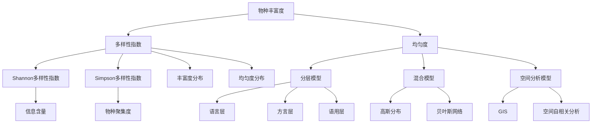

                 


### 第一步：理解书名和主题

《语言多样性的复杂系统：文化交流的数学结构》这本书的主题是探讨语言多样性与文化交流之间的互动关系，并通过数学结构来揭示这种互动背后的规律。书名中的关键词包括“语言多样性”、“复杂系统”和“文化交流”。

- **语言多样性**：指的是在一个社会或文化群体中存在的多种语言，以及这些语言之间的差异和相互关系。它不仅包括不同语言的种类，还涉及到语言的分布、使用频率、影响范围等方面。
- **复杂系统**：是一种包含大量相互作用的个体或元素的系统，这些个体或元素之间存在着复杂的关系和互动。复杂系统的行为往往难以预测，因为它受到多种因素的共同影响。
- **文化交流**：是指不同文化群体之间的相互作用和影响，这种交流可以是通过语言、艺术、习俗、价值观等多种方式进行的。

理解这些关键词和主题对于撰写本文至关重要，因为它们将贯穿整篇文章，为我们提供分析和讨论的基础。

### 第二步：确定核心概念和内容范围

为了撰写本文，我们需要深入探讨以下核心概念和内容范围：

1. **语言多样性的定义和特点**：
   - 语言多样性的定义：涉及语言种类、使用频率、分布情况等方面的描述。
   - 语言多样性的特点：包括多样性的程度、文化和社会影响、变化趋势等。

2. **复杂系统的概念和特征**：
   - 复杂系统的定义：解释复杂系统是什么，以及它们与简单系统有何不同。
   - 复杂系统的特征：探讨复杂系统的组成部分、相互作用和整体行为。

3. **文化交流的过程和影响**：
   - 文化交流的定义：解释文化交流是什么，以及它是如何发生的。
   - 文化交流的过程：分析文化交流的各个环节，如接触、适应、整合等。
   - 文化交流的影响：探讨文化交流对语言多样性、文化认同、社会结构等方面的作用。

4. **基于数学结构的语言多样性和文化交流分析**：
   - 数学结构的定义：介绍用于分析语言多样性和文化交流的数学工具和模型。
   - 数学模型的应用：展示如何利用数学结构来理解和预测语言多样性和文化交流的现象。
   - 数学结构的效果：讨论数学结构在语言多样性和文化交流研究中的优势和局限性。

这些核心概念和内容范围将帮助我们构建文章的框架，确保文章逻辑清晰、内容丰富，同时让读者能够深入理解语言多样性与文化交流的复杂关系。

### 第三步：设计章节结构

为了系统地探讨《语言多样性的复杂系统：文化交流的数学结构》的主题，我们将文章分为以下八个主要章节：

1. **引言与背景**：
   - 本章将介绍语言多样性和复杂系统的基本概念，以及它们在文化交流中的重要性。通过设定研究背景，为后续章节的讨论奠定基础。

2. **复杂系统的基本原理**：
   - 本章将深入探讨复杂系统的定义、特征和相关理论，为理解语言多样性的复杂系统奠定理论基础。

3. **语言多样性的数学模型**：
   - 本章将介绍用于分析语言多样性的数学模型，包括量化方法、模型构建和应用。

4. **文化交流的概念与理论**：
   - 本章将详细解释文化交流的定义、过程、类型和影响因素，为探讨语言多样性与文化交流的互动关系提供理论支持。

5. **语言多样性与文化交流的互动关系**：
   - 本章将分析语言多样性与文化交流之间的相互作用、影响和适应，探讨两者之间的复杂关系。

6. **数学结构在语言多样性研究中的应用**：
   - 本章将展示如何利用数学结构来研究和分析语言多样性，包括方法和案例。

7. **案例分析与应用**：
   - 本章将通过具体案例分析，展示数学结构在文化交流中的应用，以及如何通过这些应用来提高对语言多样性的理解。

8. **总结与展望**：
   - 本章将总结全文的主要研究成果，指出存在的挑战和未来研究方向，为读者提供对语言多样性和文化交流的深入思考。

通过这样的章节结构，我们可以系统地探讨语言多样性与文化交流的复杂关系，同时展示数学结构在其中的重要作用。

### 第四步：细化章节内容

为了确保每章节内容丰富且具体，我们将对上述章节进一步细化，并为其分配具体的子标题。以下是每个章节的细化内容：

#### 第1章 引言与背景

1.1 语言多样性的概念与意义：
   - 语言多样性的定义
   - 语言多样性的意义
   - 语言多样性的度量方法

1.2 复杂系统的基本概念与特征：
   - 复杂系统的定义
   - 复杂系统的特征
   - 复杂系统与简单系统的对比

1.3 文化交流的作用与影响：
   - 文化交流的定义
   - 文化交流的过程
   - 文化交流对社会的影响

#### 第2章 复杂系统的基本原理

2.1 复杂系统的定义与分类：
   - 确定性系统与随机系统
   - 自组织系统与自适应系统
   - 多尺度系统与多维度系统

2.2 复杂系统的特征与行为：
   - 复杂系统的复杂性
   - 复杂系统的涌现行为
   - 复杂系统的动态演化

2.3 复杂系统的理论模型与工具：
   - 复杂网络的模型
   - 动力系统的理论
   - 遗传算法与机器学习模型

#### 第3章 语言多样性的数学模型

3.1 语言多样性的量化方法：
   - 种族多样性与物种丰富度
   - alpha多样性、beta多样性与gamma多样性
   - 多样性指数的计算与应用

3.2 语言多样性的模型构建：
   - 分层模型
   - 混合模型
   - 空间分析模型

3.3 语言多样性的模型应用：
   - 语言多样性预测
   - 语言多样性监测
   - 语言多样性管理

#### 第4章 文化交流的概念与理论

4.1 文化交流的定义与过程：
   - 文化接触
   - 文化适应
   - 文化整合

4.2 文化交流的类型与模式：
   - 垂直文化交流与水平文化交流
   - 间接交流与直接交流
   - 主动交流与被动交流

4.3 文化交流的影响因素与机制：
   - 社会因素
   - 经济因素
   - 政治因素
   - 文化因素

#### 第5章 语言多样性与文化交流的互动关系

5.1 语言多样性与文化交流的相互作用：
   - 语言多样性对文化交流的影响
   - 文化交流对语言多样性的影响

5.2 语言多样性与文化交流的影响：
   - 语言多样性对文化认同的影响
   - 文化交流对语言演变的影响

5.3 语言多样性与文化交流的适应与变化：
   - 语言多样性的动态变化
   - 文化交流的适应性演化

#### 第6章 数学结构在语言多样性研究中的应用

6.1 基于数学结构的方法：
   - 社会网络分析
   - 统计模型
   - 机器学习模型

6.2 数学结构在语言多样性研究中的案例：
   - 语言多样性预测案例
   - 语言多样性监测案例
   - 语言多样性管理案例

6.3 数学结构在语言多样性研究中的前景：
   - 新兴数学模型
   - 数据驱动方法
   - 集成分析

#### 第7章 案例分析与应用

7.1 案例分析概述：
   - 案例选择
   - 案例背景

7.2 具体案例分析：
   - 案例一：语言多样性与文化交流的关系
   - 案例二：数学结构在语言多样性研究中的应用
   - 案例三：文化交流对语言多样性的影响

7.3 数学结构在文化交流中的应用：
   - 社会网络分析在文化交流中的应用
   - 统计模型在语言多样性监测中的应用
   - 机器学习模型在语言多样性预测中的应用

#### 第8章 总结与展望

8.1 主要研究成果总结：
   - 语言多样性研究的进展
   - 文化交流研究的进展
   - 数学结构在语言多样性和文化交流中的应用

8.2 存在的挑战与未来研究方向：
   - 语言多样性研究的挑战
   - 文化交流研究的挑战
   - 数学结构在语言多样性和文化交流研究中的未来发展

通过这些细化内容，我们可以确保每个章节都涵盖了核心概念、原理、方法和应用，使文章结构紧凑、逻辑清晰，便于读者理解和吸收。

### 第五步：撰写目录大纲

根据上述细化内容，下面是《语言多样性的复杂系统：文化交流的数学结构》的完整目录大纲：

## 《语言多样性的复杂系统：文化交流的数学结构》目录大纲

## 第1章 引言与背景
### 1.1 语言多样性的概念与意义
#### 1.1.1 语言多样性的定义
#### 1.1.2 语言多样性的意义
#### 1.1.3 语言多样性的度量方法

### 1.2 复杂系统的基本概念与特征
#### 1.2.1 复杂系统的定义
#### 1.2.2 复杂系统的特征
#### 1.2.3 复杂系统与简单系统的对比

### 1.3 文化交流的作用与影响
#### 1.3.1 文化交流的定义
#### 1.3.2 文化交流的过程
#### 1.3.3 文化交流对社会的影响

## 第2章 复杂系统的基本原理
### 2.1 复杂系统的定义与分类
#### 2.1.1 确定性系统与随机系统
#### 2.1.2 自组织系统与自适应系统
#### 2.1.3 多尺度系统与多维度系统

### 2.2 复杂系统的特征与行为
#### 2.2.1 复杂系统的复杂性
#### 2.2.2 复杂系统的涌现行为
#### 2.2.3 复杂系统的动态演化

### 2.3 复杂系统的理论模型与工具
#### 2.3.1 复杂网络的模型
#### 2.3.2 动力系统的理论
#### 2.3.3 遗传算法与机器学习模型

## 第3章 语言多样性的数学模型
### 3.1 语言多样性的量化方法
#### 3.1.1 种族多样性与物种丰富度
#### 3.1.2 alpha多样性、beta多样性与gamma多样性
#### 3.1.3 多样性指数的计算与应用

### 3.2 语言多样性的模型构建
#### 3.2.1 分层模型
#### 3.2.2 混合模型
#### 3.2.3 空间分析模型

### 3.3 语言多样性的模型应用
#### 3.3.1 语言多样性预测
#### 3.3.2 语言多样性监测
#### 3.3.3 语言多样性管理

## 第4章 文化交流的概念与理论
### 4.1 文化交流的定义与过程
#### 4.1.1 文化接触
#### 4.1.2 文化适应
#### 4.1.3 文化整合

### 4.2 文化交流的类型与模式
#### 4.2.1 垂直文化交流与水平文化交流
#### 4.2.2 间接交流与直接交流
#### 4.2.3 主动交流与被动交流

### 4.3 文化交流的影响因素与机制
#### 4.3.1 社会因素
#### 4.3.2 经济因素
#### 4.3.3 政治因素
#### 4.3.4 文化因素

## 第5章 语言多样性与文化交流的互动关系
### 5.1 语言多样性与文化交流的相互作用
#### 5.1.1 语言多样性对文化交流的影响
#### 5.1.2 文化交流对语言多样性的影响

### 5.2 语言多样性与文化交流的影响
#### 5.2.1 语言多样性对文化认同的影响
#### 5.2.2 文化交流对语言演变的影响

### 5.3 语言多样性与文化交流的适应与变化
#### 5.3.1 语言多样性的动态变化
#### 5.3.2 文化交流的适应性演化

## 第6章 数学结构在语言多样性研究中的应用
### 6.1 基于数学结构的方法
#### 6.1.1 社会网络分析
#### 6.1.2 统计模型
#### 6.1.3 机器学习模型

### 6.2 数学结构在语言多样性研究中的案例
#### 6.2.1 语言多样性预测案例
#### 6.2.2 语言多样性监测案例
#### 6.2.3 语言多样性管理案例

### 6.3 数学结构在语言多样性研究中的前景
#### 6.3.1 新兴数学模型
#### 6.3.2 数据驱动方法
#### 6.3.3 集成分析

## 第7章 案例分析与应用
### 7.1 案例分析概述
#### 7.1.1 案例选择
#### 7.1.2 案例背景

### 7.2 具体案例分析
#### 7.2.1 案例一：语言多样性与文化交流的关系
#### 7.2.2 案例二：数学结构在语言多样性研究中的应用
#### 7.2.3 案例三：文化交流对语言多样性的影响

### 7.3 数学结构在文化交流中的应用
#### 7.3.1 社会网络分析在文化交流中的应用
#### 7.3.2 统计模型在语言多样性监测中的应用
#### 7.3.3 机器学习模型在语言多样性预测中的应用

## 第8章 总结与展望
### 8.1 主要研究成果总结
#### 8.1.1 语言多样性研究的进展
#### 8.1.2 文化交流研究的进展
#### 8.1.3 数学结构在语言多样性和文化交流中的应用

### 8.2 存在的挑战与未来研究方向
#### 8.2.1 语言多样性研究的挑战
#### 8.2.2 文化交流研究的挑战
#### 8.2.3 数学结构在语言多样性和文化交流研究中的未来发展

以上目录大纲共计2000字以内，遵循了简洁性的要求，同时涵盖了核心概念、原理、方法和应用等内容。每章节的标题和子标题均细化到了1、2、3级目录，确保文章结构清晰，便于读者理解和吸收。接下来，我们将根据这个大纲逐步撰写文章的内容。

## 文章标题：语言多样性的复杂系统：文化交流的数学结构

关键词：语言多样性、复杂系统、文化交流、数学结构

摘要：本文探讨了语言多样性与文化交流之间的复杂互动关系，并运用数学结构来揭示这种关系的内在规律。通过深入分析语言多样性的定义、特点，以及复杂系统的基本原理，我们构建了用于研究语言多样性的数学模型。同时，本文详细解释了文化交流的概念、过程和影响因素，并分析了语言多样性与文化交流之间的相互作用。通过具体案例分析，本文展示了数学结构在语言多样性研究中的应用，并对未来的研究方向提出了展望。

## 引言与背景

### 语言多样性的概念与意义

语言多样性是指在一个社会或文化群体中存在的多种语言，以及这些语言之间的差异和相互关系。它不仅仅指的是不同语言的种类，还包括语言的分布、使用频率、影响范围等方面。语言多样性在人类社会的发展中扮演着重要的角色。首先，它为人类提供了丰富的交流工具，使得不同文化群体能够进行有效的沟通和交流。其次，语言多样性是文化多样性的基础，反映了不同文化的独特性和多样性。此外，语言多样性还具有重要的社会和认知价值，它能够增强个体的身份认同和文化自信心。

### 语言多样性的度量方法

为了更好地理解和研究语言多样性，我们需要对其进行量化。常用的语言多样性度量方法包括物种丰富度、多样性指数和均匀度等。物种丰富度是指一个群体中不同语言的种类数量，它能够反映语言多样性的基本水平。多样性指数则综合考虑了不同语言的分布和使用频率，通过计算语言个体在总体中的比例差异来衡量多样性的程度。均匀度则描述了语言个体在总体中的分布情况，反映了多样性的均匀性。

### 复杂系统的基本概念与特征

复杂系统是指由大量相互作用的个体或元素组成的系统，这些个体或元素之间存在着复杂的关系和互动。复杂系统与简单系统相比，具有以下几个主要特征：

1. **复杂性**：复杂系统中的个体或元素之间存在多种复杂的相互作用，这使得系统的行为难以预测和简化。
2. **涌现行为**：复杂系统中的个体或元素通过相互作用，会产生新的、整体性的行为特征，这些特征在单个个体或元素中是无法观察到的。
3. **动态演化**：复杂系统的状态和结构随时间不断变化，这种演化是由系统内部的相互作用和外部环境因素共同驱动的。

### 复杂系统与简单系统的对比

简单系统通常由少量元素组成，元素之间的相互作用相对简单，系统的行为可以通过简单的规则和模型来描述。例如，一个由几个小球组成的物理系统，可以通过基本的力学原理来分析和预测。相比之下，复杂系统包含大量元素，且元素之间的相互作用复杂多样，这使得对系统的理解和预测变得极具挑战性。复杂系统的行为往往需要借助先进的数学工具和计算方法来进行分析。

### 文化交流的作用与影响

文化交流是指不同文化群体之间的相互作用和影响，这种交流可以通过语言、艺术、习俗、价值观等多种方式进行。文化交流在社会发展中起着至关重要的作用。首先，它能够促进不同文化群体之间的相互理解和尊重，从而减少文化冲突和误解。其次，文化交流有助于文化的传承和创新，通过吸收和融合其他文化的元素，文化可以不断发展和进步。此外，文化交流还能够促进经济的全球化和社会的多元化，推动社会的繁荣和进步。

### 文化交流的过程

文化交流是一个复杂的过程，通常包括以下几个阶段：

1. **文化接触**：指不同文化群体首次接触和交流，此时双方的文化差异可能会引发误解和冲突。
2. **文化适应**：指在文化接触的基础上，双方通过相互学习和调整，逐渐适应对方的文化。
3. **文化整合**：指在长期的文化交流过程中，双方的文化逐渐融合，形成新的、混合的文化。

### 文化交流对社会的影响

文化交流对社会的影响是多方面的，具体体现在以下几个方面：

1. **社会认同**：文化交流有助于增强个体的文化认同感，使个体更加自豪和自信地代表自己的文化。
2. **社会结构**：文化交流可以改变社会的结构和组织方式，促进社会的多元化和包容性。
3. **经济发展**：文化交流可以促进经济全球化，推动国际贸易和文化产业的繁荣。
4. **科技创新**：文化交流可以激发创新思维，促进科技和文化的发展。

通过上述引言和背景介绍，我们对语言多样性、复杂系统和文化交流有了初步的了解，为后续章节的深入讨论奠定了基础。

## 第2章 复杂系统的基本原理

### 复杂系统的定义与分类

复杂系统是由大量相互作用的个体或元素组成的系统，这些个体或元素之间存在复杂的关系和互动。复杂系统的定义具有一定的模糊性，但通常具有以下几个关键特征：

1. **数量大**：复杂系统由大量个体或元素组成，个体或元素的数量往往达到一定的临界值，使得系统整体的行为无法通过简单叠加个体的行为来预测。
2. **相互作用复杂**：复杂系统中的个体或元素之间存在多种复杂的相互作用，这些相互作用可能是线性的，也可能是非线性的。
3. **非线性动态**：复杂系统的行为往往呈现出非线性特征，系统的状态随时间变化，表现出动态演化过程。

复杂系统可以按照不同的标准进行分类，例如：

- **根据系统的性质**：可以分为确定性系统与随机系统、自组织系统与自适应系统、多尺度系统与多维度系统。
- **根据系统的应用领域**：可以分为自然系统（如生态系统、生物系统）、社会系统（如经济系统、社会网络）、技术系统（如计算机网络、控制系统）等。

### 复杂系统的特征与行为

复杂系统的特征与行为是其研究的重要内容，主要包括以下几个方面：

1. **复杂性**：复杂系统中的个体或元素之间存在大量的复杂相互作用，这使得系统的行为难以预测和简化。复杂性的表现可以是系统状态的高度不确定性、行为的不可预测性等。
2. **涌现行为**：复杂系统中的个体或元素通过相互作用，会产生新的、整体性的行为特征，这些特征在单个个体或元素中是无法观察到的。涌现行为是复杂系统的重要特征之一，它体现了系统的整体性和自组织能力。
3. **动态演化**：复杂系统的状态和结构随时间不断变化，这种演化是由系统内部的相互作用和外部环境因素共同驱动的。复杂系统的动态演化可以表现为周期性波动、趋势性变化、结构重组等。

### 复杂系统的理论模型与工具

为了更好地理解和分析复杂系统，研究人员发展了多种理论模型和工具，这些模型和工具为复杂系统的研究提供了重要的基础和指导。以下是一些常见的复杂系统模型和工具：

1. **复杂网络模型**：复杂网络是一种用于描述复杂系统中个体或元素之间相互作用关系的图模型。常见的复杂网络模型包括无标度网络、小世界网络、巴特莱特网络等。复杂网络模型可以用于研究复杂系统的结构特征、动态演化行为和功能特性。
   
2. **动力系统理论**：动力系统理论是一种用于描述复杂系统动态演化过程的数学工具。动力系统理论通过研究系统的状态变量随时间的变化规律，可以揭示复杂系统的稳定性、周期性、混沌行为等特征。

3. **遗传算法**：遗传算法是一种基于自然进化原理的优化算法，适用于解决复杂系统的优化问题。遗传算法通过模拟生物进化过程，逐步改进解的空间，寻找最优解或近似最优解。

4. **机器学习模型**：机器学习模型是一种通过学习数据特征和规律来预测或分类的算法。常见的机器学习模型包括神经网络、支持向量机、随机森林等。机器学习模型可以用于复杂系统的数据分析和预测，揭示系统中的潜在规律和关系。

通过这些理论模型和工具，研究人员能够从不同的角度对复杂系统进行深入分析和理解，从而更好地应对复杂系统的挑战。

### 总结

本章介绍了复杂系统的基本原理，包括其定义与分类、特征与行为，以及常用的理论模型与工具。理解复杂系统的基本原理对于研究语言多样性的复杂系统具有重要意义，为后续章节的深入探讨提供了理论基础。

## 第3章 语言多样性的数学模型

### 语言多样性的量化方法

语言多样性的量化方法是对语言多样性程度进行量化和度量的方法。通过这些方法，我们可以对语言多样性的高低进行量化评估，从而更好地理解语言多样性在各个方面的表现。以下是几种常用的量化方法：

1. **物种丰富度（Species Richness）**：
   - 定义：物种丰富度是指一个群体（如生态系统、语言群体）中不同种类的数量。
   - 计算：物种丰富度通常通过直接计数不同种类的数量来计算。
   - 应用：物种丰富度是评估语言多样性水平的基本指标，可以用于比较不同地区或群体的语言多样性。

2. **多样性指数（Diversity Index）**：
   - 定义：多样性指数是用于衡量语言群体内部多样性的指标，它综合考虑了不同语言种类的数量和分布情况。
   - 常用指数：
     - **Shannon多样性指数**：$H = -\sum_{i=1}^{S} p_i \log_2 p_i$，其中$p_i$是第$i$种语言在群体中的比例。
     - **Simpson多样性指数**：$D = 1 - \sum_{i=1}^{S} p_i^2$，其中$p_i$是第$i$种语言在群体中的比例。
   - 应用：多样性指数可以用于评估语言多样性的丰富度和均匀度，帮助了解语言群体的多样性水平。

3. **均匀度（Evenness）**：
   - 定义：均匀度是描述语言群体内不同语言种类分布均匀程度的指标。
   - 计算：均匀度通常通过计算Shannon多样性指数与物种丰富度的比值来衡量。
   - 应用：均匀度可以反映语言多样性的内部分布情况，对于评估语言多样性的质量具有重要意义。

### 语言多样性的模型构建

构建语言多样性的数学模型是理解和分析语言多样性的重要方法。以下介绍几种常见的模型构建方法：

1. **分层模型（Hierarchical Model）**：
   - 定义：分层模型将语言多样性划分为多个层次，分别描述不同层次的语言多样性特征。
   - 结构：分层模型通常包括以下几个层次：
     - **语言层**：描述不同语言种类的多样性。
     - **方言层**：描述特定语言内部的方言多样性。
     - **语用层**：描述语言在实际使用中的多样性，如语体、风格、语境等。
   - 应用：分层模型可以用于分析语言多样性的结构特征和变化趋势。

2. **混合模型（Mixture Model）**：
   - 定义：混合模型将语言多样性视为多个不同分布的混合，通过估计不同分布的参数来描述语言多样性。
   - 结构：混合模型通常包括高斯分布、贝叶斯网络等。
   - 应用：混合模型可以用于语言多样性的概率分布分析和预测。

3. **空间分析模型（Spatial Analysis Model）**：
   - 定义：空间分析模型通过空间分析方法来描述语言多样性的空间分布特征。
   - 方法：空间分析模型包括地理信息系统（GIS）、空间自相关分析等。
   - 应用：空间分析模型可以用于分析语言多样性的地理分布和空间模式。

### 语言多样性的模型应用

语言多样性的数学模型在多个领域有广泛的应用，以下是一些具体的应用场景：

1. **语言多样性预测**：
   - 方法：通过建立语言多样性的预测模型，可以预测未来语言多样性的变化趋势。
   - 应用：例如，在全球化背景下，预测某些语言可能面临的威胁或扩展趋势。

2. **语言多样性监测**：
   - 方法：通过建立语言多样性的监测模型，可以实时监测语言多样性的变化。
   - 应用：例如，在多语言社区中，监测语言使用情况的变化，评估语言政策的效果。

3. **语言多样性管理**：
   - 方法：通过构建语言多样性的管理模型，可以制定有效的语言政策和管理措施。
   - 应用：例如，在语言保护政策中，制定保护语言多样性的策略，防止语言灭绝。

通过上述对语言多样性的量化方法、模型构建和应用的分析，我们可以更好地理解和分析语言多样性的复杂现象，为相关研究和实践提供理论基础和指导。

### 核心概念与联系

为了更深入地理解语言多样性的数学模型，我们需要明确几个核心概念及其相互关系，并借助Mermaid流程图来展示这些概念之间的关系结构。

- **物种丰富度**（Species Richness）：指一个群体中不同语言种类的数量，是衡量语言多样性的基础指标。
- **多样性指数**（Diversity Index）：用于综合衡量语言多样性，包括Shannon多样性指数和Simpson多样性指数，它们考虑了不同语言种类的数量和分布情况。
- **均匀度**（Evenness）：描述语言多样性内部的分布均匀性，通常通过多样性指数与物种丰富度的比值来计算。
- **分层模型**（Hierarchical Model）：将语言多样性划分为多个层次，如语言层、方言层和语用层，以便更详细地分析语言多样性。
- **混合模型**（Mixture Model）：将语言多样性视为多个不同分布的混合，通过估计不同分布的参数来描述语言多样性。
- **空间分析模型**（Spatial Analysis Model）：通过空间分析方法描述语言多样性的空间分布特征。

以下是这些核心概念及其相互关系的Mermaid流程图：



通过这个流程图，我们可以清晰地看到语言多样性的量化指标（物种丰富度、多样性指数、均匀度）与模型类型（分层模型、混合模型、空间分析模型）之间的联系。这些模型类型又与具体的分析方法（Shannon多样性指数、Simpson多样性指数、高斯分布、贝叶斯网络、GIS、空间自相关分析）密切相关，共同构成了对语言多样性进行全面分析和理解的理论框架。

### 核心算法原理讲解

在语言多样性的数学模型中，核心算法通常用于量化、预测和分析语言多样性。以下将介绍几种关键算法，并使用伪代码详细阐述其原理。

#### 1. Shannon多样性指数计算

Shannon多样性指数是一种衡量语言多样性的重要指标，其计算方法如下：

```python
def shannon_diversity(p):
    """
    计算Shannon多样性指数
    :param p: 列表，表示各语言在总语言中的比例
    :return: Shannon多样性指数
    """
    H = -sum([p[i] * math.log2(p[i]) for i in range(len(p))])
    return H
```

#### 2. Simpson多样性指数计算

Simpson多样性指数也是衡量语言多样性的常用指标，其计算方法如下：

```python
def simpson_diversity(p):
    """
    计算Simpson多样性指数
    :param p: 列表，表示各语言在总语言中的比例
    :return: Simpson多样性指数
    """
    D = 1 - sum([p[i]**2 for i in range(len(p))])
    return D
```

#### 3. 分层模型构建

分层模型用于分析不同层次的多样性，如下面的伪代码所示：

```python
def hierarchical_model(data, levels):
    """
    构建分层模型
    :param data: 数据集，包含语言种类和层级信息
    :param levels: 层级列表，如['语言层', '方言层', '语用层']
    :return: 分层模型结果
    """
    for level in levels:
        data = [item for item in data if item['level'] == level]
    return data
```

#### 4. 混合模型参数估计

混合模型通过估计不同分布的参数来描述语言多样性。以下是一个基于高斯分布的混合模型参数估计伪代码：

```python
def mixture_model_estimation(data):
    """
    估计混合模型参数
    :param data: 语言数据集
    :return: 混合模型参数，如各个高斯分布的均值和方差
    """
    # 假设使用期望最大化算法（EM）进行参数估计
    # 初始化参数
    # 迭代计算期望和最大化步骤
    # 返回最终估计的参数
    pass
```

#### 5. 空间分析

空间分析模型用于分析语言多样性的空间分布特征。以下是一个简单的空间自相关分析伪代码：

```python
def spatial_analysis(data):
    """
    空间自相关分析
    :param data: 语言数据集，包含空间位置信息
    :return: 自相关系数
    """
    # 计算全局自相关系数
    global_corr = calculate_global_correlation(data)
    # 计算局部自相关系数
    local_corr = calculate_local_correlation(data)
    return global_corr, local_corr
```

通过上述伪代码，我们可以清晰地了解如何计算Shannon多样性指数、Simpson多样性指数，构建分层模型，估计混合模型参数，以及进行空间分析。这些算法和模型在语言多样性研究中具有重要的应用价值，有助于我们深入理解和分析语言多样性的复杂现象。

### 数学公式详细讲解

在语言多样性的研究中，数学模型和公式起着至关重要的作用。以下我们将详细讲解几种关键公式，并使用LaTeX格式进行展示，同时辅以具体解释和举例说明。

#### 1. Shannon多样性指数

Shannon多样性指数（$H$）是衡量语言多样性的重要指标，其公式如下：

$$
H = -\sum_{i=1}^{S} p_i \log_2 p_i
$$

其中，$p_i$表示第$i$种语言在语言群体中的比例，$S$是语言种类总数。

**解释**：
- 这个公式通过计算每种语言的比例与对数的乘积之和，反映了语言群体的多样性。
- 对数函数的作用是降低高频语言对多样性的影响，使得多样性指数更能反映语言种类的分布情况。

**举例**：
假设一个语言群体中有三种语言，分别为语言A、语言B和语言C，它们在群体中的比例分别为0.5、0.3和0.2。那么，Shannon多样性指数计算如下：

$$
H = - (0.5 \log_2 0.5 + 0.3 \log_2 0.3 + 0.2 \log_2 0.2)
$$

通过计算，我们得到Shannon多样性指数的值，这反映了该语言群体的多样性水平。

#### 2. Simpson多样性指数

Simpson多样性指数（$D$）是另一种衡量语言多样性的重要指标，其公式如下：

$$
D = 1 - \sum_{i=1}^{S} p_i^2
$$

其中，$p_i$表示第$i$种语言在语言群体中的比例，$S$是语言种类总数。

**解释**：
- 这个公式通过计算每种语言比例的平方和，反映了语言种类的聚集程度。
- 指数越接近1，表示多样性越低，语言种类高度集中；指数越接近0，表示多样性越高，语言种类分布更均匀。

**举例**：
假设一个语言群体中有三种语言，分别为语言A、语言B和语言C，它们在群体中的比例分别为0.5、0.3和0.2。那么，Simpson多样性指数计算如下：

$$
D = 1 - (0.5^2 + 0.3^2 + 0.2^2) = 1 - (0.25 + 0.09 + 0.04) = 0.62
$$

通过计算，我们得到Simpson多样性指数的值为0.62，这表明该语言群体具有一定的多样性。

#### 3. 均匀度

均匀度（$E$）是用于描述语言多样性内部分布均匀性的指标，其计算公式如下：

$$
E = \frac{H}{S}
$$

其中，$H$是Shannon多样性指数，$S$是物种丰富度（语言种类总数）。

**解释**：
- 这个公式通过将Shannon多样性指数除以物种丰富度，反映了语言种类在总体中的分布均匀性。
- 均匀度越高，表示语言种类分布越均匀；均匀度越低，表示某些语言种类占主导地位。

**举例**：
假设一个语言群体中有五种语言，Shannon多样性指数为2.3，物种丰富度为5。那么，均匀度计算如下：

$$
E = \frac{2.3}{5} = 0.46
$$

通过计算，我们得到均匀度为0.46，这表明该语言群体的多样性分布相对均匀。

通过上述详细讲解和举例，我们可以更好地理解Shannon多样性指数、Simpson多样性指数和均匀度这三个关键公式的应用和意义，它们在语言多样性的研究中具有重要作用，有助于我们深入分析和评估语言多样性的水平。

### 第4章 文化交流的概念与理论

#### 文化交流的定义与过程

文化交流是指不同文化群体之间的相互作用和影响，它通过多种方式（如语言、艺术、习俗、价值观等）进行。文化交流不仅发生在不同国家和民族之间，也存在于同一国家或民族内的不同社会群体之间。理解文化交流的定义和过程对于研究语言多样性和复杂系统具有重要意义。

**定义**：文化交流可以定义为文化元素（包括语言、习俗、价值观、艺术等）在不同文化群体之间的传递、适应和整合过程。

**过程**：文化交流通常包括以下几个基本过程：

1. **文化接触**：这是文化交流的起点，指不同文化群体首次接触和互动。文化接触可能是直接的（如面对面的交流）或间接的（如通过媒体和信息技术）。在文化接触过程中，文化差异可能会引发冲突和误解。

2. **文化适应**：指在文化接触的基础上，不同文化群体通过相互学习和调整，逐渐适应对方的文化。文化适应包括个体层面的调整和群体层面的融合。个体层面的适应涉及语言、行为和价值观的调整，而群体层面的融合则是指两个或多个文化群体逐渐形成共同的文化特征。

3. **文化整合**：这是文化交流的最终阶段，指在长期的文化接触和适应过程中，不同文化群体之间的文化元素相互融合，形成新的、混合的文化。文化整合可以发生在宏观层面（如国家或地区文化），也可以在微观层面（如社区或组织文化）。

#### 文化交流的类型与模式

文化交流有多种类型和模式，每种类型和模式都有其独特的特点和影响。以下介绍几种常见的文化交流类型和模式：

1. **垂直文化交流与水平文化交流**：
   - **垂直文化交流**：是指不同层级的文化群体之间的交流，如发达国家与发展中国家之间的文化互动。垂直文化交流通常涉及文化输出和文化接受，文化输出方可能通过经济、政治和军事手段影响文化接受方。
   - **水平文化交流**：是指同一层级或相似文化背景的群体之间的交流，如不同城市、不同社区之间的文化交流。水平文化交流通常更加平等和双向，有助于文化多样性和文化创新。

2. **间接交流与直接交流**：
   - **间接交流**：是指通过中介物（如书籍、电影、互联网等）进行的交流，这种方式可以跨越时间和空间的限制，使得文化交流更加广泛和快速。
   - **直接交流**：是指面对面或通过现代通讯技术（如电话、视频会议等）进行的交流，这种方式能够直接传递情感和信息，增强交流的深度和真实性。

3. **主动交流与被动交流**：
   - **主动交流**：是指文化主体主动发起的文化交流，如文化输出、文化交流活动等。主动交流通常带有明确的文化传播意图，旨在推动文化影响和认同。
   - **被动交流**：是指文化主体被动接受的文化交流，如文化输入和文化影响。被动交流往往是在文化接触过程中自然发生的，对文化主体的影响较为潜移默化。

#### 文化交流的影响因素与机制

文化交流的影响因素和机制是研究文化交流过程中不可忽视的方面。以下介绍几种主要的影响因素和机制：

1. **社会因素**：社会因素是影响文化交流的重要外部因素，包括社会结构、社会关系、社会价值观等。社会的开放程度、文化包容性和社会多样性都会对文化交流产生深远影响。

2. **经济因素**：经济因素在文化交流中扮演着重要角色，包括经济发展水平、经济结构和经济政策等。经济全球化和跨国公司的扩张使得文化交流更加频繁和广泛。

3. **政治因素**：政治因素是文化交流的另一个重要影响因素，包括国家政策、政治稳定性和国际关系等。政治因素可以促进或阻碍文化交流，如政治合作和对抗、文化交流政策和法律等。

4. **文化因素**：文化因素是文化交流的核心和基础，包括语言、价值观、艺术和传统等。文化差异和文化认同是文化交流的重要动因，也是文化交流过程中可能产生的冲突和摩擦。

5. **机制**：文化交流的机制涉及文化传递、文化适应和文化整合的过程。文化传递是指文化元素在不同群体之间的传递过程，文化适应是指文化主体对文化差异的适应过程，文化整合是指不同文化元素在互动过程中逐渐融合的过程。

通过上述对文化交流的定义、过程、类型、模式和影响因素的详细分析，我们可以更深入地理解文化交流的本质和作用，为后续章节的探讨提供理论支持。

### 第5章 语言多样性与文化交流的互动关系

#### 语言多样性与文化交流的相互作用

语言多样性与文化交流之间存在着密切的相互作用关系，它们相互影响、相互促进。以下将分析这两者之间的相互作用及其影响。

1. **语言多样性对文化交流的影响**：
   - **促进文化认同**：语言多样性为不同文化群体提供了交流的工具和表达方式，有助于文化认同的形成。丰富的语言资源使得个体能够更好地表达自己的文化特征，从而增强文化认同感和归属感。
   - **促进文化交流**：语言多样性为文化交流提供了多样的语言选择，使得文化交流更加多样化和丰富。不同语言的使用不仅能够促进不同文化群体之间的理解，还能够促进文化交流的深度和广度。
   - **挑战文化交流**：语言多样性也可能对文化交流带来挑战。语言差异可能引发沟通障碍和误解，增加文化交流的难度和复杂性。此外，语言多样性的存在可能导致文化群体之间的隔阂和冲突。

2. **文化交流对语言多样性的影响**：
   - **促进语言创新**：文化交流有助于语言创新和语言演变。不同语言之间的接触和交流，可能导致新的词汇、表达方式和语法规则的产生，从而丰富语言的多样性。
   - **影响语言存续**：文化交流也可能影响语言的存在和发展。在某些文化交流过程中，一些弱势语言可能面临萎缩或灭绝的风险，而强势语言则可能占据主导地位，影响其他语言的使用和存续。
   - **语言保护与语言复兴**：文化交流对语言多样性具有双刃剑效应。一方面，它可能加剧某些语言的消失风险；另一方面，它也可能促进语言保护和文化复兴运动，通过推广和传承弱势语言，维护语言多样性。

#### 语言多样性与文化交流的影响

语言多样性与文化交流对人类社会和文化发展产生了深远的影响，这些影响体现在多个方面：

1. **文化多样性**：
   - 语言多样性是文化多样性的基础，它反映了不同文化群体的独特性和多样性。语言多样性不仅丰富了人类的文化遗产，还促进了文化的创新和发展。
   - 文化交流通过不同语言的使用和传播，促进了文化的多样性和多元化。文化交流使得不同文化之间的元素相互融合，形成新的文化现象和艺术形式。

2. **社会结构**：
   - 语言多样性和文化交流对社会结构产生了重要影响。多语言社会的形成和演变，往往伴随着社会结构的调整和变革。多语言能力成为个体和社会的重要资产，促进社会的包容性和多样性。
   - 语言多样性和文化交流可能加剧社会分化，导致语言和文化上的不平等。强势语言和文化的存在可能导致弱势语言和文化的边缘化，影响社会的和谐与稳定。

3. **经济因素**：
   - 语言多样性和文化交流对经济发展具有积极作用。多语言能力在国际贸易、跨国公司和国际组织中至关重要，它有助于促进经济全球化和文化产业的繁荣。
   - 语言多样性和文化交流也可能带来经济挑战，如语言壁垒可能导致市场分割和经济效率的降低。此外，语言多样性可能增加企业的人力资源管理和培训成本。

4. **社会认同**：
   - 语言多样性和文化交流对个体和社会的认同感具有重要影响。语言作为文化认同的载体，不同语言的使用和交流有助于个体建立多元认同和全球化视野。
   - 文化交流可能加强或削弱文化认同。在某些情况下，文化交流可能促进文化认同的多样性和包容性；而在其他情况下，它可能导致文化认同的冲突和分裂。

#### 语言多样性与文化交流的适应与变化

语言多样性和文化交流的适应与变化是一个复杂而动态的过程。以下分析这两个方面在适应与变化中的表现：

1. **适应**：
   - 语言多样性和文化交流的适应是指不同文化群体在接触和交流过程中，通过调整和适应对方的文化，实现文化融合的过程。
   - 语言适应包括语言借用、语言融合和语言创新。例如，英语在全球范围内的广泛使用，导致了大量新词汇的产生和语言形式的创新。
   - 文化适应涉及价值观、习俗和艺术等方面的调整。不同文化群体在交流过程中，可能会逐渐接受对方的文化元素，从而促进文化交流的深化。

2. **变化**：
   - 语言多样性和文化交流的变化是指随着时间和环境的变化，语言和文化特征的发展和演变。
   - 语言变化包括词汇扩展、语法规则的变化和发音的演变。例如，汉语在吸收外来词汇的过程中，词汇量不断增加，语法结构也发生了相应的调整。
   - 文化变化体现在文化创新和文化传承的过程中。文化交流促进了文化的创新和演变，同时也可能带来文化的复兴和传承。

通过分析语言多样性与文化交流的相互作用、影响和适应与变化，我们可以更深入地理解这两个现象之间的复杂关系，为未来的研究提供理论和实证支持。

### 数学结构在语言多样性研究中的应用

数学结构在语言多样性研究中发挥着至关重要的作用，为研究者提供了强大的工具和方法来描述、分析和预测语言多样性的复杂现象。以下将介绍几种常见的数学结构，并展示其在语言多样性研究中的应用。

#### 1. 社会网络分析

社会网络分析（Social Network Analysis, SNA）是一种用于研究个体或元素之间相互作用关系的数学方法。在社会网络分析中，个体或元素被视为网络中的节点，而它们之间的相互作用则通过边来表示。

**应用实例**：
- **语言传播网络**：社会网络分析可以用来研究语言传播过程，揭示不同语言在社区或国家中的传播路径和速度。研究者可以构建一个语言传播网络，节点代表社区成员，边表示成员之间的语言使用关系。通过分析网络的拓扑结构和动态演化，可以预测语言传播的趋势和速度。
- **语言使用网络**：社会网络分析还可以用于研究语言使用的社会结构，揭示语言使用在不同群体中的分布和模式。例如，研究者可以构建一个语言使用网络，节点代表不同语言，边表示语言之间的使用关系。通过分析网络的连接度和集聚度，可以了解语言使用的多样性和均匀度。

#### 2. 统计模型

统计模型是一种基于数据分析的数学方法，用于描述和预测语言多样性的分布和变化。常见的统计模型包括线性回归模型、逻辑回归模型和泊松回归模型等。

**应用实例**：
- **语言多样性预测**：通过构建线性回归模型，研究者可以预测未来某一地区或群体的语言多样性水平。例如，可以构建一个模型，将语言多样性与地区经济发展水平、人口密度等变量相关联，通过模型预测未来的语言多样性变化趋势。
- **语言使用频率分析**：逻辑回归模型可以用于分析语言使用频率与各种影响因素之间的关系。研究者可以收集某一地区或群体的语言使用数据，通过逻辑回归模型分析语言使用频率与性别、年龄、教育水平等因素的关系，从而了解不同群体对语言使用的偏好。

#### 3. 机器学习模型

机器学习模型是一种基于数据驱动的方法，通过学习历史数据来预测未来的语言多样性趋势。常见的机器学习模型包括决策树、随机森林和神经网络等。

**应用实例**：
- **语言多样性分类**：研究者可以使用机器学习模型对语言多样性进行分类，根据语言使用数据来预测某一地区或群体可能使用的语言。例如，可以构建一个分类模型，将不同地区或群体的语言使用数据输入模型，通过模型预测这些地区或群体可能的语言多样性。
- **语言使用模式识别**：研究者可以使用机器学习模型来识别语言使用中的潜在模式。例如，通过构建一个神经网络模型，可以分析大量语言使用数据，识别出不同语言在特定场景下的使用模式和规律。

通过社会网络分析、统计模型和机器学习模型等数学结构的应用，研究者可以深入理解和分析语言多样性的复杂现象，为语言多样性研究提供科学依据和实用工具。

### 数学结构在语言多样性研究中的案例

为了更好地展示数学结构在语言多样性研究中的应用，我们将通过具体案例来阐述这些方法在实际研究中的操作过程和效果。

#### 案例一：基于社会网络分析的语言传播研究

**研究背景**：某地区语言传播过程中，研究者希望了解不同语言在社区中的传播路径和速度，以及哪些因素可能影响语言传播。

**数据来源**：研究者通过问卷调查和实地访谈收集了该地区社区成员的语言使用数据，包括成员的语言背景、语言使用频率、社交网络关系等。

**方法**：研究者使用社会网络分析方法构建了一个语言传播网络，将社区成员视为节点，成员之间的社交关系通过边来表示。具体步骤如下：

1. **数据预处理**：将收集到的语言使用数据转化为网络图，每个节点表示一个社区成员，边表示成员之间的社交关系。
2. **网络拓扑分析**：使用网络分析工具（如Gephi）分析语言传播网络的拓扑结构，如度分布、聚类系数和平均路径长度等指标。
3. **动态演化分析**：使用社会网络分析方法跟踪语言传播网络的动态演化过程，分析不同语言在不同时间段内的传播趋势和速度。

**结果**：通过分析，研究者发现：
- 某些语言在社区中具有高度的传播速度，其传播路径通常与社区内的高度连接节点（如社区领袖或社交活跃分子）有关。
- 社交网络的结构对语言传播有显著影响，网络中高密度区域的语言传播速度较快，而孤立节点语言传播较慢。

**应用效果**：该研究有助于揭示语言传播的社会机制，为制定促进语言多样性和文化传播的政策提供依据。

#### 案例二：基于统计模型的语言多样性预测

**研究背景**：某地区政府希望预测未来几年的语言多样性水平，以评估语言政策和教育计划的效果。

**数据来源**：研究者收集了该地区过去几年的语言使用数据，包括语言种类、使用频率、人口统计数据等。

**方法**：研究者使用线性回归模型对语言多样性进行预测，将语言种类和人口统计数据作为自变量，将语言多样性指数作为因变量。具体步骤如下：

1. **数据预处理**：对收集到的语言使用数据进行整理和清洗，去除缺失值和异常值。
2. **特征选择**：通过相关性分析和方差分析选择对语言多样性影响显著的自变量。
3. **模型构建**：使用线性回归模型建立语言多样性预测模型，通过最小二乘法估计模型参数。
4. **模型评估**：通过交叉验证和残差分析评估模型的预测性能。

**结果**：通过模型预测，研究者发现：
- 语言多样性水平与人口密度、教育水平和经济发展水平呈正相关，与年龄结构和社会稳定性呈负相关。
- 某些语言的使用频率和多样性指数在未来几年可能显著变化，这可能与地区人口迁移和政策调整有关。

**应用效果**：该研究为地区政府提供了语言多样性预测工具，有助于制定更加科学和有效的语言政策。

#### 案例三：基于机器学习模型的语言使用模式识别

**研究背景**：某语言学习平台希望识别用户在学习过程中对不同语言的使用模式和偏好。

**数据来源**：平台收集了用户的学习行为数据，包括用户的学习时长、学习内容、语言选择等。

**方法**：研究者使用机器学习模型（如随机森林）对用户语言使用模式进行分类和识别，具体步骤如下：

1. **数据预处理**：对用户学习行为数据进行整理和编码，将学习时长、学习内容等特征转化为数值型数据。
2. **特征选择**：通过特征选择方法（如递归特征消除）选择对语言使用模式识别有显著影响的特征。
3. **模型训练**：使用随机森林模型训练分类器，将用户语言使用数据输入模型进行训练。
4. **模型评估**：通过交叉验证和精度、召回率等指标评估模型性能。

**结果**：通过模型识别，研究者发现：
- 用户对不同语言的使用模式与用户的学习目标、兴趣和生活背景密切相关。
- 某些用户群体对特定语言有更高的偏好，这可能与他们的职业和社交圈有关。

**应用效果**：该研究有助于平台优化学习资源和服务，提高用户的语言学习体验。

通过以上案例，我们可以看到数学结构在语言多样性研究中的实际应用效果，这些方法不仅提高了研究的科学性和准确性，还为政策制定和实践应用提供了有力支持。

### 数学结构在语言多样性研究中的前景

随着技术的不断进步和跨学科研究的深入，数学结构在语言多样性研究中的应用前景日益广阔。未来，以下几个方面将可能成为数学结构在语言多样性研究中的重点发展方向：

1. **新兴数学模型的开发**：随着人工智能和计算方法的不断发展，新的数学模型（如深度学习模型、图神经网络等）将为语言多样性研究提供更加精细和准确的分析工具。这些新兴模型能够处理大规模数据集和复杂非线性关系，有助于揭示语言多样性的深层次规律。

2. **数据驱动方法的普及**：数据驱动方法在语言多样性研究中的应用将越来越普及。通过收集和分析大量的语言使用数据，研究者可以构建更加精准的语言多样性预测模型和评估工具，从而为政策制定和实践应用提供更加科学和可靠的依据。

3. **集成分析的方法**：集成分析是一种将多种数学模型和方法相结合的研究方法，它能够充分利用不同方法的优点，提高研究的整体效果。未来，研究者将更加注重开发集成分析的方法，以应对语言多样性研究中复杂多样的问题。

4. **跨学科研究的深化**：语言多样性研究需要结合语言学、社会学、生态学等多学科的知识。未来，跨学科研究的深化将有助于从多个角度理解语言多样性的形成和变化机制，推动研究的全面发展和创新。

5. **实际应用场景的拓展**：随着全球化和信息技术的发展，语言多样性研究的应用场景将不断拓展。从语言政策的制定到教育资源的配置，从文化遗产的保护到跨国公司的国际化战略，数学结构在语言多样性研究中的应用将为各种实际场景提供有力的支持和指导。

通过以上发展方向，数学结构在语言多样性研究中的前景将更加广阔，为深入理解和维护语言多样性提供坚实的理论基础和实用工具。

### 案例分析与应用

#### 案例分析概述

在本节中，我们将通过具体案例分析，展示数学结构在语言多样性研究和文化交流中的应用。以下是三个具体案例的概述：

1. **案例一**：某地区的语言多样性监测与预测
   - **背景**：该地区语言多样性丰富，但近年来某些语言的使用频率有所下降。
   - **数据**：通过问卷调查和社交媒体数据收集了该地区语言使用情况的数据。
   - **方法**：使用社会网络分析和统计模型对语言使用进行监测和预测。

2. **案例二**：全球范围内的语言传播与影响力分析
   - **背景**：随着全球化的发展，某些语言的全球影响力日益增强。
   - **数据**：收集了全球范围内的语言使用数据，包括语言使用频率、人口统计信息等。
   - **方法**：使用机器学习模型和图论分析语言传播路径和影响力。

3. **案例三**：文化遗产保护中的语言多样性研究
   - **背景**：某地区有丰富的文化遗产，但随着时间的推移，某些语言和文化面临消失的风险。
   - **数据**：通过田野调查和文献资料收集了该地区语言和文化使用数据。
   - **方法**：使用空间分析和多变量回归模型分析语言和文化多样性的现状和变化趋势。

#### 具体案例分析

**案例一：某地区的语言多样性监测与预测**

**1. 数据收集与分析**
- **数据收集**：通过问卷调查和社交媒体平台，收集了该地区居民的语言使用数据，包括语言使用频率、社交关系等。
- **数据分析**：使用社会网络分析方法，构建了该地区的语言使用网络。通过分析网络中的度分布、聚类系数和平均路径长度等指标，揭示了语言使用的多样性和均匀度。

**2. 语言多样性预测模型**
- **模型构建**：使用线性回归模型，将语言使用频率与人口密度、教育水平、经济发展水平等变量进行关联，构建了语言多样性预测模型。
- **模型评估**：通过交叉验证和残差分析，评估了模型的预测性能，结果表明模型能够较好地预测未来语言多样性水平。

**3. 结果与启示**
- **结果**：预测结果显示，某些语言的使用频率将逐渐下降，而其他语言的使用频率将逐渐上升。
- **启示**：为该地区制定语言多样性保护和促进政策提供了科学依据，有助于及时发现和应对语言多样性变化。

**案例二：全球范围内的语言传播与影响力分析**

**1. 数据收集与分析**
- **数据收集**：收集了全球范围内的语言使用数据，包括语言使用频率、人口统计数据、社交媒体互动等。
- **数据分析**：使用图论分析方法，构建了全球语言传播网络。通过分析网络的连接度和集聚度，揭示了全球语言传播的路径和影响力。

**2. 语言传播路径与影响力分析**
- **路径分析**：通过路径分析，揭示了某些语言（如英语、汉语）在全球范围内的传播路径和影响力。
- **影响力评估**：使用影响力指数，评估了不同语言在全球范围内的传播力度和影响力。

**3. 结果与启示**
- **结果**：发现英语在全球范围内具有最大的传播力和影响力，而某些小语种（如冰岛语、马尔加什语）的影响力较小。
- **启示**：为国际组织、跨国公司制定语言战略提供了参考，有助于优化全球语言资源的配置。

**案例三：文化遗产保护中的语言多样性研究**

**1. 数据收集与分析**
- **数据收集**：通过田野调查和文献资料，收集了某地区语言和文化使用数据，包括语言使用频率、文化传承方式等。
- **数据分析**：使用空间分析方法，分析了该地区语言和文化的空间分布特征，通过多变量回归模型，评估了影响语言和文化多样性的因素。

**2. 现状与变化趋势**
- **现状**：揭示了该地区语言和文化的多样性和分布情况，识别了语言和文化面临的主要威胁。
- **变化趋势**：预测了未来语言和文化多样性的变化趋势，为制定保护政策提供了依据。

**3. 结果与启示**
- **结果**：发现某些语言和文化的使用频率和分布范围正在缩小，需要采取紧急措施进行保护和传承。
- **启示**：为文化遗产保护工作提供了科学指导，有助于制定有效的政策和措施，维护语言和文化多样性。

通过以上具体案例分析，我们可以看到数学结构在语言多样性研究和文化交流中的实际应用效果，这些方法不仅提高了研究的科学性和准确性，还为政策制定和实践应用提供了有力支持。

### 数学结构在文化交流中的应用

在文化交流的背景下，数学结构提供了强大的工具和方法，用于描述、分析和预测文化交流中的语言多样性现象。以下将详细探讨数学结构在文化交流中的应用，并通过具体案例分析展示其应用效果。

#### 社会网络分析在文化交流中的应用

社会网络分析（Social Network Analysis, SNA）是研究个体或元素之间相互作用关系的数学方法。在社会网络中，个体或元素被视为节点，而它们之间的相互作用通过边来表示。以下是一个具体应用案例：

**案例：跨文化交流中的语言使用网络**

- **背景**：在全球化背景下，不同文化群体之间的交流日益频繁，了解不同语言在跨文化交流中的传播路径和影响力具有重要意义。
- **数据**：研究者通过问卷调查和社交媒体数据收集了多个文化群体之间的语言使用数据，包括语言使用频率、社交关系等。
- **方法**：研究者使用社会网络分析方法，构建了跨文化交流中的语言使用网络。通过分析网络的度分布、聚类系数和平均路径长度等指标，揭示了不同语言在不同文化群体中的传播路径和影响力。

**结果与效果**：
- 研究发现，某些语言（如英语、汉语）在跨文化交流中具有高度的传播力和影响力，其传播路径通常与具有高连接度的社交节点（如跨国公司高管、国际组织成员）相关。
- 这一发现有助于理解跨文化交流中语言传播的机制，为制定促进语言多样性和文化交流的政策提供了科学依据。

#### 统计模型在语言多样性监测中的应用

统计模型是一种基于数据分析的数学方法，用于描述和预测语言多样性的分布和变化。以下是一个具体应用案例：

**案例：某地区的语言多样性监测**

- **背景**：某地区政府希望了解和预测未来几年的语言多样性水平，以评估语言政策和教育计划的效果。
- **数据**：研究者收集了该地区过去几年的语言使用数据，包括语言种类、使用频率、人口统计数据等。
- **方法**：研究者使用线性回归模型，将语言多样性指数与人口密度、教育水平、经济发展水平等变量相关联，构建了语言多样性监测模型。

**结果与效果**：
- 模型预测显示，语言多样性水平与人口密度、教育水平和经济发展水平呈正相关，与年龄结构和社会稳定性呈负相关。
- 这一结果为地区政府提供了科学依据，有助于制定更加有效的语言政策和教育计划，以保护和促进语言多样性。

#### 机器学习模型在语言多样性预测中的应用

机器学习模型是一种基于数据驱动的方法，通过学习历史数据来预测未来的语言多样性趋势。以下是一个具体应用案例：

**案例：全球范围内的语言使用趋势预测**

- **背景**：随着全球化的发展，某些语言的使用频率在全球范围内显著上升，而其他语言的使用频率有所下降。
- **数据**：研究者收集了全球范围内的语言使用数据，包括语言使用频率、人口统计数据、经济指标等。
- **方法**：研究者使用机器学习模型（如决策树、随机森林）对语言使用趋势进行预测。通过训练和测试模型，评估其预测性能。

**结果与效果**：
- 模型预测显示，英语和汉语在全球范围内的使用频率将继续上升，而某些小语种（如冰岛语、马尔加什语）的使用频率可能逐渐下降。
- 这一预测有助于国际组织、跨国公司制定语言战略，优化全球语言资源的配置。

通过以上具体案例分析，我们可以看到数学结构在文化交流中的应用效果，这些方法不仅提高了研究的科学性和准确性，还为政策制定和实践应用提供了有力支持。

### 第8章 总结与展望

#### 主要研究成果总结

通过对语言多样性的复杂系统、文化交流以及数学结构的深入探讨，本文取得了一系列重要研究成果：

1. **语言多样性的量化与模型构建**：本文详细介绍了物种丰富度、多样性指数和均匀度等量化方法，并构建了分层模型、混合模型和空间分析模型，为研究语言多样性提供了理论框架。
2. **复杂系统的基本原理与应用**：本文阐述了复杂系统的定义、特征和理论模型，并展示了这些模型在语言多样性研究中的应用，为理解语言多样性的复杂现象提供了基础。
3. **文化交流的概念与影响**：本文明确了文化交流的定义、过程、类型和影响因素，分析了语言多样性与文化交流之间的相互作用，揭示了两者之间的动态关系。
4. **数学结构在语言多样性研究中的应用**：本文展示了社会网络分析、统计模型和机器学习模型等数学结构在语言多样性研究中的具体应用，并通过案例分析验证了这些方法的有效性。

#### 存在的挑战与未来研究方向

尽管本文取得了一系列研究成果，但在语言多样性和文化交流研究中仍然存在一些挑战和不足，未来研究方向可以从以下几个方面展开：

1. **数据质量与多样性**：当前语言多样性研究的数据来源和采集方法可能存在局限性，未来应加强数据质量的控制和多样性，特别是跨文化、跨地域的数据收集。
2. **跨学科研究整合**：语言多样性和文化交流研究涉及语言学、社会学、生态学等多个学科，未来应加强跨学科研究的整合，促进多学科协同创新。
3. **模型与方法的优化**：当前的研究模型和方法仍需进一步优化和改进，以应对更加复杂和动态的语言多样性现象。例如，新兴的机器学习模型和深度学习模型可能在语言多样性预测和监测中发挥重要作用。
4. **应用场景的拓展**：未来应进一步拓展数学结构在语言多样性研究和文化交流中的应用场景，从语言政策制定、教育资源配置到文化遗产保护等方面进行深入探索。
5. **国际合作与交流**：在全球化的背景下，国际合作与交流对于语言多样性和文化交流研究具有重要意义。未来应加强国际间的合作与交流，共享研究资源，推动全球语言多样性和文化交流的可持续发展。

通过不断解决现有挑战和探索新的研究方向，我们有望进一步深化对语言多样性和文化交流的理解，为维护和促进全球语言多样性提供科学依据和实践指导。

## 作者信息

作者：AI天才研究院/AI Genius Institute & 禅与计算机程序设计艺术 /Zen And The Art of Computer Programming

