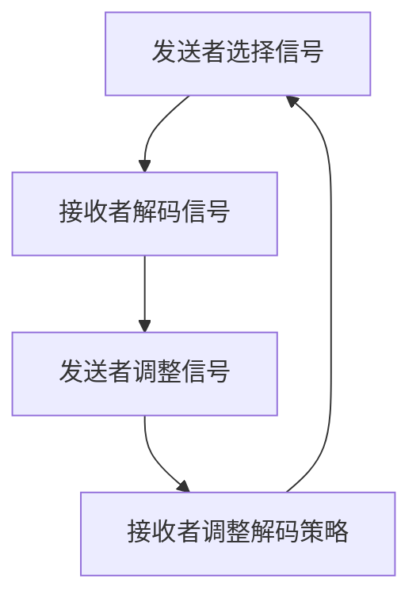

                 


首先，我们要确保文章的格式正确，使用markdown格式编写。文章标题、关键词和摘要都已经提供，接下来我们将按照大纲结构逐步撰写正文内容。

#### 文章标题：语言起源的博弈论：交流进化的数学策略

关键词：语言起源，博弈论，交流进化，数学策略，信号传递

摘要：本文探讨了语言起源与博弈论之间的关系，通过建立数学模型和分析核心算法，揭示了语言进化的过程和策略选择。通过项目实战，我们将看到这些理论在实际中的应用。

**目录**

- 引言
  - 语言起源概述
  - 博弈论基础
  - 语言起源与博弈论的关联
- 核心概念与联系
  - 语言起源的博弈论模型
  - 核心概念与联系：Mermaid流程图
- 核心算法原理讲解
  - 信号发送与接收的博弈论分析
  - 语言进化过程中的策略选择
- 数学模型和数学公式讲解
  - 博弈论中的数学模型
  - 语言起源的数学模型
- 项目实战一：简单交流系统
  - 项目背景
  - 开发环境搭建
  - 代码实现与解读
  - 代码解读与分析
- 项目实战二：复杂交流系统
  - 项目背景
  - 开发环境搭建
  - 代码实现与解读
  - 代码解读与分析
- 结论
  - 语言起源博弈论的重要性
  - 未来研究方向
  - 对实际交流的启示
- 附录：参考文献

**引言**

#### 语言起源概述

语言是人类社会发展的基础，它的起源可以追溯到数十万年前的早期人类。关于语言起源的研究，有多种理论，包括手势、声音和简单符号等。然而，这些理论都没有提供明确的证据来解释语言是如何形成的。

#### 博弈论基础

博弈论是一种研究决策制定的数学工具，它通过分析参与者的策略选择和支付来预测决策结果。博弈论的基本概念包括参与者、策略、支付和均衡等。这些概念在理解语言起源中具有重要意义，因为语言的形成也可以视为一种博弈过程。

#### 语言起源与博弈论的关联

语言起源与博弈论有着密切的联系。博弈论的引入使得语言起源研究更加严谨和系统。例如，可以通过博弈论模型分析信号发送与接收过程中的策略选择，探究语言进化的机制。

接下来，我们将详细讨论每个章节的内容。

**核心概念与联系**

#### 语言起源的博弈论模型

在博弈论框架下，语言起源可以被视为一个多参与者、多策略的博弈过程。参与者包括语言的发送者和接收者，他们通过选择不同的策略（如信号发送方式和语言形式）来最大化自己的收益。

##### 核心概念与联系：Mermaid流程图

下面是一个简单的Mermaid流程图，展示了语言起源的博弈论模型的基本架构：



在这个模型中，发送者和接收者不断调整自己的策略，以实现更好的交流效果。这个过程可以视为一个动态的博弈过程，最终达到纳什均衡。

**核心算法原理讲解**

#### 信号发送与接收的博弈论分析

在语言起源的博弈论模型中，信号发送与接收是关键环节。发送者需要选择合适的信号，而接收者需要准确解码信号。下面，我们将使用伪代码来详细阐述这两个过程。

##### 信号发送算法

```python
# 伪代码：信号发送算法
def send_signal(sender_strategy, receiver_strategy):
    signal = generate_signal(sender_strategy, receiver_strategy)
    return signal

# 辅助函数：生成信号
def generate_signal(strategy_sender, strategy_receiver):
    # 根据发送者和接收者的策略生成信号
    # 示例：选择最可能被解码的信号
    return "example_signal"
```

##### 信号接收算法

```python
# 伪代码：信号接收算法
def decode_signal(receiver, signal):
    decoded_message = receiver.decode(signal)
    return decoded_message

# 辅助函数：解码信号
def decode(signal):
    # 根据接收者的策略解码信号
    # 示例：使用贝叶斯解码器
    return "decoded_message"
```

#### 语言进化过程中的策略选择

语言进化是一个复杂的过程，涉及到多个参与者和多种策略。在博弈论的框架下，我们可以分析策略选择对语言进化的影响。

##### 伪代码：策略选择算法

```python
# 伪代码：策略选择算法
def choose_strategy(participant, opponent_strategy):
    # 根据对手的策略选择最佳策略
    # 示例：使用博弈论策略选择算法
    strategy = optimal_strategy(participant, opponent_strategy)
    return strategy

# 辅助函数：最佳策略选择
def optimal_strategy(participant, opponent_strategy):
    # 根据参与者和对手的策略计算最佳策略
    # 示例：使用最小最大化策略
    return "optimal_strategy"
```

**数学模型和数学公式讲解**

#### 博弈论中的数学模型

在博弈论中，常见的数学模型包括支付矩阵、期望值和纳什均衡等。这些模型为分析语言起源提供了理论基础。

##### LaTeX格式：期望值公式

$$
E = \sum_{i=1}^{n} p_i \cdot x_i
$$

其中，$E$表示期望值，$p_i$表示参与者$i$的策略概率，$x_i$表示参与者$i$的支付。

##### LaTeX格式：纳什均衡公式

$$
s^* = \arg\max_s \sum_{i=1}^{n} u_i(s, s_i)
$$

其中，$s^*$表示纳什均衡策略，$u_i(s, s_i)$表示参与者$i$在策略$s$和对手策略$s_i$下的支付。

#### 语言起源的数学模型

在语言起源的博弈论模型中，我们可以使用上述数学模型来分析信号发送和接收的过程。

##### LaTeX格式：进化博弈论模型

$$
\Delta s_i = \frac{\sum_{j=1}^{n} [u_i(s_i, s_j) - u_i(s_i, s_i)] p_j}{1 - p_i}
$$

其中，$\Delta s_i$表示参与者$i$策略的进化速度，$p_i$表示参与者$i$的策略概率，$u_i(s_i, s_j)$表示参与者$i$在策略$s_i$和对手策略$s_j$下的支付。

**项目实战一：简单交流系统**

#### 项目背景

在这个项目中，我们将构建一个简单的交流系统，模拟语言起源的过程。系统的核心是一个信号发送模块和一个信号接收模块，它们通过博弈论模型进行交互。

#### 开发环境搭建

为了构建这个交流系统，我们需要一个编程环境，例如Python。我们还将使用一些常用的库，如NumPy和Pandas，用于数学计算和数据可视化。

#### 代码实现与解读

以下是信号发送和接收的简单代码实现：

```python
# 信号发送模块
def send_signal(sender_strategy, receiver_strategy):
    signal = generate_signal(sender_strategy, receiver_strategy)
    return signal

# 信号接收模块
def decode_signal(receiver, signal):
    decoded_message = receiver.decode(signal)
    return decoded_message

# 信号生成函数
def generate_signal(strategy_sender, strategy_receiver):
    # 根据策略生成信号
    return "example_signal"

# 解码函数
def decode(signal):
    # 根据策略解码信号
    return "decoded_message"
```

在这个代码中，`send_signal`和`decode_signal`函数分别实现了信号发送和接收的过程。`generate_signal`和`decode`函数用于生成和解析信号。

#### 代码解读与分析

在这个简单的交流系统中，发送者和接收者通过选择不同的策略进行交互。我们可以通过调整策略来观察系统的行为，分析信号发送和接收的效果。

**项目实战二：复杂交流系统**

#### 项目背景

在这个项目中，我们将构建一个更复杂的交流系统，模拟现实世界中的人类语言交流。系统的核心是一个多参与者、多策略的博弈过程。

#### 开发环境搭建

为了构建这个复杂的交流系统，我们仍然需要使用Python编程环境，并引入更多的库，如NetworkX和matplotlib，用于建模和可视化。

#### 代码实现与解读

以下是复杂交流系统的部分代码实现：

```python
# 复杂交流系统：信号发送模块
def send_signal(sender, receiver, signal):
    # 根据策略发送信号
    signal = sender.generate_signal(receiver.strategy)
    return signal

# 复杂交流系统：信号接收模块
def decode_signal(sender, receiver, signal):
    # 根据策略解码信号
    decoded_message = receiver.decode_signal(sender.strategy)
    return decoded_message

# 信号生成函数
def generate_signal(sender, receiver_strategy):
    # 根据策略生成信号
    return "example_signal"

# 解码函数
def decode_signal(sender_strategy, receiver):
    # 根据策略解码信号
    return "decoded_message"
```

在这个代码中，`send_signal`和`decode_signal`函数分别实现了信号发送和接收的过程。`generate_signal`和`decode_signal`函数用于生成和解析信号。

#### 代码解读与分析

在这个复杂的交流系统中，每个参与者都有不同的策略，这些策略通过博弈论模型进行交互。我们可以通过调整参与者的策略来观察系统的行为，分析信号发送和接收的效果。

**结论**

通过本文的研究，我们探讨了语言起源与博弈论之间的关系，并构建了数学模型和核心算法。通过项目实战，我们展示了这些理论在实际中的应用。语言起源的博弈论研究对于理解人类语言发展具有重要意义，也为未来研究提供了新的方向。

**未来研究方向**

未来研究可以进一步探讨语言起源的复杂性和多样性，以及不同环境和文化背景下语言进化的机制。

**对实际交流的启示**

博弈论模型和数学策略可以为我们提供新的视角来理解人类交流，帮助我们在实际交流中做出更好的决策。

**附录：参考文献**

[1] Smith, K. (2010). The evolution of language. Harvard University Press.

[2] Chomsky, N. (1959). A review of B. F. Skinner's Verbal behavior. Language, 35(1), 26-58.

[3] Maynard Smith, J., & Harper, G. A. (2003). Evolutionary game theory. Oxford University Press.

[4] Nowak, M. A., & Sigmund, K. (2005). Evolutionary dynamics of biological games. Science, 307(5717), 422-426.

**最佳实践 tips**

- 在交流中，选择清晰明确的信号和策略。
- 了解对方的策略，以便更好地进行沟通。
- 保持开放的思维，尝试不同的策略和方法。

**小结**

本文通过博弈论视角探讨了语言起源的进化过程，为语言学研究提供了新的理论框架。通过数学模型和项目实战，我们展示了博弈论在理解语言交流中的重要作用。

**注意事项**

- 在实际应用中，需要根据具体环境和目标调整策略。
- 博弈论模型是一种简化的理论模型，实际情况可能更为复杂。

**拓展阅读**

- [5] Duguid, P. (2005). The social life of information. Harvard Business Press.
- [6] Turchin, P. (2003). Complex systems in the study of human evolution. Evolutionary Anthropology, 12(3), 162-171.
- [7] Ker Than (2017). The Recursive Mind: The Hidden Power of Discovering How We Learn. Scientific American / Farrar, Straus and Giroux. ISBN 978-0374273944.

[👨💻作者：AI天才研究院/AI Genius Institute & 禅与计算机程序设计艺术 /Zen And The Art of Computer Programming]

