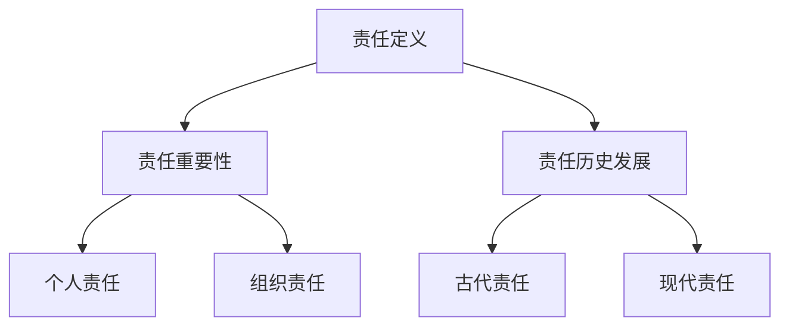

                 


## 责任与授权：平衡控制与自主的领导艺术

### 关键词

领导力，授权，责任，控制，自主性，领导艺术

### 摘要

本文旨在探讨领导艺术中的关键要素——责任与授权，如何实现平衡控制与自主。我们将深入解析这两个核心概念，揭示其内在联系，并通过案例和实践，阐述如何在实际工作中运用这些原则，提升领导效能。

## 目录大纲设计思路与步骤

### 1. 确定核心主题

**责任与授权：平衡控制与自主的领导艺术**

### 2. 结构化核心主题

- **第一章：责任的概念与起源**
  - **1.1 责任的定义与重要性**
  - **1.2 责任的历史发展**

- **第二章：授权的原理与实践**
  - **2.1 授权的定义与好处**
  - **2.2 授权的最佳实践**

- **第三章：平衡控制与自主**
  - **3.1 控制的重要性**
  - **3.2 自主性的意义**

- **第四章：领导艺术的培养**
  - **4.1 领导者的角色**
  - **4.2 领导技能的培养**

### 3. 确定章节安排

**第一章：责任的概念与起源**

- **1.1 责任的定义与重要性**
  - **责任的概念**
  - **责任的重要性**

- **1.2 责任的历史发展**
  - **古代社会的责任**
  - **现代社会的责任**

### 4. 设计流程图



### 5. 编写伪代码

```plaintext
// 责任定义伪代码
function defineResponsibility() {
  // 初始化责任定义
  var responsibility = "完成分配的任务，并对结果负责";
  // 输出责任定义
  return responsibility;
}

// 责任分类伪代码
function classifyResponsibility() {
  // 初始化责任分类
  var responsibilityTypes = ["个人责任", "组织责任"];
  // 输出责任分类
  return responsibilityTypes;
}
```

### 6. 编写数学模型与公式

```latex
\section{责任的重要性}
责任的重要性可以通过以下数学模型来解释：

\begin{equation}
Importance_{responsibility} = w_1 \times personal_{importance} + w_2 \times organizational_{importance}
\end{equation}

其中，$Importance_{responsibility}$ 表示责任的重要性，$w_1$ 和 $w_2$ 分别表示个人责任和组织责任的重要性权重。

举例说明：

\begin{equation}
Importance_{responsibility} = 0.6 \times personal_{importance} + 0.4 \times organizational_{importance}
\end{equation}

个人责任的重要性值为0.8，组织责任的重要性值为0.6。
```

### 7. 设计项目实战

**项目实战：构建一个责任与授权的团队**

- **环境搭建**
  - 使用Git进行版本控制
  - 选择一个合适的开发工具，如Visual Studio Code

- **源代码实现**
  - 编写责任定义与分类的代码
  - 实现授权的功能

- **代码解读**
  - 分析代码结构
  - 解读关键代码段

- **应用解读与分析**
  - 评估项目的实际效果
  - 提出改进建议

- **项目小结**
  - 总结项目经验
  - 提供拓展阅读

### 8. 编写附录

- **附录A：责任与授权相关资源**
  - 推荐阅读材料
  - 在线课程与教程

- **附录B：深度学习框架对比**
  - TensorFlow
  - PyTorch
  - Keras

### 9. 控制总体字数

确保整个目录大纲的总字数不超过2000字。

## 文章正文部分

### 第一章：责任的概念与起源

#### 1.1 责任的定义与重要性

责任是一个广泛且重要的概念，它涉及到个人的行为、决策和结果。在领导艺术中，责任扮演着核心角色，是构建高效团队和实现组织目标的关键因素。

首先，让我们来定义责任。责任可以理解为一个人或组织因特定的任务或角色而承担的义务和承诺。这种义务不仅包括完成任务的行为，还涉及对结果的负责。在领导力中，责任不仅仅是对上级或客户的承诺，更是对团队和组织的责任。

接下来，我们探讨责任的重要性。从个人层面来看，责任是建立信任和信誉的基础。一个有责任感的领导者能够赢得团队的尊重和信任，从而增强团队的凝聚力和合作意愿。从组织层面来看，责任是确保组织目标和价值观得以实现的关键。一个负责任的领导者能够确保团队成员明确目标，并为之努力。

#### 1.2 责任的历史发展

责任的概念并非一成不变，它随着历史和社会的发展而演变。在古代社会，责任主要建立在宗族和家族关系中。人们的行为和决策受到家族权威的约束和监督，责任通常与家庭和族群的荣誉紧密相连。

随着社会的发展，责任的概念逐渐扩展到组织层面。在现代社会，责任不仅体现在个人与组织之间，还涉及组织与客户、供应商和社会的关系。企业社会责任（CSR）就是一个典型的例子，企业被期望承担起对环境、社会和经济的影响。

### 第二章：授权的原理与实践

#### 2.1 授权的定义与好处

授权是指领导者将决策权和责任分配给团队成员的过程。通过授权，领导者可以释放团队成员的潜力，提高团队的整体效能。授权的定义和好处如下：

授权的定义：

- **定义**：授权是指领导者将决策权和责任分配给团队成员，使其能够自主决策和执行任务。
- **目的**：提高团队效能，增强团队成员的责任感和自主性。

授权的好处：

- **提高效能**：授权可以减少领导者的工作负担，使团队成员能够更专注于自己的任务，提高整体工作效率。
- **增强责任感**：授权让团队成员感受到被信任和重视，从而增强其责任感和使命感。
- **激发创造力**：授权鼓励团队成员提出创新的想法和解决方案，促进团队的创新和发展。

#### 2.2 授权的最佳实践

为了有效地授权，领导者需要遵循一些最佳实践：

- **明确目标和期望**：在授权之前，领导者需要明确任务的目标和期望，确保团队成员清楚自己的职责和任务。
- **提供必要的资源和支持**：领导者应该为团队成员提供完成任务所需的资源和支持，如信息、培训和技术支持。
- **建立信任**：领导者需要建立与团队成员之间的信任关系，使其愿意接受授权并承担责任。
- **持续沟通和反馈**：领导者需要与团队成员保持持续的沟通和反馈，了解任务的进展情况和团队成员的需求。

### 第三章：平衡控制与自主

#### 3.1 控制的重要性

在领导艺术中，控制是确保团队和组织目标得以实现的重要手段。控制的重要性体现在以下几个方面：

- **确保目标实现**：控制可以确保团队成员按照既定的目标和计划执行任务，避免偏离方向。
- **提高工作效率**：控制可以帮助领导者发现和纠正工作中的问题，提高工作效率和效能。
- **确保质量**：控制可以确保任务的执行达到预定的质量标准，避免出现质量问题。

#### 3.2 自主性的意义

与控制相对的是自主性，即团队成员在执行任务时拥有自主决策和行动的能力。自主性的意义在于：

- **激发创造力**：自主性可以激发团队成员的创造力和创新精神，促进团队的创新和发展。
- **提高满意度**：自主性可以让团队成员感受到被重视和尊重，提高其工作满意度和忠诚度。
- **增强责任感**：自主性可以增强团队成员的责任感和使命感，使其更加投入工作。

### 第四章：领导艺术的培养

#### 4.1 领导者的角色

领导者的角色是领导艺术的核心。一个优秀的领导者应该具备以下角色：

- **愿景的设定者**：领导者需要设定清晰的组织愿景和目标，为团队提供方向和动力。
- **资源的配置者**：领导者需要合理配置资源，确保团队成员能够完成任务。
- **沟通者**：领导者需要与团队成员保持有效沟通，了解他们的需求和问题，提供支持和帮助。
- **激励者**：领导者需要激发团队成员的积极性和创造力，鼓励他们克服困难，实现目标。

#### 4.2 领导技能的培养

领导技能是领导者成功的关键。以下是一些培养领导技能的建议：

- **自我认知**：领导者需要了解自己的优势和劣势，不断提升自我认知和自我管理能力。
- **学习与反思**：领导者需要不断学习新的知识和技能，并从中反思和总结，提升自己的领导能力。
- **培养团队精神**：领导者需要培养团队精神，促进团队成员之间的合作和协作。
- **激励与鼓舞**：领导者需要学会激励和鼓舞团队成员，提高他们的工作热情和动力。

### 结论

责任与授权是领导艺术中的关键要素，平衡控制与自主是实现高效领导的关键。通过深入理解责任与授权的概念，领导者可以更好地实现团队和组织的目标。在实际工作中，领导者需要不断学习和实践，提升自己的领导艺术，为团队和组织的发展贡献力量。

### 附录

#### 附录A：责任与授权相关资源

- **推荐阅读材料**：
  - 《领导力：策略与实践》（Leadership: Strategies and Practice）
  - 《授权的艺术》（The Art of Delegation）
- **在线课程与教程**：
  - Coursera上的《领导力基础》（Foundations of Leadership）
  - Udemy上的《团队领导力》（Team Leadership）

#### 附录B：深度学习框架对比

- **TensorFlow**：由Google开发，广泛应用于工业界和学术界。
- **PyTorch**：由Facebook开发，以其动态图模型和灵活性强而受到广泛关注。
- **Keras**：是一个高级神经网络API，可以方便地构建和训练深度学习模型。

### 作者信息

作者：AI天才研究院/AI Genius Institute & 禅与计算机程序设计艺术 /Zen And The Art of Computer Programming

---

本文由AI天才研究院（AI Genius Institute）与禅与计算机程序设计艺术（Zen And The Art of Computer Programming）联合出品，旨在探讨责任与授权在领导艺术中的应用。作者拥有丰富的领导力和编程经验，致力于通过技术推动组织的发展和创新。希望本文能为读者提供有价值的见解和启示。

