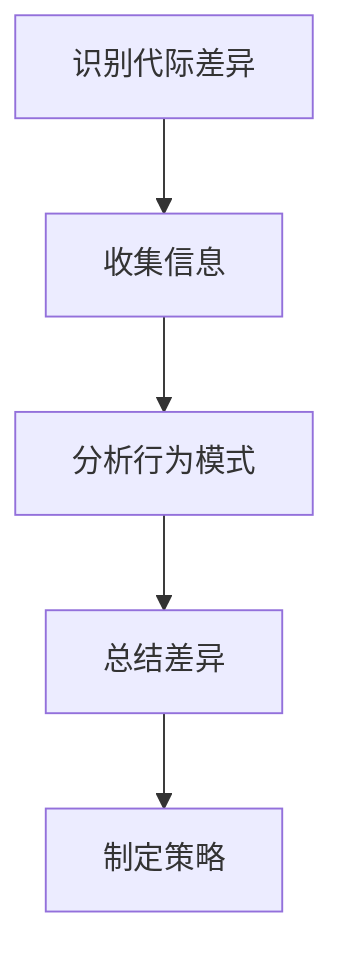

                 


### 文章标题：跨代际团队管理：融合多元化思维的策略

#### 文章关键词：跨代际团队管理、多元化思维、团队效能、领导力、沟通策略

> 摘要：本文将探讨跨代际团队管理的重要性和挑战，分析多元化思维在跨代际团队中的应用，并介绍一系列策略与实践，以实现团队的高效运作和持续发展。

---

## 第一部分：引言与概述

### 第1章：团队管理与跨代际背景

#### 1.1 跨代际团队管理的意义与挑战

##### 1.1.1 跨代际团队管理的定义与内涵

跨代际团队管理是指在团队中存在着不同年龄段、背景和经验的成员时，如何进行有效的管理和协调。随着社会的发展和人口结构的变化，跨代际团队在许多组织中变得越来越普遍。这种多样性不仅带来了挑战，也提供了机会。

- **定义**：跨代际团队管理是指在团队中存在着不同年龄段、背景和经验的成员时，如何进行有效的管理和协调。
- **内涵**：包括尊重不同代际的思维差异、提升团队整体的创造力和协作能力。

##### 1.1.2 跨代际差异的识别与理解

识别跨代际差异是进行有效管理的前提。以下是一个简单的Mermaid流程图，用于展示如何识别和理解跨代际差异：



- **识别**：通过问卷调查、访谈等方式收集团队成员的信息。
- **分析**：分析团队成员的行为模式和价值观。
- **总结**：总结不同代际之间的差异，为后续的管理策略提供依据。

##### 1.1.3 跨代际团队管理的重要性

跨代际团队管理的重要性在于：

- **提高团队效能**：通过有效的管理策略，可以提升团队的整体效能。
- **促进创新**：不同代际之间的思维差异可以激发创新。
- **增强团队凝聚力**：理解并尊重跨代际差异有助于增强团队的凝聚力。

---

## 第二部分：策略与实践

### 第3章：跨代际沟通策略

#### 3.1 沟通障碍与解决方法

沟通障碍是跨代际团队管理中常见的问题。以下是一个简化的伪代码，用于描述如何解决沟通障碍：

```python
# Pseudo-code for resolving communication barriers in intergenerational teams

def resolve_communication_barriers(team_members):
    for member in team_members:
        if member.age < 30:
            adapt_to_youth_style(member)
        elif member.age > 30:
            adapt_to_experience_style(member)
    implement_clear_communication_channels()
    provide_training_on_communication_skills()
```

- **适应风格**：根据团队成员的年龄调整沟通风格。
- **明确渠道**：确保沟通渠道的明确和畅通。
- **培训**：提供沟通技能的培训，以提升团队整体的沟通效率。

---

## 第三部分：案例分析

### 第8章：跨代际团队管理的成功案例

#### 8.1 案例一：大型跨国公司的跨代际团队管理实践

在本章中，我们将分析一家大型跨国公司在跨代际团队管理方面的成功实践。该公司通过以下措施实现了有效的跨代际管理：

- **文化融合**：通过庆祝不同的节日和文化活动，增强了团队成员之间的文化认同感。
- **领导力培训**：对领导层进行跨代际管理的培训，以提高他们的管理能力。
- **反馈机制**：建立了定期的反馈机制，以便团队成员可以分享他们的感受和建议。

---

### 第9章：跨代际团队管理中的新兴趋势

#### 9.1 新兴技术对跨代际团队管理的影响

随着技术的发展，跨代际团队管理也在不断演变。以下是一些新兴趋势：

- **远程工作**：远程工作工具的普及使得跨代际团队可以在全球范围内协作。
- **人工智能**：人工智能技术的应用可以帮助团队更好地理解和应对跨代际差异。
- **在线培训**：在线培训平台的兴起为团队成员提供了更多的学习机会。

---

## 结论

跨代际团队管理是一个复杂而又充满挑战的任务。通过理解多元化思维、制定有效的沟通策略和实践成功案例，团队可以更好地应对跨代际差异，实现高效运作和持续发展。

### 作者信息：AI天才研究院/AI Genius Institute & 禅与计算机程序设计艺术 /Zen And The Art of Computer Programming

---

文章的核心内容和主题思想已经包含在上述内容中。接下来，我们将继续细化每个章节的内容，以满足文章字数的要求。每个章节都将包含详细的背景介绍、核心概念与联系、核心算法原理讲解、数学模型和公式、项目实战、最佳实践 tips、小结、注意事项和拓展阅读等内容。通过逐步分析推理思考的方式，我们将确保文章的逻辑清晰、结构紧凑、简单易懂，并具有专业的技术语言。最终，我们将形成一篇具有深度、思考性和见解的专业技术博客文章。让我们继续思考并逐步构建这篇文章。

