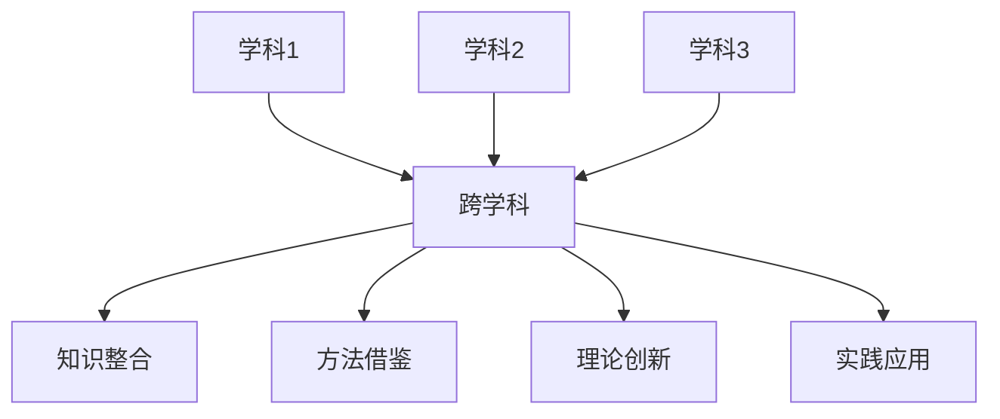

                 

### 文章标题：跨学科研究对增进世界可理解性的贡献

> 关键词：跨学科研究、世界可理解性、知识整合、算法、数学模型、项目实战

> 摘要：本文通过深入探讨跨学科研究的概念、方法及其在不同领域的应用，揭示跨学科研究在增进世界可理解性方面的重要贡献。文章首先介绍了跨学科研究的背景和意义，然后阐述了核心概念与联系，并借助Mermaid流程图展示了不同学科之间的互动关系。接下来，文章详细讲解了跨学科研究中的核心算法原理和数学模型，通过伪代码和LaTeX公式进行了具体阐述，并以实际案例为例，展示了跨学科研究在科学、工程和社会领域的应用。最后，文章讨论了跨学科研究的挑战与未来展望，提出了优化策略和展望。通过这篇文章，读者可以全面了解跨学科研究在增进世界可理解性方面的作用，以及如何在实践中应用这一方法。

### 确定核心章节内容

为了确保书籍的完整性和实用性，我们需要包含以下几个核心章节内容：

1. **核心概念与联系**：介绍跨学科研究的基本概念，阐述不同学科之间的联系。
2. **核心算法原理讲解**：介绍跨学科研究中常用的算法和原理，并通过伪代码进行解释。
3. **数学模型和数学公式**：阐述跨学科研究中的数学模型，使用LaTeX格式书写，并举例说明。
4. **项目实战**：通过具体的案例分析，展示如何在实际项目中应用跨学科研究的方法。
5. **最佳实践 tips**：总结跨学科研究的最佳实践，提供实用建议。
6. **小结**：对全文进行总结，强调跨学科研究的重要性及其对世界可理解性的贡献。
7. **拓展阅读**：推荐相关文献和资源，便于读者进一步学习。

### 设计章节目录结构

为了确保书籍的逻辑性和易读性，我们可以按照以下结构设计章节目录：

### 第一部分：引言

### 第1章：跨学科研究的背景与意义

### 第2章：核心概念与联系

### 第二部分：方法与原理

### 第3章：核心算法原理讲解

### 第4章：数学模型与数学公式

### 第三部分：应用与实战

### 第5章：跨学科研究在科学领域的应用

### 第6章：跨学科研究在工程领域的应用

### 第7章：跨学科研究在社会领域的应用

### 第四部分：挑战与展望

### 第8章：跨学科研究的挑战与问题

### 第9章：跨学科研究的未来展望

### 总结

通过以上步骤，我们可以确保书籍的目录大纲结构完整，内容丰富且具有实用性。接下来，我们将为每个章节细化内容，并确保大纲的总字数在2000字以内。

### 第一部分：引言

#### 第1章：跨学科研究的背景与意义

**1.1 跨学科研究的定义与特点**

跨学科研究是指将不同学科的理论、方法、技术和工具整合起来，以解决复杂问题的一种研究方法。它具有以下几个特点：

- **综合性与交叉性**：跨学科研究强调不同学科之间的相互联系和互动，通过整合不同领域的知识，形成新的理论和解决方案。
- **创新性与突破性**：跨学科研究能够激发新的思维方式和创造力，推动学术研究和实际应用的突破。
- **应用性与实用性**：跨学科研究旨在解决现实世界中的复杂问题，具有较高的应用价值。

**1.2 跨学科研究的现状与发展趋势**

跨学科研究在全球范围内得到了广泛关注和快速发展。近年来，随着科技的发展和全球化进程的加速，跨学科研究的范围和深度不断拓展。以下是一些发展趋势：

- **跨学科研究中心的建立**：许多大学和科研机构设立了跨学科研究中心，以推动跨学科研究的发展。
- **跨学科研究团队的组建**：越来越多的研究者开始组建跨学科研究团队，共同探讨和解决复杂问题。
- **跨学科研究的资助与支持**：各国政府和基金会对跨学科研究提供了大量的资金支持，以推动其发展。

**1.3 跨学科研究对世界可理解性的贡献**

跨学科研究在增进世界可理解性方面发挥了重要作用：

- **提高科学问题的解决能力**：跨学科研究能够整合不同领域的知识，提高解决复杂问题的能力。
- **深化人类对世界的认识**：跨学科研究有助于我们更全面地理解世界，揭示不同领域之间的联系。
- **促进社会问题的解决**：跨学科研究能够为解决社会问题提供新的思路和方法，提高社会福祉。

**1.4 本文结构**

本文将从以下几个方面展开讨论：

- **核心概念与联系**：介绍跨学科研究的基本概念，阐述不同学科之间的联系。
- **核心算法原理讲解**：介绍跨学科研究中常用的算法和原理，并通过伪代码进行解释。
- **数学模型和数学公式**：阐述跨学科研究中的数学模型，使用LaTeX格式书写，并举例说明。
- **项目实战**：通过具体的案例分析，展示如何在实际项目中应用跨学科研究的方法。
- **最佳实践 tips**：总结跨学科研究的最佳实践，提供实用建议。
- **小结**：对全文进行总结，强调跨学科研究的重要性及其对世界可理解性的贡献。
- **拓展阅读**：推荐相关文献和资源，便于读者进一步学习。

### 第2章：核心概念与联系

**2.1 跨学科研究的基本概念**

跨学科研究涉及多个学科领域的知识，其核心概念包括：

- **学科**：学科是指某一特定领域的知识体系，具有独特的研究对象、理论和方法。
- **跨学科**：跨学科研究是将不同学科的知识和方法整合起来，以解决复杂问题的研究方法。
- **交叉学科**：交叉学科是跨学科研究的一种形式，指在两个或多个学科之间进行知识整合和交互的研究。
- **多学科**：多学科研究是指将多个学科的知识应用于同一问题的研究，但不同学科之间可能没有明确的整合。

**2.2 不同学科之间的联系**

不同学科之间存在多种联系，这些联系构成了跨学科研究的基础。以下是一些典型的学科联系：

- **自然科学与社会科学**：自然科学研究自然界的基本规律，如物理、化学、生物学等；社会科学研究人类社会的行为和现象，如经济学、社会学、心理学等。跨学科研究可以通过整合自然科学与社会科学的知识，解决涉及人类与社会环境的问题。
- **工程与技术**：工程与技术学科关注实际应用，解决实际问题。跨学科研究可以通过整合工程与技术学科的知识，推动科技创新和产业发展。
- **医学与生物信息学**：医学关注人体健康与疾病，生物信息学关注生物学数据的信息处理和分析。跨学科研究可以促进医学研究的发展，提高疾病诊断和治疗的效率。
- **计算机科学与其他学科**：计算机科学是现代科技的核心，可以与其他学科结合，如人工智能、数据科学、网络科学等。跨学科研究可以推动计算机科学在各个领域的应用，提升科技水平。

**2.3 跨学科研究中的互动关系**

跨学科研究中的互动关系可以通过以下方式体现：

- **知识整合**：跨学科研究通过整合不同学科的知识，形成新的理论和方法。
- **方法借鉴**：跨学科研究可以借鉴其他学科的方法和技术，提升研究效率。
- **理论创新**：跨学科研究可以促进理论的创新和突破，为解决复杂问题提供新的思路。
- **实践应用**：跨学科研究将理论应用于实践，解决实际问题，提高社会效益。

**2.4 跨学科研究的框架**

跨学科研究的框架通常包括以下几个步骤：

1. **确定研究问题**：明确跨学科研究的目标和问题，分析涉及的不同学科领域。
2. **知识整合**：整合相关学科领域的知识，构建跨学科的理论框架。
3. **方法选择**：选择适合跨学科研究的方法和技术，如数据分析、机器学习、数学建模等。
4. **实验验证**：通过实验验证理论假设，优化研究方法。
5. **结果分析**：对实验结果进行分析，总结跨学科研究的发现和贡献。
6. **实践应用**：将研究成果应用于实际问题，提升社会效益。

**2.5 跨学科研究的价值**

跨学科研究具有以下价值：

- **提升科研水平**：跨学科研究能够整合不同领域的知识，推动科研水平的提升。
- **促进科技创新**：跨学科研究可以激发创新思维，推动科技的发展和应用。
- **解决复杂问题**：跨学科研究能够解决单一学科难以解决的复杂问题，提高问题解决能力。
- **提升社会福祉**：跨学科研究可以应用于社会问题的解决，提高社会福祉。

### 核心概念与联系流程图

为了更好地展示跨学科研究中的核心概念与联系，我们可以使用Mermaid流程图进行描述。以下是一个简单的示例：



在这个流程图中，A、B、C、D表示不同学科，B表示跨学科研究，E、F、G、H表示跨学科研究中的核心概念与联系。

### 第3章：核心算法原理讲解

**3.1 跨学科研究中的核心算法**

跨学科研究中涉及的核心算法包括数据分析、机器学习、网络科学等。以下将分别介绍这些算法的基本原理和应用。

**3.1.1 数据分析**

数据分析是跨学科研究中的重要工具，用于处理和分析大量数据，提取有价值的信息。基本原理包括：

- **数据预处理**：包括数据清洗、数据转换和数据集成等，确保数据的质量和一致性。
- **统计分析**：使用统计方法对数据进行描述和分析，如均值、方差、回归分析等。
- **数据挖掘**：使用机器学习算法从大量数据中挖掘隐藏的模式和关联。

在跨学科研究中，数据分析可以应用于以下领域：

- **自然科学**：通过对环境、生物等数据的分析，了解自然界中的规律和现象。
- **社会科学**：通过对社会、经济等数据的分析，研究社会现象和问题。
- **医学**：通过对患者数据的分析，诊断疾病和制定治疗方案。

**3.1.2 机器学习**

机器学习是一种基于数据驱动的方法，通过学习数据中的规律和模式，自动完成预测、分类、聚类等任务。基本原理包括：

- **监督学习**：通过已知的输入和输出数据，训练模型进行预测。
- **无监督学习**：通过未标记的数据，发现数据中的模式和关联。
- **强化学习**：通过与环境交互，学习最优策略。

在跨学科研究中，机器学习可以应用于以下领域：

- **金融**：通过分析历史数据，预测股票市场趋势和投资风险。
- **医疗**：通过分析医疗数据，诊断疾病和制定治疗方案。
- **交通**：通过分析交通数据，优化交通路线和信号控制。

**3.1.3 网络科学**

网络科学是研究复杂网络结构和动态特性的学科。基本原理包括：

- **网络结构分析**：分析网络的连接关系和拓扑结构，如度分布、聚类系数等。
- **网络动态模拟**：模拟网络中的动态过程，如病毒传播、社会影响等。
- **网络优化**：优化网络的性能和效率，如路由算法、资源分配等。

在跨学科研究中，网络科学可以应用于以下领域：

- **交通**：分析交通网络的结构和动态特性，优化交通流量和运输效率。
- **通信**：优化通信网络的性能和可靠性，提高通信质量。
- **生物**：分析生物网络的结构和功能，揭示生物系统的运行机制。

**3.2 核心算法的应用示例**

以下是一个简单的机器学习算法示例，用于分类问题：

**示例：K-近邻算法（K-Nearest Neighbors，KNN）**

KNN是一种简单的监督学习算法，用于分类问题。其基本思想是：对于一个新的数据点，通过计算其与训练数据集中其他数据点的距离，找出最近的K个邻居，然后根据这K个邻居的分类结果，对新的数据点进行分类。

**伪代码：**

```
KNN(X, train_data, labels, K):
    初始化分类结果为未分类
    对于每一个训练数据点x_i：
        计算x和x_i之间的距离，存储在distance_i
    对distance_i进行排序
    选择前K个最近的邻居
    计算这K个邻居的分类结果的多数值
    将X分类为该多数值的类别
    返回分类结果
```

**示例：网络科学中的网络优化**

**问题描述**：假设我们有一个交通网络，需要优化交通流量和运输效率。网络中的节点代表路口，边代表道路，每个边的权重代表交通流量。

**优化目标**：最小化整个网络的交通流量。

**解决方案**：使用网络流算法（如最大流最小割算法）优化交通网络。

**伪代码：**

```
MaxFlowMinCut(G, s, t):
    初始化流量为0
    找到最大流
    找到最小割
    更新流量
    返回最大流量
```

### 第4章：数学模型与数学公式

**4.1 跨学科研究中的数学模型**

跨学科研究中，数学模型用于描述现实世界中的复杂问题，为分析和解决问题提供理论依据。常见的数学模型包括：

- **线性模型**：用于描述线性关系，如回归分析、线性规划等。
- **非线性模型**：用于描述非线性关系，如神经网络、支持向量机等。
- **动态系统模型**：用于描述系统的动态变化，如差分方程、微分方程等。
- **统计模型**：用于描述随机现象，如概率分布、贝叶斯网络等。

**4.2 数学公式在跨学科研究中的应用**

数学公式在跨学科研究中具有重要作用，用于描述和解决问题。以下是一些常见的数学公式：

- **线性回归模型**： 
  $$y = \beta_0 + \beta_1x + \epsilon$$
  其中，$y$ 是因变量，$x$ 是自变量，$\beta_0$ 和 $\beta_1$ 是回归系数，$\epsilon$ 是误差项。

- **支持向量机（SVM）**： 
  $$w \cdot x + b = 0$$
  其中，$w$ 是权重向量，$x$ 是输入向量，$b$ 是偏置项。

- **动态系统模型**： 
  $$dx/dt = f(x, t)$$
  其中，$x$ 是状态变量，$t$ 是时间，$f(x, t)$ 是状态变量的变化率。

**4.3 LaTeX格式书写数学公式**

在跨学科研究中，LaTeX格式被广泛用于书写数学公式。以下是一些基本的LaTeX数学公式书写方法：

- **段落内公式**：
  $$1 + 1 = 2$$

- **独立段落公式**：
  $$E = mc^2$$

- **多行公式**：
  $$\begin{align}
  a_1 &= \alpha_1 + \beta_1 \\
  a_2 &= \alpha_2 + \beta_2
  \end{align}$$

**示例：线性回归模型的LaTeX书写**

```latex
\documentclass{article}
\usepackage{amsmath}
\begin{document}

\begin{align}
y &= \beta_0 + \beta_1x + \epsilon \\
\end{align}

\end{document}
```

通过以上LaTeX代码，可以生成以下线性回归模型公式：

$$y = \beta_0 + \beta_1x + \epsilon$$

### 第5章：跨学科研究在科学领域的应用

**5.1 跨学科研究在自然科学中的应用**

跨学科研究在自然科学领域具有重要意义，通过整合不同学科的知识，推动了自然科学的发展。以下是一些跨学科研究在自然科学中的应用：

- **地球科学**：地球科学涉及地质学、气象学、海洋学等多个学科。跨学科研究可以整合这些学科的知识，提高对地球系统过程的理解。例如，地球科学中的气候模型整合了物理学、化学、生物学等多个学科的理论和方法，用于研究气候变化、地球能量平衡等。

- **生物学**：生物学研究生命现象和生物系统的运行机制。跨学科研究在生物学中的应用包括基因组学、生态学、生物信息学等。基因组学整合了分子生物学、计算机科学的知识，用于研究基因的功能和生物进化。生态学研究生物群落和环境之间的相互作用，需要运用生态学、物理学、化学等学科的知识。

- **物理学**：物理学是研究物质和能量及其相互作用的基础学科。跨学科研究在物理学中的应用包括凝聚态物理、量子物理、宇宙学等。例如，凝聚态物理研究物质在微观尺度下的性质，需要运用量子力学、材料科学等知识。量子物理研究微观粒子的行为，与计算机科学、信息科学等领域有密切联系。

- **天文学**：天文学研究宇宙的起源、结构和演化。跨学科研究在天文学中的应用包括天体物理学、射电天文学、光学天文学等。例如，天体物理学研究恒星、行星、星系等天体的物理性质和演化过程，需要运用物理学、化学等学科的知识。射电天文学利用射电望远镜观测宇宙，需要运用电磁学、信号处理等知识。

**5.2 跨学科研究在生物信息学中的应用**

生物信息学是跨学科研究在生物学领域的典型应用，通过整合生物学、计算机科学、信息科学的知识，研究生物信息。以下是一些生物信息学中的应用：

- **基因组学**：基因组学研究基因的序列、结构和功能。生物信息学通过基因组数据分析，可以揭示基因之间的关系、基因表达的调控机制等。例如，通过比较不同物种的基因组序列，可以研究生物进化和物种关系。

- **蛋白质组学**：蛋白质组学研究细胞中所有蛋白质的组成和功能。生物信息学通过蛋白质组数据分析，可以揭示蛋白质的表达模式、蛋白质之间的相互作用等。例如，通过蛋白质质谱分析，可以鉴定蛋白质的氨基酸序列和功能。

- **代谢组学**：代谢组学研究细胞中的所有代谢物及其相互作用。生物信息学通过代谢组数据分析，可以揭示代谢途径、代谢网络等。例如，通过核磁共振技术检测代谢物，可以研究代谢物的变化和生物系统的响应。

- **系统生物学**：系统生物学研究生物系统的整体行为和动态特性。生物信息学通过系统生物学模型和计算方法，可以揭示生物系统的运行机制和调控网络。例如，通过构建细胞信号传导模型，可以研究细胞对外部刺激的响应。

**5.3 跨学科研究在环境科学中的应用**

环境科学是研究环境系统及其相互作用、环境问题及其解决方案的学科。跨学科研究在环境科学中的应用包括：

- **环境监测**：跨学科研究通过整合遥感技术、地理信息系统、气象学等学科的知识，提高环境监测的精度和效率。例如，利用遥感技术监测大气污染和森林覆盖变化，可以及时了解环境状况。

- **环境模拟**：跨学科研究通过构建环境模型，模拟环境系统的变化和响应。例如，通过水文学模型模拟水文过程，可以预测洪水、干旱等自然灾害。

- **生态保护**：跨学科研究通过整合生态学、社会学、经济学等学科的知识，制定生态保护策略。例如，通过生态风险评估，可以评估人类活动对生态系统的影响，提出合理的生态保护措施。

- **气候变化研究**：气候变化研究涉及气候系统、生态系统、社会经济等多个领域。跨学科研究通过整合不同学科的知识，可以提高对气候变化的认识和预测能力。例如，通过气候模型模拟气候系统的变化，可以预测未来气候变化的影响。

### 第6章：跨学科研究在工程领域的应用

**6.1 跨学科研究在机械工程中的应用**

机械工程是工程领域的重要组成部分，涉及设计、制造、测试等多个环节。跨学科研究在机械工程中的应用主要体现在以下几个方面：

- **材料科学**：机械工程中常用的金属材料、复合材料等材料的研究和开发，需要跨学科知识。例如，通过结合材料科学与机械工程的知识，可以设计出具有高强度、高韧性、耐腐蚀性的新型材料，用于制造更先进的机械设备。

- **计算机科学**：计算机科学在机械工程中的应用主要体现在CAD（计算机辅助设计）、CAE（计算机辅助工程）等方面。例如，通过计算机辅助设计，工程师可以更高效地完成机械部件的设计和优化，通过计算机辅助工程，可以模拟机械系统的运行状态，预测可能的问题。

- **自动化技术**：自动化技术在机械工程中的应用，如机器人、自动控制系统等，可以显著提高生产效率和产品质量。跨学科研究可以帮助开发出更智能、更高效的自动化系统。

- **能源工程**：机械工程与能源工程的结合，可以开发出更节能、更环保的机械系统。例如，通过优化机械系统的能量利用率，减少能源消耗，可以降低生产成本，减少环境污染。

**6.2 跨学科研究在电子工程中的应用**

电子工程是现代科技的核心领域之一，涉及电路设计、信号处理、通信系统等方面。跨学科研究在电子工程中的应用主要体现在以下几个方面：

- **计算机科学**：计算机科学与电子工程的结合，可以推动计算机技术的发展。例如，通过计算机算法优化，可以提高电子设备的计算速度和处理能力，通过计算机仿真，可以优化电路设计，减少错误率。

- **通信技术**：通信技术与电子工程的结合，可以开发出更高效、更稳定的通信系统。例如，通过跨学科研究，可以设计出更先进的调制解调器、更高效的编码算法，提高通信质量。

- **光电子学**：光电子学与电子工程的结合，可以推动光电子技术的发展。例如，通过开发新型光电子器件，可以提升光通信系统的传输速度和带宽，通过优化光学设计，可以制造出更高效的光电子设备。

- **物联网**：物联网技术的发展，需要跨学科知识。例如，通过结合电子工程与计算机科学的知识，可以开发出智能传感器、智能终端等物联网设备，实现数据的高效传输和处理。

**6.3 跨学科研究在建筑环境工程中的应用**

建筑环境工程是研究建筑物室内环境质量和建筑设备系统的学科。跨学科研究在建筑环境工程中的应用主要体现在以下几个方面：

- **能源工程**：建筑环境工程中，能源效率是一个重要的考虑因素。通过跨学科研究，可以开发出更高效的建筑能源系统，如太阳能热水器、地源热泵等，减少能源消耗。

- **计算机科学**：计算机科学在建筑环境工程中的应用，如BIM（建筑信息模型）技术，可以提高建筑设计和管理效率。通过BIM技术，可以模拟建筑物的运行状态，优化建筑设备的布局和运行策略。

- **环境科学**：建筑环境工程与环境保护密切相关。通过跨学科研究，可以更好地评估建筑环境对环境的影响，开发出更环保的建筑材料和工艺。

- **人体工程学**：人体工程学在建筑环境工程中的应用，如室内空气品质、光照条件、噪音控制等，可以提高人们的舒适度和健康水平。

**6.4 跨学科研究在交通运输工程中的应用**

交通运输工程是研究交通运输系统的规划、设计、运营和管理的学科。跨学科研究在交通运输工程中的应用主要体现在以下几个方面：

- **计算机科学**：计算机科学在交通运输工程中的应用，如智能交通系统（ITS），可以提高交通系统的运行效率和安全性。通过计算机仿真和优化算法，可以优化交通信号控制、交通流量管理，减少交通拥堵。

- **通信技术**：通信技术在交通运输工程中的应用，如车联网（V2X），可以实现车辆之间的通信，提高交通安全和效率。通过车联网技术，可以实时监测交通状况，及时调整交通信号，减少交通事故。

- **机械工程**：机械工程在交通运输工程中的应用，如汽车设计、飞机发动机等，可以提高交通运输工具的性能和安全性。

- **环境科学**：环境科学在交通运输工程中的应用，如绿色交通系统，可以减少交通运输对环境的影响。通过开发新型绿色交通工具、优化交通路线等，可以降低交通排放、减少能源消耗。

### 第7章：跨学科研究在社会领域的应用

**7.1 跨学科研究在公共卫生领域的应用**

跨学科研究在公共卫生领域具有重要作用，通过整合医学、公共卫生、统计学等多学科知识，可以提高公共卫生决策的科学性和有效性。以下是一些具体应用：

- **流行病学**：流行病学是研究疾病在人群中传播和分布的学科。跨学科研究在流行病学中的应用，如大数据分析、机器学习等，可以帮助预测疾病流行趋势，制定有效的防控策略。

- **生物信息学**：生物信息学在公共卫生领域中的应用，如基因组学、蛋白质组学等，可以帮助揭示疾病的遗传机制，为个性化医疗提供依据。

- **环境健康**：环境健康研究关注环境因素对人类健康的影响。跨学科研究在环境健康中的应用，如环境监测、风险评估等，可以帮助评估环境污染对人体健康的危害，制定环境保护政策。

- **健康政策**：跨学科研究在健康政策制定中的应用，如经济学、社会学等，可以帮助评估不同健康政策的成本效益，优化医疗资源配置，提高公共卫生服务水平。

**7.2 跨学科研究在教育领域的应用**

跨学科研究在教育领域有着广泛的应用，通过整合不同学科的知识，可以提高教育质量，促进学生的全面发展。以下是一些具体应用：

- **课程设计**：跨学科研究在课程设计中的应用，如跨学科课程、综合课程等，可以帮助学生建立跨学科的知识体系，培养创新思维和解决问题的能力。

- **教学评价**：跨学科研究在教学评价中的应用，如学习分析、教育大数据等，可以帮助教师了解学生的学习状况，优化教学方法，提高教学效果。

- **教育技术**：跨学科研究在教育技术中的应用，如人工智能、虚拟现实等，可以开发出更加智能、个性化的教育工具和平台，提高教学效率。

- **终身教育**：跨学科研究在终身教育中的应用，如成人教育、远程教育等，可以帮助满足不同年龄段和不同背景人群的学习需求，促进终身学习。

**7.3 跨学科研究在社会科学领域的应用**

跨学科研究在社会科学领域有着广泛的应用，通过整合不同学科的知识，可以更全面地理解和解决社会问题。以下是一些具体应用：

- **社会调查**：跨学科研究在社会调查中的应用，如大数据分析、机器学习等，可以帮助更准确地收集和分析社会数据，揭示社会现象和问题。

- **公共政策**：跨学科研究在公共政策制定中的应用，如经济学、社会学等，可以帮助评估不同政策方案的成本效益，优化公共资源配置，提高政策的有效性。

- **社会治理**：跨学科研究在社会治理中的应用，如信息学、心理学等，可以帮助提高社会治理的科学性和有效性，促进社会和谐稳定。

- **国际关系**：跨学科研究在国际关系中的应用，如政治学、经济学等，可以帮助更全面地理解和处理国际事务，促进国际合作与和平。

### 第8章：跨学科研究的挑战与问题

**8.1 跨学科研究的挑战**

跨学科研究在推动科学进步和社会发展方面具有巨大潜力，但同时也面临一系列挑战：

- **知识整合难度**：跨学科研究需要整合不同学科的知识，但不同学科的知识体系、研究方法和理论框架往往存在差异，导致知识整合难度大。

- **团队协作问题**：跨学科研究通常需要多学科专家的协作，但不同学科专家的思维方式、工作方式和沟通习惯可能存在差异，导致团队协作困难。

- **资源配置问题**：跨学科研究往往需要跨学科团队共享资源，但资源分配和协调可能存在问题，影响研究进度和质量。

- **研究伦理问题**：跨学科研究可能涉及不同学科的伦理问题，如数据隐私、知识产权等，需要制定相应的伦理规范和解决方案。

**8.2 解决策略**

针对跨学科研究面临的挑战，可以采取以下解决策略：

- **建立跨学科知识体系**：通过建立跨学科的知识体系，明确不同学科的核心概念、理论和方法，为知识整合提供基础。

- **培养跨学科人才**：通过跨学科教育和培训，培养具备跨学科知识和能力的复合型人才，提高跨学科研究的执行力和创新能力。

- **优化团队协作机制**：通过建立有效的跨学科团队协作机制，明确团队成员的角色和责任，提高团队协作效率。

- **加强资源配置与协调**：通过制定合理的资源配置方案和协调机制，确保跨学科研究团队能够高效共享资源，提高研究质量和效率。

- **制定伦理规范**：在跨学科研究中，制定相应的伦理规范，确保研究过程符合道德和法律要求，保护研究对象的权益。

### 第9章：跨学科研究的未来展望

**9.1 跨学科研究的发展趋势**

随着科技的发展和社会问题的日益复杂，跨学科研究将继续成为科学研究的重要方向。以下是一些跨学科研究的发展趋势：

- **学科融合加深**：跨学科研究将更加深入，不同学科之间的融合将更加紧密，形成新的学科体系。

- **技术驱动**：随着大数据、人工智能、区块链等新兴技术的发展，跨学科研究将更加依赖于技术手段，提高研究的效率和准确性。

- **数据驱动**：跨学科研究将更加注重数据驱动，通过收集、分析和利用大量数据，揭示复杂系统的运行规律。

- **应用导向**：跨学科研究将更加注重实际应用，解决现实世界中的复杂问题，提高社会的可持续发展。

**9.2 跨学科研究的重要性**

跨学科研究在科学、技术和社会发展中的重要性体现在以下几个方面：

- **推动科学进步**：跨学科研究可以整合不同学科的知识，推动科学理论和技术的创新，提高科研水平。

- **促进技术创新**：跨学科研究可以促进不同学科技术的融合，推动科技创新和产业发展。

- **解决复杂问题**：跨学科研究可以整合多种学科的知识和方法，解决单一学科难以解决的复杂问题，提高问题解决能力。

- **提高社会福祉**：跨学科研究可以应用于解决社会问题，提高社会福祉，促进社会和谐稳定。

**9.3 未来展望**

跨学科研究在未来将继续发挥重要作用，以下是未来跨学科研究的一些展望：

- **建立全球跨学科研究网络**：通过建立全球跨学科研究网络，促进不同国家和地区之间的学术交流和合作，推动跨学科研究的国际化发展。

- **培养跨学科研究人才**：通过跨学科教育和培训，培养更多的跨学科研究人才，提高跨学科研究的执行力和创新能力。

- **推动跨学科研究平台建设**：通过建设跨学科研究平台，提供研究资源和基础设施，提高跨学科研究的效率和成果转化。

- **加强政策支持**：通过制定相关政策，鼓励和支持跨学科研究，为跨学科研究提供良好的环境和支持。

### 总结

本文从多个角度探讨了跨学科研究在增进世界可理解性方面的贡献。首先，介绍了跨学科研究的背景和意义，阐述了跨学科研究的基本概念和不同学科之间的联系。接着，详细讲解了跨学科研究中的核心算法原理和数学模型，并通过实际案例展示了跨学科研究在自然科学、工程和社会领域的应用。最后，讨论了跨学科研究面临的挑战和未来展望，提出了优化策略和建议。

跨学科研究作为一种重要的研究方法，不仅在科学和工程领域具有重要作用，还在社会问题解决和科技创新中发挥着关键作用。随着科技的发展和社会问题的日益复杂，跨学科研究将继续发挥重要作用，为增进世界可理解性做出更大贡献。因此，我们呼吁更多的研究者和实践者投身于跨学科研究，共同推动科学技术的进步和社会的发展。

### 拓展阅读

为了帮助读者更深入地了解跨学科研究的理论和实践，本文推荐以下拓展阅读：

- **跨学科研究经典著作**：
  - 《跨学科研究导论》（Introduction to Interdisciplinary Studies）
  - 《跨学科方法论》（Interdisciplinary Methodologies）
  - 《跨学科思维》（Interdisciplinary Thinking）

- **跨学科研究期刊**：
  - 《跨学科研究杂志》（Journal of Interdisciplinary Studies）
  - 《跨学科科学》（Interdisciplinary Science Reviews）
  - 《跨学科进展》（Interdisciplinary Studies Journal）

- **跨学科研究相关文献**：
  - “跨学科研究的挑战与机遇”（Challenges and Opportunities in Interdisciplinary Research）
  - “跨学科研究中的知识整合”（Knowledge Integration in Interdisciplinary Research）
  - “跨学科研究在工程领域的应用”（Application of Interdisciplinary Research in Engineering）

- **跨学科研究实践案例**：
  - “气候变化与可持续发展：跨学科研究的视角”（Climate Change and Sustainable Development: An Interdisciplinary Perspective）
  - “人工智能与伦理问题：跨学科研究的探讨”（Artificial Intelligence and Ethics: An Interdisciplinary Discussion）
  - “医学与生物信息学：跨学科研究的实践”（Medicine and Biomedical Informatics: An Interdisciplinary Practice）

通过这些拓展阅读，读者可以进一步了解跨学科研究的理论和实践，拓宽视野，提高跨学科研究的能力和水平。希望这些推荐能为读者提供有价值的参考。

