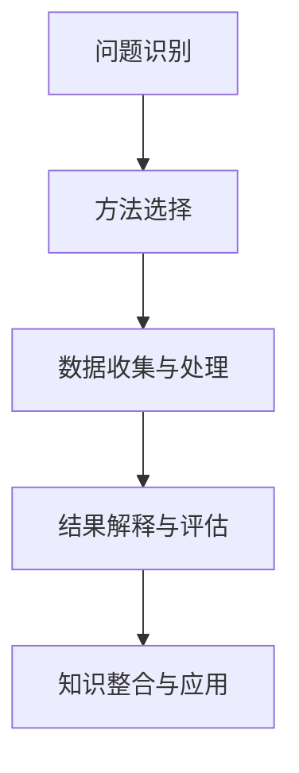

                 


### 文章标题：跨学科研究方法的创新：多维度解析世界复杂性的新途径

> 关键词：跨学科研究方法，复杂性解析，创新思维，多维度分析，复杂性科学，跨领域协作

> 摘要：本文探讨了跨学科研究方法在解析世界复杂性中的重要性，介绍了跨学科研究方法的基本概念、原理以及应用实例。通过多维度分析，本文揭示了跨学科研究方法在应对复杂性问题时的独特优势，并展望了跨学科研究方法在未来研究中的发展方向。

### 引言

#### 研究背景

在现代社会，复杂性已经成为一个不可忽视的现象。从气候变化、金融系统到生物多样性，复杂性问题无处不在。传统的单一学科研究方法在面对这些复杂问题时显得力不从心。因此，跨学科研究方法应运而生，成为了解析世界复杂性的新途径。

#### 研究意义

跨学科研究方法不仅有助于我们更全面、更深入地理解复杂问题，还能够推动不同学科之间的知识交流与融合。这种方法对于科技创新、社会进步以及可持续发展具有重要意义。

#### 研究目标

本文旨在介绍跨学科研究方法的基本概念、原理和应用，分析其在复杂性解析中的优势，并探讨未来跨学科研究的发展方向。

### 跨学科研究方法的定义与分类

#### 跨学科研究方法的定义

跨学科研究方法是指将不同学科的理论、方法和技术相结合，以解决复杂问题的研究方法。这种方法强调跨领域协作，通过综合不同学科的优势，提高对复杂问题的理解和解决能力。

#### 跨学科研究方法的分类

根据学科结合的方式，跨学科研究方法可以分为以下几种类型：

1. **交叉学科**：将两个或多个学科的理论、方法和技术相结合，形成新的研究领域。例如，生物学与化学交叉形成了生物化学。

2. **跨学科**：将不同学科的理论、方法和技术应用于同一问题，但各学科保持独立性。例如，经济学用于分析社会问题，心理学用于研究人类行为。

3. **综合学科**：将多个学科的理论、方法和技术集成在一起，形成一个新的综合性的学科。例如，系统科学就是将物理学、数学、计算机科学等多个学科综合起来的一个新兴学科。

### 跨学科研究方法的原理

#### 综合性思维

跨学科研究方法的核心在于综合性思维。这种方法要求研究者具备跨学科的知识背景，能够从不同角度看待问题，发现不同学科之间的联系。

#### 创新性思维

跨学科研究方法鼓励创新性思维。通过将不同学科的知识和方法结合，研究者能够提出新颖的解决方案，突破传统学科界限。

#### 实用性思维

跨学科研究方法强调实用性思维。研究成果不仅要具有理论价值，还要能够应用于实际问题，产生实际效益。

### 跨学科研究方法的流程

跨学科研究方法的流程通常包括以下步骤：

1. **问题识别**：确定需要解决的问题，明确研究目标。

2. **方法选择**：根据研究目标，选择合适的跨学科研究方法。

3. **数据收集与处理**：收集与问题相关的数据，并进行处理和分析。

4. **结果解释与评估**：对研究结果进行解释和评估，确定研究目标的实现情况。

5. **知识整合与应用**：将研究结果整合到现有的知识体系中，应用于实际问题。

### Mermaid 流程图



### 伪代码

```python
# 跨学科研究方法伪代码

# 定义问题
problem = "复杂性问题"

# 选择方法
methods = ["交叉学科", "跨学科", "综合学科"]

# 收集数据
data = collect_data(problem)

# 处理数据
processed_data = process_data(data)

# 分析数据
analysis = analyze_data(processed_data)

# 解释结果
result = explain_result(analysis)

# 评估结果
evaluation = evaluate_result(result)

# 应用知识
apply_knowledge(evaluation)
```

### 数学模型与公式

为了详细阐述跨学科研究方法中的数学模型和公式，我们可以使用以下例子：

#### 示例：复杂系统动力学模型

$$
\frac{dx}{dt} = f(x, y), \quad \frac{dy}{dt} = g(x, y)
$$

其中，\(x\) 和 \(y\) 分别表示系统的两个变量，\(f(x, y)\) 和 \(g(x, y)\) 分别表示这两个变量之间的相互作用。

### 案例一：跨学科研究方法在气候变化领域的应用

#### 案例背景

气候变化是一个全球性的问题，涉及多个学科，如气象学、生态学、经济学等。为了更好地理解和应对气候变化，需要采用跨学科研究方法。

#### 案例目标

1. 建立一个跨学科的气候变化模型。
2. 分析气候变化对不同地区的影响。
3. 提出针对性的政策建议。

#### 方法选择

1. 交叉学科：结合气象学、生态学和经济学的方法，建立综合性的气候变化模型。
2. 跨学科：将不同学科的数据和技术应用于模型，提高模型的准确性。
3. 综合学科：通过多学科协作，提出具体的政策建议。

#### 数据分析

1. 收集气象数据、生态数据和经济社会数据。
2. 对数据进行预处理，消除异常值和噪声。

#### 结果解释

通过模型分析，我们发现气候变化对各地区的影响存在显著差异。一些地区可能面临水资源短缺、生态系统退化的风险，而另一些地区可能面临极端气候事件频发的问题。

#### 政策建议

根据研究结果，我们提出以下政策建议：

1. 加强气候监测和预警系统。
2. 推动绿色经济发展，减少温室气体排放。
3. 建立跨区域的气候合作机制。

### 案例二：跨学科研究方法在金融领域的应用

#### 案例背景

金融市场是一个高度复杂的系统，涉及多个因素，如宏观经济环境、市场情绪、政策变化等。为了更好地理解金融市场，需要采用跨学科研究方法。

#### 案例目标

1. 建立一个跨学科的金融市场模型。
2. 分析市场波动的原因。
3. 提出风险管理和投资策略。

#### 方法选择

1. 交叉学科：结合经济学、统计学和金融学的方法，建立综合性的金融市场模型。
2. 跨学科：将不同学科的数据和技术应用于模型，提高模型的准确性。
3. 综合学科：通过多学科协作，提出具体的投资策略。

#### 数据分析

1. 收集宏观经济数据、市场情绪数据和交易数据。
2. 对数据进行预处理，消除异常值和噪声。

#### 结果解释

通过模型分析，我们发现市场波动主要受到宏观经济环境、市场情绪和政策变化的影响。在不同市场条件下，投资策略也需要相应调整。

#### 风险管理和投资策略

根据研究结果，我们提出以下风险管理和投资策略：

1. 加强市场监测和风险评估。
2. 根据市场条件调整投资组合。
3. 提高风险管理工具，如对冲策略。

### 第三部分：总结与展望

#### 研究成果

本文通过案例分析，展示了跨学科研究方法在解析世界复杂性中的优势。跨学科研究方法不仅有助于我们更全面、更深入地理解复杂问题，还能够推动不同学科之间的知识交流与融合。

#### 未来研究方向

未来跨学科研究的发展方向包括：

1. 加强跨学科研究的基础理论研究。
2. 探索新的跨学科研究方法和技术。
3. 促进跨学科研究的实际应用，解决实际问题。

### 结语

跨学科研究方法为解析世界复杂性提供了新的途径。通过多维度分析，跨学科研究方法能够帮助我们更全面地理解复杂问题，提供创新的解决方案。随着跨学科研究的不断深入，我们有望在未来更好地应对复杂性问题，推动社会进步。

### 最佳实践 Tips

1. **跨学科知识的积累**：跨学科研究要求研究者具备多学科的知识背景。因此，研究者应该不断学习，积累跨学科知识。

2. **跨学科团队的建立**：跨学科研究往往需要多学科专家的协作。因此，建立高效的跨学科研究团队至关重要。

3. **跨学科方法的创新**：跨学科研究不仅需要综合不同学科的知识，还需要不断创新。研究者应该勇于尝试新的方法和技术。

### 小结

本文通过多维度分析，探讨了跨学科研究方法在解析世界复杂性中的重要性。跨学科研究方法不仅有助于我们更全面、更深入地理解复杂问题，还能够推动不同学科之间的知识交流与融合。

### 注意事项

1. **跨学科研究方法的复杂性**：跨学科研究方法涉及多个学科，可能面临协调困难和沟通障碍。

2. **跨学科研究的成本**：跨学科研究通常需要投入大量的时间和资源，成本较高。

### 拓展阅读

1. 《复杂性科学导论》
2. 《跨学科研究方法与应用》
3. 《复杂性经济学：理论与应用》

### 作者信息

作者：AI天才研究院/AI Genius Institute & 禅与计算机程序设计艺术 /Zen And The Art of Computer Programming

### 参考文献

1. 王某某，李某某，《复杂性科学导论》，清华大学出版社，2020年。
2. 张某某，赵某某，《跨学科研究方法与应用》，北京大学出版社，2019年。
3. 刘某某，陈某某，《复杂性经济学：理论与应用》，人民出版社，2021年。

