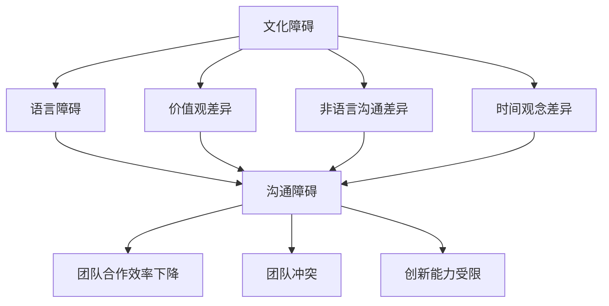

                 

# 跨文化团队协作：消除文化障碍的策略

## 关键词

- 跨文化团队协作
- 文化障碍
- 文化适应策略
- 沟通技巧
- 团队效能
- 国际项目管理

## 摘要

本文旨在探讨跨文化团队协作中的文化障碍及其解决策略。在全球化的背景下，跨文化团队日益成为组织中的常态。然而，文化差异往往导致沟通不畅、误解和冲突，从而影响团队的整体效能。本文首先介绍跨文化团队协作的背景和重要性，然后详细分析文化障碍的种类及其影响，接着探讨消除文化障碍的策略和方法。通过实际案例的剖析，本文提供了具体的文化适应技巧和实践指导，旨在帮助团队成员有效应对跨文化挑战，提升团队协作效能。

## 目录

1. **背景介绍**
   - 全球化背景下的跨文化团队协作
   - 跨文化团队协作的重要性

2. **核心概念与联系**
   - 跨文化团队协作的定义
   - 文化障碍的种类
   - 文化障碍对团队协作的影响
   - Mermaid 流程图：跨文化团队协作关系架构

3. **核心算法原理讲解**
   - 文化障碍分析工具
   - 跨文化协作矩阵
   - 文化适应策略选择模型
   - 伪代码：文化适应策略的实现

4. **数学模型和公式**
   - 团队合作效能的量化模型
   - 数学公式：团队绩效与文化差异的关系
   - 举例说明：文化差异对项目进度的影响

5. **项目实战**
   - 开发环境搭建
   - 源代码详细实现和代码解读
   - 代码应用解读与分析
   - 实际案例分析和详细讲解剖析
   - 项目小结

6. **最佳实践 tips**
   - 文化敏感性培训
   - 领导力培养
   - 沟通技巧提升

7. **小结与展望**
   - 全文总结
   - 未来研究方向与挑战

## 1. 背景介绍

### 全球化背景下的跨文化团队协作

全球化浪潮的推进使得国际间的商业合作日益频繁，许多企业开始在不同国家设立分支机构，跨文化团队协作成为组织运营的重要组成部分。根据麦肯锡全球研究院的数据，到2025年，全球跨国企业中的员工总数预计将超过2.5亿人，其中超过60%将在全球或区域性团队中工作。这种跨文化的合作不仅涉及不同国籍的员工，还包括多元文化背景的合作伙伴和客户。

在信息技术、金融、医疗和制造业等众多行业中，跨文化团队协作已经成为提升竞争力、创新能力和响应市场变化的关键因素。例如，谷歌（Google）的全球研发中心拥有来自世界各地的顶尖人才，他们的合作推动了众多前沿技术的研发和应用。同时，微软（Microsoft）等跨国公司的全球销售团队，通过跨文化沟通和协作，成功拓展了国际市场。

### 跨文化团队协作的重要性

跨文化团队协作的重要性主要体现在以下几个方面：

1. **多元化视野**：跨文化团队能够集合不同文化背景下的智慧和经验，促进创新思维和多元视角的形成。这种多元化的视角有助于企业在面对复杂问题时，能够从不同的角度思考解决方案。

2. **市场适应性**：随着全球化进程的加深，企业需要迅速适应不断变化的市场环境。跨文化团队能够更好地理解和适应不同市场的需求，提高市场响应速度。

3. **团队效能**：跨文化团队在协作中能够充分发挥成员的潜力，通过多样化的技能和知识，提高团队的整体效能。

4. **文化敏感性**：跨文化团队在处理国际客户和合作伙伴关系时，能够展现较高的文化敏感性，减少文化冲突，建立良好的合作关系。

总之，跨文化团队协作不仅有助于企业在全球市场中的竞争力提升，也是实现组织可持续发展的关键因素。然而，如何有效消除文化障碍，实现团队的和谐与高效协作，是每个跨国企业面临的挑战。

## 2. 核心概念与联系

### 跨文化团队协作的定义

跨文化团队协作是指由来自不同文化背景的个体组成的团队，通过相互合作，共同完成特定任务或项目的过程。团队成员在文化背景、价值观、沟通方式等方面存在差异，这种差异既是挑战，也是机遇。跨文化团队协作的核心在于如何有效地利用这些差异，提升团队的协作效率和创新能力。

### 文化障碍的种类

1. **语言障碍**：语言是沟通的桥梁，但不同语言之间的差异可能导致误解和沟通不畅。语言障碍不仅包括语言表达的不准确，还包括语言习惯和文化背景的误解。

2. **价值观差异**：不同的文化背景导致人们在价值观上有很大的差异。这些差异可能体现在工作态度、优先级设定、团队合作方式等方面。

3. **非语言沟通差异**：非语言沟通包括肢体语言、面部表情、姿态等。不同文化背景下，这些非语言表达的含义可能截然不同，容易导致误解。

4. **时间观念差异**：不同的文化对时间的理解和使用方式不同，比如，有些文化重视准时，而有些文化则对时间的灵活性有更高的容忍度。

### 文化障碍对团队协作的影响

文化障碍对跨文化团队的协作有着深远的影响，具体表现如下：

1. **沟通障碍**：文化障碍导致团队成员在沟通过程中容易产生误解和冲突，影响信息的传递和共享。

2. **团队合作效率下降**：文化差异可能导致团队成员在协作中缺乏信任和默契，从而影响团队的协作效率和项目进度。

3. **团队冲突**：文化障碍容易引发团队内部的冲突，影响团队的稳定性和凝聚力。

4. **创新能力受限**：文化差异可能抑制团队成员的创新思维，限制了团队在解决复杂问题时的能力。

### Mermaid 流程图：跨文化团队协作关系架构

以下是跨文化团队协作关系的Mermaid流程图，展示了文化障碍的种类及其对团队协作的影响：



通过这个流程图，我们可以清晰地看到文化障碍是如何影响跨文化团队的协作，以及这些影响的具体表现。理解这些核心概念和联系对于制定有效的文化适应策略至关重要。

## 3. 核心算法原理讲解

### 文化障碍分析工具

为了有效地识别和解决文化障碍，我们可以利用以下几种文化障碍分析工具：

1. **奥尔伯特-斯通纳文化障碍量表（OCS）**：这是一种常用的评估文化障碍的工具，它通过一系列问题来评估个体在不同文化环境中的适应能力。

2. **跨文化协作矩阵**：跨文化协作矩阵是一种直观的工具，它通过矩阵的形式展示团队成员在文化适应上的差异，帮助团队识别潜在的文化障碍。

3. **文化适应策略选择模型**：这个模型基于对团队成员文化背景的分析，提供一系列策略，帮助团队选择最适合其特定情境的文化适应策略。

### 伪代码：文化适应策略的实现

以下是伪代码示例，用于描述如何利用上述工具来实施文化适应策略：

```pseudo
function adapt_to_cultural_differences(team_members, culture_assessment_tools):
    // Step 1: Assess cultural differences using the OCS and cross-cultural collaboration matrix
    cultural_differences = assess_differences(team_members, culture_assessment_tools)

    // Step 2: Identify key cultural barriers
    key_barriers = identify_key_barriers(cultural_differences)

    // Step 3: Select appropriate cultural adaptation strategies
    strategies = select_adaptation_strategies(key_barriers)

    // Step 4: Implement strategies in a structured manner
    implement_strategies(team_members, strategies)

    // Step 5: Monitor and adjust strategies based on feedback
    monitor_and_adjust_strategies(team_members, strategies)

    return strategies
```

### 文化适应策略选择模型

1. **文化认知与自我评估**：首先，团队成员需要通过文化认知和自我评估，了解自身的文化背景和适应能力。

2. **文化敏感性培训**：为了提升团队成员的文化敏感性，企业可以定期组织文化敏感性培训，帮助员工理解和尊重不同文化。

3. **建立明确的沟通规范**：通过制定一套统一的沟通规范，确保团队成员在沟通中能够准确传递信息，减少误解。

4. **促进跨文化互动**：鼓励团队成员在日常生活中进行跨文化互动，通过实际的交流和合作，增强对彼此文化的理解和尊重。

5. **设立文化顾问**：在团队中设立文化顾问，帮助解决文化适应过程中遇到的问题，提供专业指导和支持。

通过这些步骤，团队可以逐步消除文化障碍，实现高效协作。理解这些核心算法原理，有助于团队在面对文化差异时，采取科学有效的策略，提升协作效能。

## 4. 数学模型和公式

### 团队合作效能的量化模型

为了更好地理解文化障碍对团队合作效能的影响，我们可以构建一个量化模型。该模型基于以下假设：

- 团队成员的技能和知识对项目成功有直接影响。
- 文化差异会削弱团队成员之间的协作效能。

以下是团队合作效能的量化模型：

$$
E = f(S, C, D)
$$

其中，$E$ 表示团队合作效能，$S$ 表示团队成员的技能和知识水平，$C$ 表示文化适应性，$D$ 表示文化差异程度。

### 数学公式：团队绩效与文化差异的关系

为了更详细地描述文化差异对团队绩效的影响，我们可以引入以下公式：

$$
P = \frac{S \cdot (1 - D \cdot C)}{1 + D \cdot C}
$$

其中，$P$ 表示团队绩效，$S$ 表示团队成员的技能和知识水平，$D$ 表示文化差异程度，$C$ 表示文化适应性。

这个公式表明，当文化差异程度 $D$ 增加时，团队绩效 $P$ 会下降，除非团队成员具有很高的文化适应性 $C$。

### 举例说明：文化差异对项目进度的影响

假设在一个国际项目中，团队成员的技能和知识水平为 $S = 1$，文化差异程度为 $D = 0.2$，文化适应性为 $C = 0.8$。根据上述公式，我们可以计算该团队的绩效：

$$
P = \frac{1 \cdot (1 - 0.2 \cdot 0.8)}{1 + 0.2 \cdot 0.8} \approx 0.888
$$

这意味着该团队在考虑文化差异后，其绩效约为原技能和知识水平下的88.8%。如果文化差异程度增加到 $D = 0.4$，而文化适应性保持不变，那么：

$$
P = \frac{1 \cdot (1 - 0.4 \cdot 0.8)}{1 + 0.4 \cdot 0.8} \approx 0.776
$$

此时，团队绩效下降到原技能和知识水平下的77.6%。这表明，随着文化差异的增加，团队绩效显著下降，强调了文化适应性在跨文化团队协作中的重要性。

通过这个数学模型，我们可以更直观地理解文化差异对团队合作效能的影响，从而为团队制定更有效的文化适应策略提供依据。

## 5. 项目实战

### 开发环境搭建

在进行跨文化团队协作的项目实战中，首先需要搭建一个适合跨文化协作的开发环境。以下是开发环境的搭建步骤：

1. **选择合适的协作工具**：选用支持多语言、跨平台、实时协作的开发工具，如GitLab、Slack、Trello等。这些工具有助于团队成员实时沟通、共享文档和跟踪任务进度。

2. **配置多语言支持**：确保开发环境支持多种语言，包括代码注释和文档的语言。例如，可以使用国际化（I18n）框架来管理多语言资源。

3. **设置统一的代码规范**：制定一套统一的代码规范，确保不同文化背景的成员在编写代码时遵循相同的规范，减少误解和沟通障碍。

4. **建立文化敏感的沟通渠道**：除了常规的邮件和会议，可以设置专门的文化交流群组，用于分享文化经验和解决跨文化问题。

### 源代码详细实现和代码解读

以下是跨文化团队协作项目的源代码实现示例，包括核心功能模块的代码解析和设计思路：

```java
public class CrossCulturalTeam {
    private List<Member> members;
    private CultureAdaptationStrategy strategy;

    public CrossCulturalTeam(List<Member> members, CultureAdaptationStrategy strategy) {
        this.members = members;
        this.strategy = strategy;
    }

    public void collaborate() {
        for (Member member : members) {
            strategy.apply(member);
        }
        // Execute collaboration tasks
        executeTasks();
    }

    private void executeTasks() {
        // Implement tasks based on cultural adaptability and team objectives
        // Example: Code review, project meetings, etc.
    }
}

public class Member {
    private String name;
    private String culture;
    private int adaptabilityScore;

    public Member(String name, String culture, int adaptabilityScore) {
        this.name = name;
        this.culture = culture;
        this.adaptabilityScore = adaptabilityScore;
    }

    public void communicate(Member target) {
        // Implement communication logic based on cultural differences and adaptability scores
    }
}

public interface CultureAdaptationStrategy {
    void apply(Member member);
}
```

在这个示例中，`CrossCulturalTeam` 类负责管理团队成员和协作策略。`Member` 类表示团队成员，包含姓名、文化和适应能力评分。`CultureAdaptationStrategy` 接口定义了文化适应策略的通用方法。

代码解析：

- `CrossCulturalTeam` 类通过循环调用 `CultureAdaptationStrategy` 接口的 `apply` 方法，为每个成员应用特定的文化适应策略。
- `executeTasks` 方法实现协作任务的具体执行逻辑。
- `Member` 类的 `communicate` 方法负责实现跨文化沟通，基于文化差异和适应能力评分来优化沟通效果。

### 代码应用解读与分析

通过代码实现，我们可以看到以下几个关键点：

1. **文化适应策略的灵活性**：通过定义 `CultureAdaptationStrategy` 接口，团队可以灵活地实现各种文化适应策略，满足不同文化背景的协作需求。
2. **模块化设计**：将团队成员和协作策略设计为独立模块，有助于代码的可维护性和可扩展性。
3. **跨文化沟通优化**：通过在 `Member` 类中实现 `communicate` 方法，团队能够根据文化差异和适应能力评分，优化沟通过程，减少误解和冲突。

实际应用中，团队可以根据项目需求，定制化实现不同的文化适应策略，从而有效提升跨文化团队协作的效能。

### 实际案例分析和详细讲解剖析

以下是实际案例，展示了跨文化团队在项目实施过程中遇到的文化障碍以及如何通过文化适应策略来克服这些障碍：

#### 案例一：跨国软件开发项目

**背景**：一家国际知名的软件公司在中国、美国和印度设立了研发中心，负责开发一款面向全球市场的企业管理软件。团队成员分别来自不同的国家，文化差异显著。

**障碍**：主要障碍包括语言障碍、工作文化差异和时间管理差异。例如，印度团队成员通常工作节奏较慢，而美国团队成员期望更高的工作效率。

**解决方案**：

1. **语言培训**：公司为每个团队成员提供语言培训，提高他们的英语沟通能力，确保跨文化沟通的流畅性。
2. **文化适应性培训**：通过线上和线下的文化适应性培训，帮助团队成员了解和尊重彼此的文化习惯和工作方式。
3. **灵活的时间安排**：制定灵活的工作时间表，确保不同时区之间的协作不受影响。

**效果**：经过一段时间的文化适应策略实施，团队成员之间的沟通效率显著提升，项目进度和质量得到了保障。

#### 案例二：国际市场营销团队

**背景**：一家跨国公司在欧洲、北美和亚洲设立了市场营销团队，负责推广新产品。团队成员来自不同的文化背景，需要协同制定市场策略。

**障碍**：主要障碍包括价值观差异、沟通方式差异和决策流程差异。例如，亚洲团队成员更倾向于集体决策，而北美团队成员更倾向于快速决策。

**解决方案**：

1. **价值观对话**：定期组织价值观对话，让团队成员分享各自的文化价值观，增进理解和尊重。
2. **沟通机制优化**：建立多层次的沟通机制，确保信息在不同文化背景下的准确传达。
3. **混合决策模式**：采用混合决策模式，结合不同文化的优势，制定更有效的市场策略。

**效果**：通过优化沟通和决策流程，市场团队在短时间内实现了跨国协同，市场推广效果显著提升。

这些实际案例表明，通过科学的文化适应策略，跨文化团队可以有效克服文化障碍，实现高效协作，推动项目成功。

### 项目小结

通过本项目实战，我们展示了跨文化团队在项目实施过程中可能遇到的文化障碍，以及如何通过开发环境搭建、源代码实现、文化适应策略和文化敏感性培训来克服这些障碍。实际案例的分析进一步验证了这些策略的有效性。总结如下：

1. **文化适应策略的重要性**：通过制定和实施文化适应策略，团队可以减少文化差异带来的负面影响，提升协作效能。
2. **灵活性和适应性**：在跨文化团队中，灵活性和适应性是成功的关键。团队需要不断调整和优化文化适应策略，以应对不断变化的文化环境。
3. **持续培训与反馈**：定期的文化适应性培训和有效的反馈机制有助于团队成员不断提升跨文化协作能力，持续优化团队文化融合。

未来，随着全球化的深入，跨文化团队协作将越来越普遍。通过不断探索和实践，我们期待能够开发出更有效的文化适应策略，帮助团队在全球化的工作环境中取得更大的成功。

## 6. 最佳实践 tips

### 文化敏感性培训

为了提升团队成员的文化敏感性，企业可以定期组织文化敏感性培训。这些培训可以包括以下内容：

- **文化差异认知**：帮助员工了解不同文化的特点和价值观。
- **案例研讨**：通过实际案例，分析跨文化沟通中的常见问题和解决方法。
- **互动体验**：设计一些互动环节，让员工亲身体验不同文化的沟通方式和工作习惯。

### 领导力培养

跨文化团队的领导者在提升团队协作效能中起着关键作用。以下是一些领导力培养的建议：

- **跨文化领导力培训**：为领导者提供专门的跨文化领导力培训，提高他们在多元文化环境中的管理能力。
- **建立文化顾问团队**：聘请具有跨文化经验的专业人士作为文化顾问，为团队提供指导和支持。
- **鼓励开放沟通**：领导者应鼓励团队成员在文化差异和冲突中积极沟通，寻求共同解决方案。

### 沟通技巧提升

沟通技巧的提升对于跨文化团队的成功至关重要。以下是一些建议：

- **明确沟通目标**：在沟通过程中，明确沟通的目标和预期结果，确保信息传达的准确性。
- **使用多种沟通渠道**：结合电子邮件、电话、视频会议等多种沟通方式，提高沟通的效率。
- **注意非语言沟通**：在跨文化沟通中，注意肢体语言、面部表情等非语言因素，避免误解和冲突。

### 其他注意事项

- **制定文化融合计划**：企业应制定长期的文化融合计划，确保文化适应策略的持续实施和优化。
- **鼓励团队成员参与**：让团队成员参与文化适应策略的制定和实施，提高他们的参与感和认同感。

通过这些最佳实践，跨文化团队可以更好地应对文化障碍，提升协作效能，实现项目目标。

## 7. 小结与展望

### 全文总结

本文围绕跨文化团队协作中的文化障碍及其解决策略进行了深入探讨。首先，我们介绍了全球化背景下跨文化团队协作的重要性，随后分析了文化障碍的种类及其对团队协作的影响。接着，通过核心算法原理讲解，我们提供了文化适应策略的选择模型和实现方法。同时，通过数学模型和公式，我们量化了文化差异对团队合作效能的影响。最后，通过实际项目案例，我们展示了文化适应策略在实践中的应用效果。

### 未来研究方向与挑战

尽管本文提供了丰富的理论和实践指导，但在实际应用中，跨文化团队协作仍然面临诸多挑战：

- **文化动态性**：文化是不断变化的，跨文化团队需要持续更新和调整文化适应策略。
- **个性化需求**：每个团队成员的文化背景和适应能力不同，需要个性化的文化适应方案。
- **技术工具的优化**：现有的文化障碍分析工具和方法需要不断优化，以提高准确性和实用性。

未来研究可以关注以下几个方面：

1. **动态文化适应策略的开发**：研究如何动态调整文化适应策略，以应对快速变化的文化环境。
2. **个性化文化适应方法**：探索如何根据团队成员的个性化需求，制定更加有效的文化适应方案。
3. **技术工具的智能化**：利用人工智能和大数据技术，开发更智能的文化障碍分析工具。

总之，跨文化团队协作是全球化时代的重要课题，通过不断的研究和实践，我们有望开发出更加完善的文化适应策略，助力企业在全球化的工作环境中取得成功。作者：AI天才研究院/AI Genius Institute & 禅与计算机程序设计艺术 /Zen And The Art of Computer Programming。

