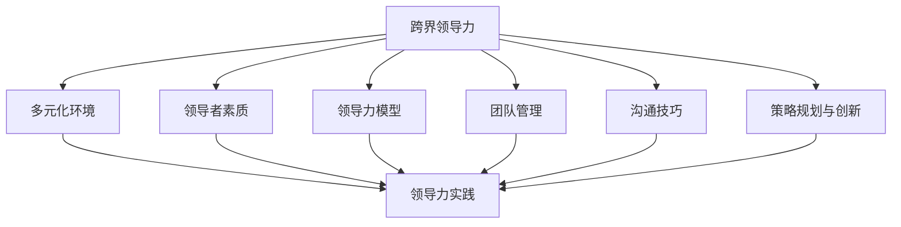

                 

为了确保文章的结构清晰、内容详实，我们将按照以下步骤逐步构建《跨界领导力：在多元化环境中脱颖而出》的技术博客。

### 步骤1：确定文章的核心概念与联系

首先，我们需要明确文章的核心概念和它们之间的联系。以下是文章的核心概念及其关系：

- 跨界领导力
- 多元化环境
- 领导者素质
- 领导力模型
- 团队管理
- 沟通技巧
- 策略规划与创新
- 跨界领导力的实践

为了更好地展示这些概念之间的关系，我们可以绘制一个Mermaid流程图：

### 步骤2：构建文章的框架结构

根据上述核心概念，我们可以构建文章的框架结构：

#### 引言
- 文章背景
- 目标受众
- 文章结构概述

#### 第一部分：跨界领导力的定义与重要性
- 跨界领导力的定义
- 跨界领导力的背景
- 跨界领导力的价值

#### 第二部分：多元化的组织与环境
- 多元化的定义与类型
- 多元化环境下的挑战与优势
- 多元化对组织的影响
- 多元化组织的策略

#### 第三部分：跨界领导者的素质
- 跨界领导者的特质
- 跨界领导者的能力发展
- 跨界领导者的角色转变
- 跨界领导者的自我管理

#### 第四部分：领导力模型与跨界实践
- 跨界领导力模型
- 经典领导力模型在跨界环境中的应用
- 跨界领导实践案例
- 跨界领导力的发展趋势

#### 第五部分：团队管理与协作
- 多元化团队管理
- 协作与沟通技巧
- 搭建高效协作平台

#### 第六部分：策略规划与创新
- 跨界策略规划
- 创新思维与方法
- 跨界战略的重要性

#### 第七部分：跨界领导力的发展与实践
- 跨界领导力的培养与提升
- 跨界领导实践的关键要素
- 跨界领导实践的成果评估

#### 第八部分：案例研究
- 国际化企业的成功领导
- 多元化团队的挑战与突破
- 跨界创新引领行业发展

#### 结尾
- 跨界领导力的未来展望
- 对未来领导者的启示

### 步骤3：细化章节内容

在每个章节中，我们需要细化内容，确保每个小节都有具体的讲解和实例。以下是一个示例：

#### 第2章：多元化的组织与环境
- **2.1 多元化的定义与类型**
  - 多元化环境下的挑战
    - 文化差异
    - 语言障碍
    - 价值观差异
  - 多元化环境下的优势
    - 创新思维
    - 人才多样
    - 市场拓展

- **2.2 多元化对组织的影响**
  - 组织结构
  - 管理模式
  - 企业文化

- **2.3 多元化组织的策略**
  - 多元化人才招聘
  - 跨文化培训
  - 全球化布局

### 步骤4：嵌入技术细节与实例

在每个章节中，根据内容需要，我们可以嵌入伪代码、数学公式、流程图和案例来增强文章的技术性和可操作性。例如，在讲解领导力模型时，可以提供相关的伪代码来展示如何在实际应用中实现这些模型。

### 步骤5：确保文章的格式和完整性

- 使用markdown格式排版文章。
- 添加作者信息和文章摘要。
- 确保每个章节的内容都详实且具体。
- 检查文章的完整性和逻辑性。

### 步骤6：撰写文章摘要与关键词

- 摘要：本文深入探讨了跨界领导力在多元化环境中的应用与挑战，阐述了跨界领导者的素质要求、领导力模型、团队管理策略、沟通技巧、策略规划与创新，并通过案例研究展示了跨界领导力的实践与成果。
- 关键词：跨界领导力、多元化环境、领导力模型、团队管理、沟通技巧、策略规划、创新。

### 步骤7：撰写文章并审查

- 根据上述框架和细化内容，开始撰写文章正文。
- 完成初稿后，进行多次审查和修改，确保文章的逻辑性、技术性和可读性。

通过以上步骤，我们能够构建一篇逻辑清晰、内容丰富、技术性强的《跨界领导力：在多元化环境中脱颖而出》技术博客。这将有助于读者深入了解跨界领导力，并在实际工作中应用这些理念。

