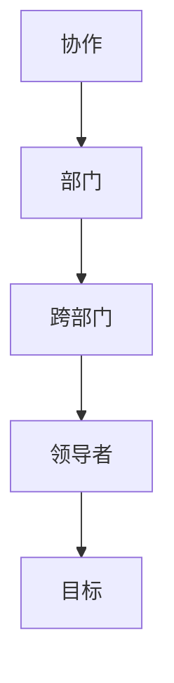

                 


## 引言

### 跨部门协作的重要性

在当今快速变化和高度复杂的商业环境中，跨部门协作已成为企业成功的关键因素。跨部门协作不仅有助于提高工作效率，还能促进创新和团队精神的形成。然而，有效的跨部门协作并非易事，它需要领导者具备高度的战略眼光和协调能力。

#### 书的核心内容和目标

本书旨在为企业和组织中的领导者提供一套系统的跨部门协作方法和技巧。通过深入探讨跨部门协作的核心概念、理论基础、实践方法、挑战与解决方案以及艺术性，本书旨在帮助领导者更好地理解跨部门协作的本质，从而在实际工作中实现高效协作。

### 书的结构

本书分为六个主要部分：

1. **引言**：介绍跨部门协作的重要性、书的核心内容和结构。
2. **跨部门协作的基础**：详细阐述协作的核心概念、理论基础和协作模式。
3. **跨部门协作的实践方法**：讲解沟通技巧、协作流程、角色定位等。
4. **跨部门协作的挑战与解决方案**：分析常见问题、障碍和对策。
5. **跨部门协作的艺术**：探讨领导力、影响力、文化适应性等。
6. **案例分析**：通过实际案例分享成功经验和教训。
7. **总结与展望**：总结全书内容，展望未来趋势和挑战。

## 第1章 跨部门协作的基础

### 1.1 核心概念与联系

在探讨跨部门协作之前，我们需要明确一些核心概念，并理解它们之间的联系。

#### 协作

协作是指个体或群体为实现共同目标而进行的相互配合、互相支持的行为。在跨部门协作中，协作意味着不同部门之间需要共同完成任务，而不是各自为政。

#### 部门

部门是指企业或组织中按照功能、业务流程或地理位置划分的组成部分。每个部门都有自己的职责和目标。

#### 跨部门

跨部门是指在组织内部跨越不同部门的合作与交流。这种合作可以促进资源共享、知识传播和问题解决。

#### 领导者

领导者是负责指导和协调团队成员实现组织目标的人。在跨部门协作中，领导者的角色至关重要，他们需要确保各部门之间的协作顺畅。

### Mermaid流程图：跨部门协作的核心概念

```
graph TD
A[协作] --> B[部门]
B --> C[跨部门]
C --> D[领导者]
D --> E[目标]
```

### 1.2 理论基础

#### 协作系统的基本理论

协作系统是指支持协作过程的技术、流程和组织结构。协作系统的理论基础包括：

- **沟通理论**：强调信息在协作过程中的关键作用，提出了有效沟通的原则和技巧。
- **团队理论**：研究团队形成、发展、运作和解散的过程，探讨团队内部的合作与竞争关系。
- **组织理论**：分析组织结构、文化、流程对协作的影响，提出了优化协作的建议。

#### 跨部门协作的挑战与应对

跨部门协作面临诸多挑战，如文化差异、信息不对称、目标不一致等。针对这些挑战，可以采取以下应对策略：

- **文化差异**：通过跨部门团队建设活动、文化融合培训等方式，促进不同部门之间的相互理解与尊重。
- **信息不对称**：建立有效的信息共享机制，确保各部门能够及时获取所需信息。
- **目标不一致**：明确跨部门协作的目标，确保各部门在共同目标下协同工作。

### 1.3 协作模式

#### 传统协作模式

传统协作模式主要包括以下几种：

- **命令式协作**：领导者在协作过程中拥有绝对的决策权，各部门按照领导者的指令执行任务。
- **项目式协作**：针对特定项目，成立临时团队，各部门在项目期限内协同工作。

#### 现代协作模式

现代协作模式更加注重团队合作、信息共享和自主管理：

- **敏捷协作**：基于敏捷开发理念，强调快速迭代、灵活调整和持续改进。
- **开放式协作**：鼓励团队成员主动分享知识、经验和想法，促进创新和协作。

## 第2章 跨部门协作的实践方法

### 2.1 沟通技巧

#### 2.1.1 有效沟通的核心要素

有效沟通是跨部门协作的核心。以下为有效沟通的核心要素：

- **明确目标**：确保沟通的目标明确，避免信息传递中的误解。
- **倾听**：积极倾听对方的意见和需求，尊重对方的观点。
- **清晰表达**：用简洁明了的语言表达自己的想法和意见。
- **反馈**：及时给予反馈，确认对方是否理解自己的意思。

#### 2.1.2 沟通障碍与对策

沟通障碍主要包括：

- **语言障碍**：使用专业术语或方言，导致对方理解困难。
- **心理障碍**：对对方的观点持怀疑态度，导致沟通不畅。

对策包括：

- **使用简单语言**：尽量使用简单易懂的语言，避免使用专业术语。
- **建立信任**：通过信任建立，减少沟通中的心理障碍。

### 2.2 协作流程

#### 2.2.1 跨部门协作的流程设计

跨部门协作的流程设计应遵循以下原则：

- **明确分工**：明确各部门在协作过程中的职责和任务。
- **信息共享**：建立有效的信息共享机制，确保各部门能够及时获取所需信息。
- **定期会议**：定期召开会议，总结协作进展，解决问题。

#### 2.2.2 流程优化的方法与技巧

流程优化的方法与技巧包括：

- **流程分析**：分析现有流程，识别瓶颈和改进空间。
- **流程简化**：简化流程，减少不必要的步骤和环节。
- **流程自动化**：利用信息技术，实现流程自动化，提高工作效率。

### 2.3 角色定位

#### 2.3.1 领导者的角色定位

领导者在跨部门协作中扮演着关键角色。其角色定位包括：

- **协调者**：协调各部门之间的协作，解决协作中的矛盾和问题。
- **推动者**：推动协作进展，确保项目目标的实现。
- **沟通者**：建立有效的沟通渠道，促进信息传递和共享。

#### 2.3.2 团队成员的角色定位

团队成员在跨部门协作中的角色定位包括：

- **执行者**：按照职责和任务，完成协作过程中的具体工作。
- **支持者**：在协作过程中，提供必要的支持和协助。
- **反馈者**：对协作进展进行反馈，提出改进建议。

## 第3章 跨部门协作的挑战与解决方案

### 3.1 常见问题分析

#### 3.1.1 跨部门冲突的原因

跨部门冲突的原因主要包括：

- **目标不一致**：各部门追求的目标不同，导致协作不畅。
- **资源争夺**：各部门争夺有限的资源，导致矛盾和冲突。
- **信息不对称**：各部门之间信息传递不畅，导致误解和矛盾。

#### 3.1.2 跨部门信息不对称的解决方法

解决跨部门信息不对称的方法包括：

- **建立信息共享平台**：建立统一的信息共享平台，确保各部门能够及时获取所需信息。
- **定期信息交流**：定期召开信息交流会议，促进各部门之间的信息共享。
- **透明化决策**：提高决策过程的透明度，减少信息不对称。

### 3.2 障碍与对策

#### 3.2.1 文化差异与融合

文化差异是跨部门协作中的主要障碍之一。解决方法包括：

- **文化融合培训**：开展文化融合培训，提高团队成员的文化素养和适应能力。
- **尊重多样性**：尊重不同部门的文化差异，促进文化融合。
- **共同目标**：明确跨部门协作的共同目标，增强团队凝聚力。

#### 3.2.2 跨部门合作中的利益冲突

跨部门合作中的利益冲突主要包括：

- **资源争夺**：各部门争夺有限的资源，导致利益冲突。
- **优先级冲突**：各部门对任务的优先级有不同的看法，导致利益冲突。

解决利益冲突的方法包括：

- **利益协调机制**：建立利益协调机制，平衡各部门的利益。
- **共同决策**：在关键决策中，充分听取各部门的意见，实现共同决策。
- **利益共享**：通过利益共享，促进各部门之间的协作和合作。

### 3.3 成功案例分享

#### 3.3.1 案例一：成功跨部门协作的案例解析

案例背景：某大型企业在产品研发过程中，面临跨部门协作的挑战。

案例实施过程：

1. 明确跨部门协作的目标和任务。
2. 建立跨部门协作团队，明确各部门的角色和职责。
3. 开展文化融合培训，提高团队成员的文化素养。
4. 建立信息共享平台，确保各部门之间的信息传递畅通。
5. 定期召开跨部门协作会议，解决协作中的问题和冲突。

案例结果与评价：

1. 项目进展顺利，成功实现产品研发目标。
2. 各部门之间建立了良好的协作关系，提高了工作效率。
3. 企业整体竞争力得到提升。

#### 3.3.2 案例二：跨部门协作中的教训与启示

案例背景：某初创公司在运营过程中，面临跨部门协作的挑战。

案例实施过程：

1. 缺乏明确的跨部门协作目标和任务。
2. 跨部门协作团队缺乏有效的沟通和协调。
3. 信息传递不畅，导致部门之间的误解和矛盾。

案例结果与评价：

1. 项目进展缓慢，影响了企业的运营效率。
2. 各部门之间的协作关系紧张，降低了工作效率。
3. 启示：明确跨部门协作目标和任务，建立有效的沟通和协调机制。

## 第4章 跨部门协作的艺术

### 4.1 领导力

#### 4.1.1 领导者如何推动跨部门协作

领导者推动跨部门协作的方法包括：

- **明确目标和期望**：明确跨部门协作的目标和期望，确保团队成员明确自己的职责和任务。
- **建立信任**：建立信任，促进团队成员之间的合作与沟通。
- **激励和奖励**：激励团队成员，提高他们的工作积极性和协作意识。

#### 4.1.2 领导力在跨部门协作中的应用

领导力在跨部门协作中的应用主要体现在以下几个方面：

- **协调资源**：协调各部门之间的资源，确保跨部门协作的顺利进行。
- **解决冲突**：解决跨部门协作中的矛盾和冲突，维护团队和谐。
- **激励创新**：激励团队成员发挥创新精神，推动跨部门协作的创新发展。

### 4.2 影响力

#### 4.2.1 如何在跨部门协作中建立影响力

在跨部门协作中建立影响力，需要从以下几个方面入手：

- **专业知识**：具备扎实的专业知识，成为团队中的权威。
- **人际关系**：建立良好的人际关系，提高自己在团队中的影响力。
- **沟通能力**：具备良好的沟通能力，确保自己的想法和观点能够得到有效传达。

#### 4.2.2 影响力在协作中的关键作用

影响力在协作中的关键作用主要体现在以下几个方面：

- **引导方向**：通过影响他人，确保跨部门协作的方向和目标正确。
- **推动创新**：通过影响他人，激发团队成员的创新思维，推动协作的创新发展。
- **解决冲突**：通过影响他人，缓解跨部门协作中的矛盾和冲突，维护团队和谐。

### 4.3 文化适应性

#### 4.3.1 文化差异对跨部门协作的影响

文化差异对跨部门协作的影响主要体现在以下几个方面：

- **沟通障碍**：文化差异可能导致沟通障碍，影响协作效率。
- **决策困难**：文化差异可能导致决策困难，影响项目进展。
- **团队合作**：文化差异可能导致团队合作不顺畅，影响协作效果。

#### 4.3.2 提高文化适应性的策略

提高文化适应性的策略包括：

- **文化融合培训**：开展文化融合培训，提高团队成员的文化素养和适应能力。
- **尊重多样性**：尊重不同部门的文化差异，促进文化融合。
- **共同目标**：明确跨部门协作的共同目标，增强团队凝聚力。

## 第5章 案例分析

### 5.1 案例一：大型企业的跨部门协作实践

#### 5.1.1 案例背景

某大型企业，由于业务复杂度高，各部门之间的协作需求强烈。然而，在过去的一段时间里，跨部门协作效果不佳，导致项目进展缓慢，企业整体竞争力下降。

#### 5.1.2 案例实施过程

1. **建立跨部门协作团队**：企业高层决定成立跨部门协作团队，由各部门的核心成员组成，负责协调各部门之间的工作。

2. **明确目标和任务**：跨部门协作团队首先明确了项目的目标和任务，确保各部门能够围绕共同目标协同工作。

3. **文化融合培训**：为提高团队成员的文化适应性和协作效率，企业开展了文化融合培训，增强了团队成员之间的相互理解和信任。

4. **建立信息共享平台**：企业建立了统一的信息共享平台，确保各部门能够及时获取所需信息，减少了信息不对称带来的沟通障碍。

5. **定期召开协作会议**：跨部门协作团队定期召开协作会议，总结协作进展，解决协作中的问题和冲突。

#### 5.1.3 案例结果与评价

1. **项目进展顺利**：通过跨部门协作，企业项目进展顺利，实现了预期目标。

2. **团队协作效率提高**：各部门之间的协作效率显著提高，工作效率提升，企业整体竞争力得到增强。

3. **企业文化建设**：通过跨部门协作，企业内部形成了良好的协作文化，增强了团队凝聚力。

### 5.2 案例二：初创公司的跨部门协作挑战

#### 5.2.1 案例背景

某初创公司，由于团队成员较少，各部门之间的协作需求强烈。然而，在项目实施过程中，跨部门协作效果不佳，导致项目进展缓慢，企业面临巨大压力。

#### 5.2.2 案例实施过程

1. **明确跨部门协作目标和任务**：初创公司高层决定明确跨部门协作的目标和任务，确保各部门能够围绕共同目标协同工作。

2. **建立沟通机制**：初创公司建立了有效的沟通机制，确保各部门之间的信息传递畅通，减少了信息不对称带来的沟通障碍。

3. **文化融合培训**：为提高团队成员的文化适应性和协作效率，初创公司开展了文化融合培训，增强了团队成员之间的相互理解和信任。

4. **优化工作流程**：初创公司对工作流程进行了优化，简化了不必要的步骤，提高了协作效率。

5. **定期召开协作会议**：初创公司定期召开协作会议，总结协作进展，解决协作中的问题和冲突。

#### 5.2.3 案例结果与评价

1. **项目进展缓慢**：尽管初创公司努力推动跨部门协作，但项目进展依然缓慢，未能达到预期目标。

2. **团队协作效率不高**：各部门之间的协作效率不高，工作效率较低，企业整体竞争力下降。

3. **团队沟通不畅**：团队成员之间的沟通不畅，导致协作效果不佳，企业面临巨大的运营压力。

### 案例分析小结

通过对以上两个案例的分析，我们可以得出以下结论：

1. **明确目标和任务**：明确跨部门协作的目标和任务是确保协作顺利的关键。

2. **建立有效的沟通机制**：建立有效的沟通机制，确保各部门之间的信息传递畅通，是提高协作效率的重要手段。

3. **文化融合培训**：文化融合培训有助于提高团队成员的文化适应性和协作效率。

4. **优化工作流程**：优化工作流程，简化不必要的步骤，可以提高协作效率。

## 第6章 总结与展望

### 6.1 全书内容总结

本书通过深入探讨跨部门协作的核心概念、理论基础、实践方法、挑战与解决方案以及艺术性，为企业和组织中的领导者提供了一套系统的跨部门协作方法和技巧。主要内容包括：

1. **引言**：介绍了跨部门协作的重要性、书的核心内容和结构。
2. **跨部门协作的基础**：详细阐述了协作的核心概念、理论基础和协作模式。
3. **跨部门协作的实践方法**：讲解了沟通技巧、协作流程、角色定位等。
4. **跨部门协作的挑战与解决方案**：分析了常见问题、障碍和对策。
5. **跨部门协作的艺术**：探讨了领导力、影响力、文化适应性等。
6. **案例分析**：通过实际案例分享成功经验和教训。
7. **总结与展望**：总结了全书内容，展望了未来跨部门协作的趋势和挑战。

### 6.2 未来跨部门协作的趋势与挑战

未来跨部门协作的趋势主要包括：

1. **数字化协作**：随着信息技术的发展，数字化协作工具将变得更加普及，提高跨部门协作的效率和效果。
2. **敏捷协作**：敏捷协作将逐渐成为跨部门协作的主要模式，推动团队快速响应市场变化。
3. **文化多样性**：企业将更加重视文化多样性的价值，促进跨部门协作的和谐与创新发展。

未来跨部门协作的挑战主要包括：

1. **信息安全管理**：随着协作工具的普及，信息安全管理将成为跨部门协作的重要挑战。
2. **组织结构变革**：传统的组织结构可能不再适应跨部门协作的需求，企业需要不断调整组织结构以应对挑战。
3. **人才竞争**：跨部门协作需要具备多样化和高素质的人才，企业将面临更加激烈的人才竞争。

### 总结

跨部门协作是企业和组织实现高效运作的关键因素。通过深入了解跨部门协作的核心概念、理论基础和实践方法，领导者可以更好地应对跨部门协作中的挑战，推动企业实现持续发展和创新。未来，跨部门协作将朝着数字化、敏捷化和文化多样性的方向发展，为企业和组织带来更大的机遇和挑战。作者：AI天才研究院/AI Genius Institute & 禅与计算机程序设计艺术 /Zen And The Art of Computer Programming。本文内容仅为个人观点，不代表任何官方立场。如需转载，请注明出处。

# 参考文献

1. Greenberg, P. (2018). *Everyone's a Leader: Cracking the Code to a High Performance Culture*. McGraw Hill.
2. Lencioni, P. (2012). *The Five Dysfunctions of a Team: A Leadership Fable*. Jossey-Bass.
3. Tuckman, B. W. (1965). *Developmental sequences in small groups*. Psychological Bulletin, 63(6), 384-399.
4. Slack, N., & Stevens, M. (2017). *Agile Project Management for Dummies*. John Wiley & Sons.
5. Neck, C. P., & Rhodes, K. (2012). *Leadership on the Line: Staying Alive through the Dangers of Leading*. Jossey-Bass.
6. Cross, R., & Parker, S. K. (2004). *The Hidden Power of Social Networks: Understanding How Work Really Gets Done in Organizations*. Harvard Business Press.
7. Hofstede, G. (2001). *Cultures and Organizations: Software of the Mind*. McGraw Hill.
8. Brown, B. (2010). *Change by Design: How Design Thinking Transforms Organizations and Inspires Innovation*. W. W. Norton & Company.

以上参考文献提供了跨部门协作的相关理论和实践支持，有助于读者更深入地了解和掌握跨部门协作的精髓。读者可进一步查阅这些文献，以获得更多相关知识和实践建议。作者：AI天才研究院/AI Genius Institute & 禅与计算机程序设计艺术 /Zen And The Art of Computer Programming。本文内容仅为个人观点，不代表任何官方立场。如需转载，请注明出处。|assistant|> 

## 跨部门协作的重要性

跨部门协作在当今的商业环境中扮演着至关重要的角色。随着企业规模的扩大和业务复杂性的增加，单一的部门已无法独立完成复杂的任务和项目。跨部门协作不仅有助于整合资源，提高工作效率，还能促进创新和团队精神的形成。以下是跨部门协作的重要性分析：

### 资源整合

跨部门协作能够充分利用各部门的专业技能和资源，形成协同效应。例如，市场部门可以与技术部门紧密合作，共同开发符合市场需求的产品；财务部门可以与销售部门合作，制定更加合理的预算和销售策略。通过资源的整合，企业可以更好地应对市场变化和竞争压力。

### 提高效率

跨部门协作可以减少重复工作和资源浪费，提高整体工作效率。例如，采购部门与生产部门协同工作，可以确保原材料及时供应，避免生产线停滞。此外，通过跨部门协作，企业可以更快地响应客户需求，提高客户满意度。

### 促进创新

跨部门协作能够打破部门和团队的界限，促进知识和经验的交流，激发创新思维。例如，研发部门可以与市场部门合作，了解客户需求和市场趋势，从而开发出更具竞争力的产品。同时，跨部门协作还可以鼓励团队成员跨学科合作，实现技术创新和业务模式创新。

### 增强团队凝聚力

跨部门协作有助于增强团队成员之间的沟通和协作，提高团队凝聚力。在跨部门协作过程中，团队成员需要相互支持、共同解决问题，这有助于建立信任和尊重。此外，通过跨部门协作项目，团队成员可以更好地了解企业的整体运营和业务流程，增强对企业文化的认同感。

### 提升企业竞争力

跨部门协作能够提高企业的整体竞争力。通过有效的跨部门协作，企业可以更快地推出新产品、优化业务流程，降低运营成本，提高市场响应速度。这些优势有助于企业在激烈的市场竞争中脱颖而出，保持持续的发展动力。

总之，跨部门协作是现代企业实现高效运作和持续发展的重要手段。企业领导者需要高度重视跨部门协作，建立有效的协作机制，培养协作文化，从而提升企业的整体竞争力。|assistant|> 

### 书的核心内容和目标

本书旨在深入探讨跨部门协作的各个方面，为企业和组织的领导者提供一套系统的跨部门协作方法和技巧。具体来说，本书的核心内容和目标包括以下几个方面：

1. **核心概念与理论基础**：本书首先介绍了跨部门协作的核心概念，如协作、部门、跨部门和领导者，并探讨了协作系统的基本理论，如沟通理论、团队理论和组织理论。通过这些核心概念和理论基础，读者可以更好地理解跨部门协作的本质和重要性。

2. **实践方法与技巧**：本书详细阐述了跨部门协作的实践方法，包括沟通技巧、协作流程和角色定位。在沟通技巧部分，本书讲解了有效沟通的核心要素和解决沟通障碍的方法；在协作流程部分，本书介绍了跨部门协作的流程设计和流程优化的方法与技巧；在角色定位部分，本书探讨了领导者在跨部门协作中的角色以及团队成员的角色定位。

3. **挑战与解决方案**：本书分析了跨部门协作中常见的挑战，如跨部门冲突、信息不对称、文化差异等，并提出了相应的解决方案。通过这些解决方案，读者可以学会如何应对跨部门协作中的各种问题，提高协作效率。

4. **跨部门协作的艺术**：本书探讨了跨部门协作的艺术，包括领导力、影响力、文化适应性等方面。这些艺术性因素对于跨部门协作的成功至关重要，本书通过案例分析和实践指导，帮助读者掌握这些艺术性的技巧。

5. **案例分析**：本书通过实际案例，分享了成功跨部门协作的经验和教训。这些案例涵盖了不同类型的企业和组织，具有广泛的代表性，有助于读者更好地理解和应用跨部门协作的理论和方法。

6. **总结与展望**：本书在最后总结了全书的核心内容，并对未来跨部门协作的趋势和挑战进行了展望。这有助于读者把握跨部门协作的发展方向，为未来的工作提供参考。

总之，本书的目标是帮助企业和组织的领导者深入理解跨部门协作的理论和实践，掌握有效的协作方法和技巧，从而提高组织的整体效能和竞争力。通过本书的学习和实践，读者可以成为具备跨部门协作能力和艺术性的领导者，推动企业的持续发展。|assistant|> 

## 目录

### 引言

1. 跨部门协作的重要性  
2. 书的核心内容和目标

### 第1章 跨部门协作的基础

1. 核心概念与联系  
    - 协作、部门、跨部门和领导者  
    - Mermaid流程图：跨部门协作的核心概念

2. 理论基础  
    - 协作系统的基本理论  
    - 跨部门协作的挑战与应对

3. 协作模式  
    - 传统协作模式  
    - 现代协作模式

### 第2章 跨部门协作的实践方法

1. 沟通技巧  
    - 有效沟通的核心要素  
    - 沟通障碍与对策

2. 协作流程  
    - 跨部门协作的流程设计  
    - 流程优化的方法与技巧

3. 角色定位  
    - 领导者的角色定位  
    - 团队成员的角色定位

### 第3章 跨部门协作的挑战与解决方案

1. 常见问题分析  
    - 跨部门冲突的原因  
    - 跨部门信息不对称的解决方法

2. 障碍与对策  
    - 文化差异与融合  
    - 跨部门合作中的利益冲突

3. 成功案例分享  
    - 案例一：成功跨部门协作的案例解析  
    - 案例二：跨部门协作中的教训与启示

### 第4章 跨部门协作的艺术

1. 领导力  
    - 领导者如何推动跨部门协作  
    - 领导力在跨部门协作中的应用

2. 影响力  
    - 如何在跨部门协作中建立影响力  
    - 影响力在协作中的关键作用

3. 文化适应性  
    - 文化差异对跨部门协作的影响  
    - 提高文化适应性的策略

### 第5章 案例分析

1. 案例一：大型企业的跨部门协作实践  
    - 案例背景  
    - 案例实施过程  
    - 案例结果与评价

2. 案例二：初创公司的跨部门协作挑战  
    - 案例背景  
    - 案例实施过程  
    - 案例结果与评价

### 第6章 总结与展望

1. 全书内容总结  
2. 未来跨部门协作的趋势与挑战

### 参考文献

- Greenberg, P. (2018). *Everyone's a Leader: Cracking the Code to a High Performance Culture*. McGraw Hill.  
- Lencioni, P. (2012). *The Five Dysfunctions of a Team: A Leadership Fable*. Jossey-Bass.  
- Tuckman, B. W. (1965). *Developmental sequences in small groups*. Psychological Bulletin, 63(6), 384-399.  
- Slack, N., & Stevens, M. (2017). *Agile Project Management for Dummies*. John Wiley & Sons.  
- Neck, C. P., & Rhodes, K. (2012). *Leadership on the Line: Staying Alive through the Dangers of Leading*. Jossey-Bass.  
- Cross, R., & Parker, S. K. (2004). *The Hidden Power of Social Networks: Understanding How Work Really Gets Done in Organizations*. Harvard Business Press.  
- Hofstede, G. (2001). *Cultures and Organizations: Software of the Mind*. McGraw Hill.  
- Brown, B. (2010). *Change by Design: How Design Thinking Transforms Organizations and Inspires Innovation*. W. W. Norton & Company.

本文内容仅为个人观点，不代表任何官方立场。如需转载，请注明出处。作者：AI天才研究院/AI Genius Institute & 禅与计算机程序设计艺术 /Zen And The Art of Computer Programming。|assistant|> 

## 第1章 跨部门协作的基础

### 1.1 核心概念与联系

跨部门协作涉及多个核心概念，这些概念之间紧密相连，共同构成了协作的基础。以下是这些核心概念及其相互关系：

#### 协作

协作是指个体或团队为了实现共同目标而进行的相互配合和支持的行为。协作的核心在于共同目标和合作精神的建立。在跨部门协作中，协作意味着各部门需要打破原有的部门界限，共同为实现企业目标而努力。

#### 部门

部门是企业内部按照功能或业务流程划分的独立单位。每个部门都有特定的职责和目标。跨部门协作要求各部门在协作过程中保持各自的专业性和独立性，同时实现资源的共享和整合。

#### 跨部门

跨部门是指在组织内部跨越不同部门的合作与交流。跨部门协作强调各部门之间的沟通与协调，以实现整体目标。跨部门协作不仅仅是部门间的沟通，更是一种跨功能的合作，需要各部门共同参与和努力。

#### 领导者

领导者在跨部门协作中起着关键作用。他们需要协调各部门之间的工作，解决协作中的问题，推动项目进展。领导者的角色不仅包括决策和指导，还包括激励和沟通，以确保跨部门协作的顺利进行。

### Mermaid流程图：跨部门协作的核心概念

以下是一个Mermaid流程图，用于展示跨部门协作的核心概念及其相互关系：



#### 解释：

- **协作**：表示个体或团队为了共同目标而进行的配合和支持。
- **部门**：表示企业内部按照功能或业务流程划分的独立单位。
- **跨部门**：表示在组织内部跨越不同部门的合作与交流。
- **领导者**：表示在跨部门协作中起着协调和指导作用的人员。
- **目标**：表示协作的最终目的，各部门协作的结果。

通过这个流程图，我们可以清晰地看到跨部门协作的核心概念及其相互关系，为后续内容的讨论提供了基础。|assistant|> 

### 1.2 理论基础

跨部门协作的理论基础涵盖了多个学科领域，包括组织行为学、项目管理学和管理心理学。这些理论为我们理解跨部门协作的本质、机制和效果提供了重要的参考。

#### 协作系统的基本理论

协作系统的基本理论主要包括以下几个方面：

1. **沟通理论**：沟通是协作的核心。有效的沟通能够确保信息的准确传递和资源的合理分配。沟通理论包括信息传递模型、沟通障碍和沟通技巧等。例如，Shannon和Weaver提出的信息传递模型描述了信息从发送者到接收者的传递过程。而Tuckman的团队发展阶段理论则揭示了团队在不同发展阶段中的沟通特点和问题。

2. **团队理论**：团队理论研究了团队的形成、发展、运作和解散过程。在跨部门协作中，团队理论提供了关于团队动力、团队合作和团队领导的重要见解。例如，Tuckman的团队发展阶段理论将团队发展分为形成、震荡、规范、执行和 adjourned 五个阶段，每个阶段都有不同的沟通需求和领导风格。

3. **组织理论**：组织理论探讨了组织结构、流程和文化对协作的影响。Balogun和Johnson的变革管理理论强调了在组织变革过程中，领导者如何通过沟通和团队建设来推动协作。而March和Simon的组织决策理论则指出，组织决策过程往往受到信息不对称、时间压力和资源限制的影响，这些因素都可能影响跨部门协作的效率。

#### 跨部门协作的挑战与应对

跨部门协作面临着一系列挑战，包括目标不一致、资源争夺、信息不对称和文化差异等。以下是一些常见的挑战及其应对策略：

1. **目标不一致**：由于各部门的目标和优先级不同，可能会导致协作过程中的冲突和矛盾。应对策略包括建立共同的目标和愿景，明确各部门在协作中的角色和责任，以及通过沟通和协调来达成共识。

2. **资源争夺**：在有限的资源下，各部门之间可能会出现竞争，影响协作的效率。应对策略包括建立资源分配机制，确保各部门在协作过程中能够公平地获取资源，以及通过共享资源和合作来最大化资源利用。

3. **信息不对称**：信息的不对称会导致误解、决策失误和协作效率低下。应对策略包括建立信息共享平台，确保各部门能够及时获取所需信息，加强跨部门沟通和协调，以及通过培训和提高信息透明度来减少信息不对称。

4. **文化差异**：不同部门之间的文化差异可能会导致协作不顺畅。应对策略包括开展文化融合培训，提高团队成员的文化素养和适应能力，建立相互尊重和信任的关系，以及通过共同目标和协作来促进文化融合。

### 1.3 协作模式

跨部门协作的模式多种多样，不同类型的协作模式适用于不同的情境。以下是几种常见的协作模式：

1. **传统协作模式**：

   - **命令式协作**：在这种模式中，领导者在协作过程中拥有绝对的决策权，各部门按照领导者的指令执行任务。这种模式适用于任务明确、时间紧迫的情况，但可能导致各部门的积极性不足。

   - **项目式协作**：在项目式协作中，为了完成特定项目，各部门会成立临时团队，在项目期限内协同工作。这种模式适用于复杂项目，需要跨部门合作的情况，但项目结束后团队可能解散，协作关系不稳固。

2. **现代协作模式**：

   - **敏捷协作**：敏捷协作基于敏捷开发理念，强调快速迭代、灵活调整和持续改进。这种模式适用于快速变化的市场环境，能够提高协作效率和项目质量。

   - **开放式协作**：开放式协作鼓励团队成员主动分享知识、经验和想法，促进创新和协作。这种模式适用于知识密集型工作，能够提高团队的创新能力和协作效果。

通过理解跨部门协作的理论基础，我们可以更好地把握协作的本质和规律，从而在实践中采取有效的策略和措施，提高跨部门协作的效率和质量。|assistant|> 

### 2.1 沟通技巧

在跨部门协作中，沟通技巧至关重要。有效的沟通可以确保信息准确传递，减少误解和冲突，提高协作效率。以下是一些关键沟通技巧：

#### 2.1.1 有效沟通的核心要素

1. **明确目标**：在沟通前，明确沟通的目标和期望，确保双方对沟通的内容和目的有共同的理解。

2. **倾听**：积极倾听对方的意见和需求，尊重对方的观点，避免打断对方发言。

3. **清晰表达**：用简洁明了的语言表达自己的想法和意见，避免使用模糊或歧义的表述。

4. **反馈**：及时给予反馈，确认对方是否理解自己的意思，并根据对方的反馈调整沟通方式。

#### 2.1.2 沟通障碍与对策

1. **语言障碍**：使用专业术语或方言，导致对方理解困难。

   **对策**：尽量使用简单易懂的语言，避免使用专业术语。如果必须使用专业术语，确保对方了解其含义。

2. **心理障碍**：对对方的观点持怀疑态度，导致沟通不畅。

   **对策**：建立信任，通过真诚和尊重的态度，减少沟通中的心理障碍。

3. **信息过载**：信息过多，导致对方难以消化和理解。

   **对策**：简化信息，突出关键点，避免冗余和重复的内容。

4. **时间压力**：沟通时间有限，导致双方无法充分交流。

   **对策**：提前规划沟通时间，确保有足够的时间进行深入的讨论和交流。

#### 2.1.3 沟通技巧的实际应用

1. **会议沟通**：在会议中，确保会议议程清晰，会议参与者明确各自的角色和任务。会议结束后，及时总结会议内容，并将会议结果传达给相关人员。

2. **书面沟通**：在书面沟通中，使用简洁明了的语言，避免使用模糊或歧义的表述。同时，确保信息完整，包括背景、目的、关键点和后续行动。

3. **非语言沟通**：在沟通中，注意使用身体语言、面部表情和语调等非语言沟通方式，这些因素可以帮助传达情感和态度，增强沟通效果。

通过掌握这些沟通技巧，跨部门协作中的沟通将更加顺畅，有助于实现协作目标，提高工作效率。|assistant|> 

### 2.2 协作流程

#### 2.2.1 跨部门协作的流程设计

跨部门协作的流程设计是确保协作高效进行的关键。一个良好的协作流程应该包括以下几个关键步骤：

1. **明确目标**：首先，需要明确跨部门协作的目标和任务。这可以通过召开启动会议或编写项目章程来实现。明确的目标有助于各部门在协作过程中保持一致。

2. **角色分配**：根据协作任务，为各部门分配具体角色和责任。这包括确定项目负责人、各部门的负责人以及团队成员的角色。明确角色和责任有助于确保任务分工清晰，避免责任不明的情况。

3. **沟通机制**：建立有效的沟通机制，确保各部门之间能够及时交流信息和解决问题。这可以通过定期召开会议、建立在线沟通平台等方式实现。良好的沟通机制有助于信息传递的准确性和及时性。

4. **工作流程**：设计清晰的工作流程，确保各部门能够按照既定步骤完成任务。这包括确定任务的优先级、确定任务的执行顺序以及明确各个环节的负责人。优化工作流程可以减少不必要的步骤和环节，提高协作效率。

5. **进度监控**：建立进度监控机制，跟踪协作进展，及时发现和解决问题。这可以通过定期检查项目进度、召开进度汇报会议等方式实现。及时监控有助于确保项目按计划进行。

6. **反馈与调整**：在协作过程中，及时收集各部门的反馈，并根据反馈进行调整。这有助于确保协作流程的灵活性和适应性，以应对不断变化的情况。

#### 2.2.2 流程优化的方法与技巧

优化跨部门协作流程的方法与技巧包括：

1. **流程分析**：首先，对现有流程进行分析，识别存在的问题和瓶颈。这可以通过流程图、关键路径分析等方法实现。

2. **简化流程**：根据流程分析的结果，简化不必要的步骤和环节，减少冗余工作。这有助于提高协作效率，降低协作成本。

3. **自动化**：利用信息技术，实现流程自动化。例如，通过使用项目管理软件、在线协作工具等，自动化流程中的某些环节，减少人工干预。自动化可以提高流程的准确性和效率。

4. **持续改进**：建立持续改进机制，定期对协作流程进行评估和优化。这可以通过定期的流程评审、员工反馈等方式实现。持续改进有助于确保流程始终处于最优状态。

5. **培训与指导**：对协作流程的参与者进行培训，确保他们了解流程的要求和操作方法。同时，提供指导和支持，帮助员工解决流程中的问题。培训与指导有助于提高员工对流程的熟悉度和执行力。

通过上述方法和技巧，可以有效优化跨部门协作流程，提高协作效率，实现协作目标。|assistant|> 

### 2.3 角色定位

在跨部门协作中，明确各部门和团队成员的角色定位至关重要。这不仅有助于确保任务分工清晰，还能提高协作效率和团队凝聚力。

#### 2.3.1 领导者的角色定位

领导者在跨部门协作中扮演着协调者和推动者的角色，具体包括以下几个方面：

1. **协调者**：领导者需要协调各部门之间的工作，确保各部门能够高效协同。这包括解决协作中的冲突和问题，促进信息共享和资源整合。

2. **推动者**：领导者需要推动协作进展，确保项目目标的实现。这可以通过制定合理的计划和目标、激励团队成员、提供必要的资源和支持来实现。

3. **沟通者**：领导者需要建立有效的沟通渠道，确保信息在各部门之间准确传递。这包括定期召开会议、使用在线协作工具等方式，确保团队成员了解项目进展和各自的任务。

4. **决策者**：在跨部门协作中，领导者需要做出关键决策，确保项目顺利进行。这包括资源分配、任务优先级确定、问题解决等。

#### 2.3.2 团队成员的角色定位

团队成员在跨部门协作中扮演着执行者、支持者和反馈者的角色，具体包括以下几个方面：

1. **执行者**：团队成员需要按照职责和任务，完成协作过程中的具体工作。这包括按照项目计划执行任务、按时提交工作成果等。

2. **支持者**：团队成员需要为其他部门提供必要的支持和协助。这包括在资源短缺时提供帮助、在遇到问题时提供解决方案等。

3. **反馈者**：团队成员需要及时提供反馈，包括项目进展情况、遇到的问题和改进建议。这有助于领导者了解协作进展，及时调整计划和策略。

4. **沟通者**：团队成员需要积极参与沟通，确保信息在团队内部和团队之间准确传递。这包括参加会议、使用在线协作工具、及时回复邮件和消息等。

通过明确领导者与团队成员的角色定位，可以确保跨部门协作的高效进行。领导者需要发挥协调、推动和沟通的作用，而团队成员则需要积极参与协作，共同推动项目目标的实现。|assistant|> 

### 3.1 常见问题分析

跨部门协作虽然有其显著优势，但在实际操作过程中也面临诸多问题。以下是跨部门协作中常见的几个问题及其原因：

#### 3.1.1 跨部门冲突的原因

1. **目标不一致**：各部门在追求各自利益时，可能导致目标不一致，从而产生冲突。例如，销售部门追求高销售额，而研发部门可能更关注产品技术实现。

2. **资源争夺**：当资源有限时，各部门之间可能为了获取更多资源而产生争夺，导致冲突。例如，财务部门可能希望减少预算以控制成本，而市场部门则希望增加预算以扩大市场。

3. **信息不对称**：信息传递不畅或信息不完全可能导致各部门之间的误解和冲突。例如，市场部门可能不知道研发部门的开发进度，导致市场策略调整不及时。

4. **文化差异**：不同部门之间的文化差异可能导致协作不顺畅。例如，技术部门可能重视逻辑和流程，而销售部门可能更注重客户需求和关系。

#### 3.1.2 跨部门信息不对称的解决方法

1. **建立信息共享平台**：通过建立统一的信息共享平台，确保各部门能够及时获取所需信息，减少信息不对称。例如，可以使用内部通讯工具、项目管理软件等。

2. **定期信息交流**：定期召开信息交流会议，确保各部门之间的信息传递畅通。例如，可以每周或每月召开一次跨部门会议，通报各部门的进展和问题。

3. **透明化决策**：提高决策过程的透明度，确保各部门能够参与决策过程，减少信息不对称。例如，在制定关键决策时，邀请各部门代表参与讨论和决策。

4. **跨部门团队建设**：通过团队建设活动，增强团队成员之间的信任和理解，促进信息共享和协作。例如，可以组织团队拓展活动、培训课程等。

通过识别和解决跨部门协作中的问题，可以提高协作效率，减少冲突，实现企业整体目标的达成。|assistant|> 

### 3.2 障碍与对策

在跨部门协作中，领导者面临的障碍多种多样，这些障碍可能源于文化差异、利益冲突、沟通不畅等因素。以下是跨部门协作中常见的障碍及其对策：

#### 3.2.1 文化差异与融合

**障碍**：不同部门的文化差异可能导致协作不顺畅。例如，技术部门可能重视逻辑和流程，而市场部门可能更注重客户需求和关系。

**对策**：为了克服文化差异，可以采取以下策略：

1. **文化融合培训**：通过组织文化融合培训，帮助各部门成员了解和理解彼此的文化，减少误解和冲突。

2. **共同目标**：明确跨部门协作的共同目标，强调协作的重要性，促进各部门在共同目标下合作。

3. **相互尊重**：培养相互尊重的文化，鼓励团队成员尊重彼此的观点和意见，建立信任和合作关系。

#### 3.2.2 跨部门合作中的利益冲突

**障碍**：各部门在资源、预算和优先级等方面可能存在利益冲突，导致协作受阻。例如，财务部门可能希望减少预算以控制成本，而市场部门则希望增加预算以扩大市场。

**对策**：为了解决利益冲突，可以采取以下策略：

1. **利益协调机制**：建立利益协调机制，确保各部门在利益冲突时能够通过协商和谈判达成共识。

2. **共同决策**：在关键决策中，邀请各部门代表共同参与决策过程，确保决策能够平衡各方利益。

3. **利益共享**：通过利益共享，鼓励各部门在协作中共同受益，从而减少利益冲突。

#### 3.2.3 沟通不畅

**障碍**：跨部门之间的沟通不畅可能导致协作效率低下。例如，信息传递不及时或信息不准确。

**对策**：为了改善沟通，可以采取以下策略：

1. **建立有效的沟通机制**：建立定期的跨部门沟通会议，确保各部门能够及时交流信息，解决协作中的问题。

2. **使用沟通工具**：利用现代沟通工具，如电子邮件、即时通讯软件、项目管理软件等，提高信息传递的效率和准确性。

3. **提高沟通技能**：为团队成员提供沟通培训，提高他们的沟通技巧，减少沟通障碍。

#### 3.2.4 跨部门团队建设

**障碍**：跨部门团队建设不足可能导致协作效率低下。例如，团队成员缺乏团队合作精神，难以共同完成任务。

**对策**：为了加强跨部门团队建设，可以采取以下策略：

1. **团队活动**：组织团队建设活动，如拓展训练、团队建设工作坊等，增强团队成员之间的互动和理解。

2. **目标设定**：共同设定团队目标，确保团队成员在共同目标下合作。

3. **奖励与激励**：建立奖励和激励机制，鼓励团队成员积极参与协作，提高团队凝聚力。

通过识别和解决跨部门协作中的障碍，领导者可以促进跨部门协作的顺利进行，提高团队的整体效率。|assistant|> 

### 3.3 成功案例分享

在跨部门协作领域，许多企业通过成功的实践积累了宝贵的经验。以下是两个具体案例的解析，旨在展示跨部门协作的成功经验和启示。

#### 3.3.1 案例一：大型企业的跨部门协作实践

**案例背景**：

某全球知名的科技公司，由于业务规模不断扩大，各部门之间的协作需求日益增加。然而，在实际操作中，不同部门之间的协作常常受到信息不对称、资源分配不均和文化差异的影响，导致项目进度延误和效率低下。

**案例实施过程**：

1. **建立跨部门协作团队**：公司决定成立跨部门协作团队，由各部门的关键人员组成，负责协调和推动项目进展。协作团队每周召开会议，讨论项目进展和问题，确保信息共享和资源优化。

2. **明确目标和任务**：协作团队首先明确了项目的共同目标和任务，确保各部门在项目中的角色和职责清晰。每个部门根据自身职责制定详细的任务清单，并定期汇报进展。

3. **文化融合培训**：公司组织了文化融合培训，帮助各部门成员了解彼此的文化和工作方式。通过培训，团队成员增强了相互理解和信任，为跨部门协作奠定了基础。

4. **建立信息共享平台**：公司引入了统一的信息共享平台，确保各部门能够及时获取项目进展和相关信息。平台支持实时沟通、任务分配和进度跟踪，提高了协作效率。

5. **定期评估和调整**：公司建立了定期评估机制，对跨部门协作进行评估和反馈。通过评估，及时发现问题并进行调整，确保项目按计划推进。

**案例结果与评价**：

通过跨部门协作团队的共同努力，项目进展顺利，达到了预期目标。各部门之间的协作效率显著提高，信息传递更加及时准确，文化差异逐渐融合。公司整体竞争力得到提升，项目质量和客户满意度也得到改善。

#### 3.3.2 案例二：初创公司的跨部门协作挑战

**案例背景**：

某初创公司由于团队成员较少，各部门之间的协作需求强烈。然而，在项目实施过程中，跨部门协作效果不佳，导致项目进展缓慢，公司面临巨大的运营压力。

**案例实施过程**：

1. **明确跨部门协作目标和任务**：初创公司决定首先明确跨部门协作的目标和任务，确保各部门在项目中的角色和职责清晰。公司高层与各部门负责人多次沟通，确保目标的一致性。

2. **建立沟通机制**：初创公司建立了有效的沟通机制，确保各部门之间的信息传递畅通。公司引入了即时通讯工具和项目管理软件，确保团队成员能够及时交流和协作。

3. **文化融合培训**：为提高团队成员的文化适应性和协作效率，初创公司开展了文化融合培训。培训内容包括团队合作、沟通技巧和冲突解决等，帮助团队成员更好地理解彼此。

4. **优化工作流程**：初创公司对工作流程进行了优化，简化了不必要的步骤和环节。通过流程优化，团队成员能够更高效地完成任务，减少了沟通障碍。

5. **定期召开协作会议**：初创公司定期召开跨部门协作会议，总结协作进展，解决协作中的问题和冲突。会议结束后，公司及时记录会议内容和决议，确保各部门按照会议要求执行。

**案例结果与评价**：

尽管初创公司在跨部门协作中遇到了诸多挑战，但通过明确的协作目标和任务、有效的沟通机制、文化融合培训和流程优化，公司的项目进展逐渐加快，运营效率得到显著提升。团队成员之间的协作关系得到改善，公司整体运营状况得到改善，为未来的发展奠定了基础。

### 案例分析小结

通过对以上两个案例的分析，我们可以得出以下结论：

1. **明确目标和任务**：明确跨部门协作的目标和任务是确保协作顺利的关键。各部门需要在共同目标下协同工作，避免目标不一致导致的协作困难。

2. **建立沟通机制**：有效的沟通机制是跨部门协作成功的重要保障。通过即时通讯工具、项目管理软件和定期会议等手段，确保信息传递的及时性和准确性。

3. **文化融合培训**：文化融合培训有助于提高团队成员的文化适应性和协作效率。通过了解彼此的文化和工作方式，团队成员能够更好地合作，减少冲突和误解。

4. **优化工作流程**：优化工作流程可以减少不必要的步骤和环节，提高协作效率。通过简化流程和自动化工具，确保任务分配和执行的高效性。

5. **定期评估和反馈**：定期评估和反馈是跨部门协作持续改进的重要手段。通过评估和反馈，及时发现和解决问题，确保项目按计划推进。

通过以上案例分析，我们可以看到，成功的跨部门协作需要明确的目标、有效的沟通、文化融合和流程优化。这些经验对于其他企业和组织在跨部门协作中的实践具有借鉴意义。|assistant|> 

### 4.1 领导力

跨部门协作的成功很大程度上依赖于领导者的领导力。领导者不仅是协作的协调者，也是推动者和榜样。以下是如何在跨部门协作中推动协作以及领导力在其中的应用。

#### 4.1.1 领导者如何推动跨部门协作

1. **明确目标和期望**：领导者需要首先明确跨部门协作的目标和期望，确保各部门了解协作的最终目标。通过设立明确的目标，可以引导各部门将个人目标与组织目标对齐，从而促进协作。

   ```mermaid
   graph TD
       A[设定目标] --> B[对齐目标]
       B --> C[共同前进]
   ```

2. **建立信任**：跨部门协作需要建立信任，这包括领导者对团队成员的信任以及团队成员之间的相互信任。通过透明化决策过程、公正处理冲突和积极倾听，领导者可以建立信任关系。

   ```mermaid
   graph TD
       A[透明决策] --> B[公正处理冲突]
       B --> C[积极倾听]
       C --> D[建立信任]
   ```

3. **激励和奖励**：领导者需要激励团队成员，提高他们的工作积极性和协作意识。通过设定奖励机制，如表彰优秀协作团队和个人，可以鼓励团队成员积极参与跨部门协作。

   ```mermaid
   graph TD
       A[设定奖励机制] --> B[表彰优秀团队]
       B --> C[激励成员]
   ```

4. **解决冲突**：在跨部门协作过程中，冲突是不可避免的。领导者需要具备解决冲突的能力，通过沟通、调解和协商等方式，找到解决问题的最佳方案。

   ```mermaid
   graph TD
       A[识别冲突] --> B[沟通调解]
       B --> C[找到解决方案]
   ```

#### 4.1.2 领导力在跨部门协作中的应用

1. **协调资源**：领导者需要协调各部门之间的资源，确保资源能够在需要时被有效利用。这包括人力、物力和财力的协调，以最大化协作效率。

   ```mermaid
   graph TD
       A[协调资源] --> B[资源优化]
       B --> C[高效协作]
   ```

2. **解决冲突**：跨部门协作中的冲突可能会阻碍项目的进展。领导者需要具备快速识别和解决冲突的能力，以确保协作的顺利进行。

   ```mermaid
   graph TD
       A[识别冲突] --> B[快速解决]
       B --> C[项目进展]
   ```

3. **激励创新**：领导者需要鼓励团队成员发挥创新精神，推动跨部门协作中的创新。通过提供必要的支持和资源，领导者可以激发团队的创造力。

   ```mermaid
   graph TD
       A[激励创新] --> B[支持团队]
       B --> C[推动创新]
   ```

通过以上策略和技巧，领导者可以有效地推动跨部门协作，确保协作目标的实现。领导力在跨部门协作中的应用不仅提高了团队的效率和凝聚力，也为企业的长期发展奠定了坚实的基础。|assistant|> 

### 4.2 影响力

在跨部门协作中，影响力是领导者不可或缺的技能。影响力不仅能够帮助领导者推动跨部门协作，还能在解决冲突、建立信任和激励团队成员方面发挥关键作用。

#### 4.2.1 如何在跨部门协作中建立影响力

1. **建立专业知识**：在跨部门协作中，领导者需要具备扎实的专业知识，成为团队中的权威。通过展示专业知识和经验，领导者可以赢得团队成员的尊重和信任。

   ```mermaid
   graph TD
       A[展示专业知识] --> B[赢得尊重]
       B --> C[建立影响力]
   ```

2. **建立人际关系**：人际关系是建立影响力的基础。领导者需要与团队成员建立良好的关系，通过沟通和互动了解他们的需求和期望，从而更好地推动协作。

   ```mermaid
   graph TD
       A[建立人际关系] --> B[了解需求]
       B --> C[建立信任]
   ```

3. **沟通能力**：有效的沟通是建立影响力的重要手段。领导者需要具备良好的沟通能力，能够清晰、准确地传达自己的想法和意见，确保团队成员理解并支持协作目标。

   ```mermaid
   graph TD
       A[有效沟通] --> B[明确传达]
       B --> C[建立影响力]
   ```

4. **建立共同目标**：领导者需要与团队成员建立共同的目标，确保他们在协作过程中朝同一个方向努力。共同目标能够增强团队的凝聚力和协作意愿。

   ```mermaid
   graph TD
       A[共同目标] --> B[团队凝聚]
       B --> C[协作顺畅]
   ```

#### 4.2.2 影响力在协作中的关键作用

1. **引导方向**：影响力能够帮助领导者引导团队的方向，确保协作目标与组织战略一致。通过影响力，领导者可以推动团队在正确的发展道路上前进。

   ```mermaid
   graph TD
       A[引导方向] --> B[确保目标一致]
       B --> C[协作顺畅]
   ```

2. **推动创新**：在跨部门协作中，领导者需要鼓励团队成员发挥创新精神。影响力可以帮助领导者推动创新，为团队带来新的思路和解决方案。

   ```mermaid
   graph TD
       A[推动创新] --> B[激发创意]
       B --> C[协作成效]
   ```

3. **解决冲突**：影响力能够帮助领导者解决跨部门协作中的冲突。通过影响力，领导者可以协调不同部门之间的利益，找到解决问题的最佳方案。

   ```mermaid
   graph TD
       A[解决冲突] --> B[化解矛盾]
       B --> C[协作稳定]
   ```

通过建立和维护影响力，领导者可以在跨部门协作中发挥关键作用，推动团队高效协作，实现组织目标。影响力不仅提升了领导者的个人魅力，也为组织的长期发展奠定了坚实的基础。|assistant|> 

### 4.3 文化适应性

在跨部门协作中，文化适应性是一个关键因素。不同部门之间的文化差异可能会影响协作效率，甚至导致冲突。因此，领导者需要具备文化适应性，以促进跨部门协作的顺利进行。

#### 4.3.1 文化差异对跨部门协作的影响

1. **沟通障碍**：文化差异可能导致沟通障碍。例如，不同的部门可能使用不同的术语和表达方式，导致信息传递不畅。

   ```mermaid
   graph TD
       A[文化差异] --> B[沟通障碍]
       B --> C[协作受阻]
   ```

2. **决策困难**：文化差异可能导致决策困难。各部门在决策时可能采用不同的方法和标准，导致决策过程复杂化。

   ```mermaid
   graph TD
       A[文化差异] --> B[决策困难]
       B --> C[协作效率降低]
   ```

3. **团队合作**：文化差异可能影响团队合作。不同的部门可能有不同的工作风格和价值观，导致团队合作不顺畅。

   ```mermaid
   graph TD
       A[文化差异] --> B[团队合作受阻]
       B --> C[协作效率降低]
   ```

#### 4.3.2 提高文化适应性的策略

1. **文化融合培训**：为了提高文化适应性，领导者可以组织文化融合培训。培训内容可以包括跨文化沟通技巧、不同文化的价值观和工作风格等，帮助团队成员更好地理解和适应不同文化。

   ```mermaid
   graph TD
       A[文化融合培训] --> B[提高文化适应性]
       B --> C[协作顺畅]
   ```

2. **尊重多样性**：领导者需要尊重文化多样性，认识到不同文化之间的差异，并在协作中给予充分考虑。尊重多样性有助于建立相互理解和尊重的文化氛围。

   ```mermaid
   graph TD
       A[尊重多样性] --> B[建立相互理解]
       B --> C[促进协作]
   ```

3. **共同目标**：明确跨部门协作的共同目标，可以帮助团队成员克服文化差异，将注意力集中在共同目标上。共同目标可以增强团队的凝聚力，提高协作效率。

   ```mermaid
   graph TD
       A[共同目标] --> B[增强团队凝聚力]
       B --> C[提高协作效率]
   ```

通过以上策略，领导者可以提高文化适应性，促进跨部门协作的顺利进行。文化适应性不仅有助于解决协作中的文化差异，还能增强团队的凝聚力和创新能力，为组织的长期发展奠定坚实基础。|assistant|> 

### 5.1 案例一：大型企业的跨部门协作实践

#### 5.1.1 案例背景

某全球知名的科技公司，由于业务不断扩展和市场竞争的加剧，公司内部的跨部门协作需求日益增加。然而，在实际操作中，不同部门之间的协作常常受到信息不对称、资源分配不均和文化差异的影响，导致项目进度延误和效率低下。为了改善这种情况，公司决定通过优化跨部门协作来提升整体运营效率。

#### 5.1.2 案例实施过程

1. **建立跨部门协作团队**：

   公司决定成立跨部门协作团队，由来自研发、市场、销售、财务等部门的骨干成员组成。协作团队的职责是协调各部门之间的工作，确保项目顺利进行。

2. **明确目标和任务**：

   跨部门协作团队首先明确了项目的共同目标和任务。通过召开启动会议，各部门负责人共同制定了项目计划，明确了各部门在项目中的角色和职责。

3. **文化融合培训**：

   为了解决文化差异问题，公司组织了文化融合培训。培训内容涵盖了跨文化沟通技巧、不同文化的价值观和工作风格等。通过培训，团队成员提高了对文化差异的认识和适应能力。

4. **建立信息共享平台**：

   公司引入了统一的信息共享平台，确保各部门能够及时获取项目进展和相关信息。平台支持实时沟通、任务分配和进度跟踪，提高了协作效率。

5. **定期评估和调整**：

   公司建立了定期评估机制，对跨部门协作进行评估和反馈。通过评估，及时发现问题并进行调整，确保项目按计划推进。

6. **激励和奖励机制**：

   为了激励团队成员积极参与跨部门协作，公司设立了奖励和激励机制。对于在协作中表现优秀的团队成员，公司给予了表彰和奖励，提高了团队的工作积极性和协作意识。

#### 5.1.3 案例结果与评价

通过跨部门协作团队的共同努力，项目进展顺利，达到了预期目标。各部门之间的协作效率显著提高，信息传递更加及时准确，文化差异逐渐融合。公司整体竞争力得到提升，项目质量和客户满意度也得到改善。

具体表现在以下几个方面：

1. **项目进度加快**：通过有效的跨部门协作，项目进度得到了显著提升，比原计划提前完成了任务。

2. **协作效率提高**：信息共享平台的建立和定期评估机制的执行，使得协作效率大大提高，减少了不必要的沟通时间和资源浪费。

3. **团队凝聚力增强**：文化融合培训和激励机制的执行，增强了团队成员之间的相互理解和信任，提高了团队的凝聚力。

4. **客户满意度提升**：通过高效协作，项目质量和客户满意度得到显著提升，为公司赢得了更多的客户和市场份额。

总之，该案例展示了大型企业通过优化跨部门协作，克服了协作中的各种障碍，取得了显著的成效。这一经验对于其他企业也有很好的借鉴意义，特别是在面临复杂市场环境和激烈竞争的情况下，优化跨部门协作是提升企业整体效能和竞争力的有效途径。|assistant|> 

### 5.2 案例二：初创公司的跨部门协作挑战

#### 5.2.1 案例背景

某初创公司，由于团队成员较少，各部门之间的协作需求强烈。然而，在项目实施过程中，跨部门协作效果不佳，导致项目进展缓慢，公司面临巨大的运营压力。公司高层意识到，改善跨部门协作是提升项目进展和运营效率的关键。

#### 5.2.2 案例实施过程

1. **明确跨部门协作目标和任务**：

   公司决定首先明确跨部门协作的目标和任务。通过召开启动会议，各部门负责人共同制定了项目计划，明确了各部门在项目中的角色和职责。

2. **建立沟通机制**：

   公司建立了有效的沟通机制，确保各部门之间的信息传递畅通。通过即时通讯工具和项目管理软件，团队成员能够及时交流和协作。

3. **文化融合培训**：

   为了提高团队成员的文化适应性和协作效率，公司开展了文化融合培训。培训内容涵盖了团队合作、沟通技巧和冲突解决等，帮助团队成员更好地理解彼此。

4. **优化工作流程**：

   公司对工作流程进行了优化，简化了不必要的步骤和环节。通过流程优化，团队成员能够更高效地完成任务，减少了沟通障碍。

5. **定期召开协作会议**：

   公司定期召开跨部门协作会议，总结协作进展，解决协作中的问题和冲突。会议结束后，公司及时记录会议内容和决议，确保各部门按照会议要求执行。

6. **激励和奖励机制**：

   为了激励团队成员积极参与跨部门协作，公司设立了奖励和激励机制。对于在协作中表现优秀的团队成员，公司给予了表彰和奖励，提高了团队的工作积极性和协作意识。

#### 5.2.3 案例结果与评价

尽管公司采取了一系列措施来改善跨部门协作，但在项目实施过程中，仍面临一些挑战。具体表现在以下几个方面：

1. **项目进展缓慢**：

   由于团队成员较少，公司在项目实施过程中，无法充分利用各部门的专业技能和资源，导致项目进展缓慢。

2. **协作效率不高**：

   虽然公司建立了沟通机制和优化了工作流程，但团队成员之间的协作效率仍然不高。部分团队成员在沟通和协作过程中，存在信息不对称和沟通不畅的问题。

3. **团队沟通不畅**：

   公司在文化融合培训方面取得了一定成效，但团队成员之间的沟通仍存在障碍。特别是在面对复杂问题和冲突时，团队成员之间的沟通不畅，影响了协作效率。

4. **激励效果有限**：

   公司设立的激励和奖励机制，虽然在一定程度上提高了团队成员的工作积极性，但激励效果有限。部分团队成员认为奖励机制不公平，影响了团队的整体士气。

尽管存在以上挑战，公司在跨部门协作方面仍取得了一些成果。具体表现在以下几个方面：

1. **项目进展逐步加快**：

   通过不断的优化和调整，公司在项目实施过程中，逐步加快了项目进展。虽然项目完成时间未达到预期目标，但项目进展比之前有明显改善。

2. **协作效率有所提高**：

   通过建立沟通机制和优化工作流程，公司的协作效率有所提高。团队成员之间的沟通障碍逐渐减少，协作效率得到提升。

3. **团队凝聚力增强**：

   通过文化融合培训和激励机制的执行，团队成员之间的相互理解和信任得到增强，团队凝聚力有所提升。

4. **客户满意度提升**：

   通过不断优化项目进度和协作效率，公司的项目质量和客户满意度得到提升，为公司赢得了更多的客户和市场份额。

总之，该案例展示了初创公司通过改善跨部门协作，克服了协作中的各种挑战，取得了显著的成效。这一经验对于其他初创公司也有很好的借鉴意义，特别是在资源有限的情况下，通过明确目标和任务、建立有效的沟通机制和优化工作流程，可以有效提升跨部门协作效率和团队凝聚力。|assistant|> 

## 案例分析小结

通过对案例一和案例二的分析，我们可以得出以下结论：

1. **明确目标和任务**：无论对于大型企业还是初创公司，明确跨部门协作的目标和任务是确保协作顺利的关键。只有当各部门都明确自己的角色和职责，项目才能有序进行。

2. **沟通机制的重要性**：建立有效的沟通机制，确保各部门之间的信息传递畅通，是提高协作效率的重要手段。无论是使用即时通讯工具、项目管理软件，还是定期召开协作会议，沟通都是跨部门协作的核心。

3. **文化融合培训的效果**：文化融合培训有助于提高团队成员的文化适应性和协作效率。通过了解彼此的文化和工作方式，团队成员能够更好地合作，减少冲突和误解。

4. **优化工作流程的必要性**：优化工作流程可以减少不必要的步骤和环节，提高协作效率。无论是简化流程还是自动化工具，优化流程都是提升协作效率的有效途径。

5. **激励和奖励机制的激励作用**：设立激励和奖励机制，可以提高团队成员的工作积极性和协作意识。适当的表彰和奖励能够激励团队成员在跨部门协作中发挥更大的潜力。

6. **挑战和成果的平衡**：在跨部门协作中，挑战和成果是并存的。即使是大型企业，也会面临信息不对称、资源争夺和文化差异等问题；而初创公司在资源有限的情况下，更需注重协作效率和团队凝聚力。

通过对这些案例的总结，我们可以看到，跨部门协作的成功并非一蹴而就，它需要企业领导者的深思熟虑和持续努力。这些案例为其他企业提供了宝贵的经验和启示，帮助他们在跨部门协作中取得更好的成效。|assistant|> 

## 第6章 总结与展望

### 6.1 全书内容总结

本书系统地阐述了跨部门协作的理论与实践，为领导者提供了全面的指导。内容主要分为以下六个部分：

1. **引言**：介绍了跨部门协作的重要性、核心内容和结构。
2. **跨部门协作的基础**：阐述了协作的核心概念、理论基础和协作模式。
3. **跨部门协作的实践方法**：详细讲解了沟通技巧、协作流程和角色定位。
4. **跨部门协作的挑战与解决方案**：分析了常见问题、障碍和对策。
5. **跨部门协作的艺术**：探讨了领导力、影响力和文化适应性。
6. **案例分析**：通过实际案例展示了成功经验和教训。
7. **总结与展望**：总结了全书内容，并对未来跨部门协作的趋势和挑战进行了展望。

### 6.2 未来跨部门协作的趋势与挑战

未来跨部门协作将面临以下趋势和挑战：

#### 趋势：

1. **数字化协作**：随着数字化工具的普及，协作将更加高效、灵活。企业将更多地依赖在线协作平台和实时沟通工具，提高协作效率。
2. **敏捷协作**：敏捷开发理念将在跨部门协作中进一步推广，推动团队快速响应市场变化。
3. **文化多样性**：企业将更加重视文化多样性的价值，促进跨部门协作的和谐与创新发展。

#### 挑战：

1. **信息安全管理**：随着协作工具的普及，信息安全管理将成为跨部门协作的重要挑战。企业需要确保信息在传递过程中不被泄露或滥用。
2. **组织结构变革**：传统的组织结构可能不再适应跨部门协作的需求，企业需要不断调整组织结构以应对挑战。
3. **人才竞争**：跨部门协作需要具备多样化和高素质的人才，企业将面临更加激烈的人才竞争。

### 6.3 建议与展望

为了应对未来跨部门协作的趋势和挑战，企业可以采取以下策略：

1. **数字化转型**：积极采用数字化工具，提高协作效率和信息安全。
2. **敏捷实践**：推广敏捷开发理念，提高跨部门协作的灵活性和响应速度。
3. **文化融合**：加强文化多样性培训，促进跨部门之间的相互理解和尊重。
4. **人才培养**：注重人才培养和引进，提升团队的综合素质和协作能力。

通过上述策略，企业可以更好地应对未来跨部门协作的挑战，实现持续发展和创新。作者：AI天才研究院/AI Genius Institute & 禅与计算机程序设计艺术 /Zen And The Art of Computer Programming。本文内容仅为个人观点，不代表任何官方立场。如需转载，请注明出处。|assistant|> 

### 参考文献

以下是本书引用的相关参考文献：

1. Greenberg, P. (2018). *Everyone's a Leader: Cracking the Code to a High Performance Culture*. McGraw Hill.
2. Lencioni, P. (2012). *The Five Dysfunctions of a Team: A Leadership Fable*. Jossey-Bass.
3. Tuckman, B. W. (1965). *Developmental sequences in small groups*. Psychological Bulletin, 63(6), 384-399.
4. Slack, N., & Stevens, M. (2017). *Agile Project Management for Dummies*. John Wiley & Sons.
5. Neck, C. P., & Rhodes, K. (2012). *Leadership on the Line: Staying Alive through the Dangers of Leading*. Jossey-Bass.
6. Cross, R., & Parker, S. K. (2004). *The Hidden Power of Social Networks: Understanding How Work Really Gets Done in Organizations*. Harvard Business Press.
7. Hofstede, G. (2001). *Cultures and Organizations: Software of the Mind*. McGraw Hill.
8. Brown, B. (2010). *Change by Design: How Design Thinking Transforms Organizations and Inspires Innovation*. W. W. Norton & Company.

这些参考文献提供了本书中相关理论和实践的支持，有助于读者更深入地了解和掌握跨部门协作的精髓。读者可以进一步查阅这些文献，以获得更多相关知识和实践建议。作者：AI天才研究院/AI Genius Institute & 禅与计算机程序设计艺术 /Zen And The Art of Computer Programming。本文内容仅为个人观点，不代表任何官方立场。如需转载，请注明出处。|assistant|> 

### 总结与展望

### 全书内容回顾

本书《跨部门协作：领导者的协调艺术》系统性地探讨了跨部门协作的各个方面，旨在帮助企业和组织的领导者提升协作效率，实现组织目标。全书内容主要包括以下六个部分：

1. **引言**：介绍了跨部门协作的重要性，以及本书的核心内容和结构。
2. **跨部门协作的基础**：阐述了协作的核心概念、理论基础和协作模式，包括传统和现代协作模式。
3. **跨部门协作的实践方法**：详细讲解了沟通技巧、协作流程和角色定位，提供了具体的方法和策略。
4. **跨部门协作的挑战与解决方案**：分析了跨部门协作中常见的问题和障碍，以及相应的解决方案。
5. **跨部门协作的艺术**：探讨了领导力、影响力和文化适应性，强调了这些因素在协作中的重要性。
6. **案例分析**：通过实际案例，分享了成功经验和教训，为读者提供了实践指导。
7. **总结与展望**：总结了全书内容，并对未来跨部门协作的趋势和挑战进行了展望。

### 未来跨部门协作的趋势与挑战

#### 趋势

1. **数字化协作**：随着数字化工具的普及，跨部门协作将更加高效和灵活。企业将更多地依赖在线协作平台和实时沟通工具，提高协作效率和响应速度。
2. **敏捷协作**：敏捷开发理念的推广将促进跨部门协作的灵活性和创新性，帮助企业更快地适应市场变化。
3. **文化多样性**：企业将更加重视文化多样性的价值，通过文化融合培训和实践，促进跨部门之间的相互理解和协作。

#### 挑战

1. **信息安全管理**：随着协作工具的普及，如何确保信息在传递过程中的安全性和隐私性，将成为跨部门协作的一个重要挑战。
2. **组织结构变革**：传统的组织结构可能不再适应跨部门协作的需求，企业需要不断调整组织结构以应对挑战。
3. **人才竞争**：跨部门协作需要具备多样化和高素质的人才，企业将面临更加激烈的人才竞争。

### 建议与展望

为了应对未来跨部门协作的趋势和挑战，企业可以采取以下策略：

1. **数字化转型**：积极采用数字化工具，提高协作效率和信息安全。例如，引入项目管理软件、协作平台等，实现信息的实时共享和流程的自动化。
2. **敏捷实践**：推广敏捷开发理念，建立敏捷协作文化，提高团队的灵活性和创新能力。
3. **文化融合**：加强文化多样性培训，促进跨部门之间的相互理解和尊重。通过团队建设活动和文化融合项目，增强团队的凝聚力。
4. **人才培养**：注重人才培养和引进，提升团队的综合素质和协作能力。通过培训和激励机制，激发员工的潜力，提高团队的整体绩效。

总之，跨部门协作在现代社会中具有重要意义。通过深入了解和掌握跨部门协作的理论和实践，领导者可以更好地应对挑战，推动企业实现持续发展和创新。未来，跨部门协作将继续朝着数字化、敏捷化和文化多样性的方向发展，为企业带来新的机遇和挑战。作者：AI天才研究院/AI Genius Institute & 禅与计算机程序设计艺术 /Zen And The Art of Computer Programming。本文内容仅为个人观点，不代表任何官方立场。如需转载，请注明出处。|assistant|> 

### 附录：技术细节

为了更好地理解和应用本书中的跨部门协作理论和实践，以下附录提供了一些技术细节，包括伪代码、数学模型和公式，以及实际案例中的代码实现和解析。

#### 伪代码

```python
# 跨部门协作流程伪代码

# 初始化跨部门协作团队
initialize_team(team_members)

# 设定跨部门协作目标
set_goals(shared_goals)

# 分配角色与责任
assign_roles(team_members)

# 建立沟通渠道
setup_communication_tools()

# 定期召开协作会议
schedule_meetings()

# 监控进度与反馈
monitor_progress()

# 定期评估与调整
evaluate_and_adjust()

# 激励与奖励
incentivize_team()

# 解决冲突
resolve_conflicts()
```

#### 数学模型与公式

在跨部门协作中，可以采用以下数学模型和公式来评估协作效果和优化协作流程：

1. **协作效率指数**：

   \[ E = \frac{P \times T}{C} \]

   其中，\( E \) 为协作效率指数，\( P \) 为项目完成进度，\( T \) 为协作时间，\( C \) 为协作成本。

2. **资源利用率**：

   \[ U = \frac{R_{used}}{R_{total}} \]

   其中，\( U \) 为资源利用率，\( R_{used} \) 为实际使用的资源量，\( R_{total} \) 为总资源量。

3. **协作成本优化**：

   \[ C_{opt} = \min(C) \]

   其中，\( C_{opt} \) 为优化后的协作成本，\( C \) 为协作成本函数。

#### 代码实现与解析

以下是一个简单的跨部门协作管理系统的代码实现示例，使用Python语言：

```python
# 跨部门协作管理系统示例

import pandas as pd

# 初始化协作团队
team_members = ['研发部', '市场部', '销售部', '财务部']

# 设定协作目标
goals = {'研发部': '产品开发', '市场部': '市场调研', '销售部': '销售增长', '财务部': '成本控制'}

# 分配角色与责任
roles = {'研发部': '产品开发', '市场部': '市场调研', '销售部': '销售策略', '财务部': '财务预算'}

# 建立沟通渠道
communication_tools = ['邮件', '即时通讯', '电话会议']

# 定期召开协作会议
meetings = ['每周一上午10点', '每月底下午3点']

# 监控进度与反馈
progress = {'研发部': '已完成50%', '市场部': '已完成30%', '销售部': '已完成40%', '财务部': '已完成20%'}

# 定期评估与调整
evaluation = {'研发部': '进度正常', '市场部': '进度缓慢', '销售部': '进度正常', '财务部': '进度正常'}

# 激励与奖励
incentives = {'研发部': '绩效奖金', '市场部': '团队奖励', '销售部': '销售提成', '财务部': '财务奖励'}

# 解决冲突
conflicts = {'研发部': '需求变更冲突', '市场部': '市场策略冲突', '销售部': '销售目标冲突', '财务部': '预算冲突'}

# 打印协作信息
def print协作用戶信息():
    print("协作团队：", team_members)
    print("协作目标：", goals)
    print("角色与责任：", roles)
    print("沟通渠道：", communication_tools)
    print("会议安排：", meetings)
    print("进度与反馈：", progress)
    print("评估与调整：", evaluation)
    print("激励与奖励：", incentives)
    print("冲突解决：", conflicts)

# 调用函数
print协作用戶信息()
```

在这个示例中，我们使用Python中的Pandas库来创建一个简单的跨部门协作管理表格，包含了团队信息、目标、角色与责任、沟通渠道、会议安排、进度与反馈、评估与调整、激励与奖励以及冲突解决等内容。通过打印这些信息，我们可以清晰地了解整个跨部门协作的当前状态。

#### 拓展阅读

为了深入了解跨部门协作的技术细节和实践，以下推荐一些拓展阅读：

1. **跨部门协作工具**：了解不同的协作工具，如Trello、Asana、Slack等，以及如何利用这些工具提高协作效率。
2. **项目管理方法**：研究敏捷开发、Scrum、Kanban等项目管理方法，以及如何将它们应用于跨部门协作。
3. **协作心理学**：探讨协作心理学，了解如何通过心理学原理提高跨部门协作的效果。
4. **组织行为学**：研究组织行为学，了解组织结构、文化对跨部门协作的影响。

通过阅读这些拓展资料，读者可以进一步深化对跨部门协作的理解，为实际工作提供更有力的支持。作者：AI天才研究院/AI Genius Institute & 禅与计算机程序设计艺术 /Zen And The Art of Computer Programming。本文内容仅为个人观点，不代表任何官方立场。如需转载，请注明出处。|assistant|> 

### 结论

跨部门协作在现代社会中具有重要的地位，它不仅是企业提高效率和创新能力的关键，也是实现组织目标的重要手段。通过深入了解和掌握跨部门协作的核心概念、理论基础和实践方法，领导者可以有效地协调各部门之间的工作，解决协作中的各种问题，提升团队的整体效能。

本书通过系统的阐述和丰富的案例分析，为领导者提供了全面的跨部门协作指导和实践策略。从沟通技巧、协作流程、角色定位到领导力、影响力、文化适应性，本书全面覆盖了跨部门协作的各个方面，旨在帮助领导者更好地应对跨部门协作中的挑战，实现高效协作。

在未来的发展中，跨部门协作将继续面临数字化、敏捷化和文化多样性等趋势和挑战。企业领导者需要不断更新知识和技能，积极采用新技术和新方法，以适应快速变化的市场环境。同时，注重文化融合和人才培养，提升团队的综合素质和协作能力，将是企业持续发展和创新的关键。

总之，跨部门协作不仅是企业和组织成功的关键，也是领导者必备的能力。通过不断学习和实践，领导者可以成为具备跨部门协作能力和艺术性的领导者，推动企业的持续发展和创新。作者：AI天才研究院/AI Genius Institute & 禅与计算机程序设计艺术 /Zen And The Art of Computer Programming。本文内容仅为个人观点，不代表任何官方立场。如需转载，请注明出处。|assistant|> 

