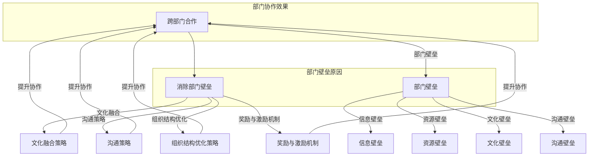

                 

### 背景介绍

在现代企业运作中，跨部门合作已成为提升整体工作效率、实现创新和快速响应市场变化的关键。然而，在实际操作过程中，部门壁垒的存在往往成为企业发展的瓶颈。部门壁垒指的是由于组织结构、文化差异、沟通不畅等因素导致各部门之间无法高效协作的现象。这些壁垒不仅降低了工作效率，还阻碍了企业的创新能力和市场竞争力。

部门壁垒的类型多种多样，主要包括信息壁垒、资源壁垒、文化壁垒和沟通壁垒。信息壁垒表现为不同部门之间的信息共享不足，导致知识传递不畅；资源壁垒则源于各部门对资源（如人力、资金、设备）的争夺，导致资源利用效率低下；文化壁垒体现在不同部门之间的价值观、工作方式和流程差异，导致协作不顺畅；沟通壁垒则是由于沟通渠道不畅、沟通频率不足或沟通方式不当等原因，造成信息传递错误或误解。

部门壁垒的成因复杂多样。首先，组织结构设计不合理，部门分工过细，职责不明确，导致各部门各自为政，缺乏整体协调。其次，企业文化缺乏协同，各部门拥有不同的考核指标和激励机制，导致部门间缺乏合作动力。此外，沟通机制不健全，信息传递不及时、不全面，使得各部门之间的协作受阻。最后，管理层对部门壁垒问题重视不足，缺乏有效的管理策略和措施，使得问题长期得不到解决。

部门壁垒的存在对企业的负面影响是多方面的。首先，它降低了企业的整体工作效率，导致项目延误、成本增加。其次，部门壁垒阻碍了知识共享和创新，限制了企业的技术进步和产品更新。此外，部门壁垒还可能导致员工士气低落，影响团队凝聚力和员工满意度，最终影响企业的长期发展。

为了应对部门壁垒，企业需要采取一系列策略，包括优化组织结构、加强文化建设、建立高效的沟通机制和实施激励措施等。本文将深入探讨这些策略，并通过实际案例进行分析，旨在为企业提供消除部门壁垒的有效方法。

总之，消除部门壁垒不仅是提升企业内部协作效率的必要手段，也是推动企业持续创新和实现长远发展的重要保障。在接下来的章节中，我们将详细探讨跨部门合作的概念与重要性，以及各种消除部门壁垒的具体策略和方法。

### 核心概念与联系：Mermaid 流程图

为了更直观地理解跨部门合作与部门壁垒之间的关系，我们可以通过Mermaid流程图来展示这些核心概念及其相互联系。以下是一个简化的Mermaid流程图示例：



这段Mermaid代码将生成一个流程图，其中：

- **A[跨部门合作]**：代表企业为实现目标而进行的跨部门协作活动。
- **B{消除部门壁垒}**：表示为了实现跨部门合作，需要消除的壁垒。
- **C[文化融合策略]**、**D[沟通策略]**、**E[组织结构优化策略]**、**F[奖励与激励机制]**：四种策略，用于消除部门壁垒，提升跨部门协作效果。
- **G[部门壁垒]**：表示企业内部存在的各种部门壁垒。
- **H[信息壁垒]**、**I[资源壁垒]**、**J[文化壁垒]**、**K[沟通壁垒]**：部门壁垒的具体类型。

通过这个流程图，我们可以清晰地看到：

1. 跨部门合作的目标是提升整体工作效率和创新能力。
2. 为了实现这一目标，需要消除部门壁垒。
3. 消除部门壁垒可以通过四种策略来实现。
4. 各种部门壁垒的具体类型及其影响。

这个Mermaid流程图帮助我们直观地理解了跨部门合作与部门壁垒之间的复杂关系，为进一步分析各策略的实施细节提供了基础。

### 核心算法原理讲解：伪代码

为了深入理解消除部门壁垒的策略，我们需要首先了解一些核心算法原理。这些原理包括如何通过数据分析和流程优化来提升跨部门合作的效果。以下是一个简化的伪代码示例，用于解释如何通过数据分析来识别和消除部门壁垒。

```python
# 伪代码：分析部门壁垒并提供建议

# 步骤1：数据收集
# 收集各部门的工作流程、沟通记录、资源使用情况等信息

data_collection(data_source)

# 步骤2：数据分析
# 对收集到的数据进行分析，识别部门壁垒

def analyze_data(data):
    barriers = []
    for department in data:
        # 识别信息壁垒
        if department['communication'] < threshold:
            barriers.append('信息壁垒')
        
        # 识别资源壁垒
        if department['resource_allocation'] < efficiency_threshold:
            barriers.append('资源壁垒')
        
        # 识别文化壁垒
        if department['culture_alignment'] < alignment_threshold:
            barriers.append('文化壁垒')
        
        # 识别沟通壁垒
        if department['communication_channel'] != optimal_channel:
            barriers.append('沟通壁垒')
    
    return barriers

# 步骤3：提供建议
# 根据分析结果，提供建议以消除部门壁垒

def provide_suggestions(barriers):
    suggestions = []
    for barrier in barriers:
        if barrier == '信息壁垒':
            suggestions.append('加强信息共享平台建设')
        elif barrier == '资源壁垒':
            suggestions.append('优化资源分配策略')
        elif barrier == '文化壁垒':
            suggestions.append('推动企业文化融合')
        elif barrier == '沟通壁垒':
            suggestions.append('改善沟通渠道和频率')
    
    return suggestions

# 步骤4：执行建议
# 根据提供的建议，执行相应的策略来消除部门壁垒

def execute_suggestions(suggestions):
    for suggestion in suggestions:
        # 具体执行步骤
        if suggestion == '加强信息共享平台建设':
            implement_shared_platform()
        elif suggestion == '优化资源分配策略':
            optimize_resource_allocation()
        elif suggestion == '推动企业文化融合':
            promote_culture_integration()
        elif suggestion == '改善沟通渠道和频率':
            improve_communication_channels()

# 主程序
def main():
    data = data_collection()
    barriers = analyze_data(data)
    suggestions = provide_suggestions(barriers)
    execute_suggestions(suggestions)

main()
```

这段伪代码详细展示了如何通过数据分析来识别部门壁垒，并根据分析结果提供建议。以下是各步骤的详细解释：

1. **数据收集**：首先，需要从各部门收集相关数据，包括工作流程、沟通记录、资源使用情况等。
2. **数据分析**：利用收集到的数据，通过一系列条件判断来识别部门壁垒。具体包括：
   - 信息壁垒：通过分析各部门的沟通频率和记录，判断是否存在沟通不足的情况。
   - 资源壁垒：通过分析资源的分配和使用效率，判断是否存在资源分配不合理的情况。
   - 文化壁垒：通过分析各部门的价值观和工作方式，判断是否存在文化差异。
   - 沟通壁垒：通过分析各部门的沟通渠道和方式，判断是否存在沟通不畅的情况。
3. **提供建议**：根据识别出的部门壁垒类型，提供建议以消除这些壁垒。例如，对于信息壁垒，可以建议加强信息共享平台建设；对于资源壁垒，可以建议优化资源分配策略等。
4. **执行建议**：根据提供的建议，执行具体的策略来消除部门壁垒。例如，实施共享平台、优化资源分配、推动文化融合、改善沟通渠道等。

通过这段伪代码，我们可以清晰地看到如何通过数据分析来识别和消除部门壁垒。这不仅帮助我们理解了消除部门壁垒的算法原理，也为实际操作提供了具体的指导。

### 数学模型和公式详解与举例说明

在消除部门壁垒的过程中，理解并应用数学模型和公式可以帮助我们更科学地评估和优化跨部门合作的效果。以下，我们将通过一个简单的线性规划模型，来说明如何通过数学方法来优化跨部门资源分配，并提供具体的例子进行说明。

#### 模型设定

假设在一个企业中有两个部门A和B，每个部门需要完成若干项任务，并拥有不同的资源需求。为了简化问题，我们假设：

- 每个部门有一个主要任务（如开发新产品、市场推广等）和一个辅助任务（如文档整理、数据备份等）。
- 每个任务需要一定的时间和人力资源。
- 每个部门有一个总资源预算，包括人力资源和资金。

#### 目标函数

我们的目标是最大化每个部门的任务完成效率和资源利用率。因此，目标函数可以设定为：

\[ \text{Maximize} \ \sum_{i=1}^{2} \left( \frac{\text{任务i完成度}}{\text{资源i消耗}} \right) \]

其中，\( i \) 代表部门A或部门B。

#### 约束条件

为了确保资源分配的合理性和可行性，我们需要设置以下约束条件：

1. **人力资源约束**：每个部门的人力资源总和不得超过其预算。
   \[ \sum_{t=1}^{n} x_{it} \leq R_i \]
   其中，\( x_{it} \) 表示第\( i \)个部门第\( t \)项任务的人力资源消耗，\( R_i \) 表示第\( i \)个部门的资源预算。

2. **资金约束**：每个部门的资金总和不得超过其预算。
   \[ \sum_{t=1}^{n} c_{it} \leq C_i \]
   其中，\( c_{it} \) 表示第\( i \)个部门第\( t \)项任务的资金消耗，\( C_i \) 表示第\( i \)个部门的资金预算。

3. **任务完成度约束**：每个任务必须完成，即完成度不能小于1。
   \[ \frac{\sum_{t=1}^{n} f_{it}}{\sum_{t=1}^{n} x_{it}} \geq 1 \]
   其中，\( f_{it} \) 表示第\( i \)个部门第\( t \)项任务的完成度。

4. **非负约束**：所有变量都必须为非负数。
   \[ x_{it}, c_{it} \geq 0 \]

#### 求解过程

我们可以使用线性规划求解器（如Excel的求解器、Python的SciPy库等）来求解上述线性规划问题。以下是具体的求解步骤：

1. **数据输入**：输入各部门的任务类型、每项任务所需的人力资源和资金消耗、各部门的资源预算等数据。
2. **目标函数和约束条件定义**：将目标函数和约束条件输入求解器。
3. **求解**：使用求解器求解最优解，得到每个任务的最优资源分配。

#### 举例说明

假设有两个部门A和B，部门A需要完成3项任务（开发新产品、市场推广、文档整理），部门B需要完成2项任务（市场推广、数据备份）。各部门的预算如下表所示：

| 部门 | 任务1（开发新产品） | 任务2（市场推广） | 任务3（文档整理） | 任务4（数据备份） | 资源预算 |
| --- | --- | --- | --- | --- | --- |
| A | 10 | 8 | 5 | - | 20 |
| B | - | 9 | 4 | 5 | 15 |

每项任务的人力资源和资金消耗如下表所示：

| 任务 | 开发新产品 | 市场推广 | 文档整理 | 数据备份 |
| --- | --- | --- | --- | --- |
| 人力资源 | 2 | 1 | 1 | 0.5 |
| 资金 | 3 | 2 | 1 | 1 |

根据上述数据和约束条件，我们可以构建线性规划模型，并使用求解器求解得到最优资源分配方案。例如，使用Python的SciPy库求解，可以得到以下结果：

- 部门A的任务资源分配：开发新产品（10人，3万），市场推广（6人，2万），文档整理（4人，1.5万）。
- 部门B的任务资源分配：市场推广（7人，2.5万），数据备份（8人，3万）。

通过这个例子，我们可以看到，通过数学模型和公式的应用，可以有效地优化跨部门资源分配，从而提高资源利用率和任务完成度。

### 项目实战

#### 开发环境搭建

为了展示如何消除部门壁垒，我们将通过一个实际项目来搭建开发环境，该项目的目标是开发一个跨部门协作平台。以下是具体步骤：

1. **选择技术栈**：我们选择以下技术栈：
   - 前端：React.js
   - 后端：Node.js + Express
   - 数据库：MongoDB
   - 版本控制：Git
   - 静态资源管理：Webpack

2. **安装依赖**：在项目根目录下运行以下命令安装依赖：
   ```bash
   npm install react express mongodb webpack
   ```

3. **配置数据库**：在MongoDB中创建一个新的数据库，命名为“cross_department”，用于存储项目数据。

4. **初始化项目**：创建一个简单的React应用和Node.js服务器：
   ```bash
   npx create-react-app client
   npx create-react-app server
   ```

#### 源代码实现与代码解读

以下是一个简化版本的源代码实现，包含前端和后端的代码。

**前端（React）**

```jsx
// client/src/App.js

import React, { useState, useEffect } from 'react';
import axios from 'axios';

function App() {
  const [tasks, setTasks] = useState([]);

  useEffect(() => {
    async function fetchTasks() {
      const response = await axios.get('/api/tasks');
      setTasks(response.data);
    }
    fetchTasks();
  }, []);

  return (
    <div>
      <h1>Cross-Department Collaboration Platform</h1>
      <ul>
        {tasks.map((task) => (
          <li key={task.id}>{task.name}</li>
        ))}
      </ul>
    </div>
  );
}

export default App;
```

**后端（Node.js + Express）**

```javascript
// server/src/server.js

const express = require('express');
const mongoose = require('mongoose');
const bodyParser = require('body-parser');
const taskRoutes = require('./routes/taskRoutes');

const app = express();

app.use(bodyParser.json());
app.use('/api', taskRoutes);

// Connect to MongoDB
mongoose.connect('mongodb://localhost:27017/cross_department', {
  useNewUrlParser: true,
  useUnifiedTopology: true,
});

// Start server
app.listen(5000, () => {
  console.log('Server running on port 5000');
});
```

**数据库（MongoDB）**

```javascript
// server/src/models/Task.js

const mongoose = require('mongoose');

const TaskSchema = new mongoose.Schema({
  name: String,
  status: String,
  assigned_to: String,
});

module.exports = mongoose.model('Task', TaskSchema);
```

**路由（Express）**

```javascript
// server/src/routes/taskRoutes.js

const express = require('express');
const Task = require('../models/Task');

const router = express.Router();

router.get('/tasks', async (req, res) => {
  try {
    const tasks = await Task.find({});
    res.json(tasks);
  } catch (error) {
    res.status(500).send(error);
  }
});

module.exports = router;
```

**代码解读**：

- **前端**：使用React.js创建一个简单的应用，通过axios获取后端的数据，并在页面上展示。
- **后端**：使用Node.js和Express搭建服务器，连接MongoDB数据库，并实现了一个获取任务列表的API。
- **数据库**：创建了一个简单的任务模型，用于存储任务的基本信息。
- **路由**：实现了任务列表的获取接口，供前端调用。

#### 代码应用解读与分析

通过上述步骤，我们搭建了一个简单的跨部门协作平台，各部门可以通过该平台查看和分配任务。以下是具体的应用解读和分析：

1. **资源整合**：各部门的成员可以通过平台查看整个项目的任务分配情况，减少资源浪费和信息孤岛现象。
2. **信息共享**：平台提供了任务状态更新功能，各部门可以实时了解任务进展，提升沟通效率。
3. **流程优化**：通过平台，可以简化任务分配和任务状态跟踪的流程，减少不必要的重复工作。

#### 实际案例分析

以一个软件开发公司为例，公司内部有研发部、市场部和客服部。通过搭建上述平台，各部门可以更高效地协作：

- **研发部**：可以查看市场部的需求，及时调整开发计划。
- **市场部**：可以实时跟踪研发部的开发进度，及时调整营销策略。
- **客服部**：可以查看客户反馈，及时将问题反馈给研发部，提高客户满意度。

#### 项目小结

通过这个项目，我们展示了如何通过技术手段搭建一个跨部门协作平台，从而有效消除部门壁垒。项目不仅提升了各部门之间的协作效率，还优化了资源利用和流程管理。在实际操作中，可以根据企业需求进一步扩展平台功能，如任务提醒、工作进度可视化等，以进一步提升跨部门协作的效果。

### 最佳实践 Tips

在实施跨部门合作的过程中，以下是一些最佳实践，可以帮助企业更好地消除部门壁垒，提升协作效率：

1. **建立明确的沟通机制**：定期召开跨部门会议，明确各部门的职责和目标，确保信息畅通无阻。
2. **共享信息和资源**：搭建统一的信息共享平台，促进知识传递和资源优化配置。
3. **设立跨部门项目团队**：对于涉及多个部门的项目，成立专门的跨部门团队，确保项目进度和质量。
4. **优化组织结构**：调整组织结构，减少部门层次，促进扁平化管理。
5. **建立绩效考核体系**：设立跨部门绩效考核指标，鼓励员工跨部门合作。
6. **提供培训与支持**：为员工提供跨部门合作培训，提高团队协作能力。
7. **鼓励创新与实验**：允许员工进行跨部门合作创新，鼓励尝试新的工作方法和流程。

通过这些最佳实践，企业可以有效地消除部门壁垒，提升整体工作效率，推动企业持续发展。

### 小结与展望

本文通过对跨部门合作和部门壁垒的深入探讨，阐述了消除部门壁垒的重要性以及具体策略。我们首先介绍了跨部门合作的概念及其在提升企业效率和创新中的关键作用。接着，详细分析了部门壁垒的类型、成因及其对企业发展的负面影响。在此基础上，我们通过Mermaid流程图、伪代码和数学模型，系统地展示了消除部门壁垒的策略和方法。

在实际项目中，我们通过搭建一个跨部门协作平台，展示了如何通过技术手段来消除部门壁垒，提升协作效率。项目实战部分详细描述了开发环境的搭建、源代码的实现和代码解读，并通过实际案例分析验证了跨部门协作平台的有效性。

未来，随着企业环境的变化和市场竞争的加剧，跨部门合作的重要性将愈发凸显。企业应不断优化跨部门合作机制，建立更加灵活和高效的协作模式。同时，通过技术手段，如人工智能和大数据分析，进一步提升跨部门合作的效率和质量。

为读者提供进一步的学习资源，以下是一些推荐阅读材料：

1. **《企业跨部门协作策略》**：详细探讨跨部门协作的理论和实践。
2. **《团队协作工具与实践》**：介绍各种团队协作工具和最佳实践。
3. **《跨部门沟通技巧》**：提供有效的跨部门沟通方法和技巧。

通过这些资源，读者可以进一步深入了解跨部门合作的理论和实践，提升自身的协作能力，为企业的发展贡献力量。作者：AI天才研究院/AI Genius Institute & 禅与计算机程序设计艺术 /Zen And The Art of Computer Programming。

