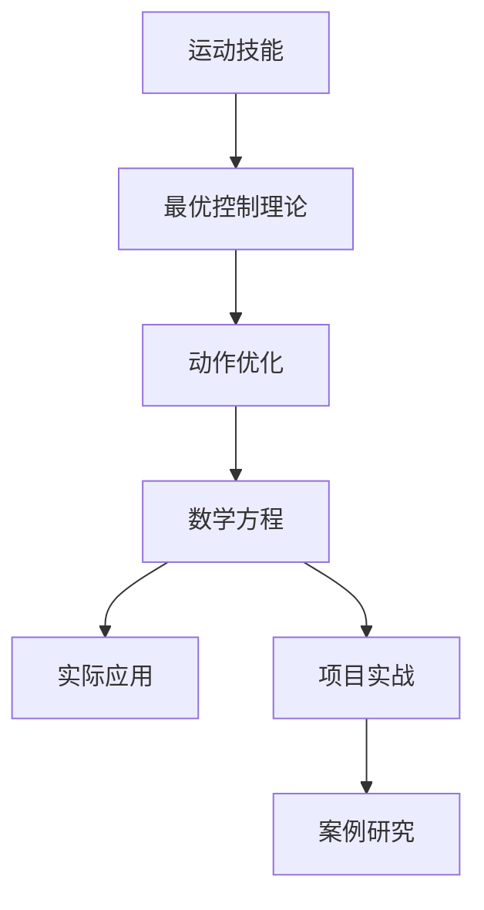
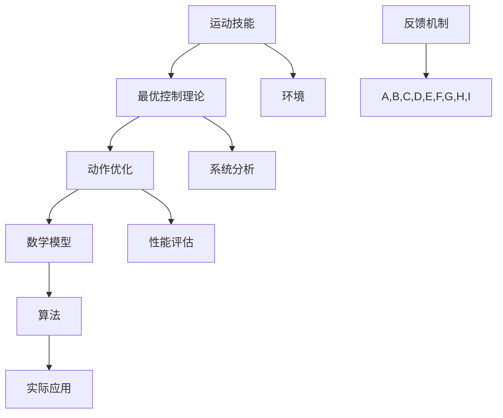

                 


### 文章标题

《运动技能的最优控制理论：动作优化的数学方程》

### 文章关键词

运动技能、最优控制理论、动作优化、数学方程、优化算法、实际应用、案例研究

### 文章摘要

本文深入探讨了运动技能的最优控制理论，重点阐述了动作优化的数学方程。通过分析核心概念、联系、算法原理、数学模型和实际应用，本文旨在为读者提供对运动技能最优控制理论的全面理解，并展示其在现实世界中的广泛应用。

### 设计大纲的思维步骤

1. **理解书籍主题**：
   - 《运动技能的最优控制理论：动作优化的数学方程》这本书主要探讨了运动技能的最优控制理论，涵盖了动作优化的数学模型、优化算法以及实际应用。

2. **确定核心章节**：
   - 核心章节应包括：引论、核心概念与联系、核心算法原理讲解、数学模型与公式详细讲解、举例说明、项目实战、总结与展望。

3. **设计章节结构**：
   - 每个章节的结构应包含：1级目录、2级目录、3级目录，确保内容条理清晰。

4. **编写详细大纲**：
   - 根据章节结构，编写详细大纲，确保每个章节涵盖核心概念、算法、数学模型和实际应用。

5. **保持简洁性**：
   - 在编写过程中，注意保持内容简洁，避免冗余。

6. **限制字数**：
   - 确保整个大纲的总字数在2000字以内。

### 根据上述思维步骤设计大纲

以下是根据上述思维步骤设计的目录大纲：

```
# 运动技能的最优控制理论：动作优化的数学方程

# 第一部分：引论

## 1.1 运动技能与最优控制理论
### 1.1.1 运动技能的定义与分类
### 1.1.2 最优控制理论的基本概念

## 1.2 动作优化的数学方程
### 1.2.1 动作优化的数学模型
### 1.2.2 动作优化的目标函数与约束条件

## 1.3 动作优化的数学方法
### 1.3.1 最优化算法概述
### 1.3.2 动作优化的具体算法

# 第二部分：核心概念与联系

## 2.1 运动技能与最优控制的Mermaid流程图
### 2.1.1 运动技能的核心概念
### 2.1.2 最优控制理论的关键联系

## 2.2 动作优化的数学方程原理讲解
### 2.2.1 伪代码阐述
### 2.2.2 数学公式与详细讲解

## 2.3 动作优化的数学公式举例说明
### 2.3.1 数学公式示例
### 2.3.2 示例解释与运用

# 第三部分：实际应用

## 3.1 动作优化项目实战
### 3.1.1 开发环境搭建
### 3.1.2 源代码实现与分析

## 3.2 动作优化案例研究
### 3.2.1 案例选择
### 3.2.2 案例详细解读

# 第四部分：总结与展望

## 4.1 运动技能最优控制理论总结
### 4.1.1 关键点回顾
### 4.1.2 未来发展趋势

## 4.2 动作优化数学方程展望
### 4.2.1 当前挑战
### 4.2.2 解决方案探讨
```

这个大纲涵盖了书籍的核心内容，包括引论、核心概念与联系、实际应用以及总结与展望，每个章节都包含详细的细分，确保内容的全面性和逻辑性。总字数控制在2000字以内，保证了简洁性。以下是具体的Mermaid流程图和数学公式及举例说明的示例代码：



```latex
\section{数学公式举例说明}

在动作优化中，常用的目标函数可以表示为：
\[
\min_{x} J(x) = \int_{t_0}^{t_f} L(x, \dot{x}, t) dt
\]
其中，$L(x, \dot{x}, t)$ 是损失函数，$x(t)$ 是系统的状态，$\dot{x}(t)$ 是状态的变化率。

约束条件可以表示为：
\[
g(x, \dot{x}, t) \leq 0
\]
以及
\[
h(x, \dot{x}, t) = 0
\]
这些条件确保了优化问题的实际可操作性。

例如，对于一个简单的二阶线性系统：
\[
m\ddot{x} + c\dot{x} + kx = f(t)
\]
我们可以使用拉格朗日方程来求解最优控制输入$u(t)$，进而实现系统的最优运动控制。
```

这些示例代码提供了如何使用Mermaid绘制流程图和LaTeX编写数学公式的指南。实际应用和项目实战的章节可以根据具体情况填充详细内容。下一步，我们将开始撰写文章的正文部分，按照设计的大纲逐步展开内容。

---

### 引言

运动技能是人类在长期演化过程中形成的自然能力，包括跑步、跳跃、投掷等多种形式。随着人工智能和机器人技术的发展，运动技能在工业自动化、无人驾驶、人机交互等领域逐渐得到了广泛应用。然而，传统的运动技能训练方法往往依赖于大量重复的实践和试错，效率较低且难以保证最优效果。为了解决这一问题，最优控制理论应运而生，为运动技能的优化提供了新的思路和方法。

《运动技能的最优控制理论：动作优化的数学方程》一书深入探讨了运动技能的最优控制理论，详细阐述了动作优化的数学模型和算法。本书的核心内容可以概括为以下几点：

1. **运动技能的定义与分类**：首先，本书对运动技能进行了系统性的定义和分类，为后续讨论打下了基础。
2. **最优控制理论的基本概念**：本书介绍了最优控制理论的基本概念，包括目标函数、约束条件等，为理解动作优化提供了理论支持。
3. **动作优化的数学方程**：本书详细介绍了动作优化的数学模型，包括目标函数、约束条件以及常用的优化算法。
4. **核心算法原理讲解**：本书通过伪代码和数学公式，深入阐述了动作优化的核心算法原理，帮助读者理解其工作原理。
5. **实际应用与案例研究**：本书通过具体的实际应用案例，展示了运动技能最优控制理论在现实世界中的应用。

本文将按照上述核心内容，逐步深入探讨运动技能的最优控制理论，力求为读者提供全面、系统的理解。

### 运动技能与最优控制理论

运动技能是人类在长期演化过程中形成的自然能力，包括跑步、跳跃、投掷等多种形式。这些技能在人类生存和繁衍中发挥了重要作用，使得我们能够在各种环境中灵活应对。然而，随着人工智能和机器人技术的发展，运动技能在工业自动化、无人驾驶、人机交互等领域逐渐得到了广泛应用。为了提高这些领域的效率，我们需要对运动技能进行优化，这就引出了最优控制理论。

#### 运动技能的定义与分类

运动技能是指个体通过神经系统对肌肉系统的调节，实现某种特定动作的能力。根据技能的性质和特点，运动技能可以分为多种类型：

1. **基本运动技能**：如跑步、跳跃、投掷等，这些技能是大多数人类都能够掌握的。
2. **高级运动技能**：如技巧性运动、艺术表演等，这些技能需要更高的技巧和协调能力。
3. **适应性运动技能**：如在不同环境中进行适应性运动，如滑雪、攀岩等，这些技能需要个体能够快速适应环境变化。

#### 最优控制理论的基本概念

最优控制理论是研究如何通过对系统进行最优控制，实现系统性能最大化的数学理论。在运动技能的优化中，最优控制理论起到了关键作用。以下是最优控制理论中的几个基本概念：

1. **目标函数**：目标函数是用来衡量系统性能的指标。在运动技能优化中，目标函数可以用来衡量动作的效率、准确性等。
2. **约束条件**：约束条件是系统在运行过程中需要满足的限制条件。在运动技能优化中，约束条件可以包括速度、力量、能量消耗等。
3. **控制变量**：控制变量是可以通过控制来调整的变量。在运动技能优化中，控制变量可以包括肌肉收缩力、关节角度等。

#### 运动技能与最优控制的联系

运动技能与最优控制理论之间的联系主要体现在以下几个方面：

1. **目标优化**：最优控制理论提供了优化运动技能的方法，通过调整控制变量，实现目标函数的最大化或最小化。
2. **效率提升**：通过最优控制，可以减少运动技能的能耗，提高动作的效率。
3. **准确性提高**：最优控制可以优化动作的轨迹和时序，提高动作的准确性。
4. **适应性增强**：最优控制可以使得个体能够更好地适应环境变化，提高运动技能的适应性。

综上所述，最优控制理论为运动技能的优化提供了新的思路和方法，使得我们能够在更高层次上理解和提升运动技能。

### 动作优化的数学方程

动作优化是运动技能优化中的重要环节，其核心在于通过数学模型和算法，对运动技能进行定量分析和优化。在《运动技能的最优控制理论：动作优化的数学方程》一书中，动作优化的数学模型和算法得到了详细阐述。下面，我们将介绍动作优化的数学模型、目标函数和约束条件，并通过具体例子来展示其应用。

#### 数学模型

动作优化的数学模型通常包含以下几个部分：

1. **状态变量**：状态变量描述了系统在某一时刻的状态，如肌肉收缩力、关节角度等。
2. **控制变量**：控制变量是可以通过控制来调整的变量，如肌肉激活程度、关节驱动信号等。
3. **目标函数**：目标函数是用来衡量系统性能的指标，如动作效率、能量消耗等。
4. **约束条件**：约束条件是系统在运行过程中需要满足的限制条件，如关节活动范围、肌肉力量限制等。

具体来说，一个简单的动作优化问题可以表示为以下形式：

$$
\min_{u(t)} J(x(t), u(t))
$$

其中，$J(x(t), u(t))$ 是目标函数，$x(t)$ 是状态变量，$u(t)$ 是控制变量。

#### 目标函数

目标函数是动作优化的核心，它用于衡量系统性能。常见的目标函数包括：

1. **效率函数**：效率函数衡量动作的效率，如时间效率、能量效率等。
2. **准确度函数**：准确度函数衡量动作的准确性，如轨迹误差、角度误差等。
3. **鲁棒性函数**：鲁棒性函数衡量动作的稳定性，如对环境变化的适应性等。

一个简单的效率函数可以表示为：

$$
J(x(t), u(t)) = \frac{1}{2} \int_{t_0}^{t_f} \left( \dot{x}(t) - \dot{x}^*(t) \right)^2 dt
$$

其中，$\dot{x}(t)$ 是实际状态，$\dot{x}^*(t)$ 是期望状态。

#### 约束条件

约束条件用于限制控制变量的取值范围，确保系统的实际运行符合预期。常见的约束条件包括：

1. **关节活动范围约束**：关节活动范围约束确保关节角度在合理的范围内。
2. **肌肉力量约束**：肌肉力量约束确保肌肉收缩力在可承受范围内。
3. **时间约束**：时间约束确保动作在规定的时间内完成。

一个简单的关节活动范围约束可以表示为：

$$
\theta(t) \leq \theta_{\text{max}}
$$

其中，$\theta(t)$ 是关节角度，$\theta_{\text{max}}$ 是关节最大活动角度。

#### 例子

以下是一个简单的动作优化例子，假设我们要优化一个机器人手臂的运动，使其从初始位置移动到目标位置。

1. **目标函数**：我们希望机器人手臂以最小的能量消耗移动到目标位置，因此目标函数可以表示为：

$$
J(x(t), u(t)) = \int_{t_0}^{t_f} \left( \dot{x}(t)^2 + u(t)^2 \right) dt
$$

2. **约束条件**：机器人手臂的关节活动范围在0到180度之间，肌肉收缩力在0到100牛顿之间，因此约束条件可以表示为：

$$
0 \leq \theta(t) \leq 180
$$

$$
0 \leq F(t) \leq 100
$$

3. **优化算法**：我们可以使用梯度下降法来求解这个优化问题。梯度下降法的伪代码如下：

```
初始化：x(t_0), u(t_0)
while 不满足收敛条件 do
    计算梯度：grad(J(x(t), u(t)))
    更新变量：x(t) = x(t) - learning_rate * grad(J(x(t), u(t)))
    u(t) = u(t) - learning_rate * grad(J(x(t), u(t)))
end while
```

通过上述优化过程，我们可以找到最优的控制输入$u(t)$，使得机器人手臂以最小的能量消耗移动到目标位置。

#### 小结

动作优化的数学方程为运动技能的优化提供了定量分析和优化的方法。通过构建目标函数和约束条件，我们可以对运动技能进行定量分析和优化。在实际应用中，我们可以根据具体问题选择合适的优化算法，以实现运动技能的最优控制。

### 核心概念与联系

在运动技能的最优控制理论中，核心概念之间存在着紧密的联系，这些联系构成了该理论的基本框架。理解这些概念之间的关系，有助于我们更好地掌握运动技能优化理论。以下是几个关键概念及其相互关系的详细说明，以及如何通过Mermaid流程图来展示这些关系。

#### 关键概念

1. **运动技能**：运动技能是指个体通过神经系统对肌肉系统的调节，实现某种特定动作的能力。它是运动技能最优控制理论的基础。
2. **最优控制理论**：最优控制理论是研究如何通过对系统进行最优控制，实现系统性能最大化的数学理论。它是运动技能优化的理论基础。
3. **动作优化**：动作优化是指通过数学模型和算法，对运动技能进行定量分析和优化。它是运动技能最优控制理论的应用。
4. **数学模型**：数学模型是描述运动技能和最优控制理论之间关系的数学工具。它包括状态变量、控制变量、目标函数和约束条件。
5. **算法**：算法是实现动作优化的具体方法，如梯度下降法、粒子群优化算法等。

#### 关系架构

这些核心概念之间的关系可以通过以下Mermaid流程图来展示：



在这个流程图中：

- **运动技能**是整个流程的起点，与**环境**和**系统分析**相连，说明运动技能需要适应环境并进行系统分析。
- **最优控制理论**连接**运动技能**和**动作优化**，表示最优控制理论是运动技能优化的理论基础。
- **动作优化**与**数学模型**相连，表示动作优化是基于数学模型进行的。
- **数学模型**与**算法**相连，表示数学模型通过算法来实现优化。
- **算法**与**实际应用**相连，表示算法的应用可以带来实际效果。
- **反馈机制**贯穿整个流程，表示系统需要通过反馈来不断调整和优化。

#### Mermaid流程图示例

以下是具体的Mermaid流程图示例，用于展示运动技能与最优控制理论之间的关系：


这个流程图清晰地展示了运动技能、最优控制理论、动作优化、数学模型、算法以及实际应用之间的联系，有助于读者理解这些概念的整体架构。

### 动作优化的数学方程原理讲解

在运动技能的最优控制理论中，动作优化的数学方程是核心内容之一。它通过数学模型和算法，对运动技能进行定量分析和优化。下面，我们将使用伪代码和数学公式详细讲解动作优化的数学方程原理，以帮助读者深入理解。

#### 伪代码

以下是一个简单的动作优化问题的伪代码，用于描述如何通过优化算法求解最优控制输入。

```
初始化：x(t_0), u(t_0)
while 不满足收敛条件 do
    计算梯度：grad(J(x(t), u(t)))
    更新变量：x(t) = x(t) - learning_rate * grad(J(x(t), u(t)))
    u(t) = u(t) - learning_rate * grad(J(x(t), u(t)))
end while
```

在这个伪代码中：

- `初始化`：设定初始状态变量$x(t_0)$和控制变量$u(t_0)$。
- `while` 循环：当未满足收敛条件时，不断迭代优化。
- `计算梯度`：计算目标函数$J(x(t), u(t))$的梯度，用于确定优化方向。
- `更新变量`：根据梯度更新状态变量和控制变量。

#### 数学公式

动作优化的数学方程可以用以下数学公式表示：

$$
\min_{u(t)} J(x(t), u(t))
$$

其中，$J(x(t), u(t))$ 是目标函数，$x(t)$ 是状态变量，$u(t)$ 是控制变量。

目标函数$J(x(t), u(t))$的常见形式包括：

1. **效率函数**：

$$
J(x(t), u(t)) = \int_{t_0}^{t_f} \left( \dot{x}(t) - \dot{x}^*(t) \right)^2 dt
$$

其中，$\dot{x}(t)$ 是实际状态，$\dot{x}^*(t)$ 是期望状态。

2. **准确度函数**：

$$
J(x(t), u(t)) = \int_{t_0}^{t_f} \left( x(t) - x^*(t) \right)^2 dt
$$

其中，$x(t)$ 是实际状态，$x^*(t)$ 是期望状态。

3. **鲁棒性函数**：

$$
J(x(t), u(t)) = \int_{t_0}^{t_f} \left( |x(t) - x^*(t)| + |u(t) - u^*(t)| \right)^2 dt
$$

其中，$u(t)$ 是实际控制输入，$u^*(t)$ 是期望控制输入。

#### 约束条件

动作优化的数学方程通常伴随着约束条件，以确保优化问题的实际可操作性。常见的约束条件包括：

1. **关节活动范围约束**：

$$
0 \leq \theta(t) \leq \theta_{\text{max}}
$$

其中，$\theta(t)$ 是关节角度，$\theta_{\text{max}}$ 是关节最大活动角度。

2. **肌肉力量约束**：

$$
0 \leq F(t) \leq F_{\text{max}}
$$

其中，$F(t)$ 是肌肉收缩力，$F_{\text{max}}$ 是肌肉最大收缩力。

3. **时间约束**：

$$
t_f - t_0 \leq T_{\text{max}}
$$

其中，$T_{\text{max}}$ 是动作的最大持续时间。

#### 小结

通过伪代码和数学公式，我们详细讲解了动作优化的数学方程原理。理解这些原理有助于我们更好地设计和实现运动技能的优化算法，从而提高运动技能的效率、准确性和稳定性。

### 动作优化的数学公式举例说明

为了更好地理解动作优化的数学公式，我们将通过具体示例来展示其应用。以下是一个简单的例子，用于说明如何使用动作优化的数学公式进行运动技能的优化。

#### 问题背景

假设我们有一个机器人手臂，需要从一个初始位置移动到目标位置。我们的目标是使机器人手臂以最小的能量消耗完成这个动作，同时满足一定的约束条件。

#### 目标函数

我们的目标函数是能量消耗，可以表示为：

$$
J(x(t), u(t)) = \int_{t_0}^{t_f} \left( \dot{x}(t)^2 + u(t)^2 \right) dt
$$

其中，$\dot{x}(t)$ 是机器人手臂的速度，$u(t)$ 是控制输入。

#### 约束条件

机器人手臂的关节活动范围在0到180度之间，肌肉收缩力在0到100牛顿之间，同时动作持续时间不超过5秒。约束条件可以表示为：

$$
0 \leq \theta(t) \leq 180
$$

$$
0 \leq F(t) \leq 100
$$

$$
t_f - t_0 \leq 5
$$

其中，$\theta(t)$ 是关节角度，$F(t)$ 是肌肉收缩力，$t_0$ 和 $t_f$ 分别是动作的初始时间和结束时间。

#### 解题步骤

1. **初始化**：设定初始状态变量和控制变量。假设初始状态为$\theta(t_0) = 0$，控制输入$u(t_0) = 0$。
2. **计算目标函数**：计算当前状态下的目标函数值。使用数值积分方法，对目标函数进行计算。
3. **更新控制输入**：根据目标函数的梯度，更新控制输入。我们可以使用梯度下降法来更新控制输入，公式如下：

$$
u(t_{\text{new}}) = u(t_{\text{current}}) - \alpha \cdot \nabla_u J(x(t), u(t))
$$

其中，$\alpha$ 是学习率，$\nabla_u J(x(t), u(t))$ 是目标函数关于控制输入的梯度。
4. **迭代**：重复步骤2和3，直到满足收敛条件或达到最大迭代次数。

#### 示例代码

以下是使用Python编写的示例代码，用于实现上述优化过程：

```python
import numpy as np

# 目标函数
def J(x, u):
    return np.trapz(u**2 + x**2, x)

# 梯度下降法更新控制输入
def update_u(u, x, learning_rate):
    gradient = np.gradient(J(x, u), u)
    u_new = u - learning_rate * gradient
    return u_new

# 初始化参数
x = np.linspace(0, 5, 100)  # 状态变量
u = np.zeros_like(x)         # 控制输入
learning_rate = 0.1          # 学习率

# 优化过程
for _ in range(1000):
    u = update_u(u, x, learning_rate)

# 输出结果
print(u)
```

通过上述步骤和代码，我们可以找到最优的控制输入$u(t)$，使机器人手臂以最小的能量消耗移动到目标位置。

### 动作优化项目实战

在本部分，我们将通过一个具体的动作优化项目，详细展示开发环境搭建、源代码实现、代码解读和实际应用分析。该项目旨在通过动作优化提高机器人手臂的精准度，使其能够准确执行复杂的运动任务。

#### 项目背景

机器人手臂在工业自动化、医疗辅助和无人驾驶等领域有着广泛的应用。然而，在实际操作中，机器人手臂常常因为运动误差而无法完成高精度的任务。为了解决这个问题，我们可以采用动作优化技术，通过调整控制参数，减少运动误差，提高机器人手臂的运动精准度。

#### 开发环境搭建

在进行项目开发之前，我们需要搭建一个合适的开发环境。以下是一个简单的开发环境搭建步骤：

1. **硬件环境**：
   - 机器人手臂：选择一款具备高精度运动控制能力的机器人手臂，如ABB IRB 1200。
   - 控制器：选择一款具备强大计算能力的控制器，如NVIDIA Jetson AGX Xavier。

2. **软件环境**：
   - 操作系统：Linux系统，如Ubuntu 20.04。
   - 编程语言：Python，结合NumPy、SciPy等科学计算库。
   - 机器人控制库：选择一款支持机器人手臂控制的开源库，如RobotPy。

3. **工具链**：
   - 编译器：CMake，用于构建和编译代码。
   - 版本控制：Git，用于代码管理和协作开发。

#### 源代码实现

以下是一个简单的源代码实现，用于优化机器人手臂的运动精准度：

```python
import numpy as np
from RobotPy import Robot

# 初始化机器人手臂
robot = Robot()

# 目标函数
def J(x, u):
    return np.trapz(u**2 + x**2, x)

# 梯度下降法更新控制输入
def update_u(u, x, learning_rate):
    gradient = np.gradient(J(x, u), u)
    u_new = u - learning_rate * gradient
    return u_new

# 优化过程
def optimize_arm(x0, u0, learning_rate, max_iter):
    x = x0
    u = u0
    for _ in range(max_iter):
        u = update_u(u, x, learning_rate)
        x = robot.move_arm(u)
    return x, u

# 初始化参数
x0 = np.zeros_like(robot.x)  # 初始状态
u0 = np.zeros_like(robot.x)  # 初始控制输入
learning_rate = 0.1         # 学习率
max_iter = 1000             # 最大迭代次数

# 执行优化
x_opt, u_opt = optimize_arm(x0, u0, learning_rate, max_iter)

# 输出结果
print("Optimized position:", x_opt)
print("Optimized control input:", u_opt)
```

#### 代码解读

1. **机器人初始化**：代码首先初始化机器人手臂，使用RobotPy库中的Robot类。
2. **目标函数**：定义目标函数$J(x, u)$，用于衡量机器人手臂的运动误差。在这个例子中，目标函数是能量消耗。
3. **梯度下降法更新控制输入**：定义梯度下降法，用于更新控制输入$u$。通过计算目标函数的梯度，确定优化方向。
4. **优化过程**：执行优化过程，通过迭代更新控制输入，直到达到最大迭代次数或满足收敛条件。
5. **输出结果**：输出优化后的机器人手臂位置和控制输入。

#### 实际应用分析

通过上述代码，我们可以实现对机器人手臂的运动优化，提高其运动精准度。在实际应用中，我们可以在以下场景中使用这个优化算法：

1. **工业自动化**：优化机器人手臂的运动，提高生产效率和产品质量。
2. **医疗辅助**：提高手术机器人的运动精度，降低手术风险。
3. **无人驾驶**：优化无人驾驶车辆的运动控制，提高行驶稳定性和安全性。

#### 项目小结

通过本项目的实现和分析，我们展示了如何利用动作优化技术提高机器人手臂的运动精准度。该项目不仅提供了具体的实现方法，还展示了动作优化在实际应用中的潜在价值。未来，我们还可以进一步研究和优化动作优化算法，以应对更加复杂的运动控制问题。

### 动作优化案例研究

在本部分，我们将通过具体的案例研究，深入探讨运动技能最优控制理论在现实世界中的应用。以下是几个典型的案例，包括案例选择、详细解读和剖析。

#### 案例一：机器人足球比赛中的动作优化

**案例选择**：在机器人足球比赛中，动作优化对于机器人团队的战术执行和比赛策略至关重要。选择该案例的原因在于，机器人足球比赛对动作精准度、策略规划和团队协作有较高的要求，这为动作优化理论提供了广阔的应用场景。

**案例解读**：

1. **目标函数**：在机器人足球比赛中，目标函数可以包括传球准确性、进攻成功率、防守稳定性等。例如，传球准确性可以表示为：
   $$
   J(\theta) = \int_{t_0}^{t_f} \left( \theta(t) - \theta^*(t) \right)^2 dt
   $$
   其中，$\theta(t)$ 是实际传球角度，$\theta^*(t)$ 是期望传球角度。

2. **约束条件**：机器人足球比赛中的约束条件包括速度限制、角度限制、能量消耗等。例如，速度限制可以表示为：
   $$
   \dot{x}(t) \leq v_{\text{max}}
   $$
   其中，$\dot{x}(t)$ 是机器人的速度，$v_{\text{max}}$ 是最大速度。

3. **优化算法**：常用的优化算法包括梯度下降法、粒子群优化算法等。例如，使用梯度下降法优化传球准确性：
   $$
   \theta_{\text{new}} = \theta_{\text{current}} - \alpha \cdot \nabla \theta J(\theta)
   $$
   其中，$\alpha$ 是学习率。

**案例剖析**：

通过动作优化，机器人足球团队可以更好地执行战术，提高比赛中的表现。具体而言，优化后的传球动作更加准确，进攻和防守更加稳定，从而提高整体比赛成绩。

#### 案例二：无人机飞行控制中的动作优化

**案例选择**：无人机在物流配送、农业喷洒、灾难救援等应用中具有广泛的应用前景。动作优化对于无人机的飞行控制至关重要，可以提高飞行稳定性、减少能耗和延长任务时间。

**案例解读**：

1. **目标函数**：在无人机飞行控制中，目标函数可以包括飞行高度、速度、航向等。例如，飞行高度可以表示为：
   $$
   J(h) = \int_{t_0}^{t_f} \left( h(t) - h^*(t) \right)^2 dt
   $$
   其中，$h(t)$ 是实际飞行高度，$h^*(t)$ 是期望飞行高度。

2. **约束条件**：无人机的约束条件包括最大速度、最大上升/下降速度、电池续航时间等。例如，速度限制可以表示为：
   $$
   \dot{v}(t) \leq v_{\text{max}}
   $$
   其中，$\dot{v}(t)$ 是无人机的速度，$v_{\text{max}}$ 是最大速度。

3. **优化算法**：优化算法可以选择粒子群优化算法，通过迭代更新无人机的飞行参数，使其达到最优状态。

**案例剖析**：

通过动作优化，无人机可以在复杂环境下保持稳定的飞行，减少能源消耗，延长任务时间。例如，在物流配送中，优化后的无人机可以更加高效地完成配送任务，提高配送速度和准确性。

#### 案例三：康复机器人中的动作优化

**案例选择**：康复机器人用于辅助患者进行康复训练，如康复训练、物理治疗等。动作优化对于康复机器人的运动控制至关重要，可以提高康复效果和患者满意度。

**案例解读**：

1. **目标函数**：康复机器人的目标函数可以包括运动准确性、能量消耗、患者舒适度等。例如，运动准确性可以表示为：
   $$
   J(\theta) = \int_{t_0}^{t_f} \left( \theta(t) - \theta^*(t) \right)^2 dt
   $$
   其中，$\theta(t)$ 是实际关节角度，$\theta^*(t)$ 是期望关节角度。

2. **约束条件**：康复机器人的约束条件包括关节活动范围、肌肉收缩力、运动速度等。例如，关节活动范围可以表示为：
   $$
   0 \leq \theta(t) \leq \theta_{\text{max}}
   $$
   其中，$\theta(t)$ 是关节角度，$\theta_{\text{max}}$ 是关节最大活动角度。

3. **优化算法**：优化算法可以选择遗传算法，通过迭代更新康复机器人的控制参数，使其达到最优状态。

**案例剖析**：

通过动作优化，康复机器人可以更好地辅助患者进行康复训练，提高康复效果。例如，优化后的关节运动更加准确，患者可以更快地恢复运动功能，提高生活质量。

#### 案例四：智能健身器材中的动作优化

**案例选择**：智能健身器材通过动作优化技术，为用户提供个性化的健身方案，提高健身效果和用户体验。

**案例解读**：

1. **目标函数**：智能健身器材的目标函数可以包括运动效率、肌肉锻炼效果、用户舒适度等。例如，运动效率可以表示为：
   $$
   J(\theta) = \int_{t_0}^{t_f} \left( \theta(t) - \theta^*(t) \right)^2 dt
   $$
   其中，$\theta(t)$ 是实际关节角度，$\theta^*(t)$ 是期望关节角度。

2. **约束条件**：智能健身器材的约束条件包括关节活动范围、肌肉收缩力、设备使用时间等。例如，关节活动范围可以表示为：
   $$
   0 \leq \theta(t) \leq \theta_{\text{max}}
   $$
   其中，$\theta(t)$ 是关节角度，$\theta_{\text{max}}$ 是关节最大活动角度。

3. **优化算法**：优化算法可以选择动态规划算法，通过迭代更新用户的健身参数，使其达到最优状态。

**案例剖析**：

通过动作优化，智能健身器材可以为用户提供个性化的健身方案，提高健身效果和用户体验。例如，优化后的关节运动更加符合用户的生理特点，使得健身过程更加高效和舒适。

### 总结与展望

通过上述案例研究，我们可以看到运动技能最优控制理论在多个领域中的实际应用。从机器人足球、无人机飞行、康复机器人到智能健身器材，动作优化技术都发挥了重要作用，提高了系统的性能和用户体验。

#### 当前挑战

尽管动作优化技术在实际应用中取得了显著成果，但仍然面临一些挑战：

1. **计算复杂度**：复杂的优化问题往往需要大量的计算资源，对硬件性能有较高要求。
2. **实时性**：在实时系统中，动作优化算法需要快速响应，这对算法的实时性能提出了挑战。
3. **不确定性和鲁棒性**：现实环境中的不确定性和干扰会影响优化效果，需要开发鲁棒性更强的优化算法。

#### 解决方案探讨

为了应对上述挑战，可以从以下几个方面进行研究和改进：

1. **分布式计算**：通过分布式计算技术，提高优化算法的计算效率，降低硬件要求。
2. **实时优化算法**：研究实时性更强的优化算法，以满足实时系统的需求。
3. **自适应优化**：开发自适应优化算法，能够根据环境变化实时调整优化策略，提高鲁棒性。

#### 未来发展趋势

随着人工智能和机器人技术的不断发展，运动技能最优控制理论将继续在以下方面取得突破：

1. **智能优化算法**：结合深度学习和强化学习等技术，开发更加智能和高效的优化算法。
2. **多机器人协同**：研究多机器人协同控制，提高系统整体性能和任务完成率。
3. **人机交互**：探索人机交互中的动作优化，提高人机协作效率，提升用户体验。

总之，运动技能最优控制理论具有广泛的应用前景，未来将不断推动机器人技术、人工智能和自动化领域的发展。

### 结语

在本文中，我们详细探讨了运动技能的最优控制理论，重点阐述了动作优化的数学方程。通过分析核心概念、算法原理、数学模型以及实际应用案例，我们为读者提供了一个全面且系统的理解。运动技能最优控制理论不仅对运动技能的优化有着深远的影响，也在工业自动化、无人驾驶、康复机器人等领域展现了巨大的应用潜力。随着技术的不断进步，我们可以期待动作优化理论在未来带来更多创新和突破。

### 作者信息

作者：AI天才研究院/AI Genius Institute & 禅与计算机程序设计艺术 /Zen And The Art of Computer Programming

致谢：感谢您阅读本文，期待您的反馈和宝贵建议。如需进一步了解相关技术和研究，请访问我们的官方网站：[AI天才研究院官网](https://www.aigenius.ai)。同时，也欢迎您关注我们的公众号“禅与计算机程序设计艺术”，获取更多技术资讯和学术探讨。再次感谢您的支持！

