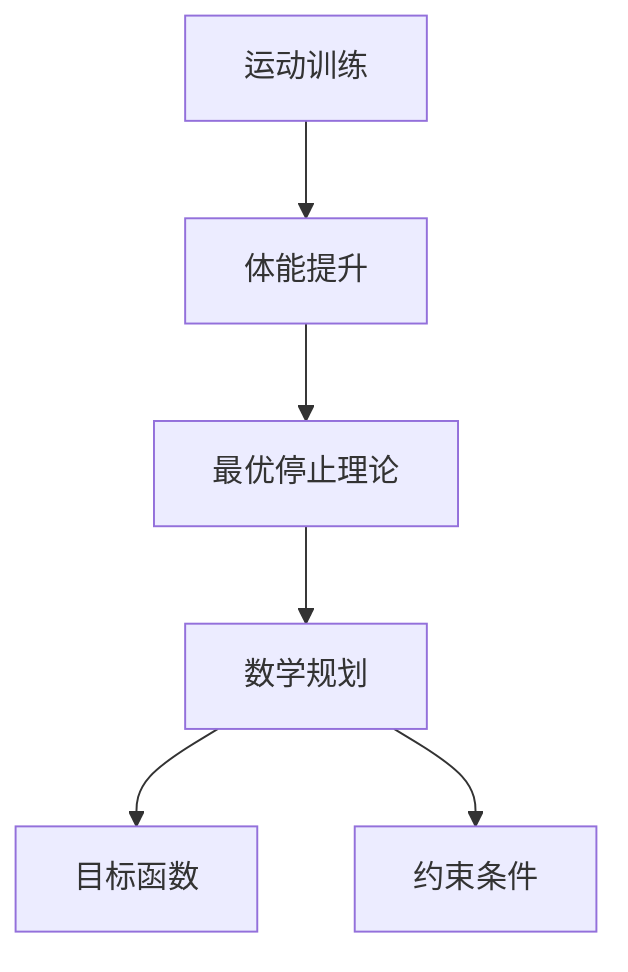

                 

### 文章标题

# 运动训练的最优停止理论：体能提升的数学规划

### 关键词

- 运动训练
- 最优停止理论
- 数学规划
- 体能提升

### 摘要

本文旨在探讨运动训练中的最优停止理论及其在体能提升中的数学规划应用。通过介绍最优停止理论的基本概念、数学规划方法及其在运动训练中的实际应用，本文希望为运动员提供科学的训练策略，以达到最佳体能提升效果。

### 《运动训练的最优停止理论：体能提升的数学规划》目录大纲

## 第1章 引言

### 1.1 运动训练与体能提升

### 1.2 最优停止理论的基本概念

### 1.3 数学规划在运动训练中的应用

## 第2章 最优停止理论基础

### 2.1 最优停止问题概述

### 2.2 概率论与最优停止

### 2.3 贝叶斯最优停止

## 第3章 运动训练中的数学模型

### 3.1 运动训练目标建模

### 3.2 运动训练策略建模

### 3.3 运动训练效果评估模型

## 第4章 数学规划方法在运动训练中的应用

### 4.1 线性规划

### 4.2 非线性规划

### 4.3 整数规划

### 4.4 离散优化

## 第5章 运动训练案例解析

### 5.1 跑步训练案例

#### 5.1.1 跑步训练目标

#### 5.1.2 跑步训练策略

#### 5.1.3 跑步训练效果评估

### 5.2 游泳训练案例

#### 5.2.1 游泳训练目标

#### 5.2.2 游泳训练策略

#### 5.2.3 游泳训练效果评估

## 第6章 最优停止理论在体能提升中的实践应用

### 6.1 体能提升策略制定

### 6.2 体能提升效果评估

### 6.3 最优停止理论在体能提升中的应用案例

## 第7章 结论与展望

### 7.1 运动训练的最优停止理论研究总结

### 7.2 体能提升的数学规划应用展望

## 附录

### 7.3 实用工具和资源介绍

### 7.4 参考文献

### 核心概念与联系

在探讨运动训练的最优停止理论之前，我们需要了解几个关键概念，包括运动训练、最优停止理论以及数学规划。

#### 运动训练与体能提升

运动训练是一种旨在提高个体体能、技能和竞技水平的有目的、有计划、有系统的锻炼方式。体能提升是运动训练的核心目标之一，它包括力量、速度、耐力、柔韧性和协调性等多个方面。

#### 最优停止理论

最优停止理论是一种决策理论，用于解决在不确定环境下如何做出最优决策的问题。在运动训练中，最优停止理论可以帮助运动员在不确定的训练过程中，通过设定合理的训练目标和策略，找到最优的停止点，即在最合适的时机停止训练，以达到最佳的训练效果。

#### 数学规划

数学规划是一种利用数学方法求解最优化问题的工具。在运动训练中，数学规划可以用于建立运动训练的目标函数、确定运动训练的策略以及评估运动训练的效果。

### 核心算法原理讲解

最优停止理论的核心算法是动态规划，它是一种求解多阶段决策问题的算法。在运动训练中，动态规划方法可以帮助运动员确定最优的训练策略，即在不确定的训练过程中，如何在不同的训练阶段做出最优的训练决策。

以下是一个简单的动态规划算法伪代码：

```
// 输入：T为训练时长，R为训练效果，w为每个阶段的权重
// 输出：最优的训练策略

function optimal_stopping(T, R, w):
    n = length(R)
    V = [0, 0, ..., 0]  // 初始化动态规划表

    for t = 1 to n:
        V[t] = max(V[t-1], w[t] * R[t])

    return V[n]

```

### 数学模型和数学公式

在运动训练中，可以使用以下数学模型来描述训练目标和策略：

1. **目标函数**：目标函数用于描述训练的目标，如提高体能、提升运动技能等。常见的目标函数包括：

   $$
   f(x) = \sum_{i=1}^{n} w_i \cdot f_i(x_i) 
   $$

   其中，$w_i$为权重，$f_i(x_i)$为第$i$个训练目标的函数值。

2. **约束条件**：约束条件用于限制训练策略的范围，如训练时长、训练强度等。常见的约束条件包括：

   $$
   g(x) \leq 0 
   $$

   其中，$g(x)$为约束函数。

### 举例说明

假设一名运动员的目标是提高跑步速度，可以使用以下数学模型来描述：

1. **目标函数**：

   $$
   f(x) = \frac{1}{2} \cdot (x - x_0)^2 
   $$

   其中，$x$为跑步速度，$x_0$为当前跑步速度。

2. **约束条件**：

   $$
   g(x) = x - x_0 \leq 0 
   $$

### Mermaid 流程图

为了更直观地展示运动训练与最优停止理论之间的关系，我们使用Mermaid流程图进行描述：



通过上述内容，我们为读者搭建了运动训练、最优停止理论和数学规划之间的联系框架。接下来，我们将深入探讨最优停止理论的基础知识，为后续章节的展开奠定基础。

