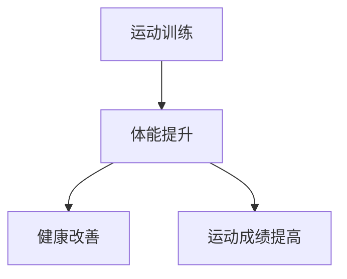

                 


### 1.4 目录大纲

**《运动训练的最优化理论：体能提升的数学规划》目录大纲**

## 第一部分：引言与概述

### 1.1 运动训练的重要性

#### 1.1.1 运动训练的基本概念

- 运动训练的定义：系统化、计划性的运动 + 科学的训练方法

$$
\text{运动训练} = \text{系统化、计划性的运动} + \text{科学的训练方法}
$$

- 运动训练的目标：增强体质、提高运动成绩、促进身心健康

#### 1.1.2 运动训练的目标和意义

- 增强体质
- 提高生活质量
- 培养良好的体育习惯

### 1.2 最优化理论的基础

#### 1.2.1 最优化理论的基本概念

- 最优化问题的定义
- 最优化问题的分类

#### 1.2.2 常见的最优化算法

- 线性规划
- 非线性规划
- 遗传算法

### 1.3 数学规划在运动训练中的应用

#### 1.3.1 数学规划的基本原理

- 数学规划的定义
- 数学规划在体能提升中的作用

#### 1.3.2 数学规划的应用领域

- 运动训练中的数学规划应用
- 数学规划在其他领域中的应用

## 第二部分：体能提升的数学模型

### 2.1 体能评估指标

#### 2.1.1 体能评估的重要性

- 体能评估的定义
- 体能评估的作用

#### 2.1.2 常用的体能评估指标

- 有氧耐力
- 无氧耐力
- 力量
- 灵敏度

#### 2.1.3 体能评估指标的计算方法

- 有氧耐力指数
- 无氧耐力指数
- 力量指数
- 灵敏度指数

### 2.2 体能提升的目标函数

#### 2.2.1 目标函数的定义

- 目标函数的定义
- 目标函数的类型

#### 2.2.2 目标函数的优化方法

- 线性优化
- 非线性优化

### 2.3 约束条件

#### 2.3.1 约束条件的作用

- 约束条件的定义
- 约束条件的作用

#### 2.3.2 约束条件的类型

- 边界约束
- 等式约束
- 不等式约束

#### 2.3.3 约束条件的处理方法

- 约束条件的松弛
- 约束条件的惩罚

## 第三部分：数学规划在运动训练中的应用案例

### 3.1 案例一：长跑运动员的训练计划

#### 3.1.1 案例背景

- 长跑运动员的基本情况
- 训练计划的目标

#### 3.1.2 目标函数的设定

- 有氧耐力提升的目标函数
- 无氧耐力提升的目标函数

#### 3.1.3 约束条件的设定

- 训练时间的约束
- 训练强度的约束

#### 3.1.4 解答过程

- 数学规划模型的建立
- 最优化算法的选择
- 最优解的求解过程

### 3.2 案例二：篮球运动员的体能训练

#### 3.2.1 案例背景

- 篮球运动员的基本情况
- 体能训练的目标

#### 3.2.2 目标函数的设定

- 力量提升的目标函数
- 灵敏度提升的目标函数

#### 3.2.3 约束条件的设定

- 训练时间的约束
- 训练强度的约束

#### 3.2.4 解答过程

- 数学规划模型的建立
- 最优化算法的选择
- 最优解的求解过程

### 3.3 案例三：足球运动员的体能训练

#### 3.3.1 案例背景

- 足球运动员的基本情况
- 体能训练的目标

#### 3.3.2 目标函数的设定

- 有氧耐力提升的目标函数
- 无氧耐力提升的目标函数

#### 3.3.3 约束条件的设定

- 训练时间的约束
- 训练强度的约束

#### 3.3.4 解答过程

- 数学规划模型的建立
- 最优化算法的选择
- 最优解的求解过程

## 第四部分：结论与展望

### 4.1 结论

- 运动训练的最优化理论的核心内容
- 数学规划在运动训练中的应用效果
- 存在的挑战和未来发展方向

### 4.2 展望

- 新的数学模型和应用领域
- 最优化算法的改进和创新
- 运动训练与最优化理论的融合趋势

## 参考文献

- 运动训练相关书籍
- 最优化理论相关书籍
- 数学规划应用相关书籍

---

### 1.4.1 目录大纲的具体解读

目录大纲是我们撰写文章的骨架，它帮助我们组织文章结构，确保内容有条理。下面是对每个部分的具体解读：

#### 1.1 运动训练的重要性

这一部分主要介绍运动训练的基本概念和目标，以及运动训练的重要性。我们需要解释运动训练的定义，包括系统化、计划性的运动和科学的训练方法。此外，我们还需要阐述运动训练的目标，如增强体质、提高运动成绩和促进身心健康，并讨论这些目标对个人和社会的意义。

#### 1.2 最优化理论的基础

这一部分将介绍最优化理论的基本概念，包括最优化问题的定义和分类。此外，我们还将介绍一些常见的最优化算法，如线性规划、非线性规划和遗传算法，以及这些算法的基本原理和应用场景。

#### 1.3 数学规划在运动训练中的应用

这一部分将探讨数学规划在运动训练中的应用。我们将首先介绍数学规划的基本原理，然后讨论数学规划在体能提升中的作用。接着，我们将讨论数学规划在运动训练中的具体应用领域，如运动训练计划的设计、体能评估和优化等。

#### 2.1 体能评估指标

这一部分将详细讨论体能评估指标的重要性，包括体能评估的定义和作用。我们还将介绍常用的体能评估指标，如有氧耐力、无氧耐力、力量和灵敏度，以及这些指标的评估方法和计算方法。

#### 2.2 体能提升的目标函数

这一部分将介绍体能提升的目标函数的定义和类型。我们还将讨论如何设定目标函数，包括线性优化和

---

### 1.4.2 目录大纲的具体应用

目录大纲不仅是一个组织文章内容的工具，它还可以指导我们撰写具体的内容。以下是如何根据目录大纲撰写具体内容：

#### 第一部分：引言与概述

**1.1 运动训练的重要性**

**背景介绍**

在这一节中，我们可以先介绍运动训练的基本概念，如它是什么，为什么对人类如此重要。我们可以引用一些统计数据，如全球参与运动的人数，以及运动对健康和生活的积极影响。

**核心概念与联系**

接下来，我们可以使用Mermaid流程图来展示运动训练的核心概念及其相互联系。例如，我们可以创建一个流程图，展示运动训练、体能、健康和运动成绩之间的相互关系。



**核心算法原理讲解**

在这一部分，我们可以使用伪代码来详细阐述运动训练的核心算法原理。例如，我们可以介绍如何通过有计划和系统的训练来提高体能。

```python
# 伪代码：体能提升的基本步骤
initialize_podiness_score()
for (training_session in training_plan):
    if (training_session.is_aerobic):
        increase_aerobic_endurance(podiness_score)
    else:
        increase_anerobic_endurance(podiness_score)
    update_health_status(podiness_score)
```

**数学模型和公式**

我们可以使用LaTeX格式来展示与运动训练相关的数学模型和公式。例如，我们可以介绍如何计算有氧耐力和无氧耐力。

$$
\text{有氧耐力} = \frac{\text{最大摄氧量}}{\text{体重}} \times 1000
$$

$$
\text{无氧耐力} = \frac{\text{最大力量}}{\text{体重}} \times 100
$$

**举例说明**

我们可以通过实际案例来说明这些概念。例如，我们可以讨论一个长跑运动员如何通过运动训练来提高他的有氧耐力和无氧耐力。

**最佳实践 tips**

在这一部分，我们可以给出一些实用的建议，如如何制定一个有效的运动训练计划，以及如何根据个人目标调整训练内容。

#### 第二部分：体能提升的数学模型

**2.1 体能评估指标**

在这一节中，我们可以详细介绍如何评估一个人的体能。我们可以讨论常用的体能评估指标，如VO2 max、力量、速度和灵活性，并提供计算这些指标的方法。

**2.2 体能提升的目标函数**

在这一部分，我们可以介绍如何设定体能提升的目标函数。我们可以讨论如何通过数学规划来优化训练计划，以实现特定的体能目标。

**2.3 约束条件**

在这一节中，我们可以讨论在运动训练中需要考虑的约束条件。例如，训练时间、训练强度和伤病风险等。

#### 第三部分：数学规划在运动训练中的应用案例

**3.1 案例一：长跑运动员的训练计划**

在这一节中，我们可以通过一个具体的案例来展示如何使用数学规划来制定一个长跑运动员的训练计划。

**3.2 案例二：篮球运动员的体能训练**

在这一节中，我们可以展示如何为一个篮球运动员制定一个体能训练计划，并解释如何使用数学规划来优化训练效果。

**3.3 案例三：足球运动员的体能训练**

在这一节中，我们可以讨论如何为一个足球运动员制定一个体能训练计划，并分析数学规划在该领域的应用。

#### 第四部分：结论与展望

**4.1 结论**

在这一部分，我们可以总结文章的主要观点，并讨论数学规划在运动训练中的重要性。

**4.2 展望**

在这一部分，我们可以展望未来，讨论如何进一步发展和应用数学规划来提升运动训练的效果。

---

通过以上步骤，我们可以根据目录大纲的结构，撰写出一篇逻辑清晰、内容丰富的技术博客文章。在撰写过程中，我们需要确保每个小节的内容都符合目录大纲的要求，并且能够自圆其说，让读者能够顺利地跟随我们的思路。同时，我们还需要注重文章的可读性，使读者能够轻松理解技术概念和算法原理。最终，我们的目标是撰写一篇既具有学术价值又能够吸引读者的专业技术博客文章。

