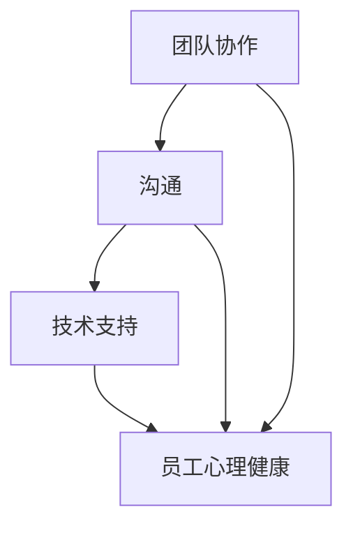

                 

为了撰写一篇符合要求的远程办公管理技术博客，我们可以按照以下步骤进行：

### 第一步：准备文章的结构和内容

首先，我们需要确定文章的总体结构和每个部分的内容。根据您提供的目录大纲，我们可以将文章分为以下几个主要部分：

1. **引言**：介绍远程办公的背景、目的和重要性。
2. **核心概念与联系**：阐述远程办公中的核心概念以及它们之间的关系。
3. **核心算法原理讲解**：通过伪代码和数学模型来详细解释远程办公管理的方法。
4. **项目实战**：提供一个具体的远程办公管理案例，详细描述实施过程和成果。
5. **最佳实践 tips**：总结一些远程办公管理的最佳实践和技巧。
6. **小结**：对文章内容进行总结，强调关键点和重要性。
7. **注意事项**：提醒读者在实施远程办公管理时需要注意的事项。
8. **拓展阅读**：推荐一些相关的阅读资源，供读者进一步学习。

### 第二步：撰写每个部分的内容

在确定好文章结构后，我们可以开始撰写每个部分的具体内容。以下是一个简单的示例：

#### 引言

在当今全球化和信息化的背景下，远程办公已经成为一种趋势。随着互联网技术的不断发展，远程办公不仅提高了工作效率，还减少了企业的运营成本。本文将探讨如何有效地管理远程办公团队，以保持团队的高效运作。

#### 核心概念与联系

远程办公管理涉及多个核心概念，如团队合作、沟通、技术支持、员工心理健康等。这些概念相互关联，构成了一个复杂的远程办公管理体系。

**Mermaid 流�程图：**



#### 核心算法原理讲解

远程办公管理的核心算法原理主要包括：

1. **目标设定**：明确团队的目标和期望，确保团队成员都明确自己的职责和任务。
2. **沟通机制**：建立有效的沟通渠道，确保信息的及时传递和问题的及时解决。
3. **技术支持**：提供必要的技术工具和支持，确保远程办公的顺利进行。
4. **员工心理健康**：关注员工的心理健康，提供必要的支持和关怀。

**伪代码：**

```python
def manage_remote_team(team_members, communication_tools, technical_support, mental_health_care):
    # 设定明确的目标和期望
    set_goals_and_expectations(team_members)
    
    # 建立有效的沟通机制
    setup_communication_channel(communication_tools)
    
    # 提供技术支持
    provide_technical_support(technical_support)
    
    # 关注员工心理健康
    monitor_mental_health(mental_health_care)
    
    # 持续评估团队表现
    evaluate_team_performance(team_members)
```

#### 项目实战

以下是一个远程办公管理项目实战案例：

**项目背景**：某科技公司由于业务扩展，决定实施远程办公制度。他们需要搭建一个高效、稳定的远程办公平台，并制定一套有效的管理流程。

**实施过程**：
1. **需求分析**：分析公司各部门的远程办公需求，确定所需的技术工具和资源。
2. **平台搭建**：搭建远程办公平台，包括VPN、云存储、即时通讯工具等。
3. **流程制定**：制定远程办公管理流程，包括工作安排、沟通机制、技术支持等。
4. **培训与实施**：对员工进行远程办公技能培训，确保他们能够熟练使用相关工具。

**成果**：通过远程办公平台的搭建和管理流程的实施，该公司实现了高效的远程办公，员工的工作效率和满意度都有显著提高。

#### 最佳实践 tips

1. **明确目标**：确保每个团队成员都明确自己的工作目标和职责。
2. **定期沟通**：定期召开团队会议，确保信息的及时传递和问题的及时解决。
3. **技术支持**：提供稳定、高效的技术支持，确保远程办公的顺利进行。
4. **员工关怀**：关注员工的心理健康，提供必要的支持和关怀。

#### 小结

远程办公管理是一个复杂的过程，需要考虑多个方面的因素。通过本文的介绍，我们了解了远程办公管理的核心概念、算法原理和实践案例，希望对您在远程办公管理方面有所启发。

#### 注意事项

1. **确保网络稳定**：远程办公依赖于网络，因此确保网络稳定是关键。
2. **数据安全**：保护公司数据和员工个人信息的安全至关重要。
3. **关注员工心理健康**：远程办公可能导致员工心理压力增加，需要关注并适当干预。

#### 拓展阅读

- [《远程办公最佳实践指南》](链接)
- [《远程办公心理学》](链接)
- [《远程办公技术指南》](链接)

### 第三步：撰写文章的最终版本

在完成每个部分的内容后，我们需要将它们整合到一起，形成一个完整的文章。在撰写过程中，需要注意文章的逻辑性和连贯性，确保每个部分都能清晰地传达信息。

在文章的结尾，我们可以总结文章的核心观点，并提供一些拓展阅读资源，以供读者进一步学习。

### 结论

远程办公管理是一个需要综合考虑多个因素的复杂过程。通过本文的介绍，我们了解了远程办公管理的核心概念、算法原理和实践案例。希望这些信息能够帮助您更好地管理远程办公团队，提高工作效率和员工满意度。

---

根据上述步骤，我们可以撰写出一篇符合要求的远程办公管理技术博客。在撰写过程中，需要确保文章内容的完整性、逻辑性和可读性，以满足目标读者的需求。同时，通过使用Mermaid流程图、伪代码和LaTeX公式等元素，可以增强文章的技术性和专业性。最后，提供拓展阅读资源，可以帮助读者进一步深入学习和探索远程办公管理的相关领域。

