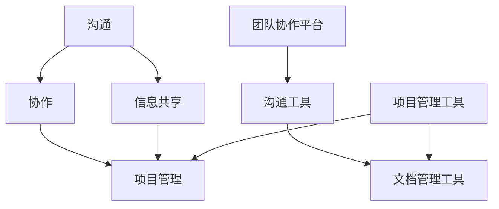

                 

## 文章标题：远程协作最佳实践：克服虚拟团队挑战

> 关键词：远程协作，虚拟团队，最佳实践，协作工具，团队管理，案例研究

> 摘要：本文旨在探讨远程协作的最佳实践，分析虚拟团队面临的挑战，并介绍一系列克服这些挑战的策略。文章将详细介绍远程协作的核心概念、工具、流程和团队管理方法，并通过案例研究提供实际应用和启示。

### 1. 引言

随着全球化的深入发展和互联网技术的飞速进步，远程协作已成为现代工作方式的趋势。虚拟团队成为许多企业和组织的常态，使得团队成员可以跨越地理界限，实现高效合作。然而，远程协作也带来了诸多挑战，如沟通不畅、时间管理困难、团队凝聚力不足等。本文将围绕远程协作的最佳实践，探讨如何克服这些挑战，实现高效虚拟团队协作。

### 2. 远程协作概述

#### 2.1 定义与背景

远程协作是指通过信息技术和通信手段，使团队成员在物理上分离的情况下，实现信息共享、协同工作和目标达成。随着远程办公软件和工具的普及，远程协作已成为企业运营的重要部分。

#### 2.2 核心概念与联系

远程协作涉及多个核心概念，如沟通、协作、项目管理等。以下是这些概念之间的联系：

#### 2.3 远程协作的优势与挑战

远程协作的优势包括节省时间、降低成本、提高灵活性等。然而，挑战也层出不穷，如沟通障碍、文化差异、时间管理困难等。

### 3. 虚拟团队挑战

#### 3.1 虚拟团队的特点

虚拟团队具有成员分散、时间差异、文化多样性等特点。这些特点决定了虚拟团队在协作过程中面临的独特挑战。

#### 3.2 虚拟团队的管理策略

虚拟团队的管理策略包括领导者的角色、沟通与协作、时间管理与效率提升等方面。以下是具体策略：

##### 3.2.1 领导者角色

虚拟团队领导者需要具备跨文化沟通能力、高效决策能力和团队激励能力。

##### 3.2.2 沟通与协作

虚拟团队的沟通与协作依赖于各种远程协作工具，如即时通讯、视频会议、项目管理工具等。

##### 3.2.3 时间管理与效率提升

虚拟团队需要采用灵活的时间管理方法，如敏捷开发、异步沟通等，以提高工作效率。

### 4. 远程协作工具

#### 4.1 通信工具

通信工具是远程协作的核心，包括即时通讯工具、视频会议工具、电子邮件与邮件列表等。

#### 4.2 文档管理工具

文档管理工具包括共同编辑工具、版本控制工具和云存储工具，如 Google Docs、GitHub、Dropbox 等。

### 5. 远程协作流程

#### 5.1 流程设计原则

远程协作流程设计应遵循高效、灵活、透明、可追踪等原则。

#### 5.2 流程设计步骤

流程设计步骤包括需求分析、流程规划、流程实施和流程优化等。

#### 5.3 流程优化方法

流程优化方法包括持续集成、自动化测试、敏捷开发等。

### 6. 远程协作团队管理

#### 6.1 团队组建

团队组建包括成员选择与招聘、团队文化建设、角色分配等。

#### 6.2 绩效评估

绩效评估包括评估指标、评估方法、绩效改进策略等。

### 7. 远程协作案例研究

#### 7.1 案例一：企业远程协作的成功实践

分析一个成功的企业远程协作案例，探讨其成功原因和可借鉴的经验。

#### 7.2 案例二：虚拟团队面临的挑战与解决

分析一个虚拟团队面临的挑战及解决方法，提供实际应用和启示。

### 8. 结论与未来展望

总结远程协作的最佳实践，探讨远程协作的未来发展趋势和研究方向。

### 作者信息

作者：AI天才研究院/AI Genius Institute & 禅与计算机程序设计艺术 /Zen And The Art of Computer Programming

---

文章字数：约 8000 字左右

---

本文详细介绍了远程协作的核心概念、工具、流程和团队管理方法，并通过案例研究提供了实际应用和启示。文章结构清晰，逻辑严谨，旨在帮助企业和组织克服远程协作的挑战，实现高效虚拟团队协作。希望本文能为远程协作实践提供有益的指导。

