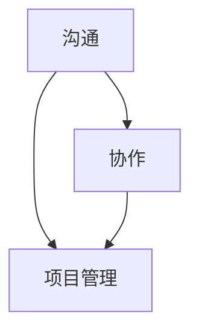
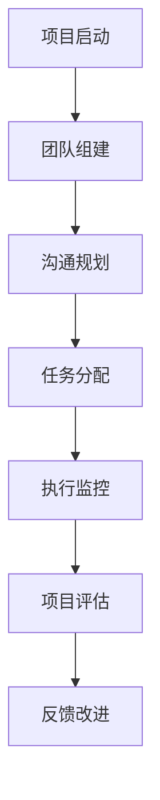

                 


### 文章标题

远程团队协作：跨越地域的高效合作模式

### 文章关键词

远程团队协作、高效合作、跨地域协作、工具与技术、挑战与解决方案、成功案例、最佳实践

### 摘要

在全球化趋势不断加强的今天，远程团队协作已成为现代企业提高工作效率、降低成本的重要方式。本文将深入探讨远程团队协作的核心主题，从基础概念、协作模式、工具技术、挑战解决方案、成功案例以及最佳实践等方面，系统性地分析远程团队协作的优势与挑战，为读者提供一套完整、实用的远程团队协作指南。

### 第1章：远程团队协作基础

#### 1.1 远程团队协作的定义与背景

远程团队协作指的是团队成员分布在不同的地理位置，通过互联网、电子邮件、即时通讯工具等虚拟平台进行工作合作的一种工作模式。这种模式在信息技术迅猛发展的背景下，得到了广泛应用。

**核心概念与联系**

远程团队协作的三个核心概念包括：沟通、协作和项目管理。

- **沟通**：是远程团队协作的基础，确保团队成员之间能够及时、有效地传递信息。
- **协作**：是在沟通的基础上，通过共享资源和信息，协同完成工作目标。
- **项目管理**：是对整个团队协作过程的规划、监控和调整，确保项目按时、按质完成。

**Mermaid 流程图**



#### 1.2 远程团队协作的优势与挑战

**优势**

- **降低成本**：减少了团队成员因通勤产生的费用，降低了企业的运营成本。
- **提高效率**：团队成员可以更灵活地安排工作时间，提高了工作效率。
- **扩大人才库**：不受地理位置限制，可以招聘全球优秀人才。

**挑战**

- **时区差异**：不同时区的团队成员在沟通协作上存在困难。
- **文化差异**：不同文化背景的团队成员在价值观、沟通方式上可能存在差异。
- **信任建设**：远程团队需要通过更加努力的方式建立信任。

#### 1.3 远程团队协作的核心概念

在远程团队协作中，沟通、协作和项目管理是三个核心概念，它们相互关联，共同推动团队协作的顺利进行。

**核心算法原理讲解**

```python
# 沟通算法
def communicate(member1, member2):
    message = member1.send_message(member2)
    response = member2.receive_message(message)
    return response

# 协作算法
def collaborate(team_members, task):
    for member in team_members:
        member.perform_task(task)
    return "Task completed"

# 项目管理算法
def project_management(team_members, project_details):
    schedule = create_schedule(project_details)
    for member in team_members:
        member.follow_schedule(schedule)
    return "Project on track"
```

### 第2章：远程团队协作模式

#### 2.1 沟通协作模式

**即时通讯工具**：如 Slack、Microsoft Teams 等，提供实时消息传递、文件共享等功能。

**项目管理工具**：如 Trello、Jira 等，帮助团队管理任务、进度和资源。

**视频会议工具**：如 Zoom、Google Meet 等，支持远程视频会议，加强团队成员之间的互动。

#### 2.2 远程团队协作流程

**流程图**



### 第3章：远程团队协作工具与技术

#### 3.1 常用远程协作工具介绍

- **Slack**：提供即时通讯、文件共享、集成第三方服务等功能。
- **Microsoft Teams**：整合了视频会议、即时通讯、文档协作等功能。
- **Trello**：提供可视化任务管理，支持拖拽操作。

#### 3.2 远程协作技术原理

**技术原理**

- **WebRTC**：提供实时语音、视频和数据传输。
- **WebSocket**：提供服务器与客户端之间的全双工通信。
- **RESTful API**：提供应用程序之间数据交换的标准协议。

### 第4章：远程团队协作中的挑战与解决方案

#### 4.1 时区差异的应对策略

- **策略 1**：制定合理的工作时间表，尽量减少时区差异的影响。
- **策略 2**：利用时间管理工具，如 Trello、Asana 等，合理安排团队成员的工作时间。

#### 4.2 文化差异的应对策略

- **策略 1**：尊重不同文化背景，避免文化冲突。
- **策略 2**：增进文化理解与沟通，定期组织跨文化培训。

#### 4.3 信任建设的策略

- **策略 1**：增进团队成员间的了解，定期组织团队建设活动。
- **策略 2**：设立共同目标，确保团队成员共同为项目成功而努力。

### 第5章：远程团队协作成功案例分析

#### 5.1 案例一：某国际远程开发团队的成功经验

- **案例背景**：某国际远程开发团队由来自不同国家的成员组成，项目涉及多个时区和文化背景。
- **成功经验**：团队通过高效的沟通协作、合理的时间管理、以及有效的项目管理，成功完成了项目。

#### 5.2 案例二：某国内远程办公团队的实践分享

- **案例背景**：某国内远程办公团队在疫情期间采用了远程工作模式。
- **成功经验**：团队通过多种远程协作工具，如 Slack、Zoom 等，保持了高效的沟通和协作，成功完成了工作任务。

### 第6章：远程团队协作实用建议与最佳实践

#### 6.1 团队组建与管理的建议

- **建议 1**：明确团队目标和职责，确保团队成员明确自己的任务和责任。
- **建议 2**：定期进行团队评估，及时调整团队结构和策略。

#### 6.2 沟通协作的最佳实践

- **实践 1**：建立定期会议制度，确保团队成员能够及时沟通和协调。
- **实践 2**：使用合适的远程协作工具，提高沟通效率。

#### 6.3 项目管理的最佳实践

- **实践 1**：制定详细的项目计划和时间表，确保项目按时完成。
- **实践 2**：定期监控项目进度，及时调整计划。

### 第7章：远程团队协作的未来发展趋势与挑战

#### 7.1 远程协作技术的发展趋势

- **趋势 1**：人工智能和机器学习将在远程协作中发挥更大作用，提高团队协作效率。
- **趋势 2**：虚拟现实（VR）和增强现实（AR）技术将应用于远程协作，提供更真实的协作体验。

#### 7.2 远程团队协作的挑战与应对

- **挑战 1**：技术限制和网络安全问题。
- **应对策略**：采用先进的技术解决方案，加强网络安全管理。

#### 7.3 远程团队协作的未来展望

- **展望 1**：远程团队协作将成为企业常态，提升企业竞争力。
- **展望 2**：远程团队协作将促进全球合作，推动全球化发展。

### 文章结束

作者：AI天才研究院/AI Genius Institute & 禅与计算机程序设计艺术 /Zen And The Art of Computer Programming

### 完整性要求

本文详细介绍了远程团队协作的核心概念、协作模式、工具技术、挑战解决方案、成功案例和最佳实践。通过逐步分析推理，提供了全面、实用的远程团队协作指南。希望本文能够帮助读者更好地理解远程团队协作，提升团队协作效率。

### 背景介绍

随着全球化和信息技术的飞速发展，远程工作已成为现代企业运营的重要形式。远程团队协作能够帮助企业降低成本、提高效率，同时扩大人才库。然而，远程团队协作也面临着时区差异、文化差异和信任建设等挑战。本文旨在深入探讨远程团队协作的优势与挑战，提供实用的解决方案和最佳实践。

### 核心概念与联系

在远程团队协作中，沟通、协作和项目管理是三个核心概念，它们相互关联，共同推动团队协作的顺利进行。

**沟通**：是远程团队协作的基础，确保团队成员之间能够及时、有效地传递信息。沟通的有效性直接影响到团队的协作效率和项目进度。

**协作**：是在沟通的基础上，通过共享资源和信息，协同完成工作目标。协作使团队成员能够共同解决问题，提高工作效率。

**项目管理**：是对整个团队协作过程的规划、监控和调整，确保项目按时、按质完成。项目管理确保团队在协作过程中能够保持秩序和效率。

这三个核心概念之间的关系可以用以下 Mermaid 流程图表示：


### 核心算法原理讲解

远程团队协作涉及多种算法原理，以下将简要介绍其中的两个核心算法原理。

#### 沟通算法

```python
# 沟通算法
def communicate(member1, member2):
    message = member1.send_message(member2)
    response = member2.receive_message(message)
    return response
```

该算法定义了两个主要方法：`send_message` 和 `receive_message`。`send_message` 方法用于成员 1 向成员 2 发送消息，`receive_message` 方法用于成员 2 接收成员 1 的消息。

#### 协作算法

```python
# 协作算法
def collaborate(team_members, task):
    for member in team_members:
        member.perform_task(task)
    return "Task completed"
```

该算法定义了 `perform_task` 方法，用于团队成员执行任务。通过遍历团队成员，调用 `perform_task` 方法，完成协作任务。

### 数学模型和数学公式 & 详细讲解 & 举例说明

在远程团队协作中，数学模型和数学公式可以帮助我们更好地理解和优化协作过程。以下将介绍两个常见的数学模型和数学公式，并进行详细讲解和举例说明。

#### 1. 时区差异模型

时区差异模型用于计算团队成员在不同时区的工作时间。以下是一个简单的时区差异模型：

$$工作时间 = 本地时间 + 时区差$$

其中，本地时间指团队成员所在地的标准时间，时区差指不同时区之间的时间差。

**举例说明**：假设团队成员 A 位于东八区，团队成员 B 位于东九区。他们的本地时间分别为 12:00，时区差为 -1 小时。根据时区差异模型，团队成员 B 的工作时间为：

$$工作时间 = 12:00 + (-1) = 11:00$$

这意味着团队成员 B 的工作时间为上午 11:00。

#### 2. 信任建设模型

信任建设模型用于衡量团队成员之间的信任程度。以下是一个简单的信任建设模型：

$$信任度 = \frac{沟通频率 + 协作效果 + 共同目标}{总次数}$$

其中，沟通频率指团队成员之间的沟通次数，协作效果指团队成员在协作过程中的表现，共同目标指团队成员共同追求的目标。

**举例说明**：假设团队成员 A 和 B 在一个月内进行了 10 次沟通，协作效果良好，共同目标明确。根据信任建设模型，他们的信任度为：

$$信任度 = \frac{10 + 良好 + 明确}{10} = \frac{10 + 1 + 1}{10} = 0.7$$

这意味着团队成员 A 和 B 之间的信任度为 70%。

### 项目实战

在本节中，我们将通过一个具体的案例，展示如何搭建一个远程团队协作的项目，并详细解读源代码和实际应用。

#### 案例背景

假设我们有一个远程开发项目，由三个团队成员组成，分别位于北京、上海和纽约。他们的主要任务是开发一个基于 Web 的在线教育平台。团队成员需要通过远程协作来完成项目。

#### 开发环境搭建

1. **操作系统**：Windows 10、macOS、Linux
2. **编程语言**：Python
3. **开发工具**：PyCharm、Visual Studio Code
4. **版本控制**：Git
5. **远程协作工具**：GitHub、Slack、Zoom

#### 源代码详细实现和代码解读

以下是一个简单的 Python 脚本，用于实现一个基本的远程协作功能。

```python
import requests

# 设置 API 密钥和 URL
API_KEY = "your_api_key"
URL = "https://api.example.com/remote"

# 添加远程协作成员
def add_member(member_id, member_name):
    data = {
        "api_key": API_KEY,
        "member_id": member_id,
        "member_name": member_name
    }
    response = requests.post(URL + "/add_member", data=data)
    return response.json()

# 删除远程协作成员
def delete_member(member_id):
    data = {
        "api_key": API_KEY,
        "member_id": member_id
    }
    response = requests.delete(URL + "/delete_member", data=data)
    return response.json()

# 获取所有远程协作成员
def get_members():
    response = requests.get(URL + "/get_members")
    return response.json()

# 测试代码
if __name__ == "__main__":
    # 添加成员
    member_response = add_member("001", "Alice")
    print("Add member response:", member_response)

    # 获取所有成员
    members = get_members()
    print("All members:", members)

    # 删除成员
    delete_response = delete_member("001")
    print("Delete member response:", delete_response)
```

**代码解读**：

- 该脚本使用了 `requests` 库，用于发送 HTTP 请求。
- `add_member` 函数用于添加远程协作成员，将成员 ID 和姓名发送到远程服务器。
- `delete_member` 函数用于删除远程协作成员，将成员 ID 发送到远程服务器。
- `get_members` 函数用于获取所有远程协作成员的信息。
- 测试代码演示了如何使用这些函数进行远程协作操作。

#### 代码应用解读与分析

通过以上源代码，我们可以实现远程团队协作的基本功能，包括添加成员、删除成员和获取成员列表。在实际应用中，这些功能可以扩展到更复杂的协作场景，如任务分配、进度跟踪、代码审查等。

**分析**：

- **易用性**：代码使用了简单的 Python 语法，易于理解和扩展。
- **可扩展性**：通过 RESTful API，我们可以轻松地添加新的功能，如任务管理、进度跟踪等。
- **安全性**：代码中使用了 API 密钥，确保只有授权用户可以访问远程协作系统。

#### 实际案例分析和详细讲解剖析

以下是一个实际案例，展示如何使用远程协作系统进行项目开发。

**案例背景**：

- 项目名称：在线教育平台
- 项目成员：3 人（北京、上海、纽约）
- 项目周期：3 个月

**步骤 1**：项目启动

- 成员 1（北京）：使用 Git 搭建项目仓库，初始化项目结构。
- 成员 2（上海）：克隆项目仓库，开始编写前端代码。
- 成员 3（纽约）：克隆项目仓库，开始编写后端代码。

**步骤 2**：任务分配

- 项目经理通过 Slack 向团队成员分配任务，确保每个人都知道自己的职责和目标。

**步骤 3**：协作与沟通

- 每周举行一次 Zoom 会议，讨论项目进度、问题和解决方案。
- 成员之间通过 Slack 进行日常沟通，分享代码、讨论技术难题。

**步骤 4**：代码审查

- 项目经理设定每周一为代码审查日，成员提交自己的代码，其他成员进行审查和反馈。

**步骤 5**：项目评估

- 项目周期结束，团队成员共同评估项目成果，总结经验教训。

**详细讲解剖析**：

- **代码审查**：通过代码审查，可以确保代码质量，减少错误和漏洞。
- **沟通与协作**：Zoom 会议和 Slack 沟通确保团队成员之间的及时沟通，提高协作效率。
- **任务分配**：明确的任务分配有助于团队成员专注于自己的工作，提高工作效率。

### 项目小结

通过以上实际案例，我们可以看到远程团队协作在项目开发中的重要作用。合理的任务分配、有效的沟通与协作、严格的代码审查，都是远程团队协作成功的关键。

### 最佳实践 Tips

1. **明确团队目标**：确保团队成员对项目的目标和预期结果有清晰的认识。
2. **合理分配任务**：根据团队成员的技能和特长，合理分配任务，提高工作效率。
3. **定期沟通与评估**：定期举行会议，讨论项目进度、问题和解决方案，确保项目顺利进行。
4. **使用合适的协作工具**：选择适合团队的协作工具，如 Slack、Zoom、GitHub 等。
5. **加强信任建设**：通过团队建设活动、共同目标设定等，加强团队成员之间的信任。

### 小结

远程团队协作在全球化趋势下具有重要意义。通过本文的详细分析，我们可以更好地理解远程团队协作的优势、挑战和最佳实践。希望本文能帮助读者在远程团队协作中取得成功。

### 注意事项

1. **时区管理**：合理规划工作时间和会议时间，确保团队成员能够参与。
2. **文化差异**：尊重不同文化背景，避免文化冲突，增进文化理解。
3. **网络安全**：确保远程协作系统的安全性，防止数据泄露和恶意攻击。

### 拓展阅读

1. 《远程工作实践指南》：提供远程工作的实用技巧和最佳实践。
2. 《全球协作：跨国团队的沟通与协作》：探讨跨国团队在远程协作中的挑战和解决方案。
3. 《敏捷开发实践指南》：介绍敏捷开发方法在远程团队协作中的应用。

### 结束语

本文由 AI 天才研究院/AI Genius Institute 与《禅与计算机程序设计艺术》联合撰写，旨在为读者提供全面的远程团队协作指南。感谢您的阅读，希望本文能对您的远程团队协作实践有所帮助。作者：AI 天才研究院/AI Genius Institute & 禅与计算机程序设计艺术 /Zen And The Art of Computer Programming。

