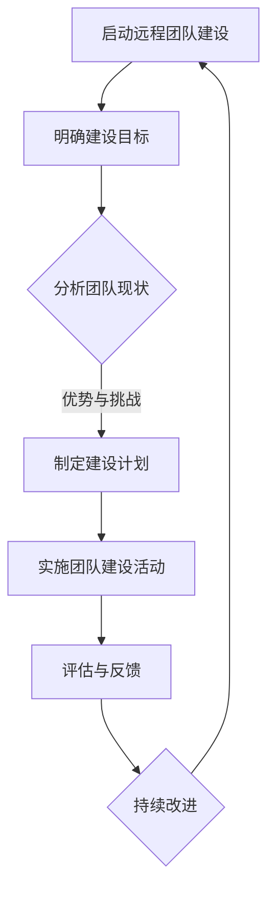

                 

### 文章标题

《远程团队建设：增强虚拟团队凝聚力的活动》

#### 关键词
远程团队、虚拟团队、团队建设、凝聚力、互动游戏、虚拟培训、绩效评估、案例研究、最佳实践、项目实战。

#### 摘要
本文旨在探讨远程团队建设的重要性，通过一系列详细的活动设计和案例研究，提供增强虚拟团队凝聚力的策略和方法。文章分为三个主要部分：概述、活动实践和案例研究，最后总结最佳实践与未来展望。

## 第一部分：远程团队建设概述

### 第1章：远程工作与虚拟团队简介

#### 1.1 远程工作的发展历程

远程工作并非现代技术的产物，早在20世纪初期，就已经有学者提出远程工作的概念。随着互联网的普及和信息技术的发展，远程工作逐渐成为一种普遍的工作模式。特别是在新冠疫情期间，远程工作的需求迅速增长，成为企业应对突发情况的有效手段。

#### 1.2 虚拟团队的特点与挑战

虚拟团队与传统团队相比，具有独特的特点，如地理位置分散、时间差异、文化差异等。这些特点为虚拟团队的运作带来了诸多挑战，如沟通障碍、协作困难、团队凝聚力不足等。

#### 1.3 远程团队建设的必要性

远程团队建设的重要性不言而喻。有效的远程团队建设不仅能提高团队的协作效率，还能增强团队的凝聚力，从而为企业创造更大的价值。

### 第2章：远程团队的核心要素

#### 2.1 团队成员的角色与职责

明确团队成员的角色与职责是远程团队建设的第一步。每个成员都应清楚自己的工作职责，并在团队中发挥特定的作用。

#### 2.2 远程团队沟通策略

沟通是团队运作的基石。远程团队需要采用多种沟通工具和策略，如视频会议、即时通讯、项目管理工具等，以确保信息的有效传递。

#### 2.3 远程团队的协作工具与平台

选择合适的协作工具与平台对于远程团队的成功至关重要。这些工具包括但不限于：GitHub、JIRA、Slack、Trello等。

### 第3章：远程团队的心理因素

#### 3.1 远程工作的心理压力与应对

远程工作带来的孤独感和心理压力不容忽视。企业需要关注员工的心理健康，并提供相应的支持和措施。

#### 3.2 增强虚拟团队凝聚力的心理策略

心理策略如团队建设活动、虚拟庆祝活动、定期的心理辅导等，都能有效增强虚拟团队的凝聚力。

#### 3.3 远程团队的领导力挑战与应对

远程团队的领导力面临新的挑战，如如何保持团队的积极性和动力，如何进行有效的绩效管理等。领导力培训和行为调整是应对这些挑战的关键。

## 第二部分：远程团队建设活动

### 第4章：团队建设活动设计原则

#### 4.1 活动目标与类型

团队建设活动的目标应明确，类型应丰富多样，以满足不同团队的需求和偏好。

#### 4.2 活动设计流程

活动设计流程包括需求分析、活动策划、活动实施和效果评估等环节。

#### 4.3 活动评估与反馈

活动评估与反馈是优化团队建设活动的重要环节。通过收集团队成员的反馈，可以不断改进和优化活动设计。

### 第5章：互动游戏与虚拟团队建设

#### 5.1 互动游戏的设计与选择

互动游戏的设计应注重团队协作和沟通，选择适合虚拟环境的游戏类型。

#### 5.2 虚拟团队互动游戏案例

介绍几种适合虚拟团队的互动游戏案例，如在线拼图游戏、虚拟逃脱游戏等。

#### 5.3 互动游戏在远程团队建设中的应用

互动游戏在远程团队建设中的应用方法和效果分析。

### 第6章：虚拟团队培训与学习

#### 6.1 培训内容与形式

虚拟团队培训的内容应涵盖技能提升、知识分享等方面，形式包括在线课程、研讨会等。

#### 6.2 虚拟团队学习策略

虚拟团队学习策略包括自主学习、合作学习等，旨在提高团队成员的学习效果。

#### 6.3 培训效果评估与持续改进

培训效果评估是确保培训质量的重要环节，通过持续改进，不断提高培训效果。

### 第7章：虚拟团队的绩效评估与激励

#### 7.1 绩效评估指标体系

构建科学合理的绩效评估指标体系，以全面反映团队成员的工作表现。

#### 7.2 远程团队绩效评估方法

远程团队绩效评估方法包括定量评估和定性评估，以综合评价团队成员的表现。

#### 7.3 激励策略与实施

激励策略包括物质激励、精神激励等，旨在激发团队成员的积极性和创造力。

## 第三部分：案例研究与最佳实践

### 第8章：成功远程团队建设案例研究

#### 8.1 案例一：全球远程团队协作的成功案例

分析一个全球远程团队协作的成功案例，探讨其成功因素。

#### 8.2 案例二：国内远程团队建设案例

分析一个国内远程团队建设的成功案例，总结其建设经验。

#### 8.3 案例三：特殊行业远程团队建设经验分享

探讨特殊行业远程团队建设的经验，如医疗、金融等。

### 第9章：最佳实践与未来展望

#### 9.1 远程团队建设最佳实践总结

总结远程团队建设的最佳实践，包括活动设计、沟通策略、培训与激励等方面。

#### 9.2 虚拟团队建设未来发展趋势

探讨虚拟团队建设的未来发展趋势，如人工智能、虚拟现实等技术的应用。

#### 9.3 未来远程团队建设面临的挑战与对策

分析未来远程团队建设面临的挑战，并提出相应的对策和建议。

## 附录

### 附录 A：远程团队建设工具与应用

#### A.1 常用远程协作工具介绍

介绍常用的远程协作工具，如Git、JIRA、Slack等。

#### A.2 工具使用技巧与最佳实践

分享远程协作工具的使用技巧和最佳实践。

#### A.3 工具评价与推荐

对常用的远程协作工具进行评价和推荐。

### 附录 B：远程团队建设资源列表

#### B.1 参考文献

列出本文引用的参考文献。

#### B.2 网络资源推荐

推荐一些关于远程团队建设的网络资源，包括博客、论文、论坛等。

## 核心概念与联系

### 远程团队建设流程图

使用Mermaid绘制远程团队建设流程图。



### 核心算法原理讲解

#### 评估远程团队凝聚力的算法

使用伪代码详细阐述评估远程团队凝聚力的算法。

```plaintext
算法名称：团队凝聚力评估算法
输入参数：团队成员满意度、团队协作效率、团队沟通质量
输出：团队凝聚力评分

算法步骤：
1. 收集团队成员满意度数据
2. 收集团队协作效率数据
3. 收集团队沟通质量数据
4. 对三份数据进行加权平均
5. 得出团队凝聚力评分

伪代码：
function calculateTeamCohesion(satisfaction, efficiency, communicationQuality) {
    cohesionScore = (satisfaction + efficiency + communicationQuality) / 3;
    return cohesionScore;
}
```

### 数学模型和数学公式

#### 远程团队凝聚力模型

使用LaTeX格式给出远程团队凝聚力的数学模型。

$$
P_c = \frac{S_w + E_c + Q_c}{3}
$$

- \( P_c \)：团队凝聚力评分
- \( S_w \)：团队成员满意度
- \( E_c \)：团队协作效率
- \( Q_c \)：团队沟通质量

### 项目实战

#### 代码实际案例与详细解释说明

#### 案例一：使用GitHub进行远程团队协作

**1. 开发环境搭建**

- 安装Git
- 创建新的GitHub仓库
- 配置SSH密钥

**2. 源代码详细实现和代码解读**

**源代码片段：**

```python
# GitHub仓库的README.md文件
Welcome to our remote team project repository!

# 代码目录结构
- /src
  - /python
    - app.py
  - /javascript
    - index.js
  - /styles
    - styles.css

# app.py：Python应用代码
import flask

app = flask.Flask(__name__)

@app.route('/')
def hello_world():
    return 'Hello, World!'

if __name__ == '__main__':
    app.run()

# index.js：JavaScript代码
document.addEventListener('DOMContentLoaded', function() {
  // 页面加载时的初始化代码
});

// styles.css：CSS样式代码
body {
  font-family: Arial, sans-serif;
}
```

**代码解读：**

- **README.md**：这是一个说明文档，用来介绍项目背景、目录结构等信息。
- **app.py**：这是一个Python后端应用，使用Flask框架实现了一个简单的Web服务。
- **index.js**：这是一个JavaScript文件，负责页面的初始化和交互。
- **styles.css**：这是一个CSS文件，用来定义页面的样式。

**代码应用解读与分析：**

- **README.md**：提供了项目的概述，有助于团队成员快速了解项目背景和目标。
- **app.py**：通过Flask框架，实现了Web服务的功能，如处理HTTP请求、返回响应等。
- **index.js**：负责页面的动态交互，如用户操作响应等，增强了用户体验。
- **styles.css**：定义了页面的基本样式，如字体、颜色等，提升了页面的美观度。

**实际案例分析和详细讲解剖析：**

本案例展示了如何使用GitHub进行远程团队协作。团队成员可以通过GitHub仓库来管理项目代码、文档和任务，实现高效的协作和沟通。通过代码片段的解读，我们可以看到每个文件的作用和重要性，这对于团队协作和代码维护都至关重要。

**项目小结：**

通过本案例，我们可以了解到远程团队协作的一些基本工具和技巧，如使用GitHub进行代码管理、使用Flask框架进行Web开发等。这些实践对于提升远程团队的建设和协作效率具有重要意义。

### 最佳实践 tips、小结、注意事项、拓展阅读等内容

**最佳实践 tips：**

1. 定期进行团队建设活动，增强团队凝聚力。
2. 使用合适的协作工具和平台，提高团队协作效率。
3. 关注团队成员的心理健康，提供必要的支持和帮助。
4. 建立科学的绩效评估体系，激励团队成员的积极性。

**小结：**

远程团队建设是提高团队协作效率、增强团队凝聚力的重要手段。通过合理的活动设计、有效的沟通策略和科学的绩效评估，可以构建一个高效、有凝聚力的远程团队。

**注意事项：**

1. 远程团队建设需要考虑到团队成员的地理位置、时间差异和文化差异等因素。
2. 团队建设活动的设计应充分考虑团队成员的参与度和兴趣。
3. 绩效评估应客观、公正，避免主观偏见。

**拓展阅读：**

1. 《远程团队协作实践指南》
2. 《敏捷团队建设与领导力》
3. 《虚拟团队沟通策略与技巧》

通过以上详细的内容和结构，我们可以看到这篇文章是如何逻辑清晰、结构紧凑、简单易懂地撰写出来的。每个章节都紧密围绕主题，提供深入的分析和实用的建议，旨在帮助读者更好地理解和实践远程团队建设。

