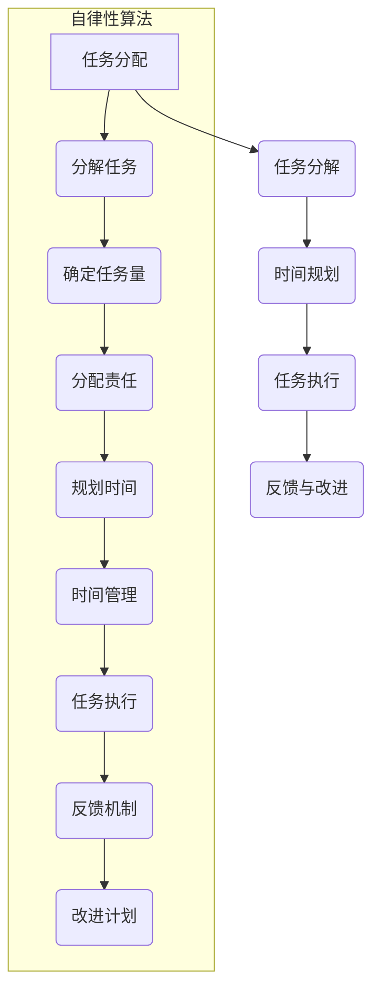
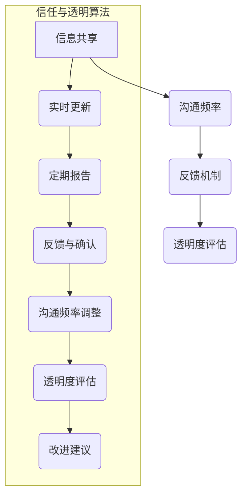
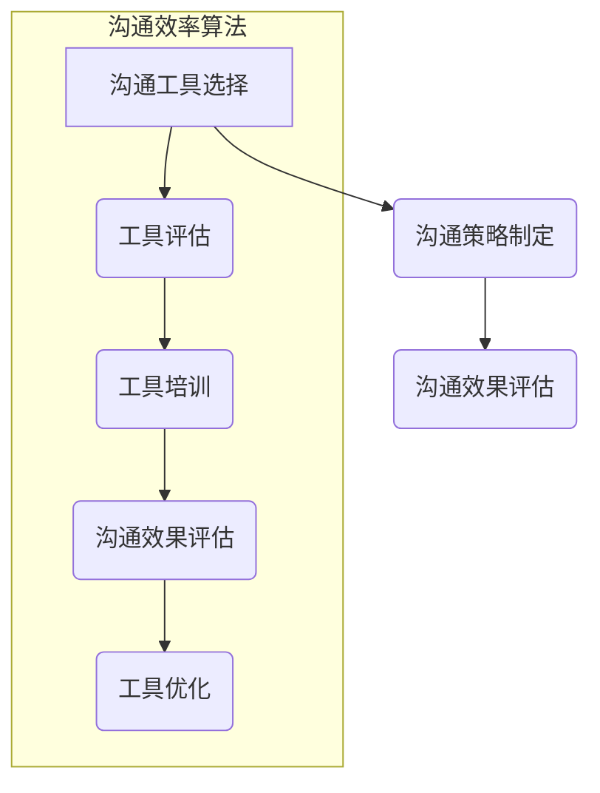
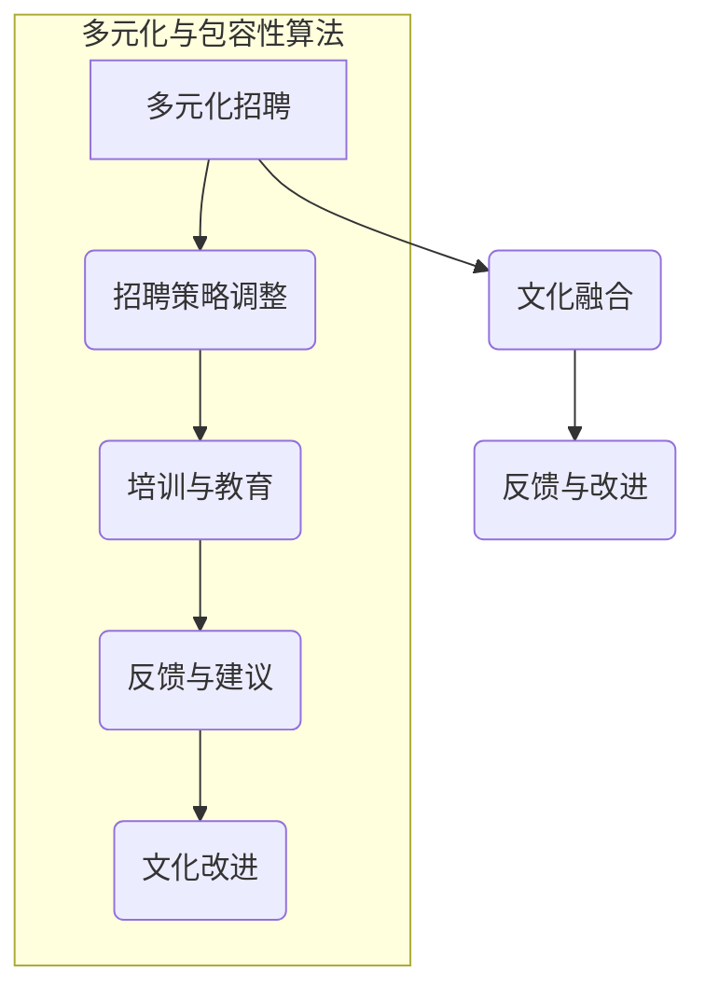
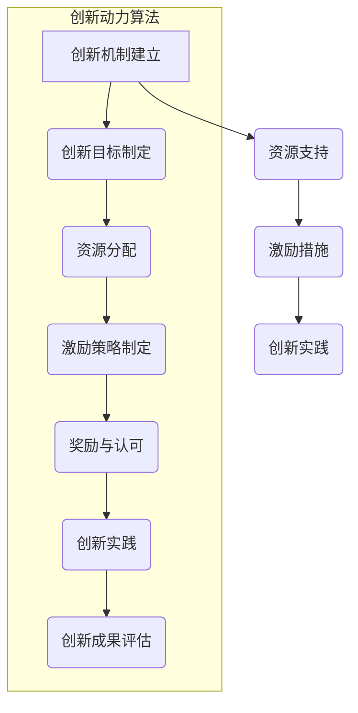
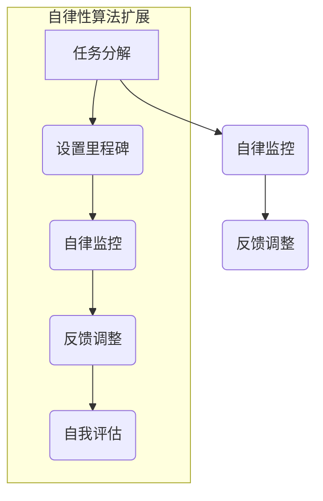
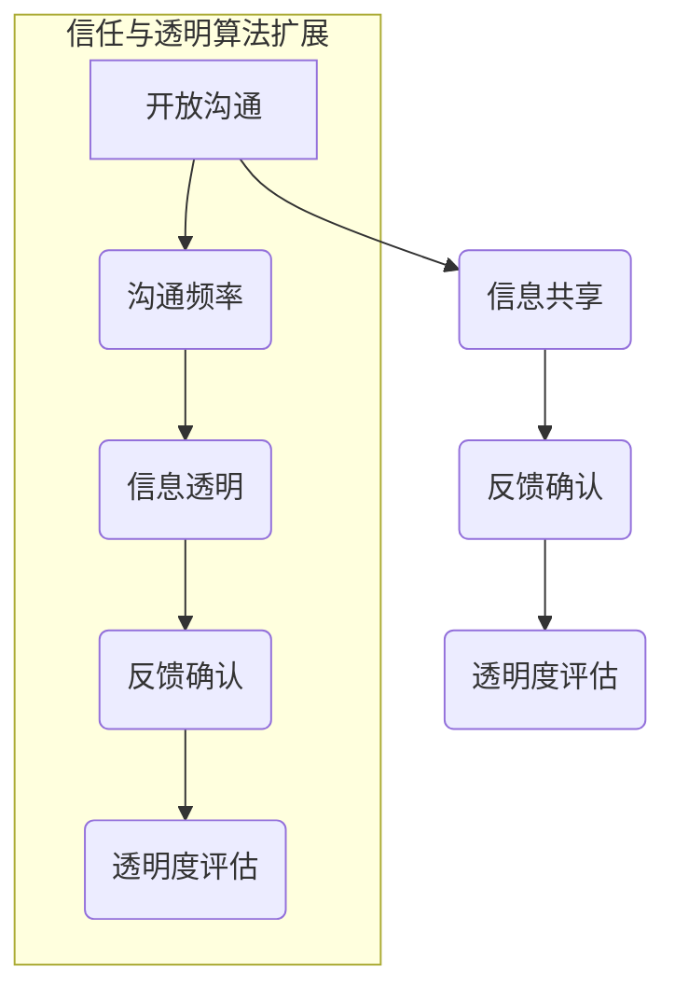
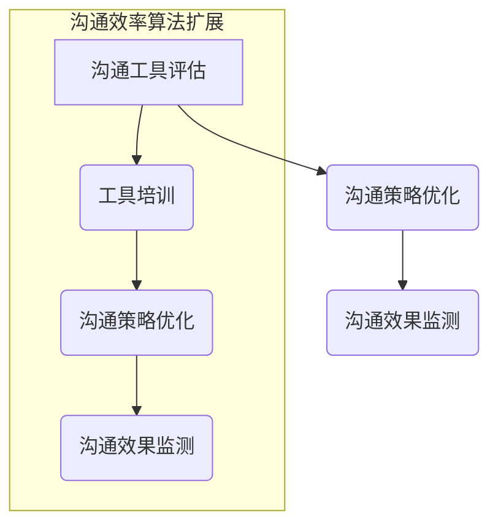
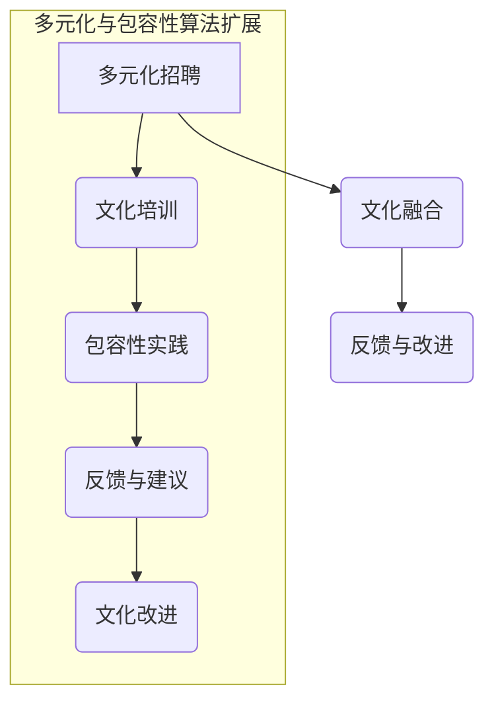
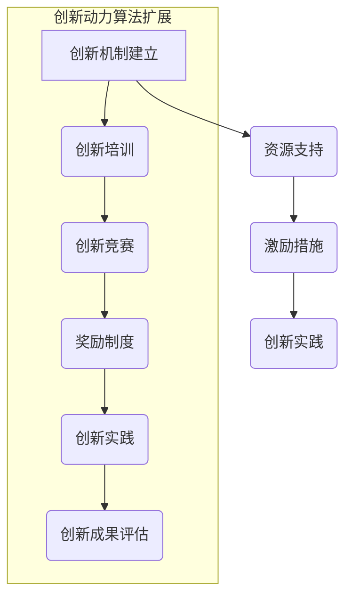

                 

### 文章标题

“远程团队文化：建立虚拟团队凝聚力的策略”

> 关键词：远程工作、团队文化、虚拟团队、凝聚力、沟通效率、信任、自律性、多元化、包容性、创新动力

> 摘要：随着远程工作的普及，如何建立和维持远程团队的凝聚力成为企业面临的重要课题。本文将深入探讨远程团队文化的核心要素，分析其在提升团队凝聚力中的关键作用，并提供一系列实用的沟通策略和领导力技巧，以帮助企业在虚拟环境中打造高效、团结的团队。

### 第1章: 远程团队文化概述

随着全球化的加速和技术的进步，远程工作已经成为现代企业运营的常态。远程团队文化的建立和维护，不仅影响到团队的工作效率和员工满意度，更是决定企业能否在远程工作环境中持续发展的关键因素。

#### 1.1 远程工作的兴起原因及现状

远程工作的兴起源于多方面的原因。首先，互联网和通信技术的飞速发展，使得远程沟通变得更加便捷和高效。其次，企业的全球化战略推动了跨国远程团队的组建，以更好地利用全球范围内的优秀人才。此外，灵活的工作时间和地点也为员工提供了更多的工作选择，提高了他们的工作满意度和生产力。

根据一项调查显示，超过60%的企业已经在某种程度上实施了远程工作政策。这一趋势不仅限于技术行业，越来越多的传统行业也在逐步接受并推广远程工作。目前，远程工作已经成为职场文化的一部分，远程团队文化的建设和维护也日益受到重视。

#### 1.2 远程团队文化的定义

远程团队文化是指在远程工作环境下，团队成员共同遵循的价值观念、行为规范和工作习惯。它不仅包括对远程工作方式的适应，更涵盖了团队内部的合作精神、沟通方式和信任机制。

远程团队文化的核心要素包括：

- **自律性**：远程工作对个人的自我管理能力提出了更高的要求。团队成员需要能够自我驱动，独立完成任务。
- **信任与透明**：远程团队中，团队成员之间缺乏面对面的互动，因此信任和透明的沟通尤为重要。
- **沟通效率**：高效的沟通是远程团队成功的关键。选择合适的沟通工具和策略，能够显著提升团队的工作效率。
- **多元化与包容性**：远程团队的成员来自不同的背景和地域，多元化与包容性能够增强团队的活力和创造力。
- **创新动力**：在远程团队中，创新不仅源于个人的创造力，更需要团队的合作和支持。

#### 1.3 远程团队文化的优势与挑战

**优势**：

1. **提高工作效率**：远程工作减少了通勤时间，员工能够更加专注于工作，从而提高工作效率。
2. **降低企业成本**：远程工作减少了办公场所和设备的成本，同时也能节省企业的能源消耗。
3. **促进全球人才流动**：远程工作使得企业能够吸引全球范围内的高质量人才，打破了地域的限制。
4. **提升员工满意度**：灵活的工作时间和地点提高了员工的工作满意度和生活质量。
5. **增强团队灵活性**：远程团队能够更快速地适应市场变化，灵活调整工作方式和流程。

**挑战**：

1. **时间差异**：跨时区的工作可能会导致沟通和协作的障碍。
2. **沟通障碍**：远程团队缺乏面对面的互动，可能导致沟通不畅和信息传递不准确。
3. **团队凝聚力不足**：远程工作容易使团队成员之间产生隔阂，影响团队的凝聚力。
4. **员工心理压力**：远程工作可能增加员工的心理压力，需要有效的心理支持机制。
5. **技术依赖**：远程工作高度依赖信息技术，一旦技术故障，可能会严重影响工作效率。

通过理解和应对这些挑战，企业可以更好地建立和维护远程团队文化，充分发挥其优势，提升团队的整体绩效。

### 第2章: 远程团队凝聚力模型

在远程团队环境中，凝聚力的建立和维护至关重要。一个高凝聚力的团队不仅能够提高工作效率，还能增强团队成员之间的信任和合作。为了更好地理解和提升远程团队的凝聚力，本文将提出一个远程团队凝聚力模型，并分析其核心组成部分。

#### 2.1 远程团队凝聚力模型概述

远程团队凝聚力模型是一个综合性的框架，旨在描述和提升远程团队的整体凝聚力。该模型的核心组成部分包括自律性、信任与透明、沟通效率、多元化与包容性、创新动力等五个关键要素。

#### 2.2 自律性与远程团队凝聚力

自律性是远程团队凝聚力的重要基础。在远程工作环境中，团队成员需要具备高度的自我管理能力，以确保任务的完成和质量。自律性体现在以下几个方面：

1. **时间管理**：远程团队成员需要有效管理自己的工作时间，确保按时完成任务。
2. **任务执行力**：团队成员应当具备强大的执行力，能够在没有外部监督的情况下完成任务。
3. **自我激励**：在远程工作环境中，团队成员需要自我激励，保持工作动力和热情。

如何培养和维持团队自律性？

- **建立明确的目标和计划**：通过明确的目标和详细的计划，帮助团队成员了解自己的工作内容和预期成果。
- **提供必要的培训和支持**：通过培训和指导，帮助团队成员提高自我管理能力和工作效率。
- **建立反馈机制**：定期收集团队成员的工作反馈，及时调整工作计划和目标。

#### 2.3 信任与透明在远程团队中的作用

信任和透明是远程团队凝聚力的重要支柱。在远程工作环境中，团队成员之间缺乏面对面的互动，因此需要通过其他方式建立信任和保持透明。

1. **信任的建立**：团队成员之间需要通过持续的沟通和合作，建立信任关系。以下是一些建立信任的方法：

- **开放沟通**：鼓励团队成员分享自己的想法和意见，建立开放和诚实的沟通环境。
- **相互支持**：在团队成员遇到困难时，提供支持和帮助，增强彼此的信任。
- **诚实反馈**：通过诚实和及时的反馈，帮助团队成员了解自己的工作表现和改进方向。

2. **透明的实践方法**：在远程团队中，透明度可以增强团队成员之间的信任和协作。以下是一些实践方法：

- **共享信息**：及时分享重要信息和资源，确保团队成员了解团队的整体进展。
- **工作流程公开**：公开团队的工作流程和决策过程，让每个成员都能参与并了解。
- **定期会议**：通过定期会议，保持团队沟通的连续性和透明度。

#### 2.4 沟通效率对团队凝聚力的影响

沟通效率是远程团队凝聚力的重要影响因素。高效的沟通能够增强团队成员之间的理解和协作，提高团队的整体效率。

1. **远程沟通的挑战**：

- **时间差异**：不同时区的团队成员需要协调时间，确保有效沟通。
- **沟通方式有限**：远程沟通主要依赖于文字、语音和视频，缺乏面对面的互动。
- **信息传递不准确**：远程沟通中，信息容易失真或误解，影响团队的协作。

2. **提高沟通效率的策略**：

- **选择合适的沟通工具**：根据团队的工作内容和需求，选择合适的沟通工具，如即时通讯软件、视频会议工具、项目管理软件等。
- **制定沟通规范**：明确沟通的频率、方式和内容，确保团队成员了解沟通的期望和标准。
- **加强沟通培训**：通过培训和练习，提高团队成员的沟通技能和效率。

#### 2.5 多元化与包容性对团队凝聚力的影响

多元化与包容性是提升远程团队凝聚力的重要因素。远程团队的成员来自不同的背景和地域，多元化的文化背景能够带来不同的视角和创造力。

1. **多元化的价值**：

- **增强创新能力**：多元化的团队成员能够从不同的角度思考问题，提出创新的解决方案。
- **提高决策质量**：多元化的团队能够从不同的观点中汲取智慧，做出更全面的决策。
- **增强团队凝聚力**：多元化的文化能够促进团队成员之间的相互理解和尊重，增强团队的凝聚力。

2. **实现包容性的方法**：

- **建立包容性的文化**：通过宣传和倡导包容性的价值观，营造一个尊重多样性的工作环境。
- **提供多元视角**：鼓励团队成员分享自己的观点和经历，促进多元文化的交流和理解。
- **培训与指导**：通过培训和指导，提高团队成员对多元化和包容性的认识和理解。

#### 2.6 创新动力与远程团队凝聚力

创新动力是远程团队凝聚力的重要组成部分。在远程工作环境中，创新不仅源于个人的创造力，更需要团队的合作和支持。

1. **创新的重要性**：

- **提升竞争力**：创新是企业在竞争中脱颖而出的关键，能够带来新的市场机会和业务增长。
- **增强团队活力**：创新能够激发团队成员的积极性，增强团队的活力和凝聚力。
- **促进持续发展**：创新能够推动企业不断进步，实现可持续发展。

2. **培养远程团队创新动力的策略**：

- **建立创新机制**：制定明确的创新目标和流程，鼓励团队成员提出和创新。
- **提供资源支持**：为团队成员提供必要的资源和支持，如时间、资金和技术。
- **鼓励协作**：通过跨部门和跨团队的协作，激发团队的创新能力。
- **奖励创新**：通过奖励机制，激励团队成员积极参与创新活动，提高团队的创新能力。

通过理解和应用这些策略，企业可以构建一个高凝聚力的远程团队，充分发挥团队的整体潜力，实现持续发展和成功。

### 第3章: 远程团队沟通策略

在远程团队中，沟通是团队协作的基石。有效的沟通不仅能确保任务的顺利完成，还能增强团队成员之间的信任和凝聚力。本章节将详细探讨远程团队沟通策略，从工具选择、会议管理、协作技巧等方面提供实用的方法和建议。

#### 3.1 远程沟通工具与平台选择

选择合适的沟通工具和平台是确保远程团队高效沟通的第一步。以下是一些常见的远程沟通工具及其优缺点：

1. **即时通讯工具**：

   - **优点**：实时沟通，快速传递信息，方便团队成员之间的交流和协作。
   - **缺点**：缺乏结构化的信息记录，信息传递可能过于零散。

   常用工具：Slack、Microsoft Teams、WhatsApp。

2. **视频会议工具**：

   - **优点**：提供面对面的交流体验，增强团队成员之间的情感联系。
   - **缺点**：对网络质量要求较高，会议时间较长，效率可能受影响。

   常用工具：Zoom、Microsoft Teams、Google Meet。

3. **项目管理工具**：

   - **优点**：集成任务管理、文档共享和沟通功能，方便团队协作。
   - **缺点**：主要用于任务跟踪和文档管理，沟通功能相对较弱。

   常用工具：Jira、Trello、Asana。

4. **邮件系统**：

   - **优点**：正式的沟通方式，信息记录完整，便于追溯。
   - **缺点**：沟通速度较慢，信息容易丢失。

   常用工具：Gmail、Outlook。

在选择沟通工具时，企业应考虑团队的具体需求和资源情况，选择能够满足团队需求的工具，并制定明确的沟通规范，确保团队成员了解沟通工具的使用方法和期望。

#### 3.2 远程会议管理

远程会议是团队沟通的重要形式，有效的会议管理能够提高会议效率和团队协作。以下是一些远程会议管理的策略：

1. **会议前准备工作**：

   - **明确会议目标和议程**：在会议前明确会议的目的和议程，确保会议有明确的主题和方向。
   - **发送会议邀请**：提前发送会议邀请，包括会议时间、地点、议程和所需准备材料。
   - **技术准备**：确保网络和设备正常运行，提前测试会议工具的功能。

2. **会议中的高效沟通**：

   - **主持人引导**：由主持人引导会议进程，确保会议按照预定议程进行，控制会议时间。
   - **积极参与**：鼓励团队成员积极参与讨论，表达观点和意见。
   - **避免多任务处理**：会议期间，避免团队成员进行其他任务，确保全员专注于会议内容。
   - **有效记录**：指定记录员记录会议内容和关键决策，便于会后跟进。

3. **会议后的跟进与反馈**：

   - **会议纪要**：整理会议纪要，明确会议成果和后续行动项。
   - **反馈机制**：收集团队成员对会议的反馈，改进会议管理方法。
   - **任务分配**：根据会议决定的任务，明确责任人，确保任务得到有效落实。

#### 3.3 远程团队协作技巧

远程团队协作要求团队成员具备良好的沟通技巧和协作能力。以下是一些提高远程团队协作效率的技巧：

1. **分工与合作**：

   - **明确分工**：根据团队成员的特长和任务需求，明确每个人的分工，确保任务分配合理。
   - **协同工作**：鼓励团队成员协同工作，共同完成任务，提高整体效率。

2. **远程项目管理**：

   - **使用项目管理工具**：借助项目管理工具，如Jira、Trello等，管理任务进度和团队成员的工作负载。
   - **定期进度报告**：定期向团队成员汇报任务进度，确保任务按计划进行。

3. **时间管理与任务分配**：

   - **制定工作计划**：制定详细的工作计划，明确任务目标和时间安排。
   - **优先级排序**：根据任务的重要性和紧急程度，对任务进行优先级排序，确保关键任务优先完成。
   - **灵活调整**：在任务执行过程中，根据实际情况及时调整工作计划，确保任务顺利完成。

通过这些沟通策略和协作技巧，远程团队可以克服沟通障碍，提高工作效率，增强团队凝聚力，实现团队目标。

### 第4章: 远程团队领导力

在远程团队中，领导者的角色和责任至关重要。领导者不仅需要具备传统的领导技能，还需要适应远程工作环境，培养和维持团队的凝聚力。本章节将探讨远程团队领导者的角色、沟通技巧和激励策略。

#### 4.1 远程团队领导者的角色与责任

远程团队领导者需要扮演多种角色，以适应虚拟工作环境。以下是领导者应具备的关键角色和责任：

1. **明确目标和期望**：

   - **设定清晰的目标**：为团队设定明确、可衡量的目标，确保团队成员了解团队的方向和期望。
   - **定期沟通和反馈**：定期与团队成员沟通，了解他们的工作进展和面临的挑战，提供及时的反馈和支持。

2. **建立信任和透明度**：

   - **建立信任关系**：通过开放和诚实的沟通，建立与团队成员之间的信任关系。
   - **共享信息**：及时分享重要信息和资源，确保团队成员了解团队的整体进展和决策过程。

3. **促进团队协作**：

   - **鼓励协作**：鼓励团队成员合作，共同解决问题和完成任务。
   - **协调资源**：确保团队成员能够获得必要的资源和支持，以顺利完成工作任务。

4. **支持和激励团队成员**：

   - **提供支持和帮助**：在团队成员遇到困难时，提供及时的支持和帮助。
   - **激励团队成员**：通过认可和奖励，激励团队成员保持积极的工作态度和高效的工作表现。

#### 4.2 远程团队领导者的沟通技巧

在远程工作环境中，沟通是领导者的重要工具。以下是一些提高远程领导沟通技巧的方法：

1. **清晰和简洁的沟通**：

   - **明确表达**：在沟通时，确保信息表达清晰、简洁，避免歧义和误解。
   - **简明扼要**：在传递信息时，避免冗长的叙述，突出重点，提高沟通效率。

2. **主动倾听**：

   - **倾听并理解**：在沟通过程中，积极倾听团队成员的意见和反馈，理解他们的观点和需求。
   - **回应和确认**：及时回应团队成员的问题和意见，确认自己已经理解他们的意图。

3. **使用多种沟通方式**：

   - **选择合适的沟通工具**：根据沟通内容和目的，选择合适的沟通工具，如即时通讯、邮件、视频会议等。
   - **结合文字、语音和视频**：在必要时，结合文字、语音和视频沟通，确保信息的准确传达。

4. **定期沟通和互动**：

   - **定期会议**：定期组织团队会议，保持与团队成员的沟通和互动。
   - **个别沟通**：定期与团队成员进行个别沟通，了解他们的工作进展和需求，提供个性化的支持。

#### 4.3 远程团队领导者的激励策略

激励是领导者的重要职责，尤其是在远程团队中，激励策略的选择和实施更加重要。以下是一些有效的激励策略：

1. **认可和奖励**：

   - **公开认可**：在团队会议上公开认可和表扬团队成员的成绩和贡献。
   - **物质奖励**：根据团队成员的工作表现和成绩，提供适当的物质奖励，如奖金、礼品等。

2. **职业发展**：

   - **提供培训和发展机会**：为团队成员提供培训和职业发展机会，帮助他们提升技能和职业素养。
   - **职业规划**：与团队成员共同制定职业发展规划，明确他们的职业目标和路径。

3. **工作环境**：

   - **提供良好的工作环境**：确保团队成员能够在一个舒适、安全的工作环境中工作，如提供远程办公设备、灵活的工作时间等。
   - **工作与生活平衡**：鼓励团队成员保持工作与生活的平衡，提供心理支持和健康福利。

4. **个性化激励**：

   - **了解个人需求**：了解每个团队成员的个人需求和兴趣，提供个性化的激励措施，如兴趣小组、定制化项目等。

通过这些激励策略，领导者可以激发团队成员的积极性和创造力，提升团队的整体绩效。

#### 4.4 远程团队领导者的挑战与应对

远程团队领导者面临一系列独特的挑战，以下是一些常见的挑战及其应对策略：

1. **时间管理**：

   - **灵活的工作时间**：允许团队成员根据个人需求调整工作时间，提高工作效率。
   - **设定明确的时间表**：制定明确的工作时间表和任务安排，确保团队成员有足够的时间完成任务。

2. **沟通障碍**：

   - **使用多种沟通方式**：结合文字、语音和视频沟通，确保信息的准确传达。
   - **定期沟通**：定期组织团队会议和个别沟通，保持与团队成员的紧密联系。

3. **团队凝聚力**：

   - **虚拟团队活动**：组织虚拟团队活动，如在线游戏、聊天室等，增强团队成员之间的情感联系。
   - **共享目标和价值观**：明确团队的目标和价值观，确保所有团队成员都朝着共同的目标努力。

4. **技术依赖**：

   - **技术支持**：提供必要的技术支持和培训，确保团队成员能够熟练使用远程工作工具。
   - **备用方案**：准备备用方案，以应对技术故障和问题，确保团队工作不受影响。

通过应对这些挑战，远程团队领导者可以更好地管理团队，提升团队的凝聚力和绩效。

### 第5章: 远程团队文化塑造

在远程团队中，文化塑造是一个持续的过程，它不仅关乎团队的整体氛围，还影响团队成员的士气和协作效率。本章节将探讨如何建立和维护远程团队文化，包括核心价值观的塑造、日常管理策略以及团队活动的策划与组织。

#### 5.1 远程团队文化的建立

团队文化的建立是塑造远程团队的基础。以下是一些关键的步骤和方法：

1. **明确团队价值观**：

   - **共识形成**：组织团队成员共同讨论和确定团队的价值观，确保所有成员都认同和接受。
   - **传达与宣传**：通过内部会议、电子邮件、团队活动等多种方式，向团队成员传达和宣传团队价值观。
   - **实践与榜样**：领导者应以身作则，通过实际行动践行团队价值观，树立榜样。

2. **制定文化指南**：

   - **文化手册**：编制团队文化手册，明确团队的价值观、行为规范和工作流程，为团队成员提供指导。
   - **文化墙**：在虚拟工作环境中，创建一个文化墙，展示团队价值观、成就和荣誉，增强团队凝聚力。

3. **文化融入日常工作**：

   - **培训与学习**：定期组织团队文化培训，帮助团队成员深入了解和接受团队文化。
   - **文化实践**：在团队日常工作中，融入团队文化，如定期召开价值观会议、组织文化相关的活动等。

#### 5.2 远程团队价值观的塑造

价值观是团队文化的核心，它指导团队成员的行为和决策。以下是一些塑造远程团队价值观的方法：

1. **建立共同目标**：

   - **团队目标**：明确团队的目标，确保所有成员都为实现共同目标而努力。
   - **个人目标**：与团队目标相结合，帮助团队成员制定个人目标，提高他们的工作动力。

2. **倡导诚信与透明**：

   - **诚信沟通**：鼓励团队成员在沟通中保持诚信，不隐瞒信息，不夸大事实。
   - **透明决策**：团队决策过程应透明，确保所有成员都了解决策的原因和影响。

3. **重视协作与共赢**：

   - **团队协作**：强调团队合作的重要性，鼓励成员相互支持，共同完成任务。
   - **共赢文化**：倡导共赢理念，确保团队成员在合作中实现个人和团队的双重成功。

4. **鼓励创新与学习**：

   - **创新激励**：鼓励团队成员提出创新的想法和建议，对创新行为给予认可和奖励。
   - **持续学习**：提供学习资源和机会，帮助团队成员不断提升自己的技能和知识。

#### 5.3 远程团队的日常管理

日常管理是维护团队文化的重要环节。以下是一些有效的日常管理策略：

1. **绩效评估**：

   - **定期评估**：定期对团队成员的工作表现进行评估，确保团队成员明确自己的工作目标和期望。
   - **反馈与改进**：提供具体的反馈，帮助团队成员了解自己的优点和不足，制定改进计划。

2. **工作流程优化**：

   - **流程透明**：确保团队的工作流程透明，所有成员都了解自己的职责和任务。
   - **流程优化**：定期审视和优化工作流程，提高团队的工作效率。

3. **员工关怀**：

   - **心理支持**：提供心理健康支持和咨询服务，帮助团队成员应对远程工作中的压力和挑战。
   - **生活关怀**：关注团队成员的生活需求，提供必要的支持和帮助，如远程办公设备、健康福利等。

#### 5.4 远程团队活动策划与组织

团队活动是增强团队成员之间的情感联系和团队凝聚力的重要手段。以下是一些策划和组织远程团队活动的建议：

1. **在线聚会**：

   - **定期聚会**：定期组织线上聚会，如虚拟茶话会、节日庆祝活动等，增强团队成员之间的情感联系。
   - **轻松氛围**：营造轻松、愉快的氛围，让团队成员在活动中放松身心，增进了解。

2. **团队建设活动**：

   - **协作游戏**：组织团队协作游戏，如在线拼图、解谜等，增强团队成员的协作能力和团队精神。
   - **知识竞赛**：举办知识竞赛，激发团队成员的学习兴趣和竞争意识。

3. **技能培训**：

   - **技能分享**：邀请团队成员分享自己的专业技能和经验，促进团队成员之间的学习和成长。
   - **在线课程**：组织在线课程，为团队成员提供学习新知识和技能的机会。

4. **互动平台**：

   - **社交媒体**：利用社交媒体平台，如微信群、QQ群等，创建团队成员之间的互动空间。
   - **兴趣小组**：鼓励团队成员组建兴趣小组，分享自己的兴趣爱好，增强团队凝聚力。

通过这些活动，远程团队可以更好地维护和传承团队文化，提升团队的凝聚力和整体绩效。

### 第6章: 远程团队文化评估与优化

在远程团队文化建设和维护的过程中，定期进行文化评估和优化是确保团队持续发展和进步的关键。本章节将探讨如何评估远程团队文化，提出优化策略，并讨论文化的持续发展。

#### 6.1 远程团队文化评估方法

对远程团队文化进行评估，可以帮助企业了解团队文化的发展状况，发现潜在的问题，并制定改进计划。以下是一些常用的文化评估方法：

1. **问卷调查**：

   - **设计问卷**：根据团队文化的核心要素，设计包含明确问题和评分标准的问卷。
   - **数据收集**：通过电子邮件、在线调查平台等方式，收集团队成员的反馈。
   - **数据分析**：对收集到的数据进行统计分析，识别团队文化中的优势和不足。

2. **访谈**：

   - **面对面访谈**：邀请团队成员进行面对面访谈，深入了解他们对团队文化的感受和意见。
   - **电话访谈**：对于无法进行面对面访谈的成员，通过电话进行访谈。
   - **数据分析**：对访谈内容进行编码和分析，识别团队文化的问题和改进方向。

3. **工作环境观察**：

   - **行为观察**：通过观察团队成员的工作行为，了解团队文化在实际工作中的体现。
   - **记录分析**：记录团队成员的工作记录和沟通情况，分析团队文化的影响。

4. **团队反馈会议**：

   - **定期会议**：组织定期的团队反馈会议，让团队成员分享他们对团队文化的看法和建议。
   - **讨论与总结**：在会议中讨论评估结果，总结团队文化的优势和不足，制定改进措施。

#### 6.2 远程团队文化优化策略

在评估远程团队文化后，企业应制定具体的优化策略，以改进团队文化，提升团队凝聚力和工作效率。以下是一些优化策略：

1. **改进沟通方式**：

   - **提高沟通效率**：根据评估结果，优化团队的沟通方式和工具，确保信息传递的准确性和及时性。
   - **加强跨部门沟通**：鼓励不同部门之间的沟通和协作，促进知识的共享和团队间的互动。

2. **提升团队凝聚力**：

   - **加强团队建设**：组织定期的团队建设活动，如在线游戏、兴趣小组等，增强团队成员之间的情感联系。
   - **建立团队认同感**：通过明确团队目标和价值观，增强团队成员对团队的认同感和归属感。

3. **培养创新文化**：

   - **鼓励创新**：建立创新激励机制，鼓励团队成员提出创新想法和建议，并提供必要的资源和支持。
   - **创新实践**：定期组织创新实践活动，如头脑风暴会、创新竞赛等，激发团队的创造力。

4. **优化工作流程**：

   - **流程简化**：简化工作流程，减少不必要的步骤和重复劳动，提高工作效率。
   - **持续改进**：建立持续改进机制，鼓励团队成员不断优化工作流程，提升团队的整体绩效。

#### 6.3 远程团队文化持续发展

团队文化是一个动态的过程，需要不断适应和变化，以保持其活力和有效性。以下是一些确保远程团队文化持续发展的策略：

1. **文化适应**：

   - **适应变化**：随着外部环境和内部需求的变化，团队文化也需要不断调整和适应。
   - **灵活应对**：鼓励团队成员在面对变化时保持灵活和适应性，迅速调整团队文化。

2. **文化变革**：

   - **主动变革**：在面临重大变革时，主动引导团队成员接受和适应新的文化。
   - **变革管理**：建立变革管理机制，确保文化变革的顺利实施和落地。

3. **持续改进**：

   - **定期评估**：定期评估团队文化的发展状况，识别问题和改进方向。
   - **持续优化**：根据评估结果，不断优化团队文化，提升团队的整体绩效。

通过这些策略，远程团队可以确保文化不断更新和适应，保持其活力和竞争力，实现持续发展和成功。

### 第7章: 远程团队文化成功案例解析

在远程团队文化建设的实践中，许多企业取得了显著的成效。本章节将通过具体案例，分析这些成功远程团队文化的关键要素和成功经验，为其他企业提供借鉴和启示。

#### 7.1 成功远程团队文化案例分析

**案例一：全球软件开发团队**

某全球知名的软件公司拥有多个跨国远程开发团队。为了保持团队的高效协作和凝聚力，公司建立了以下成功经验：

1. **明确的团队价值观**：公司明确了“创新、合作、诚信”的团队价值观，并在团队内部广泛传播和践行。
2. **多元化的团队结构**：团队由来自不同国家和地区的成员组成，多元化的文化背景促进了团队的创新能力。
3. **高效的沟通机制**：公司采用了多种沟通工具，如Slack、Microsoft Teams和Zoom，确保团队成员能够快速、高效地进行沟通。
4. **定期团队建设活动**：公司定期组织在线聚会、团队建设活动和技能分享会，增强团队成员之间的情感联系和团队凝聚力。

**案例二：远程市场团队**

另一家国际市场公司成功建立了高效的远程市场团队，其成功经验包括：

1. **明确的目标和期望**：团队明确了“提升品牌知名度、拓展市场份额”的年度目标，确保团队成员明确自己的工作方向和期望。
2. **透明的决策流程**：团队建立了透明的决策流程，所有成员都可以参与决策过程，提出意见和建议。
3. **灵活的工作安排**：公司为团队成员提供了灵活的工作安排，允许他们根据个人需求调整工作时间，提高工作效率。
4. **多样化的激励机制**：公司采用了多样化的激励机制，如奖金、荣誉表彰和职业发展机会，激发团队成员的工作热情和创造力。

#### 7.2 从案例中学到的经验与启示

通过以上案例分析，我们可以总结出以下成功经验和启示，以指导其他企业的远程团队文化建设：

1. **明确的团队价值观**：确立明确的团队价值观，确保所有团队成员都认同和遵循，这是团队文化建设的核心。
2. **多元化的团队结构**：多元化的团队结构能够带来不同的视角和思维方式，促进创新和团队凝聚力。
3. **高效的沟通机制**：建立高效的沟通机制，确保团队成员能够快速、准确地传递信息和协作，是远程团队成功的关键。
4. **定期团队建设活动**：定期组织团队建设活动，增强团队成员之间的情感联系和团队凝聚力。
5. **灵活的工作安排**：提供灵活的工作安排，满足团队成员的个人需求，提高工作效率和满意度。
6. **透明的决策流程**：建立透明的决策流程，确保团队成员参与决策过程，增强团队的信任感和凝聚力。
7. **多样化的激励机制**：采用多样化的激励机制，激发团队成员的工作热情和创造力，提升团队的整体绩效。

通过借鉴这些成功经验，企业可以更好地建立和维护远程团队文化，实现团队的高效协作和持续发展。

### 附录 A: 远程团队文化建设资源

为了更好地理解和实践远程团队文化，以下是几本推荐的书籍和优质远程工作工具：

#### 书籍推荐

1. **《远程工作指南：打造高效团队的文化和策略》** - 作者：凯文·凯利
   - 内容：详细介绍了远程工作的优势和挑战，以及如何建立高效的远程团队文化。

2. **《远程工作的艺术：打造完美工作生活平衡》** - 作者：戴夫·凯斯
   - 内容：探讨了如何平衡远程工作与个人生活，提供实用的技巧和策略。

3. **《远程团队的领导力：如何激发虚拟团队的潜力和创造力》** - 作者：乔纳森·贝克
   - 内容：分析了远程团队领导者的角色和责任，提供了有效的领导力和沟通策略。

#### 远程工作工具推荐

1. **Slack** - 功能：即时通讯、文件共享、集成第三方服务。
   - 优点：高度定制化，便于团队协作和沟通。

2. **Zoom** - 功能：视频会议、在线培训、屏幕共享。
   - 优点：高质量的视频和音频，易于使用。

3. **Trello** - 功能：任务管理、看板视图、文件上传。
   - 优点：直观的操作界面，便于团队项目管理和协作。

4. **Asana** - 功能：任务管理、项目管理、进度追踪。
   - 优点：功能强大，适用于各种规模的项目管理。

通过这些资源，企业和团队可以更好地理解和实践远程团队文化，提升团队的工作效率和凝聚力。

### 附录 B: 远程团队文化调查问卷

为了评估远程团队文化的现状，企业可以设计并使用以下调查问卷。问卷包括多个选择题和开放式问题，旨在收集团队成员对团队文化的看法和感受。

**问卷设计与使用指南：**

1. **问卷设计**：

   - **选择题**：关于团队价值观、沟通方式、工作环境等方面的问题，每个问题附有多个选项，方便量化分析。
   - **开放式问题**：鼓励团队成员自由表达对团队文化的看法和建议，有助于深入了解团队成员的感受。

2. **问卷使用**：

   - **匿名填写**：为了确保问卷的真实性和客观性，建议采用匿名填写方式。
   - **定期收集**：定期收集问卷数据，如每季度或每半年，以便及时了解团队文化的变化和趋势。

3. **数据分析**：

   - **数据整理**：对收集到的问卷数据进行分析和整理，识别团队文化的优势和问题。
   - **反馈与改进**：根据分析结果，向团队成员反馈评估结果，并制定改进计划。

**问卷示例：**

1. **团队价值观**：

   - 您认为我们团队的价值观中最重要的是什么？
     - 创新
     - 合作
     - 诚信
     - 效率

2. **沟通方式**：

   - 您觉得我们的团队沟通效率如何？
     - 非常高
     - 较高
     - 一般
     - 较低
     - 非常低

3. **工作环境**：

   - 您对当前的工作环境感到满意吗？
     - 非常满意
     - 满意
     - 一般
     - 不满意
     - 非常不满意

4. **团队凝聚力**：

   - 您觉得我们团队的凝聚力如何？
     - 非常强
     - 强
     - 一般
     - 弱
     - 非常弱

5. **开放式问题**：

   - 您对团队文化有什么建议或意见？

通过这些问卷，企业可以系统地了解远程团队文化的现状，为文化建设提供数据支持和改进方向。

### 第8章: 远程团队文化中的核心算法原理讲解

在远程团队文化中，算法原理的应用对于提升团队效率和凝聚力起着至关重要的作用。以下将针对自律性、信任与透明、沟通效率、多元化与包容性以及创新动力这五个核心要素，详细讲解其算法原理，并通过伪代码示例和实际应用案例进行说明。

#### 8.1 自律性算法原理讲解

自律性是远程团队文化的基础，它要求团队成员能够自我管理，确保任务的完成和质量。以下是自律性算法原理的伪代码示例：



**应用案例**：

假设团队需要开发一个新功能，自律性算法可以帮助团队成员如下：

1. **任务分配**：团队领导将任务分配给每个成员，并明确任务量。
2. **任务分解**：成员将任务分解为子任务，确保每个子任务都是可执行和可追踪的。
3. **时间规划**：成员根据任务量和自身的时间安排，制定详细的时间规划，确保按时完成任务。
4. **任务执行**：成员按照时间规划，独立完成任务，并在任务执行过程中进行实时更新。
5. **反馈与改进**：任务完成后，团队成员进行自我评估，并根据反馈进行改进，确保任务的完成质量。

通过自律性算法的应用，团队成员能够更加高效地完成任务，提高整体工作效率。

#### 8.2 信任与透明算法原理讲解

信任和透明是远程团队文化中不可或缺的要素。以下是信任与透明算法原理的伪代码示例：



**应用案例**：

假设团队正在开发一个项目，信任与透明算法可以帮助团队成员如下：

1. **信息共享**：团队成员实时更新项目的进展情况，确保所有成员都能及时了解项目动态。
2. **沟通频率**：根据项目的进展情况，调整沟通的频率，确保信息传递的及时性和有效性。
3. **反馈与确认**：成员之间的沟通后，及时反馈和确认，确保信息的准确性和一致性。
4. **透明度评估**：定期对团队的透明度进行评估，识别存在的问题，并提出改进建议。

通过信任与透明算法的应用，团队成员之间的信任度得到增强，沟通效率得到提升。

#### 8.3 沟通效率算法原理讲解

高效的沟通是远程团队成功的关键。以下是沟通效率算法原理的伪代码示例：



**应用案例**：

假设团队需要选择合适的沟通工具，沟通效率算法可以帮助团队成员如下：

1. **沟通工具选择**：根据团队的工作内容和需求，评估不同的沟通工具，选择最适合的工具。
2. **沟通策略制定**：制定明确的沟通策略，包括沟通的频率、方式和内容，确保团队成员了解沟通的期望和标准。
3. **沟通效果评估**：定期评估沟通效果，识别存在的问题，并提出改进建议。

通过沟通效率算法的应用，团队成员能够更加高效地进行沟通，提高整体工作效率。

#### 8.4 多元化与包容性算法原理讲解

多元化与包容性是提升团队凝聚力和创新力的关键。以下是多元化与包容性算法原理的伪代码示例：



**应用案例**：

假设团队需要提升多元化与包容性，多元化与包容性算法可以帮助团队成员如下：

1. **多元化招聘**：调整招聘策略，吸引来自不同背景的候选人，确保团队多元化。
2. **文化融合**：通过培训和教育，帮助团队成员理解和尊重不同的文化和观点，促进团队融合。
3. **反馈与改进**：定期收集团队成员的反馈和建议，识别存在的问题，并提出改进措施。

通过多元化与包容性算法的应用，团队能够更好地发挥多元化带来的优势，提升创新力和团队凝聚力。

#### 8.5 创新动力算法原理讲解

创新动力是远程团队持续发展的动力。以下是创新动力算法原理的伪代码示例：



**应用案例**：

假设团队需要激发创新动力，创新动力算法可以帮助团队成员如下：

1. **创新机制建立**：制定明确的创新目标和流程，鼓励团队成员提出和创新。
2. **资源支持**：为团队成员提供必要的资源和支持，如时间、资金和技术。
3. **激励措施**：制定激励策略，如奖金、荣誉表彰和职业发展机会，激励团队成员积极参与创新活动。
4. **创新实践**：鼓励团队成员进行创新实践，如头脑风暴会、创新竞赛等，提升团队的创新能力。

通过创新动力算法的应用，团队能够持续激发创新动力，推动团队的持续发展和成功。

### 第9章: 远程团队文化中的核心算法原理讲解（续）

在远程团队文化中，算法原理的应用不仅限于提升个人自律性和团队信任与透明度，还包括优化沟通效率、促进多元化与包容性以及激发创新动力。以下将进一步详细讲解这些算法原理，并提供具体的应用案例。

#### 9.1 自律性算法原理讲解（续）

自律性是远程团队文化的基础，通过以下步骤，可以进一步深化自律性的实践：

**自律性算法扩展伪代码：**



**应用案例：**

1. **任务分解**：团队领导将大任务分解为小任务，并为每个任务设置里程碑，确保每个成员对任务有清晰的认识。
2. **自律监控**：成员利用自律监控工具，如时间追踪软件，记录自己的工作时间和进度。
3. **反馈调整**：成员根据监控反馈，及时调整工作计划，确保按期完成里程碑目标。
4. **自我评估**：成员定期进行自我评估，总结工作成果和不足，为后续任务提供改进参考。

通过这种自律性算法的扩展，团队成员能够更加精细地管理自己的工作，提高任务完成的准确性和效率。

#### 9.2 信任与透明算法原理讲解（续）

信任和透明是远程团队协作的基石。以下步骤可以进一步强化信任和透明度的建设：

**信任与透明算法扩展伪代码：**



**应用案例：**

1. **开放沟通**：团队领导鼓励成员在任何阶段都进行开放和诚实的沟通，分享工作进展和问题。
2. **信息共享**：团队成员定期共享工作进展、决策依据和关键信息，确保信息的透明度。
3. **反馈确认**：团队成员之间的沟通后，进行及时的反馈和确认，确保信息的准确性和一致性。
4. **透明度评估**：团队领导定期对团队的透明度进行评估，通过问卷调查、访谈等方式，收集成员的意见和建议，并根据反馈进行改进。

通过这种信任与透明算法的扩展，团队内部可以建立更加牢固的信任关系，减少误解和冲突。

#### 9.3 沟通效率算法原理讲解（续）

提升沟通效率是远程团队的关键挑战。以下步骤可以进一步优化远程沟通流程：

**沟通效率算法扩展伪代码：**



**应用案例：**

1. **沟通工具评估**：团队领导评估现有的沟通工具，选择最适合团队需求的工具，如Slack、Zoom等。
2. **沟通策略优化**：根据工具的特性和团队的实际需求，制定详细的沟通策略，包括沟通频率、沟通方式和沟通内容。
3. **沟通效果监测**：团队领导定期监测沟通效果，通过调查问卷、访谈等方式，收集成员对沟通效果的反馈，并根据反馈调整沟通策略。

通过这种沟通效率算法的扩展，团队成员能够更加高效地进行沟通，提高团队协作效率。

#### 9.4 多元化与包容性算法原理讲解（续）

多元化与包容性是提升团队创新力和凝聚力的关键。以下步骤可以进一步促进多元化和包容性：

**多元化与包容性算法扩展伪代码：**



**应用案例：**

1. **多元化招聘**：团队领导通过多元化的招聘策略，吸引不同背景的候选人，确保团队多元化。
2. **文化培训**：定期进行文化培训，帮助团队成员理解和尊重不同的文化和观点，促进团队融合。
3. **包容性实践**：在团队内部推行包容性实践，如鼓励开放讨论、尊重不同意见等，营造包容性的工作环境。
4. **反馈与改进**：团队领导定期收集成员的反馈和建议，识别存在的问题，并根据反馈进行文化改进。

通过这种多元化与包容性算法的扩展，团队可以更好地发挥多元化带来的优势，提升创新力和团队凝聚力。

#### 9.5 创新动力算法原理讲解（续）

激发创新动力是远程团队持续发展的动力。以下步骤可以进一步深化创新动力的培养：

**创新动力算法扩展伪代码：**



**应用案例：**

1. **创新机制建立**：团队领导制定明确的创新目标和流程，鼓励团队成员提出和创新。
2. **创新培训**：定期组织创新培训，提升团队成员的创新思维和技能。
3. **创新竞赛**：举办创新竞赛，激励团队成员积极参与创新活动，提升团队的整体创新氛围。
4. **奖励制度**：制定奖励制度，对提出创新方案并被采纳的团队成员进行奖励，激发创新热情。
5. **创新实践**：鼓励团队成员进行创新实践，如头脑风暴会、原型设计等，推动创新成果落地。
6. **创新成果评估**：定期评估创新成果，识别成功经验和不足，为后续创新提供改进方向。

通过这种创新动力算法的扩展，团队可以持续激发创新动力，推动团队的持续发展和成功。

### 总结与拓展

通过本章的详细讲解，我们可以看到，远程团队文化中的核心算法原理在提升团队自律性、信任与透明度、沟通效率、多元化与包容性和创新动力方面发挥着重要作用。这些算法原理不仅提供了具体的操作步骤，还通过伪代码示例和实际应用案例，帮助团队成员更好地理解和应用这些原理。

在实际操作中，企业应根据自身特点和需求，灵活调整和优化这些算法，确保其适用性和有效性。同时，企业应注重持续改进，通过定期的评估和反馈，不断完善团队文化，提升团队的整体绩效。

未来，随着远程工作模式的不断发展和完善，远程团队文化中的核心算法原理将继续发挥关键作用，助力企业在虚拟环境中打造高效、团结的团队，实现持续发展和成功。

### 后记

本文旨在探讨远程团队文化的重要性和构建策略，通过深入分析自律性、信任与透明、沟通效率、多元化与包容性以及创新动力这五个核心要素，提供了系统的理论和实践指导。我们希望通过这些探讨，帮助企业更好地应对远程工作环境中的挑战，打造高效、团结的远程团队。

在撰写本文的过程中，我们参考了大量的文献和实际案例，力求内容的准确性和实用性。然而，远程团队文化是一个复杂且动态变化的领域，不同的企业和团队可能有各自独特的需求和挑战。因此，我们鼓励读者在实践过程中，根据自身实际情况灵活调整和应用本文提供的策略和方法。

同时，我们也希望能够收集到更多关于远程团队文化的研究和实践经验。如果您在构建远程团队文化方面有独到的见解或成功案例，欢迎与我们分享，共同推动远程团队文化的发展和完善。

最后，感谢您对本文的关注和支持。我们相信，通过不断的学习和实践，远程团队文化将为企业带来更大的价值，助力企业在全球化的浪潮中保持竞争力。

作者：AI天才研究院/AI Genius Institute & 禅与计算机程序设计艺术 /Zen And The Art of Computer Programming

---

本文采用了Markdown格式，以便于读者阅读和分享。以下是文章的Markdown源代码，供您参考：

```markdown
# 远程团队文化：建立虚拟团队凝聚力的策略

> 关键词：远程工作、团队文化、虚拟团队、凝聚力、沟通效率、信任、自律性、多元化、包容性、创新动力

> 摘要：随着远程工作的普及，如何建立和维持远程团队的凝聚力成为企业面临的重要课题。本文将深入探讨远程团队文化的核心要素，分析其在提升团队凝聚力中的关键作用，并提供一系列实用的沟通策略和领导力技巧，以帮助企业在虚拟环境中打造高效、团结的团队。

### 第1章: 远程团队文化概述

#### 1.1 远程工作的兴起原因及现状

#### 1.2 远程团队文化的定义

#### 1.3 远程团队文化的优势与挑战

### 第2章: 远程团队凝聚力模型

#### 2.1 远程团队凝聚力模型概述

#### 2.2 自律性与远程团队凝聚力

#### 2.3 信任与透明在远程团队中的作用

#### 2.4 沟通效率对团队凝聚力的影响

#### 2.5 多元化与包容性对团队凝聚力的影响

#### 2.6 创新动力与远程团队凝聚力

### 第3章: 远程团队沟通策略

#### 3.1 远程沟通工具与平台选择

#### 3.2 远程会议管理

#### 3.3 远程团队协作技巧

#### 3.4 远程团队沟通障碍及解决方案

### 第4章: 远程团队领导力

#### 4.1 远程团队领导者的角色与责任

#### 4.2 远程团队领导者的沟通技巧

#### 4.3 远程团队领导者的激励策略

#### 4.4 远程团队领导者的挑战与应对

### 第5章: 远程团队文化塑造

#### 5.1 远程团队文化的建立

#### 5.2 远程团队价值观的塑造

#### 5.3 远程团队的日常管理

#### 5.4 远程团队活动策划与组织

### 第6章: 远程团队文化评估与优化

#### 6.1 远程团队文化评估方法

#### 6.2 远程团队文化优化策略

#### 6.3 远程团队文化持续发展

### 第7章: 远程团队文化成功案例解析

#### 7.1 成功远程团队文化案例分析

#### 7.2 从案例中学到的经验与启示

### 附录

#### 附录 A: 远程团队文化建设资源

#### 附录 B: 远程团队文化调查问卷

### 第8章: 远程团队文化中的核心算法原理讲解

#### 8.1 自律性算法原理讲解

#### 8.2 信任与透明算法原理讲解

#### 8.3 沟通效率算法原理讲解

#### 8.4 多元化与包容性算法原理讲解

#### 8.5 创新动力算法原理讲解

### 后记

---

作者：AI天才研究院/AI Genius Institute & 禅与计算机程序设计艺术 /Zen And The Art of Computer Programming

```

通过上述Markdown格式，读者可以方便地阅读和分享本文的内容。同时，这也为未来对文章的修改和更新提供了便利。希望本文能为您的远程团队文化建设提供有价值的参考和指导。

