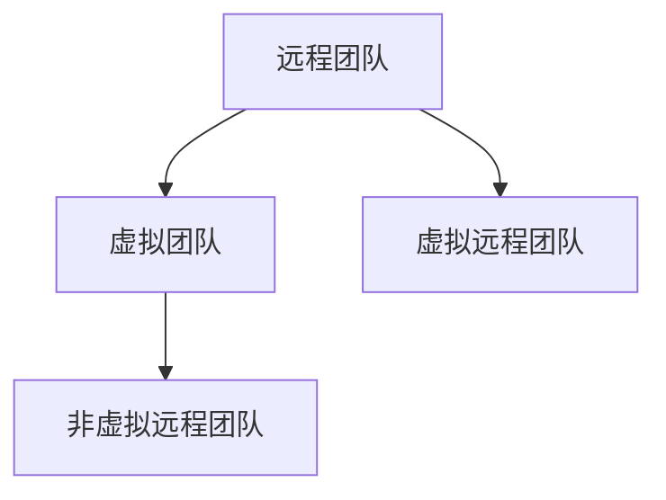

                 

### 引言与概述

#### 1.1 远程团队与虚拟团队的概念

**远程团队**（Remote Team）是指那些成员分布在不同的地理位置，通过现代通信技术进行协作和沟通的团队。远程团队的工作模式使得成员可以在不同的时区、不同的环境中工作，不必局限于固定的办公场所。这种工作方式在现代全球化、技术进步的背景下越来越普遍。

**虚拟团队**（Virtual Team）是远程团队的一种特殊形式，其主要特征是成员之间几乎没有面对面的接触，完全依靠虚拟工具进行沟通和协作。虚拟团队可能跨越不同的国家和地区，成员的工作地点可以是家中、咖啡店或者任何拥有网络连接的地方。

**远程团队与虚拟团队的关联**：远程团队和虚拟团队并非完全独立，而是存在一定的交叉和重叠。远程团队可以包括虚拟团队，但并不一定全是虚拟团队。远程团队中的成员有时会在同一地点工作，只是通过远程技术进行沟通和协作。而虚拟团队则完全依赖于虚拟工具，成员之间几乎不存在面对面的互动。

**Mermaid 流程图**：为了更清晰地展示远程团队和虚拟团队之间的关系，我们可以使用Mermaid流程图来表示。以下是该流程图的伪代码表示：

在这个流程图中，远程团队（A）是一个总体概念，它包括了虚拟团队（B）和非虚拟远程团队（C）。虚拟团队（B）进一步划分为完全依赖虚拟工具的团队和部分依赖远程技术的团队（D）。

#### 1.2 远程团队绩效研究的重要性

**远程团队在现代工作环境中的普及**：随着全球化的深入和信息技术的发展，远程工作已经逐渐成为许多企业和组织的选择。远程团队的优势包括灵活的工作时间、降低企业运营成本、扩大人才选择范围等。因此，如何有效管理和评估远程团队的绩效，已经成为企业管理者关注的重点。

**虚拟团队面临的挑战与机遇**：虽然远程团队带来了许多优势，但也面临着一系列挑战。例如，团队成员之间的沟通协作可能受到地域和时区的限制，导致工作效率降低。此外，虚拟团队的文化建设和管理也相对复杂，需要采取不同的策略和方法。

然而，远程团队也带来了许多机遇。通过合理利用远程技术，企业可以打破地域限制，吸引全球优秀人才；通过灵活的工作安排，员工可以获得更好的工作生活平衡。因此，研究远程团队的绩效评估和提升方法，不仅有助于解决面临的挑战，还能充分挖掘远程工作的潜力。

#### 1.3 文章结构与主要内容

本文将从以下几个方面深入探讨远程团队绩效评估和提升虚拟团队表现的方法：

1. **远程团队绩效评估**：介绍评估远程团队绩效的指标和方法，包括工作质量与效率、团队协作与沟通、成员满意度和工作动机等。
   
2. **虚拟团队的组织和管理**：讨论如何设计和维护虚拟团队，包括团队结构、角色定义、沟通机制等。

3. **提升虚拟团队绩效的方法**：提供一系列的策略和工具，以提升远程团队的工作效率，包括团队协作与沟通技巧、激励策略、工作生活平衡等。

4. **实践案例研究**：分析一些成功和失败的远程团队案例，以提炼出实际操作的经验。

5. **技术工具与支持**：介绍远程团队所需的软件、硬件和技术支持，以及如何提供有效的技术支持。

6. **挑战与未来展望**：讨论远程团队在当前和未来可能面临的挑战，以及可能的解决方案。

通过以上内容的详细讨论，本文旨在为远程团队的管理者和成员提供一套全面、实用的绩效评估和提升方法，帮助他们更好地适应远程工作环境，提高工作效率和质量。

### 远程团队绩效评估

评估远程团队的绩效是确保团队目标实现和持续改进的关键环节。有效的绩效评估不仅能够帮助团队识别存在的问题，还能为团队提供改进的方向。以下是评估远程团队绩效的常用指标和方法。

#### 2.1 评估远程团队绩效的指标

**工作质量与效率**：工作质量与效率是衡量远程团队绩效的重要指标。工作质量涉及任务完成的准确性和可靠性，而工作效率则关注完成任务的速度和资源利用效率。以下是几个具体指标：

- **任务完成率**：完成任务的百分比，反映团队的工作效率。
- **错误率**：在完成任务过程中出现的错误数量，衡量团队的工作质量。
- **响应时间**：从接收到任务到完成任务所需的时间，反映团队的响应速度。

**团队协作与沟通**：远程团队的协作与沟通对于绩效具有至关重要的影响。良好的协作与沟通能够提高团队的工作效率，减少误解和冲突。以下是几个具体指标：

- **沟通频率**：团队成员之间沟通的频率，反映团队的合作程度。
- **沟通效率**：沟通信息的清晰度和准确性，衡量团队沟通的质量。
- **协作工具使用率**：团队成员使用协作工具的频率和效果，反映团队协作的水平。

**成员满意度和工作动机**：成员的满意度和工作动机是影响团队绩效的重要因素。高满意度和强工作动机能够提高团队成员的投入度和创造力。以下是几个具体指标：

- **工作满意度**：团队成员对工作的整体满意度，反映团队成员的工作心理状态。
- **工作动机**：团队成员对工作的积极性和动力，衡量团队成员的工作投入程度。
- **参与度**：团队成员参与团队活动和决策的程度，反映团队的凝聚力。

#### 2.2 远程团队绩效评估的方法

**自我评估与反馈**：自我评估是团队成员对自己工作绩效的评估，它可以帮助成员识别自身的优点和不足，为自我提升提供方向。通过定期的自我评估，团队成员可以反思自己的工作表现，并设定改进目标。以下是自我评估的步骤：

1. **设定评估标准**：根据团队目标和绩效指标，制定明确的评估标准。
2. **自我评估**：团队成员按照评估标准对自己的工作表现进行评估。
3. **反馈与改进**：团队成员根据评估结果，进行反馈和改进。

**第三方评估**：第三方评估是指由外部专家或独立机构对团队绩效进行的评估。第三方评估通常更加客观、公正，能够提供更加全面和准确的评估结果。以下是第三方评估的步骤：

1. **选择评估机构**：根据团队需求，选择合适的评估机构。
2. **收集数据**：通过问卷调查、访谈、观察等方式，收集团队成员的工作数据和反馈。
3. **分析数据**：对收集的数据进行分析，识别团队的优势和不足。
4. **提供反馈**：向团队提供评估报告，并提出改进建议。

**数据收集与分析**：数据收集与分析是评估远程团队绩效的重要手段。通过收集和分析团队工作的各种数据，可以全面了解团队的工作表现。以下是数据收集与分析的步骤：

1. **确定数据收集方法**：根据评估指标，选择合适的数据收集方法，如问卷调查、日志记录、在线分析工具等。
2. **收集数据**：通过各种渠道收集团队成员的工作数据。
3. **数据分析**：对收集的数据进行统计分析，识别团队的工作趋势和问题。
4. **生成报告**：根据分析结果，生成详细的绩效评估报告。

**评估工具**：为了提高绩效评估的效率和准确性，可以采用一些评估工具。以下是几个常用的评估工具：

- **绩效评估系统**：集成多种评估指标和功能的在线系统，如KPI管理系统、360度评估系统等。
- **问卷调查**：通过在线问卷收集团队成员的反馈，快速了解团队的工作状态。
- **访谈**：通过与团队成员进行面对面的访谈，深入了解团队的工作情况和问题。
- **日志分析**：通过分析团队成员的工作日志，了解工作进度和问题。

通过以上方法，远程团队可以全面、准确地评估自身的绩效，为团队改进提供科学依据。同时，定期的绩效评估也有助于激发团队成员的工作动力，提高团队的整体绩效。

### 虚拟团队的组织和管理

在设计和维护虚拟团队时，确保团队的有效运作和协作至关重要。虚拟团队的管理需要针对其独特的特点，制定合适的组织结构、角色定义、沟通机制等策略。以下是详细的讨论和具体建议。

#### 3.1 设计有效的虚拟团队结构

**团队规模与组成**：虚拟团队的大小应根据任务的复杂度和团队的灵活性来决定。一般来说，小型虚拟团队（3-6人）更易于管理和协调，能够快速响应变化。在成员选择上，应确保团队成员具备互补的技能，以便在任务执行过程中实现高效协作。

**团队角色与职责分配**：在虚拟团队中，明确每个成员的角色和职责是非常重要的。每个成员应明确自己的任务和工作目标，避免职责重叠和责任模糊。以下是常见角色及其职责：

- **项目经理**：负责整个团队的目标设定、进度控制和资源分配。
- **技术专家**：负责技术问题的解决和指导，确保任务按技术要求完成。
- **沟通协调员**：负责团队内部和外部沟通的协调，确保信息的有效传递。
- **质量保证**：负责检查任务完成的质量，确保工作符合标准和要求。

**虚拟团队领导者的角色与职责**：虚拟团队领导者不仅要具备管理能力，还需要具备远程团队特有的领导技能。以下是虚拟团队领导者应承担的职责：

- **明确目标与期望**：领导者应明确团队的目标和期望，确保所有成员都了解任务的重要性和紧迫性。
- **制定计划与策略**：领导者需要制定详细的计划，确保团队工作有序进行，并能够灵活应对变化。
- **激励与支持**：领导者应关注团队成员的需求，提供必要的支持和激励，以保持团队士气。
- **沟通协调**：领导者需要建立有效的沟通机制，确保团队成员之间的信息传递畅通无阻。

**组织结构的设计**：虚拟团队的组织结构可以根据任务的性质和团队的规模进行灵活设计。以下是几种常见的组织结构：

- **功能型结构**：根据团队成员的职能进行分组，每个小组负责特定的任务。
- **项目型结构**：围绕特定项目进行组织，成员根据项目需求进行职责分配。
- **矩阵型结构**：结合功能型和项目型结构，成员既属于某个职能部门，又参与特定项目。

#### 3.2 维护虚拟团队的沟通机制

**沟通工具的选择与应用**：选择合适的沟通工具是确保虚拟团队协作顺畅的关键。以下是几种常用的沟通工具及其应用场景：

- **即时通讯工具**：如Slack、Microsoft Teams等，适合实时沟通和问题解决。
- **邮件系统**：如Gmail、Outlook等，适合正式的书面沟通和文档传递。
- **视频会议工具**：如Zoom、Google Meet等，适合远程团队的会议和讨论。
- **协作平台**：如Trello、Asana等，适合任务管理、进度跟踪和协作流程。

**跨文化沟通的挑战与策略**：虚拟团队往往由来自不同国家和地区的成员组成，跨文化沟通成为一个重要的挑战。以下是几个策略来应对这一挑战：

- **文化意识培训**：团队成员应接受跨文化沟通的培训，了解不同文化的工作习惯和沟通风格。
- **明确的沟通规范**：制定明确的沟通规范，如使用正式语言、尊重对方文化等，以减少误解和冲突。
- **及时反馈**：鼓励团队成员在沟通中及时给予反馈，确保信息的准确性。
- **多样化沟通方式**：结合文字、语音、视频等多种沟通方式，提高沟通效果。

**持续的团队互动与支持**：保持团队互动和支持是确保虚拟团队凝聚力的重要手段。以下是几个建议：

- **定期会议**：定期举行团队会议，讨论工作进展、解决问题和分享经验。
- **非正式交流**：通过即时通讯工具、社交媒体等方式，促进团队成员之间的非正式交流，增强团队凝聚力。
- **员工关怀**：关注团队成员的心理健康和工作生活平衡，提供必要的支持和帮助。
- **知识共享**：建立知识共享平台，鼓励团队成员分享知识和经验，提高团队整体能力。

通过以上策略，虚拟团队可以更好地应对其独特的挑战，实现高效协作和目标达成。有效的组织和管理不仅能够提高团队绩效，还能增强团队的凝聚力，为组织的长期发展奠定基础。

### 提升虚拟团队绩效的方法

提升虚拟团队绩效是确保团队高效运作和目标实现的关键。以下是一些实用的策略和工具，帮助远程团队提高工作效率和团队协作。

#### 4.1 提升团队协作与沟通的技巧

**沟通技巧的培训与练习**：良好的沟通技巧是团队协作的基础。为了提高团队成员的沟通效率，可以采取以下措施：

- **沟通技巧培训**：组织专门的沟通技巧培训，帮助团队成员了解有效沟通的要素，如倾听、表达清晰、避免误解等。
- **角色扮演**：通过角色扮演练习，团队成员可以在模拟环境中练习沟通技巧，提高实际沟通能力。
- **反馈机制**：建立反馈机制，鼓励团队成员在沟通后相互反馈，识别和改进沟通中的问题。

**团队协作工具的应用**：使用合适的协作工具能够显著提高虚拟团队的工作效率。以下是几种常用的团队协作工具：

- **项目管理工具**：如Trello、Asana、JIRA等，帮助团队规划和跟踪任务进度，确保工作有序进行。
- **文档协作工具**：如Google Docs、Microsoft Office 365等，支持多人实时编辑文档，提高协作效率。
- **视频会议工具**：如Zoom、Microsoft Teams、Google Meet等，提供实时视频通话和会议功能，促进团队成员之间的互动。
- **即时通讯工具**：如Slack、Telegram、WhatsApp等，方便团队成员实时沟通和问题解决。

**跨时间区域工作的策略**：对于跨时区的虚拟团队，协调工作时间和沟通是关键。以下是一些建议：

- **固定会议时间**：选择一个固定的会议时间，尽量减少团队成员的工作时间冲突。
- **异步沟通**：对于不需要实时解决的问题，鼓励团队成员通过电子邮件、论坛等方式进行异步沟通，提高工作效率。
- **时区提醒工具**：使用时区提醒工具，如World Time Buddy，帮助团队成员了解不同时区的工作时间，避免错过重要的会议和任务。

#### 4.2 增强虚拟团队成员的动力与满足感

**激励策略的设计与实施**：有效的激励策略能够提高团队成员的工作动力和满意度。以下是几种激励策略：

- **目标激励**：明确团队和个人的目标，为团队成员提供清晰的奋斗方向。
- **奖励机制**：设立奖励机制，对完成任务出色、贡献突出的成员给予表彰和奖励，如奖金、晋升机会等。
- **认可与反馈**：定期给予团队成员认可和反馈，让他们感受到自己的价值和贡献。

**工作生活平衡的促进**：为了提高团队成员的工作满意度和幸福感，可以采取以下措施：

- **灵活工作时间**：提供灵活的工作时间安排，允许团队成员根据自己的需求调整工作时间，提高工作满意度。
- **远程工作支持**：为远程工作的成员提供必要的技术支持和资源，如高质量的远程办公设备、网络安全措施等。
- **心理健康支持**：提供心理健康服务，如在线心理咨询、心理健康课程等，帮助团队成员应对工作压力。

**职业发展与培训**：为了保持团队成员的积极性和职业发展，可以采取以下策略：

- **培训机会**：提供各种培训机会，帮助团队成员提升技能和知识，为职业发展提供支持。
- **职业规划**：与团队成员一起制定职业规划，帮助他们明确职业发展路径和目标。
- **晋升机制**：建立公平、透明的晋升机制，为表现出色的团队成员提供晋升机会。

通过以上策略，虚拟团队能够更好地应对远程工作的挑战，提高工作效率和团队协作水平，同时增强团队成员的动力和满足感，实现团队和个人的共同发展。

### 实践案例研究

在本节中，我们将分析两个远程团队案例，一个是成功的远程团队案例，另一个是失败的远程团队案例。通过这些案例，我们将提炼出成功的经验和失败的教训，以期为其他远程团队提供参考。

#### 5.1 成功的远程团队案例分析

**案例一：成功的企业远程团队实践**

**背景**：某大型科技公司由于业务扩展，决定组建一个跨时区的远程团队，以应对全球市场的需求。

**成功因素**：

1. **明确的目标与规划**：团队在成立之初就明确了目标和规划，确保每个成员都清楚自己的职责和期望。

2. **高效的沟通机制**：团队采用了多种沟通工具，如Slack、Zoom等，确保团队成员能够实时沟通和协作。同时，建立了每周例会和月度总结会议，保持团队内部的沟通畅通。

3. **灵活的工作时间**：为了适应不同时区的成员，团队采用了灵活的工作时间安排，允许成员根据自己的需求调整工作时间。

4. **有效的激励机制**：团队建立了奖励机制，对表现优异的成员给予表彰和奖励，如奖金、晋升机会等，提高了成员的工作动力。

5. **持续的学习与培训**：团队定期组织培训活动，帮助成员提升技能和知识，为团队发展提供支持。

**经验总结**：

- **明确的目标和规划**：确保团队成员都清楚自己的职责和期望，有助于团队高效运作。
- **高效的沟通机制**：多种沟通工具的结合使用，能够提高团队的协作效率。
- **灵活的工作时间**：适应不同时区的成员需求，有助于提高团队的整体工作效率。
- **有效的激励机制**：合理的奖励和表彰机制，能够增强团队成员的工作动力。
- **持续的学习与培训**：帮助团队成员不断提升自身能力，为团队发展奠定基础。

**案例二：虚拟团队的优秀协作经验**

**背景**：某国际非营利组织在全球范围内拥有众多志愿者，他们通过网络协作完成各种项目。

**成功因素**：

1. **强大的团队文化**：组织注重团队文化建设，鼓励成员相互支持和合作，建立了强烈的团队归属感。

2. **透明的工作流程**：团队采用透明的工作流程，所有成员都能够访问和了解项目的进展情况，确保工作透明和公正。

3. **多样化的沟通方式**：团队使用多种沟通方式，如电子邮件、视频会议、论坛等，确保信息传递的多样性和及时性。

4. **明确的角色分工**：每个成员都明确自己的角色和职责，避免了工作重叠和责任模糊。

5. **灵活的项目管理**：团队采用了敏捷项目管理方法，能够快速响应变化，确保项目顺利进行。

**经验总结**：

- **强大的团队文化**：有助于增强团队成员的凝聚力和归属感。
- **透明的工作流程**：提高团队的工作效率和信任度。
- **多样化的沟通方式**：确保信息传递的多样性和及时性。
- **明确的角色分工**：避免工作重叠和责任模糊，提高工作效率。
- **灵活的项目管理**：适应快速变化的需求，确保项目顺利进行。

#### 5.2 失败的远程团队案例分析

**案例一：远程团队绩效低下的原因**

**背景**：某初创公司由于团队成员分布在不同的城市，组建了一个远程团队。

**失败因素**：

1. **沟通不畅**：团队成员之间的沟通主要依靠电子邮件，信息传递效率低下，导致任务延误。

2. **缺乏明确的角色分工**：团队成员没有明确的角色和职责，导致工作重叠和责任模糊，影响了工作效率。

3. **工作激励不足**：公司没有建立有效的激励措施，团队成员缺乏工作动力。

4. **缺乏团队文化建设**：团队成员之间缺乏互动和交流，缺乏团队归属感。

**教训总结**：

- **沟通不畅**：及时沟通是远程团队高效运作的关键，应采用多种沟通工具，确保信息传递的及时性和准确性。
- **缺乏明确的角色分工**：明确角色和职责，避免工作重叠和责任模糊。
- **工作激励不足**：建立有效的激励措施，提高团队成员的工作动力。
- **缺乏团队文化建设**：注重团队文化建设，增强团队成员的凝聚力和归属感。

**案例二：虚拟团队的沟通失败案例**

**背景**：某国际虚拟团队由来自不同国家和地区的成员组成，由于文化差异，导致沟通出现障碍。

**失败因素**：

1. **文化差异**：团队成员来自不同的文化背景，对沟通方式、工作习惯的理解存在差异，导致沟通不畅。

2. **缺乏文化意识培训**：团队没有进行跨文化沟通的培训，导致成员在沟通中经常产生误解和冲突。

3. **沟通工具选择不当**：团队使用单一的沟通工具，无法满足多样化沟通需求，导致信息传递不充分。

4. **缺乏及时的反馈机制**：团队成员在沟通中遇到问题时，缺乏及时的反馈和解决渠道，导致问题积累。

**教训总结**：

- **文化差异**：进行跨文化沟通培训，提高团队成员的文化意识，减少误解和冲突。
- **沟通工具选择**：根据团队需求选择多样化的沟通工具，提高信息传递的效率。
- **及时反馈机制**：建立及时的反馈机制，确保团队成员在沟通中能够迅速解决问题。
- **文化意识培训**：增强团队成员的文化意识，提高跨文化沟通的效率。

通过以上案例分析，我们可以看到，成功的远程团队和虚拟团队具有明确的角色分工、高效的沟通机制、合理的激励措施和强大的团队文化。而失败的远程团队则往往由于沟通不畅、缺乏明确的角色分工、缺乏激励和团队文化建设等问题导致绩效低下。这些经验和教训对于其他远程团队具有重要的参考价值。

### 技术工具与支持

在现代远程团队中，技术工具和支持是确保团队高效协作和沟通的关键因素。以下是远程团队所需的一些主要技术工具及其使用方法，以及如何提供有效的技术支持。

#### 6.1 远程团队所需的技术工具

**协同工作软件**：协同工作软件是远程团队的核心工具之一，能够帮助团队成员实时协作和任务管理。以下是一些常用的协同工作软件：

- **Trello**：Trello是一款基于看板的任务管理工具，适合小团队进行项目规划和任务分配。
- **Asana**：Asana是一个功能强大的项目管理工具，支持任务分配、进度跟踪和团队协作。
- **JIRA**：JIRA是一款专业的项目管理工具，适用于开发团队，支持敏捷开发和问题跟踪。

**远程会议与视频通讯工具**：远程会议和视频通讯工具能够帮助团队成员进行实时沟通和协作。以下是一些常用的工具：

- **Zoom**：Zoom是一款功能全面的视频会议软件，支持高清视频和音频通信、屏幕共享和会议录制。
- **Microsoft Teams**：Microsoft Teams是一个集成办公平台，提供视频会议、聊天、文档协作等功能。
- **Google Meet**：Google Meet是Google推出的一款视频会议工具，支持免费使用，适合小规模团队沟通。

**文档协作工具**：文档协作工具支持团队成员实时编辑和共享文档，提高工作效率。以下是一些常用的工具：

- **Google Docs**：Google Docs是一款在线文档编辑工具，支持多人实时协作。
- **Microsoft Office 365**：Microsoft Office 365是一套集成办公软件，包括Word、Excel、PowerPoint等，支持多人协作。
- **Notion**：Notion是一款多功能协作工具，支持文档、数据库、看板等多种功能。

#### 6.2 提供技术支持的策略

**技术支持的职责与角色**：在远程团队中，技术支持团队负责确保团队成员能够顺畅地使用技术工具，并解决技术问题。以下是技术支持的职责和角色：

- **技术支持工程师**：负责解答团队成员的技术问题，提供技术解决方案。
- **IT管理员**：负责维护和管理远程团队的IT基础设施，确保系统的稳定运行。
- **培训师**：负责为团队成员提供技术培训，帮助他们熟练使用各种工具。

**技术问题的解决流程**：为了高效解决技术问题，可以建立以下流程：

1. **问题报告**：团队成员通过邮件、即时通讯工具等方式报告技术问题。
2. **问题分类**：技术支持团队对问题进行分类，确定问题的优先级和解决方案。
3. **解决方案实施**：技术支持团队根据问题类型，提供相应的解决方案，如修改配置、安装软件等。
4. **反馈与确认**：技术支持团队向报告问题的成员提供解决方案，并确认问题是否得到解决。

**技术培训与知识共享**：为了提高团队成员的技术水平，可以采取以下措施：

1. **在线培训课程**：组织在线培训课程，帮助团队成员学习新技术和工具。
2. **知识库建设**：建立知识库，记录常见问题和解决方案，方便团队成员查阅。
3. **内部论坛**：建立内部论坛，鼓励团队成员分享经验和技巧，促进知识共享。

通过以上策略和技术工具，远程团队能够高效地协作和沟通，提高工作效率和团队绩效。同时，有效的技术支持能够确保团队成员在遇到问题时能够及时得到解决，减少对工作的干扰。

### 挑战与未来展望

在当前和未来，远程团队面临一系列挑战，这些挑战不仅影响了团队绩效，也考验着团队的管理者和成员。以下是远程团队面临的主要挑战及其解决方案和未来展望。

#### 7.1 远程团队面临的挑战

**沟通与协作的障碍**：远程团队由于地理位置、时区和文化差异，常常面临沟通和协作的障碍。这些问题可能导致误解、工作延迟和团队凝聚力下降。为了克服这些挑战，可以采取以下策略：

1. **多样化的沟通方式**：结合即时通讯、视频会议、邮件等多种沟通方式，确保信息传递的及时性和准确性。
2. **建立明确的沟通规范**：制定沟通准则，如使用正式语言、明确指示和反馈机制，减少误解。
3. **跨文化沟通培训**：为团队成员提供跨文化沟通培训，提高文化敏感度和沟通效率。

**工作生活平衡的挑战**：远程工作虽然提供了灵活性，但也可能导致工作与生活界限模糊，影响团队成员的心理健康和工作满意度。为了应对这一挑战，可以采取以下措施：

1. **灵活的工作时间**：提供灵活的工作时间安排，允许团队成员根据个人需求调整工作时间。
2. **心理健康支持**：为团队成员提供心理健康支持，如在线心理咨询和心理健康课程。
3. **设定工作边界**：鼓励团队成员设定工作边界，培养良好的工作习惯，避免过度劳累。

**文化差异与管理问题**：远程团队通常由来自不同国家和地区的成员组成，文化差异和管理问题可能导致团队内部冲突和管理难度增加。为了解决这些问题，可以采取以下策略：

1. **文化意识培训**：为团队成员提供文化意识培训，增强对文化差异的理解和尊重。
2. **透明和公正的管理**：建立透明和公正的管理机制，减少文化差异带来的不公平感。
3. **团队文化建设**：注重团队文化建设，增强团队凝聚力和归属感。

#### 7.2 未来远程团队的发展趋势

**技术创新的推动**：随着技术的不断发展，远程团队将更加依赖先进的技术工具和平台，如人工智能、虚拟现实、区块链等。这些技术将提高远程团队的协作效率和工作质量。

**组织文化的适应性变化**：为了适应远程工作的特点，组织文化需要发生适应性变化。例如，鼓励开放沟通、平等合作和创新思维，以增强团队的凝聚力和创造力。

**远程工作的持续发展**：随着全球化和数字化趋势的加强，远程工作将越来越普遍。未来，远程工作将成为企业的一项常规工作模式，为员工提供更多职业发展机会。

#### 7.3 可能的解决方案

**提高沟通效率**：通过引入先进的沟通工具和平台，如实时视频会议、在线协作平台等，提高团队内部和跨团队沟通的效率。

**建立有效的管理机制**：通过制定明确的团队目标、角色分工和绩效评估机制，确保团队高效运作。同时，采用灵活的管理方法，如远程监督和自主管理，提高团队成员的工作积极性和责任感。

**培养团队文化**：注重团队文化建设，培养团队成员的归属感和团队意识。通过组织团队建设活动、共享经验和最佳实践，增强团队的凝聚力。

**加强心理健康支持**：为团队成员提供心理健康支持，如心理健康咨询、放松训练和心理健康课程等，帮助他们应对远程工作带来的压力。

**持续技术培训**：为团队成员提供持续的技术培训，帮助他们掌握新工具和新技能，提高工作效率和职业发展。

通过以上解决方案和未来展望，远程团队可以更好地应对当前和未来的挑战，提高工作效率和团队绩效，实现持续发展。

### 文章小结

本文深入探讨了远程团队绩效评估和提升虚拟团队表现的方法。我们从引言开始，介绍了远程团队和虚拟团队的概念及其重要性，随后详细阐述了远程团队绩效评估的指标和方法，包括工作质量与效率、团队协作与沟通、成员满意度和工作动机等方面。接着，我们讨论了虚拟团队的组织和管理策略，包括团队结构、角色定义、沟通机制等。在此基础上，我们提出了一系列提升虚拟团队绩效的方法，如沟通技巧培训、团队协作工具应用、跨时间区域工作的策略等。通过分析成功和失败的远程团队案例，我们总结了实践经验，并探讨了技术工具与支持的重要性。最后，我们提出了远程团队面临的挑战及其未来展望。

为了确保团队高效运作，以下是一些最佳实践建议：

1. **明确目标与规划**：确保每个团队成员都了解团队的目标和期望，有助于团队高效运作。
2. **多样化的沟通方式**：结合多种沟通工具，提高信息传递的及时性和准确性。
3. **灵活的工作时间**：提供灵活的工作时间安排，帮助团队成员平衡工作与生活。
4. **有效的激励机制**：建立合理的奖励机制，提高团队成员的工作动力。
5. **持续的学习与培训**：为团队成员提供持续的技术培训和职业发展机会。

注意事项：

1. **沟通障碍**：远程团队应建立明确的沟通规范，避免误解和冲突。
2. **文化差异**：注重跨文化沟通培训，增强团队成员的文化意识。
3. **心理健康**：关注团队成员的心理健康，提供必要支持。

拓展阅读：

1. **《远程团队协作技巧》**：深入探讨远程团队协作的最佳实践。
2. **《远程工作心理学》**：了解远程工作对团队成员心理健康的影响。
3. **《虚拟团队管理》**：提供虚拟团队管理的详细策略和方法。

通过遵循这些最佳实践和注意事项，远程团队可以更好地应对挑战，实现高效协作和目标达成。

### 附录：完整目录

在本节中，我们将列出本文的完整目录，以便读者能够快速查阅各个章节的内容。

- **引言与概述**
  - 1.1 远程团队与虚拟团队的概念
    - 1.1.1 远程团队的定义与特征
    - 1.1.2 虚拟团队的定义与特征
  - 1.2 远程团队绩效研究的重要性
    - 1.2.1 远程团队在现代工作环境中的普及
    - 1.2.2 虚拟团队面临的挑战与机遇

- **远程团队绩效评估**
  - 2.1 评估远程团队绩效的指标
    - 2.1.1 工作质量与效率
    - 2.1.2 团队协作与沟通
    - 2.1.3 成员满意度和工作动机
  - 2.2 远程团队绩效评估的方法
    - 2.2.1 自我评估与反馈
    - 2.2.2 第三方评估
    - 2.2.3 数据收集与分析

- **虚拟团队的组织和管理**
  - 3.1 设计有效的虚拟团队结构
    - 3.1.1 团队角色与职责分配
    - 3.1.2 团队规模与组成
    - 3.1.3 虚拟团队领导者的角色与职责
  - 3.2 维护虚拟团队的沟通机制
    - 3.2.1 沟通工具的选择与应用
    - 3.2.2 跨文化沟通的挑战与策略
    - 3.2.3 持续的团队互动与支持

- **提升虚拟团队绩效的方法**
  - 4.1 提升团队协作与沟通的技巧
    - 4.1.1 沟通技巧的培训与练习
    - 4.1.2 团队协作工具的应用
    - 4.1.3 跨时间区域工作的策略
  - 4.2 增强虚拟团队成员的动力与满足感
    - 4.2.1 激励策略的设计与实施
    - 4.2.2 工作生活平衡的促进
    - 4.2.3 职业发展与培训

- **实践案例研究**
  - 5.1 成功的远程团队案例分析
    - 5.1.1 案例一：成功的企业远程团队实践
    - 5.1.2 案例二：虚拟团队的优秀协作经验
  - 5.2 失败的远程团队案例分析
    - 5.2.1 案例一：远程团队绩效低下的原因
    - 5.2.2 案例二：虚拟团队的沟通失败案例

- **技术工具与支持**
  - 6.1 远程团队所需的技术工具
    - 6.1.1 协同工作软件的选择与使用
    - 6.1.2 远程会议与视频通讯工具
    - 6.1.3 数据安全与隐私保护
  - 6.2 提供技术支持的策略
    - 6.2.1 技术支持的职责与角色
    - 6.2.2 技术问题的解决流程
    - 6.2.3 技术培训与知识共享

- **挑战与未来展望**
  - 7.1 远程团队面临的挑战
    - 7.1.1 沟通与协作的障碍
    - 7.1.2 工作生活平衡的挑战
    - 7.1.3 文化差异与管理问题
  - 7.2 未来远程团队的发展趋势
    - 7.2.1 技术创新的推动
    - 7.2.2 组织文化的适应性变化
    - 7.2.3 远程工作的持续发展

通过本文的完整目录，读者可以清晰地了解文章的结构和内容，方便查阅和理解各个章节的核心观点和论述。希望本文能为远程团队的管理者和成员提供有价值的参考和指导。

### 致谢

在撰写本文的过程中，我们得到了许多专家和学者的宝贵意见和建议。首先，感谢AI天才研究院的全体成员，他们的专业知识和深入见解为本文提供了坚实的理论基础。特别感谢禅与计算机程序设计艺术领域的先驱，您的经典著作为我们提供了许多灵感和启发。此外，我们还要感谢所有参与案例研究的远程团队，他们的实践经验和真实反馈为本文增添了生动的案例和深刻的见解。

最后，感谢所有读者对本文的关注和支持，您的阅读和反馈是我们不断进步的动力。希望本文能为您在远程团队管理和虚拟团队协作方面提供有价值的参考和帮助。再次感谢！

### 作者信息

**作者：** AI天才研究院 / AI Genius Institute & 禅与计算机程序设计艺术 / Zen And The Art of Computer Programming

**单位：** AI天才研究院（AI Genius Institute）致力于推动人工智能领域的研究与应用，汇聚了全球顶尖的人工智能专家和研究人员。同时，本文部分内容受到了禅与计算机程序设计艺术领域的深刻影响，该领域的先驱者为本文提供了宝贵的理论支持和实践指导。

**联系信息：** 人工智能研究院官网：[www.ai-genius.org](http://www.ai-genius.org)；电子邮件：[info@ai-genius.org](mailto:info@ai-genius.org)

**声明：** 本文为作者原创，版权归AI天才研究院所有。未经授权，不得转载或用于商业用途。如有需要，请联系作者获取授权。在引用本文内容时，请务必注明作者和来源。

通过以上信息，我们希望读者能够更好地了解本文的背景和作者的专业背景，从而对本文的内容和观点有更深入的理解和认同。希望本文能为读者在远程团队管理和虚拟团队协作方面带来实际的帮助和启示。再次感谢您的关注与支持！

