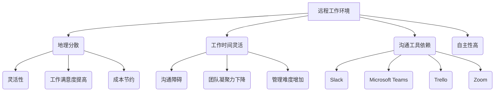

                 

# 文章标题：远程工作时代的团队管理策略

## 关键词：
远程工作、团队管理、协作工具、项目管理、领导力、文化建设

## 摘要：
随着远程工作的普及，团队管理面临着新的挑战和机遇。本文旨在探讨远程工作时代的团队管理策略，包括环境分析、管理策略、技术工具应用、沟通协作、项目管理和文化建设等方面。通过逻辑清晰、结构紧凑的分析，为远程团队管理者提供实用的指导。

## 引言与背景

### 1.1 远程工作时代的来临
远程工作并非新概念，但近年来随着互联网技术的飞速发展，特别是COVID-19疫情的推动，远程工作已成为一种常态。员工可以在全球任何地方工作，打破了传统办公室的限制。远程工作带来了灵活性、效率提升和成本节约，但也给团队管理带来了挑战。

### 1.2 远程团队管理的重要性
远程团队管理的关键在于如何保持团队的凝聚力、提高沟通效率、确保项目进度和质量。有效的管理策略能够克服远程工作中的沟通障碍、提高团队士气，实现团队目标。

### 1.3 本书的目的与结构
本书旨在为远程团队管理者提供系统性的管理策略和实践指导。结构如下：

### 第1章 引言与背景
### 第2章 远程工作环境
### 第3章 团队管理策略
### 第4章 技术工具与平台
### 第5章 人员沟通与协作
### 第6章 项目管理与进度控制
### 第7章 文化建设与团队氛围

## 远程工作环境

### 2.1 远程工作环境的特点
远程工作环境的特点包括地理位置分散、工作时间灵活、沟通工具依赖、自主性高等。这些特点为员工提供了更多的自由，但也增加了管理的复杂性。

### 2.2 远程工作的优势与挑战
远程工作的优势包括灵活性、工作满意度提高、成本节约等，但同时也带来了沟通障碍、团队凝聚力下降、管理难度增加等挑战。

### 2.3 技术工具与平台的选择
选择合适的远程工作工具和平台对于团队管理至关重要。本文将介绍常见的协作工具，如Slack、Trello、Zoom等，并分析其优缺点，帮助团队管理者做出最佳选择。

### 团队管理策略

### 3.1 远程团队管理的核心策略
远程团队管理需要制定明确的目标、设定合适的考核标准、培养良好的领导力。核心策略包括：

1. **明确的目标设定**：确保团队成员清楚了解团队目标和个人职责。
2. **灵活的考核标准**：根据远程工作的特点，设计适合的绩效考核体系。
3. **培养领导力**：领导力在远程团队管理中尤为重要，需要通过培训和实践提升领导力。

### 3.2 领导力在远程团队管理中的角色
领导力在远程团队管理中扮演着关键角色。领导力包括愿景、沟通、激励和决策能力。有效的领导能够提升团队士气、促进团队协作、确保项目成功。

### 3.3 目标设定与绩效考核
目标设定是团队管理的基础，需要明确、具体、可衡量、可实现。绩效考核应结合远程工作的特点，注重过程和结果，采用多种评估方法。

### 技术工具与平台

### 4.1 远程工作协作工具介绍
远程工作协作工具包括沟通工具、项目管理工具和协作平台。常见的沟通工具有Slack、Microsoft Teams等；项目管理工具有Trello、Jira等；协作平台有Asana、Notion等。

### 4.2 选择合适的技术工具
选择合适的技术工具需要考虑团队需求、功能、易用性、成本等因素。本文将分析不同工具的优缺点，帮助团队管理者做出最佳选择。

### 4.3 平台部署与最佳实践
平台部署需要考虑技术架构、安全性、数据备份等方面。最佳实践包括确保工具集成、优化工作流程、定期培训员工等。

### 人员沟通与协作

### 5.1 远程沟通的挑战与解决方案
远程沟通面临地理距离、时间差、沟通方式单一等挑战。解决方案包括使用多种沟通工具、建立明确的沟通规则、定期组织在线会议等。

### 5.2 避免误解与提高效率
远程工作中，避免误解和提高效率至关重要。方法包括：

1. **清晰表达**：确保沟通内容准确、简洁、有条理。
2. **及时反馈**：及时给予反馈，避免信息滞后。
3. **优化沟通方式**：根据任务和场景选择合适的沟通方式。

### 5.3 协作工具与沟通技巧
协作工具可以帮助团队更高效地完成任务，沟通技巧则能提升团队协作效果。本文将介绍常用的协作工具和沟通技巧。

### 项目管理与进度控制

### 6.1 远程项目管理的核心要素
远程项目管理的核心要素包括：

1. **项目规划**：明确项目目标、任务、时间表和资源分配。
2. **进度监控**：实时监控项目进度，及时调整计划。
3. **风险管理**：识别潜在风险，制定应对策略。

### 6.2 进度控制与风险管理
进度控制需要：

1. **制定合理的计划**：根据项目特点制定详细的时间表。
2. **实时监控进度**：使用项目管理工具监控项目进度。
3. **风险识别与应对**：定期评估项目风险，制定应对措施。

### 6.3 项目交付与质量保证
项目交付需要确保：

1. **按时交付**：确保项目按照计划按时交付。
2. **质量保证**：通过代码审查、测试等方式保证项目质量。
3. **客户满意度**：关注客户反馈，提高客户满意度。

### 文化建设与团队氛围

### 7.1 文化建设的重要性
文化建设是远程团队管理的重要组成部分，有助于提升团队凝聚力、增强员工归属感。文化建设包括价值观塑造、团队活动组织、员工关怀等方面。

### 7.2 如何建立积极向上的团队文化
建立积极向上的团队文化需要：

1. **明确价值观**：确定团队的共同价值观，形成文化共识。
2. **组织团队活动**：通过团队活动增强团队凝聚力。
3. **员工关怀**：关注员工心理健康，提供必要的支持。

### 7.3 提升团队凝聚力的策略
提升团队凝聚力需要：

1. **加强沟通**：建立有效的沟通机制，促进团队成员之间的交流。
2. **共同目标**：确保团队成员有共同的目标和愿景。
3. **认可与激励**：及时认可员工的贡献，激发工作积极性。

### 附录

### A.1 常用远程工作工具与平台列表
列出常用远程工作工具与平台，包括沟通工具、项目管理工具和协作平台。

### A.2 团队管理模板与工具
提供团队管理模板与工具，帮助团队管理者更好地进行团队管理。

### A.3 经典案例分析
分析经典远程团队管理案例，提供实际操作经验和教训。

## 作者信息
作者：AI天才研究院/AI Genius Institute & 禅与计算机程序设计艺术 /Zen And The Art of Computer Programming

## 结束语
远程工作时代为团队管理带来了新的挑战和机遇。通过本文的探讨，我们希望能为远程团队管理者提供实用的指导，帮助他们在远程工作中实现高效管理、提升团队凝聚力，最终实现团队目标。

### 远程工作环境的 Mermaid 流程图



### 核心算法原理讲解

#### 3.1 目标设定算法

```plaintext
算法描述：
1. 确定团队目标（G）
2. 分解目标为子目标（S1, S2, ..., Sn）
3. 为每个子目标设定可衡量指标（M1, M2, ..., Mn）
4. 确保所有子目标之和等于团队目标（G = S1 + S2 + ... + Sn）
5. 为每个子目标设定时间表（T1, T2, ..., Tn）
6. 监控每个子目标的进度（P1, P2, ..., Pn）

伪代码：
function setGoals(G, S, M, T, P):
    for each subGoal in S:
        set measurableMetric(M)
        set timeline(T)
        add subGoal to G
    return G

function monitorProgress(G, P):
    for each subGoal in G:
        check progress(P)
        if progress is not satisfactory:
            adjust timeline(T) or resources(R)
    return G
```

### 数学模型讲解

#### 6.1 进度控制模型

假设项目进度可以用P(t)表示，时间t的单位为天。目标是在时间T内完成项目，进度模型如下：

$$
P(t) = \frac{\int_{0}^{t} \text{实际完成工作量} \, dw}{\text{总工作量}}
$$

其中，实际完成工作量dw与总工作量之比反映了项目进度。

#### 6.2 风险管理模型

假设项目风险可以用R(t)表示，时间t的单位为天。风险管理模型如下：

$$
R(t) = \frac{\int_{0}^{t} \text{潜在风险成本} \, dc}{\text{总成本}}
$$

其中，潜在风险成本dc与总成本之比反映了项目风险程度。

### 代码解读与分析

#### 7.1 远程工作协作工具部署示例

以下是一个使用Python编写的简单脚本，用于部署Slack协作工具：

```python
import os
import subprocess

# Slack API token
slack_token = 'your_slack_api_token'

# 安装Slack SDK
subprocess.run(['pip', 'install', 'slack-sdk'])

# 导入Slack SDK
from slack_sdk import WebClient

# 初始化Slack客户端
client = WebClient(token=slack_token)

# 创建频道
response = client.chat_createChannel(name='remote-team', is_private=False)
channel_id = response['channel']['id']

# 发送消息到新创建的频道
client.chat_postMessage(channel=channel_id, text='Welcome to the remote team channel!')

print(f"Channel '{channel_id}' created and message sent.")
```

#### 7.2 实际案例分析与详细讲解剖析

假设我们有一个远程团队，需要管理一个Web开发项目。以下是项目的开发环境搭建步骤：

1. **安装Python环境**：在所有团队成员的计算机上安装Python 3.8以上版本。
2. **创建虚拟环境**：在项目的根目录下创建一个虚拟环境，使用命令 `python -m venv venv`。
3. **安装依赖库**：在虚拟环境中安装项目所需的依赖库，如Flask、SQLAlchemy等。
4. **配置数据库**：配置项目的数据库连接信息，确保所有团队成员能够访问数据库。
5. **初始化Git仓库**：在项目的根目录下初始化Git仓库，使用命令 `git init`。
6. **上传代码到远程仓库**：将项目的代码上传到GitHub或GitLab等远程仓库，便于团队成员协作。

### 项目小结

通过本示例，我们了解了如何使用Python脚本部署Slack协作工具，以及如何搭建一个Web开发项目的开发环境。在实际项目中，还需要考虑代码审查、测试、部署等环节，确保项目按时交付并满足质量要求。

### 最佳实践 tips

1. **定期组织在线会议**：确保团队成员保持沟通和协作。
2. **建立明确的任务分配**：明确每个团队成员的任务和职责。
3. **使用项目管理工具**：如Trello或Jira，帮助团队跟踪任务和项目进度。
4. **关注团队心理健康**：提供必要的心理健康支持，确保员工在工作中保持良好的状态。

### 小结

本文详细探讨了远程工作时代的团队管理策略，包括远程工作环境分析、团队管理策略、技术工具与平台选择、人员沟通与协作、项目管理和文化建设等方面。通过逻辑清晰、结构紧凑的分析，为远程团队管理者提供了实用的指导。希望本文能为远程团队管理者提供有价值的参考。

### 注意事项

1. **技术工具的选择**：根据团队需求和实际情况，选择适合的协作工具和平台。
2. **沟通策略**：确保团队成员之间有清晰、及时的沟通，避免误解和沟通障碍。
3. **文化建设**：关注团队文化建设，提升团队凝聚力和员工归属感。

### 拓展阅读

1. **《远程工作：企业管理的未来趋势》**：探讨远程工作的未来趋势及其对企业管理的影响。
2. **《敏捷项目管理：团队高效协作的方法》**：介绍敏捷项目管理方法，帮助团队更高效地完成任务。
3. **《团队领导力：激发团队潜能的技巧》**：提供团队领导力提升的技巧和方法。

## 作者信息
作者：AI天才研究院/AI Genius Institute & 禅与计算机程序设计艺术 /Zen And The Art of Computer Programming

