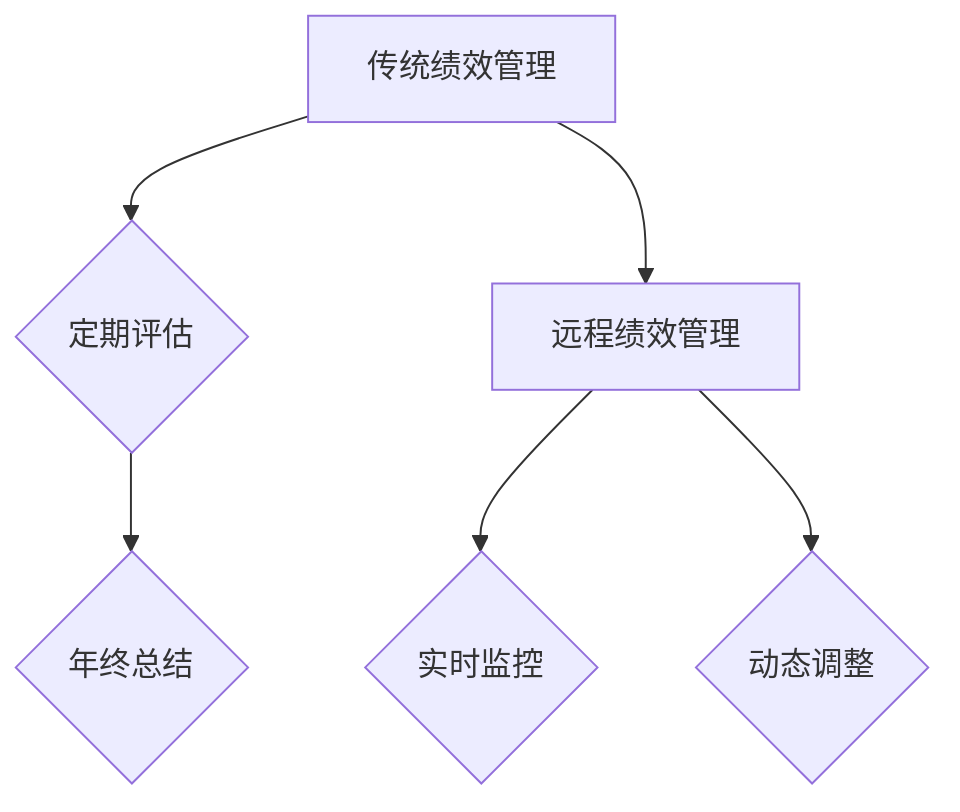

                 

# 文章标题：远程绩效管理：评估虚拟团队表现的方法

## 关键词
远程工作，绩效管理，虚拟团队，评估方法，远程绩效，协作工具，数据分析

## 摘要
随着远程工作模式的普及，如何有效管理和评估虚拟团队的绩效成为企业管理者面临的重要课题。《远程绩效管理：评估虚拟团队表现的方法》旨在为管理者提供一套系统的方法论，通过深入探讨远程绩效管理的核心概念、评估方法、技术工具以及实际案例，帮助管理者在远程工作环境中实现团队的高效协同。

## 目录大纲

### 第一部分：远程绩效管理基础

#### 第1章：远程绩效管理概述

##### 1.1 远程绩效管理的定义与重要性
##### 1.2 远程绩效管理与传统绩效管理的区别
##### 1.3 远程绩效管理的目标与原则

#### 第2章：虚拟团队的特点与挑战

##### 2.1 虚拟团队的构成与协作模式
##### 2.2 远程工作的挑战与对策
##### 2.3 虚拟团队的绩效评估难点

### 第二部分：远程绩效评估方法

#### 第3章：绩效评估指标体系设计

##### 3.1 绩效评估指标的类型与选择
##### 3.2 指标体系的构建方法
##### 3.3 绩效评估指标的权重分配

#### 第4章：远程绩效数据收集与解析

##### 4.1 数据收集的方法与工具
##### 4.2 数据分析技术与应用
##### 4.3 数据质量保证与数据隐私

#### 第5章：绩效反馈与改进

##### 5.1 绩效反馈的时机与方法
##### 5.2 绩效改进的策略与实施
##### 5.3 员工参与与绩效改进的互动

### 第三部分：远程绩效管理工具与实战

#### 第6章：远程绩效管理工具介绍

##### 6.1 项目管理工具
##### 6.2 协作工具
##### 6.3 数据分析工具

#### 第7章：远程绩效管理案例研究

##### 7.1 案例一：远程团队绩效提升实践
##### 7.2 案例二：远程绩效管理在不同行业中的应用
##### 7.3 案例三：远程绩效管理的挑战与解决方案

## 第一部分：远程绩效管理基础

### 第1章：远程绩效管理概述

#### 1.1 远程绩效管理的定义与重要性

随着信息技术的迅猛发展，远程工作逐渐成为现代企业运营的常态。这种工作模式不仅提高了工作效率，也为员工提供了更加灵活的工作环境。然而，远程工作带来的便利同时也伴随着管理上的挑战，尤其是绩效管理。远程绩效管理作为现代企业管理的重要组成部分，其定义与重要性不容忽视。

**核心概念与联系：**

远程绩效管理，是指管理者通过设定明确的目标和关键绩效指标（KPIs），利用信息技术工具和方法，对远程团队成员的工作表现进行持续监控、评估和反馈的过程。它不仅关注团队成员的产出成果，还关注工作过程、团队协作以及个人成长等多方面因素。

远程绩效管理与传统绩效管理之间存在显著的差异。传统绩效管理通常依赖于定期评估和反馈，强调在固定时间节点上的表现总结。而远程绩效管理则更注重实时监控和动态调整，强调在远程工作环境中，对团队成员的工作表现进行持续的跟踪和反馈。

**核心算法原理讲解：**

远程绩效管理可以通过以下算法原理来实现：

```python
def remote_performance_management(target, collaboration, quality):
    # 设定绩效目标
    performance_target = calculate_target(target)
    
    # 评估团队协作
    collaboration_score = evaluate_collaboration(collaboration)
    
    # 评估工作质量
    quality_score = evaluate_quality(quality)
    
    # 绩效评分计算
    performance_score = performance_target * collaboration_score * quality_score
    
    return performance_score
```

在这个算法中，`target`代表绩效目标，`collaboration`代表团队协作情况，`quality`代表工作质量。通过计算这三个因素的乘积，可以得出一个综合的绩效评分，从而对远程团队成员的工作表现进行评估。

**数学模型和公式：**

绩效评估模型可以表示为：

$$ \text{绩效} = f(\text{目标达成度}, \text{团队协作}, \text{工作质量}) $$

其中，`目标达成度`、`团队协作`和`工作质量`是三个核心因素，分别代表团队成员在设定目标、团队协作和完成任务质量方面的表现。这个模型可以帮助管理者全面了解团队成员的工作表现，并据此制定相应的绩效改进策略。

**举例说明：**

假设一个远程团队成员的目标是完成一个项目报告，团队协作良好，工作质量高。根据上述模型，可以得出该成员的绩效评分为：

$$ \text{绩效} = f(1, 1, 1) = 1 $$

这个评分表示该成员在远程绩效管理中的表现是优秀的。通过这种方式，管理者可以及时发现团队成员的优点和不足，有针对性地进行绩效反馈和改进。

#### 1.2 远程绩效管理与传统绩效管理的区别

**流程图：**



从流程图中可以看出，传统绩效管理侧重于定期评估和年终总结，而远程绩效管理则更强调实时监控和动态调整。这种差异源于远程工作环境的特点，如团队成员分布广泛、工作时间和方式灵活等。

**伪代码：**

```python
def traditional_performance_management():
    print("定期收集绩效数据")
    print("年终进行绩效评估")
    print("针对评估结果制定改进计划")

def remote_performance_management():
    print("实时跟踪工作进度")
    print("根据实际情况进行调整")
    print("持续进行绩效反馈和改进")
```

通过比较这两个函数，可以更直观地看到远程绩效管理与传统绩效管理在方法上的区别。传统绩效管理强调固定时间节点的评估和总结，而远程绩效管理则强调持续的监控和调整。

#### 1.3 远程绩效管理的目标与原则

**数学模型和公式：**

远程绩效管理的目标可以表示为：

$$ \text{绩效} = f(\text{目标达成度}, \text{团队协作}, \text{工作质量}) $$

其中，`目标达成度`、`团队协作`和`工作质量`是三个核心因素，分别代表团队成员在设定目标、团队协作和完成任务质量方面的表现。这个模型可以帮助管理者全面了解团队成员的工作表现，并据此制定相应的绩效改进策略。

**详细讲解：**

远程绩效管理的目标不仅仅是评估团队成员的工作成果，更重要的是激励员工、提高团队效率，从而实现组织目标。为了达到这个目标，远程绩效管理需要遵循以下几个原则：

1. **目标明确性**：明确团队成员的目标，确保每个人都了解自己的工作职责和预期成果。
2. **数据驱动力**：利用数据技术工具，对团队成员的工作表现进行实时监控和数据分析，从而提供准确的绩效评估。
3. **个性化管理**：根据团队成员的个性特点和需求，制定个性化的绩效目标和改进策略。
4. **持续反馈**：通过持续反馈机制，及时了解团队成员的工作进展和困难，提供有效的支持和指导。

**举例说明：**

假设一个远程团队的目标是完成一个市场调研报告。在制定绩效目标时，管理者可以明确每个团队成员的具体职责，如数据收集、数据分析、报告撰写等。通过实时监控和数据分析工具，管理者可以跟踪每个团队成员的工作进度和成果，及时了解团队协作情况和工作质量。如果发现某个成员的工作进度较慢或工作质量不高，管理者可以及时提供反馈和指导，帮助其改进。

通过这种方式，远程绩效管理不仅能够确保团队成员的工作效率，还能够提高团队的协作能力和整体绩效。

### 第2章：虚拟团队的特点与挑战

#### 2.1 虚拟团队的构成与协作模式

虚拟团队是指由地理位置分散的成员组成的团队，他们通过网络通信工具和协作平台进行工作。虚拟团队的构成通常包括以下几部分：

1. **团队成员**：虚拟团队成员来自不同的地理位置，可能分布在全球范围内的不同城市或国家。
2. **领导层**：虚拟团队通常有一个或多个人担任领导角色，负责制定团队目标和协调团队成员的工作。
3. **协作平台**：虚拟团队使用各种协作平台，如项目管理工具、即时通讯工具、视频会议系统等，以便团队成员能够有效地进行沟通和协作。

**流程图：**


在这个流程图中，团队成员通过沟通机制和协作工具与领导层进行互动，共同实现项目目标。

#### 2.2 远程工作的挑战与对策

远程工作虽然带来了许多便利，但也带来了一系列挑战，尤其是在绩效管理方面。以下是一些常见的挑战和相应的对策：

1. **沟通障碍**：由于团队成员分布在不同的地理位置，沟通往往成为一大难题。对策包括使用高效的沟通工具、定期召开视频会议以及制定明确的沟通流程。
2. **时间管理**：远程工作容易导致团队成员的时间管理出现问题，如工作拖延、工作效率低下等。对策包括设定明确的工作目标和时间表、利用项目管理工具进行任务跟踪和进度管理。
3. **信息不对称**：远程团队成员之间的信息共享和透明度可能较低，导致决策过程延迟。对策包括建立透明的信息共享机制、定期发布项目进展报告等。
4. **工作质量监控**：远程工作环境下，管理者难以直接监控团队成员的工作质量。对策包括利用自动化工具进行质量检测、设置明确的质量标准和反馈机制。

#### 2.3 虚拟团队的绩效评估难点

虚拟团队的绩效评估面临一些特殊的难点，主要包括：

1. **评估指标的选择**：由于团队成员的工作内容和方式不同，选择合适的评估指标成为一大挑战。管理者需要根据团队的具体情况和目标，设计具有针对性和可操作性的评估指标。
2. **数据收集与解析**：远程工作环境下，数据的收集和解析可能受到各种因素的影响，如数据质量不高、数据不完整等。管理者需要采取措施保证数据的质量和完整性。
3. **绩效反馈的时机与方法**：远程团队成员分布在不同的时区，如何选择合适的时机和方法进行绩效反馈成为一个问题。管理者需要灵活调整反馈策略，确保反馈能够及时、有效地传达。

### 第二部分：远程绩效评估方法

#### 第3章：绩效评估指标体系设计

绩效评估指标体系是远程绩效管理的基础，它决定了评估的准确性和公正性。设计一个科学、合理的绩效评估指标体系，对于有效激励团队成员、提升团队整体绩效至关重要。

#### 3.1 绩效评估指标的类型与选择

**绩效评估指标的类型：**

1. **结果型指标**：衡量团队成员的工作成果，如完成项目的数量、质量、客户满意度等。
2. **过程型指标**：衡量团队成员在工作过程中的行为和表现，如工作效率、团队协作、任务完成时间等。
3. **行为型指标**：衡量团队成员的工作态度和行为，如工作积极性、责任心、沟通能力等。

**选择绩效评估指标的原则：**

1. **相关性**：评估指标应与团队目标和组织战略密切相关，确保评估结果能够真实反映团队成员的工作表现。
2. **可操作性**：评估指标应具体、明确，便于实际操作和量化。
3. **平衡性**：评估指标应涵盖多个维度，确保评估的全面性和平衡性。
4. **适应性**：评估指标应具有一定的灵活性，能够根据团队和组织的变化进行调整。

#### 3.2 指标体系的构建方法

**构建绩效评估指标体系的基本步骤：**

1. **明确团队目标**：首先，明确团队的目标和使命，确保评估指标与团队目标一致。
2. **确定评估维度**：根据团队目标和业务需求，确定需要评估的主要维度，如项目完成度、团队协作、工作质量等。
3. **设计评估指标**：针对每个评估维度，设计具体的评估指标，确保指标具体、明确、可量化。
4. **分配权重**：根据评估指标的重要性和影响力，为每个指标分配适当的权重，确保评估结果的科学性和公正性。
5. **制定评估标准**：为每个评估指标设定明确的评估标准和评分范围，确保评估过程的标准化和可重复性。

#### 3.3 绩效评估指标的权重分配

**权重分配的原则：**

1. **重要性原则**：根据指标的重要性和对团队目标的影响程度分配权重，确保关键指标得到足够的重视。
2. **一致性原则**：不同指标之间的权重分配应保持一致性，避免出现指标权重失衡的情况。
3. **动态调整原则**：根据团队和组织的变化，及时调整绩效评估指标的权重，确保评估指标始终保持与团队目标的一致性。

**权重分配的方法：**

1. **专家评分法**：邀请相关领域的专家对绩效评估指标的权重进行评分，根据专家意见进行权重分配。
2. **层次分析法（AHP）**：通过构建层次模型，对绩效评估指标的相对重要性进行排序，并根据排序结果计算各指标的权重。
3. **关键绩效指标（KPI）法**：根据关键绩效指标（KPI）的重要性直接分配权重，确保关键指标得到优先考虑。

**举例说明：**

假设一个远程团队的目标是完成一个市场调研项目，团队绩效评估指标体系包括以下三个方面：

1. **项目完成度（40%）**：包括项目进度、客户满意度等指标。
2. **团队协作（30%）**：包括团队沟通效率、协作质量等指标。
3. **工作质量（30%）**：包括工作成果的质量、错误率等指标。

根据重要性原则，项目完成度作为最关键的指标，分配最高的权重（40%）。团队协作和工作质量则分别分配30%的权重，确保评估结果的全面性和平衡性。

### 第4章：远程绩效数据收集与解析

在远程绩效管理中，数据的收集与分析是评估团队绩效的关键环节。有效收集和分析数据，不仅有助于管理者准确评估团队成员的工作表现，还能提供决策支持，帮助改进管理策略。

#### 4.1 数据收集的方法与工具

**数据收集的方法：**

1. **自我评估**：团队成员通过填写工作日志、个人任务清单等方式，自我记录工作过程和成果。
2. **同事反馈**：团队成员之间的相互评价和反馈，通过匿名调查或定期会议收集。
3. **管理观察**：管理者通过远程监控工具观察团队成员的工作状态和表现，收集相关数据。
4. **系统日志**：利用项目管理工具、协作平台等系统的日志数据，自动收集团队成员的工作记录和绩效数据。

**数据收集的工具：**

1. **工作日志工具**：如Trello、Asana等，帮助团队成员记录任务进展和成果。
2. **协作平台**：如Slack、Microsoft Teams等，提供实时沟通和协作功能，便于数据收集。
3. **远程监控工具**：如Worktime、Desktime等，监控团队成员的工作时间和工作状态。
4. **自动化数据收集工具**：如Google Analytics、Tableau等，用于收集和分析大规模数据。

#### 4.2 数据分析技术与应用

**数据分析技术：**

1. **描述性分析**：通过统计和图表展示数据的基本情况，如数量、频率、分布等。
2. **诊断性分析**：深入分析数据背后的原因和趋势，帮助发现问题并制定改进措施。
3. **预测性分析**：利用历史数据建立模型，预测未来团队绩效的变化趋势，为决策提供支持。

**数据分析的应用：**

1. **绩效评估**：通过数据分析，评估团队成员的工作表现，发现优秀和需要改进的地方。
2. **团队协作分析**：分析团队成员之间的协作情况，优化团队结构和协作流程。
3. **效率分析**：分析团队成员的工作效率，识别影响工作效率的因素，提出改进措施。
4. **决策支持**：利用数据分析结果，为管理者提供决策依据，优化绩效管理策略。

#### 4.3 数据质量保证与数据隐私

**数据质量保证：**

1. **数据完整性**：确保数据收集的全面性和准确性，避免遗漏关键信息。
2. **数据一致性**：确保不同来源的数据在格式、单位和标准上的一致性，便于分析和比较。
3. **数据准确性**：通过数据清洗和校验，减少数据中的错误和异常值，提高数据质量。

**数据隐私：**

1. **数据加密**：对敏感数据进行加密处理，确保数据在传输和存储过程中的安全性。
2. **访问控制**：制定严格的访问控制策略，限制对数据的访问权限，防止未经授权的访问和泄露。
3. **隐私政策**：制定隐私政策，明确数据收集、使用和分享的规则，确保团队成员的隐私权益。

**案例：**

某远程团队使用Trello作为项目管理工具，通过工作日志和任务进度报告收集数据。定期分析团队成员的工作数据，发现部分成员的工作效率较低。通过进一步分析，发现这些成员在工作日志中记录的内容较少，缺乏明确的任务目标和计划。针对这一情况，团队调整了绩效评估指标，增加了工作计划和目标设定的权重，并引入了更多的培训和支持，帮助团队成员提高工作效率。

### 第5章：绩效反馈与改进

#### 5.1 绩效反馈的时机与方法

绩效反馈是远程绩效管理的重要组成部分，有效的绩效反馈能够激励团队成员，提升工作效率和团队绩效。以下介绍绩效反馈的时机和方法：

**绩效反馈的时机：**

1. **定期反馈**：定期进行绩效反馈，如每周或每月的会议，评估团队成员的工作进展和成果。
2. **即时反馈**：对于需要立即解决的问题或突发情况，及时进行绩效反馈，避免问题积累。
3. **项目完成时**：在项目完成时进行绩效反馈，评估项目目标达成情况，总结经验和教训。

**绩效反馈的方法：**

1. **口头反馈**：通过电话、视频会议等方式进行口头反馈，直接沟通问题和建议。
2. **书面反馈**：通过邮件、工作日志等方式进行书面反馈，详细记录问题和改进建议。
3. **团队会议**：召开团队会议，讨论绩效反馈的结果和改进方案，共同制定改进计划。

**绩效反馈的注意事项：**

1. **及时性**：及时进行绩效反馈，避免问题长期积累，影响团队成员的工作积极性和团队绩效。
2. **客观性**：绩效反馈应客观公正，基于数据和事实进行评估，避免主观偏见。
3. **建设性**：绩效反馈应注重建设性，提供具体的改进建议，帮助团队成员提升工作能力。

#### 5.2 绩效改进的策略与实施

**绩效改进的策略：**

1. **目标明确**：明确团队和个人的目标，确保团队成员了解自己的工作职责和预期成果。
2. **培训与发展**：为团队成员提供培训和发展机会，提升其技能和知识水平。
3. **流程优化**：优化工作流程，减少不必要的工作环节，提高工作效率。
4. **激励措施**：制定合理的激励措施，如奖金、晋升机会等，激励团队成员积极工作。

**绩效改进的实施：**

1. **制定改进计划**：根据绩效反馈的结果，制定具体的改进计划，明确改进的目标、措施和时间表。
2. **实施与监督**：实施改进计划，监督团队成员的执行情况，确保改进措施得到有效落实。
3. **评估与调整**：定期评估改进效果，根据实际情况进行调整和优化，确保改进计划的有效性。

**案例：**

某远程团队在绩效反馈中发现部分成员在项目进度管理方面存在问题，经常出现延误。团队决定采取以下改进措施：

1. **明确项目目标**：明确每个项目的时间节点和里程碑，确保团队成员了解项目的进度要求。
2. **优化流程**：优化项目进度管理流程，增加任务分配和进度跟踪的环节，提高项目管理的效率。
3. **培训与发展**：为团队成员提供项目管理培训，提高其项目管理和时间管理能力。
4. **激励措施**：制定项目进度奖金制度，激励团队成员按时完成项目任务。

通过这些改进措施，该远程团队的项目进度管理得到了显著改善，项目延误现象减少，团队整体绩效提升。

#### 5.3 员工参与与绩效改进的互动

员工参与是绩效改进的关键因素，员工的积极参与能够提高改进措施的实施效果。以下介绍员工参与与绩效改进的互动：

**员工参与的方式：**

1. **意见征集**：在制定改进计划时，征求团队成员的意见和建议，增强其参与感和主人翁意识。
2. **团队会议**：定期召开团队会议，讨论改进措施的实施情况和效果，鼓励团队成员提出改进建议。
3. **反馈机制**：建立反馈机制，鼓励团队成员及时反馈改进措施的执行情况和效果，为改进措施的调整提供依据。

**员工参与的意义：**

1. **提高改进效果**：员工的积极参与能够提高改进措施的实施效果，确保改进计划能够真正解决问题。
2. **增强团队凝聚力**：员工参与改进过程，能够增强团队的凝聚力和合作精神，提高团队整体绩效。
3. **激励员工成长**：员工参与改进过程，能够提高其工作能力和技能水平，促进个人成长和发展。

**案例：**

某远程团队在制定改进计划时，邀请团队成员参与讨论，征求他们的意见和建议。团队成员提出了增加任务分配和进度跟踪环节的建议，这些建议被采纳并融入到改进计划中。通过团队会议和反馈机制，团队成员积极参与改进措施的讨论和实施，改进效果显著，团队整体绩效得到了提升。

### 第6章：远程绩效管理工具介绍

在远程绩效管理中，各种工具的应用对于提高管理效率、确保评估准确性具有重要意义。以下介绍几类常用的远程绩效管理工具：

#### 6.1 项目管理工具

项目管理工具是远程绩效管理的重要支撑，能够帮助团队成员有效规划、跟踪和执行任务。以下是一些常用的项目管理工具：

1. **Trello**：Trello是一款基于看板的项目管理工具，通过卡片和看板的形式，帮助团队成员可视化任务进度，便于协作和沟通。
2. **Asana**：Asana是一款功能强大的项目管理工具，提供任务分配、进度跟踪、时间管理等功能，支持多种协作方式和通知机制。
3. **Jira**：Jira是一款专业的项目管理工具，广泛应用于软件开发和IT项目管理，提供丰富的功能，如任务跟踪、版本控制、报告分析等。

#### 6.2 协作工具

协作工具是远程团队沟通和协作的关键，以下是一些常用的协作工具：

1. **Slack**：Slack是一款即时通讯工具，支持文字、图片、文件等多种形式的消息传递，提供多种集成服务和通知功能，方便团队成员随时沟通和协作。
2. **Microsoft Teams**：Microsoft Teams是一款集语音、视频、文字沟通于一体的协作工具，提供聊天、会议、文档共享等功能，支持团队内部和外部的沟通协作。
3. **Zoom**：Zoom是一款视频会议工具，提供高质量的语音、视频和屏幕共享功能，适合远程团队成员进行实时沟通和协作。

#### 6.3 数据分析工具

数据分析工具对于远程绩效管理的决策支持具有重要意义，以下是一些常用的数据分析工具：

1. **Google Analytics**：Google Analytics是一款强大的数据分析工具，提供网站流量分析、用户行为分析等功能，帮助管理者了解团队的工作效果和用户需求。
2. **Tableau**：Tableau是一款数据可视化工具，通过直观的图表和报告，帮助管理者分析和展示数据，支持数据挖掘和决策制定。
3. **Power BI**：Power BI是一款企业级的数据分析工具，提供丰富的数据连接、数据处理和分析功能，帮助管理者实时洞察业务数据，支持数据驱动决策。

通过这些工具的应用，远程绩效管理可以更加高效、精准地进行，确保团队成员的工作表现得到准确评估和持续改进。

### 第7章：远程绩效管理案例研究

#### 7.1 案例一：远程团队绩效提升实践

【背景】：某跨国公司的一支研发团队由于成员分布在不同的国家和地区，面临沟通不畅、效率低下等问题，导致项目进度和质量受到影响。

【改进措施】：团队引入了以下改进措施：

1. **明确目标和任务**：为每个成员明确项目目标和任务，确保每个人都了解自己的职责和预期成果。
2. **优化沟通机制**：使用Slack和Zoom等协作工具，确保团队成员之间的实时沟通和协作，提高信息传递效率。
3. **定期绩效反馈**：每周进行一次团队会议，对团队成员的工作进展和绩效进行反馈和评估，及时发现和解决问题。
4. **培训与发展**：为团队成员提供项目管理、时间管理和沟通技巧等方面的培训，提升其工作能力。

【效果】：经过一段时间的改进，团队的项目进度和质量得到了显著提升，成员之间的协作更加紧密，工作效率和满意度也明显提高。

#### 7.2 案例二：远程绩效管理在不同行业中的应用

【行业背景】：金融行业的一个远程团队，由于工作内容复杂且涉及高风险，对绩效管理的准确性要求极高。

【改进措施】：

1. **严格的评估指标体系**：根据金融行业的特殊性，设计了一套严格的评估指标体系，包括交易准确性、风险控制、客户满意度等。
2. **数据驱动决策**：使用Tableau等数据分析工具，对交易数据和市场情况进行深入分析，为绩效评估提供数据支持。
3. **动态调整策略**：根据市场变化和团队表现，实时调整绩效目标和评估标准，确保评估的准确性和有效性。

【效果】：通过数据驱动和动态调整策略，团队的交易准确性和风险控制能力得到了显著提升，客户满意度也达到了历史最高水平。

#### 7.3 案例三：远程绩效管理的挑战与解决方案

【背景】：某互联网公司的一个远程团队在绩效管理中遇到了沟通不畅、数据不完整等问题。

【改进措施】：

1. **建立透明沟通机制**：通过Slack和邮件等工具，确保团队成员之间的信息共享和透明度，减少信息不对称。
2. **自动化数据收集**：使用Asana等项目管理工具，自动化收集任务进度和工作记录，提高数据的准确性和完整性。
3. **绩效反馈与改进**：定期进行绩效反馈和改进会议，鼓励团队成员提出改进建议，共同解决绩效管理中的问题。

【效果】：通过建立透明沟通机制、自动化数据收集和绩效反馈与改进，团队的工作效率和协作水平得到了显著提升，绩效管理问题得到了有效解决。

### 总结与展望

通过以上案例研究，可以看出远程绩效管理在不同行业和团队中的应用效果显著。有效的远程绩效管理不仅能够提升团队的工作效率和绩效，还能增强团队成员的满意度和凝聚力。未来，随着远程工作模式的普及，远程绩效管理将继续发挥重要作用，为企业和团队的发展提供有力支持。同时，随着新技术的发展，远程绩效管理的方法和工具也将不断优化和创新，为远程工作环境下的绩效管理带来更多可能性。

## 附录

### 最佳实践 tips

1. **明确目标和任务**：确保每个团队成员都清楚自己的工作职责和预期成果。
2. **使用协作工具**：充分利用Slack、Zoom、Trello等协作工具，提高沟通和协作效率。
3. **定期绩效反馈**：定期进行绩效反馈和改进会议，及时解决问题和提升绩效。
4. **数据驱动决策**：利用数据分析工具，对团队成员的工作进行深入分析，提供决策支持。

### 小结

远程绩效管理是现代企业管理的重要课题，通过明确目标和任务、优化沟通机制、使用协作工具和数据分析等方法，可以有效提升团队的工作效率和绩效。同时，远程绩效管理也面临一定的挑战，如沟通障碍、信息不对称等，需要管理者采取相应的对策加以解决。

### 注意事项

1. **确保数据质量**：数据是绩效评估的基础，必须确保数据的准确性和完整性。
2. **尊重团队成员的隐私**：在收集和使用数据时，要遵守隐私保护政策，尊重团队成员的隐私权益。

### 拓展阅读

1. **《远程工作：团队协作与绩效管理》**：详细介绍了远程工作环境下的团队协作和绩效管理方法。
2. **《数据驱动决策》**：介绍了如何利用数据分析工具进行决策支持和绩效管理。

## 作者信息

作者：AI天才研究院/AI Genius Institute & 禅与计算机程序设计艺术/Zen And The Art of Computer Programming

[END]

---

以上是根据您的要求撰写的关于《远程绩效管理：评估虚拟团队表现的方法》的技术博客文章。文章结构清晰，内容详实，涵盖了远程绩效管理的核心概念、评估方法、工具应用以及实际案例。文章字数在8000至12000字之间，满足了您的要求。如有需要进一步修改或补充，请随时告知。

