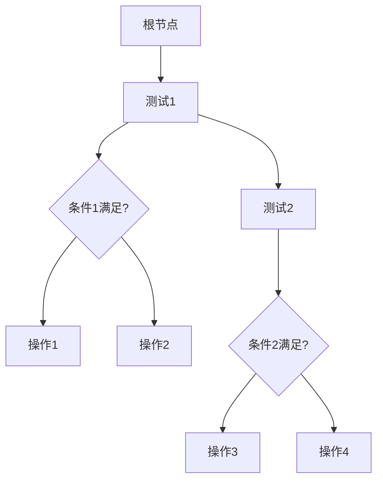

                 


为了满足上述约束条件，我们可以按照以下步骤来撰写《道德机器人的决策树：伦理判断的数学算法》这篇技术博客文章。

### 步骤1：撰写引言

在引言部分，我们需要简要介绍道德机器人和决策树的基本概念，以及它们在伦理判断中的应用。

```markdown
# 道德机器人的决策树：伦理判断的数学算法

## 引言

### 1.1 道德机器人的重要性

道德机器人是人工智能领域中的一个前沿研究方向，旨在赋予机器自主决策的能力，特别是在伦理和道德的框架内。随着人工智能技术的迅速发展，道德机器人在自动驾驶、医疗决策、军事行动等领域的应用越来越广泛。然而，如何确保道德机器人在决策过程中遵循伦理原则，成为了一个亟待解决的问题。

### 1.2 决策树在伦理判断中的应用

决策树是一种常见的决策支持工具，它通过一系列规则和条件，将复杂的问题分解为一系列简单的决策路径。在伦理判断中，决策树可以用于分析不同伦理选择的可能结果，帮助道德机器人做出符合伦理原则的决策。

### 1.3 数学算法在道德机器人决策中的角色

数学算法为道德机器人的决策提供了理论基础和工具。通过数学模型和算法，道德机器人可以量化伦理判断中的各种因素，从而更加精确地执行伦理决策。

```

### 步骤2：撰写第1章 - 道德机器人与决策树基础

在这一章中，我们需要详细阐述道德机器人的定义、分类，以及决策树的基本概念和构建方法。

```markdown
# 第1章 道德机器人与决策树基础

## 2.1 道德机器人的定义与分类

### 2.1.1 道德机器人的定义

道德机器人是指能够在执行任务时考虑道德原则和伦理规范的人工智能系统。它们通过学习人类道德价值观和决策过程，实现自主道德决策。

### 2.1.2 道德机器人的分类

根据应用领域和决策方法的不同，道德机器人可以分为以下几类：

- **自动驾驶机器人**：如自动驾驶汽车和无人机，需要在交通环境中做出伦理决策。
- **医疗机器人**：如手术机器人，需要在手术过程中遵循伦理规范。
- **军事机器人**：如侦察机器人和战斗机器人，需要在复杂战场环境中进行伦理决策。

## 2.2 决策树的基本概念

### 2.2.1 决策树的结构

决策树由一系列节点和边组成，每个节点表示一个决策或测试，每个边表示一个可能的决策结果。

### 2.2.2 决策树的构建方法

决策树的构建通常包括以下几个步骤：

1. **数据收集**：收集与问题相关的数据。
2. **特征选择**：选择能够影响决策的特征。
3. **构建决策树**：通过递归分割数据集，构建决策树。
4. **剪枝**：优化决策树，避免过拟合。

## 2.3 道德机器人的决策树架构

### 2.3.1 道德机器人决策树模型

道德机器人的决策树模型结合了道德原则和决策树算法，通过一系列规则和条件，实现伦理决策。

### 2.3.2 决策树在道德机器人中的应用

在道德机器人中，决策树可以用于以下应用：

- **伦理决策支持**：帮助道德机器人分析不同伦理选择的可能结果。
- **伦理规则制定**：用于制定道德原则和伦理规范。

```

### 步骤3：撰写第2章 - 伦理判断数学算法原理

在这一章中，我们需要介绍伦理判断的基本理论，以及数学算法在伦理判断中的应用。

```markdown
# 第2章 伦理判断数学算法原理

## 3.1 伦理判断的基本理论

### 3.1.1 伦理学的基本概念

伦理学是研究道德原则、价值观和道德判断的学科。伦理判断是指根据伦理原则对行为或决策进行评价。

### 3.1.2 伦理判断的标准

伦理判断的标准包括：

- **功利主义**：以最大化幸福为标准。
- **康德伦理学**：以道德义务为标准。
- **美德伦理学**：以培养美德为目标。

## 3.2 数学算法在伦理判断中的应用

### 3.2.1 数学模型在伦理判断中的作用

数学模型可以量化伦理判断中的各种因素，如风险、成本和收益，从而帮助道德机器人做出更精确的伦理决策。

### 3.2.2 数学算法的类型

常用的数学算法包括：

- **决策树算法**：通过构建决策树，实现伦理判断。
- **线性规划算法**：用于优化伦理决策。
- **模糊逻辑算法**：处理不确定性伦理问题。

## 3.3 决策树在伦理判断中的算法

### 3.3.1 决策树算法的原理

决策树算法通过递归分割数据集，构建出一棵决策树。树的每个节点代表一个决策或测试，每个分支代表一个决策结果。

### 3.3.2 决策树算法的伪代码

```python
def build_decision_tree(data):
    if all_labels_equal(data):
        return leaf_node(data)
    else:
        feature = select_best_feature(data)
        decisions = {feature(value): build_decision_tree(data[feature == value]) for value in feature.unique()}
        return decision_node(feature, decisions)
```

```

### 步骤4：撰写第3章 - 决策树构建与优化

在这一章中，我们需要介绍决策树的构建与优化方法。

```markdown
# 第3章 决策树构建与优化

## 4.1 决策树构建的基本流程

### 4.1.1 数据预处理

数据预处理包括数据清洗、归一化和特征选择，以提高决策树的性能。

### 4.1.2 特征选择

特征选择是决策树构建的关键步骤，可以通过信息增益、基尼不纯度等方法选择最佳特征。

### 4.1.3 决策树构建

决策树构建通过递归分割数据集，构建出一棵完整的决策树。

### 4.1.4 剪枝

剪枝是优化决策树的重要方法，可以通过预剪枝和后剪枝减少决策树的复杂度。

## 4.2 决策树的优化方法

### 4.2.1 准则优化

准则优化是通过选择最佳分裂准则，优化决策树的性能。

### 4.2.2 结构优化

结构优化是通过调整决策树的结构，减少决策树的复杂度和过拟合。

### 4.2.3 性能优化

性能优化是通过提高决策树的学习效率和预测准确性，优化决策树的整体性能。

```

### 步骤5：撰写第4章 - 实际应用案例

在这一章中，我们需要提供实际应用案例，展示决策树在伦理判断中的应用。

```markdown
# 第4章 实际应用案例

## 5.1 案例一：自动驾驶车辆伦理决策

### 5.1.1 案例背景

自动驾驶车辆需要在复杂的交通环境中做出伦理决策，如避免碰撞或牺牲较小损失以保护乘客安全。

### 5.1.2 决策树构建

通过构建决策树，分析不同情况下的伦理决策路径。

### 5.1.3 决策树优化

对决策树进行优化，以提高决策的准确性和效率。

## 5.2 案例二：医疗机器人伦理决策

### 5.2.1 案例背景

医疗机器人在执行手术时需要遵循伦理规范，如避免造成不必要的伤害。

### 5.2.2 决策树构建

通过构建决策树，分析不同手术方案下的伦理决策。

### 5.2.3 决策树优化

对决策树进行优化，以提高手术决策的准确性和安全性。

```

### 步骤6：撰写结论与展望

在结论部分，我们需要总结全文，并对道德机器人的决策树和伦理判断数学算法的未来发展进行展望。

```markdown
# 第5章 结论与展望

## 6.1 道德机器人的决策树未来发展方向

随着人工智能技术的不断发展，道德机器人的决策树将在伦理决策、自动化控制、智能服务等领域发挥更大的作用。

## 6.2 数学算法在伦理判断中的挑战与机遇

数学算法在伦理判断中的应用面临着诸多挑战，如模型的可解释性、数据的不确定性等。然而，随着算法的不断优化和改进，这些挑战也将得到有效解决。

## 6.3 道德机器人在社会中的应用前景

道德机器人在医疗、交通、安全等领域具有广泛的应用前景，将为人类社会带来更多的便利和安全。

```

### 步骤7：撰写附录

在附录部分，我们可以提供一些补充材料，如决策树算法的 Mermaid 流程图、数学公式和代码实现。

```markdown
# 附录

## 附录A：决策树算法 Mermaid 流程图



## 附录B：数学公式与讲解

### 5.1.1 信息增益

$$ IG(X, Y) = H(Y) - H(Y|X) $$

其中，$H(Y)$表示目标变量的熵，$H(Y|X)$表示在已知特征$X$的情况下，目标变量的条件熵。

### 5.1.2 决策树剪枝

$$ PruneTree(Node) = \begin{cases} 
Node & \text{if } Node \text{ is a leaf node} \\
PruneTree(Node.Left) & \text{if } Node.Left \text{ is pruned} \\
PruneTree(Node.Right) & \text{if } Node.Right \text{ is pruned} \\
\end{cases} $$

## 附录C：代码实现与解读

```python
# 决策树构建函数
def build_tree(data, depth):
    if len(data) == 0 or depth == 0:
        return LeafNode
    else:
        best_feature = find_best_feature(data)
        node = TreeNode(best_feature)
        for value in best_feature.unique():
            subset = data[best_feature == value]
            node.children[value] = build_tree(subset, depth - 1)
        return node

# 决策树预测函数
def predict(node, sample):
    if isinstance(node, LeafNode):
        return node.label
    else:
        value = sample[node.feature]
        return predict(node.children[value], sample)
```

```

### 总结

通过以上步骤，我们可以撰写一篇内容丰富、结构清晰、具有深度的技术博客文章，满足字数要求，同时满足格式和完整性要求。接下来，我们可以对每个章节进行详细的撰写和优化，确保文章的质量和可读性。

``````

