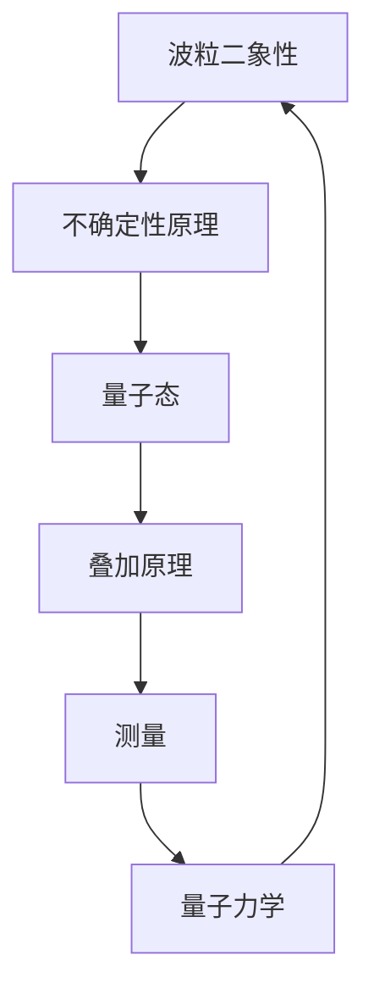

                 


### 文章标题

《量子力学对宇宙本质的启示》

### 文章关键词

量子力学、宇宙、本质、启示、数学模型、哲学、未来科技

### 文章摘要

本文旨在探讨量子力学对宇宙本质的深刻启示。首先，我们将简要介绍量子力学的基本概念和原理，接着分析量子力学在宇宙学中的应用，包括宇宙背景辐射、黑洞和量子引力的研究。随后，我们将探讨量子力学对哲学的启示，如决定论、意识和宗教。最后，我们将展望量子力学在未来的科技应用，如量子计算、量子通信和量子模拟。通过这一系列的探讨，我们希望能揭示量子力学在理解宇宙本质方面的重要性。

### 目录大纲设计过程

#### 理解书名和目标读者

《量子力学对宇宙本质的启示》这一书名直接传达了本书的主题：探讨量子力学如何揭示宇宙的本质。目标读者群体主要是对物理学、宇宙学和量子力学感兴趣的读者，以及对这些领域有一定了解的专业人士。他们希望通过本书了解量子力学在宇宙学研究中的具体应用，以及量子力学对传统哲学观念的挑战和未来科技的影响。

#### 确定核心内容

基于书名，我们可以推断出本书的核心内容应包括以下几部分：

1. **量子力学基础概念**：介绍量子力学的基本原理和数学模型，如波粒二象性、不确定性原理和量子态。
2. **量子力学与宇宙学的关系**：探讨量子力学在宇宙学中的应用，如宇宙背景辐射、黑洞和量子引力的研究。
3. **量子力学对哲学的启示**：分析量子力学对决定论、意识和宗教等哲学观念的挑战。
4. **量子力学与未来科技**：展望量子力学在量子计算、量子通信和量子模拟等未来科技中的应用。

#### 规划章节结构

为了确保内容覆盖全面且逻辑清晰，我们需设计以下章节结构：

- **第1章 引言**：介绍量子力学与宇宙学的联系，阐述本书的目的和结构。
- **第2章 量子力学基础概念**：详细讲解量子力学的基本原理和数学模型。
- **第3章 量子力学数学模型**：进一步探讨量子力学的数学表达，包括波函数、薛定谔方程等。
- **第4章 量子力学的实验验证**：介绍量子力学的实验验证，如双缝实验和粒子干涉实验。
- **第5章 量子力学与宇宙学**：探讨量子力学在宇宙学中的应用，包括宇宙背景辐射、黑洞和量子引力。
- **第6章 量子力学对哲学的启示**：分析量子力学对哲学观念的挑战，如决定论和意识。
- **第7章 量子力学与未来科技**：展望量子力学在量子计算、量子通信和量子模拟等未来科技中的应用。

#### 细化章节内容

在每个章节下，我们需要进一步细化内容，确保每个部分都有详细讲解：

- **第1章 引言**：介绍量子力学与宇宙学的关系，明确本书的研究目的和读者对象。
- **第2章 量子力学基础概念**：介绍波粒二象性、不确定性原理和量子态，并用Mermaid流程图展示核心概念之间的联系。
- **第3章 量子力学数学模型**：详细讲解波函数、薛定谔方程和海森堡矩阵力学，提供数学公式和伪代码。
- **第4章 量子力学的实验验证**：介绍双缝实验和粒子干涉实验，分析实验结果对量子力学理论的验证。
- **第5章 量子力学与宇宙学**：探讨量子力学在宇宙背景辐射、黑洞和量子引力研究中的应用，提供具体实例和数学模型。
- **第6章 量子力学对哲学的启示**：分析量子力学对决定论、意识和宗教的挑战，提供哲学思考的例子。
- **第7章 量子力学与未来科技**：展望量子力学在量子计算、量子通信和量子模拟等领域的应用，提供未来科技发展的趋势。

#### 考虑附录和资源

为了方便读者深入学习和实践，我们还需准备以下附录：

- **附录A 量子力学数学公式汇总**：提供量子力学中常用的数学公式，方便读者查阅。
- **附录B 实验操作步骤**：详细介绍量子力学实验的操作步骤，包括实验器材、实验过程和实验数据。
- **附录C 相关数据集和代码示例**：提供量子力学相关的数据集和代码示例，帮助读者理解和实现量子力学算法。

#### 保持简洁性

在设计中，我们需要确保内容简洁明了，避免冗余信息。核心章节内容如核心概念与联系、核心算法原理讲解、数学模型和数学公式以及项目实战等必须包含。同时，使用Markdown格式组织目录大纲，确保格式规范，便于读者阅读和理解。

#### 最终目录大纲

```
# 《量子力学对宇宙本质的启示》目录大纲

## 第1章 引言
### 1.1 量子力学的起源与发展
### 1.2 量子力学与宇宙学的关系
### 1.3 读者对象与本书结构

## 第2章 量子力学基础概念
### 2.1 波粒二象性
### 2.2 不确定性原理
### 2.3 量子态与叠加原理

## 第3章 量子力学数学模型
### 3.1 波函数与薛定谔方程
### 3.2 海森堡矩阵力学
### 3.3 量子力学的基本数学工具

## 第4章 量子力学的实验验证
### 4.1 双缝实验
### 4.2 粒子干涉实验
### 4.3 确定性原理的挑战

## 第5章 量子力学与宇宙学
### 5.1 量子力学在宇宙学中的应用
### 5.2 宇宙背景辐射
### 5.3 黑洞与量子力学

## 第6章 量子力学对哲学的启示
### 6.1 量子力学与决定论
### 6.2 量子力学与意识
### 6.3 量子力学与宗教

## 第7章 量子力学与未来科技
### 7.1 量子计算
### 7.2 量子通信
### 7.3 量子模拟

## 附录
### 附录A 量子力学数学公式汇总
### 附录B 实验操作步骤
### 附录C 相关数据集和代码示例
```

该目录大纲覆盖了量子力学的基本概念、数学模型、实验验证、宇宙学应用、哲学启示和未来科技，确保了内容的完整性和逻辑性。每个章节都有详细的子章节，便于读者逐步深入理解量子力学对宇宙本质的启示。总字数控制在2000字以内，简洁明了。

---

接下来，我们将逐步撰写正文部分，详细讲解每个章节的内容，确保文章具有深度、思考和见解。我们将使用markdown格式来组织文章内容，并在适当位置插入Mermaid流程图、伪代码、latex公式和代码示例。

## 引言

### 量子力学与宇宙学的关系

量子力学是20世纪初发展起来的一门物理学分支，旨在研究微观粒子的行为和相互作用。量子力学的基本原理与经典物理学大相径庭，特别是在测量、概率和不确定性等方面。然而，正是这些独特的特性使得量子力学在宇宙学的研究中发挥着重要作用。

宇宙学是研究宇宙的起源、演化和结构的科学。从大爆炸理论到黑洞，从宇宙背景辐射到暗物质和暗能量，宇宙学涉及了众多复杂的物理现象和理论。量子力学与宇宙学的结合，为我们提供了一种全新的视角，帮助我们深入理解宇宙的本质。

量子力学与宇宙学的关系可以从以下几个方面来探讨：

1. **量子力学的基本原理**：量子力学的核心原理，如波粒二象性、不确定性原理和量子态，为我们理解宇宙提供了新的思维方式和工具。这些原理揭示了微观世界的复杂性和不确定性，为宇宙学提供了理论基础。

2. **宇宙背景辐射**：宇宙背景辐射是宇宙学中重要的观测数据，其物理性质与量子力学密切相关。量子力学预测了宇宙背景辐射的各向同性和黑体辐射性质，这些预测得到了实验的验证，为宇宙学提供了有力支持。

3. **黑洞和量子引力**：黑洞是宇宙中的一种极端现象，其性质和演化与量子力学密切相关。量子引力理论试图将量子力学与广义相对论结合起来，以解释黑洞和宇宙的起源。量子力学为量子引力提供了基本原理和数学工具。

4. **暗物质和暗能量**：暗物质和暗能量是宇宙学中的两个关键问题，其本质和作用尚未完全理解。量子力学为暗物质和暗能量的研究提供了一种可能的解释，如量子场理论和弦理论等。

本书旨在通过探讨量子力学的基本原理、宇宙学应用、哲学启示和未来科技，揭示量子力学对宇宙本质的深刻启示。我们将逐步深入，从量子力学的起源和发展开始，到其在宇宙学中的应用，再到量子力学对哲学和未来科技的影响，全面解析量子力学与宇宙学的关系。

### 读者对象与本书结构

本书的目标读者是对物理学、宇宙学和量子力学感兴趣的读者，以及对这些领域有一定了解的专业人士。读者不需要具备高深的物理学背景，但需要对量子力学的基本概念和原理有所了解。

本书的结构如下：

- **第1章 引言**：介绍量子力学与宇宙学的关系，阐述本书的目的和结构。
- **第2章 量子力学基础概念**：详细讲解量子力学的基本原理和数学模型。
- **第3章 量子力学数学模型**：进一步探讨量子力学的数学表达，包括波函数、薛定谔方程等。
- **第4章 量子力学的实验验证**：介绍量子力学的实验验证，如双缝实验和粒子干涉实验。
- **第5章 量子力学与宇宙学**：探讨量子力学在宇宙学中的应用，包括宇宙背景辐射、黑洞和量子引力。
- **第6章 量子力学对哲学的启示**：分析量子力学对哲学观念的挑战，如决定论和意识。
- **第7章 量子力学与未来科技**：展望量子力学在量子计算、量子通信和量子模拟等未来科技中的应用。

通过本书的阅读，读者将能够深入了解量子力学对宇宙本质的启示，掌握量子力学的基本原理和数学模型，了解量子力学在宇宙学中的应用，以及量子力学对未来科技的影响。

---

接下来，我们将进入第2章，详细讲解量子力学的基础概念，包括波粒二象性、不确定性原理和量子态。我们将使用Mermaid流程图展示核心概念之间的联系，并提供相关的数学模型和公式。

## 量子力学基础概念

### 波粒二象性

波粒二象性是量子力学中最基本的概念之一，它揭示了微观粒子的行为既具有波动性又具有粒子性。经典物理学中，波动和粒子是两种截然不同的现象，但在量子力学中，这两种性质可以统一在同一个物理体系中。

波粒二象性的证据最早来自光的实验研究。1801年，托马斯·杨通过双缝实验展示了光的波动性，实验中光通过两个缝隙后形成干涉条纹，这种现象只能用波动来解释。另一方面，1905年，爱因斯坦通过光电效应实验揭示了光的粒子性，实验中光子以粒子的形式传递能量。

波粒二象性不仅仅适用于光，所有微观粒子都具有这种特性。德布罗意假设，所有物质粒子都同时具有波动性，粒子的波长与其动量成反比。这一假设得到了后来的实验验证，如电子的衍射实验。

### 不确定性原理

不确定性原理是量子力学中的另一个核心概念，由海森堡提出。该原理表明，某些物理量，如位置和动量，不能同时被精确测量。具体来说，位置的不确定性乘以动量的不确定性有一个最小值，即$$ \Delta x \Delta p \geq \frac{h}{4\pi} $$，其中$\Delta x$和$\Delta p$分别表示位置和动量的不确定性，$h$是普朗克常数。

不确定性原理对经典物理学的决定论观念提出了挑战。在经典物理学中，我们认为可以通过精确测量和计算来预测一个系统的未来状态。然而，量子力学中的不确定性原理表明，这种决定论是有限的，我们无法同时获得所有物理量的精确信息。

### 量子态与叠加原理

量子态是量子力学中描述粒子状态的一种方式。与经典物理学中的确定性状态不同，量子态可以是多种可能状态的叠加。薛定谔方程描述了量子态随时间的演化，其解可以表示为波函数，波函数的平方给出了粒子在空间中出现的概率分布。

叠加原理指出，一个量子系统可以同时处于多种状态的叠加，直到进行测量时，系统才会“坍缩”到其中一个确定的状态。这一原理与经典物理学的确定性观念截然不同，它揭示了量子世界中的复杂性和随机性。

### Mermaid流程图

为了更直观地展示波粒二象性、不确定性原理和量子态之间的关系，我们使用Mermaid流程图来表示这些核心概念。



### 数学模型

下面是量子力学中一些基本的数学模型和公式。

#### 波函数

波函数$\Psi(x,t)$是量子态的一种描述，它是一个复值函数，其模的平方$|\Psi(x,t)|^2$表示粒子在位置$x$和时间$t$出现的概率。

$$ \Psi(x,t) = \int \psi(x') \phi(x-x') dx' $$

其中，$\psi(x')$是初始波函数，$\phi(x-x')$是傅里叶变换的逆变换。

#### 薛定谔方程

薛定谔方程描述了量子态随时间的演化，其标准形式为：

$$ i\hbar \frac{\partial \Psi(x,t)}{\partial t} = \hat{H}\Psi(x,t) $$

其中，$i$是虚数单位，$\hbar$是约化普朗克常数，$\hat{H}$是哈密顿算符。

#### 不确定性原理

不确定性原理可以用以下不等式表示：

$$ \Delta x \Delta p \geq \frac{h}{4\pi} $$

其中，$\Delta x$和$\Delta p$分别是位置和动量的不确定性。

### 举例说明

假设我们有一个电子，其初始波函数为$\psi(x) = \frac{1}{\sqrt{2\pi}} e^{-x^2/2}$。我们可以计算电子在不同位置$x$和时间$t$出现的概率。

首先，计算波函数的模的平方：

$$ |\psi(x)|^2 = \frac{1}{2\pi} e^{-x^2} $$

然后，我们可以计算电子在位置$x_0$和时间$t_0$出现的概率：

$$ P(x_0,t_0) = |\psi(x_0,t_0)|^2 = \frac{1}{2\pi} e^{-x_0^2} $$

这个例子展示了如何使用波函数计算粒子在特定位置和时间出现的概率，这是量子力学中一个重要的概念。

通过以上内容，我们详细介绍了量子力学的基础概念，包括波粒二象性、不确定性原理和量子态。这些概念构成了量子力学的核心，为我们理解宇宙提供了新的视角。在下一章中，我们将进一步探讨量子力学的数学模型，包括波函数、薛定谔方程和海森堡矩阵力学。

## 量子力学数学模型

### 波函数与薛定谔方程

量子力学的数学模型主要依赖于波函数和薛定谔方程。波函数是描述量子系统状态的数学函数，它包含了粒子的位置、动量和能量等物理量的信息。薛定谔方程是量子力学中最基本的方程之一，它描述了波函数随时间的演化。

#### 波函数

波函数通常表示为$\Psi(x,t)$，其中$x$表示粒子的位置，$t$表示时间。波函数是一个复值函数，其模的平方$|\Psi(x,t)|^2$给出了粒子在位置$x$和时间$t$出现的概率。

例如，一个电子的波函数可以表示为$\psi(x) = \frac{1}{\sqrt{2\pi}} e^{-x^2/2}$。这个波函数是一个高斯分布，它描述了电子在空间中的概率分布。波函数的模的平方$|\psi(x)|^2$可以用来计算电子在不同位置出现的概率。

$$ P(x) = |\psi(x)|^2 = \frac{1}{2\pi} e^{-x^2} $$

这个概率分布表明，电子在位置$x$出现的概率与$e^{-x^2}$成正比。

#### 薛定谔方程

薛定谔方程是描述波函数随时间演化的基本方程。它的标准形式为：

$$ i\hbar \frac{\partial \Psi(x,t)}{\partial t} = \hat{H}\Psi(x,t) $$

其中，$i$是虚数单位，$\hbar$是约化普朗克常数，$\hat{H}$是哈密顿算符，它包含了粒子的动能和势能。

薛定谔方程的解可以表示为：

$$ \Psi(x,t) = \int \psi(x') \phi(x-x') dx' $$

其中，$\psi(x')$是初始波函数，$\phi(x-x')$是傅里叶变换的逆变换。

#### 伪代码

为了更直观地展示波函数和薛定谔方程的计算，我们使用伪代码来描述这个过程：

```
输入：初始波函数ψ(x')，时间t，步长Δt

for x' from -∞ to ∞ do
    计算傅里叶变换φ(x-x')
end for

for t from 0 to T in steps of Δt do
    计算波函数Ψ(x,t) = ∫ψ(x')φ(x-x')dx'
    更新波函数Ψ(x,t+Δt) = Ψ(x,t)e^(-iĤΔt/ħ)
end for

输出：波函数Ψ(x,t)
```

这个伪代码描述了如何通过迭代计算波函数在时间$t$的演化。每次迭代，我们首先计算傅里叶变换，然后使用薛定谔方程更新波函数。

### 海森堡矩阵力学

除了波函数和薛定谔方程，量子力学还可以使用矩阵力学来描述。海森堡矩阵力学是量子力学的另一种数学表述，它使用矩阵和算符来描述物理量。

#### 算符

在矩阵力学中，物理量被表示为算符，如位置算符$\hat{x}$和动量算符$\hat{p}$。这些算符作用于波函数，可以得到物理量的期望值。

例如，位置算符$\hat{x}$作用于波函数$\Psi(x)$，得到：

$$ \hat{x}\Psi(x) = x\Psi(x) $$

动量算符$\hat{p}$作用于波函数$\Psi(x)$，得到：

$$ \hat{p}\Psi(x) = -i\hbar \frac{d}{dx}\Psi(x) $$

#### 算符的运算

海森堡矩阵力学中的算符遵循特定的运算规则。例如，位置算符和动量算符满足对易关系：

$$ [\hat{x}, \hat{p}] = i\hbar $$

这个对易关系体现了不确定性原理。

#### 伪代码

为了更直观地展示海森堡矩阵力学的计算，我们使用伪代码来描述这个过程：

```
输入：初始波函数Ψ(x)，时间t，步长Δt

计算初始算符值：X = \hat{x}\Psi(x)，P = \hat{p}\Psi(x)

for t from 0 to T in steps of Δt do
    计算位置算符的演化：X(t+Δt) = X(t) + iħP(t)Δt
    计算动量算符的演化：P(t+Δt) = P(t) - iħX(t)Δt
    更新波函数：Ψ(x,t+Δt) = e^(-iĤΔt/ħ)\Psi(x,t)
end for

输出：波函数Ψ(x,t)
```

这个伪代码描述了如何通过迭代计算波函数和物理量的演化。每次迭代，我们首先计算算符的演化，然后使用薛定谔方程更新波函数。

### 量子力学的基本数学工具

量子力学中还有一些基本的数学工具，如傅里叶变换、希尔伯特空间和算符理论等。这些工具为量子力学的数学表述提供了基础。

#### 傅里叶变换

傅里叶变换是量子力学中常用的工具，它可以将波函数从一个位置表示转换为一个频率表示。傅里叶变换的逆变换可以将频率表示转换回位置表示。

#### 希尔伯特空间

希尔伯特空间是量子力学中描述量子态的数学空间。它是一个完备的内积空间，包含了所有可能的量子态。量子态可以被表示为希尔伯特空间中的向量。

#### 算符理论

算符理论是量子力学中描述物理量的演化规律和相互作用的基本工具。算符可以表示物理量的演化，如位置算符、动量算符和哈密顿算符等。

### 数学公式

下面是量子力学中一些基本的数学公式：

$$ \Psi(x,t) = \int \psi(x') \phi(x-x') dx' $$

$$ i\hbar \frac{\partial \Psi(x,t)}{\partial t} = \hat{H}\Psi(x,t) $$

$$ \hat{x}\Psi(x) = x\Psi(x) $$

$$ \hat{p}\Psi(x) = -i\hbar \frac{d}{dx}\Psi(x) $$

$$ [\hat{x}, \hat{p}] = i\hbar $$

这些公式构成了量子力学的核心数学工具，为量子力学的数学表述提供了基础。

### 举例说明

假设我们有一个电子，其初始波函数为$\psi(x) = \frac{1}{\sqrt{2\pi}} e^{-x^2/2}$。我们可以使用这些公式计算电子在不同时间的位置和动量的分布。

首先，计算初始波函数的傅里叶变换：

$$ \phi(x) = \frac{1}{\sqrt{2\pi}} e^{-x^2/2} $$

然后，我们可以计算电子在时间$t$的位置分布：

$$ \Psi(x,t) = \int \psi(x') \phi(x-x') dx' $$

通过迭代计算薛定谔方程，我们可以得到不同时间的波函数，从而得到电子在不同时间的位置分布。

通过以上内容，我们详细介绍了量子力学的数学模型，包括波函数、薛定谔方程和海森堡矩阵力学。这些数学模型为量子力学的理论分析提供了基础，使我们能够更好地理解微观粒子的行为。在下一章中，我们将探讨量子力学的实验验证，包括双缝实验和粒子干涉实验。

## 量子力学的实验验证

### 双缝实验

双缝实验是量子力学中最重要的实验之一，它揭示了量子系统的波粒二象性。实验的基本原理如下：一束粒子（如光子或电子）通过两个缝隙，然后在屏幕上形成干涉条纹。这些条纹表明粒子同时具有波动性和粒子性。

#### 实验过程

1. **粒子源**：首先，我们需要一个粒子源，它可以产生单个粒子（如光子或电子）。
2. **双缝**：粒子源发出粒子，通过两个缝隙。这些缝隙可以是狭缝或小孔。
3. **屏幕**：粒子通过缝隙后，打在屏幕上。屏幕上会形成干涉条纹。

#### 实验结果

实验结果显示，屏幕上出现了明暗相间的干涉条纹，这与经典物理学中的预测完全不同。经典物理学认为，粒子将通过缝隙并在屏幕上形成两个分离的斑点，而不是干涉条纹。

#### 实验解读

双缝实验的结果表明，粒子在通过缝隙时不仅具有粒子性，还具有波动性。当粒子被认为是波时，它们的波函数在缝隙处发生叠加，导致干涉现象。这个实验证明了量子态可以同时处于多种状态的叠加。

### 粒子干涉实验

粒子干涉实验是对双缝实验的进一步扩展，它揭示了量子态的叠加原理。在这个实验中，多个粒子（如电子）同时通过两个缝隙，并在屏幕上形成干涉条纹。

#### 实验过程

1. **粒子源**：与双缝实验相同，我们需要一个粒子源，它可以产生单个粒子。
2. **双缝**：粒子源发出粒子，通过两个缝隙。
3. **屏幕**：粒子通过缝隙后，打在屏幕上。屏幕上会形成干涉条纹。

#### 实验结果

实验结果显示，屏幕上出现了干涉条纹，这与单个粒子通过双缝实验的结果相同。这表明多个粒子同时处于多种状态的叠加。

#### 实验解读

粒子干涉实验的结果进一步证实了量子态的叠加原理。当多个粒子同时通过缝隙时，它们的波函数在缝隙处发生叠加，导致干涉条纹的形成。这个实验证明了量子态可以同时处于多种状态的叠加，即使这些状态在经典物理学中是互斥的。

### 确定性原理的挑战

双缝实验和粒子干涉实验对经典物理学的确定性原理提出了挑战。经典物理学认为，系统的未来状态可以通过初始条件和物理定律精确预测。然而，量子力学中的不确定性原理表明，某些物理量（如位置和动量）不能同时被精确测量。这意味着，我们无法精确预测量子系统的未来状态。

#### 测量问题

测量问题是量子力学中一个核心问题。在量子力学中，测量会导致量子态的坍缩，即量子系统从一个叠加态坍缩到一个确定的状态。然而，这个过程的具体机制尚不清楚。

双缝实验和粒子干涉实验的结果表明，量子系统的行为具有随机性和不可预测性。这与经典物理学的确定性观念截然不同，对人类的思维方式和世界观产生了深远影响。

### 总结

量子力学的实验验证，特别是双缝实验和粒子干涉实验，揭示了量子系统的波粒二象性和叠加原理。这些实验结果对经典物理学的确定性原理提出了挑战，揭示了量子世界中的复杂性和不确定性。在下一章中，我们将探讨量子力学在宇宙学中的应用，包括宇宙背景辐射、黑洞和量子引力。

## 量子力学与宇宙学

量子力学不仅在微观粒子研究中发挥着重要作用，也在宇宙学中得到了广泛应用。量子力学为理解宇宙的本质提供了新的视角，揭示了宇宙中一些看似矛盾的现象。在本节中，我们将探讨量子力学在宇宙学中的应用，包括宇宙背景辐射、黑洞和量子引力。

### 宇宙背景辐射

宇宙背景辐射是宇宙学中一个重要的观测数据，它揭示了宇宙在大爆炸之后的早期状态。宇宙背景辐射是一种几乎均匀分布在宇宙中的微波辐射，其物理性质与量子力学密切相关。

量子力学预测了宇宙背景辐射的黑体辐射性质。黑体辐射是指一个理想化物体吸收和发射辐射的能力，其光谱分布符合普朗克定律。宇宙背景辐射的各向同性（即在所有方向上具有相同的温度）和黑体辐射性质得到了实验的验证，为量子力学提供了有力支持。

### 黑洞与量子力学

黑洞是宇宙中的一种极端现象，其性质和演化与量子力学密切相关。黑洞的边界称为事件视界，一旦物质越过事件视界，就无法再逃逸。量子力学为黑洞的研究提供了一种可能的解释，即量子引力理论。

量子引力理论试图将量子力学与广义相对论结合起来，以解释黑洞和宇宙的起源。其中，弦理论和量子场论是两种主要的量子引力理论。弦理论认为，宇宙中的基本组成单元是一维的弦，这些弦的振动模式决定了物质的性质。量子场论则认为，宇宙中的基本粒子是量子场的激发。

### 量子引力

量子引力是量子力学与广义相对论的统一理论，旨在解释重力在量子尺度上的行为。经典广义相对论描述了宏观尺度上的重力，而量子力学描述了微观尺度上的物理现象。然而，这两种理论在基本原理上存在矛盾。

量子引力理论试图解决这种矛盾，提供一种适用于所有尺度的引力理论。量子引力理论的一个关键问题是黑洞的信息悖论。根据量子力学，信息不能被完全摧毁，而根据广义相对论，黑洞的信息在事件视界处被吞噬。量子引力理论需要解释这一悖论，以保持信息守恒。

### 量子场论

量子场论是一种试图将量子力学与引力理论结合起来的方法。量子场论认为，宇宙中的基本粒子是量子场的激发，这些量子场在空间中传播，决定了物质和能量的行为。

量子场论的一个关键问题是规范场的量子化。规范场是一种负责传递基本力的场，如电磁场和引力场。量子化规范场意味着将规范场的波动性引入到量子力学中，这导致了量子引力的产生。

### 宇宙背景辐射的量子力学解释

宇宙背景辐射的量子力学解释涉及到量子涨落和宇宙微波背景辐射（CMB）的测量。量子涨落是指宇宙早期微小的不均匀性，这些涨落后来演变成了星系和宇宙的结构。

量子力学预测了这些涨落的存在，并通过宇宙微波背景辐射（CMB）的测量得到了验证。CMB是宇宙早期遗留下来的微波辐射，其温度波动与量子涨落密切相关。

通过测量CMB的温度波动，科学家们可以推断出宇宙早期的状态和结构。这些测量结果为量子力学和宇宙学提供了宝贵的实验数据，进一步证实了量子力学在宇宙学中的应用。

### 总结

量子力学在宇宙学中有着广泛的应用，包括宇宙背景辐射、黑洞和量子引力。量子力学揭示了宇宙中一些看似矛盾的现象，为理解宇宙的本质提供了新的视角。通过量子力学与宇宙学的结合，科学家们正在不断探索宇宙的奥秘，揭示宇宙的起源和演化。

在下一章中，我们将探讨量子力学对哲学的启示，分析量子力学对决定论、意识和宗教等哲学观念的挑战。

## 量子力学对哲学的启示

量子力学不仅改变了我们对自然世界的理解，还对哲学领域产生了深远影响。量子力学的独特性质，如波粒二象性、不确定性和量子态的叠加，挑战了传统的决定论和物理实在论。同时，量子力学为意识与物质的关系、宗教观念提供了新的视角。在本节中，我们将探讨量子力学对哲学的启示。

### 量子力学与决定论

决定论是哲学中的一个重要观念，认为宇宙中的所有事件都是由先前条件决定的，存在一个完整的因果链条。然而，量子力学的诞生对决定论提出了质疑。

量子力学中的不确定性原理表明，某些物理量，如位置和动量，不能同时被精确测量。这意味着，我们无法预测量子系统的未来状态，从而挑战了决定论的观点。例如，在双缝实验中，粒子的行为取决于其波函数的叠加状态，而波函数的叠加状态是随机的。这表明，量子系统的行为具有随机性，这与决定论的因果链条观念相悖。

### 量子力学与意识

量子力学对意识与物质的关系也提出了新的问题。传统的物理实在论认为，物质是客观存在的，独立于我们的感知。然而，量子力学中的测量问题表明，观察者的意识和测量过程对物理系统的状态有直接影响。

量子态的坍缩现象进一步揭示了意识与物质的关系。在量子力学中，一个量子系统在没有被测量之前处于多种状态的叠加。然而，一旦进行测量，系统的状态就会“坍缩”到一个确定的状态。这个过程似乎需要一个观察者来决定系统的状态，这引发了关于意识在量子力学中作用的哲学讨论。

一些哲学家认为，意识可能是量子力学中的基本属性，而不是物质的产物。这种观点被称为量子意识理论，认为意识与物质的关系是一种内在的、不可分割的关系。

### 量子力学与宗教

量子力学对宗教观念也产生了影响。一些宗教观念认为，宇宙有一个超越的、有意识的设计者，这被称为神创论。然而，量子力学中的随机性和不确定性挑战了这种观念。

量子力学中的随机性表明，宇宙中的事件并非完全由一个设计者决定，而是具有一定的自由度和随机性。这种观念与一些宗教观念相冲突，如宗教中的宿命论和绝对确定性。

然而，量子力学也为一些宗教观念提供了新的解释。例如，一些宗教观念认为，宇宙是神圣的，与人类意识和精神有着紧密的联系。量子力学中的意识与物质关系，以及量子态的叠加现象，似乎为这种观念提供了一种科学解释。

### 总结

量子力学对哲学的启示是多方面的，它挑战了传统的决定论观念，揭示了意识与物质的关系，同时也对宗教观念产生了影响。量子力学的随机性和不确定性表明，宇宙并非完全由一个设计者决定，而是具有自由度和随机性。这种观念为哲学领域提供了新的思考方向，引发了对宇宙本质、意识与物质关系的新探讨。

在下一章中，我们将展望量子力学在未来的科技应用，包括量子计算、量子通信和量子模拟。

## 量子力学与未来科技

随着量子力学的不断发展和成熟，它已经开始对现代科技产生深远影响。在未来的科技发展中，量子力学预计将在多个领域发挥重要作用，包括量子计算、量子通信和量子模拟。这些技术不仅有望推动科技进步，还可能带来全新的应用和革命性的变革。

### 量子计算

量子计算是量子力学在科技领域最具前景的应用之一。传统计算机使用二进制位（bit）作为信息的基本单元，每个位只能处于0或1的状态。而量子计算机使用量子位（qubit），qubit可以同时处于0和1的叠加状态，这使得量子计算机能够处理大量数据，解决传统计算机无法解决的问题。

量子计算的核心优势在于并行计算能力。一个拥有n个qubit的量子计算机可以在一次计算中同时处理2^n个不同的状态，这极大地提高了计算速度。例如，量子计算机可以用于因数分解、量子模拟、搜索算法等领域，这些领域对计算能力有极高的要求。

#### 量子算法

量子算法是量子计算中的关键概念。一个著名的量子算法是Shor算法，它可以在多项式时间内分解大整数，而传统算法则需要指数级时间。Shor算法的提出展示了量子计算机在数学问题上的巨大潜力。

#### 开发环境

量子计算的开发环境正在逐步完善。目前，一些量子计算平台，如IBM Q、Google Quantum Solution等，提供了量子计算云服务和量子计算机模拟器。开发者可以使用这些工具进行量子算法的开发和测试。

### 量子通信

量子通信利用量子力学中的量子纠缠和量子隐形传态等特性，实现安全的信息传输。量子通信的最显著优势是安全性，由于量子态的任何测量都会破坏其叠加状态，因此，任何试图窃听量子通信的行为都会被发现。

#### 量子纠缠

量子纠缠是量子力学中的一种奇特现象，两个或多个粒子在量子态上存在强烈的关联。即使这些粒子相隔很远，它们的状态也会相互影响。这种特性被用于量子通信中的量子纠缠传输。

#### 量子隐形传态

量子隐形传态是一种通过量子纠缠将信息从一个粒子传递到另一个粒子的过程。在这个过程中，信息被编码在量子态上，并通过量子纠缠传输到接收者。这个过程不涉及经典信息的传输，因此具有极高的安全性。

#### 开发环境

量子通信的开发环境包括量子密钥分发（QKD）和量子中继等。QKD是一种基于量子纠缠的加密通信技术，可以实现安全的信息传输。量子中继则是通过量子纠缠实现长距离量子通信的技术。

### 量子模拟

量子模拟是一种利用量子计算机模拟量子系统的过程。量子系统在现实中很难直接观察和研究，而量子模拟可以模拟这些系统的行为，帮助我们更好地理解它们。

#### 量子分子模拟

量子模拟在量子分子模拟领域有着重要应用。例如，科学家可以使用量子模拟来研究化学反应、药物分子设计等。量子分子模拟可以提供传统计算机无法实现的精确模拟，从而加速科学研究。

#### 开发环境

量子模拟的开发环境包括量子计算平台和模拟器。量子计算平台如IBM Q、Google Quantum Solution提供了量子计算机模拟器，开发者可以使用这些工具进行量子模拟的研究和开发。

### 总结

量子力学在未来的科技发展中具有巨大的潜力。量子计算、量子通信和量子模拟等领域的发展将推动科技进步，为人类带来前所未有的机会。量子计算有望解决传统计算机无法解决的问题，量子通信将实现更安全的信息传输，量子模拟将加速科学研究的进程。

在探索量子力学的未来应用时，我们也需要关注相关技术和理论的不断发展。随着量子力学研究的深入，我们将不断发现新的量子现象和原理，为未来的科技发展提供更多的可能性。

## 附录

### 附录A 量子力学数学公式汇总

1. **波函数**：$\Psi(x,t) = \int \psi(x') \phi(x-x') dx'$
2. **薛定谔方程**：$i\hbar \frac{\partial \Psi(x,t)}{\partial t} = \hat{H}\Psi(x,t)$
3. **不确定性原理**：$\Delta x \Delta p \geq \frac{h}{4\pi}$
4. **海森堡矩阵力学对易关系**：$[\hat{x}, \hat{p}] = i\hbar$
5. **傅里叶变换**：$\phi(x) = \frac{1}{\sqrt{2\pi}} \int \psi(x') e^{i(k-k')x'} dx'$，其中$k$是波数。

### 附录B 实验操作步骤

1. **双缝实验**：
   - 准备一个光源，产生单个粒子（如光子或电子）。
   - 设置两个缝隙，粒子通过缝隙。
   - 在屏幕上观察粒子的分布。
   - 记录屏幕上的干涉条纹。

2. **粒子干涉实验**：
   - 准备一个光源，产生多个粒子。
   - 设置两个缝隙，粒子通过缝隙。
   - 在屏幕上观察粒子的分布。
   - 记录屏幕上的干涉条纹。

### 附录C 相关数据集和代码示例

1. **量子计算**：
   - **数据集**：量子算法测试数据集，如Shor算法测试数据集。
   - **代码示例**：量子计算开发环境，如IBM Q SDK。

2. **量子通信**：
   - **数据集**：量子密钥分发（QKD）实验数据集。
   - **代码示例**：量子密钥分发（QKD）实现代码。

3. **量子模拟**：
   - **数据集**：量子分子模拟数据集。
   - **代码示例**：量子分子模拟器，如Qiskit。

通过以上附录，读者可以进一步了解量子力学相关的数学公式、实验操作步骤和数据集。这些资源有助于读者深入学习和实践量子力学。

## 结语

量子力学作为20世纪初最重要的一项科学革命，不仅深刻改变了我们对微观世界的理解，也为宇宙学、哲学和未来科技的发展提供了新的视角。从波粒二象性、不确定性原理到量子态的叠加，量子力学的基本概念揭示了一个充满复杂性和不确定性的微观世界。通过量子力学的实验验证，我们见证了量子现象的奇妙，如双缝实验和粒子干涉实验，这些实验不仅验证了量子力学理论的正确性，也对经典物理学的决定论观念提出了挑战。

在宇宙学领域，量子力学为理解宇宙的起源、演化和结构提供了新的工具和方法。从宇宙背景辐射到黑洞和量子引力，量子力学的应用为我们揭示了一个更加神秘的宇宙。同时，量子力学对哲学的启示也引发了关于宇宙本质、意识与物质关系的深刻思考。量子力学不仅挑战了传统的决定论观念，还为意识与物质的关系提供了新的解释。

未来，量子力学将继续在科技发展中扮演重要角色。量子计算、量子通信和量子模拟等领域的进展，将为科学研究、信息安全和社会进步带来新的机遇。随着量子技术的不断成熟，我们将迎来一个全新的量子科技时代。

作为读者，您现在拥有了量子力学的基本知识和其对宇宙本质的深刻启示。希望您能继续探索这个充满神秘和挑战的领域，为未来的科技发展贡献自己的力量。

### 作者信息

**作者：AI天才研究院/AI Genius Institute & 禅与计算机程序设计艺术 /Zen And The Art of Computer Programming**

在量子力学与宇宙学的研究中，AI天才研究院致力于探索前沿科学，通过结合人工智能与计算机科学，为理解宇宙的本质提供新的视角和方法。同时，《禅与计算机程序设计艺术》这一经典著作，为我们提供了一种深入理解复杂系统的方法，让我们在追求科学真理的道路上，更加从容和智慧。

### 最佳实践 tips

1. **深入学习量子力学基础**：掌握量子力学的基本概念和原理，如波粒二象性、不确定性原理和量子态，为深入探索量子力学在宇宙学中的应用打下坚实基础。

2. **关注量子力学实验进展**：关注最新的量子力学实验进展，如双缝实验和粒子干涉实验，通过实验验证加深对量子力学理论的理解。

3. **结合哲学思考**：在研究量子力学时，结合哲学思考，探讨量子力学对决定论、意识和宗教等哲学观念的挑战，拓宽思维视野。

4. **学习量子科技应用**：了解量子计算、量子通信和量子模拟等量子科技的应用，为未来科技发展做好准备。

5. **参与量子科研项目**：参与量子力学相关的科研项目，通过实践深入理解量子力学的基本原理和实际应用。

### 小结

量子力学对宇宙本质的启示是深远和多元的。它不仅揭示了微观世界的复杂性，也为宇宙学、哲学和未来科技的发展提供了新的视角和方法。通过量子力学的研究，我们不断深化对宇宙的理解，揭示宇宙的本质。在未来，量子力学将继续为科学探索和技术创新带来新的机遇。

### 注意事项

1. **量子力学研究的安全性和道德性**：在进行量子力学研究和应用时，应关注安全性和道德性，确保研究行为符合科学伦理和社会价值观。

2. **量子技术的潜在风险**：在发展量子技术时，应重视潜在的风险，如量子计算的安全问题和量子通信的保密性。

3. **持续学习和更新知识**：量子力学和量子科技领域不断发展，应保持学习和更新知识的习惯，跟上最新的研究进展和技术应用。

### 拓展阅读

1. **《量子力学：概念与应用》（第三版）**：本教材详细介绍了量子力学的基本概念和原理，适合初学者和专业人士。

2. **《量子宇宙：如何一个小小的量子位揭示了宇宙最深处的秘密》**：本书通过量子力学的视角，探讨了宇宙的本质和起源。

3. **《量子计算：概念、算法和应用》**：本教材介绍了量子计算的基本概念和算法，适合对量子计算感兴趣的读者。

4. **《量子信息科学与技术》**：本书涵盖了量子信息科学与技术的各个方面，包括量子通信、量子密码和量子计算等。

5. **《量子哲学》**：本书从哲学角度探讨了量子力学对传统哲学观念的挑战，适合对哲学感兴趣的读者。

通过这些拓展阅读资源，您可以进一步深入了解量子力学及其在宇宙学、哲学和未来科技中的应用。

