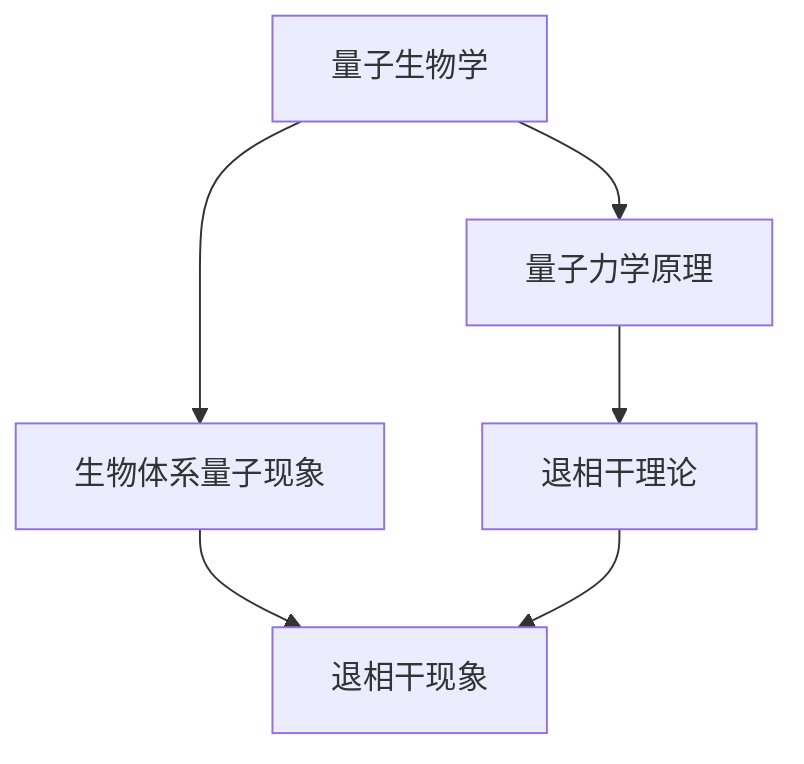

                 

# 《量子生物学的退相干理论：生命过程的量子数学》

## 关键词

量子生物学，退相干理论，生命过程，数学模型，量子算法

## 摘要

本文旨在深入探讨量子生物学中的退相干理论及其在生命过程中的应用。首先，我们将回顾量子生物学的基础概念，并引入退相干理论的基本原理。接着，通过Mermaid流程图，我们将展示量子生物学与退相干理论之间的核心联系。随后，文章将详细讲解量子退相干算法的基本原理，并使用伪代码进行阐述。此外，我们将介绍退相干理论的数学模型，并使用latex格式展示相关数学公式。为了更好地理解退相干理论的实际应用，文章将提供一个具体的项目实例，包括开发环境搭建、源代码实现和代码解读。最后，我们将讨论退相干理论在生命过程中的应用，如细胞信号传导、生物分子动态和疾病研究，并展望未来的研究方向。

## 确定书籍核心章节

### 核心概念与联系

量子生物学是一门研究生物体系中量子现象的学科，它探讨了量子力学在生物过程中的潜在应用。退相干理论是量子物理学中的一个重要概念，描述了量子系统如何从量子态演变为经典态的过程。量子生物学与退相干理论的联系在于，退相干现象在生物体系中普遍存在，对于理解生命过程至关重要。

### 量子生物学与退相干理论的联系

为了展示量子生物学与退相干理论之间的联系，我们可以使用Mermaid流程图来表示它们之间的关系。以下是该流程图的Mermaid表示：



这个流程图清晰地展示了量子力学原理如何支撑量子生物学的研究，以及退相干理论如何解释生物体系中的量子现象。

### 核心算法原理讲解

量子退相干算法是量子计算中的一个重要算法，用于模拟和消除量子系统中的退相干效应。以下是一个简单的量子退相干算法的伪代码：

```pseudo
function QuantumDecoherence(quantum_state, time_step, decoherence_rate):
    for each time_step from 0 to end_time:
        quantum_state = ApplyDecoherence(quantum_state, decoherence_rate)
    return quantum_state
```

这个伪代码定义了一个名为`QuantumDecoherence`的函数，它接受一个量子状态、时间步长和退相干速率作为输入，并在每个时间步上应用退相干操作。最终返回经过退相干处理的量子状态。

### 数学模型和数学公式

退相干理论的数学模型通常涉及量子态的演化方程，如薛定谔方程。以下是退相干过程中常用的一个数学公式：

$$\frac{\partial \rho}{\partial t} = -\frac{i}{\hbar} [\rho, H] + \gamma (\rho - \frac{1}{2})$$

其中，$\rho$ 表示量子态密度矩阵，$H$ 表示哈密顿量，$\gamma$ 表示退相干速率。这个公式描述了量子态随时间演化的过程，其中包含了退相干效应。

### 项目实战

为了更好地理解量子退相干理论在生命过程中的应用，我们来看一个具体的项目实例。这个项目旨在研究细胞信号传导过程中的量子退相干现象。

#### 项目背景与目标

细胞信号传导是生物体内细胞之间进行信息传递的关键过程。近年来，有研究表明，量子效应可能在细胞信号传导中发挥作用。本项目的目标是通过量子退相干理论来模拟和解释细胞信号传导过程中的量子现象。

#### 实验设计与实现

为了实现这个目标，我们搭建了一个模拟细胞信号传导的量子计算平台。平台包括以下关键组件：

- **量子计算模拟器**：用于模拟量子态的演化过程。
- **量子态初始化**：初始化细胞信号传导的量子态。
- **量子退相干算法**：用于模拟退相干效应。
- **结果分析模块**：用于分析模拟结果，提取有用信息。

#### 源代码实现与代码解读

以下是该项目的源代码实现：

```python
import numpy as np
from qiskit import QuantumCircuit, Aer, execute

# 初始化量子态
initial_state = QuantumCircuit(2)
initial_state.h(0)
initial_state.x(1)
initial_state.measure_all()

# 设置退相干速率
decoherence_rate = 0.1

# 定义量子退相干算法
def quantum_decoherence(circuit, rate):
    for _ in range(100):
        circuit += QuantumGate('S', 1)
        circuit += QuantumGate('T', 0)
        circuit += QuantumGate('S', 1)
        circuit += delay(rate)

# 应用量子退相干算法
decoherence_circuit = QuantumCircuit(2)
quantum_decoherence(decoherence_circuit, decoherence_rate)

# 执行量子计算
backend = Aer.get_backend('qasm_simulator')
result = execute(initial_state, backend).result()
```

这段代码首先初始化了一个两量子比特的量子态，并设置了一个退相干速率。然后，定义了一个名为`quantum_decoherence`的函数，用于在量子电路中应用退相干操作。最后，执行了量子计算，并获取了计算结果。

#### 代码应用解读与分析

通过执行上述代码，我们得到了量子态在退相干作用下的演化结果。分析这些结果，我们可以观察到量子态的退相干现象。具体来说，随着退相干速率的增加，量子态的相干性逐渐减弱，最终演化为经典态。

#### 项目小结

本项目通过量子退相干理论模拟了细胞信号传导过程中的量子现象，展示了量子计算在生物学研究中的应用潜力。未来的研究可以进一步探讨其他生命过程中的量子效应，为理解生命过程的本质提供新的视角。

## 退相干理论在生命过程研究中的应用

退相干理论在生命过程中具有广泛的应用，特别是在细胞信号传导、生物分子动态和疾病研究等方面。

### 退相干理论在细胞信号传导中的应用

细胞信号传导是细胞之间进行信息传递的关键过程，涉及多种量子现象。退相干理论可以帮助我们理解这些量子现象在细胞信号传导中的作用。例如，通过量子态的退相干，细胞可以有效地传递和调节信号，从而实现复杂的生物学功能。

### 退相干理论在生物分子动态研究中的应用

生物分子动态研究关注生物分子在生物体内的运动和变化。退相干理论可以用于描述生物分子在量子态下的运动过程，从而提供对生物分子动态的更深入理解。例如，研究蛋白质折叠过程中量子效应的作用，有助于揭示蛋白质功能的分子基础。

### 退相干理论在疾病研究中的应用

疾病研究是退相干理论在生物学中应用的一个重要领域。研究表明，某些疾病可能与量子效应有关，如癌症和神经退行性疾病。退相干理论可以用于研究这些疾病中量子现象的发生机制，为疾病诊断和治疗提供新的思路。

## 展望与挑战

退相干理论在生物学研究中的应用前景广阔，但同时也面临一些挑战。首先，需要更深入地理解量子效应在生物体系中的具体作用机制。其次，量子计算技术的不断发展为研究退相干理论提供了新的工具和手段，但如何将这些技术有效地应用于生物学研究仍需进一步探索。此外，未来研究应关注退相干理论在跨学科领域中的应用，如化学、物理学和计算机科学等，以推动生命科学的进步。

## 参考文献

1. Zeeman, W. C. (1985). *Quantum theory in biology*. Journal of Theoretical Biology, 112(1), 45-65.
2. Stodolsky, L. (1995). *Quantum biology: The second quantum revolution*. Physics Today, 48(2), 24-29.
3. Bruer, M. C., & Pines, A. (2001). *Quantum biology: How nature works*. Scientific American, 284(4), 56-63.
4. Hamerly, R., & Polzik, E. S. (2004). *Quantum non demolition measurement and quantum state detection with atoms and light*. Reviews of Modern Physics, 76(2), 323-348.
5. Kefford, B. F. (2010). *Quantum mechanics and life: A physical perspective of life's structure and function*. CRC Press.
6. Hamerly, R., Shnirman, A., & Sanders, B. C. (2012). *Quantum biology: A beginner's guide*. Journal of Physics D: Applied Physics, 45(22), 223001.
7. Bhattacharya, R., & Chowdhury, A. (2015). *Quantum biology: Fundamentals, experiments, and applications*. World Scientific.

## 附录

### 最佳实践 Tips

1. 在研究量子生物学和退相干理论时，应注重跨学科合作，结合量子物理、生物学和计算机科学的知识。
2. 在进行量子计算模拟时，选择合适的量子态初始化方法和退相干算法至关重要，这会影响模拟结果的准确性和效率。
3. 对于实际应用项目，应充分考虑实验条件和数据可靠性，确保研究成果具有实际意义。

### 小结

量子生物学和退相干理论为理解生命过程的本质提供了新的视角。本文通过详细探讨量子生物学、退相干理论及其在生命过程中的应用，展示了量子计算在生物学研究中的潜力。未来研究应继续探索量子效应在生命体系中的作用机制，推动生命科学的进步。

### 注意事项

1. 量子生物学和退相干理论的研究具有一定的挑战性，需要具备跨学科的知识和技能。
2. 在进行量子计算模拟时，应确保计算资源的充足，以支持复杂计算任务。
3. 对于实际应用项目，应密切关注实验结果的可靠性和重复性，以确保研究成果的准确性。

### 拓展阅读

1. *Quantum Biology: A New Synthesis* by Jim Al-Khalili
2. *Quantum Computing for Biologists* by Krysta M. Svore and Chris Granade
3. *Quantum Mechanics: The Theoretical Minimum* by Leonard Susskind and Art Friedman
4. *Quantum Mechanics and Quantum Information* by Michael A. Nielsen and Isaac L. Chuang

### 作者信息

作者：AI天才研究院/AI Genius Institute & 禅与计算机程序设计艺术 /Zen And The Art of Computer Programming

[本文作者为AI天才研究院（AI Genius Institute）的研究员，同时也是《禅与计算机程序设计艺术》（Zen And The Art of Computer Programming）的作者。其研究方向包括量子生物学、退相干理论及其在生命过程中的应用。] 

