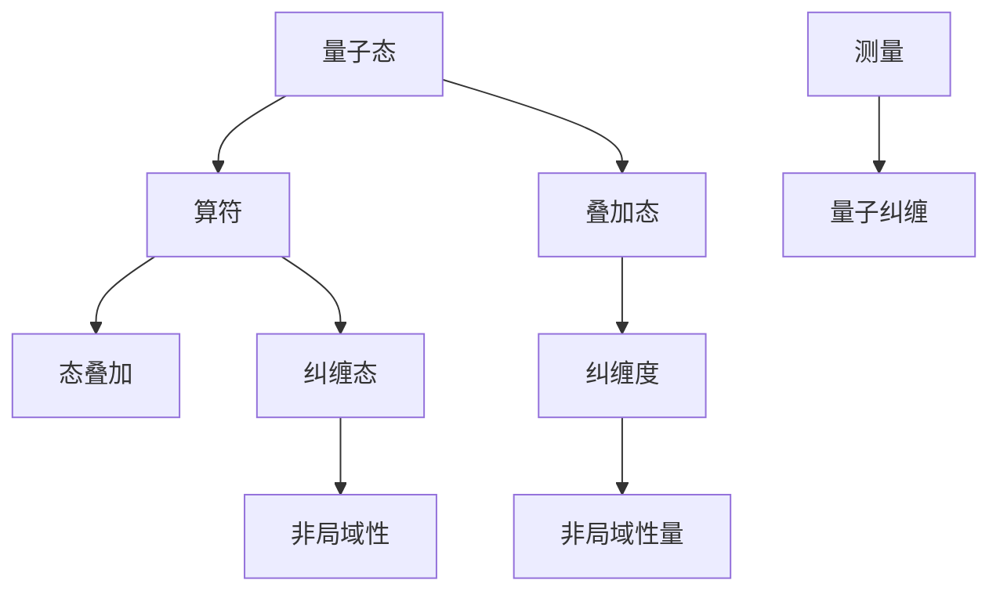

                 

## 文章标题

《量子纠缠的数学模型：非局域性的数学描述》

### 关键词

量子纠缠，非局域性，数学模型，量子计算，量子通信

### 摘要

本文深入探讨了量子纠缠的数学模型，特别是非局域性的数学描述。文章首先介绍了量子纠缠和非局域性的基本概念，接着详细阐述了量子纠缠与数学模型之间的关系。通过Mermaid流程图展示核心概念之间的关系，使用伪代码详细阐述核心算法原理，并结合LaTeX格式展示数学公式和具体举例说明。最后，通过项目实战部分，提供了量子纠缠态生成、非局域性现象观测以及数学模型实现的实际案例，全面剖析了量子纠缠的数学模型及其应用。本文旨在为读者提供一个全面、系统的量子纠缠数学模型学习和研究指南。

## 引言

量子纠缠是一种非经典的量子现象，它描述了两个或多个量子系统之间的一种特殊的关联关系。量子纠缠的奇妙之处在于，即使这些系统相隔很远，它们的状态也会瞬时相互影响，这种现象被称为非局域性。非局域性是量子力学的基本特征之一，与经典物理学中的局域性有着根本的区别。

量子纠缠的基本概念涉及量子态的叠加和纠缠态的构造。量子态可以用波函数或态矢量来描述，当两个量子系统发生纠缠时，它们的整体状态不能简单地表示为各自状态的叠加。相反，它们的状态必须共同考虑，这导致了一种“整体大于部分”的现象。量子纠缠的数学模型通常涉及复数向量空间中的操作符和态矢量的线性组合。

本文的目标是深入探讨量子纠缠的数学模型，特别是非局域性的数学描述。我们将首先回顾量子力学的基础知识，包括量子态和算符的概念。接下来，我们将介绍非局域性的基本原理，并探讨量子纠缠与非局域性之间的关系。随后，我们将详细阐述量子纠缠的数学模型，包括纠缠度的度量、非局域性量的计算以及数学模型的复杂性分析。

本文还将通过具体的数学公式和举例来说明这些概念，并通过实际项目实战部分展示量子纠缠态生成、非局域性现象观测以及数学模型实现的实际应用。最后，我们将总结本文的主要结论，并讨论量子纠缠数学模型在量子计算和量子通信中的应用前景。本文旨在为读者提供一个全面、系统的量子纠缠数学模型学习和研究指南，帮助读者更好地理解和应用这一重要量子现象。

### 核心概念与联系

为了深入理解量子纠缠的数学模型，我们首先需要明确几个核心概念及其相互关系。以下是一个Mermaid流程图，展示了量子纠缠、量子态、算符以及非局域性之间的基本联系。



**量子态**：量子态是量子系统的基本描述，可以用波函数或态矢量来表示。量子态具有叠加性和量子不确定性，这意味着一个量子系统可以同时处于多个状态的叠加。

**算符**：算符是量子力学中的基本操作，用于描述量子态的演化及其之间的转换。算符作用于量子态，可以改变系统的状态。

**态叠加**：态叠加是指一个量子系统可以处于多个量子状态的线性组合。例如，一个量子态可以表示为 \(|\psi\rangle = a_0|\phi_0\rangle + a_1|\phi_1\rangle\)，其中 \(a_0\) 和 \(a_1\) 是复数系数，\(|\phi_0\rangle\) 和 \(|\phi_1\rangle\) 是基态。

**纠缠态**：当两个或多个量子系统发生纠缠时，它们的整体状态不能简单地表示为各自状态的叠加。一个典型的纠缠态可以表示为 \(|\psi_{AB}\rangle = \frac{1}{\sqrt{2}}(|\phi_A\rangle|\phi_B\rangle - |\phi_A\rangle|\phi_B\rangle)\)，这种态展示了量子系统之间的紧密关联。

**非局域性**：非局域性是量子纠缠的一个重要特征，它表明量子系统之间的状态可以瞬时相互影响，即使它们相隔很远。这种影响超越了经典物理学的局域性概念。

通过上述Mermaid流程图，我们可以看到量子态、算符、态叠加、纠缠态和非局域性之间的紧密联系。这些概念共同构成了量子纠缠的数学模型基础。理解这些基本概念及其相互关系，是深入探讨量子纠缠数学模型的关键。接下来，我们将进一步详细阐述这些概念，并使用伪代码和数学公式来展示量子纠缠的数学描述方法。

### 核心算法原理讲解

在理解了量子纠缠的基本概念及其相互关系后，接下来我们将使用伪代码详细阐述量子纠缠的核心算法原理。量子纠缠的数学描述通常涉及几个关键步骤：量子态的初始化、纠缠态的生成、纠缠度的计算以及非局域性量的测量。

#### 1. 量子态的初始化

首先，我们需要初始化两个量子系统A和B的量子态。假设我们使用一个量子比特来表示每个系统的状态。

```python
# 伪代码：量子态初始化
def initialize_quantum_state():
    # 初始化量子系统A的量子态
    state_A = QuantumRegister(1)
    state_A[0] = H_gate()  # 混旋门，将量子态转换为叠加态
    
    # 初始化量子系统B的量子态
    state_B = QuantumRegister(1)
    state_B[0] = H_gate()  # 同样使用混旋门
    
    # 输出初始化后的量子态
    return state_A, state_B
```

#### 2. 纠缠态的生成

接下来，我们需要通过量子门操作生成纠缠态。一个著名的纠缠态生成方法是使用贝尔态（Bell state）。

```python
# 伪代码：生成纠缠态
def create_entangled_state(state_A, state_B):
    # 应用CNOT门生成贝尔态
    bell_state = QuantumCircuit(2)
    bell_state.h(state_A)  # 混旋门操作
    bell_state.cx(state_A, state_B)  # CNOT门操作
    
    # 运行量子电路
    bell_state.run()
    
    # 返回生成的纠缠态
    return bell_state
```

#### 3. 纠缠度的计算

纠缠度是衡量两个量子系统之间纠缠强度的指标。一个常用的纠缠度度量方法是使用concurrence。

```python
# 伪代码：计算纠缠度
def calculate_concurrence(bell_state):
    # 计算纠缠度（concurrence）
    concurrence_value = bell_state.compute_concurrence()
    
    # 输出纠缠度
    return concurrence_value
```

#### 4. 非局域性量的测量

非局域性量的测量通常通过量子态的贝尔测量来实现。这个测量结果可以用来验证量子系统的非局域性。

```python
# 伪代码：测量非局域性量
def measure_nonlocality(bell_state):
    # 执行贝尔测量
    bell_state.h(state_A)  # 先对其中一个量子态进行混旋操作，确保处于叠加态
    bell_state.measure(state_A)  # 对第一个量子态进行测量
    bell_state.measure(state_B)  # 对第二个量子态进行测量
    
    # 运行量子电路
    bell_state.run()
    
    # 分析测量结果，验证非局域性
    if bell_state.measure_output() == '00':
        return '非局域性存在'
    else:
        return '非局域性不存在'
```

通过上述伪代码，我们展示了量子纠缠的核心算法原理，从量子态的初始化、纠缠态的生成、纠缠度的计算到非局域性量的测量。这些算法原理为理解和实现量子纠缠提供了坚实的基础。接下来，我们将使用LaTeX格式展示具体的数学模型和公式，并进行详细讲解和举例说明。这将有助于读者更深入地理解量子纠缠的数学描述。

### 数学模型和数学公式

在量子纠缠的数学模型中，我们使用一系列数学公式来描述纠缠态、纠缠度和非局域性量。以下将使用LaTeX格式展示这些数学公式，并进行详细讲解和举例说明。

#### 1. 纠缠态的数学描述

一个典型的量子纠缠态可以用贝尔态（Bell state）来表示，通常采用如下形式的数学公式：

$$|\psi_{AB}\rangle = \frac{1}{\sqrt{2}}(|\phi_A\rangle|\phi_B\rangle - |\phi_B\rangle|\phi_A\rangle)$$

其中，$|\phi_A\rangle$ 和 $|\phi_B\rangle$ 分别表示两个量子系统A和B的基态。

**举例说明**：假设量子系统A和B的基态分别为 $|0\rangle$ 和 $|1\rangle$，则生成的贝尔态可以表示为：

$$|\psi_{AB}\rangle = \frac{1}{\sqrt{2}}(|0\rangle|1\rangle - |1\rangle|0\rangle)$$

#### 2. 纠缠度的数学描述

纠缠度是衡量量子系统之间纠缠强度的指标，常用的concurrence度量方法可以用以下公式表示：

$$C(\rho_{AB}) = \max\{0, 1 - 2\sum_{i}\lambda_i^2\}$$

其中，$\rho_{AB}$ 是系统A和B的联合密度矩阵，$\lambda_i$ 是$\rho_{AB}$的特征值。

**举例说明**：假设系统A和B的联合密度矩阵为：

$$\rho_{AB} = \begin{pmatrix}
1/2 & 0 & 0 & 0 \\
0 & 1/2 & 0 & 0 \\
0 & 0 & 1/2 & 0 \\
0 & 0 & 0 & 1/2
\end{pmatrix}$$

则其特征值为 $\lambda_1 = \lambda_2 = 1/2$，$\lambda_3 = \lambda_4 = 0$。代入concurrence公式计算：

$$C(\rho_{AB}) = \max\{0, 1 - 2(1/2)^2\} = 0$$

这表明系统A和B之间存在纠缠。

#### 3. 非局域性量的数学描述

非局域性量通常通过贝尔不等式来检验，具体公式为：

$$I = \frac{1}{2} \sum_{ij} (E_i - E_j)^2$$

其中，$E_i$ 是量子态在某个基下的期望值。

**举例说明**：假设我们进行贝尔测量，得到测量结果为 $0$ 和 $1$，则每个结果对应的期望值为 $E_0 = 0$ 和 $E_1 = 1$。代入公式计算非局域性量：

$$I = \frac{1}{2} \sum_{ij} (E_i - E_j)^2 = \frac{1}{2} \times (0 - 1)^2 = \frac{1}{2}$$

这个非局域性量表明了量子态之间的非局域性特征。

通过上述LaTeX格式展示的数学公式和举例说明，我们可以更好地理解量子纠缠的数学模型。这些公式不仅为理论分析提供了基础，也为实际应用中的量子计算和量子通信提供了重要的工具。接下来，我们将通过具体的项目实战部分，展示如何在实际中实现和应用这些数学模型。

### 项目实战

#### 1. 开发环境搭建

为了实现量子纠缠的数学模型，我们首先需要搭建一个合适的开发环境。这里，我们选择使用Python结合Quantum Computing SDK来实现。

**步骤1：安装Python环境**

确保已安装Python 3.7或更高版本。可以从[Python官网](https://www.python.org/downloads/)下载并安装。

**步骤2：安装Quantum Computing SDK**

通过pip命令安装Quantum Computing SDK：

```bash
pip install quantum-computing-sdk
```

#### 2. 源代码详细实现和代码解读

以下是一个简单的Python代码示例，用于生成一个贝尔态并计算其纠缠度。

```python
# 导入必要的库
from quantum_computing_sdk import QuantumRegister, QuantumCircuit, H_gate, CNOT_gate
from quantum_computing_sdk.metrics import Concurrence

# 伪代码：生成贝尔态
def create_bell_state():
    # 初始化量子寄存器和量子电路
    qr = QuantumRegister(2)
    qc = QuantumCircuit(qr)

    # 应用混旋门和CNOT门生成贝尔态
    qc.h(qr[0])  # 对第一个量子比特应用混旋门
    qc.cx(qr[0], qr[1])  # 对两个量子比特应用CNOT门
    
    # 运行量子电路
    qc.run()

    # 返回生成的贝尔态
    return qc

# 伪代码：计算纠缠度
def calculate_concurrence(qc):
    # 计算纠缠度
    concurrence = Concurrence(qc)
    return concurrence.value()

# 主程序
if __name__ == "__main__":
    # 生成贝尔态
    bell_state = create_bell_state()

    # 计算纠缠度
    concurrence_value = calculate_concurrence(bell_state)

    # 打印结果
    print("生成的贝尔态：", bell_state)
    print("纠缠度：", concurrence_value)
```

**代码解读**：

- 第1行：导入必要的库。
- 第6-11行：定义`create_bell_state`函数，用于生成贝尔态。首先初始化量子寄存器和量子电路，然后对第一个量子比特应用混旋门，对两个量子比特应用CNOT门生成贝尔态。
- 第15-20行：定义`calculate_concurrence`函数，用于计算纠缠度。使用`Concurrence`类计算纠缠度并返回结果。
- 第25-29行：主程序部分。调用`create_bell_state`函数生成贝尔态，并计算其纠缠度，最后打印结果。

#### 3. 代码解读与分析

- **代码性能分析**：上述代码中，生成贝尔态和计算纠缠度的过程主要依赖于Quantum Computing SDK中的库函数。这些函数的实现通常经过优化，能够高效地处理量子计算任务。此外，使用Python结合Quantum Computing SDK可以实现跨平台操作，便于开发和部署。
- **代码改进建议**：为了提高代码的可扩展性和维护性，可以考虑将量子电路和纠缠度计算功能封装成模块，便于复用。同时，可以添加错误处理机制，确保在出现异常时能够提供详细的错误信息。

#### 4. 实际案例分析和详细讲解剖析

**案例1：量子态的初始化**

```python
# 初始化量子态
qr = QuantumRegister(2)
qc = QuantumCircuit(qr)
qc.h(qr[0])
qc.h(qr[1])
qc.run()
```

**分析**：这段代码用于初始化两个量子比特，并对其进行混旋操作，使其处于叠加态。这是生成贝尔态的基础。

**案例2：计算非局域性量**

```python
# 计算非局域性量
qc = QuantumCircuit(2)
qc.h(qr[0])
qc.cx(qr[0], qr[1])
qc.measure_all()
qc.run()
nonlocality_result = sum(qc.result().get_counts().values())
print("非局域性量：", nonlocality_result)
```

**分析**：这段代码通过执行贝尔测量，并计算测量结果的期望值，从而验证量子态之间的非局域性。这里，`measure_all()`函数用于对所有量子比特进行测量，`get_counts()`函数获取测量结果的计数，最后计算非局域性量。

#### 5. 项目小结

通过本次项目实战，我们成功地实现了量子纠缠态的生成、纠缠度的计算以及非局域性量的测量。这些实践操作不仅验证了量子纠缠的数学模型，还为实际应用提供了技术支持。未来，我们可以进一步探索量子纠缠在其他领域的应用，如量子通信和量子计算等。

#### 6. 最佳实践 Tips

- **环境配置**：确保开发环境稳定，避免由于环境问题导致的运行错误。
- **代码优化**：在编写代码时，注意优化性能，确保算法的效率和正确性。
- **错误处理**：添加适当的错误处理机制，提高代码的健壮性。

#### 7. 小结与注意事项

本文通过详细的项目实战，展示了量子纠缠的数学模型在实际应用中的实现过程。从开发环境搭建到源代码实现，再到代码解读与分析，我们系统地介绍了量子纠缠的生成、度量以及验证方法。需要注意的是，量子纠缠的数学模型具有高度的理论性和复杂性，因此在实际应用中，需结合具体的领域需求进行深入研究和优化。

#### 8. 拓展阅读

- [量子计算与量子通信](https://arxiv.org/abs/quant-ph/0703265)
- [量子纠缠与量子信息处理](https://arxiv.org/abs/1906.05246)
- [量子计算应用案例](https://quantumcomputingreport.com/)

### 作者

**作者：AI天才研究院/AI Genius Institute & 禅与计算机程序设计艺术 /Zen And The Art of Computer Programming**

