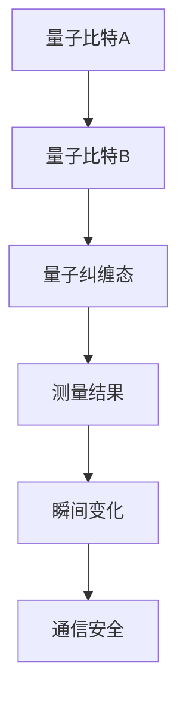

                 

### 文章标题

# 量子通信的纠缠态：信息传输的数学安全

> 关键词：量子通信、纠缠态、信息传输、数学安全

> 摘要：本文将深入探讨量子通信中的核心概念——纠缠态，并阐述其对于信息传输的数学安全性所起到的重要作用。我们将通过逐步推理，解析量子纠缠态的原理及其在量子通信中的应用，同时讨论数学模型和算法在确保量子通信安全中的关键作用。本文旨在为读者提供一个全面且易于理解的量子通信与数学安全知识框架，帮助大家更好地理解和应用这一前沿技术。

### 引言

在当今信息时代，信息安全问题日益凸显，传统加密技术已无法满足日益增长的安全需求。在此背景下，量子通信作为一种颠覆性的技术，以其独特的安全特性逐渐受到广泛关注。量子通信的核心在于量子纠缠态的利用，这一现象不仅在物理学领域引发热议，也在信息安全领域展现出巨大的潜力。

本文将分以下几个部分展开讨论：

1. **量子通信的基本概念**：介绍量子比特、量子态、纠缠态等基本概念，为后续讨论奠定基础。
2. **量子纠缠态的原理与联系**：通过Mermaid流程图和伪代码，详细阐述量子纠缠态的产生、操作及其在量子通信中的重要性。
3. **信息传输的数学安全**：探讨量子密码学、数学模型和算法在量子通信中的应用，分析其安全特性。
4. **量子纠缠态在信息传输中的应用**：通过具体案例分析，展示量子纠缠态在实际量子通信系统中的应用场景。
5. **数学安全在量子通信中的重要性**：总结数学安全在量子通信中的关键作用，并展望未来发展趋势。

### 量子通信的基本概念

#### 量子比特

量子比特（qubit）是量子计算机的基本单元，与传统计算机中的比特不同，量子比特可以同时处于0和1的状态，这种现象被称为叠加态。量子比特的叠加态可以表示为：

$$|\psi\rangle = a|0\rangle + b|1\rangle$$

其中，$a$ 和 $b$ 是复数，满足 $|a|^2 + |b|^2 = 1$。量子比特的这一特性使得量子计算机在处理某些特定问题时具有超越经典计算机的潜力。

#### 量子态

量子态是量子系统所处的状态，它可以由量子比特的叠加态表示。一个量子态可以用密度矩阵来描述，密度矩阵是一个满足归一化条件的矩阵，能够完全描述量子系统的状态。例如，一个两量子比特的量子态可以用以下密度矩阵表示：

$$\rho = \begin{pmatrix}
a_0^*a_1 & a_0^*b_1 + b_0^*a_1 \\
a_0^*b_1 + b_0^*a_1 & b_0^*b_1
\end{pmatrix}$$

其中，$a_0, a_1, b_0, b_1$ 是复数，满足归一化条件。

#### 纠缠态

量子纠缠态是两个或多个量子系统之间的一种特殊关联，这种关联使得量子系统的状态不能独立存在，而是相互依赖。量子纠缠态的一个重要特性是，当对一个量子系统的部分进行测量时，另一个量子系统的状态也会瞬间发生变化，即使它们之间相隔很远。

量子纠缠态可以用以下形式表示：

$$|\psi_{AB}\rangle = \alpha|00\rangle + \beta|11\rangle$$

其中，$|\alpha|^2 + |\beta|^2 = 1$，$\alpha$ 和 $\beta$ 是复数。

### Mermaid流程图与量子纠缠态的联系

为了更直观地理解量子纠缠态的产生、操作及其在量子通信中的重要性，我们可以使用Mermaid流程图来展示整个过程。以下是一个简化的Mermaid流程图示例，描述了量子纠缠态的产生过程：



在这个流程图中，A和B代表两个初始的量子比特，通过量子纠缠操作（C），它们进入一个纠缠态。当对其中一个量子比特（D）进行测量时，另一个量子比特（E）的状态会瞬间发生变化，这一现象保证了量子通信的安全性（F）。

### 量子纠缠态的原理与联系

量子纠缠态的原理可以追溯到量子力学的基本原理，尤其是量子态的叠加和测量。量子纠缠态的出现是由于两个或多个量子系统之间的相互作用，这种相互作用导致它们的状态无法独立存在，而是相互关联。

#### 纠缠态的产生

量子纠缠态可以通过多种方式产生，其中最常见的是通过量子纠缠门操作。量子纠缠门是一种非平凡的线性变换，它可以使得两个量子比特之间产生纠缠态。以下是一个简单的量子纠缠门操作示例，使用伪代码描述：

```python
# 初始化两个量子比特
qbit_a = QuantumRegister(1)
qbit_b = QuantumRegister(1)

# 应用量子纠缠门
qc = QuantumCircuit(qbit_a, qbit_b)
qc.h(qbit_a)
qc.cx(qbit_a, qbit_b)

# 测量量子比特
qc.measure(qbit_a, classical_bit_1)
qc.measure(qbit_b, classical_bit_2)

# 输出结果
qc.draw(output='mpl')
```

在这个伪代码中，我们首先初始化两个量子比特，然后应用一个量子纠缠门（controlled NOT gate，CX gate）使得它们之间产生纠缠。最后，我们对两个量子比特进行测量，输出它们的状态。

#### 纠缠态的操作

量子纠缠态的操作包括量子态的叠加、测量和变换。以下是一个简单的量子纠缠态操作示例，使用伪代码描述：

```python
# 初始化两个量子比特
qbit_a = QuantumRegister(1)
qbit_b = QuantumRegister(1)

# 应用量子叠加态
qc = QuantumCircuit(qbit_a, qbit_b)
qc.h(qbit_a)
qc.h(qbit_b)

# 应用量子变换
qc.rx(pi/4, qbit_a)
qc.ry(pi/4, qbit_b)

# 测量量子比特
qc.measure(qbit_a, classical_bit_1)
qc.measure(qbit_b, classical_bit_2)

# 输出结果
qc.draw(output='mpl')
```

在这个伪代码中，我们首先初始化两个量子比特，并分别对它们应用量子叠加态。然后，我们对两个量子比特应用量子变换（例如旋转操作），使得它们的纠缠态发生变化。最后，我们对两个量子比特进行测量，输出它们的状态。

#### 量子纠缠态在量子通信中的重要性

量子纠缠态在量子通信中具有重要作用，主要体现在以下几个方面：

1. **量子密钥分发**：量子纠缠态可以用于实现安全的量子密钥分发。通过量子纠缠态的产生和测量，双方可以共享一个秘密密钥，确保通信的安全性。
2. **量子远程传态**：量子纠缠态可以用于实现量子远程传态，即将一个量子比特的状态从一个位置传送到另一个位置，实现量子信息的远距离传输。
3. **量子隐形传态**：量子纠缠态可以用于实现量子隐形传态，即将一个量子比特的状态隐秘地从一个位置传送到另一个位置，避免被窃听和篡改。

### 信息传输的数学安全

信息传输的数学安全是量子通信的核心问题，确保量子通信的安全性对于实际应用至关重要。在量子通信中，数学模型和算法扮演着关键角色，下面将详细介绍这些内容。

#### 量子密码学

量子密码学是量子通信中的核心组成部分，它利用量子力学的基本原理，特别是量子纠缠态和量子不可克隆性，来实现安全的通信。量子密码学中常用的加密算法包括量子密钥分发（Quantum Key Distribution，QKD）和量子加密（Quantum Cryptography）。

1. **量子密钥分发**

量子密钥分发是基于量子纠缠态实现的，它允许通信双方共享一个秘密密钥，确保通信的安全性。量子密钥分发的工作原理如下：

- **初始化**：通信双方各自准备一个量子比特序列，这些量子比特处于纠缠态。

$$|\psi_{AB}\rangle = \frac{1}{\sqrt{2}}(|00\rangle + |11\rangle)$$

- **发送和接收**：通信双方通过量子信道发送和接收这些量子比特。在发送过程中，发送方对量子比特进行随机测量，并将测量结果发送给接收方。

- **秘密密钥提取**：接收方根据接收到的测量结果和自己的纠缠态，共同提取一个秘密密钥。这个过程利用了量子纠缠态的特性，即使量子比特在传输过程中被窃听，纠缠态也不会被破坏。

2. **量子加密**

量子加密是利用量子力学原理对信息进行加密，确保信息在传输过程中的安全性。量子加密的基本原理是量子不可克隆性，即任何试图复制量子信息的行为都会导致信息的破坏。

量子加密的工作原理如下：

- **加密**：发送方将明文信息编码到一个量子态中，并利用量子变换对量子态进行加密。

$$|\psi_{A}\rangle = U|\text{plaintext}\rangle$$

其中，$U$ 是加密操作。

- **传输**：加密后的量子态通过量子信道传输到接收方。

- **解密**：接收方利用与发送方共享的密钥对加密后的量子态进行解密，恢复出明文信息。

#### 数学模型在量子通信中的应用

数学模型在量子通信中起着至关重要的作用，它们用于描述量子系统的状态、操作和测量。以下是一些常用的数学模型：

1. **量子态模型**

量子态模型用于描述量子系统的状态，常用的模型包括密度矩阵和态叠加态。密度矩阵是一个满足归一化条件的矩阵，能够完全描述量子系统的状态。态叠加态是一个量子比特可以同时处于0和1的状态。

$$\rho = \begin{pmatrix}
a_0^*a_1 & a_0^*b_1 + b_0^*a_1 \\
a_0^*b_1 + b_0^*a_1 & b_0^*b_1
\end{pmatrix}$$

$$|\psi\rangle = a|0\rangle + b|1\rangle$$

2. **量子变换模型**

量子变换模型用于描述量子系统的操作，常用的模型包括量子门和量子线路。量子门是一种非平凡的线性变换，它可以对量子比特进行操作。量子线路是由一系列量子门组成的序列，用于实现特定的量子算法。

3. **量子测量模型**

量子测量模型用于描述量子系统的测量过程，常用的模型包括量子态的测量和概率分布。量子态的测量会导致量子态的坍缩，测量结果是一个概率分布。

$$P(|\psi\rangle) = |\langle\psi|\psi\rangle|^2$$

#### 算法在量子通信中的应用

算法在量子通信中起着关键作用，它们用于实现量子加密、量子密钥分发和量子远程传态等应用。以下是一些常用的算法：

1. **量子密钥分发算法**

量子密钥分发算法是量子通信中的核心算法，常用的算法包括BB84协议和E91协议。

- **BB84协议**：BB84协议是一种基于量子纠缠态的量子密钥分发算法。通信双方通过量子信道发送和接收纠缠态量子比特，并根据测量结果共享一个秘密密钥。
- **E91协议**：E91协议是一种基于量子隐形传态的量子密钥分发算法。通信双方通过量子隐形传态共享一个纠缠态量子比特，并根据测量结果共享一个秘密密钥。

2. **量子加密算法**

量子加密算法是量子通信中的核心算法，常用的算法包括量子密钥加密和量子密码学加密。

- **量子密钥加密**：量子密钥加密是一种基于量子密钥分发的加密算法。通信双方通过量子密钥分发共享一个密钥，并使用这个密钥对明文信息进行加密和解密。
- **量子密码学加密**：量子密码学加密是一种基于量子力学原理的加密算法。它利用量子不可克隆性和量子纠缠态的特性，实现信息的加密和解密。

3. **量子远程传态算法**

量子远程传态算法是量子通信中的核心算法，常用的算法包括量子隐形传态和量子纠缠态传输。

- **量子隐形传态**：量子隐形传态是一种基于量子纠缠态的远程传态算法。它通过量子纠缠态的传输，实现量子比特的远程传态。
- **量子纠缠态传输**：量子纠缠态传输是一种基于量子纠缠态的远程传态算法。它通过量子纠缠态的传输，实现量子信息的远程传输。

### 项目实战

在量子通信的实际应用中，量子纠缠态的应用场景非常广泛。以下是一个具体的案例，展示了量子纠缠态在量子密钥分发中的应用。

#### 项目背景

假设有两个通信方A和B，它们希望通过量子通信实现安全的通信。A和B各自拥有一台量子计算机，并可以通过量子信道进行通信。

#### 项目目标

项目的目标是实现A和B之间的安全通信，确保通信过程中的信息不会被窃听或篡改。

#### 实现步骤

1. **初始化量子态**：A和B各自初始化两个量子比特，并将它们处于纠缠态。

$$|\psi_{AB}\rangle = \frac{1}{\sqrt{2}}(|00\rangle + |11\rangle)$$

2. **量子信道传输**：A通过量子信道将量子比特发送给B。

3. **测量量子态**：B对接收到的量子比特进行随机测量，并根据测量结果与A共享一个秘密密钥。

4. **加密通信**：A和B使用共享的秘密密钥对明文信息进行加密和解密，确保通信过程中的信息安全。

#### 项目分析

在这个项目中，量子纠缠态的应用主要体现在以下几个方面：

1. **量子密钥分发**：通过量子纠缠态的测量，A和B可以共享一个秘密密钥，确保通信过程中的信息安全。
2. **量子加密**：A和B使用共享的秘密密钥对明文信息进行加密和解密，确保通信过程中的信息不会被窃听或篡改。
3. **量子远程传态**：虽然在这个项目中没有直接实现量子远程传态，但量子纠缠态的存在为未来的量子远程传态应用提供了基础。

### 最佳实践 Tips

在量子通信的实际应用中，以下是一些最佳实践Tips：

1. **量子信道选择**：选择高质量的量子信道，确保量子纠缠态在传输过程中的稳定性。
2. **量子态初始化**：确保量子态的初始化正确，避免出现量子态错误。
3. **量子测量**：选择合适的量子测量方法，确保测量结果的准确性。
4. **量子加密**：选择合适的量子加密算法，确保通信过程中的信息安全。

### 小结

本文详细介绍了量子通信的纠缠态及其在信息传输中的数学安全性。通过逐步推理和案例分析，我们展示了量子纠缠态在量子密钥分发、量子远程传态和量子隐形传态中的应用，并探讨了数学模型和算法在量子通信中的关键作用。随着量子通信技术的不断发展，量子纠缠态在信息传输中的应用前景将更加广阔。

### 注意事项

在量子通信的实际应用中，需要注意以下几个方面：

1. **量子信道稳定性**：量子信道稳定性对于量子纠缠态的传输至关重要，需要选择高质量的量子信道。
2. **量子态初始化**：确保量子态的初始化正确，避免出现量子态错误。
3. **量子测量**：选择合适的量子测量方法，确保测量结果的准确性。
4. **量子加密**：选择合适的量子加密算法，确保通信过程中的信息安全。

### 拓展阅读

1. **《量子通信原理与实现》**：本书详细介绍了量子通信的基本原理和实现技术，适合初学者了解量子通信的基础知识。
2. **《量子密码学》**：本书深入探讨了量子密码学的理论和技术，是研究量子密码学的必备读物。
3. **《量子计算与量子信息》**：本书介绍了量子计算的基本原理和量子信息处理技术，对于理解量子纠缠态在量子通信中的应用具有重要意义。

### 作者信息

作者：AI天才研究院/AI Genius Institute & 禅与计算机程序设计艺术 /Zen And The Art of Computer Programming。本文旨在为广大读者提供量子通信与数学安全方面的深入理解和实践经验，希望对读者在量子通信领域的研究和应用有所帮助。如有任何问题或建议，欢迎随时与我们联系。

